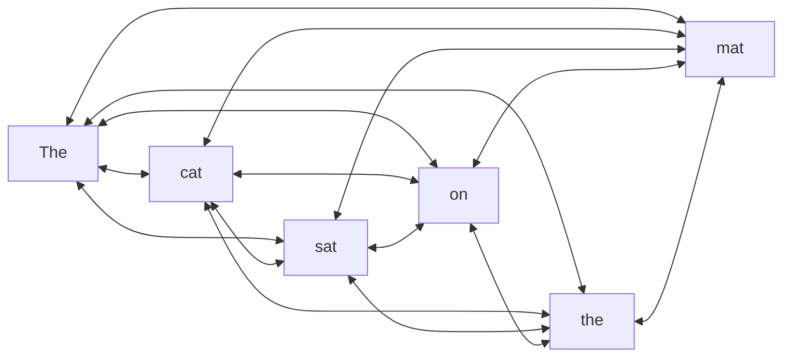
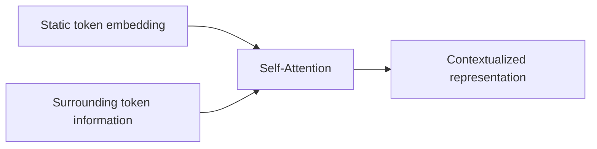
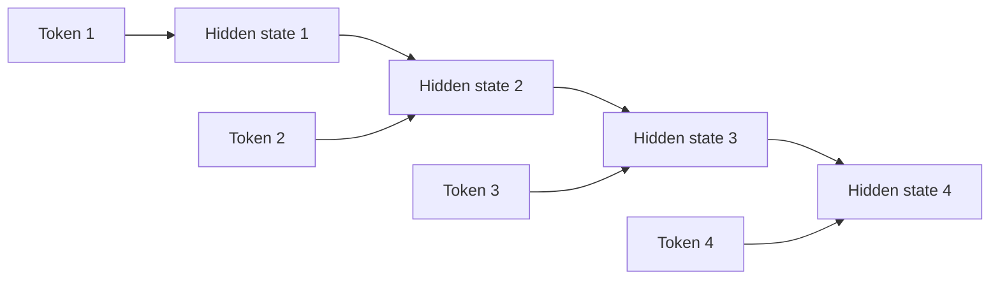
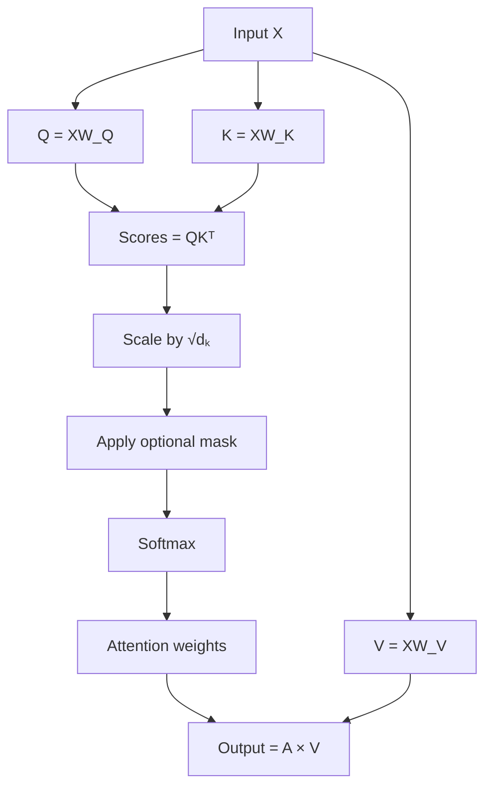
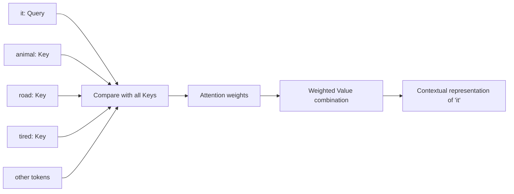
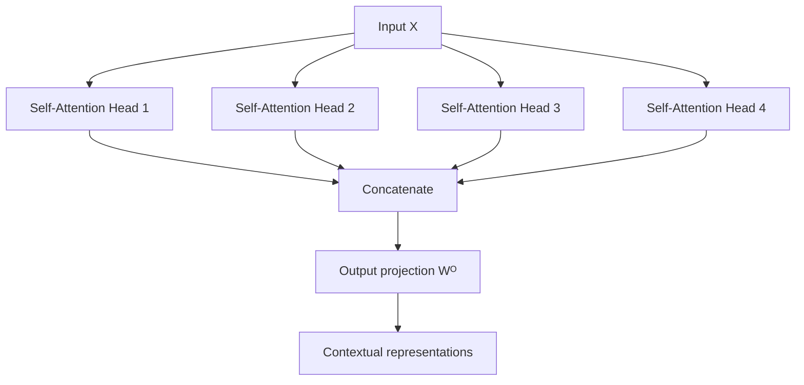
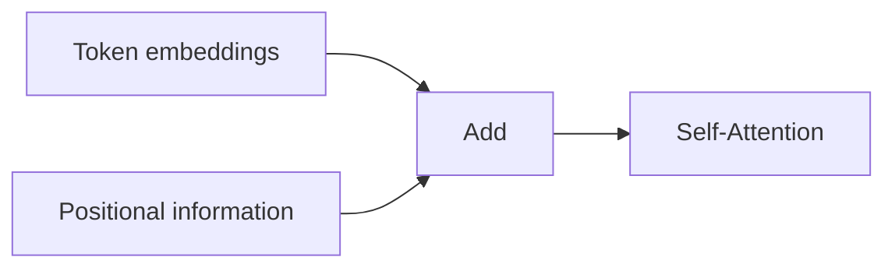
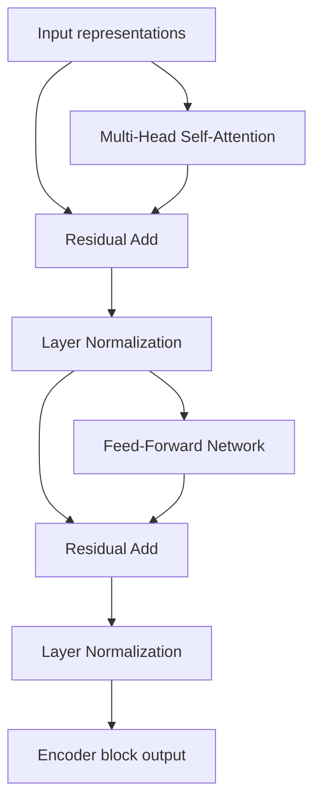

# 015 — Self-Attention

**Course:** 03 — Machine Learning and Deep Learning
**Module:** Module 07 — Deep Learning
**Content Group:** Transformer Concepts
**Roadmap Source:** Deep Learning / Transformer Concepts
**Lesson Type:** Deep Learning
**Order in Module:** 015
**Suggested Duration:** 24 minutes

---

## 1. Summary

This lesson explains **Self-Attention** in the context of AI and Data Science.

Self-Attention is a mechanism that allows every token in a sequence to directly examine every other token in the same sequence. Based on these relationships, the model creates a new context-aware representation for each token.

For example, consider the word `bank` in these sentences:

```text
She deposited money at the bank.
```

```text
They rested beside the river bank.
```

The initial embedding of `bank` may be identical in both sentences. After Self-Attention, its representation becomes different because it receives contextual information from words such as:

```text
money, deposited
```

or:

```text
river, beside
```

Self-Attention is the main building block of Transformer models such as:

* BERT
* GPT
* T5
* Vision Transformer
* Modern multimodal models
* Large language models

After this lesson, you should understand how Self-Attention creates contextual token representations using **Query**, **Key**, and **Value** vectors.

---

## 2. Learning Objectives

By the end of this lesson, you should be able to:

* Explain Self-Attention in your own words.
* Describe why static token embeddings are insufficient.
* Explain how Query, Key, and Value vectors are produced.
* Calculate scaled dot-product Self-Attention.
* Track the tensor shapes involved in Self-Attention.
* Distinguish Self-Attention from general Attention and Cross-Attention.
* Explain bidirectional and causal Self-Attention.
* Apply padding and causal masks correctly.
* Implement a basic Self-Attention layer in NumPy or PyTorch.
* Visualize Self-Attention weights as a heatmap.
* Identify the computational limitations of standard Self-Attention.

---

## 3. Prerequisites

Before studying Self-Attention, you should understand:

* Vectors and matrices
* Dot products
* Matrix multiplication
* Softmax
* Word embeddings
* Basic neural networks
* Encoder–decoder architectures
* The general Attention mechanism
* Basic PyTorch tensor operations

---

## 4. What Is Self-Attention?

Self-Attention allows each token in a sequence to collect information from all tokens in that same sequence.

Given an input sequence:

```text
The cat sat on the mat.
```

the model creates one contextual representation for each token.

For example:

* `cat` may attend to `sat`.
* `sat` may attend to `cat` and `mat`.
* `the` may attend to the noun that follows it.
* `mat` may attend to `on`.

The important idea is:

> Every token can interact directly with every other token.



In practice, the model does not treat every relationship equally. It learns an importance weight for every token pair.

---

## 5. Why Do We Need Self-Attention?

### 5.1 Static Embeddings Do Not Contain Context

A token embedding is usually obtained through a lookup table.

```text
token ID → embedding vector
```

The same token receives the same initial vector regardless of its context.

For example:

```text
The crane lifted the container.
```

```text
A crane stood near the lake.
```

The word `crane` has two different meanings:

* A machine
* A bird

However, the initial embedding lookup may produce the same vector for both occurrences.

Self-Attention updates the embedding using surrounding tokens.



After Self-Attention:

```text
crane + lifted + container
→ representation related to machinery
```

```text
crane + lake + stood
→ representation related to birds
```

---

### 5.2 RNNs Process Sequences Sequentially

RNNs and LSTMs process tokens one step at a time.



This creates several limitations:

* Training is difficult to parallelize.
* Information must pass through many recurrent steps.
* Long-distance relationships may weaken.
* Earlier information may be forgotten.

Self-Attention creates direct paths between tokens.

```text
Token 1 ───────────────────────→ Token 20
```

This makes long-distance dependencies easier to model.

---

## 6. Self-Attention Versus General Attention

General Attention can use different sources for Query, Key, and Value.

For Cross-Attention:

```text
Query → decoder representation
Key   → encoder representation
Value → encoder representation
```

For Self-Attention:

```text
Query → input sequence
Key   → the same input sequence
Value → the same input sequence
```

Mathematically:

$$
Q = XW_Q
$$

$$
K = XW_K
$$

$$
V = XW_V
$$

All three matrices are generated from the same input matrix $X$.

This is why the mechanism is called **Self-Attention**.

---

## 7. Input Representation

Assume a sequence contains $n$ tokens:

$$
x_1,x_2,\ldots,x_n
$$

Each token is represented by a vector of dimension $d_{\text{model}}$:

$$
x_i \in \mathbb{R}^{d_{\text{model}}}
$$

The complete input matrix is:

$$
X =
\begin{bmatrix}
x_1 \\
x_2 \\
\vdots \\
x_n
\end{bmatrix}
$$

with shape:

$$
X \in \mathbb{R}^{n \times d_{\text{model}}}
$$

For a batch of sequences:

$$
X \in
\mathbb{R}^{B \times L \times d_{\text{model}}}
$$

where:

* $B$ is the batch size.
* $L$ is the sequence length.
* $d_{\text{model}}$ is the embedding dimension.

---

## 8. Query, Key, and Value

Each token embedding is transformed into three different vectors:

* Query
* Key
* Value

These vectors are created using trainable projection matrices:

$$
Q = XW_Q
$$

$$
K = XW_K
$$

$$
V = XW_V
$$

where:

$$
W_Q \in \mathbb{R}^{d_{\text{model}} \times d_k}
$$

$$
W_K \in \mathbb{R}^{d_{\text{model}} \times d_k}
$$

$$
W_V \in \mathbb{R}^{d_{\text{model}} \times d_v}
$$

---

### 8.1 Query

The Query represents the information a token is looking for.

A useful interpretation is:

```text
What information do I need from the other tokens?
```

For example, the Query of the pronoun `it` may search for the noun to which it refers.

---

### 8.2 Key

The Key represents the information a token can be matched against.

A useful interpretation is:

```text
What kind of information do I contain?
```

The Query of one token is compared with the Keys of all tokens.

---

### 8.3 Value

The Value contains the information that will actually be transferred.

A useful interpretation is:

```text
What information should I contribute if I am relevant?
```

Keys are used for matching. Values are used for aggregation.

---

### 8.4 Database Analogy

Self-Attention can be compared to searching a database:

```text
Query = search request
Key   = searchable index
Value = stored content
```

The Query is compared with every Key. The matching scores determine how much of each Value should be retrieved.

---

## 9. Scaled Dot-Product Self-Attention

The standard formula is:

$$
\text{SelfAttention}(X) =
\text{softmax}
\left(
\frac{QK^\top}{\sqrt{d_k}}
\right)V
$$

Because:

$$
Q=XW_Q,\qquad K=XW_K,\qquad V=XW_V
$$

we can also write:

$$
\text{SelfAttention}(X) =
\text{softmax}
\left(
\frac{XW_Q(XW_K)^\top}{\sqrt{d_k}}
\right)XW_V
$$

---

## 10. Self-Attention Calculation

The calculation contains four main steps.



---

### Step 1: Calculate Attention Scores

Queries are compared with Keys using dot products:

$$
S=QK^\top
$$

Each value $S_{ij}$ measures how relevant token $j$ is to token $i$.

```text
                 Key tokens
              k₁    k₂    k₃
Query q₁     s₁₁   s₁₂   s₁₃
tokens q₂    s₂₁   s₂₂   s₂₃
       q₃    s₃₁   s₃₂   s₃₃
```

The score matrix has shape:

$$
S \in \mathbb{R}^{L \times L}
$$

For batched multi-head Self-Attention:

$$
S \in
\mathbb{R}^{B \times H \times L \times L}
$$

---

### Step 2: Scale the Scores

The scores are divided by:

$$
\sqrt{d_k}
$$

Therefore:

$$
\hat{S} =
\frac{QK^\top}{\sqrt{d_k}}
$$

When $d_k$ is large, dot products can become large in magnitude.

Large scores may cause Softmax to produce extremely sharp probabilities, leading to small gradients.

Scaling improves numerical stability.

---

### Step 3: Apply Softmax

Softmax converts the scores into normalized attention weights:

$$
A =
\text{softmax}
\left(
\frac{QK^\top}{\sqrt{d_k}}
\right)
$$

Each row sums to 1:

$$
\sum_{j=1}^{L} A_{ij}=1
$$

Example:

```text
Query token: "it"

animal   → 0.61
road     → 0.11
because  → 0.08
tired    → 0.14
others   → 0.06
```

This means the representation of `it` receives most of its contextual information from `animal`.

---

### Step 4: Combine the Values

The attention output is:

$$
Z=AV
$$

For token $i$:

$$
z_i =
\sum_{j=1}^{L}
A_{ij}v_j
$$

Each output vector is a weighted combination of all Value vectors.

The output is therefore context-dependent.

---

## 11. Small Numerical Example

Assume there are two tokens.

Let:

$$
Q =
\begin{bmatrix}
1 & 0 \\
0 & 1
\end{bmatrix}
$$

$$
K =
\begin{bmatrix}
1 & 0 \\
1 & 1
\end{bmatrix}
$$

$$
V =
\begin{bmatrix}
2 & 0 \\
0 & 4
\end{bmatrix}
$$

The Key dimension is:

$$
d_k=2
$$

---

### 11.1 Calculate the Scores

$$
QK^\top =
\begin{bmatrix}
1 & 0 \\
0 & 1
\end{bmatrix}
\begin{bmatrix}
1 & 1 \\
0 & 1
\end{bmatrix}
=
\begin{bmatrix}
1 & 1 \\
0 & 1
\end{bmatrix}
$$

---

### 11.2 Scale the Scores

$$
\sqrt{d_k}=\sqrt{2}
$$

$$
\hat{S} =
\frac{1}{\sqrt{2}}
\begin{bmatrix}
1 & 1 \\
0 & 1
\end{bmatrix}
$$

Approximately:

$$
\hat{S} \approx
\begin{bmatrix}
0.707 & 0.707 \\
0 & 0.707
\end{bmatrix}
$$

---

### 11.3 Apply Softmax

For the first row:

$$
\text{softmax}([0.707,0.707])
=
[0.5,0.5]
$$

For the second row:

$$
\text{softmax}([0,0.707])
\approx
[0.330,0.670]
$$

Therefore:

$$
A
\approx
\begin{bmatrix}
0.500 & 0.500 \\
0.330 & 0.670
\end{bmatrix}
$$

---

### 11.4 Combine the Values

$$
Z=AV
$$

$$
Z
\approx
\begin{bmatrix}
0.500 & 0.500 \\
0.330 & 0.670
\end{bmatrix}
\begin{bmatrix}
2 & 0 \\
0 & 4
\end{bmatrix}
$$

$$
Z
\approx
\begin{bmatrix}
1.000 & 2.000 \\
0.660 & 2.680
\end{bmatrix}
$$

The output of each token now contains information from both input tokens.

---

## 12. Contextual Representation Example

Consider:

```text
The animal did not cross the road because it was tired.
```

The token `it` initially has a general embedding.

During Self-Attention:

1. The Query vector of `it` is calculated.
2. It is compared with the Keys of all tokens.
3. The model may assign a high score to `animal`.
4. The Value of `animal` contributes strongly to the output of `it`.
5. The new representation of `it` contains information related to `animal`.



This mechanism can help the model learn:

* Coreference
* Negation
* Semantic similarity
* Syntactic dependencies
* Long-range relationships
* Modifier–noun relationships

---

## 13. Bidirectional Self-Attention

In bidirectional Self-Attention, every token can attend to tokens both before and after it.

For example:

```text
The movie was surprisingly good.
```

The token `movie` can attend to:

```text
The
was
surprisingly
good
```

This is common in encoder-based models such as BERT.

```text
Token 1 can see: 1 2 3 4 5
Token 2 can see: 1 2 3 4 5
Token 3 can see: 1 2 3 4 5
Token 4 can see: 1 2 3 4 5
Token 5 can see: 1 2 3 4 5
```

Bidirectional Self-Attention is useful for:

* Text classification
* Named entity recognition
* Sentiment analysis
* Semantic similarity
* Masked-language modeling
* Document understanding

---

## 14. Causal Self-Attention

Autoregressive models predict the next token using only previous tokens.

For example:

```text
Machine learning is ...
```

When predicting the fourth token, the model must not see the actual future token.

A causal mask is used:

$$
M_{ij} =
\begin{cases}
0, & j \leq i \\
-\infty, & j > i
\end{cases}
$$

The masked formula becomes:

$$
\text{SelfAttention}(Q,K,V) =
\text{softmax}
\left(
\frac{QK^\top+M}{\sqrt{d_k}}
\right)V
$$

Example causal mask:

$$
M=
\begin{bmatrix}
0 & -\infty & -\infty & -\infty \\
0 & 0 & -\infty & -\infty \\
0 & 0 & 0 & -\infty \\
0 & 0 & 0 & 0
\end{bmatrix}
$$

Visibility pattern:

```text
Token 1: Token 1
Token 2: Token 1, Token 2
Token 3: Token 1, Token 2, Token 3
Token 4: Token 1, Token 2, Token 3, Token 4
```

Causal Self-Attention is used in decoder-only language models such as GPT-style models.

---

## 15. Padding Masks

Sequences in the same batch usually have different lengths.

Example:

```text
Sentence 1: Deep learning is powerful
Sentence 2: Attention works [PAD] [PAD]
```

Padding tokens should not contribute to the output.

A padding mask prevents the model from attending to them.

Before masking:

```text
Scores: [1.2, 0.8, 1.5, 0.9]
```

After masking:

```text
Scores: [1.2, 0.8, -∞, -∞]
```

After Softmax:

```text
Weights: [0.60, 0.40, 0.00, 0.00]
```

The `[PAD]` positions contribute no information.

---

## 16. Single-Head Self-Attention

A single Self-Attention head learns one set of relationships.

For example, one head might learn to focus on:

* Nearby words
* Subject–verb relationships
* Negation
* Pronoun references

The formula is:

$$
\text{head} =
\text{softmax}
\left(
\frac{QK^\top}{\sqrt{d_k}}
\right)V
$$

However, one head may not be able to represent all useful relationship types simultaneously.

This motivates Multi-Head Self-Attention.

---

## 17. Multi-Head Self-Attention

Multi-Head Self-Attention runs several Self-Attention operations in parallel.

For head $i$:

$$
\text{head}_i =
\text{Attention}
\left(
XW_i^Q,
XW_i^K,
XW_i^V
\right)
$$

The outputs are concatenated:

$$
\text{MultiHead}(X) =
\text{Concat}
\left(
\text{head}_1,
\text{head}_2,
\ldots,
\text{head}_h
\right)W^O
$$

Different heads may learn different patterns.



Possible head specializations:

```text
Head 1 → local word relationships
Head 2 → subject–verb relationships
Head 3 → pronoun references
Head 4 → negation
Head 5 → sentence-level semantics
```

These interpretations are conceptual. In practice, attention heads are not always easy to interpret.

---

## 18. Tensor Shapes

Assume:

```text
batch size      = B
sequence length = L
model dimension = D
number of heads = H
head dimension  = D / H
```

Input:

$$
X \in \mathbb{R}^{B \times L \times D}
$$

After the Query, Key, and Value projections:

$$
Q,K,V
\in
\mathbb{R}^{B \times L \times D}
$$

After splitting into heads:

$$
Q,K,V
\in
\mathbb{R}^{B \times H \times L \times d_k}
$$

Key transpose:

$$
K^\top
\in
\mathbb{R}^{B \times H \times d_k \times L}
$$

Attention scores:

$$
QK^\top
\in
\mathbb{R}^{B \times H \times L \times L}
$$

Attention output per head:

$$
Z
\in
\mathbb{R}^{B \times H \times L \times d_v}
$$

After concatenation:

$$
Z_{\text{concat}}
\in
\mathbb{R}^{B \times L \times D}
$$

Shape flow:

```text
[B, L, D]
→ project Q, K, V
→ [B, L, D]
→ split heads
→ [B, H, L, D/H]
→ attention scores
→ [B, H, L, L]
→ weighted values
→ [B, H, L, D/H]
→ concatenate
→ [B, L, D]
```

---

## 19. Self-Attention and Positional Information

Self-Attention compares tokens but does not inherently know their order.

Without positional information, these sentences contain the same tokens:

```text
dog bites man
```

```text
man bites dog
```

However, their meanings are different.

Transformers therefore combine token embeddings with positional representations:

$$
X_{\text{input}} =
X_{\text{token}}
+
X_{\text{position}}
$$



Common positional methods include:

* Sinusoidal positional encoding
* Learned positional embeddings
* Relative positional embeddings
* Rotary positional embeddings
* Position-based attention biases

Self-Attention answers:

```text
Which tokens are relevant?
```

Positional encoding helps answer:

```text
Where are those tokens located?
```

---

## 20. Self-Attention Inside a Transformer Encoder

A Transformer encoder block usually contains:

1. Multi-Head Self-Attention
2. Residual connection
3. Layer normalization
4. Feed-forward network
5. Another residual connection
6. Another layer normalization



A simplified post-normalization formulation is:

$$
X' =
\text{LayerNorm}
\left(
X+\text{SelfAttention}(X)
\right)
$$

$$
Y =
\text{LayerNorm}
\left(
X'+\text{FFN}(X')
\right)
$$

Many modern models use pre-normalization:

$$
X' =
X+
\text{SelfAttention}
\left(
\text{LayerNorm}(X)
\right)
$$

---

## 21. NumPy Implementation

```python
import numpy as np


def softmax(x: np.ndarray, axis: int = -1) -> np.ndarray:
    """Compute numerically stable Softmax."""
    shifted = x - np.max(x, axis=axis, keepdims=True)
    exp_values = np.exp(shifted)
    return exp_values / np.sum(exp_values, axis=axis, keepdims=True)


def self_attention(
    x: np.ndarray,
    weight_query: np.ndarray,
    weight_key: np.ndarray,
    weight_value: np.ndarray,
    mask: np.ndarray | None = None,
) -> tuple[np.ndarray, np.ndarray]:
    """
    Compute single-head Self-Attention.

    Args:
        x:
            Input with shape (sequence_length, model_dimension).
        weight_query:
            Query projection with shape (model_dimension, key_dimension).
        weight_key:
            Key projection with shape (model_dimension, key_dimension).
        weight_value:
            Value projection with shape (model_dimension, value_dimension).
        mask:
            Optional Boolean mask with shape
            (sequence_length, sequence_length).

            True means that the position is visible.

    Returns:
        output:
            Contextualized representations.
        attention_weights:
            Normalized attention matrix.
    """
    query = x @ weight_query
    key = x @ weight_key
    value = x @ weight_value

    key_dimension = query.shape[-1]

    scores = query @ key.T
    scores = scores / np.sqrt(key_dimension)

    if mask is not None:
        scores = np.where(mask, scores, -1e9)

    attention_weights = softmax(scores, axis=-1)
    output = attention_weights @ value

    return output, attention_weights


rng = np.random.default_rng(seed=42)

sequence_length = 4
model_dimension = 8
key_dimension = 4
value_dimension = 4

x = rng.normal(
    size=(sequence_length, model_dimension),
)

weight_query = rng.normal(
    size=(model_dimension, key_dimension),
)

weight_key = rng.normal(
    size=(model_dimension, key_dimension),
)

weight_value = rng.normal(
    size=(model_dimension, value_dimension),
)

output, attention_weights = self_attention(
    x=x,
    weight_query=weight_query,
    weight_key=weight_key,
    weight_value=weight_value,
)

print("Output shape:", output.shape)
print("Attention shape:", attention_weights.shape)
print("Attention row sums:", attention_weights.sum(axis=-1))
```

Expected results:

```text
Output shape: (4, 4)
Attention shape: (4, 4)
Attention row sums: [1. 1. 1. 1.]
```

---

## 22. PyTorch Implementation

```python
import math

import torch
from torch import Tensor
from torch import nn


class SelfAttention(nn.Module):
    """Single-head scaled dot-product Self-Attention."""

    def __init__(
        self,
        model_dimension: int,
        key_dimension: int,
        value_dimension: int,
        dropout: float = 0.0,
    ) -> None:
        super().__init__()

        if model_dimension <= 0:
            raise ValueError("model_dimension must be positive.")

        if key_dimension <= 0:
            raise ValueError("key_dimension must be positive.")

        if value_dimension <= 0:
            raise ValueError("value_dimension must be positive.")

        self.query_projection = nn.Linear(
            model_dimension,
            key_dimension,
            bias=False,
        )

        self.key_projection = nn.Linear(
            model_dimension,
            key_dimension,
            bias=False,
        )

        self.value_projection = nn.Linear(
            model_dimension,
            value_dimension,
            bias=False,
        )

        self.dropout = nn.Dropout(dropout)

    def forward(
        self,
        x: Tensor,
        mask: Tensor | None = None,
    ) -> tuple[Tensor, Tensor]:
        """
        Args:
            x:
                Tensor with shape
                (batch_size, sequence_length, model_dimension).
            mask:
                Optional Boolean tensor broadcastable to
                (batch_size, sequence_length, sequence_length).

                True means the position is visible.

        Returns:
            output:
                Contextualized token representations.
            weights:
                Self-Attention weights.
        """
        query = self.query_projection(x)
        key = self.key_projection(x)
        value = self.value_projection(x)

        key_dimension = query.size(-1)

        scores = torch.matmul(
            query,
            key.transpose(-2, -1),
        )

        scores = scores / math.sqrt(key_dimension)

        if mask is not None:
            scores = scores.masked_fill(
                ~mask,
                float("-inf"),
            )

        weights = torch.softmax(scores, dim=-1)
        weights = self.dropout(weights)

        output = torch.matmul(weights, value)

        return output, weights
```

Example:

```python
batch_size = 2
sequence_length = 5
model_dimension = 16

x = torch.randn(
    batch_size,
    sequence_length,
    model_dimension,
)

attention = SelfAttention(
    model_dimension=16,
    key_dimension=8,
    value_dimension=8,
    dropout=0.1,
)

output, weights = attention(x)

print("Input shape:", x.shape)
print("Output shape:", output.shape)
print("Weight shape:", weights.shape)
```

Expected shapes:

```text
Input shape:  [2, 5, 16]
Output shape: [2, 5, 8]
Weight shape: [2, 5, 5]
```

---

## 23. Creating a Causal Mask

```python
import torch


def create_causal_mask(
    sequence_length: int,
    device: torch.device | None = None,
) -> torch.Tensor:
    """
    Return a lower-triangular Boolean mask.

    True means that the position is visible.
    """
    return torch.tril(
        torch.ones(
            sequence_length,
            sequence_length,
            dtype=torch.bool,
            device=device,
        )
    )


sequence_length = 5

causal_mask = create_causal_mask(sequence_length)

print(causal_mask)
```

Output:

```text
tensor([
    [ True, False, False, False, False],
    [ True,  True, False, False, False],
    [ True,  True,  True, False, False],
    [ True,  True,  True,  True, False],
    [ True,  True,  True,  True,  True]
])
```

For a batch:

```python
batch_mask = causal_mask.unsqueeze(0)
```

Shape:

```text
[1, sequence_length, sequence_length]
```

This mask can be broadcast across the batch.

---

## 24. Using PyTorch Multi-Head Self-Attention

```python
import torch
from torch import nn


batch_size = 4
sequence_length = 12
model_dimension = 128
number_of_heads = 8

self_attention = nn.MultiheadAttention(
    embed_dim=model_dimension,
    num_heads=number_of_heads,
    dropout=0.1,
    batch_first=True,
)

x = torch.randn(
    batch_size,
    sequence_length,
    model_dimension,
)

output, attention_weights = self_attention(
    query=x,
    key=x,
    value=x,
    need_weights=True,
    average_attn_weights=False,
)

print("Input shape:", x.shape)
print("Output shape:", output.shape)
print("Attention shape:", attention_weights.shape)
```

Expected shapes:

```text
Input shape:
[4, 12, 128]

Output shape:
[4, 12, 128]

Attention shape:
[4, 8, 12, 12]
```

The attention tensor dimensions represent:

```text
batch
× attention head
× query position
× key position
```

---

## 25. Visualizing Self-Attention

Self-Attention weights can be displayed as a heatmap.

```python
import matplotlib.pyplot as plt
import numpy as np


tokens = [
    "The",
    "cat",
    "did",
    "not",
    "eat",
    "the",
    "fish",
]

weights = np.array([
    [0.45, 0.15, 0.05, 0.05, 0.10, 0.10, 0.10],
    [0.10, 0.40, 0.10, 0.05, 0.15, 0.05, 0.15],
    [0.05, 0.20, 0.35, 0.15, 0.10, 0.05, 0.10],
    [0.03, 0.05, 0.15, 0.27, 0.40, 0.02, 0.08],
    [0.05, 0.18, 0.10, 0.35, 0.17, 0.05, 0.10],
    [0.08, 0.08, 0.04, 0.04, 0.08, 0.43, 0.25],
    [0.05, 0.15, 0.05, 0.10, 0.20, 0.15, 0.30],
])

fig, ax = plt.subplots(figsize=(8, 6))

image = ax.imshow(weights)

ax.set_xticks(range(len(tokens)))
ax.set_yticks(range(len(tokens)))

ax.set_xticklabels(
    tokens,
    rotation=45,
    ha="right",
)

ax.set_yticklabels(tokens)

ax.set_xlabel("Key tokens")
ax.set_ylabel("Query tokens")
ax.set_title("Self-Attention Heatmap")

fig.colorbar(image, ax=ax)
fig.tight_layout()

plt.show()
```

How to interpret the heatmap:

* Each row represents a Query token.
* Each column represents a Key token.
* A larger value means stronger attention.
* Each row should approximately sum to 1.

For example, a high weight from `eat` to `not` may indicate that the model is learning a negation relationship.

---

## 26. Self-Attention Is Not Complete Explainability

Attention weights are useful for analysis, but they are not complete explanations of model behavior.

A large attention weight does not necessarily mean:

* The token caused the prediction.
* The token is the most important input feature.
* Removing the token will change the prediction.
* The model follows a human-readable reasoning process.

The final output is also affected by:

* Other attention heads
* Other Transformer layers
* Residual connections
* Feed-forward networks
* Normalization
* Output projections

Use attention visualization together with:

* Input ablation
* Token deletion experiments
* Integrated gradients
* Gradient-based attribution
* Counterfactual examples
* Error analysis

---

## 27. Computational Complexity

For a sequence of length $L$, Self-Attention creates an $L \times L$ score matrix.

The approximate complexity is:

$$
O(L^2d)
$$

The attention matrix alone requires:

$$
O(L^2)
$$

memory for each head and batch item.

Examples:

| Sequence length | Pairwise attention scores |
| --------------: | ------------------------: |
|             128 |                    16,384 |
|             512 |                   262,144 |
|           1,024 |                 1,048,576 |
|           4,096 |                16,777,216 |
|           8,192 |                67,108,864 |

The quadratic cost becomes expensive for long documents, video sequences, audio, and high-resolution images.

Possible alternatives include:

* Local Self-Attention
* Sliding-window Attention
* Sparse Attention
* Block-sparse Attention
* Linear Attention
* FlashAttention
* Memory compression
* Retrieval-based systems

FlashAttention improves memory efficiency and implementation performance, but standard dense Attention still has quadratic pairwise interactions.

---

## 28. Self-Attention Compared with RNNs

| Property                  | RNN / LSTM                      | Self-Attention               |
| ------------------------- | ------------------------------- | ---------------------------- |
| Processing style          | Sequential                      | Parallel                     |
| Long-distance interaction | Through many steps              | Direct                       |
| Training parallelism      | Limited                         | High                         |
| Position information      | Naturally sequential            | Must be added                |
| Relationship modeling     | Hidden-state chain              | Pairwise token interactions  |
| Long-sequence memory      | Can weaken                      | Direct but expensive         |
| Standard complexity       | Often linear in sequence length | Quadratic in sequence length |

Self-Attention is easier to parallelize but requires explicit positional information and more memory for long sequences.

---

## 29. Practical Workflow

A practical Self-Attention project can follow this pipeline:


For text classification:

```text
raw text
→ tokenization
→ token IDs
→ token embeddings
→ positional information
→ Self-Attention
→ pooled representation
→ classification layer
→ class probabilities
```

---

## 30. Suggested Demo

### Task

Build a small sentiment-classification model using Self-Attention.

Possible datasets:

* IMDb
* SST-2
* Amazon Reviews
* SMS Spam Collection
* A small custom sentiment dataset

### Baseline Models

Compare:

1. Bag-of-words with Logistic Regression
2. Average embedding classifier
3. BiLSTM classifier
4. Self-Attention classifier
5. Small Transformer encoder

### Metrics

For balanced datasets:

* Accuracy
* Macro F1-score
* Confusion matrix

For imbalanced datasets:

* Precision
* Recall
* Macro F1-score
* PR-AUC

### Visualizations

Create:

* Training loss by epoch
* Validation loss by epoch
* Validation F1-score
* Confusion matrix
* Self-Attention heatmaps
* Sequence-length distribution
* Error examples

---

## 31. Practice Exercises

### Exercise 1 — Explain Self-Attention

Explain Self-Attention in one or two minutes.

Your explanation should include:

* Contextual token representations
* Query, Key, and Value
* Attention scores
* Softmax
* Weighted Value combinations

---

### Exercise 2 — Identify Q, K, and V

For each statement, identify whether it describes Query, Key, or Value:

1. The information being requested.
2. The representation used for matching.
3. The information returned when a token is relevant.
4. The vector compared against all other tokens.
5. The content used in the final weighted sum.

---

### Exercise 3 — Calculate Self-Attention

Given:

$$
Q=
\begin{bmatrix}
1 & 0
\end{bmatrix}
$$

$$
K=
\begin{bmatrix}
1 & 0 \\
0 & 1
\end{bmatrix}
$$

$$
V=
\begin{bmatrix}
3 & 1 \\
1 & 2
\end{bmatrix}
$$

and:

$$
d_k=2
$$

Calculate:

1. $QK^\top$
2. The scaled scores
3. The Softmax weights
4. The weighted output

---

### Exercise 4 — Implement Self-Attention

Implement Self-Attention using NumPy.

The function should:

* Project the input into Query, Key, and Value.
* Calculate scaled dot-product scores.
* Support an optional mask.
* Apply Softmax across Key positions.
* Return both output vectors and attention weights.
* Validate the input shapes.

---

### Exercise 5 — Build a Causal Mask

Create a causal mask for a sequence of length 6.

Verify that:

* Token 1 can see only itself.
* Token 2 can see tokens 1 and 2.
* Token 6 can see all six tokens.
* Future-token probabilities become zero after Softmax.

---

### Exercise 6 — Visualize Attention

Train a small Self-Attention model and visualize one attention head for:

* A positive review
* A negative review
* A sentence containing negation
* A sentence containing repeated words
* A long sentence
* An incorrectly classified example

Record the patterns that you observe.

---

### Exercise 7 — Compare Sequence Lengths

Measure the training memory and execution time for:

```text
sequence length = 64
sequence length = 128
sequence length = 256
sequence length = 512
```

Create a chart showing:

```text
sequence length
→ training time
→ peak memory
```

Explain why the growth is not linear.

---

## 32. Common Mistakes

### 32.1 Forgetting That Q, K, and V Come from the Same Input

In Self-Attention:

$$
Q=XW_Q,\qquad K=XW_K,\qquad V=XW_V
$$

In Cross-Attention, Query and Key–Value may come from different sources.

---

### 32.2 Forgetting the Scaling Factor

Incorrect:

$$
\text{softmax}(QK^\top)V
$$

Standard formulation:

$$
\text{softmax}
\left(
\frac{QK^\top}{\sqrt{d_k}}
\right)V
$$

---

### 32.3 Applying Softmax Along the Wrong Dimension

Softmax should normally be applied across Key positions:

```python
weights = torch.softmax(scores, dim=-1)
```

Each Query token distributes attention across all Key tokens.

---

### 32.4 Using the Wrong Transpose

Correct:

```python
scores = query @ key.transpose(-2, -1)
```

The last two dimensions should produce:

```text
query length × key length
```

---

### 32.5 Applying the Mask After Softmax

Incorrect:

```python
weights = torch.softmax(scores, dim=-1)
weights = weights * mask
```

This can cause rows not to sum to 1.

Preferred:

```python
scores = scores.masked_fill(~mask, float("-inf"))
weights = torch.softmax(scores, dim=-1)
```

---

### 32.6 Ignoring Padding Tokens

Without a padding mask, the model may assign attention to meaningless `[PAD]` positions.

---

### 32.7 Allowing Future-Token Leakage

In autoregressive training, a missing or incorrect causal mask allows the model to see future answers.

The training loss may look excellent, while inference performance fails.

---

### 32.8 Confusing Attention Scores and Attention Weights

Scores:

$$
S=
\frac{QK^\top}{\sqrt{d_k}}
$$

Weights:

$$
A=\text{softmax}(S)
$$

Scores are unnormalized. Weights are normalized.

---

### 32.9 Confusing Keys and Values

Keys determine relevance.

Values provide the content that is combined.

---

### 32.10 Ignoring Positional Information

Self-Attention alone does not represent token order.

Token position must be included through positional embeddings, encodings, or attention biases.

---

### 32.11 Assuming Every Head Has a Clear Meaning

Some heads may learn recognizable patterns. Others may be redundant, distributed, noisy, or difficult to interpret.

---

### 32.12 Ignoring Quadratic Memory Cost

The attention score matrix grows with:

$$
L^2
$$

Doubling the sequence length can approximately quadruple the number of attention scores.

---

### 32.13 Using Deep Learning Without a Baseline

For small tabular or text datasets, simpler models may perform equally well.

Always compare against an appropriate baseline such as:

* Logistic Regression
* Naive Bayes
* Gradient Boosting
* Average embeddings
* Small RNN models

---

## 33. Completion Checklist

* [ ] I can explain Self-Attention in one or two minutes.
* [ ] I understand why static embeddings need contextualization.
* [ ] I know why the mechanism is called Self-Attention.
* [ ] I can explain Query, Key, and Value.
* [ ] I can write the scaled dot-product formula.
* [ ] I understand the $QK^\top$ score matrix.
* [ ] I understand why scores are divided by $\sqrt{d_k}$.
* [ ] I know which dimension Softmax should use.
* [ ] I can explain how Values are combined.
* [ ] I can distinguish bidirectional and causal Self-Attention.
* [ ] I understand causal masks and padding masks.
* [ ] I can track the main tensor shapes.
* [ ] I can implement basic Self-Attention.
* [ ] I can visualize a Self-Attention matrix.
* [ ] I understand the quadratic sequence-length cost.
* [ ] I know that attention weights are not complete explanations.
* [ ] I have recorded at least one caveat or open question.

---

## 34. Related Outcome

Understand neural networks, CNNs, RNNs, LSTMs, Attention, Self-Attention, Transformers, and transfer learning at a practical level.

After completing this lesson, you should be prepared to study:

* Multi-Head Attention
* Positional Encoding
* Transformer Encoder
* Transformer Decoder
* Masked Self-Attention
* Cross-Attention
* BERT
* GPT
* Vision Transformers

---

## 35. Related Mini Project

### Self-Attention Text Classifier

Build a text-classification project comparing:

1. Logistic Regression with TF-IDF
2. Average embedding classifier
3. BiLSTM
4. Single-head Self-Attention
5. Multi-Head Self-Attention
6. Small Transformer encoder

The project should include:

* Dataset exploration
* Tokenization
* Padding
* Padding masks
* Positional encoding
* Model architecture
* Training and validation curves
* Accuracy and Macro F1-score
* Confusion matrix
* Attention heatmaps
* Sequence-length experiments
* Error analysis
* Inference examples
* A notebook or API

Suggested portfolio structure:

```text
self_attention_project/
├── data/
├── notebooks/
│   └── self_attention_experiment.ipynb
├── src/
│   ├── attention.py
│   ├── dataset.py
│   ├── model.py
│   ├── train.py
│   └── evaluate.py
├── artifacts/
│   ├── attention_heatmap.png
│   ├── confusion_matrix.png
│   ├── training_curves.png
│   └── model_comparison.csv
├── app.py
├── requirements.txt
└── README.md
```

---

## 36. Key Takeaways

1. Self-Attention allows each token to interact directly with every token in the same sequence.

2. It transforms static token embeddings into contextualized representations.

3. Query, Key, and Value are generated from the same input sequence:

$$
Q=XW_Q,\qquad K=XW_K,\qquad V=XW_V
$$

4. Query represents the information being requested.

5. Key represents the information used for matching.

6. Value contains the information that is transferred.

7. Scaled dot-product Self-Attention is:

$$
\text{SelfAttention}(X) =
\text{softmax}
\left(
\frac{QK^\top}{\sqrt{d_k}}
\right)V
$$

8. Bidirectional Self-Attention can access both past and future context.

9. Causal Self-Attention prevents access to future tokens.

10. Padding masks prevent attention to meaningless padded positions.

11. Multi-Head Self-Attention learns several relationship patterns in parallel.

12. Positional information is required because Self-Attention does not inherently understand sequence order.

13. Standard Self-Attention has quadratic cost with respect to sequence length.

14. Attention weights are useful diagnostic signals but are not complete explanations.

---

## 37. Final Summary

**Self-Attention** is the mechanism that allows every token in a sequence to retrieve relevant information from other tokens in that same sequence.

The process is:

```text
input embeddings
→ Query, Key, and Value projections
→ Query–Key similarity scores
→ scaling
→ optional masking
→ Softmax attention weights
→ weighted combination of Values
→ contextual token representations
```

Self-Attention solves an important problem: a token's meaning depends on its context.

It also enables:

* Direct long-distance interactions
* Parallel sequence processing
* Contextual embeddings
* Multi-head relationship learning
* Modern Transformer architectures

A practical learning artifact should include:

```text
dataset
→ tokenization
→ masks
→ positional information
→ Self-Attention model
→ training
→ evaluation
→ attention visualization
→ error analysis
→ notebook or API
```

Understanding Self-Attention is essential before studying Multi-Head Attention, Transformer encoders, Transformer decoders, BERT, GPT, and modern large language models.

---

# Bài luyện tập

## Mục tiêu


## Đề bài


## Yêu cầu hoàn thành

- [ ] 
- [ ] 
- [ ] 

## Kết quả / lời giải


## Ghi chú
