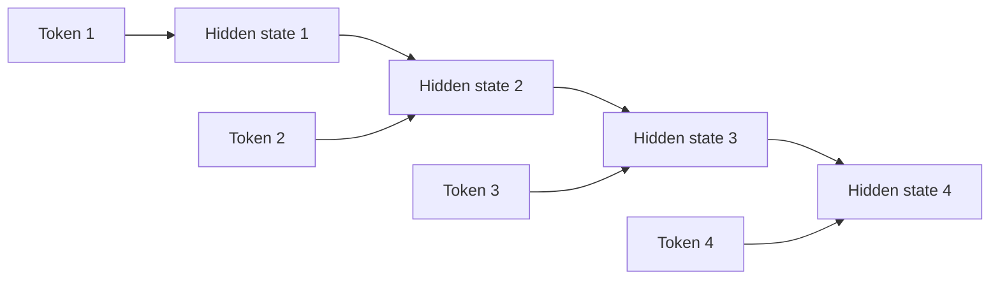
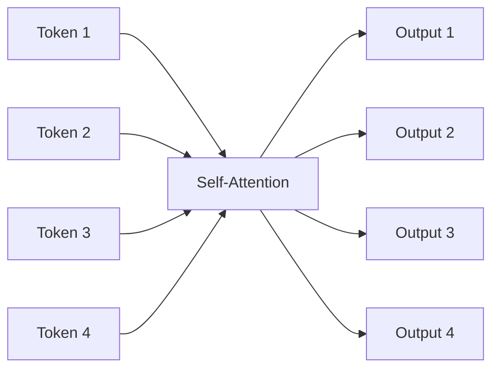
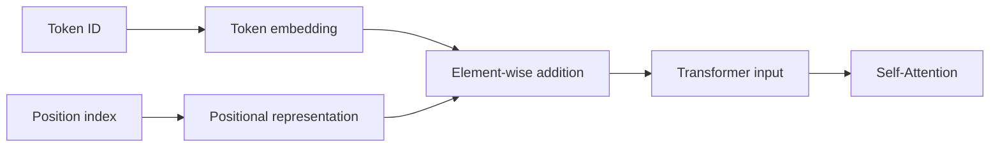
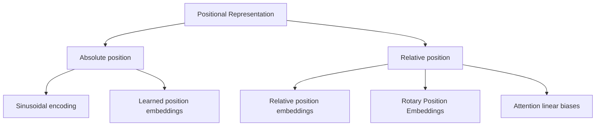
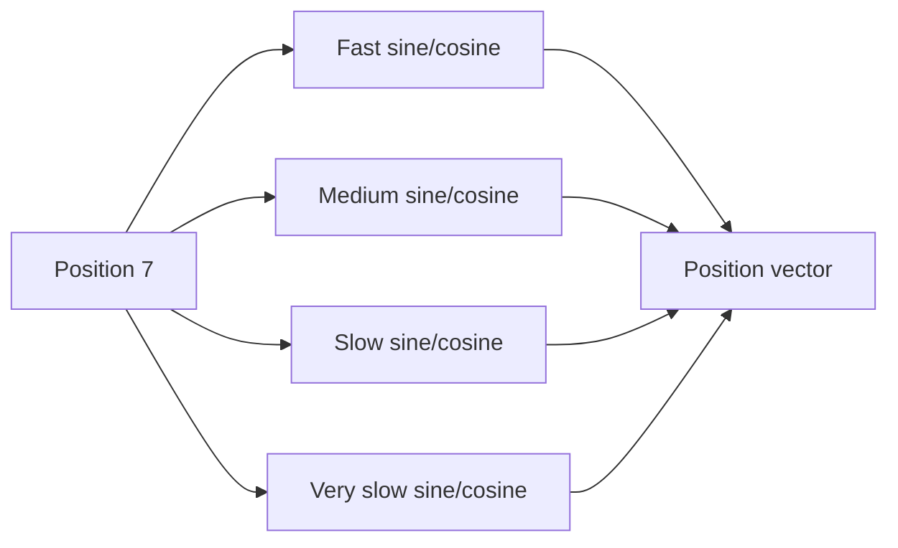
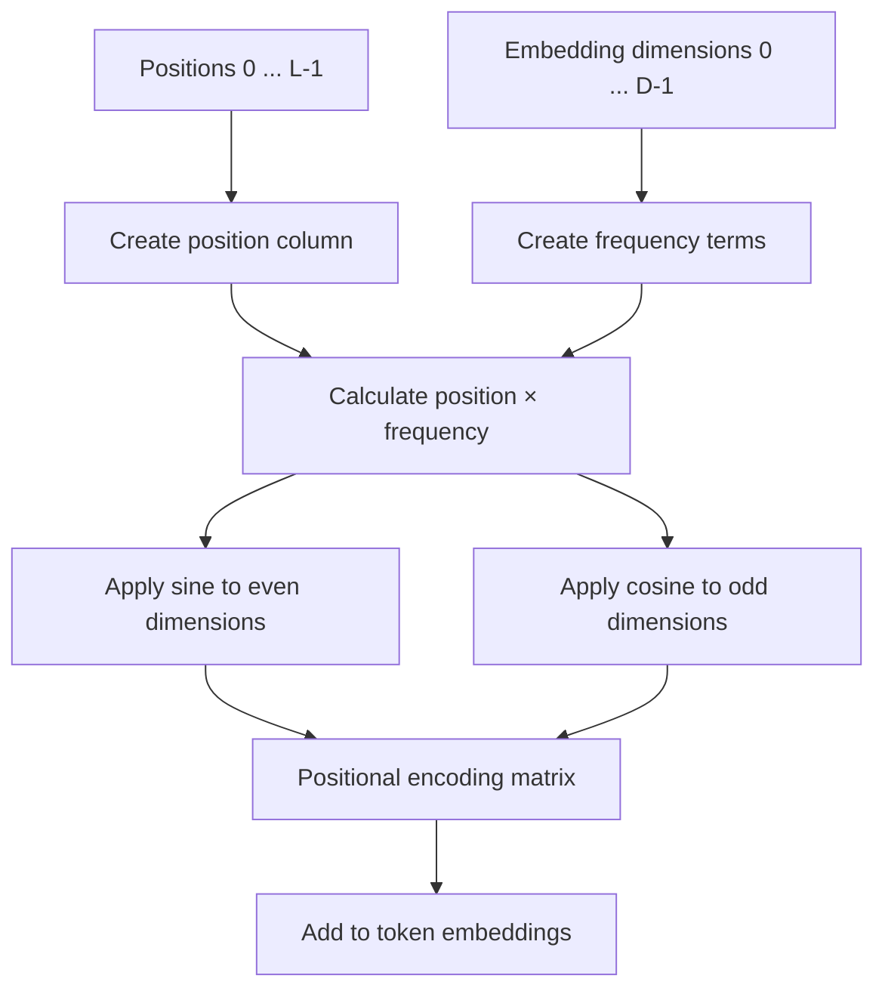
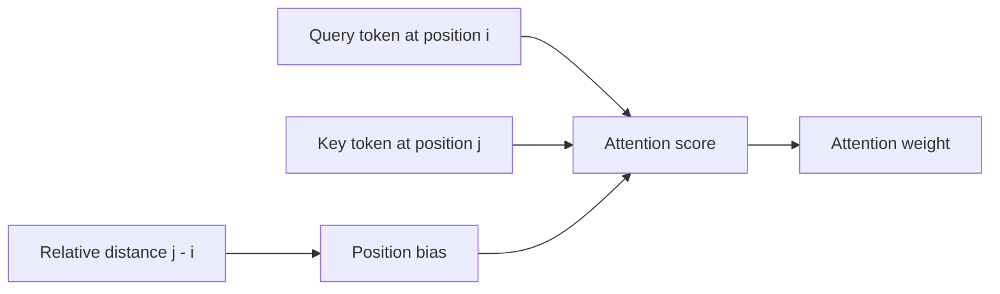
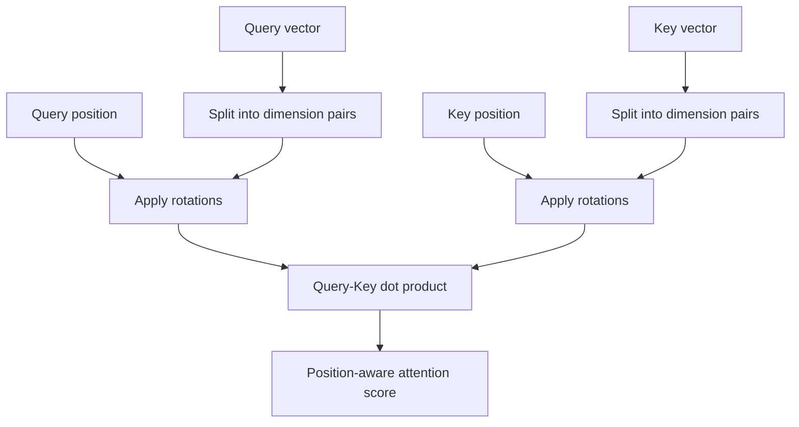
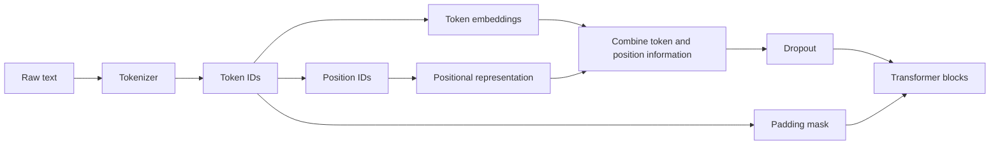

# 016 — Positional Encoding

**Course:** 03 — Machine Learning and Deep Learning
**Module:** Module 07 — Deep Learning
**Content Group:** Transformer Concepts
**Roadmap Source:** Deep Learning / Transformer Concepts
**Lesson Type:** Deep Learning
**Order in Module:** 016
**Suggested Duration:** 24 minutes

---

## 1. Summary

This lesson explains **Positional Encoding** in the context of AI and Data Science.

Self-Attention allows every token to interact with every other token in a sequence. However, Self-Attention does not inherently know the order of those tokens.

For example, these sentences contain the same words:

```text
dog bites man
```

```text
man bites dog
```

Their meanings are different because the token positions are different.

A Transformer therefore needs an additional mechanism to represent:

* The absolute position of each token
* The order of tokens
* The distance between tokens
* Relative relationships between positions

Positional Encoding adds this sequence-order information to token representations before they enter the Transformer blocks.

A simplified Transformer input is:

$$
X_{\text{input}} =
X_{\text{token}}
+
X_{\text{position}}
$$

After this lesson, you should understand:

* Why Transformers need positional information
* How sinusoidal Positional Encoding works
* How learned positional embeddings work
* The difference between absolute and relative positions
* How Rotary Positional Embeddings encode relative relationships
* How to implement and visualize Positional Encoding
* Common mistakes involving sequence length, tensor shape, and masking

---

## 2. Learning Objectives

By the end of this lesson, you should be able to:

* Explain why Self-Attention alone cannot represent token order.
* Explain Positional Encoding in your own words.
* Distinguish token embeddings from positional representations.
* Write the sinusoidal Positional Encoding formulas.
* Explain why sine and cosine functions use different frequencies.
* Implement sinusoidal Positional Encoding using NumPy or PyTorch.
* Distinguish fixed and learned positional embeddings.
* Explain absolute and relative positional representations.
* Describe the main idea behind RoPE and ALiBi.
* Visualize positional vectors and frequency patterns.
* Track the tensor shapes used when adding positional information.
* Identify sequence-length and padding-related implementation errors.

---

## 3. Prerequisites

Before studying Positional Encoding, you should understand:

* Vectors and matrices
* Embeddings
* Sine and cosine functions
* Self-Attention
* Multi-Head Attention
* Transformer input shapes
* Basic PyTorch tensor operations
* Broadcasting
* Sequence padding

---

## 4. Why Do Transformers Need Position Information?

### 4.1 Self-Attention Does Not Automatically Understand Order

The Self-Attention calculation is:

$$
\text{Attention}(Q,K,V) =
\text{softmax}
\left(
\frac{QK^\top}{\sqrt{d_k}}
\right)V
$$

Queries, Keys, and Values are calculated from token representations.

Without positional information, the mechanism primarily compares token content. It has no built-in recurrent step or convolutional structure that naturally preserves sequence order.

Consider:

```text
The cat chased the mouse.
```

and:

```text
The mouse chased the cat.
```

Both sentences contain the same token set, but their meanings are different.

The Transformer must know:

```text
cat appears before chased
mouse appears after chased
```

Without position information, it becomes difficult to distinguish the subject from the object.

---

### 4.2 Comparison with RNNs

RNNs process tokens sequentially:



The processing order naturally contains positional information.

A Transformer processes all tokens in parallel:



Parallel processing improves training efficiency, but token order must be provided explicitly.

---

## 5. Main Idea

For every token, the model creates:

1. A token embedding
2. A positional representation

These vectors usually have the same dimension.

They are then added:

$$
x_i^{\text{input}} =
x_i^{\text{token}}
+
p_i
$$

where:

* $x_i^{\text{token}}$ is the embedding of token $i$.
* $p_i$ is the positional vector for position $i$.
* $x_i^{\text{input}}$ is the final input to the Transformer.



Example:

```text
Token:        "learning"
Token index:  3
Position:     5
```

The model combines:

```text
embedding("learning") + position_vector(5)
```

The resulting vector contains information about both:

* What the token is
* Where the token appears

---

## 6. Token Embeddings and Positional Encodings

Assume:

```text
sequence length = L
model dimension = D
```

Token embeddings have shape:

$$
X_{\text{token}}
\in
\mathbb{R}^{L \times D}
$$

Positional encodings have shape:

$$
P
\in
\mathbb{R}^{L \times D}
$$

The result is:

$$
X_{\text{input}} =
X_{\text{token}} + P
$$

with shape:

$$
X_{\text{input}}
\in
\mathbb{R}^{L \times D}
$$

For batched inputs:

$$
X_{\text{token}}
\in
\mathbb{R}^{B \times L \times D}
$$

The positional matrix may initially have shape:

$$
P
\in
\mathbb{R}^{1 \times L \times D}
$$

It is broadcast across the batch dimension:

$$
X_{\text{input}} =
X_{\text{token}} + P
$$

Result:

$$
X_{\text{input}}
\in
\mathbb{R}^{B \times L \times D}
$$

---

## 7. Types of Positional Representation

Common approaches include:

1. Sinusoidal Positional Encoding
2. Learned absolute positional embeddings
3. Relative positional embeddings
4. Rotary Positional Embeddings
5. Attention biases such as ALiBi



---

# Part I — Sinusoidal Positional Encoding

## 8. Sinusoidal Positional Encoding

The original Transformer introduced fixed positional vectors based on sine and cosine functions.

For position $pos$ and vector dimension $i$:

$$
PE(pos,2i) =
\sin
\left(
\frac{pos}
{10000^{2i/d_{\text{model}}}}
\right)
$$

$$
PE(pos,2i+1) =
\cos
\left(
\frac{pos}
{10000^{2i/d_{\text{model}}}}
\right)
$$

where:

* $pos$ is the token position.
* $i$ is the frequency index.
* $d_{\text{model}}$ is the model dimension.
* Even dimensions use sine.
* Odd dimensions use cosine.

---

## 9. Understanding the Formula

Each token position receives a vector:

$$
PE(pos) =
[
PE(pos,0),
PE(pos,1),
\ldots,
PE(pos,d_{\text{model}}-1)
]
$$

For example, if:

$$
d_{\text{model}}=8
$$

then position 3 receives:

```text
[
sin(frequency₁ × 3),
cos(frequency₁ × 3),
sin(frequency₂ × 3),
cos(frequency₂ × 3),
sin(frequency₃ × 3),
cos(frequency₃ × 3),
sin(frequency₄ × 3),
cos(frequency₄ × 3)
]
```

Each sine–cosine pair uses a different frequency.

Some dimensions change quickly across positions. Other dimensions change slowly.

```text
High frequency dimensions:
position changes → values change quickly

Low frequency dimensions:
position changes → values change slowly
```

This creates a unique and structured pattern for each position.

---

## 10. Frequency Intuition

Imagine several clocks moving at different speeds.

```text
Clock 1 → completes cycles quickly
Clock 2 → moves more slowly
Clock 3 → moves even more slowly
Clock 4 → changes very gradually
```

A position is represented by the combined state of all clocks.



Even if one frequency repeats, the complete combination of frequencies can still identify the position.

This resembles how multiple digits identify a number:

```text
ones
tens
hundreds
thousands
```

---

## 11. Why Use Both Sine and Cosine?

Sine and cosine provide two complementary phases of the same frequency.

For one frequency:

$$
\sin(\theta)
$$

and:

$$
\cos(\theta)
$$

together represent a point on a unit circle.

```text
position
→ angle
→ [sin(angle), cos(angle)]
```

This gives the model a smooth representation of position.

Nearby positions produce nearby vectors, while distant positions produce different patterns.

---

## 12. Relative Position Property

An important property of sinusoidal encodings is that shifted positions can be expressed using linear combinations.

Using trigonometric identities:

$$
\sin(a+b) =
\sin(a)\cos(b)+\cos(a)\sin(b)
$$

$$
\cos(a+b) =
\cos(a)\cos(b)-\sin(a)\sin(b)
$$

The encoding of position $pos+k$ can be related to the encoding of $pos$.

This may help the model learn relative relationships such as:

```text
one token earlier
three positions later
nearby token
distant token
```

The model does not need to memorize every pair of absolute positions independently.

---

## 13. Example Positional Matrix

Assume:

```text
sequence length = 4
model dimension = 6
```

The positional matrix may look approximately like:

$$
P=
\begin{bmatrix}
0.000 & 1.000 & 0.000 & 1.000 & 0.000 & 1.000 \\
0.841 & 0.540 & 0.046 & 0.999 & 0.002 & 1.000 \\
0.909 & -0.416 & 0.093 & 0.996 & 0.004 & 1.000 \\
0.141 & -0.990 & 0.139 & 0.990 & 0.006 & 1.000
\end{bmatrix}
$$

Each row represents one position.

Each column represents one sine or cosine frequency dimension.

---

## 14. Sinusoidal Encoding Flow



---

## 15. NumPy Implementation

```python
import numpy as np


def create_sinusoidal_encoding(
    sequence_length: int,
    model_dimension: int,
) -> np.ndarray:
    """
    Create sinusoidal positional encodings.

    Args:
        sequence_length:
            Maximum sequence length.
        model_dimension:
            Embedding dimension.

    Returns:
        Array with shape
        (sequence_length, model_dimension).
    """
    if sequence_length <= 0:
        raise ValueError("sequence_length must be positive.")

    if model_dimension <= 0:
        raise ValueError("model_dimension must be positive.")

    positions = np.arange(sequence_length)[:, np.newaxis]

    dimension_indices = np.arange(0, model_dimension, 2)

    frequency_terms = np.exp(
        dimension_indices
        * (-np.log(10000.0) / model_dimension)
    )

    encoding = np.zeros(
        (sequence_length, model_dimension),
        dtype=np.float32,
    )

    encoding[:, 0::2] = np.sin(
        positions * frequency_terms
    )

    cosine_width = encoding[:, 1::2].shape[1]

    encoding[:, 1::2] = np.cos(
        positions * frequency_terms[:cosine_width]
    )

    return encoding


positional_encoding = create_sinusoidal_encoding(
    sequence_length=10,
    model_dimension=8,
)

print(positional_encoding.shape)
print(positional_encoding[:3])
```

Expected shape:

```text
(10, 8)
```

---

## 16. PyTorch Implementation

```python
import math

import torch
from torch import Tensor
from torch import nn


class SinusoidalPositionalEncoding(nn.Module):
    """Fixed sinusoidal Positional Encoding."""

    def __init__(
        self,
        model_dimension: int,
        maximum_length: int = 5000,
        dropout: float = 0.1,
    ) -> None:
        super().__init__()

        if model_dimension <= 0:
            raise ValueError(
                "model_dimension must be positive."
            )

        if maximum_length <= 0:
            raise ValueError(
                "maximum_length must be positive."
            )

        self.model_dimension = model_dimension
        self.dropout = nn.Dropout(dropout)

        position = torch.arange(
            maximum_length,
            dtype=torch.float32,
        ).unsqueeze(1)

        dimension_indices = torch.arange(
            0,
            model_dimension,
            2,
            dtype=torch.float32,
        )

        frequency_terms = torch.exp(
            dimension_indices
            * (-math.log(10000.0) / model_dimension)
        )

        encoding = torch.zeros(
            maximum_length,
            model_dimension,
        )

        encoding[:, 0::2] = torch.sin(
            position * frequency_terms
        )

        cosine_width = encoding[:, 1::2].shape[1]

        encoding[:, 1::2] = torch.cos(
            position * frequency_terms[:cosine_width]
        )

        encoding = encoding.unsqueeze(0)

        self.register_buffer(
            "encoding",
            encoding,
        )

    def forward(self, x: Tensor) -> Tensor:
        """
        Args:
            x:
                Tensor with shape
                (batch_size, sequence_length, model_dimension).

        Returns:
            Tensor with the same shape as x.
        """
        if x.ndim != 3:
            raise ValueError(
                "Expected x with shape "
                "(batch_size, sequence_length, model_dimension)."
            )

        if x.size(-1) != self.model_dimension:
            raise ValueError(
                "The final dimension of x does not match "
                "model_dimension."
            )

        sequence_length = x.size(1)

        if sequence_length > self.encoding.size(1):
            raise ValueError(
                "Input sequence exceeds maximum_length."
            )

        x = x + self.encoding[:, :sequence_length]

        return self.dropout(x)
```

Example:

```python
batch_size = 4
sequence_length = 12
model_dimension = 128

token_embeddings = torch.randn(
    batch_size,
    sequence_length,
    model_dimension,
)

position_layer = SinusoidalPositionalEncoding(
    model_dimension=model_dimension,
    maximum_length=512,
    dropout=0.1,
)

transformer_input = position_layer(token_embeddings)

print("Token embeddings:", token_embeddings.shape)
print("Transformer input:", transformer_input.shape)
```

Expected output:

```text
Token embeddings:  torch.Size([4, 12, 128])
Transformer input: torch.Size([4, 12, 128])
```

---

## 17. Why Register the Encoding as a Buffer?

Sinusoidal positional vectors are fixed.

They are not trained with gradient descent.

Therefore, they should not be normal model parameters.

In PyTorch:

```python
self.register_buffer("encoding", encoding)
```

A buffer:

* Moves automatically with the model between CPU and GPU
* Is stored in the model state dictionary
* Is not updated by the optimizer
* Is not treated as a trainable parameter

Incorrect:

```python
self.encoding = nn.Parameter(encoding)
```

This would make the fixed sinusoidal encoding trainable.

---

## 18. Scaling Token Embeddings

The original Transformer scales token embeddings by:

$$
\sqrt{d_{\text{model}}}
$$

before adding positional information:

$$
X_{\text{input}} =
\sqrt{d_{\text{model}}}
X_{\text{token}}
+
P
$$

Example:

```python
token_embeddings = (
    embedding_layer(token_ids)
    * math.sqrt(model_dimension)
)

transformer_input = positional_encoding(
    token_embeddings
)
```

The purpose is to keep the magnitude of token embeddings appropriately balanced relative to positional values.

Not every modern Transformer implementation uses exactly the same scaling strategy.

---

## 19. Visualizing Sinusoidal Encoding

```python
import matplotlib.pyplot as plt
import numpy as np


encoding = create_sinusoidal_encoding(
    sequence_length=100,
    model_dimension=64,
)

fig, ax = plt.subplots(figsize=(10, 6))

image = ax.imshow(
    encoding,
    aspect="auto",
)

ax.set_xlabel("Embedding dimension")
ax.set_ylabel("Token position")
ax.set_title("Sinusoidal Positional Encoding")

fig.colorbar(image, ax=ax)
fig.tight_layout()

plt.show()
```

The visualization shows:

* Fast-changing patterns in some dimensions
* Slow-changing patterns in other dimensions
* A unique combination for each position

---

## 20. Visualizing Individual Dimensions

```python
import matplotlib.pyplot as plt


positions = np.arange(100)

fig, ax = plt.subplots(figsize=(10, 5))

for dimension in [0, 2, 8, 16, 32]:
    ax.plot(
        positions,
        encoding[:, dimension],
        label=f"Dimension {dimension}",
    )

ax.set_xlabel("Position")
ax.set_ylabel("Encoding value")
ax.set_title("Positional Encoding Frequencies")
ax.legend()
fig.tight_layout()

plt.show()
```

Lower-index dimensions usually oscillate more quickly.

Higher-index dimensions usually change more slowly.

---

# Part II — Learned Positional Embeddings

## 21. Learned Absolute Position Embeddings

Instead of using fixed mathematical functions, a model can learn one vector for each position.

A positional embedding table has shape:

$$
P
\in
\mathbb{R}^{L_{\max}\times d_{\text{model}}}
$$

where:

* $L_{\max}$ is the maximum supported sequence length.
* Each row is a trainable position vector.

For position $i$:

$$
p_i=P[i]
$$

The model input is:

$$
x_i^{\text{input}} =
x_i^{\text{token}}+p_i
$$

---

## 22. PyTorch Learned Position Embeddings

```python
import torch
from torch import Tensor
from torch import nn


class LearnedPositionalEmbedding(nn.Module):
    """Trainable absolute positional embeddings."""

    def __init__(
        self,
        model_dimension: int,
        maximum_length: int,
        dropout: float = 0.1,
    ) -> None:
        super().__init__()

        self.model_dimension = model_dimension
        self.maximum_length = maximum_length

        self.position_embedding = nn.Embedding(
            num_embeddings=maximum_length,
            embedding_dim=model_dimension,
        )

        self.dropout = nn.Dropout(dropout)

    def forward(self, x: Tensor) -> Tensor:
        """
        Args:
            x:
                Tensor with shape
                (batch_size, sequence_length, model_dimension).
        """
        batch_size, sequence_length, dimension = x.shape

        if dimension != self.model_dimension:
            raise ValueError(
                "Input dimension does not match model_dimension."
            )

        if sequence_length > self.maximum_length:
            raise ValueError(
                "Input sequence exceeds maximum_length."
            )

        position_ids = torch.arange(
            sequence_length,
            device=x.device,
        )

        position_vectors = self.position_embedding(
            position_ids
        )

        position_vectors = position_vectors.unsqueeze(0)

        return self.dropout(x + position_vectors)
```

---

## 23. Fixed Versus Learned Positions

| Property                             | Sinusoidal encoding        | Learned embeddings    |
| ------------------------------------ | -------------------------- | --------------------- |
| Trainable                            | No                         | Yes                   |
| Parameters added                     | None                       | $L_{\max}\times D$    |
| Position pattern                     | Mathematical               | Learned from data     |
| Extrapolation beyond training length | Sometimes possible         | Usually difficult     |
| Implementation                       | Formula-based              | Embedding lookup      |
| Flexibility                          | Fixed structure            | Task-dependent        |
| Maximum length                       | Precomputed but extendable | Fixed embedding table |

Neither method is universally best.

The appropriate choice depends on:

* Model architecture
* Training dataset
* Context length
* Extrapolation requirements
* Memory constraints
* Task type

---

## 24. Limitation of Absolute Positions

Absolute positional methods identify where a token occurs:

```text
Token A is at position 5.
Token B is at position 12.
```

However, many language relationships depend more strongly on relative distance:

```text
Token B is 7 positions after Token A.
```

Examples include:

* Adjective before noun
* Subject near verb
* Closing bracket matching an opening bracket
* Nearby words forming a phrase
* Pronouns referring to earlier nouns

This motivates relative positional methods.

---

# Part III — Relative Position Information

## 25. Relative Positional Representation

Relative position methods focus on the distance between tokens.

For Query position $i$ and Key position $j$:

$$
\text{relative distance}=j-i
$$

Example:

```text
Query position = 5
Key position   = 8
Relative distance = 8 - 5 = 3
```

The attention calculation can include a relative position term:

$$
\text{score}(i,j) =
\frac{q_i k_j^\top}{\sqrt{d_k}}
+
b_{i,j}
$$

where $b_{i,j}$ depends on the relative distance between positions $i$ and $j$.

---

## 26. Relative Position Diagram



The model can learn patterns such as:

```text
attend strongly to the previous token
attend to tokens within five positions
attend to matching delimiters farther away
```

---

## 27. Advantages of Relative Positions

Relative positional representations can better capture:

* Distance between tokens
* Local patterns
* Repeated structures
* Long-range dependencies
* Relationships that appear at different absolute locations

For example, the relationship between an adjective and a noun may be similar whether it occurs at positions:

```text
2 and 3
```

or:

```text
42 and 43
```

The absolute positions are different, but the relative distance is the same.

---

# Part IV — Rotary Positional Embeddings

## 28. Rotary Positional Embeddings

Rotary Positional Embeddings, commonly called **RoPE**, apply position-dependent rotations to Query and Key vectors.

Instead of directly adding a positional vector to token embeddings, RoPE modifies Query and Key representations.

Conceptually:

$$
q_i^{\text{rotated}} =
R_iq_i
$$

$$
k_j^{\text{rotated}} =
R_jk_j
$$

where $R_i$ and $R_j$ are rotation transformations based on token positions.

Attention scores become:

$$
\left(R_iq_i\right)^\top
\left(R_jk_j\right)
$$

The resulting similarity naturally contains information related to the relative position $j-i$.

---

## 29. RoPE Intuition

Consider each pair of vector dimensions as a point in a two-dimensional plane.

For each position, the point is rotated by a position-dependent angle.

```text
Position 0 → rotate by 0°
Position 1 → rotate by θ
Position 2 → rotate by 2θ
Position 3 → rotate by 3θ
```

Different dimension pairs use different rotation frequencies.



---

## 30. Why RoPE Is Useful

RoPE provides several useful properties:

* Position is integrated directly into attention scores.
* Relative position affects Query–Key similarity.
* It avoids adding a separate position vector after projection.
* It works naturally with Multi-Head Attention.
* It is widely used in decoder-only language models.

However, extending a RoPE-based model beyond its trained context length may require additional scaling or interpolation methods.

---

# Part V — Attention Linear Biases

## 31. ALiBi

**Attention with Linear Biases**, or ALiBi, adds a distance-dependent bias directly to attention scores.

A simplified form is:

$$
\text{score}(i,j) =
\frac{q_i k_j^\top}{\sqrt{d_k}}
-
m|i-j|
$$

where $m$ is a head-specific slope.

Distant tokens receive a larger negative bias.

```text
nearby token  → small penalty
distant token → larger penalty
```

Different attention heads may use different slopes.

Some heads focus strongly on nearby information, while others can maintain broader attention patterns.

---

## 32. Positional Method Comparison

| Method             | Main idea                         |                  Trainable | Position type                    |
| ------------------ | --------------------------------- | -------------------------: | -------------------------------- |
| Sinusoidal         | Add fixed sine/cosine vectors     |                         No | Absolute with relative structure |
| Learned embedding  | Learn one vector per position     |                        Yes | Absolute                         |
| Relative embedding | Add relative-distance information |                    Usually | Relative                         |
| RoPE               | Rotate Query and Key vectors      | No or partially configured | Relative through attention       |
| ALiBi              | Add distance-based attention bias |              Usually fixed | Relative                         |

---

## 33. Position IDs and Padding

When using padding, position IDs require careful handling.

Consider:

```text
Sentence 1: [CLS] Deep learning works [SEP]
Sentence 2: [CLS] Attention works [SEP] [PAD]
```

A simple batch may use:

```text
Sentence 1 positions: 0 1 2 3 4
Sentence 2 positions: 0 1 2 3 4
```

The padding mask prevents the model from using the final padded position.

Position IDs and padding masks solve different problems:

```text
Position IDs:
Tell the model where tokens occur.

Padding masks:
Tell the model which positions contain valid tokens.
```

Positional Encoding does not replace masking.

---

## 34. Left Padding Versus Right Padding

### Right Padding

```text
[token, token, token, PAD, PAD]
```

Position IDs may be:

```text
[0, 1, 2, 3, 4]
```

or valid-token-aware:

```text
[0, 1, 2, 0, 0]
```

depending on the model implementation.

### Left Padding

```text
[PAD, PAD, token, token, token]
```

Position IDs may need adjustment so that real tokens receive consistent positions.

Incorrect position handling can cause differences between:

* Training
* Batched inference
* Single-example inference
* Cached autoregressive generation

Always follow the conventions used by the target model.

---

## 35. Position Encoding During Autoregressive Generation

During generation, a decoder predicts one token at a time.

Suppose the current prompt length is 10.

The next generated token should usually receive position:

```text
10
```

The following token receives:

```text
11
```

When Key–Value caching is used, the model processes only the new token, but its position must still reflect the full sequence length.


Resetting every generated token to position 0 would destroy sequence-order information.

---

## 36. Practical Transformer Input Pipeline



---

## 37. Suggested Demo

### Task

Build a small Transformer classifier and compare positional methods.

Possible datasets:

* IMDb sentiment classification
* AG News classification
* SMS spam classification
* Small language-identification dataset
* Synthetic sequence-order dataset

### Synthetic Order Task

Create sequences containing two special tokens:

```text
A ... B
```

The label is:

```text
1 if A appears before B
0 if B appears before A
```

Example:

```text
x x A x x B x → label 1
x B x x A x x → label 0
```

This is a useful experiment because a model without positional information should struggle to distinguish the order.

---

## 38. Models to Compare

Train and compare:

1. Self-Attention without positional information
2. Self-Attention with sinusoidal encoding
3. Self-Attention with learned position embeddings
4. Transformer with relative position bias

Record:

* Training loss
* Validation accuracy
* Macro F1-score
* Training time
* Number of parameters
* Generalization to longer sequences

---

## 39. Expected Experiment

A useful experiment is to train on sequences of length:

```text
10 to 30
```

and test on sequences of length:

```text
31 to 50
```

Possible observations:

* Learned absolute positions may struggle with unseen positions.
* Sinusoidal positions may generalize more naturally.
* Relative methods may perform well when the task depends on token distance.
* No-position models may fail on order-sensitive tasks.

These are hypotheses to test, not guaranteed outcomes.

---

## 40. Visualization Exercise

Create three visualizations:

### 40.1 Positional Heatmap

```text
x-axis → embedding dimension
y-axis → token position
value  → positional encoding value
```

### 40.2 Encoding Curves

Plot several positional dimensions across positions.

### 40.3 Position Similarity Matrix

Calculate:

$$
S=PP^\top
$$

where $P$ is the positional matrix.

Visualize the similarity between position vectors.

```python
similarity = encoding @ encoding.T
```

This can show how nearby and distant positions relate in the positional space.

---

## 41. Practice Exercises

### Exercise 1 — Explain the Need for Positions

Explain why these two sentences require different Transformer representations:

```text
The dog chased the cat.
```

```text
The cat chased the dog.
```

Your answer should mention:

* Token order
* Self-Attention
* Position information
* Subject–object relationships

---

### Exercise 2 — Calculate a Small Encoding

Given:

$$
d_{\text{model}}=4
$$

calculate the sinusoidal encoding for:

$$
pos=0
$$

Then calculate it for:

$$
pos=1
$$

Use:

$$
PE(pos,2i) =
\sin
\left(
\frac{pos}
{10000^{2i/d_{\text{model}}}}
\right)
$$

$$
PE(pos,2i+1) =
\cos
\left(
\frac{pos}
{10000^{2i/d_{\text{model}}}}
\right)
$$

---

### Exercise 3 — Implement Sinusoidal Encoding

Implement a function that accepts:

```python
sequence_length
model_dimension
```

and returns:

```text
[sequence_length, model_dimension]
```

Verify that:

* Even columns use sine.
* Odd columns use cosine.
* Position 0 contains alternating 0 and 1.
* No gradients are required.

---

### Exercise 4 — Compare Position Vectors

Calculate cosine similarity between:

```text
position 5 and position 6
position 5 and position 50
position 5 and position 500
```

Explain the observed pattern.

---

### Exercise 5 — Remove Positional Encoding

Train a small Self-Attention classifier on an order-sensitive dataset.

Compare:

```text
with positional information
without positional information
```

Record the validation accuracy and explain the difference.

---

### Exercise 6 — Compare Fixed and Learned Positions

Train two identical Transformer models:

```text
Model A → sinusoidal positions
Model B → learned absolute positions
```

Compare:

* Accuracy
* Training speed
* Number of parameters
* Performance on unseen sequence lengths

---

### Exercise 7 — Test Sequence Extrapolation

Train on maximum sequence length 64.

Evaluate on:

```text
64
96
128
256
```

Record where performance begins to degrade.

---

## 42. Common Mistakes

### 42.1 Omitting Position Information

A Transformer without positional information may fail on tasks where token order matters.

---

### 42.2 Adding Position Vectors with the Wrong Shape

Token embeddings:

```text
[B, L, D]
```

Correct positional shape:

```text
[1, L, D]
```

or:

```text
[B, L, D]
```

Incorrect:

```text
[L, B, D]
```

unless the entire architecture consistently uses sequence-first tensors.

---

### 42.3 Mixing Batch-First and Sequence-First Formats

Some modules expect:

```text
[L, B, D]
```

Others use:

```text
[B, L, D]
```

Always verify the expected layout.

---

### 42.4 Exceeding the Maximum Length

For a learned embedding table:

```python
nn.Embedding(maximum_length, model_dimension)
```

a position index greater than or equal to `maximum_length` is invalid.

For a precomputed sinusoidal buffer, the input sequence must not exceed the buffer length unless the encoding is extended.

---

### 42.5 Making Fixed Encodings Trainable Accidentally

Incorrect:

```python
self.encoding = nn.Parameter(encoding)
```

Preferred:

```python
self.register_buffer("encoding", encoding)
```

---

### 42.6 Forgetting to Slice the Position Matrix

Incorrect:

```python
x = x + self.encoding
```

when the actual sequence is shorter than the maximum length.

Preferred:

```python
x = x + self.encoding[:, :x.size(1)]
```

---

### 42.7 Using the Wrong Even and Odd Dimensions

Correct:

```python
encoding[:, 0::2] = torch.sin(...)
encoding[:, 1::2] = torch.cos(...)
```

---

### 42.8 Ignoring Odd Model Dimensions

When `model_dimension` is odd, the number of sine and cosine columns differs.

The cosine frequency tensor may need slicing:

```python
cosine_width = encoding[:, 1::2].shape[1]
```

---

### 42.9 Confusing Positions with Attention Masks

Positional representations tell the model:

```text
where a token is
```

Attention masks tell the model:

```text
which tokens it is allowed to attend to
```

They are not interchangeable.

---

### 42.10 Reusing Incorrect Position IDs During Generation

With autoregressive decoding and Key–Value caching, new tokens must receive positions based on the complete sequence length.

---

### 42.11 Assuming Learned Positions Generalize Automatically

A learned vector for position 20 does not automatically define a useful vector for position 200 if that position was never trained.

---

### 42.12 Assuming Sinusoidal Encoding Guarantees Long-Context Performance

Sinusoidal encodings can be calculated for longer positions, but the model may still fail beyond its training context.

Position availability is not the same as model generalization.

---

### 42.13 Ignoring Position Handling During Fine-Tuning

Changing:

* Maximum sequence length
* Padding direction
* Position ID logic
* Tokenizer special tokens

can create a mismatch between pretraining and fine-tuning.

---

## 43. Completion Checklist

* [ ] I can explain why Transformers need position information.
* [ ] I understand why Self-Attention alone does not represent token order.
* [ ] I can distinguish token embeddings from position vectors.
* [ ] I can write the sinusoidal encoding formulas.
* [ ] I know why even dimensions use sine.
* [ ] I know why odd dimensions use cosine.
* [ ] I understand why multiple frequencies are used.
* [ ] I can implement sinusoidal Positional Encoding.
* [ ] I can implement learned positional embeddings.
* [ ] I can distinguish absolute and relative positions.
* [ ] I understand the main idea behind RoPE.
* [ ] I understand the main idea behind ALiBi.
* [ ] I can track positional tensor shapes.
* [ ] I understand that positions and masks solve different problems.
* [ ] I can visualize a positional encoding matrix.
* [ ] I know how maximum sequence length affects the model.
* [ ] I have recorded at least one caveat or open question.

---

## 44. Related Outcome

Understand neural networks, CNNs, RNNs, LSTMs, Attention, Self-Attention, Positional Encoding, Transformers, and transfer learning at a practical level.

After completing this lesson, you should be prepared to study:

* Multi-Head Attention
* Transformer Encoder
* Transformer Decoder
* Masked Self-Attention
* Cross-Attention
* BERT
* GPT
* Vision Transformers
* Long-context Transformers

---

## 45. Related Mini Project

### Position-Aware Sequence Classifier

Build a sequence-classification project that predicts whether one token appears before another.

Compare:

1. Average embedding classifier
2. Self-Attention without positions
3. Self-Attention with sinusoidal encoding
4. Self-Attention with learned positions
5. Transformer with relative position information

The project should include:

* Synthetic dataset generation
* Position-sensitive labels
* Padding and masks
* Model architecture diagrams
* Training and validation curves
* Accuracy and Macro F1-score
* Positional heatmaps
* Position-similarity matrices
* Sequence-length generalization tests
* Error analysis

Suggested structure:

```text
positional_encoding_project/
├── data/
├── notebooks/
│   └── positional_encoding_experiments.ipynb
├── src/
│   ├── dataset.py
│   ├── positional_encoding.py
│   ├── model.py
│   ├── train.py
│   └── evaluate.py
├── artifacts/
│   ├── positional_heatmap.png
│   ├── frequency_curves.png
│   ├── position_similarity.png
│   ├── training_curves.png
│   └── model_comparison.csv
├── requirements.txt
└── README.md
```

---

## 46. Key Takeaways

1. Self-Attention does not inherently know token order.

2. Positional Encoding adds sequence-order information to Transformer representations.

3. Token and position vectors usually have the same dimension:

$$
X_{\text{input}} =
X_{\text{token}}
+
X_{\text{position}}
$$

4. Sinusoidal encodings use sine for even dimensions:

$$
PE(pos,2i) =
\sin
\left(
\frac{pos}
{10000^{2i/d_{\text{model}}}}
\right)
$$

5. They use cosine for odd dimensions:

$$
PE(pos,2i+1) =
\cos
\left(
\frac{pos}
{10000^{2i/d_{\text{model}}}}
\right)
$$

6. Different dimensions use different frequencies.

7. Learned position embeddings assign a trainable vector to each position.

8. Absolute methods represent where a token occurs.

9. Relative methods represent distances and relationships between tokens.

10. RoPE applies position-dependent rotations to Query and Key vectors.

11. ALiBi adds distance-based biases to attention scores.

12. Position representations and attention masks solve different problems.

13. Maximum sequence length must be handled carefully.

14. A model may not generalize to longer sequences merely because position vectors can be generated for them.

---

## 47. Final Summary

**Positional Encoding** gives Transformers information about token order and sequence structure.

The complete input process is:

```text
raw text
→ tokenization
→ token IDs
→ token embeddings
→ positional representation
→ combine token and position information
→ Transformer blocks
```

Without position information, a Transformer may treat different token arrangements as equivalent.

Common positional approaches include:

```text
Sinusoidal Encoding
Learned Position Embeddings
Relative Position Embeddings
Rotary Position Embeddings
Attention Linear Biases
```

A useful practical experiment is:

```text
order-sensitive dataset
→ model without positions
→ model with sinusoidal positions
→ model with learned positions
→ compare accuracy and generalization
```

Understanding Positional Encoding is essential before studying complete Transformer encoders, decoders, autoregressive language models, and long-context architectures.
