# 017 — Encoder / Decoder

**Course:** 03 — Machine Learning and Deep Learning
**Module:** Module 07 — Deep Learning
**Content Group:** Transformer Concepts
**Roadmap Source:** Deep Learning / Transformer Concepts
**Lesson Type:** Deep Learning
**Order in Module:** 017
**Suggested Duration:** 24 minutes

---

## 1. Summary

An **Encoder–Decoder architecture** is a neural-network design that transforms one input sequence into another output sequence.

The architecture contains two major components:

* The **encoder** reads and represents the input.
* The **decoder** uses that representation to generate the output.

A common example is machine translation:

```text
Input:  Welcome to New York.
Output: Bienvenue à New York.
```

The source and target sequences may have different:

* Languages
* Lengths
* Token orders
* Vocabulary systems
* Modalities

Encoder–Decoder models are therefore useful for tasks such as:

* Machine translation
* Text summarization
* Question answering
* Speech recognition
* Image captioning
* Code generation
* Grammar correction
* Text-to-speech
* Multimodal generation

Early sequence-to-sequence systems used RNNs, GRUs, or LSTMs. Modern systems usually use Transformer blocks with Self-Attention and Cross-Attention.

An encoder–decoder system can accept variable-length input sequences and produce variable-length output sequences, including outputs whose lengths differ from their corresponding inputs.

---

## 2. Learning Objectives

By the end of this lesson, you should be able to:

* Explain the roles of an encoder and a decoder.
* Describe a sequence-to-sequence problem.
* Explain how an RNN or LSTM Encoder–Decoder works.
* Explain how a Transformer Encoder–Decoder works.
* Distinguish encoder Self-Attention from decoder masked Self-Attention.
* Explain the purpose of Cross-Attention.
* Prepare shifted decoder inputs for training.
* Explain teacher forcing.
* Distinguish training-time decoding from inference-time decoding.
* Explain greedy decoding and beam search.
* Track the main tensor shapes in a Transformer Encoder–Decoder.
* Implement a small Encoder–Decoder model with PyTorch.
* Select appropriate metrics for sequence-generation tasks.
* Recognize common implementation and evaluation mistakes.

---

## 3. Prerequisites

Before studying Encoder–Decoder architectures, you should understand:

* Tokenization
* Word and token embeddings
* RNNs and LSTMs
* Self-Attention
* Positional Encoding
* Softmax
* Cross-entropy loss
* Padding and attention masks
* Basic matrix and tensor operations
* Basic PyTorch model construction

---

## 4. What Is a Sequence-to-Sequence Task?

A sequence-to-sequence task maps an input sequence:

$$
X=(x_1,x_2,\ldots,x_{L_x})
$$

to an output sequence:

$$
Y=(y_1,y_2,\ldots,y_{L_y})
$$

The input and output lengths do not need to be equal:

$$
L_x \neq L_y
$$

For example:

```text
English: Let's go.
Spanish: Vamos.
```

The English input contains two word-level tokens, while the Spanish output may contain one.

A sequence-to-sequence model must therefore support:

* Variable-length inputs
* Variable-length outputs
* Different input and output token orders
* Different source and target vocabularies

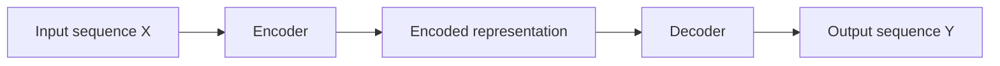

---

## 5. High-Level Encoder–Decoder Architecture

The encoder processes the source sequence and produces a representation.

The decoder generates the target sequence using:

1. The encoder representation
2. Previously generated target tokens

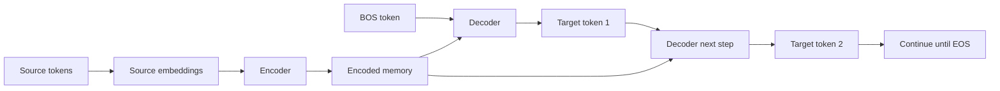

The encoder usually runs once for a source sequence.

The decoder is then used repeatedly until it produces an end-of-sequence token or reaches a maximum generation length.

---

## 6. The Encoder

The encoder transforms raw input tokens into contextual representations.

Its job is not simply to copy the input. It learns information such as:

* Token meaning
* Token order
* Syntactic relationships
* Long-range dependencies
* Entity relationships
* Source-sequence context

The encoder can be implemented with:

* RNN
* GRU
* LSTM
* Convolutional network
* Transformer encoder
* Vision Transformer
* Audio encoder

Conceptually:

$$
H=\text{Encoder}(X)
$$

where:

* $X$ is the source-token representation.
* $H$ is the encoded source memory.

---

## 7. The Decoder

The decoder generates the output sequence one token at a time.

At step $t$, it predicts:

$$
P(y_t\mid y_1,\ldots,y_{t-1},X)
$$

This means the probability of the next token depends on:

* The source input $X$
* The target tokens generated so far
* The model parameters

The full sequence probability can be factorized as:

$$
P(Y\mid X) =
\prod_{t=1}^{L_y}
P(y_t\mid y_{<t},X)
$$

where:

$$
y_{<t}=(y_1,\ldots,y_{t-1})
$$

The decoder stops when it predicts:

```text
<EOS>
```

or reaches a maximum output length.

---

## 8. Special Tokens

Sequence-generation models normally use several special tokens.

| Token    | Meaning                               |
| -------- | ------------------------------------- |
| `<BOS>`  | Beginning of sequence                 |
| `<EOS>`  | End of sequence                       |
| `<PAD>`  | Padding                               |
| `<UNK>`  | Unknown token                         |
| `<MASK>` | Hidden or masked token in some models |

Example target sequence:

```text
Original:
Bienvenue à Paris

Training representation:
<BOS> Bienvenue à Paris <EOS>
```

The `<BOS>` token tells the decoder to begin generating.

The `<EOS>` token tells it that generation is complete.

---

# Part I — RNN/LSTM Encoder–Decoder

## 9. RNN Encoder

An RNN encoder reads one source token at a time.

At position $t$:

$$
h_t=f(x_t,h_{t-1})
$$

where:

* $x_t$ is the current token embedding.
* $h_{t-1}$ is the previous hidden state.
* $h_t$ summarizes the sequence up to position $t$.

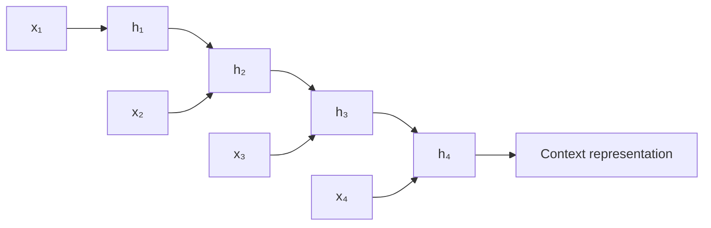

In a basic architecture, the final hidden state is used as the context vector:

$$
c=h_{L_x}
$$

An LSTM may transfer both:

* Final hidden state
* Final cell state

Stacked LSTMs can also be used to increase model capacity.

---

## 10. RNN Decoder

The decoder receives the encoder context and generates target tokens step by step.

At the first step:

```text
Input:
<BOS>

Initial state:
Encoder final state
```

At each decoder step:

$$
s_t=g(e(y_{t-1}),s_{t-1},c)
$$

where:

* $e(y_{t-1})$ is the previous target-token embedding.
* $s_{t-1}$ is the previous decoder state.
* $c$ is the encoder context.

The output state is converted into vocabulary logits:

$$
z_t=W_os_t+b_o
$$

The token probabilities are:

$$
P(y_t)=\text{softmax}(z_t)
$$

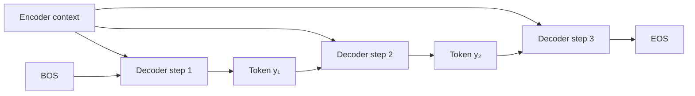

---

## 11. The Fixed Context Bottleneck

In a basic RNN Encoder–Decoder, the entire input is compressed into one fixed-size vector:

$$
c=h_{L_x}
$$

This can become a bottleneck for long sequences.

The context vector must preserve:

* Every important source token
* Word order
* Negation
* Long-distance relationships
* Semantic details

Important information from early positions may be lost.

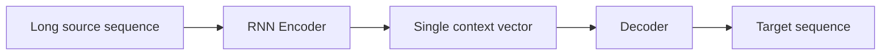

Attention improves this architecture by allowing the decoder to access all encoder states rather than only the final state.

---

## 12. RNN Encoder–Decoder with Attention

Instead of retaining only one context vector, the encoder produces:

$$
H=(h_1,h_2,\ldots,h_{L_x})
$$

At decoder step $t$, Attention calculates weights:

$$
\alpha_{t,i} =
\text{softmax}
\left(
\text{score}(s_{t-1},h_i)
\right)
$$

The dynamic context vector is:

$$
c_t =
\sum_{i=1}^{L_x}
\alpha_{t,i}h_i
$$

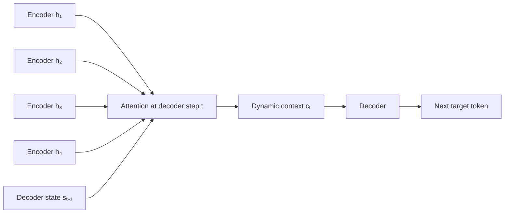

Each decoder step can focus on a different part of the source sequence.

---

# Part II — Transformer Encoder–Decoder

## 13. Transformer Architecture

A complete Transformer contains:

* A stack of encoder layers
* A stack of decoder layers
* Token embeddings
* Positional information
* Output projection
* Softmax or token-selection logic

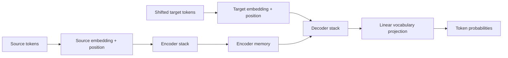

The original Transformer architecture used multiple stacked encoder and decoder layers. Each layer has its own trainable parameters rather than sharing the same weights across all layers.

---

## 14. Transformer Encoder Layer

A standard encoder layer contains:

1. Multi-Head Self-Attention
2. Residual connection
3. Layer normalization
4. Position-wise feed-forward network
5. Another residual connection
6. Another layer normalization

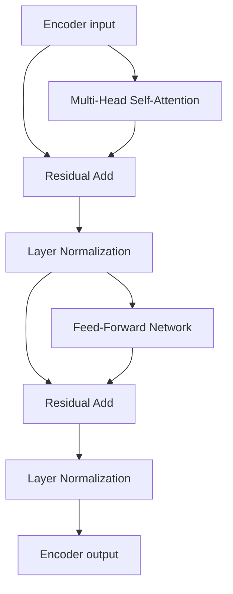

The encoder Self-Attention is usually bidirectional.

Each source token can attend to every valid source token.

---

## 15. Encoder Stack

Multiple encoder layers are placed sequentially:

$$
H^{(1)} =
\text{EncoderLayer}_1(X)
$$

$$
H^{(2)} =
\text{EncoderLayer}_2(H^{(1)})
$$

$$
\vdots
$$

$$
H^{(N)} =
\text{EncoderLayer}_N(H^{(N-1)})
$$

The final encoder output becomes the source memory:

$$
M=H^{(N)}
$$

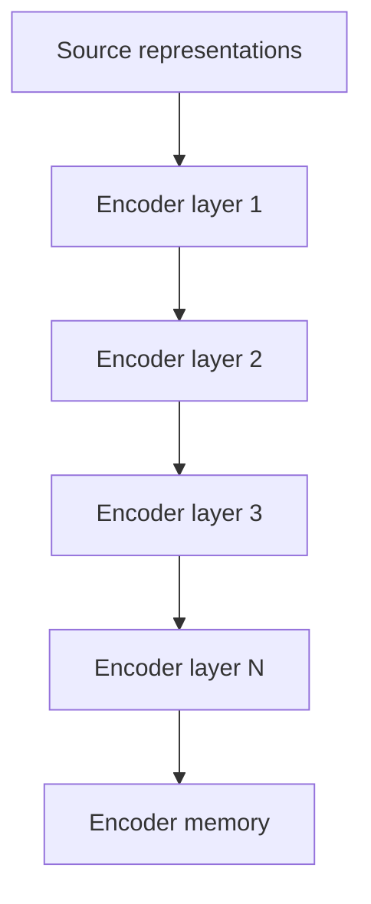

Each layer refines the contextual source representations.

---

## 16. Transformer Decoder Layer

A standard decoder layer contains three major sublayers:

1. Masked Multi-Head Self-Attention
2. Encoder–Decoder Cross-Attention
3. Feed-forward network

Each sublayer is usually combined with:

* Residual connection
* Layer normalization
* Dropout

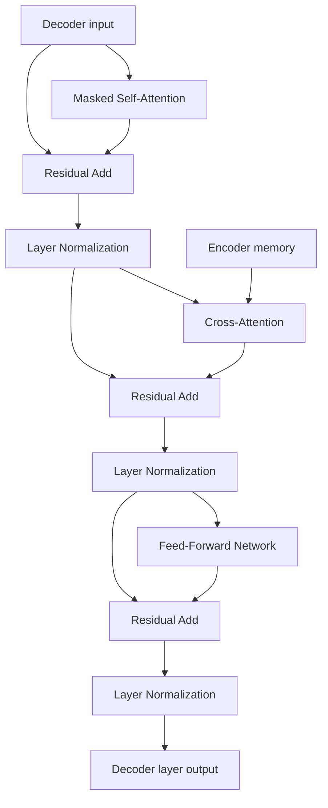

---

## 17. Masked Decoder Self-Attention

The decoder generates output autoregressively.

At target position $t$, it must not see future target tokens:

$$
y_{t+1},y_{t+2},\ldots
$$

A causal mask is therefore applied.

For a sequence of length 4:

$$
M=
\begin{bmatrix}
0 & -\infty & -\infty & -\infty \\
0 & 0 & -\infty & -\infty \\
0 & 0 & 0 & -\infty \\
0 & 0 & 0 & 0
\end{bmatrix}
$$

Visibility:

```text
Position 1 can see: 1
Position 2 can see: 1, 2
Position 3 can see: 1, 2, 3
Position 4 can see: 1, 2, 3, 4
```

Without the mask, the decoder could inspect the correct future answers during training.

---

## 18. Cross-Attention

Cross-Attention connects the decoder to the encoder.

In Cross-Attention:

$$
Q = H_{\text{decoder}}W_Q
$$

$$
K = MW_K
$$

$$
V = MW_V
$$

where $M$ is the encoder memory.

Thus:

```text
Query:
Decoder representation

Key:
Encoder output

Value:
Encoder output
```

The Cross-Attention operation is:

$$
\text{CrossAttention}(Q,K,V) =
\text{softmax}
\left(
\frac{QK^\top}{\sqrt{d_k}}
\right)V
$$

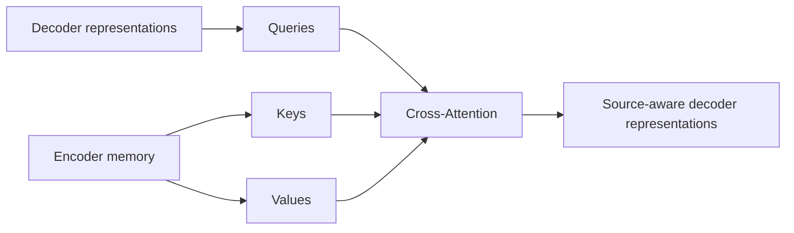

Cross-Attention allows each target position to retrieve relevant source information.

---

## 19. Example of Cross-Attention

Suppose the source sentence is:

```text
The small cat sleeps.
```

and the decoder is generating the French word:

```text
chat
```

The decoder Query may assign high attention weights to:

```text
cat   → 0.72
small → 0.14
The   → 0.06
sleeps → 0.08
```

The decoder can then combine the corresponding encoder Values to build a source-aware representation for predicting `chat`.

---

## 20. Full Transformer Encoder–Decoder Flow

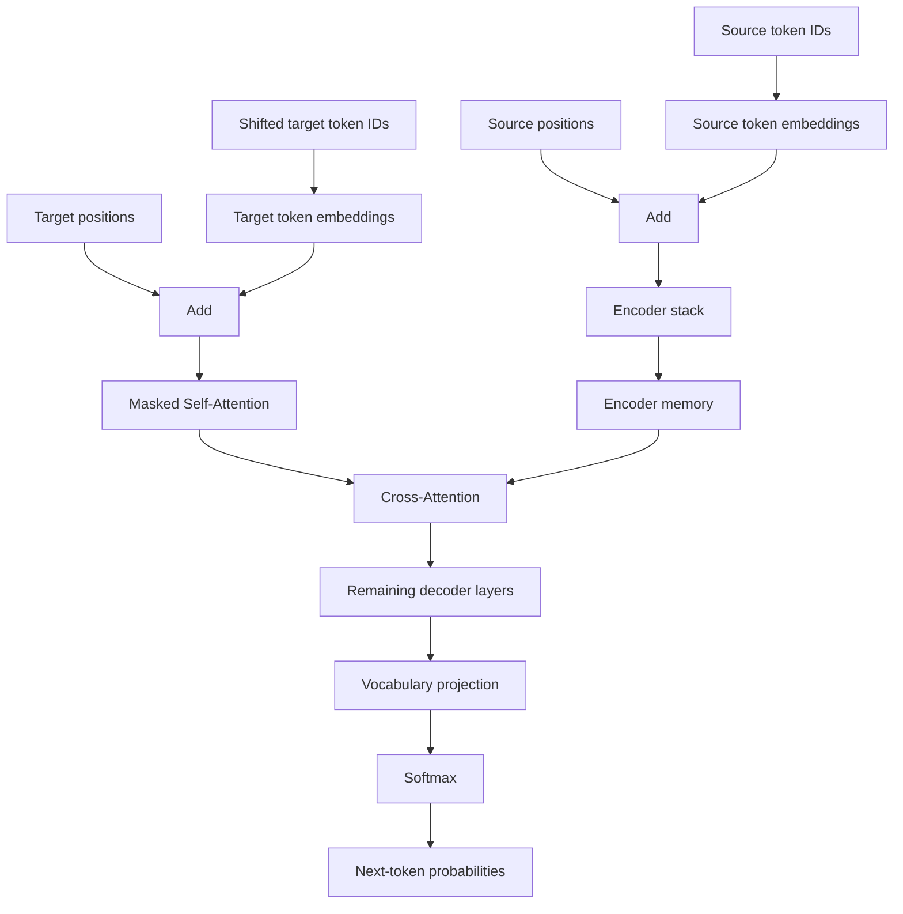

---

## 21. Tensor Shapes

Assume:

```text
batch size           = B
source length        = S
target length        = T
model dimension      = D
source vocabulary    = Vₛ
target vocabulary    = Vₜ
```

Source token IDs:

$$
X_{\text{ids}}
\in
\mathbb{R}^{B\times S}
$$

Source embeddings:

$$
X
\in
\mathbb{R}^{B\times S\times D}
$$

Encoder memory:

$$
M
\in
\mathbb{R}^{B\times S\times D}
$$

Target token IDs:

$$
Y_{\text{ids}}
\in
\mathbb{R}^{B\times T}
$$

Target embeddings:

$$
Y
\in
\mathbb{R}^{B\times T\times D}
$$

Decoder output:

$$
H_{\text{dec}}
\in
\mathbb{R}^{B\times T\times D}
$$

Vocabulary logits:

$$
Z
\in
\mathbb{R}^{B\times T\times V_t}
$$

Target labels:

$$
Y_{\text{labels}}
\in
\mathbb{R}^{B\times T}
$$

---

## 22. Cross-Attention Shapes

For one attention head:

$$
Q
\in
\mathbb{R}^{B\times T\times d_k}
$$

$$
K
\in
\mathbb{R}^{B\times S\times d_k}
$$

$$
V
\in
\mathbb{R}^{B\times S\times d_v}
$$

Attention scores:

$$
QK^\top
\in
\mathbb{R}^{B\times T\times S}
$$

Each target position has one attention distribution across all source positions.

For Multi-Head Cross-Attention:

$$
A
\in
\mathbb{R}^{B\times H\times T\times S}
$$

---

# Part III — Training

## 23. Parallel Source–Target Dataset

Training requires paired examples:

$$
(X^{(i)},Y^{(i)})
$$

For translation:

```text
Source:
The model is learning.

Target:
Le modèle apprend.
```

For summarization:

```text
Source:
Long document

Target:
Short summary
```

For question answering:

```text
Source:
Question and context

Target:
Answer
```

The model learns by comparing its predicted target tokens with the true target tokens.

---

## 24. Shifted Decoder Inputs

Suppose the target sequence is:

```text
the cat sleeps
```

After adding special tokens:

```text
<BOS> the cat sleeps <EOS>
```

The decoder input is shifted right:

```text
Decoder input:
<BOS> the cat sleeps
```

The expected labels are:

```text
Target labels:
the cat sleeps <EOS>
```

Table:

| Position | Decoder input | Expected output |
| -------: | ------------- | --------------- |
|        1 | `<BOS>`       | `the`           |
|        2 | `the`         | `cat`           |
|        3 | `cat`         | `sleeps`        |
|        4 | `sleeps`      | `<EOS>`         |

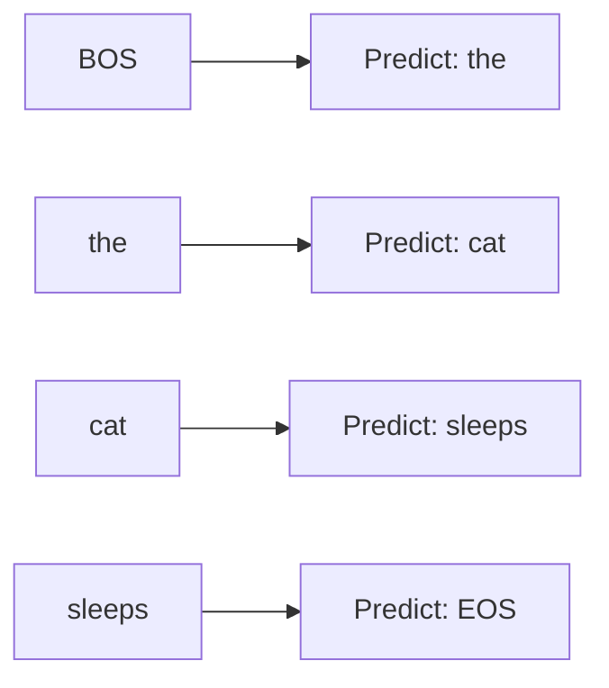

---

## 25. Teacher Forcing

During training, the decoder usually receives the correct previous target token rather than its own predicted token.

This is called **teacher forcing**.

At target position $t$:

```text
Training input:
Ground-truth token yₜ₋₁
```

rather than:

```text
Model input:
Predicted token ŷₜ₋₁
```

Teacher forcing enables all target positions to be processed efficiently during training.

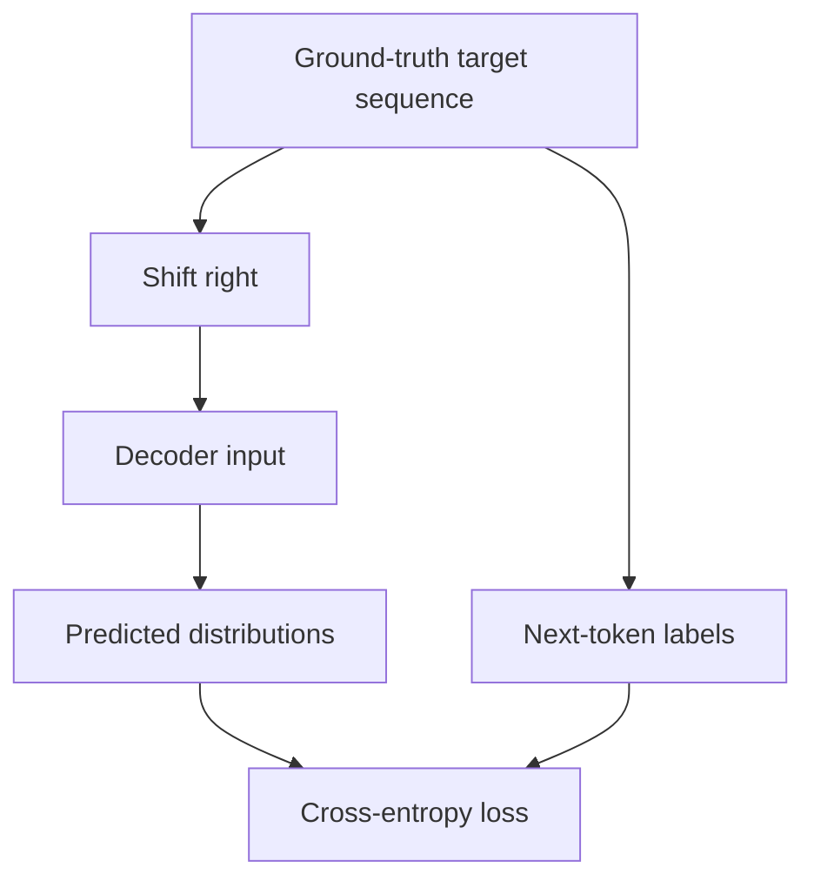

The decoder requires its own input during training, so the target sequence is shifted and supplied as the decoder input.

---

## 26. Training Objective

For each non-padding target token, the model predicts a vocabulary distribution.

The token-level cross-entropy loss is:

$$
\mathcal{L} =
-\sum_{t=1}^{T}
\log P(y_t\mid y_{<t},X)
$$

Padding tokens should normally be ignored:

```python
loss_function = nn.CrossEntropyLoss(
    ignore_index=pad_token_id,
)
```

For batched logits:

```text
Logits:
[B, T, V]
```

the loss function commonly expects:

```text
Flattened logits:
[B × T, V]

Flattened labels:
[B × T]
```

---

## 27. Exposure Bias

Teacher forcing creates a difference between training and inference.

During training:

```text
Decoder receives correct previous tokens.
```

During inference:

```text
Decoder receives its own previous predictions.
```

An early prediction error may therefore affect later predictions.

This mismatch is called **exposure bias**.

Possible approaches include:

* Scheduled sampling
* Sequence-level training
* Reinforcement-learning objectives
* Minimum-risk training
* Better decoding strategies
* Stronger pretraining

However, standard teacher forcing remains widely used.

---

## 28. Source and Target Masks

A Transformer Encoder–Decoder often uses several masks.

### Source Padding Mask

Prevents the encoder and Cross-Attention layers from attending to source padding.

### Target Padding Mask

Prevents attention to target padding.

### Target Causal Mask

Prevents the decoder from seeing future target tokens.

```text
Source mask:
Valid source tokens versus PAD

Target padding mask:
Valid target tokens versus PAD

Target causal mask:
Past and current positions versus future positions
```

These masks solve different problems and must not be confused.

---

# Part IV — Inference

## 29. Autoregressive Generation

During inference, the target sequence is unknown.

Generation begins with:

```text
<BOS>
```

The decoder predicts the first token:

$$
\hat{y}_1 =
\arg\max_y P(y\mid \text{BOS},X)
$$

The generated token is appended:

```text
<BOS> ŷ₁
```

The decoder then predicts:

$$
\hat{y}_2 =
\arg\max_y P(y\mid \text{BOS},\hat{y}_1,X)
$$

The process continues until:

* `<EOS>` is generated
* Maximum length is reached
* Another stopping condition is met

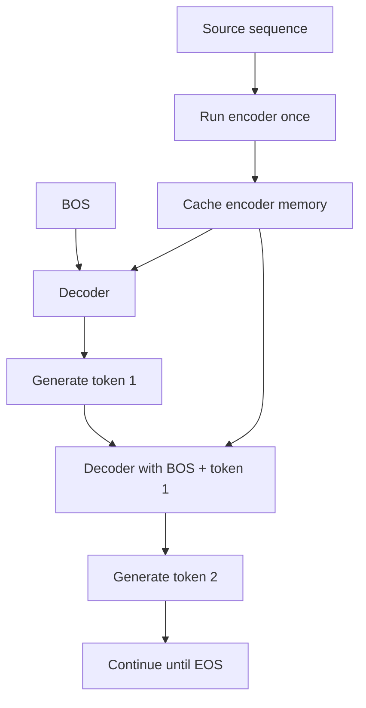

The encoder output can be computed once and reused at every decoder step because the source sequence does not change.

---

## 30. Training Versus Inference

| Property                   | Training            | Inference                 |
| -------------------------- | ------------------- | ------------------------- |
| Previous decoder token     | Ground truth        | Model prediction          |
| Target sequence known      | Yes                 | No                        |
| Target positions processed | Usually parallel    | Sequentially generated    |
| Causal mask required       | Yes                 | Yes or naturally enforced |
| Main purpose               | Learn parameters    | Produce output            |
| Token selection            | Not needed for loss | Required                  |
| Encoder execution          | Once per batch      | Once per source           |

---

## 31. Greedy Decoding

Greedy decoding selects the most probable token at each step:

$$
\hat{y}_t =
\arg\max_y P(y\mid \hat{y}_{<t},X)
$$

Example:

```text
Step 1:
P(A)=0.55, P(B)=0.45
Choose A

Step 2 after A:
Choose the highest-probability next token
```

Advantages:

* Simple
* Fast
* Low memory usage

Disadvantages:

* A locally optimal token may lead to a poor full sequence.
* It explores only one hypothesis.

The standard term is **greedy search**, not grid search.

---

## 32. Beam Search

Beam search keeps several candidate sequences at each step.

If the beam width is $K$, the algorithm retains the $K$ highest-scoring partial sequences.

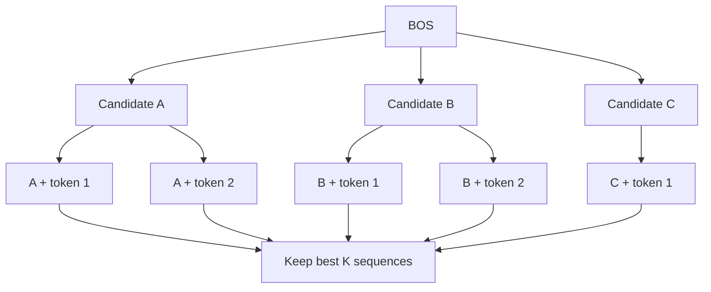

A sequence score may use the sum of log probabilities:

$$
\text{score}(Y) =
\sum_{t=1}^{|Y|}
\log P(y_t\mid y_{<t},X)
$$

Because longer sequences accumulate more negative log probabilities, length normalization is often applied.

Example:

$$
\text{normalizedScore}(Y) =
\frac{\text{score}(Y)}
{|Y|^\alpha}
$$

Beam search evaluates partial sequences rather than selecting only the best individual token at every step.

---

## 33. Sampling Strategies

For open-ended generation, deterministic beam search may produce repetitive or overly conservative outputs.

Alternatives include:

### Temperature Sampling

$$
P_T(y) =
\text{softmax}
\left(
\frac{z}{T}
\right)
$$

* $T<1$: sharper distribution
* $T>1$: more diverse distribution

### Top-$k$ Sampling

Sample only from the $k$ most probable tokens.

### Top-$p$ Sampling

Sample from the smallest token set whose cumulative probability exceeds $p$.

These strategies are more common in creative text generation than in deterministic translation.

---

## 34. Key–Value Caching

During autoregressive Transformer decoding, previously processed target tokens do not need to have all their Key and Value projections recomputed at every step.

A Key–Value cache stores previous decoder attention states.

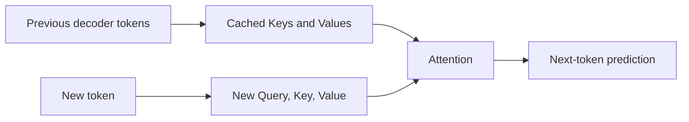

Caching can significantly reduce inference computation.

The encoder memory can also be reused across every decoder step.

---

# Part V — Encoder-Only, Decoder-Only, and Encoder–Decoder Models

## 35. Main Transformer Families

Transformer models are often grouped into three categories.

| Architecture    | Main strength                    | Typical tasks                    |
| --------------- | -------------------------------- | -------------------------------- |
| Encoder-only    | Understanding and representation | Classification, NER, embeddings  |
| Decoder-only    | Autoregressive generation        | Text generation, code generation |
| Encoder–Decoder | Conditional sequence generation  | Translation, summarization       |

---

## 36. Encoder-Only Models

Encoder-only models usually use bidirectional Self-Attention.

Each token can attend to tokens on both sides.

Examples of tasks:

* Sentiment classification
* Named entity recognition
* Document classification
* Semantic search
* Sentence embeddings

Conceptual architecture:

```text
Input sequence
→ Encoder stack
→ Contextual representations
→ Task-specific head
```

A well-known model family is BERT-style encoders.

---

## 37. Decoder-Only Models

Decoder-only models use causal Self-Attention.

Each token can attend only to previous and current positions.

```text
Prompt
→ Causal decoder stack
→ Next-token probabilities
→ Autoregressive generation
```

Typical tasks:

* Open-ended generation
* Chat
* Code completion
* Story writing
* Next-token prediction

Many modern large language models use decoder-only architectures.

---

## 38. Encoder–Decoder Models

Encoder–Decoder models separately process the source and target.

```text
Source sequence
→ Encoder
→ Source memory

Generated target prefix
→ Decoder
→ Next target token
```

This structure is particularly suitable when the output is conditioned on a complete input sequence.

Typical tasks:

* Translation
* Summarization
* Grammar correction
* Structured generation
* Question answering
* Data-to-text generation

A common example is the T5 model family.

---

## 39. Architecture Comparison

| Feature                               | Encoder-only | Decoder-only | Encoder–Decoder     |
| ------------------------------------- | ------------ | ------------ | ------------------- |
| Bidirectional source attention        | Yes          | Usually no   | Yes, in encoder     |
| Causal target attention               | No           | Yes          | Yes, in decoder     |
| Cross-Attention                       | No           | Usually no   | Yes                 |
| Separate source and target processing | No           | No           | Yes                 |
| Strong for classification             | Yes          | Possible     | Possible            |
| Strong for generation                 | Limited      | Yes          | Yes                 |
| Conditional generation                | Possible     | Yes          | Especially suitable |

---

# Part VI — Practical Implementation

## 40. PyTorch Transformer Encoder–Decoder

```python
import math

import torch
from torch import Tensor
from torch import nn


class PositionalEncoding(nn.Module):
    """Fixed sinusoidal positional encoding."""

    def __init__(
        self,
        model_dimension: int,
        maximum_length: int,
        dropout: float,
    ) -> None:
        super().__init__()

        self.dropout = nn.Dropout(dropout)

        positions = torch.arange(
            maximum_length,
            dtype=torch.float32,
        ).unsqueeze(1)

        dimensions = torch.arange(
            0,
            model_dimension,
            2,
            dtype=torch.float32,
        )

        frequency_terms = torch.exp(
            dimensions
            * (-math.log(10000.0) / model_dimension)
        )

        encoding = torch.zeros(
            maximum_length,
            model_dimension,
        )

        encoding[:, 0::2] = torch.sin(
            positions * frequency_terms
        )

        cosine_width = encoding[:, 1::2].size(1)

        encoding[:, 1::2] = torch.cos(
            positions * frequency_terms[:cosine_width]
        )

        self.register_buffer(
            "encoding",
            encoding.unsqueeze(0),
        )

    def forward(self, x: Tensor) -> Tensor:
        sequence_length = x.size(1)

        x = x + self.encoding[:, :sequence_length]

        return self.dropout(x)


class TransformerSeq2Seq(nn.Module):
    """A compact Transformer Encoder–Decoder model."""

    def __init__(
        self,
        source_vocabulary_size: int,
        target_vocabulary_size: int,
        source_padding_id: int,
        target_padding_id: int,
        model_dimension: int = 256,
        number_of_heads: int = 8,
        encoder_layers: int = 4,
        decoder_layers: int = 4,
        feedforward_dimension: int = 1024,
        dropout: float = 0.1,
        maximum_length: int = 512,
    ) -> None:
        super().__init__()

        if model_dimension % number_of_heads != 0:
            raise ValueError(
                "model_dimension must be divisible "
                "by number_of_heads."
            )

        self.model_dimension = model_dimension
        self.source_padding_id = source_padding_id
        self.target_padding_id = target_padding_id

        self.source_embedding = nn.Embedding(
            source_vocabulary_size,
            model_dimension,
            padding_idx=source_padding_id,
        )

        self.target_embedding = nn.Embedding(
            target_vocabulary_size,
            model_dimension,
            padding_idx=target_padding_id,
        )

        self.source_position = PositionalEncoding(
            model_dimension=model_dimension,
            maximum_length=maximum_length,
            dropout=dropout,
        )

        self.target_position = PositionalEncoding(
            model_dimension=model_dimension,
            maximum_length=maximum_length,
            dropout=dropout,
        )

        self.transformer = nn.Transformer(
            d_model=model_dimension,
            nhead=number_of_heads,
            num_encoder_layers=encoder_layers,
            num_decoder_layers=decoder_layers,
            dim_feedforward=feedforward_dimension,
            dropout=dropout,
            batch_first=True,
        )

        self.output_projection = nn.Linear(
            model_dimension,
            target_vocabulary_size,
        )

    @staticmethod
    def create_causal_mask(
        target_length: int,
        device: torch.device,
    ) -> Tensor:
        return torch.triu(
            torch.ones(
                target_length,
                target_length,
                dtype=torch.bool,
                device=device,
            ),
            diagonal=1,
        )

    def forward(
        self,
        source_ids: Tensor,
        decoder_input_ids: Tensor,
    ) -> Tensor:
        """
        Args:
            source_ids:
                Shape [batch_size, source_length].
            decoder_input_ids:
                Shape [batch_size, target_length].

        Returns:
            Vocabulary logits with shape
            [batch_size, target_length, target_vocabulary_size].
        """
        if source_ids.ndim != 2:
            raise ValueError(
                "source_ids must have shape [B, S]."
            )

        if decoder_input_ids.ndim != 2:
            raise ValueError(
                "decoder_input_ids must have shape [B, T]."
            )

        source_padding_mask = source_ids.eq(
            self.source_padding_id
        )

        target_padding_mask = decoder_input_ids.eq(
            self.target_padding_id
        )

        target_length = decoder_input_ids.size(1)

        causal_mask = self.create_causal_mask(
            target_length=target_length,
            device=decoder_input_ids.device,
        )

        source = self.source_embedding(source_ids)
        source = source * math.sqrt(self.model_dimension)
        source = self.source_position(source)

        target = self.target_embedding(decoder_input_ids)
        target = target * math.sqrt(self.model_dimension)
        target = self.target_position(target)

        decoder_output = self.transformer(
            src=source,
            tgt=target,
            tgt_mask=causal_mask,
            src_key_padding_mask=source_padding_mask,
            tgt_key_padding_mask=target_padding_mask,
            memory_key_padding_mask=source_padding_mask,
        )

        return self.output_projection(decoder_output)
```

---

## 41. Preparing Decoder Inputs and Labels

```python
def shift_target_sequence(
    target_ids: torch.Tensor,
) -> tuple[torch.Tensor, torch.Tensor]:
    """
    Split a target sequence into decoder inputs and labels.

    Expected input:
        [BOS, token_1, token_2, ..., EOS, PAD]

    Returns:
        decoder_input_ids:
            [BOS, token_1, token_2, ..., EOS]

        labels:
            [token_1, token_2, ..., EOS, PAD]
    """
    if target_ids.ndim != 2:
        raise ValueError(
            "target_ids must have shape [B, T]."
        )

    decoder_input_ids = target_ids[:, :-1]
    labels = target_ids[:, 1:]

    return decoder_input_ids, labels
```

Example:

```python
target_ids = torch.tensor([
    [1, 20, 35, 48, 2, 0],
])

decoder_input_ids, labels = shift_target_sequence(
    target_ids
)

print(decoder_input_ids)
print(labels)
```

Possible meaning:

```text
1 = BOS
2 = EOS
0 = PAD
```

Output:

```text
Decoder input:
[BOS, 20, 35, 48, EOS]

Labels:
[20, 35, 48, EOS, PAD]
```

---

## 42. Training Step

```python
def training_step(
    model: nn.Module,
    source_ids: Tensor,
    target_ids: Tensor,
    padding_id: int,
) -> Tensor:
    decoder_input_ids, labels = shift_target_sequence(
        target_ids
    )

    logits = model(
        source_ids=source_ids,
        decoder_input_ids=decoder_input_ids,
    )

    vocabulary_size = logits.size(-1)

    loss_function = nn.CrossEntropyLoss(
        ignore_index=padding_id,
    )

    loss = loss_function(
        logits.reshape(-1, vocabulary_size),
        labels.reshape(-1),
    )

    return loss
```

---

## 43. Greedy Generation

```python
@torch.no_grad()
def greedy_generate(
    model: nn.Module,
    source_ids: Tensor,
    beginning_token_id: int,
    end_token_id: int,
    maximum_new_tokens: int,
) -> Tensor:
    """
    Generate target tokens using greedy decoding.

    This simple implementation repeatedly calls the complete model.
    Production systems should use caching when available.
    """
    model.eval()

    generated = torch.full(
        size=(source_ids.size(0), 1),
        fill_value=beginning_token_id,
        dtype=torch.long,
        device=source_ids.device,
    )

    finished = torch.zeros(
        source_ids.size(0),
        dtype=torch.bool,
        device=source_ids.device,
    )

    for _ in range(maximum_new_tokens):
        logits = model(
            source_ids=source_ids,
            decoder_input_ids=generated,
        )

        next_token = logits[:, -1].argmax(
            dim=-1,
            keepdim=True,
        )

        generated = torch.cat(
            [generated, next_token],
            dim=1,
        )

        finished = finished | next_token.squeeze(1).eq(
            end_token_id
        )

        if finished.all():
            break

    return generated
```

---

# Part VII — Evaluation

## 44. Evaluation Metrics

Accuracy alone is usually insufficient for generated sequences.

Useful metrics depend on the task.

### Machine Translation

* BLEU
* chrF
* COMET
* Human evaluation

### Summarization

* ROUGE
* BERTScore
* Factual consistency metrics
* Human evaluation

### Speech Recognition

* Word Error Rate
* Character Error Rate

### Exact Structured Outputs

* Exact Match
* Token accuracy
* Sequence accuracy
* Validity rate

### General Language Generation

* Perplexity
* Semantic similarity
* Factuality
* Relevance
* Fluency
* Human preference

---

## 45. Token Accuracy Versus Sequence Accuracy

Token accuracy measures individual token correctness.

$$
\text{Token Accuracy} =
\frac{\text{Correct target tokens}}
{\text{Evaluated target tokens}}
$$

Sequence accuracy requires the entire output to match:

$$
\text{Sequence Accuracy} =
\frac{\text{Exactly correct sequences}}
{\text{Total sequences}}
$$

A sequence may have high token accuracy but still contain a critical error.

Example:

```text
Reference:
Do not open the door.

Prediction:
Do open the door.
```

Only one token is wrong, but the meaning is reversed.

---

## 46. Teacher-Forced Loss Versus Generation Quality

Validation loss is usually computed with teacher forcing.

However, real inference uses model-generated prefixes.

Therefore, a low teacher-forced loss does not guarantee excellent generated sequences.

A complete evaluation should include:

```text
Teacher-forced validation loss
+
Autoregressive generation metrics
+
Qualitative error analysis
```

---

## 47. Error Analysis

Useful error categories include:

* Missing information
* Repeated phrases
* Incorrect entity
* Incorrect negation
* Wrong word order
* Premature `<EOS>`
* Failure to generate `<EOS>`
* Hallucinated details
* Incorrect length
* Source-copying errors
* Formatting errors
* Unknown-token errors

For translation, also inspect:

* Named entities
* Numbers
* Gender agreement
* Tense
* Idioms
* Rare words
* Long sentences

---

# Part VIII — Practical Workflow

## 48. End-to-End Workflow

```mermaid
flowchart LR
    A["Parallel dataset"] --> B["Clean and split data"]
    B --> C["Source and target tokenizers"]
    C --> D["Add BOS, EOS and PAD"]
    D --> E["Create masks"]
    E --> F["Encoder–Decoder model"]
    F --> G["Teacher-forced training"]
    G --> H["Validation loss"]
    H --> I["Autoregressive generation"]
    I --> J["Sequence metrics"]
    J --> K["Error analysis"]
    K --> L["Notebook, API or portfolio artifact"]
```

---

## 49. Suggested Demo

### Task

Build a small sequence-to-sequence translation model.

Possible datasets:

* English–French sentence pairs
* English–German Multi30k
* English–Vietnamese sentence pairs
* A synthetic date-format conversion dataset
* A spelling-correction dataset

A date-conversion task is useful for a small experiment:

```text
Input:
July 12, 2026

Output:
2026-07-12
```

This allows you to focus on architecture rather than large-scale language complexity.

---

## 50. Models to Compare

Compare:

1. LSTM Encoder–Decoder
2. LSTM Encoder–Decoder with Attention
3. Transformer Encoder–Decoder

Record:

* Training loss
* Validation loss
* Sequence accuracy
* Token accuracy
* Inference time
* Number of parameters
* Performance by sequence length

---

## 51. Suggested Experiment Table

| Model                | Validation loss | Token accuracy | Sequence accuracy | Parameters |
| -------------------- | --------------: | -------------: | ----------------: | ---------: |
| LSTM Encoder–Decoder |               — |              — |                 — |          — |
| LSTM with Attention  |               — |              — |                 — |          — |
| Transformer          |               — |              — |                 — |          — |

Also analyze examples grouped by:

```text
Short input
Medium input
Long input
Rare-token input
Out-of-distribution input
```

---

# Part IX — Practice Exercises

## 52. Exercise 1 — Explain the Architecture

Explain the Encoder–Decoder architecture in one or two minutes.

Your explanation should include:

* Source sequence
* Encoder representation
* Decoder input
* Previous output tokens
* End-of-sequence token

---

## 53. Exercise 2 — Prepare Shifted Targets

Given:

```text
<BOS> I like machine learning <EOS>
```

Write:

1. Decoder input
2. Target labels
3. The expected prediction at each position

---

## 54. Exercise 3 — Identify Attention Types

For each operation, identify the attention type:

1. Source tokens attend to all source tokens.
2. Target tokens attend only to earlier target tokens.
3. Target tokens attend to encoded source tokens.
4. A target token is prevented from seeing its future answer.

Choose from:

```text
Encoder Self-Attention
Masked Decoder Self-Attention
Cross-Attention
Causal masking
```

---

## 55. Exercise 4 — Track Tensor Shapes

Assume:

```text
B = 8
S = 20
T = 12
D = 256
H = 8
Vₜ = 30,000
```

Determine the shapes of:

1. Source embeddings
2. Encoder memory
3. Target embeddings
4. Cross-Attention scores
5. Decoder output
6. Vocabulary logits

---

## 56. Exercise 5 — Implement Target Shifting

Write a function that converts:

```text
[BOS, y₁, y₂, y₃, EOS, PAD]
```

into:

```text
Decoder input:
[BOS, y₁, y₂, y₃, EOS]

Labels:
[y₁, y₂, y₃, EOS, PAD]
```

Add tests for:

* Batch size greater than one
* Padding
* Minimum-length target sequences

---

## 57. Exercise 6 — Implement Greedy Decoding

Implement greedy decoding that:

* Starts with `<BOS>`
* Generates one token at a time
* Stops at `<EOS>`
* Stops at a maximum length
* Supports batched input

---

## 58. Exercise 7 — Compare Decoding Strategies

Generate outputs using:

```text
Greedy decoding
Beam search with width 3
Beam search with width 5
```

Compare:

* Output quality
* Generation time
* Sequence length
* Repetition
* Metric score

---

## 59. Exercise 8 — Compare Training and Inference

For one target sentence, display:

```text
Ground-truth decoder input
Teacher-forced predictions
Autoregressive predictions
```

Identify where the autoregressive sequence first diverges from the reference.

---

## 60. Exercise 9 — Visualize Cross-Attention

Create a heatmap where:

```text
x-axis → source tokens
y-axis → generated target tokens
value  → Cross-Attention weight
```

For translation, inspect whether target words align with relevant source words.

---

# Part X — Common Mistakes

## 61. Confusing the Encoder with the Decoder

The encoder represents the source.

The decoder generates the target.

```text
Encoder:
What does the input mean?

Decoder:
What output should be generated next?
```

---

## 62. Using the Same Mask Everywhere

Different masks serve different purposes:

* Source padding mask
* Target padding mask
* Target causal mask
* Cross-Attention memory padding mask

Using one mask incorrectly for every layer can corrupt training.

---

## 63. Forgetting the Causal Mask

Without a causal mask, the decoder can see future target tokens during training.

This causes information leakage.

The loss may appear excellent even though inference fails.

---

## 64. Incorrect Target Shifting

Incorrect:

```text
Decoder input:
the cat sleeps EOS

Labels:
the cat sleeps EOS
```

Preferred:

```text
Decoder input:
BOS the cat sleeps

Labels:
the cat sleeps EOS
```

---

## 65. Including Padding in the Loss

Padding tokens are not real targets.

Use:

```python
nn.CrossEntropyLoss(
    ignore_index=padding_id,
)
```

---

## 66. Feeding Predictions During Every Training Step

Using only model predictions as the next decoder input from the beginning of training can make optimization unstable.

Standard Transformer training normally uses shifted ground-truth target tokens.

---

## 67. Using Ground-Truth Tokens During Inference

During real inference, ground-truth target tokens are unavailable.

The model must use its own generated prefix.

---

## 68. Recomputing the Encoder at Every Decoder Step

The source sequence does not change during generation.

The encoder memory should normally be computed once and reused.

---

## 69. Ignoring `<EOS>`

Without correct end-token handling, the model may:

* Generate indefinitely
* Produce excessive padding
* Stop too late
* Stop too early

---

## 70. Ignoring Maximum Generation Length

Even with an `<EOS>` token, always enforce a maximum generation length to prevent infinite loops.

---

## 71. Calling Greedy Search “Grid Search”

**Greedy search** selects the highest-probability next token.

**Grid search** is a hyperparameter-search technique.

They are unrelated.

---

## 72. Assuming Beam Search Always Improves Quality

Larger beams may:

* Increase computation
* Produce overly generic outputs
* Favor short sequences without normalization
* Increase repetition
* Provide little benefit for some tasks

Beam width should be treated as an experimental hyperparameter.

---

## 73. Evaluating Only with Token Accuracy

Token accuracy may hide important semantic errors.

Use sequence-level metrics and qualitative examples.

---

## 74. Comparing Models with Different Tokenizers

Different tokenization systems change:

* Vocabulary size
* Sequence length
* Unknown-token rate
* Evaluation behavior

Control tokenization when comparing architectures.

---

## 75. Ignoring Source and Target Vocabulary Differences

In translation, the source and target may use:

* Different vocabularies
* Different tokenizers
* Different embedding layers
* Different special-token IDs

Do not assume they are identical.

---

## 76. Treating the Encoder Output as One Vector in a Transformer

A Transformer encoder normally outputs one contextual vector per source position:

$$
M
\in
\mathbb{R}^{B\times S\times D}
$$

It does not usually compress the source into only one vector.

The decoder accesses the complete encoder memory through Cross-Attention.

---

## 77. Using Classification Metrics for Generation Without Justification

A confusion matrix is suitable for classification but is generally not the main evaluation tool for free-form sequence generation.

For translation or summarization, use generation-specific metrics and error analysis.

---

## 78. Ignoring Data Quality

Encoder–Decoder models are sensitive to:

* Incorrect source–target alignment
* Duplicate pairs
* Truncated examples
* Wrong-language examples
* Inconsistent punctuation
* Missing target text
* Encoding errors
* Noisy labels

A large model cannot fully compensate for poor training pairs.

---

# Part XI — Completion Checklist

## 79. Completion Checklist

* [ ] I can explain the Encoder–Decoder architecture in one or two minutes.
* [ ] I understand sequence-to-sequence learning.
* [ ] I know the role of the encoder.
* [ ] I know the role of the decoder.
* [ ] I understand `<BOS>`, `<EOS>`, and `<PAD>`.
* [ ] I can explain an RNN/LSTM Encoder–Decoder.
* [ ] I understand the fixed-context bottleneck.
* [ ] I can explain a Transformer encoder layer.
* [ ] I can explain a Transformer decoder layer.
* [ ] I understand masked decoder Self-Attention.
* [ ] I understand Cross-Attention.
* [ ] I can prepare shifted decoder inputs and labels.
* [ ] I can explain teacher forcing.
* [ ] I understand exposure bias.
* [ ] I can distinguish training from inference.
* [ ] I can explain greedy decoding.
* [ ] I can explain beam search.
* [ ] I can track the main tensor shapes.
* [ ] I can create source, target, and causal masks.
* [ ] I can implement a basic training step.
* [ ] I can implement simple autoregressive generation.
* [ ] I know suitable metrics for my sequence-generation task.
* [ ] I have recorded at least one caveat or open question.

---

## 80. Related Outcome

Understand neural networks, CNNs, RNNs, LSTMs, Attention, Self-Attention, Positional Encoding, Encoder–Decoder architectures, Transformers, and transfer learning at a practical level.

After this lesson, you should be prepared to study:

* Multi-Head Attention
* Transformer Encoder
* Transformer Decoder
* Cross-Attention
* Masked Language Modeling
* Autoregressive Language Modeling
* BERT
* GPT
* T5
* Sequence generation
* Beam search
* Key–Value caching

---

## 81. Related Mini Project

### Sequence-to-Sequence Translation System

Build a small translation system comparing:

1. LSTM Encoder–Decoder
2. LSTM Encoder–Decoder with Attention
3. Transformer Encoder–Decoder

The project should include:

* Parallel dataset exploration
* Source and target tokenizers
* Vocabulary analysis
* Sequence-length analysis
* Padding and masks
* Target shifting
* Teacher-forced training
* Greedy decoding
* Beam search
* Token-level metrics
* Sequence-level metrics
* Cross-Attention visualization
* Error analysis
* Inference examples
* A notebook or API

Suggested project structure:

```text
encoder_decoder_project/
├── data/
├── notebooks/
│   └── encoder_decoder_experiments.ipynb
├── src/
│   ├── dataset.py
│   ├── tokenizer.py
│   ├── masks.py
│   ├── lstm_seq2seq.py
│   ├── transformer_seq2seq.py
│   ├── train.py
│   ├── generate.py
│   └── evaluate.py
├── artifacts/
│   ├── training_curves.png
│   ├── cross_attention_heatmap.png
│   ├── model_comparison.csv
│   └── generation_examples.json
├── app.py
├── requirements.txt
└── README.md
```

---

## 82. Key Takeaways

1. An Encoder–Decoder model transforms one sequence into another sequence.

2. The encoder represents the source input:

$$
M=\text{Encoder}(X)
$$

3. The decoder predicts the target autoregressively:

$$
P(Y\mid X) =
\prod_t P(y_t\mid y_{<t},X)
$$

4. RNN Encoder–Decoder models traditionally pass hidden states from the encoder to the decoder.

5. A single fixed context vector can become an information bottleneck.

6. Attention allows the decoder to access multiple encoder states.

7. A Transformer encoder uses bidirectional Self-Attention and feed-forward layers.

8. A Transformer decoder uses:

```text
Masked Self-Attention
+
Cross-Attention
+
Feed-Forward Network
```

9. In Cross-Attention:

```text
Queries come from the decoder.
Keys and Values come from the encoder.
```

10. Training usually uses shifted target sequences and teacher forcing.

11. Inference is autoregressive and uses the model's own previous outputs.

12. Greedy decoding selects one locally best token at each step.

13. Beam search retains several likely partial sequences.

14. The encoder memory should normally be computed once and reused during decoding.

15. Generation systems require sequence-level evaluation, not only token-level loss.

---

## 83. Final Summary

The **Encoder–Decoder architecture** separates sequence understanding from sequence generation.

The complete process is:

```text
source sequence
→ tokenization
→ source embeddings and positions
→ encoder
→ encoder memory
→ decoder with previous target tokens
→ masked Self-Attention
→ Cross-Attention
→ vocabulary probabilities
→ token selection
→ repeat until EOS
```

During training:

```text
ground-truth target
→ shift right
→ teacher-forced decoder input
→ next-token loss
```

During inference:

```text
BOS
→ predict next token
→ append prediction
→ predict again
→ stop at EOS
```

A practical learning artifact should include:

```text
parallel dataset
→ Encoder–Decoder model
→ teacher-forced training
→ greedy or beam decoding
→ sequence metrics
→ Cross-Attention visualization
→ error analysis
→ notebook or API
```

Understanding Encoder–Decoder architectures provides the foundation for machine translation, summarization, conditional generation, T5-style models, multimodal systems, and many production generative-AI applications.

---

# Bài luyện tập

## Mục tiêu


## Đề bài


## Yêu cầu hoàn thành

- [ ] 
- [ ] 
- [ ] 

## Kết quả / lời giải


## Ghi chú
