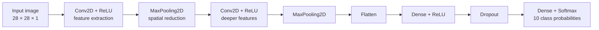
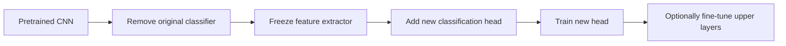

# 018 — Image Classification

**Course:** 03 — Machine Learning and Deep Learning
**Module:** Module 07 — Deep Learning
**Content Group:** Applications
**Roadmap Source:** Deep Learning / Applications
**Lesson Type:** Deep Learning
**Order in Module:** 018
**Suggested Duration:** 24 minutes

---

## 1. Overview

**Image classification** is the task of assigning one or more labels to an input image.

For example, given an image of an item of clothing, a classification model may predict that the image belongs to one of the following classes:

* T-shirt/top
* Trouser
* Pullover
* Dress
* Coat
* Sandal
* Shirt
* Sneaker
* Bag
* Ankle boot

Image classification is one of the most common applications of deep learning and computer vision. It is used in:

* Medical image analysis
* Product recognition
* Face and emotion recognition
* Manufacturing defect detection
* Plant disease identification
* Document classification
* Content moderation
* Wildlife monitoring

A practical image-classification project usually includes more than training a neural network. It also requires data inspection, preprocessing, validation, error analysis, and deployment.

---

## 2. Learning Objectives

By the end of this lesson, you should be able to:

* Explain image classification in your own words.
* Distinguish binary, multiclass, and multilabel classification.
* Describe how an image is represented as numerical data.
* Explain why CNNs are effective for image data.
* Build a small CNN using TensorFlow and Keras.
* Monitor training and validation performance.
* Evaluate a classifier using accuracy, precision, recall, F1-score, and a confusion matrix.
* Identify overfitting, underfitting, and label-related problems.
* Explain when data augmentation and transfer learning are useful.
* Compare a baseline CNN with a stronger architecture.

---

## 3. What Is Image Classification?

An image-classification model learns a function that maps an image to a class label.

$$
f(X) \rightarrow \hat{y}
$$

Where:

* $X$ is the input image.
* $f$ is the trained model.
* $\hat{y}$ is the predicted class.

For a multiclass problem with $K$ classes, the model normally produces a probability distribution:

$$
P(y=k \mid X), \quad k \in \{1,2,\ldots,K\}
$$

The predicted class is the class with the highest probability:

$$
\hat{y} = \arg\max_k P(y=k \mid X)
$$

### Simple example

```text
Input image
    │
    ▼
Image-classification model
    │
    ▼
Class probabilities
    │
    ├── T-shirt: 0.04
    ├── Shirt:   0.82
    ├── Coat:    0.10
    └── Others:  0.04
    │
    ▼
Predicted class: Shirt
```

---

## 4. Types of Image Classification

### 4.1 Binary Classification

Each image belongs to one of two classes.

Examples:

* Cat or dog
* Defective or normal
* Positive or negative X-ray
* Happy or sad

A binary classifier commonly uses one output neuron with a sigmoid activation:

$$
P(y=1 \mid X)=\sigma(z)
$$

A typical loss function is binary cross-entropy:

$$
L = -[y\log(p)+(1-y)\log(1-p)]
$$

---

### 4.2 Multiclass Classification

Each image belongs to exactly one class from several possible classes.

Examples:

* Fashion-MNIST clothing classification
* Handwritten digit recognition
* Animal species classification
* Traffic sign recognition

The output layer usually contains one neuron for each class and uses softmax:

$$
P(y=k \mid X)=
\frac{e^{z_k}}
{\sum_{j=1}^{K}e^{z_j}}
$$

---

### 4.3 Multilabel Classification

An image may contain multiple labels at the same time.

For example, one image might have the labels:

```text
["person", "car", "road", "traffic_light"]
```

Multilabel classification normally uses one sigmoid output per label instead of softmax.

---

## 5. Image Data Representation

A computer does not directly understand objects such as shirts, shoes, or animals. It processes images as arrays of numbers.

### Grayscale image

A grayscale image with height $H$ and width $W$ has the shape:

$$
H \times W
$$

For example, a Fashion-MNIST image has the shape:

```text
28 × 28
```

Each pixel usually has a value between 0 and 255.

### RGB image

A color image has three channels:

```text
Red, Green, Blue
```

Its shape is:

$$
H \times W \times 3
$$

For example:

```text
32 × 32 × 3
```

### Normalization

Pixel values are commonly normalized from $[0,255]$ to $[0,1]$:

$$
X_{\text{normalized}}=\frac{X}{255}
$$

Normalization improves numerical stability and usually makes optimization easier.

---

## 6. End-to-End Image-Classification Workflow


A reliable workflow separates the data into three partitions:

| Dataset        | Purpose                                         |
| -------------- | ----------------------------------------------- |
| Training set   | Used to update model parameters                 |
| Validation set | Used for model selection and training decisions |
| Test set       | Used only for final evaluation                  |

The test set should not be repeatedly used to tune the model.

---

## 7. Why Use a CNN?

A fully connected network treats every input pixel independently after flattening the image. This loses much of the image's spatial structure and can create a very large number of parameters.

A **Convolutional Neural Network**, or CNN, is designed to learn spatial patterns such as:

* Edges
* Corners
* Textures
* Shapes
* Object parts
* Higher-level visual structures

### Typical CNN architecture



### Main CNN components

#### Convolutional layer

A filter moves across an image and detects local patterns.

$$
Z_{i,j,k} =
\sum_{u,v,c}
X_{i+u,j+v,c}W_{u,v,c,k}+b_k
$$

#### ReLU activation

$$
\text{ReLU}(z)=\max(0,z)
$$

ReLU introduces nonlinearity and is computationally efficient.

#### Pooling layer

Max pooling reduces the spatial dimensions while retaining important activations.

For a $2 \times 2$ region:

$$
y=\max(x_1,x_2,x_3,x_4)
$$

#### Dense layer

Dense layers combine extracted features to perform final classification.

#### Dropout

Dropout randomly disables part of the network during training, reducing reliance on individual neurons and helping control overfitting.

---

## 8. Fashion-MNIST Case Study

Fashion-MNIST is a useful beginner dataset for image classification.

### Dataset characteristics

| Property          |                     Value |
| ----------------- | ------------------------: |
| Training images   |                    60,000 |
| Test images       |                    10,000 |
| Image size        |            $28 \times 28$ |
| Channels          |       1 grayscale channel |
| Number of classes |                        10 |
| Task              | Multiclass classification |

### Class labels

```python
class_names = [
    "T-shirt/top",
    "Trouser",
    "Pullover",
    "Dress",
    "Coat",
    "Sandal",
    "Shirt",
    "Sneaker",
    "Bag",
    "Ankle boot",
]
```

### Suggested experiment

Compare:

1. A simple fully connected neural network.
2. A small CNN trained from scratch.
3. A deeper CNN or small residual network.
4. An optional transfer-learning model.

The objective is not only to obtain the highest accuracy. It is also to understand why one model performs better than another.

---

## 9. TensorFlow/Keras Baseline

### 9.1 Load and preprocess the data

```python
import numpy as np
import tensorflow as tf

from tensorflow import keras
from tensorflow.keras import layers

tf.keras.utils.set_random_seed(42)

(x_train, y_train), (x_test, y_test) = (
    keras.datasets.fashion_mnist.load_data()
)

# Convert pixel values from [0, 255] to [0, 1].
x_train = x_train.astype("float32") / 255.0
x_test = x_test.astype("float32") / 255.0

# Add the channel dimension: (28, 28) -> (28, 28, 1).
x_train = np.expand_dims(x_train, axis=-1)
x_test = np.expand_dims(x_test, axis=-1)

print("Training shape:", x_train.shape)
print("Test shape:", x_test.shape)
```

Expected shapes:

```text
Training shape: (60000, 28, 28, 1)
Test shape:     (10000, 28, 28, 1)
```

---

### 9.2 Create a validation set

```python
x_validation = x_train[-6000:]
y_validation = y_train[-6000:]

x_train_small = x_train[:-6000]
y_train_small = y_train[:-6000]
```

This creates approximately:

```text
54,000 training samples
6,000 validation samples
10,000 test samples
```

---

### 9.3 Build a small CNN

```python
model = keras.Sequential(
    [
        layers.Input(shape=(28, 28, 1)),

        layers.Conv2D(
            filters=32,
            kernel_size=3,
            padding="same",
            activation="relu",
        ),
        layers.MaxPooling2D(pool_size=2),

        layers.Conv2D(
            filters=64,
            kernel_size=3,
            padding="same",
            activation="relu",
        ),
        layers.MaxPooling2D(pool_size=2),

        layers.Flatten(),

        layers.Dense(128, activation="relu"),
        layers.Dropout(0.30),

        layers.Dense(10, activation="softmax"),
    ]
)

model.summary()
```

---

### 9.4 Compile the model

```python
model.compile(
    optimizer=keras.optimizers.Adam(learning_rate=1e-3),
    loss="sparse_categorical_crossentropy",
    metrics=["accuracy"],
)
```

Use `sparse_categorical_crossentropy` because the labels are integer class IDs:

```text
0, 1, 2, ..., 9
```

Use `categorical_crossentropy` when the targets are one-hot encoded.

---

### 9.5 Configure callbacks

```python
callbacks = [
    keras.callbacks.ModelCheckpoint(
        filepath="best_fashion_cnn.keras",
        monitor="val_loss",
        save_best_only=True,
        verbose=1,
    ),

    keras.callbacks.EarlyStopping(
        monitor="val_loss",
        patience=8,
        restore_best_weights=True,
        verbose=1,
    ),

    keras.callbacks.ReduceLROnPlateau(
        monitor="val_loss",
        factor=0.5,
        patience=3,
        min_lr=1e-6,
        verbose=1,
    ),
]
```

The callbacks have different purposes:

| Callback            | Purpose                                              |
| ------------------- | ---------------------------------------------------- |
| `ModelCheckpoint`   | Saves the best model                                 |
| `EarlyStopping`     | Stops when validation performance no longer improves |
| `ReduceLROnPlateau` | Reduces the learning rate when improvement stalls    |

---

### 9.6 Train the model

```python
history = model.fit(
    x_train_small,
    y_train_small,
    validation_data=(x_validation, y_validation),
    epochs=100,
    batch_size=128,
    callbacks=callbacks,
    verbose=1,
)
```

Setting `epochs=100` does not mean that training must run for all 100 epochs.

With early stopping, 100 is the maximum training budget. Training may stop much earlier when the validation loss no longer improves.

---

## 10. Monitoring the Training Process

Always compare training and validation curves.

```python
import matplotlib.pyplot as plt

plt.figure(figsize=(8, 5))
plt.plot(history.history["loss"], label="Training loss")
plt.plot(history.history["val_loss"], label="Validation loss")
plt.xlabel("Epoch")
plt.ylabel("Loss")
plt.title("Training and Validation Loss")
plt.legend()
plt.show()
```

```python
plt.figure(figsize=(8, 5))
plt.plot(history.history["accuracy"], label="Training accuracy")
plt.plot(history.history["val_accuracy"], label="Validation accuracy")
plt.xlabel("Epoch")
plt.ylabel("Accuracy")
plt.title("Training and Validation Accuracy")
plt.legend()
plt.show()
```

### Healthy training

```text
Training loss decreases
Validation loss decreases
Training and validation curves remain reasonably close
```

### Overfitting

```text
Training loss continues to decrease
Validation loss begins to increase
Training accuracy becomes much higher than validation accuracy
```

### Underfitting

```text
Training accuracy remains low
Validation accuracy also remains low
Both losses remain high
```

Training and validation curves do not need to be identical. A small generalization gap is normal.

---

## 11. Model Evaluation

### 11.1 Test accuracy

```python
test_loss, test_accuracy = model.evaluate(
    x_test,
    y_test,
    verbose=0,
)

print(f"Test loss: {test_loss:.4f}")
print(f"Test accuracy: {test_accuracy:.4f}")
```

A small Fashion-MNIST CNN may obtain approximately 90% test accuracy, although the exact result depends on:

* Random initialization
* Architecture
* Learning rate
* Batch size
* Number of epochs
* Validation strategy
* Regularization
* Data preprocessing

Accuracy should not be reported without explaining the experiment.

---

### 11.2 Predictions

```python
probabilities = model.predict(x_test, verbose=0)
y_pred = np.argmax(probabilities, axis=1)
```

---

### 11.3 Classification report

```python
from sklearn.metrics import classification_report

print(
    classification_report(
        y_test,
        y_pred,
        target_names=class_names,
        digits=4,
    )
)
```

Important metrics include:

#### Accuracy

$$
\text{Accuracy} =
\frac{\text{Number of correct predictions}}
{\text{Total number of predictions}}
$$

#### Precision

$$
\text{Precision} =
\frac{TP}{TP+FP}
$$

Precision asks:

> When the model predicts a class, how often is that prediction correct?

#### Recall

$$
\text{Recall} =
\frac{TP}{TP+FN}
$$

Recall asks:

> Of all real examples of a class, how many did the model detect?

#### F1-score

$$
F_1 =
2
\cdot
\frac{\text{Precision}\cdot\text{Recall}}
{\text{Precision}+\text{Recall}}
$$

F1-score balances precision and recall.

---

## 12. Confusion Matrix

A confusion matrix shows how predictions are distributed across the real classes.

```python
from sklearn.metrics import ConfusionMatrixDisplay

ConfusionMatrixDisplay.from_predictions(
    y_test,
    y_pred,
    display_labels=class_names,
    xticks_rotation=45,
    cmap="Blues",
)

plt.title("Fashion-MNIST Confusion Matrix")
plt.tight_layout()
plt.show()
```

### How to read it

* Rows represent true labels.
* Columns represent predicted labels.
* Diagonal cells represent correct predictions.
* Off-diagonal cells represent mistakes.

```text
                    Predicted
                 T-shirt  Shirt  Coat
True T-shirt       820     140    40
True Shirt         120     760   120
True Coat           30     100   870
```

The most important question is not only:

> How many mistakes did the model make?

It is also:

> Which classes are confused, and why?

---

## 13. Fashion-MNIST Error Analysis

Fashion-MNIST models often confuse visually similar categories, such as:

* T-shirt/top and Shirt
* Shirt and Coat
* Pullover and Coat
* Sandal and Sneaker
* Sneaker and Ankle boot

Possible reasons include:

1. The images are only $28 \times 28$ pixels.
2. They are grayscale.
3. Fine visual details are difficult to observe.
4. Some classes have similar shapes.
5. The model may focus on background or outline patterns.
6. Some examples may be ambiguous even to humans.

### Inspect individual errors

```python
wrong_indices = np.where(y_pred != y_test)[0]

plt.figure(figsize=(10, 8))

for position, index in enumerate(wrong_indices[:12]):
    plt.subplot(3, 4, position + 1)
    plt.imshow(x_test[index].squeeze(), cmap="gray")

    true_name = class_names[y_test[index]]
    predicted_name = class_names[y_pred[index]]
    confidence = probabilities[index][y_pred[index]]

    plt.title(
        f"True: {true_name}\n"
        f"Pred: {predicted_name}\n"
        f"Conf: {confidence:.2f}"
    )
    plt.axis("off")

plt.tight_layout()
plt.show()
```

Error analysis may reveal that improving data quality is more useful than simply adding more layers.

---

## 14. Data Augmentation

Data augmentation creates modified training examples without changing their semantic label.

Common transformations include:

* Small rotations
* Small translations
* Horizontal flips
* Zoom
* Brightness adjustment
* Random cropping
* Contrast adjustment

```python
augmentation = keras.Sequential(
    [
        layers.RandomRotation(0.05),
        layers.RandomTranslation(
            height_factor=0.05,
            width_factor=0.05,
        ),
        layers.RandomZoom(0.05),
    ],
    name="augmentation",
)
```

It can be added before the convolutional layers:

```python
model = keras.Sequential(
    [
        layers.Input(shape=(28, 28, 1)),
        augmentation,
        layers.Conv2D(32, 3, padding="same", activation="relu"),
        layers.MaxPooling2D(),
        layers.Conv2D(64, 3, padding="same", activation="relu"),
        layers.MaxPooling2D(),
        layers.Flatten(),
        layers.Dense(128, activation="relu"),
        layers.Dropout(0.30),
        layers.Dense(10, activation="softmax"),
    ]
)
```

### Important caveat

Augmentation must reflect transformations that could realistically occur in the target application.

For Fashion-MNIST:

* Small translations may be reasonable.
* Small rotations may be reasonable.
* Vertical flipping is normally unrealistic.
* Very large rotations may change the meaning of the image.
* Strong augmentation may reduce accuracy rather than improve it.

If augmentation produces nearly the same test accuracy, it may still improve robustness. Compare more than the final accuracy:

* Validation stability
* Generalization gap
* Per-class recall
* Performance under shifted or noisy inputs

---

## 15. Transfer Learning

Transfer learning reuses knowledge learned by a model trained on a large dataset.



Popular pretrained architectures include:

* MobileNet
* EfficientNet
* ResNet
* DenseNet
* VGG

### Feature extraction

The pretrained convolutional backbone is frozen while a new classifier is trained.

### Fine-tuning

Some pretrained layers are unfrozen and trained using a small learning rate.

### Fashion-MNIST caveat

Transfer learning is not automatically the best choice for Fashion-MNIST because:

* Images are very small.
* Images are grayscale.
* ImageNet models expect RGB images.
* Many pretrained models expect larger input sizes.
* Resizing $28 \times 28$ images may not create additional visual information.
* The domain differs significantly from natural ImageNet photographs.

For this dataset, a small CNN or a small residual network trained from scratch may be a more appropriate comparison.

Transfer learning becomes more valuable when:

* The custom dataset is small.
* Images are more complex.
* Images resemble the pretrained model's original data.
* Training compute is limited.
* A strong pretrained backbone is available.

---

## 16. Recommended Model Comparison

A more complete project should compare multiple approaches under the same experimental conditions.

| Model                   | Purpose                                      |
| ----------------------- | -------------------------------------------- |
| Dense neural network    | Non-convolutional baseline                   |
| Small CNN               | Main baseline for spatial learning           |
| Deeper CNN              | Tests additional feature-extraction capacity |
| Small ResNet            | Tests residual connections                   |
| Transfer-learning model | Tests pretrained features                    |

Keep the following conditions consistent:

* Same train/validation/test split
* Same normalization
* Same random seed
* Same metric definitions
* Same maximum epoch budget
* Same early-stopping policy

### Example result table

| Model             | Parameters | Best validation accuracy | Test accuracy | Training time |
| ----------------- | ---------: | -----------------------: | ------------: | ------------: |
| Dense network     |       110K |                     0.87 |          0.86 |         1 min |
| Small CNN         |       420K |                     0.91 |          0.90 |         3 min |
| Small ResNet      |       680K |                     0.92 |          0.91 |         6 min |
| Transfer learning |       2.3M |                     0.91 |          0.90 |        10 min |

These values are examples only. Record the actual measurements from your experiment.

---

## 17. Experiment Tracking

For each experiment, record:

```text
Experiment ID:
Dataset version:
Random seed:
Model architecture:
Number of parameters:
Optimizer:
Initial learning rate:
Batch size:
Maximum epochs:
Early-stopping patience:
Augmentation:
Best validation loss:
Best validation accuracy:
Test accuracy:
Macro F1-score:
Training time:
Main failure cases:
```

Without experiment tracking, it is difficult to know which change actually improved the model.

---

## 18. Common Mistakes

### 18.1 Using accuracy as the only metric

A single accuracy value hides which classes perform poorly.

**Better approach:** inspect precision, recall, F1-score, and the confusion matrix.

---

### 18.2 Evaluating repeatedly on the test set

This indirectly tunes the model to the test data.

**Better approach:** use the validation set for model decisions and evaluate the test set only after the design is finalized.

---

### 18.3 Ignoring train and validation curves

A final accuracy value does not reveal whether the model overfitted.

**Better approach:** plot loss and accuracy after every experiment.

---

### 18.4 Applying unrealistic augmentation

Not every visual transformation preserves the correct label.

**Better approach:** choose augmentation based on domain knowledge.

---

### 18.5 Increasing epochs without callbacks

Longer training may only increase overfitting.

**Better approach:** set a generous maximum epoch count and combine it with early stopping.

---

### 18.6 Comparing models unfairly

Different splits, preprocessing, or training budgets make comparisons unreliable.

**Better approach:** use a controlled experimental protocol.

---

### 18.7 Assuming a deeper model is always better

A larger model may:

* Overfit
* Train more slowly
* Use more memory
* Produce only a small accuracy gain

Always compare performance, cost, complexity, and deployment requirements.

---

### 18.8 Ignoring data quality

Model errors may come from:

* Incorrect labels
* Duplicate images
* Corrupted images
* Ambiguous classes
* Distribution mismatch
* Class imbalance

Improving the dataset may produce a larger gain than changing the architecture.

---

## 19. Practical Exercise

Build an image-classification notebook using Fashion-MNIST.

### Part A — Baseline

1. Load Fashion-MNIST.
2. Visualize at least 20 examples.
3. Normalize the pixel values.
4. Create training, validation, and test sets.
5. Train a dense neural-network baseline.

### Part B — CNN

1. Build a small CNN.
2. Use Adam and sparse categorical cross-entropy.
3. Add model checkpointing.
4. Add early stopping.
5. Add learning-rate reduction.
6. Train for a maximum of 100 epochs.

### Part C — Evaluation

1. Plot training and validation loss.
2. Plot training and validation accuracy.
3. Calculate test accuracy.
4. Generate a classification report.
5. Create a confusion matrix.
6. Display at least 12 incorrect predictions.

### Part D — Improvement

Choose at least two experiments:

* Add Batch Normalization.
* Change the dropout rate.
* Add suitable data augmentation.
* Increase or decrease the number of filters.
* Compare Adam with SGD.
* Build a small residual network.
* Test a transfer-learning approach.
* Use class-specific error analysis.

### Part E — Conclusion

Write a short conclusion answering:

1. Which model performed best?
2. Was the improvement statistically or practically meaningful?
3. Which classes were most difficult?
4. Why were those classes confused?
5. Did augmentation improve accuracy or stability?
6. Did the deeper model justify its additional complexity?
7. What would you improve next?

---

## 20. Suggested Project Structure

```text
image-classification-project/
│
├── data/
├── notebooks/
│   ├── 01_data_exploration.ipynb
│   ├── 02_baseline_dense.ipynb
│   ├── 03_cnn_experiment.ipynb
│   └── 04_model_comparison.ipynb
│
├── src/
│   ├── data.py
│   ├── models.py
│   ├── train.py
│   ├── evaluate.py
│   └── predict.py
│
├── models/
│   └── best_fashion_cnn.keras
│
├── reports/
│   ├── learning_curves.png
│   ├── confusion_matrix.png
│   └── experiment_results.csv
│
├── requirements.txt
└── README.md
```

---

## 21. Portfolio Deliverables

A strong portfolio version should contain:

* A reproducible notebook
* Dataset description
* Data visualization
* Baseline model
* CNN architecture
* Training and validation curves
* Confusion matrix
* Per-class metrics
* Model comparison table
* Error analysis
* Saved model
* Prediction script or API
* Clear limitations and next steps

Optional deployment artifacts include:

* FastAPI prediction service
* Streamlit or Gradio interface
* Docker image
* ONNX or TensorFlow Lite export
* Mobile inference demo

---

## 22. Completion Checklist

* [ ] I can explain image classification in one or two minutes.
* [ ] I can distinguish binary, multiclass, and multilabel classification.
* [ ] I understand how images are stored as numerical tensors.
* [ ] I can explain the role of convolution, pooling, dense layers, and softmax.
* [ ] I trained a baseline model and a CNN.
* [ ] I used separate training, validation, and test sets.
* [ ] I plotted training and validation curves.
* [ ] I generated a confusion matrix.
* [ ] I analyzed specific misclassified examples.
* [ ] I compared at least two model architectures.
* [ ] I documented at least one caveat or assumption.
* [ ] I saved a model, notebook, chart, API, or portfolio artifact.

---

## 23. Related Outcome

Develop a practical understanding of:

* Neural networks
* Convolutional Neural Networks
* Image preprocessing
* Training and validation
* Regularization
* Model evaluation
* Data augmentation
* Transfer learning
* Error analysis
* Model deployment

---

## 24. Related Project

### Mini Project: Fashion Image Classification

Compare:

1. A fully connected neural network
2. A small CNN
3. A deeper CNN or small residual network
4. An optional transfer-learning model

Required outputs:

* Accuracy and loss curves
* Test accuracy
* Precision, recall, and F1-score
* Confusion matrix
* Misclassification examples
* Architecture comparison table
* Final recommendation

---

## 25. Summary

Image classification maps an image to one or more semantic labels.

A complete project follows this process:

```text
dataset
    → data inspection
    → preprocessing
    → model architecture
    → training loop
    → validation monitoring
    → test metrics
    → confusion matrix
    → error analysis
    → model comparison
    → deployment
```

CNNs are effective because they learn local and hierarchical visual features while preserving spatial structure.

However, model architecture is only one part of the solution. A reliable image-classification system also depends on:

* Correct labels
* Representative data
* Suitable preprocessing
* Fair validation
* Appropriate metrics
* Careful error analysis
* Reproducible experiments

Do not stop after obtaining an accuracy score. Investigate where the model fails, explain why it fails, and determine whether the next improvement should come from the data, the model, or the training process.
