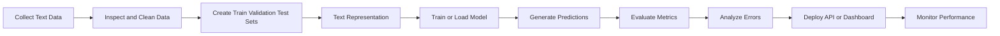
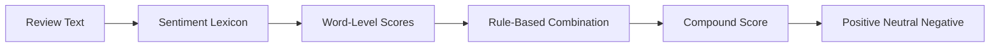
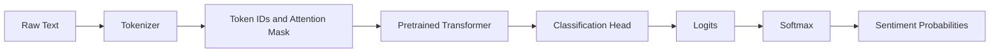
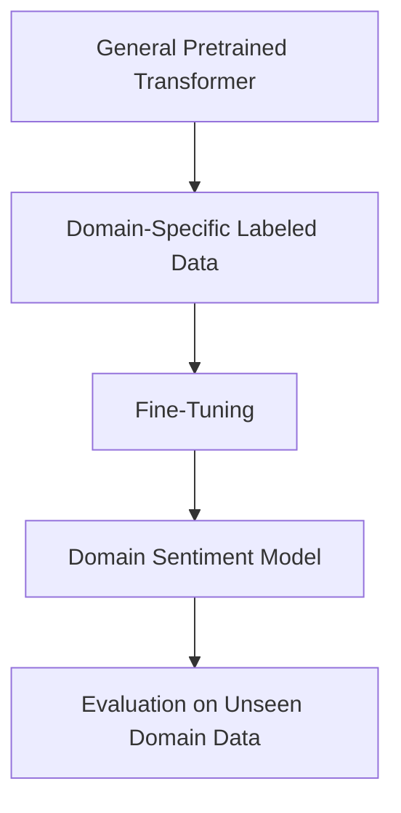
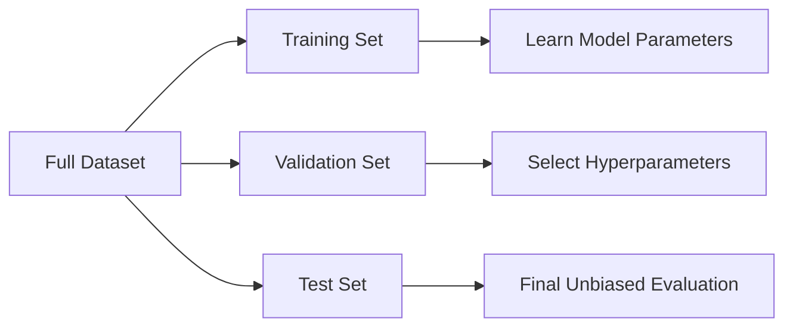
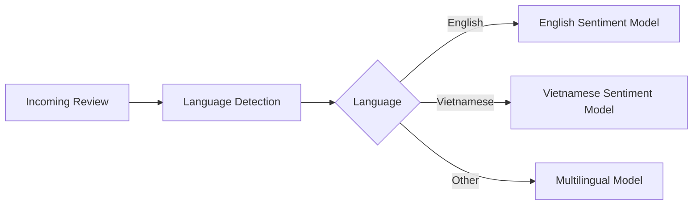
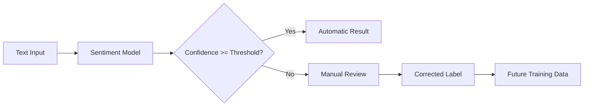
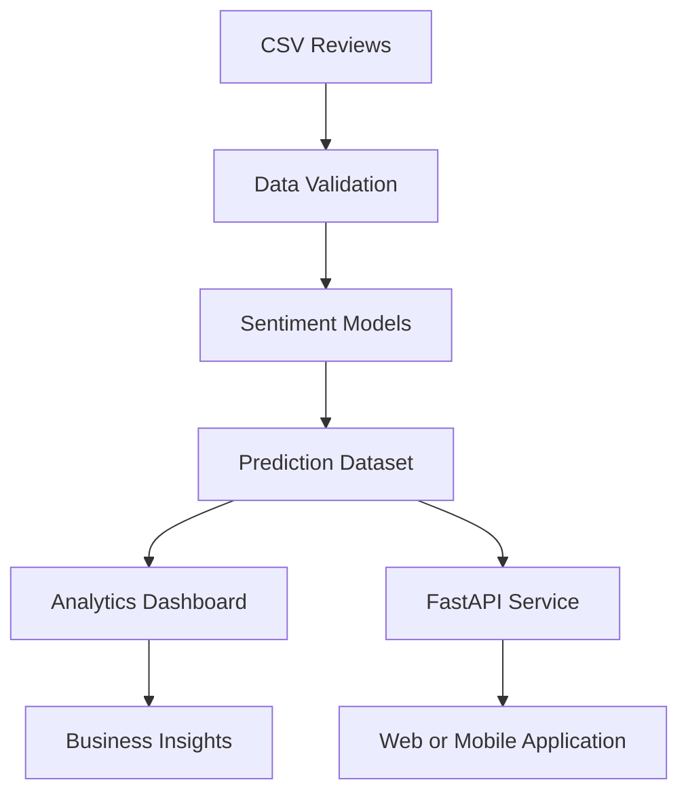

# 023 — Sentiment Analysis

**Course:** 03 — Machine Learning and Deep Learning
**Module:** Module 07 — Deep Learning
**Content Group:** Applications
**Roadmap Source:** Deep Learning / Applications
**Lesson Type:** Deep Learning
**Order in Module:** 023
**Suggested Duration:** 24 minutes

---

## 1. Overview

**Sentiment Analysis** is the task of identifying the emotional tone or opinion expressed in text.

A sentiment-analysis system commonly classifies text as:

* **Positive**
* **Negative**
* **Neutral**

More advanced systems may predict:

* Emotion categories such as joy, anger, sadness, fear, or surprise
* A continuous sentiment score
* Sentiment toward a specific entity or product feature
* Multiple sentiments within the same document

Example:

```text
"The hotel room was clean, but the service was extremely slow."
```

A basic classifier may assign one overall label:

```text
Negative
```

A more advanced aspect-based system may produce:

```text
room cleanliness -> positive
service speed    -> negative
```

Sentiment Analysis is widely used for:

* Product reviews
* Hotel and restaurant reviews
* Customer-support messages
* Social-media monitoring
* Survey responses
* App-store reviews
* Brand reputation analysis
* Financial-news analysis
* Employee-feedback analysis

---

## 2. Learning Objectives

After completing this lesson, you should be able to:

1. Explain Sentiment Analysis in your own words.
2. Recognize Sentiment Analysis as a text-classification problem.
3. Prepare text data for sentiment modeling.
4. Build a lexicon-based baseline using VADER.
5. Build a classical machine-learning baseline using TF-IDF.
6. Use a pretrained Transformer model from Hugging Face.
7. Evaluate a sentiment model with suitable classification metrics.
8. Analyze common errors such as sarcasm, negation, class imbalance, and domain shift.
9. Turn the analysis into a notebook, API, dashboard, or portfolio project.

---

## 3. What Is Sentiment Analysis?

Sentiment Analysis is a subfield of **Natural Language Processing**, or NLP.

Its objective is to learn a function:

$$
f(x) = y
$$

where:

* $x$ is a piece of text
* $y$ is a sentiment label or score

For binary sentiment classification:

$$
y \in \{\text{negative},\text{positive}\}
$$

For three-class classification:

$$
y \in \{\text{negative},\text{neutral},\text{positive}\}
$$

A probabilistic model may return:

$$
P(y \mid x)
$$

Example:

```text
Input:
"The application is fast and easy to use."

Output:
Positive: 0.97
Negative: 0.03
```

The predicted label is usually the class with the highest probability:

$$
\hat{y} = \arg\max_y P(y \mid x)
$$

---

## 4. Sentiment Analysis Workflow



A practical workflow is:

```text
dataset
    ↓
data cleaning
    ↓
text representation
    ↓
model training or inference
    ↓
validation metrics
    ↓
confusion matrix
    ↓
error analysis
    ↓
deployment
```

---

## 5. Levels of Sentiment Analysis

### 5.1 Document-Level Sentiment

The entire document receives one label.

```text
Review:
"I loved the hotel. The staff were friendly and the room was comfortable."

Prediction:
Positive
```

This approach is common for product and movie reviews.

---

### 5.2 Sentence-Level Sentiment

Each sentence is classified independently.

```text
"The room was excellent."       -> Positive
"The reception was very slow."  -> Negative
```

This is useful when a document contains multiple opinions.

---

### 5.3 Aspect-Based Sentiment Analysis

The model detects sentiment toward particular attributes.

```text
"The camera is excellent, but the battery life is disappointing."
```

Output:

| Aspect       | Sentiment |
| ------------ | --------- |
| Camera       | Positive  |
| Battery life | Negative  |

Aspect-based sentiment is more useful for business analysis because it explains **what** customers like or dislike.

---

### 5.4 Emotion Detection

Instead of positive and negative labels, the model predicts emotions.

```text
"I cannot believe the application deleted all my files."
```

Possible prediction:

```text
Emotion: Anger
```

Common emotion classes include:

* Joy
* Sadness
* Anger
* Fear
* Surprise
* Disgust

---

### 5.5 Sentiment Regression

The model predicts a continuous score.

For example:

$$
-1 \leq s \leq 1
$$

where:

* $-1$ represents strongly negative sentiment
* $0$ represents neutral sentiment
* $1$ represents strongly positive sentiment

Example:

```text
"Absolutely terrible customer service." -> -0.91
"The product is acceptable."            ->  0.05
"I strongly recommend this product."     ->  0.88
```

---

## 6. Example Dataset

A sentiment dataset commonly contains a text column and a target label.

```csv
review,sentiment
"The product is excellent",positive
"The package arrived damaged",negative
"It works as expected",neutral
"The customer service was very helpful",positive
"I regret buying this product",negative
```

A hotel-review dataset may contain additional metadata:

```csv
review_date,hotel_name,review,sentiment
2026-01-15,Hotel A,"Excellent location and friendly staff",positive
2026-01-16,Hotel B,"The room was dirty and noisy",negative
```

This metadata can support business questions such as:

* Which hotel has the lowest average sentiment?
* Does sentiment change by month?
* Which product feature receives the most complaints?
* Did customer sentiment improve after a product update?

---

## 7. Data Preparation

Text data often contains:

* Missing values
* Duplicate reviews
* HTML tags
* URLs
* Email addresses
* Unusual whitespace
* Repeated characters
* Emojis
* Spelling errors
* Mixed languages
* Extremely short reviews

A basic inspection:

```python
import pandas as pd

df = pd.read_csv("reviews.csv")

print(df.head())
print(df.info())
print(df.isna().sum())
print(df["sentiment"].value_counts())
```

Remove missing or duplicate examples:

```python
df = df.dropna(subset=["review", "sentiment"])
df = df.drop_duplicates(subset=["review"])
```

Normalize labels:

```python
df["sentiment"] = (
    df["sentiment"]
    .astype(str)
    .str.strip()
    .str.lower()
)
```

Basic text cleaning:

```python
import re

def clean_text(text: str) -> str:
    text = str(text)
    text = re.sub(r"<[^>]+>", " ", text)
    text = re.sub(r"https?://\S+|www\.\S+", " ", text)
    text = re.sub(r"\s+", " ", text)
    return text.strip()

df["clean_review"] = df["review"].apply(clean_text)
```

### Important Warning

Do not automatically remove every punctuation mark, emoji, capitalization pattern, or stop word.

These features may contain sentiment information:

```text
"GOOD!!!"  -> strong positive emphasis
"not good" -> negative because of negation
"😡"        -> strong negative signal
```

For pretrained Transformers, aggressive preprocessing may remove information that the model was trained to understand.

---

## 8. Exploratory Data Analysis

Before training a model, inspect the label distribution.

```python
import matplotlib.pyplot as plt

label_counts = df["sentiment"].value_counts()

label_counts.plot(kind="bar")
plt.title("Sentiment Class Distribution")
plt.xlabel("Sentiment")
plt.ylabel("Number of Reviews")
plt.tight_layout()
plt.show()
```

An imbalanced dataset may look like:

```text
Positive: 80%
Negative: 15%
Neutral:   5%
```

In this situation, a model that predicts `positive` for every review would obtain:

$$
\text{Accuracy} = 80\%
$$

However, it would be practically useless for detecting complaints.

Therefore, do not evaluate an imbalanced sentiment model using accuracy alone.

---

## 9. Approach 1: Lexicon-Based Sentiment with VADER

VADER stands for:

> Valence Aware Dictionary and Sentiment Reasoner

VADER is a rule- and lexicon-based sentiment analyzer. It assigns sentiment values to words and combines them into an overall score.

It is particularly useful for:

* Short English text
* Social-media content
* Quick baselines
* Unlabeled datasets
* Exploratory analysis

Install NLTK:

```bash
pip install nltk
```

Download the VADER lexicon:

```python
import nltk

nltk.download("vader_lexicon")
```

Create the analyzer:

```python
from nltk.sentiment import SentimentIntensityAnalyzer

analyzer = SentimentIntensityAnalyzer()
```

Analyze one sentence:

```python
text = "The application is fast and extremely useful!"

scores = analyzer.polarity_scores(text)
print(scores)
```

Example output:

```python
{
    "neg": 0.0,
    "neu": 0.48,
    "pos": 0.52,
    "compound": 0.77
}
```

The `compound` score ranges from approximately $-1$ to $1$.

A common rule is:

```python
def vader_label(compound_score: float) -> str:
    if compound_score >= 0.05:
        return "positive"
    if compound_score <= -0.05:
        return "negative"
    return "neutral"
```

Apply VADER to a dataset:

```python
df["vader_scores"] = df["clean_review"].apply(
    analyzer.polarity_scores
)

df["sentiment_score"] = df["vader_scores"].apply(
    lambda scores: scores["compound"]
)

df["predicted_sentiment"] = df["sentiment_score"].apply(
    vader_label
)
```

### VADER Pipeline



### Advantages

* Fast
* Easy to use
* No labeled training data required
* Interpretable
* Useful as a baseline

### Limitations

* Limited understanding of context
* Weak on domain-specific vocabulary
* Weak on complex sarcasm
* Primarily designed for English
* Cannot easily adapt itself from new training examples

Example:

```text
"Great, another update that deleted all my settings."
```

The word `Great` is positive, but the overall sentence is sarcastically negative.

A lexicon-based model may misclassify it.

---

## 10. Approach 2: TF-IDF with Classical Machine Learning

A strong classical baseline for sentiment classification is:

```text
Text
  ↓
TF-IDF Vectorizer
  ↓
Linear Classifier
  ↓
Sentiment Label
```

Common classifiers include:

* Logistic Regression
* Linear Support Vector Machine
* Naive Bayes

### 10.1 TF-IDF

TF-IDF stands for:

> Term Frequency–Inverse Document Frequency

It assigns a weight to each term based on:

1. How frequently the term appears in a document
2. How rare the term is across the full collection

Term frequency:

$$
TF(t,d) =
\frac{\text{count of term }t\text{ in document }d}
{\text{number of terms in document }d}
$$

Inverse document frequency:

$$
IDF(t) =
\log
\left(
\frac{N}
{1 + DF(t)}
\right)
$$

Therefore:

$$
TFIDF(t,d) = TF(t,d) \times IDF(t)
$$

Frequent but uninformative words receive low weights, while distinctive words receive higher weights.

---

### 10.2 Train/Test Split

```python
from sklearn.model_selection import train_test_split

X = df["clean_review"]
y = df["sentiment"]

X_train, X_test, y_train, y_test = train_test_split(
    X,
    y,
    test_size=0.20,
    random_state=42,
    stratify=y
)
```

Using `stratify=y` helps preserve the label distribution in both sets.

---

### 10.3 Build a Pipeline

```python
from sklearn.feature_extraction.text import TfidfVectorizer
from sklearn.linear_model import LogisticRegression
from sklearn.pipeline import Pipeline

model = Pipeline(
    steps=[
        (
            "tfidf",
            TfidfVectorizer(
                max_features=20_000,
                ngram_range=(1, 2),
                min_df=2,
                sublinear_tf=True
            )
        ),
        (
            "classifier",
            LogisticRegression(
                max_iter=1_000,
                class_weight="balanced"
            )
        )
    ]
)
```

Train the model:

```python
model.fit(X_train, y_train)
```

Generate predictions:

```python
y_pred = model.predict(X_test)
```

Evaluate it:

```python
from sklearn.metrics import classification_report

print(classification_report(y_test, y_pred))
```

---

### 10.4 Linear Support Vector Machine

Linear SVM is another strong text-classification baseline.

```python
from sklearn.svm import LinearSVC

svm_model = Pipeline(
    steps=[
        (
            "tfidf",
            TfidfVectorizer(
                max_features=20_000,
                ngram_range=(1, 2)
            )
        ),
        (
            "classifier",
            LinearSVC(
                class_weight="balanced"
            )
        )
    ]
)

svm_model.fit(X_train, y_train)
svm_predictions = svm_model.predict(X_test)
```

A linear model often performs well because TF-IDF produces a high-dimensional sparse representation.

---

### 10.5 Why Use N-Grams?

Unigrams represent individual words:

```text
not
good
```

Bigrams preserve short phrases:

```text
not good
```

Without bigrams, a model may treat `good` as positive and fail to understand negation.

```python
TfidfVectorizer(
    ngram_range=(1, 2)
)
```

This configuration includes both unigrams and bigrams.

---

## 11. Approach 3: Pretrained Transformer

Transformers process words in context rather than treating them only as isolated tokens.

Consider:

```text
"The screen is not bad."
```

A bag-of-words model sees:

```text
screen
not
bad
```

A Transformer can model the contextual relationship between `not` and `bad`.

### Transformer Inference Workflow



Install the required packages:

```bash
pip install transformers torch
```

Use a pretrained pipeline:

```python
from transformers import pipeline

sentiment_pipeline = pipeline(
    task="sentiment-analysis",
    model="distilbert-base-uncased-finetuned-sst-2-english"
)
```

Predict one example:

```python
result = sentiment_pipeline(
    "The application is simple, fast, and reliable."
)

print(result)
```

Example output:

```python
[
    {
        "label": "POSITIVE",
        "score": 0.998
    }
]
```

Predict multiple reviews:

```python
texts = [
    "I really enjoyed using this application.",
    "The latest update made everything worse.",
    "The product is acceptable but not impressive."
]

results = sentiment_pipeline(
    texts,
    batch_size=16,
    truncation=True
)

for text, result in zip(texts, results):
    print(text)
    print(result)
    print()
```

---

## 12. Efficient Batch Inference

Avoid processing a large dataset one row at a time when batching is available.

```python
texts = df["clean_review"].tolist()

results = sentiment_pipeline(
    texts,
    batch_size=32,
    truncation=True,
    max_length=512
)
```

Add the results to the DataFrame:

```python
df["transformer_label"] = [
    result["label"].lower()
    for result in results
]

df["transformer_confidence"] = [
    result["score"]
    for result in results
]
```

For large datasets:

* Use GPU acceleration when available.
* Process the data in batches.
* Save intermediate results.
* Monitor memory usage.
* Avoid repeatedly loading the model.
* Consider model quantization or a smaller distilled model.

---

## 13. Fine-Tuning a Transformer

A pretrained sentiment model may not match your domain.

For example, a model trained on movie reviews may misunderstand:

* Medical vocabulary
* Financial language
* Vietnamese customer reviews
* Software-development terminology
* Hotel-specific complaints

Fine-tuning adapts the pretrained model to a labeled domain dataset.



General fine-tuning process:

1. Select a pretrained language model.
2. Tokenize the training dataset.
3. Map sentiment labels to numerical IDs.
4. Train for a small number of epochs.
5. Evaluate on validation data.
6. Save the best checkpoint.
7. Test on an untouched test set.

Example label mapping:

```python
label_to_id = {
    "negative": 0,
    "neutral": 1,
    "positive": 2
}
```

Fine-tuning is appropriate when:

* You have enough labeled domain data.
* The pretrained model performs poorly in your domain.
* Sentiment categories differ from the original model.
* The business value justifies additional compute and complexity.

---

## 14. Choosing an Approach

| Approach               |       Training Data |     Speed | Context Understanding | Interpretability |
| ---------------------- | ------------------: | --------: | --------------------: | ---------------: |
| VADER                  |        Not required | Very fast |                   Low |             High |
| TF-IDF + Linear Model  |            Required |      Fast |                Medium |   Medium to high |
| Pretrained Transformer | Not always required |    Medium |                  High |              Low |
| Fine-Tuned Transformer |            Required |    Slower |             Very high |              Low |

A sensible progression is:

```text
VADER
  ↓
TF-IDF + Logistic Regression or Linear SVM
  ↓
Pretrained Transformer
  ↓
Fine-Tuned Transformer
```

Do not begin with the most complex model automatically.

A classical model may be preferable when:

* The dataset is small.
* Latency must be very low.
* The vocabulary is stable.
* Explainability is important.
* Compute resources are limited.
* The classical baseline already meets the business target.

---

## 15. Model Evaluation

### 15.1 Confusion Matrix

For binary sentiment classification:

|                 | Predicted Negative | Predicted Positive |
| --------------- | -----------------: | -----------------: |
| Actual Negative |      True Negative |     False Positive |
| Actual Positive |     False Negative |      True Positive |

Generate a confusion matrix:

```python
from sklearn.metrics import ConfusionMatrixDisplay
import matplotlib.pyplot as plt

ConfusionMatrixDisplay.from_predictions(
    y_test,
    y_pred,
    normalize="true"
)

plt.title("Normalized Confusion Matrix")
plt.tight_layout()
plt.show()
```

---

### 15.2 Accuracy

$$
Accuracy =
\frac{\text{Correct Predictions}}
{\text{All Predictions}}
$$

Accuracy is easy to interpret but can be misleading when classes are imbalanced.

---

### 15.3 Precision

$$
Precision =
\frac{TP}{TP + FP}
$$

Precision answers:

> Of all reviews predicted as positive, how many were actually positive?

High precision is important when false alerts are expensive.

---

### 15.4 Recall

$$
Recall =
\frac{TP}{TP + FN}
$$

Recall answers:

> Of all truly positive reviews, how many did the model detect?

For complaint detection, recall for the negative class may be especially important.

---

### 15.5 F1-Score

$$
F_1 =
2
\cdot
\frac{Precision \cdot Recall}
{Precision + Recall}
$$

F1 balances precision and recall.

For imbalanced multiclass sentiment analysis, consider:

* Macro F1
* Weighted F1
* Per-class F1

---

### 15.6 Classification Report

```python
from sklearn.metrics import classification_report

print(
    classification_report(
        y_test,
        y_pred,
        digits=3
    )
)
```

Example:

```text
              precision    recall  f1-score   support

negative          0.89      0.84      0.86       450
neutral           0.72      0.68      0.70       210
positive          0.93      0.96      0.94      1340

accuracy                               0.90      2000
macro avg         0.85      0.83      0.84      2000
weighted avg      0.90      0.90      0.90      2000
```

---

## 16. Business Analysis Example

Suppose the dataset contains hotel reviews:

```text
review_date
hotel_name
review
sentiment_score
```

Calculate average sentiment by hotel:

```python
hotel_sentiment = (
    df.groupby("hotel_name", as_index=False)
    ["sentiment_score"]
    .mean()
    .sort_values("sentiment_score")
)

print(hotel_sentiment.head())
```

Plot the results:

```python
import matplotlib.pyplot as plt

plot_data = hotel_sentiment.head(15)

plt.figure(figsize=(10, 6))
plt.barh(
    plot_data["hotel_name"],
    plot_data["sentiment_score"]
)

plt.title("Hotels with the Lowest Average Sentiment")
plt.xlabel("Average Sentiment Score")
plt.ylabel("Hotel")
plt.tight_layout()
plt.show()
```

Identify the hotel with the lowest average sentiment:

```python
lowest_hotel = hotel_sentiment.iloc[0]["hotel_name"]
print(lowest_hotel)
```

Analyze its monthly sentiment:

```python
df["review_date"] = pd.to_datetime(
    df["review_date"],
    errors="coerce"
)

df["review_month"] = (
    df["review_date"]
    .dt.to_period("M")
    .astype(str)
)

monthly_sentiment = (
    df[df["hotel_name"] == lowest_hotel]
    .groupby("review_month", as_index=False)
    ["sentiment_score"]
    .mean()
)
```

Plot monthly sentiment:

```python
plt.figure(figsize=(12, 5))

plt.bar(
    monthly_sentiment["review_month"],
    monthly_sentiment["sentiment_score"]
)

plt.title(
    f"Monthly Sentiment for {lowest_hotel}"
)
plt.xlabel("Month")
plt.ylabel("Average Sentiment Score")
plt.xticks(rotation=45)
plt.tight_layout()
plt.show()
```

This analysis can reveal:

* Months with unusually poor customer satisfaction
* Possible effects of staffing changes
* Seasonal operational problems
* Product or service regressions
* Improvement after business interventions

---

## 17. Comparing Multiple Models

Do not assume that a Transformer is automatically better.

Create a comparison table:

| Model                        | Accuracy | Macro F1 | Negative Recall | Inference Time |
| ---------------------------- | -------: | -------: | --------------: | -------------: |
| VADER                        |     0.74 |     0.68 |            0.61 |      2 seconds |
| TF-IDF + Logistic Regression |     0.88 |     0.85 |            0.82 |       1 second |
| DistilBERT                   |     0.91 |     0.89 |            0.88 |     35 seconds |

The final model should be selected based on:

* Quality
* Cost
* Latency
* Memory usage
* Explainability
* Maintenance complexity
* Language coverage
* Domain performance

A small improvement in F1 may not justify a major increase in infrastructure cost.

---

## 18. Error Analysis

Metrics summarize performance, but they do not explain why the model fails.

Create an error table:

```python
errors = pd.DataFrame(
    {
        "text": X_test,
        "actual": y_test,
        "predicted": y_pred
    }
)

errors = errors[
    errors["actual"] != errors["predicted"]
]

print(errors.head(20))
```

Group errors into categories.

### 18.1 Negation

```text
"The product is not good."
```

The word `good` is positive, but `not` changes its meaning.

---

### 18.2 Sarcasm

```text
"Wonderful. The application crashed again."
```

The surface vocabulary appears positive, but the true sentiment is negative.

---

### 18.3 Mixed Sentiment

```text
"The camera is excellent, but the battery is terrible."
```

A single document label loses aspect-level information.

---

### 18.4 Implicit Sentiment

```text
"I waited three hours before anyone answered."
```

The sentence does not contain an obviously negative word, but it implies dissatisfaction.

---

### 18.5 Domain-Specific Meaning

```text
"The stock is sick."
```

Meaning depends heavily on context and domain.

---

### 18.6 Very Short Text

```text
"Fine."
```

This may be positive, neutral, negative, or sarcastic depending on context.

---

### 18.7 Label Noise

Two annotators may disagree about the same review.

```text
"It does what it should, nothing more."
```

Possible labels:

* Neutral
* Slightly positive
* Slightly negative

Sentiment labels are often subjective.

---

## 19. Data Leakage

Data leakage occurs when information from the test set influences training.

A common mistake is fitting TF-IDF before splitting the data:

```python
# Incorrect approach
X_vectorized = vectorizer.fit_transform(df["review"])

X_train, X_test = train_test_split(X_vectorized)
```

The vocabulary and IDF statistics were calculated from the entire dataset, including the test set.

A safer approach is to use a pipeline:

```python
model = Pipeline(
    [
        ("tfidf", TfidfVectorizer()),
        ("classifier", LogisticRegression())
    ]
)

model.fit(X_train, y_train)
```

The vectorizer is fitted only on the training data.

---

## 20. Train, Validation, and Test Sets

A robust experiment uses three subsets:



Typical split:

```text
Training:   70%
Validation: 15%
Test:       15%
```

Do not repeatedly inspect the test-set results while developing the model. Otherwise, the test set becomes part of the tuning process.

---

## 21. Preventing Duplicate Leakage

Review datasets may contain repeated or nearly repeated text.

Example:

```text
"Great product!"
"Great product!!"
"great product"
```

If similar reviews appear in both training and test sets, evaluation results may be artificially high.

Possible protections include:

* Exact duplicate removal
* Near-duplicate detection
* Group-based splitting by product, user, or source
* Time-based splitting for production forecasting

For product reviews, consider splitting by product ID:

```python
from sklearn.model_selection import GroupShuffleSplit

splitter = GroupShuffleSplit(
    n_splits=1,
    test_size=0.20,
    random_state=42
)

train_index, test_index = next(
    splitter.split(
        df,
        groups=df["product_id"]
    )
)
```

This tests whether the model generalizes to unseen products.

---

## 22. Multilingual Sentiment Analysis

A model trained on English reviews may not work well for Vietnamese text.

Example:

```text
"Sản phẩm dùng ổn nhưng giao hàng quá chậm."
```

Possible strategies:

1. Use a Vietnamese-specific pretrained model.
2. Use a multilingual Transformer.
3. Translate text into a supported language.
4. Fine-tune on Vietnamese labeled data.
5. Train separate models for different languages.

Language should be detected or provided explicitly.



Evaluate each language separately. A high overall score may hide weak performance for a minority language.

---

## 23. Confidence Scores and Thresholds

Model confidence is not automatically equal to true probability.

Example output:

```python
{
    "label": "NEGATIVE",
    "score": 0.56
}
```

This is an uncertain prediction.

You may define a review queue:

```python
def route_prediction(label: str, confidence: float) -> str:
    if confidence < 0.70:
        return "manual_review"
    return label
```

Production workflow:



Thresholds should be selected based on business costs, not chosen arbitrarily.

---

## 24. Deployment as an API

A sentiment model can be deployed using FastAPI.

```python
from fastapi import FastAPI
from pydantic import BaseModel
from transformers import pipeline

app = FastAPI(
    title="Sentiment Analysis API"
)

classifier = pipeline(
    "sentiment-analysis",
    model="distilbert-base-uncased-finetuned-sst-2-english"
)

class SentimentRequest(BaseModel):
    text: str

@app.post("/predict")
def predict_sentiment(request: SentimentRequest):
    result = classifier(
        request.text,
        truncation=True
    )[0]

    return {
        "text": request.text,
        "label": result["label"].lower(),
        "confidence": float(result["score"])
    }
```

Run the service:

```bash
uvicorn app:app --reload
```

Example request:

```json
{
  "text": "The interface is easy to use and very responsive."
}
```

Example response:

```json
{
  "text": "The interface is easy to use and very responsive.",
  "label": "positive",
  "confidence": 0.9984
}
```

---

## 25. Production Monitoring

A deployed sentiment model should be monitored over time.

Track:

* Prediction volume
* Sentiment distribution
* Average confidence
* Processing latency
* Error rate
* Language distribution
* Input-text length
* Manual-review rate
* Performance on newly labeled samples

Possible drift signal:

```text
Training data:
70% positive
20% negative
10% neutral

Current production data:
30% positive
60% negative
10% neutral
```

This change may indicate:

* A real business problem
* A new product release
* A new customer segment
* Data-pipeline changes
* Language or domain drift

Do not automatically interpret every distribution shift as model failure.

---

## 26. Common Mistakes

### Mistake 1: Using Deep Learning When Classical ML Is Sufficient

A TF-IDF model may already provide strong accuracy, low latency, and simple deployment.

Always establish a baseline before fine-tuning a large model.

---

### Mistake 2: Evaluating Only Accuracy

Accuracy may hide poor minority-class performance.

Inspect:

* Per-class precision
* Per-class recall
* Macro F1
* Confusion matrix

---

### Mistake 3: Ignoring Class Imbalance

A heavily positive review dataset can produce misleadingly high accuracy.

Possible solutions:

* Class weights
* Resampling
* Better data collection
* Threshold adjustment
* Macro-averaged metrics

---

### Mistake 4: Over-Cleaning Text

Removing punctuation, emojis, capitalization, or negation can destroy useful information.

---

### Mistake 5: Fitting the Vectorizer Before Splitting

This creates data leakage.

Use a pipeline so preprocessing is fitted only on training data.

---

### Mistake 6: Ignoring Label Noise

Sentiment is subjective. Review questionable examples and calculate annotator agreement when possible.

---

### Mistake 7: Assuming Confidence Is Always Reliable

Neural models can produce high confidence for incorrect predictions.

Consider calibration and manual-review thresholds.

---

### Mistake 8: Ignoring Domain Shift

A movie-review model may perform poorly on hotel, banking, medical, or software reviews.

Evaluate on data that matches the target production environment.

---

### Mistake 9: Ignoring Temporal Changes

Language, products, and customer behavior change over time.

A random split may overestimate future production performance. Consider a time-based evaluation.

---

### Mistake 10: Sending Private Text to External APIs Without Review

Customer feedback may contain:

* Names
* Email addresses
* Account numbers
* Medical information
* Internal company details

Apply privacy, security, and data-governance rules before using an external API.

---

## 27. Practical Exercise

Build a sentiment classifier using a dataset such as:

* IMDb movie reviews
* Amazon product reviews
* Hotel reviews
* App-store reviews
* Customer-support messages

### Required Steps

1. Load and inspect the dataset.
2. Remove missing and duplicate records.
3. Visualize the sentiment distribution.
4. Create a stratified train/test split.
5. Train a TF-IDF baseline.
6. Evaluate it with a classification report.
7. Plot a confusion matrix.
8. Run a pretrained Transformer on the same test samples.
9. Compare the two approaches.
10. Inspect at least 20 incorrect predictions.
11. Document one important limitation.
12. Save the model or expose it through an API.

---

## 28. Suggested Notebook Structure

```text
01. Problem Definition
02. Dataset Description
03. Data Quality Checks
04. Exploratory Data Analysis
05. Text Cleaning
06. Train/Validation/Test Split
07. VADER Baseline
08. TF-IDF + Linear Model
09. Transformer Inference
10. Evaluation Metrics
11. Confusion Matrix
12. Error Analysis
13. Model Comparison
14. Business Insights
15. Deployment Example
16. Limitations and Next Steps
```

---

## 29. Mini Project

### Project: Customer Review Sentiment Intelligence

Build a system that analyzes product, hotel, or application reviews.

### Inputs

```text
review text
review date
product or hotel name
rating
optional category
```

### Models

Compare:

1. VADER
2. TF-IDF with Logistic Regression or Linear SVM
3. A pretrained Transformer

### Required Outputs

* Class distribution chart
* Model comparison table
* Classification report
* Confusion matrix
* Average sentiment by product or hotel
* Monthly sentiment trend
* Examples of incorrect predictions
* FastAPI prediction endpoint
* README with setup and model limitations

### Example Portfolio Architecture



### Suggested Dashboard

The dashboard may include:

* Total number of reviews
* Percentage of positive reviews
* Percentage of negative reviews
* Sentiment by product
* Sentiment trend by month
* Most common complaint terms
* Low-confidence predictions
* Recent negative reviews

---

## 30. Completion Checklist

* [ ] I can explain Sentiment Analysis in one or two minutes.
* [ ] I understand document-level and aspect-based sentiment.
* [ ] I can prepare a text dataset for modeling.
* [ ] I can build a VADER baseline.
* [ ] I can build a TF-IDF classification pipeline.
* [ ] I can use a pretrained Transformer.
* [ ] I can explain precision, recall, and F1-score.
* [ ] I can interpret a confusion matrix.
* [ ] I have compared at least two modeling approaches.
* [ ] I have inspected incorrect predictions.
* [ ] I have documented class imbalance and label-noise risks.
* [ ] I have created a notebook, model, API, dashboard, or portfolio artifact.
* [ ] I have recorded at least one caveat, assumption, or unanswered question.

---

## 31. Related Outcome

After this lesson, you should understand how neural networks, RNNs, LSTMs, and Transformers can be applied to text-classification problems.

You should also understand why a simpler classical model remains an important baseline.

---

## 32. Related Project

**Mini Project: Sentiment Analysis Model Comparison**

Compare:

```text
VADER
vs.
TF-IDF + Linear SVM
vs.
Pretrained Transformer
```

Evaluate them using:

* Accuracy
* Macro F1
* Negative-class recall
* Confusion matrix
* Inference speed
* Memory requirements
* Qualitative error analysis

This project is more appropriate for this lesson than an image-classification project because the input data is text and the target task is sentiment classification.

---

## 33. Summary

Sentiment Analysis transforms unstructured text into measurable information about opinions, emotions, and customer experience.

A practical development strategy is:

```text
Understand the business question
        ↓
Inspect and clean the dataset
        ↓
Build a simple baseline
        ↓
Train a classical text classifier
        ↓
Evaluate a pretrained Transformer
        ↓
Compare quality, speed, and cost
        ↓
Analyze errors
        ↓
Deploy and monitor
```

The most complex model is not always the best model.

A successful sentiment-analysis system must combine:

* Reliable data
* Suitable labels
* Strong evaluation
* Domain-specific testing
* Error analysis
* Efficient deployment
* Privacy and security controls
* Continuous production monitoring

The final goal is not simply to predict `positive` or `negative`. The goal is to produce information that supports useful decisions, such as identifying customer complaints, monitoring product quality, and understanding changes in user satisfaction.

---

## 34. Practice Questions

1. Why can accuracy be misleading for sentiment datasets?
2. How does TF-IDF convert text into numerical features?
3. Why are bigrams useful for phrases such as `not good`?
4. What is the difference between VADER and a Transformer?
5. When should you fine-tune a pretrained model?
6. Why should aggressive text cleaning be avoided for Transformers?
7. What causes label noise in sentiment datasets?
8. How would you evaluate sentiment separately for different languages?
9. Why might a movie-review model fail on financial text?
10. What information should be monitored after deploying the model?

---

## 35. Further Experiment Ideas

* Compare unigram and unigram-plus-bigram TF-IDF.
* Compare Logistic Regression and Linear SVM.
* Add a neutral class.
* Test performance on sarcastic sentences.
* Evaluate English and Vietnamese reviews separately.
* Compare random splitting with time-based splitting.
* Fine-tune a multilingual Transformer.
* Add aspect extraction before sentiment classification.
* Calibrate confidence scores.
* Add a human-review queue for uncertain predictions.
* Build a Streamlit sentiment dashboard.
* Package the system with Docker.
* Add automated model and data tests.

---

## References from the Supplied Tutorials

The practical workflow in this lesson reflects the supplied tutorials covering VADER, review-level exploratory analysis, pretrained RoBERTa-style models, and Hugging Face pipelines.

The TF-IDF and Linear SVM workflow is based on the supplied Scikit-learn sentiment-classification tutorial.

The comparison among NLTK, a trained Scikit-learn classifier, and API-based language-model classification is reflected in the supplied end-to-end tutorial.
