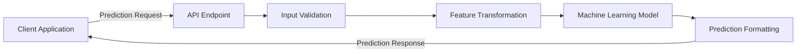
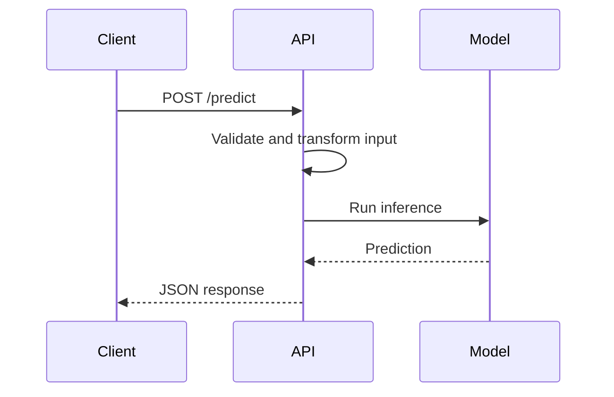
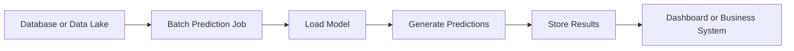
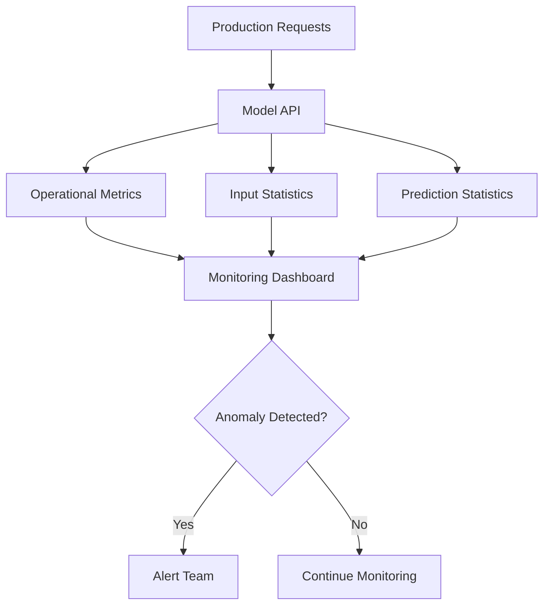
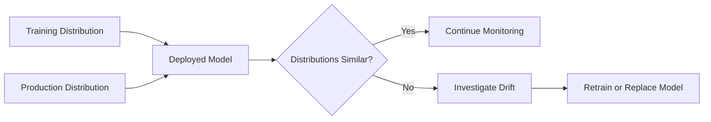
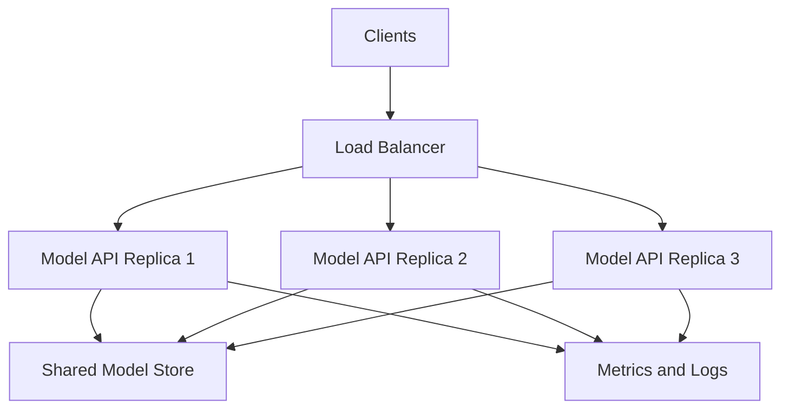

# 001 - Model Serving

**Course:** 04 - MLOps and Deployment
**Module:** Module 08 - MLOps
**Content Group:** Model Serving
**Roadmap Source:** MLOps / Model Serving
**Lesson Type:** MLOps
**Order in Module:** 001
**Suggested Duration:** 22 minutes

---

## 1. Overview

**Model serving** is the process of making a trained machine learning model available to other applications, users, or systems.

During model development, predictions are often generated inside a notebook:

```python
prediction = model.predict(features)
```

However, a production system usually needs a stable interface through which other services can request predictions.

Common serving methods include:

* Real-time REST APIs
* gRPC services
* Batch prediction jobs
* Streaming inference
* Serverless functions
* Edge or mobile deployment

A model-serving system must do more than call `model.predict()`. It must also handle:

* Input validation
* Feature transformation
* Model loading
* Prediction latency
* Error handling
* Model versioning
* Logging
* Monitoring
* Security
* Scalability

After completing this lesson, you should understand how a trained model becomes a reliable production service.

---

## 2. Learning Objectives

By the end of this lesson, you should be able to:

* Explain model serving in your own words.
* Distinguish between online, batch, streaming, and edge inference.
* Expose a trained model through a REST API.
* Validate incoming prediction requests.
* Apply the same preprocessing logic used during training.
* Return structured prediction responses.
* Add model and API version information.
* Identify the main production risks of a model-serving system.
* Package a prediction API using Docker.
* Describe the logs and metrics required in production.

---

## 3. Where Model Serving Fits in the ML Lifecycle

Model serving happens after a model has been trained, evaluated, and selected for deployment.


A simplified production workflow is:

1. Train the model.
2. Save the model artifact.
3. Register or version the model.
4. Load the model inside a serving application.
5. Receive prediction requests.
6. Validate and transform the input.
7. Run inference.
8. Return a prediction.
9. Record logs and metrics.
10. Monitor the model in production.

---

## 4. Core Concept

Model serving exposes model predictions through a stable interface.

For example, a client application may send this request:

```json
{
  "age": 35,
  "income": 52000,
  "account_age_months": 18
}
```

The serving application processes the request and returns:

```json
{
  "prediction": 1,
  "probability": 0.87,
  "model_version": "1.0.0"
}
```

The model itself is only one component of the complete serving system.



---

## 5. Main Components of a Model-Serving System

### 5.1 Model Artifact

The model artifact is the saved representation of a trained model.

Common formats include:

* `joblib`
* `pickle`
* ONNX
* TensorFlow SavedModel
* TorchScript
* Safetensors

Example:

```python
import joblib

joblib.dump(model, "models/customer_churn_v1.joblib")
```

Loading the model:

```python
model = joblib.load("models/customer_churn_v1.joblib")
```

Model artifacts should be versioned and stored in a controlled location.

---

### 5.2 Input Schema

The input schema defines the data expected by the model.

For example:

```python
from pydantic import BaseModel, Field


class PredictionRequest(BaseModel):
    age: int = Field(ge=18, le=100)
    income: float = Field(ge=0)
    account_age_months: int = Field(ge=0)
```

Input validation protects the model from:

* Missing values
* Incorrect data types
* Invalid ranges
* Unexpected categories
* Malformed requests

Without validation, bad inputs may cause crashes or unreliable predictions.

---

### 5.3 Feature Transformation

Raw application data is rarely identical to the feature matrix used during training.

Typical transformations include:

* Missing-value imputation
* Categorical encoding
* Feature scaling
* Text tokenization
* Image resizing
* Date feature extraction
* Feature ordering

The training and serving systems must use exactly the same transformation logic.

A recommended approach is to save preprocessing and the model in one pipeline:

```python
from sklearn.pipeline import Pipeline
from sklearn.preprocessing import StandardScaler
from sklearn.linear_model import LogisticRegression

pipeline = Pipeline(
    steps=[
        ("scaler", StandardScaler()),
        ("classifier", LogisticRegression())
    ]
)

pipeline.fit(X_train, y_train)
```

Then save the complete pipeline:

```python
joblib.dump(pipeline, "models/churn_pipeline_v1.joblib")
```

This reduces training-serving skew.

---

### 5.4 Inference Logic

Inference is the step where the prepared features are passed to the model.

```python
prediction = model.predict(features)
```

For classification models, the service may also return probabilities:

```python
probability = model.predict_proba(features)
```

For regression:

```python
predicted_value = model.predict(features)[0]
```

For deep-learning models, inference should normally run in evaluation mode with gradient calculation disabled.

PyTorch example:

```python
model.eval()

with torch.no_grad():
    output = model(input_tensor)
```

---

### 5.5 Output Schema

A response schema creates a stable API contract.

```python
from pydantic import BaseModel


class PredictionResponse(BaseModel):
    prediction: int
    probability: float
    model_version: str
```

The response should be:

* Structured
* Documented
* Consistent
* Machine-readable
* Backward-compatible when possible

---

## 6. Serving Patterns

### 6.1 Online Inference

Online inference returns predictions immediately after receiving a request.

Examples:

* Fraud detection during payment
* Product recommendations
* Credit-risk scoring
* Spam detection
* Image classification



Important metrics include:

* Request latency
* Throughput
* Error rate
* Availability

---

### 6.2 Batch Inference

Batch inference processes many records at scheduled intervals.

Examples:

* Nightly customer churn scoring
* Weekly sales forecasting
* Monthly credit-risk updates
* Processing a large dataset in cloud storage



Batch serving is suitable when immediate predictions are not required.

---

### 6.3 Streaming Inference

Streaming inference processes continuously arriving events.

Examples:

* Real-time sensor anomaly detection
* Clickstream personalization
* Financial transaction monitoring
* Industrial equipment monitoring


Streaming systems must handle:

* Event ordering
* Consumer failures
* Duplicate messages
* Backpressure
* State management

---

### 6.4 Edge Inference

Edge inference runs the model directly on a device.

Examples:

* Mobile applications
* Cameras
* Robots
* IoT devices
* Autonomous vehicles

Benefits include:

* Lower latency
* Offline operation
* Reduced network usage
* Better privacy

Challenges include:

* Limited memory
* Limited compute resources
* Model optimization requirements
* Difficult update processes

---

## 7. Building a Model API with FastAPI

### 7.1 Install Dependencies

```bash
pip install fastapi uvicorn scikit-learn joblib pydantic
```

---

### 7.2 Basic Application

```python
from contextlib import asynccontextmanager
from pathlib import Path

import joblib
import numpy as np
from fastapi import FastAPI, HTTPException
from pydantic import BaseModel, Field


MODEL_PATH = Path("models/churn_pipeline_v1.joblib")
MODEL_VERSION = "1.0.0"

model = None


class PredictionRequest(BaseModel):
    age: int = Field(ge=18, le=100)
    income: float = Field(ge=0)
    account_age_months: int = Field(ge=0)


class PredictionResponse(BaseModel):
    prediction: int
    probability: float
    model_version: str


@asynccontextmanager
async def lifespan(app: FastAPI):
    global model

    if not MODEL_PATH.exists():
        raise RuntimeError(f"Model file not found: {MODEL_PATH}")

    model = joblib.load(MODEL_PATH)

    yield

    model = None


app = FastAPI(
    title="Customer Churn Prediction API",
    version="1.0.0",
    lifespan=lifespan,
)


@app.get("/health")
def health_check():
    return {
        "status": "healthy",
        "model_loaded": model is not None,
        "model_version": MODEL_VERSION,
    }


@app.post("/predict", response_model=PredictionResponse)
def predict(payload: PredictionRequest):
    if model is None:
        raise HTTPException(
            status_code=503,
            detail="Model is not available",
        )

    try:
        features = np.array(
            [[
                payload.age,
                payload.income,
                payload.account_age_months,
            ]]
        )

        prediction = int(model.predict(features)[0])

        if hasattr(model, "predict_proba"):
            probability = float(model.predict_proba(features)[0][1])
        else:
            probability = 0.0

        return PredictionResponse(
            prediction=prediction,
            probability=probability,
            model_version=MODEL_VERSION,
        )

    except Exception as exc:
        raise HTTPException(
            status_code=500,
            detail="Prediction failed",
        ) from exc
```

---

### 7.3 Run the API

```bash
uvicorn app.main:app --host 0.0.0.0 --port 8000 --reload
```

The API will be available at:

```text
http://localhost:8000
```

FastAPI documentation will be available at:

```text
http://localhost:8000/docs
```

---

### 7.4 Send a Prediction Request

Using `curl`:

```bash
curl -X POST "http://localhost:8000/predict" \
  -H "Content-Type: application/json" \
  -d '{
    "age": 35,
    "income": 52000,
    "account_age_months": 18
  }'
```

Example response:

```json
{
  "prediction": 1,
  "probability": 0.8721,
  "model_version": "1.0.0"
}
```

---

### 7.5 Send a Request with Python

```python
import requests

payload = {
    "age": 35,
    "income": 52000,
    "account_age_months": 18,
}

response = requests.post(
    "http://localhost:8000/predict",
    json=payload,
    timeout=10,
)

response.raise_for_status()

print(response.json())
```

---

## 8. API Contract

An API contract defines how clients communicate with the prediction service.

It should document:

* Endpoint path
* HTTP method
* Required fields
* Optional fields
* Data types
* Valid ranges
* Response format
* Error responses
* Model version
* API version

Example contract:

### Endpoint

```text
POST /api/v1/predict
```

### Request

```json
{
  "age": 35,
  "income": 52000,
  "account_age_months": 18
}
```

### Successful Response

```json
{
  "prediction": 1,
  "probability": 0.8721,
  "model_version": "1.0.0"
}
```

### Validation Error

```json
{
  "detail": [
    {
      "loc": ["body", "age"],
      "msg": "Input should be greater than or equal to 18",
      "type": "greater_than_equal"
    }
  ]
}
```

A documented contract helps frontend developers, backend developers, data engineers, and ML engineers use the service correctly.

---

## 9. Health, Readiness, and Liveness Checks

Production services should expose health endpoints.

### Liveness Check

The liveness endpoint confirms that the application process is running.

```python
@app.get("/health/live")
def liveness():
    return {"status": "alive"}
```

### Readiness Check

The readiness endpoint confirms that the service is ready to receive prediction traffic.

```python
@app.get("/health/ready")
def readiness():
    if model is None:
        raise HTTPException(
            status_code=503,
            detail="Model is not loaded",
        )

    return {
        "status": "ready",
        "model_version": MODEL_VERSION,
    }
```

The distinction is useful in Kubernetes and other orchestration systems:

* A failed liveness check may restart the container.
* A failed readiness check may temporarily stop sending traffic to it.

---

## 10. Model and API Versioning

Model versioning helps identify which model produced a prediction.

Example:

```python
MODEL_NAME = "customer-churn"
MODEL_VERSION = "1.2.0"
```

Include the version in the response:

```json
{
  "prediction": 1,
  "model_name": "customer-churn",
  "model_version": "1.2.0"
}
```

The API itself should also be versioned:

```text
/api/v1/predict
```

A newer incompatible API could be exposed as:

```text
/api/v2/predict
```

Model versioning and API versioning solve different problems:

| Version Type       | Purpose                                                        |
| ------------------ | -------------------------------------------------------------- |
| Model version      | Identifies model weights, features, and training configuration |
| API version        | Identifies the request and response contract                   |
| Data version       | Identifies the training or validation dataset                  |
| Code version       | Identifies the source-code commit                              |
| Dependency version | Identifies the runtime environment                             |

---

## 11. Error Handling

The API should return clear errors without exposing sensitive internal details.

Common status codes include:

| Status Code | Meaning                           |
| ----------: | --------------------------------- |
|       `200` | Prediction completed successfully |
|       `400` | Invalid request                   |
|       `401` | Authentication required           |
|       `403` | Client lacks permission           |
|       `422` | Schema validation failed          |
|       `429` | Too many requests                 |
|       `500` | Internal prediction error         |
|       `503` | Model service unavailable         |

Avoid returning raw stack traces:

```python
except Exception as exc:
    raise HTTPException(
        status_code=500,
        detail="Prediction failed",
    ) from exc
```

Record detailed errors in application logs instead.

---

## 12. Logging

A production prediction service should record operational information.

Useful fields include:

* Timestamp
* Request ID
* Endpoint
* Response status
* Processing duration
* Model name
* Model version
* Input schema version
* Prediction result
* Confidence score
* Error category

Example structured log:

```json
{
  "timestamp": "2026-07-13T10:30:15Z",
  "request_id": "18be7a92",
  "endpoint": "/api/v1/predict",
  "status_code": 200,
  "latency_ms": 24.7,
  "model_name": "customer-churn",
  "model_version": "1.0.0"
}
```

Avoid logging:

* Passwords
* Access tokens
* Personal identifiers
* Raw medical information
* Complete payment information
* Sensitive customer data

When input logging is necessary, consider:

* Hashing identifiers
* Removing sensitive fields
* Sampling requests
* Aggregating distributions
* Applying a retention policy

---

## 13. Monitoring

Model-serving monitoring normally covers three layers.

### 13.1 Infrastructure Monitoring

Track:

* CPU usage
* Memory usage
* GPU usage
* Disk usage
* Container restarts
* Network traffic

### 13.2 Service Monitoring

Track:

* Request count
* Latency
* Throughput
* Error rate
* Timeout rate
* Availability
* Queue depth

### 13.3 Model Monitoring

Track:

* Input feature distributions
* Missing-value rates
* Prediction distributions
* Confidence scores
* Data drift
* Concept drift
* Ground-truth performance



---

## 14. Important Serving Metrics

### Request Latency

Latency measures how long it takes to return a response.

[
\text{Latency} = \text{Response Time} - \text{Request Time}
]

Common latency percentiles include:

* `p50`: median latency
* `p95`: 95% of requests are faster than this value
* `p99`: 99% of requests are faster than this value

Average latency alone may hide slow requests.

---

### Throughput

Throughput measures how many requests the service handles per unit of time.

[
\text{Throughput} =
\frac{\text{Number of Requests}}
{\text{Time Period}}
]

It is commonly expressed as requests per second.

---

### Error Rate

[
\text{Error Rate} =
\frac{\text{Failed Requests}}
{\text{Total Requests}}
]

A rising error rate may indicate:

* Invalid inputs
* Model failures
* Resource exhaustion
* Dependency failures
* Deployment defects

---

### Availability

[
\text{Availability} =
\frac{\text{Successful Service Time}}
{\text{Total Service Time}}
]

Availability is often expressed as a percentage, such as:

```text
99.9%
```

---

## 15. Data Drift and Concept Drift

A technically healthy API can still produce poor predictions.

### Data Drift

Data drift occurs when the production input distribution changes.

For example, suppose a model was trained with customer ages mainly between 25 and 50. A new product may attract users between 18 and 25.

The model continues returning predictions, but the inputs no longer resemble the training data.

### Concept Drift

Concept drift occurs when the relationship between features and the target changes.

For example, the factors that predicted customer churn last year may no longer predict churn after a major pricing change.



---

## 16. Training-Serving Skew

Training-serving skew happens when the production preprocessing logic differs from the training logic.

Example:

During training:

```python
scaled_age = (age - training_mean) / training_std
```

During serving:

```python
scaled_age = age / 100
```

Even though both produce numeric features, they are not equivalent.

Ways to reduce skew include:

* Save preprocessing and the model in one pipeline.
* Reuse the same transformation library.
* Version feature definitions.
* Add tests using known examples.
* Compare offline and online predictions.
* Use a feature store when appropriate.

---

## 17. Batch Prediction Example

```python
from pathlib import Path

import joblib
import pandas as pd


MODEL_PATH = Path("models/churn_pipeline_v1.joblib")
INPUT_PATH = Path("data/customers.csv")
OUTPUT_PATH = Path("outputs/customer_predictions.csv")


def run_batch_prediction() -> None:
    model = joblib.load(MODEL_PATH)
    data = pd.read_csv(INPUT_PATH)

    feature_columns = [
        "age",
        "income",
        "account_age_months",
    ]

    missing_columns = set(feature_columns) - set(data.columns)

    if missing_columns:
        raise ValueError(
            f"Missing required columns: {sorted(missing_columns)}"
        )

    features = data[feature_columns]
    data["prediction"] = model.predict(features)

    if hasattr(model, "predict_proba"):
        data["probability"] = model.predict_proba(features)[:, 1]

    OUTPUT_PATH.parent.mkdir(parents=True, exist_ok=True)
    data.to_csv(OUTPUT_PATH, index=False)


if __name__ == "__main__":
    run_batch_prediction()
```

Run the script:

```bash
python scripts/batch_predict.py
```

Batch jobs should also record:

* Input file or dataset version
* Number of processed rows
* Number of failed rows
* Start and end times
* Model version
* Output location

---

## 18. Dockerizing the API

### Dockerfile

```dockerfile
FROM python:3.12-slim

WORKDIR /app

COPY requirements.txt .
RUN pip install --no-cache-dir -r requirements.txt

COPY app ./app
COPY models ./models

EXPOSE 8000

CMD [
  "uvicorn",
  "app.main:app",
  "--host",
  "0.0.0.0",
  "--port",
  "8000"
]
```

### requirements.txt

```text
fastapi
uvicorn[standard]
numpy
scikit-learn
joblib
pydantic
```

### Build the Image

```bash
docker build -t churn-api:1.0.0 .
```

### Run the Container

```bash
docker run \
  --rm \
  -p 8000:8000 \
  churn-api:1.0.0
```

### Test the Container

```bash
curl http://localhost:8000/health
```

Docker helps create a consistent environment containing:

* Source code
* Dependencies
* Runtime configuration
* Model artifact
* Startup command

---

## 19. Testing the Prediction API

### Health-Check Test

```python
from fastapi.testclient import TestClient

from app.main import app


client = TestClient(app)


def test_health_check():
    response = client.get("/health")

    assert response.status_code == 200
    assert response.json()["status"] == "healthy"
```

### Prediction Test

```python
def test_predict_success():
    payload = {
        "age": 35,
        "income": 52000,
        "account_age_months": 18,
    }

    response = client.post("/predict", json=payload)

    assert response.status_code == 200

    body = response.json()

    assert "prediction" in body
    assert "probability" in body
    assert "model_version" in body
```

### Validation Test

```python
def test_predict_rejects_invalid_age():
    payload = {
        "age": 10,
        "income": 52000,
        "account_age_months": 18,
    }

    response = client.post("/predict", json=payload)

    assert response.status_code == 422
```

Useful test categories include:

* Valid input
* Missing fields
* Incorrect data types
* Out-of-range values
* Unknown categories
* Model unavailable
* Expected prediction for known input
* Response-schema compatibility
* Latency threshold

---

## 20. Scalability Considerations

A model-serving application may need to process many concurrent requests.

Common strategies include:

* Running multiple service replicas
* Using a load balancer
* Applying request batching
* Caching repeated predictions
* Using GPU inference
* Quantizing the model
* Using an optimized inference runtime
* Separating lightweight and expensive models
* Applying autoscaling
* Using asynchronous queues for long-running tasks



Scaling the API does not automatically solve model-performance problems. The model, preprocessing steps, and external dependencies must all be evaluated.

---

## 21. Synchronous vs. Asynchronous Predictions

### Synchronous Prediction

The client waits for the prediction.

```text
Client → Request → Model → Response
```

Suitable for:

* Low-latency models
* Interactive applications
* Small inputs

### Asynchronous Prediction

The client submits a job and receives a job identifier.

```text
Client → Submit Job → Queue → Worker → Result Store
```

Example response:

```json
{
  "job_id": "job-83491",
  "status": "queued"
}
```

Suitable for:

* Video processing
* Large language-model workflows
* Large batch inputs
* Computationally expensive models
* Long-running image generation

---

## 22. Security Considerations

A production model API may require:

* Authentication
* Authorization
* HTTPS
* Rate limiting
* Request-size limits
* Input sanitization
* Secret management
* Audit logging
* Network restrictions
* Dependency scanning

Potential ML-specific risks include:

* Model extraction
* Adversarial inputs
* Data leakage
* Prompt injection for language-model applications
* Sensitive information in logs
* Abuse through automated requests

Security must be designed into the serving system rather than added only after deployment.

---

## 23. Common Serving Tools

| Tool                   | Typical Use                         |
| ---------------------- | ----------------------------------- |
| FastAPI                | Building Python REST APIs           |
| Flask                  | Lightweight Python web APIs         |
| BentoML                | Packaging and serving ML models     |
| MLflow Models          | Model packaging and deployment      |
| KServe                 | Kubernetes-native model serving     |
| Seldon Core            | Kubernetes model deployment         |
| NVIDIA Triton          | High-performance GPU inference      |
| TensorFlow Serving     | TensorFlow model serving            |
| TorchServe             | PyTorch model serving               |
| ONNX Runtime           | Optimized cross-framework inference |
| Ray Serve              | Distributed and scalable serving    |
| AWS SageMaker          | Managed model deployment            |
| Google Vertex AI       | Managed training and serving        |
| Azure Machine Learning | Managed ML deployment               |

The correct tool depends on:

* Model framework
* Traffic volume
* Latency requirements
* Infrastructure
* Team experience
* Deployment environment
* Cost constraints

---

## 24. Common Mistakes

### Mistake 1: Keeping the Model Only in a Notebook

A notebook is useful for experimentation but is not a reliable production interface.

**Better approach:** Export the model and create a reusable API or batch job.

---

### Mistake 2: Not Versioning the Model

Replacing a model file without recording its version makes debugging difficult.

**Better approach:** Include the model version in the artifact name, registry, deployment metadata, and API response.

---

### Mistake 3: Duplicating Preprocessing Logic

Implementing preprocessing separately for training and serving creates training-serving skew.

**Better approach:** Save the full preprocessing pipeline with the model.

---

### Mistake 4: Loading the Model for Every Request

This is inefficient:

```python
@app.post("/predict")
def predict(payload: PredictionRequest):
    model = joblib.load("model.joblib")
    return model.predict(...)
```

**Better approach:** Load the model once during application startup.

---

### Mistake 5: Returning Unstructured Responses

This response is difficult to extend:

```json
1
```

A better response is:

```json
{
  "prediction": 1,
  "probability": 0.87,
  "model_version": "1.0.0"
}
```

---

### Mistake 6: Logging Sensitive Input Data

Prediction inputs may contain personal or confidential information.

**Better approach:** Redact, hash, aggregate, or sample sensitive fields.

---

### Mistake 7: Monitoring Only Server Availability

A service may be available while its predictions are becoming inaccurate.

**Better approach:** Monitor infrastructure, API performance, input drift, prediction distributions, and ground-truth model performance.

---

### Mistake 8: Ignoring Dependency Versions

Different library versions may change preprocessing or prediction behavior.

**Better approach:** Pin dependencies and build reproducible container images.

---

### Mistake 9: No Rollback Strategy

A new model may introduce unexpected failures.

**Better approach:** Retain the previous stable model and support fast rollback.

---

## 25. Practical Exercise

Build a model-serving application for a small classification or regression model.

### Task 1: Train and Save a Model

Choose a dataset such as:

* Iris classification
* Titanic survival
* House-price prediction
* Customer churn
* Wine-quality classification

Create and save a complete preprocessing pipeline.

```python
joblib.dump(pipeline, "models/model_v1.joblib")
```

---

### Task 2: Create an API

Implement:

```text
GET /health
POST /predict
```

The `/predict` endpoint should:

1. Accept JSON input.
2. Validate required fields.
3. Transform the input.
4. Run model inference.
5. Return a structured response.
6. Include the model version.

---

### Task 3: Add Tests

Add tests for:

* Valid prediction
* Missing field
* Invalid field type
* Invalid range
* Health endpoint
* Known expected output

---

### Task 4: Add Docker Support

Create:

```text
Dockerfile
requirements.txt
.dockerignore
```

Build and run the service locally.

---

### Task 5: Document the Service

Your README should contain:

* Project purpose
* Installation instructions
* Local run command
* Docker run command
* API contract
* Example request
* Example response
* Testing command
* Known limitations
* Model version

---

### Task 6: Define Production Monitoring

Write down the metrics you would track.

At minimum, include:

* Request count
* Error rate
* `p50`, `p95`, and `p99` latency
* Input missing-value rates
* Prediction distribution
* Model version
* Data-drift indicators

---

## 26. Suggested Project Structure

```text
model-serving-project/
├── app/
│   ├── __init__.py
│   ├── main.py
│   ├── schemas.py
│   ├── inference.py
│   └── config.py
├── models/
│   └── model_v1.joblib
├── scripts/
│   ├── train.py
│   └── batch_predict.py
├── tests/
│   ├── test_health.py
│   └── test_predict.py
├── data/
│   └── sample.csv
├── Dockerfile
├── requirements.txt
├── .dockerignore
├── .gitignore
└── README.md
```

A possible responsibility split is:

| File               | Responsibility                            |
| ------------------ | ----------------------------------------- |
| `main.py`          | FastAPI application and routes            |
| `schemas.py`       | Request and response schemas              |
| `inference.py`     | Model loading and prediction logic        |
| `config.py`        | Paths, versions, and environment settings |
| `train.py`         | Model-training pipeline                   |
| `batch_predict.py` | Offline batch inference                   |
| `tests/`           | API and inference tests                   |

---

## 27. Portfolio Mini Project

### Project: Deploy an ML Model API

Build a production-style model-serving project containing:

* A trained ML model
* A reusable preprocessing pipeline
* A FastAPI endpoint at `/predict`
* Input validation with Pydantic
* A `/health` endpoint
* Model-version metadata
* Unit and API tests
* Structured logging
* A Dockerfile
* Example API requests
* A detailed README

### Optional Extensions

Add one or more of the following:

* `/predict/batch` endpoint
* Prometheus metrics
* API-key authentication
* Request IDs
* MLflow model registry
* CI workflow
* Cloud deployment
* Data-drift report
* Canary deployment simulation
* Load testing
* Prediction caching

---

## 28. Completion Checklist

* [ ] I can explain model serving in one or two minutes.
* [ ] I understand the difference between training and inference.
* [ ] I can distinguish online, batch, streaming, and edge inference.
* [ ] I can save and load a trained model.
* [ ] I can expose a prediction endpoint using FastAPI.
* [ ] I validate incoming data before inference.
* [ ] I reuse the same preprocessing logic used during training.
* [ ] I return a documented response schema.
* [ ] I include the model version in prediction responses.
* [ ] I have implemented a health endpoint.
* [ ] I have tested valid and invalid requests.
* [ ] I can package the service using Docker.
* [ ] I know which API and infrastructure metrics to monitor.
* [ ] I understand data drift and training-serving skew.
* [ ] I have documented at least one limitation or production risk.

---

## 29. Key Takeaways

* Model serving makes trained models accessible to applications and users.
* A production serving system includes validation, preprocessing, inference, formatting, logging, and monitoring.
* Online inference supports immediate responses, while batch inference processes many records together.
* Training and serving must use identical feature-transformation logic.
* The model, API, data, code, and dependencies should all be versioned.
* Operational metrics and model-quality metrics are both necessary.
* Docker creates a reproducible environment for deployment.
* A successful deployment is not the end of the ML lifecycle; production monitoring and retraining are continuous activities.

---

## 30. Related Outcome

Deploy, version, monitor, and operate machine learning models using:

* APIs
* Batch jobs
* Docker
* Automated tests
* CI/CD pipelines
* Model registries
* Monitoring dashboards
* Drift-aware retraining workflows

---

## 31. Summary

**Model serving** is the bridge between a trained machine learning model and a real application.

A notebook prediction becomes a production capability only when it is wrapped in a reliable interface with:

* A clear API contract
* Validated inputs
* Reproducible preprocessing
* Versioned model artifacts
* Consistent responses
* Error handling
* Tests
* Logging
* Monitoring
* Deployment documentation

The best way to strengthen this knowledge is to convert a small trained model into a tested FastAPI service, package it with Docker, and document how it would be monitored in production.
