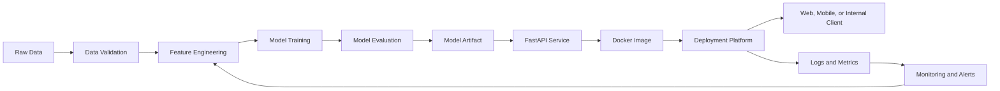
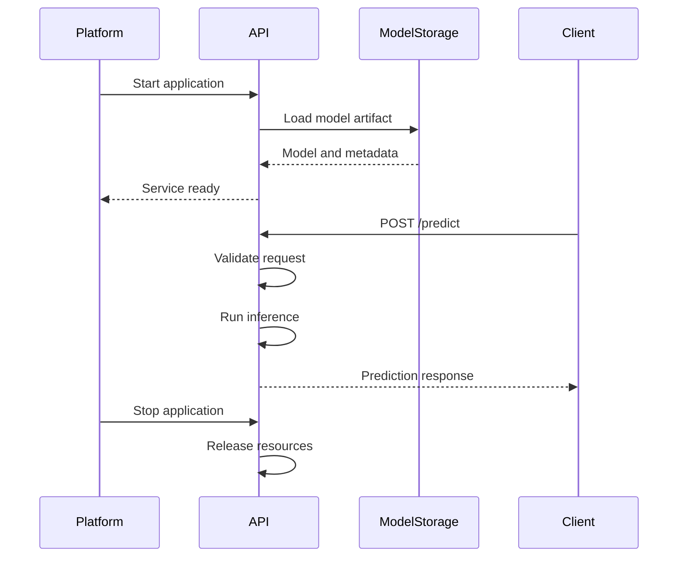
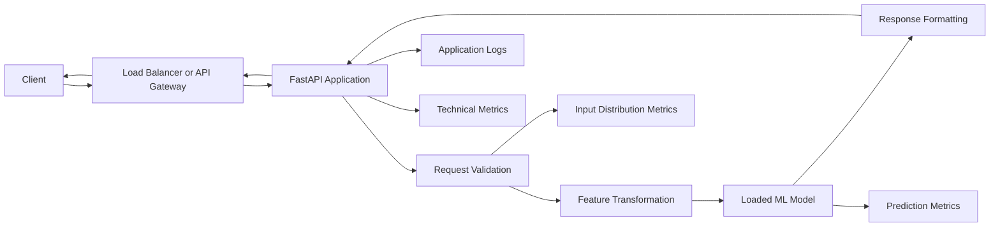
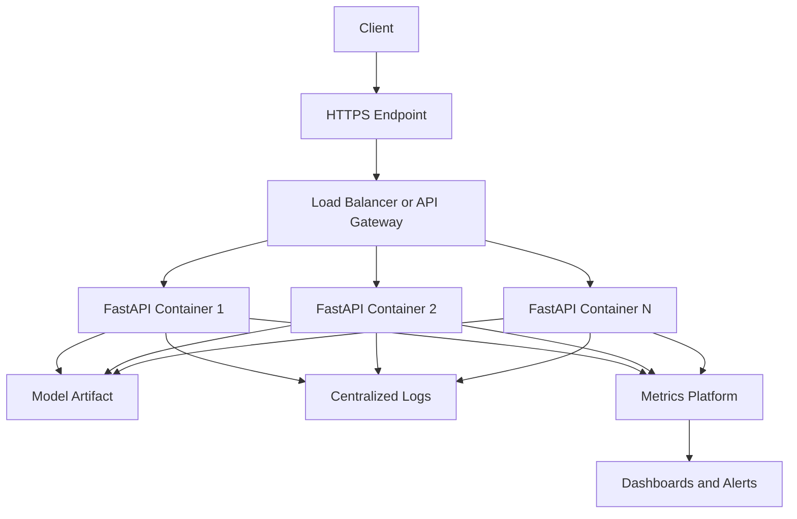
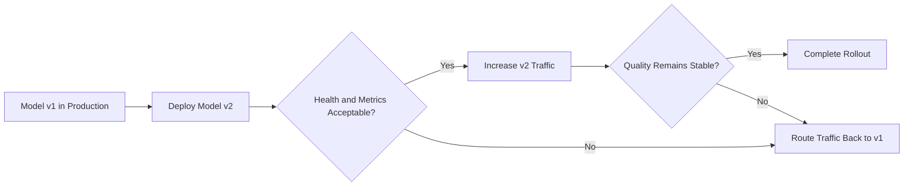

# 003 — FastAPI

## Lesson Information

| Item                   | Details                                        |
| ---------------------- | ---------------------------------------------- |
| **Course**             | 04 — MLOps and Deployment                      |
| **Module**             | Module 08 — MLOps                              |
| **Content Group**      | Model Serving                                  |
| **Roadmap Source**     | MLOps / Model Serving                          |
| **Lesson Type**        | MLOps                                          |
| **Order in Module**    | 003                                            |
| **Suggested Duration** | 22 minutes                                     |
| **Difficulty**         | Beginner to Intermediate                       |
| **Main Deliverable**   | A machine learning prediction API with FastAPI |

---

## 1. Summary

This lesson explains **FastAPI** in the context of AI engineering, data science, and MLOps.

A machine learning model inside a notebook cannot normally be used directly by a mobile application, website, dashboard, or another backend service. The model must be exposed through a stable interface.

FastAPI helps transform a trained model into a web service that can:

* Receive input through HTTP requests.
* Validate incoming data.
* Run model inference.
* Return predictions as JSON.
* Generate interactive API documentation.
* Expose health-check endpoints.
* Record logs and metrics.
* Run inside a Docker container.
* Integrate with CI/CD and production monitoring.

FastAPI uses Python type hints and data models to validate requests and generate an OpenAPI schema. Its official documentation also supports automatically generated interactive API documentation and dependency injection.

A typical model-serving workflow looks like this:

```text
Notebook
   ↓
Trained model artifact
   ↓
FastAPI prediction service
   ↓
Docker image
   ↓
CI/CD pipeline
   ↓
Cloud or container platform
   ↓
Logs, metrics, alerts, and model monitoring
```

---

## 2. Learning Objectives

By the end of this lesson, you should be able to:

1. Explain FastAPI in your own words.
2. Describe where FastAPI fits in an ML system.
3. Create a basic FastAPI application.
4. Define validated request and response schemas.
5. Load a trained model when the application starts.
6. Build a `/predict` endpoint.
7. Add health-check and metadata endpoints.
8. Test the API using `curl`, Swagger UI, and `pytest`.
9. Package the service with Docker.
10. Identify the logs and metrics required in production.
11. Explain the difference between deploying a notebook and serving a model through an API.

---

## 3. What Is FastAPI?

**FastAPI** is a Python web framework commonly used to build HTTP APIs.

In machine learning systems, FastAPI often acts as the layer between a trained model and the applications that need predictions.

For example:

```text
Mobile application
        ↓
POST /predict
        ↓
FastAPI service
        ↓
Machine learning model
        ↓
Prediction response
```

A client does not need to know:

* How the model was trained.
* Which library created the model.
* Where the model file is stored.
* How preprocessing works.
* How the prediction is calculated.

The client only needs to understand the API contract.

For example:

```json
{
  "sepal_length": 5.1,
  "sepal_width": 3.5,
  "petal_length": 1.4,
  "petal_width": 0.2
}
```

The API may return:

```json
{
  "prediction": "setosa",
  "confidence": 0.98,
  "model_version": "1.0.0"
}
```

This separation makes the model easier to integrate, test, deploy, version, and monitor.

---

## 4. Where FastAPI Fits in an ML Workflow

FastAPI normally appears after model training and before production consumption.



FastAPI is primarily responsible for the **online serving layer**.

It is not normally responsible for:

* Training large models during every request.
* Running complete data pipelines.
* Replacing an experiment-tracking system.
* Replacing a model registry.
* Replacing a monitoring platform.
* Storing all application data.
* Automatically detecting model drift.

FastAPI exposes the model. Other MLOps components manage training, storage, deployment, monitoring, and governance.

---

## 5. Core Concepts

### 5.1 API

An **Application Programming Interface**, or API, defines how software components communicate.

For a prediction API, the contract usually defines:

* Endpoint path.
* HTTP method.
* Required input fields.
* Input data types.
* Response structure.
* Possible error responses.
* Authentication requirements.

Example:

```text
Method: POST
Path: /predict
Input: JSON feature values
Output: JSON prediction
```

---

### 5.2 Path Operation

A path operation combines:

* An HTTP method such as `GET` or `POST`.
* A URL path such as `/health` or `/predict`.
* A Python function that processes the request.

```python
from fastapi import FastAPI

app = FastAPI()


@app.get("/")
def root() -> dict[str, str]:
    return {"message": "ML API is running"}
```

In this example:

* `GET` is the HTTP method.
* `/` is the path.
* `root()` is the path operation function.

This follows the standard FastAPI path-operation pattern described in the official tutorial.

---

### 5.3 Request Schema

A request schema describes the data accepted by an endpoint.

```python
from pydantic import BaseModel, Field


class PredictionRequest(BaseModel):
    age: int = Field(ge=0, le=120)
    income: float = Field(ge=0)
    account_balance: float
```

The schema allows the API to reject invalid input before passing it to the model.

Examples of invalid input include:

```json
{
  "age": -5,
  "income": "unknown"
}
```

Input validation is important because a model may silently produce incorrect results when it receives malformed or unexpected data.

---

### 5.4 Response Schema

A response schema defines the structure returned by the API.

```python
class PredictionResponse(BaseModel):
    prediction: str
    confidence: float
    model_version: str
```

A response model helps:

* Keep output consistent.
* Document the API contract.
* Prevent accidental exposure of internal fields.
* Validate the response structure.
* Help frontend and mobile developers integrate the API.

---

### 5.5 Automatic API Documentation

FastAPI generates an OpenAPI schema from path operations, type hints, request models, response models, and dependency definitions. Interactive documentation is commonly exposed through the application’s documentation interface.

After starting a local FastAPI application, the documentation is normally available at:

```text
/docs
```

An alternative documentation interface is normally available at:

```text
/redoc
```

The documentation can be used to:

* Inspect endpoints.
* Read request schemas.
* Read response schemas.
* Send test requests.
* View validation errors.

---

### 5.6 Application Lifespan

Machine learning models should usually be loaded once when the service starts, rather than loaded again for every prediction request.

FastAPI recommends using the application `lifespan` mechanism for startup and shutdown logic.



Loading a model once avoids unnecessary disk access and reduces prediction latency.

---

### 5.7 Dependency Injection

FastAPI includes a dependency-injection system that can be used for shared logic such as:

* Authentication.
* Database sessions.
* Request tracing.
* Configuration.
* Authorization.
* Rate limiting.
* Shared service objects.

Dependencies can also contribute validation rules and documentation to an endpoint.

Example:

```python
from fastapi import Depends, Header, HTTPException


def verify_api_key(x_api_key: str = Header()) -> str:
    if x_api_key != "development-key":
        raise HTTPException(status_code=401, detail="Invalid API key")

    return x_api_key


@app.post("/predict")
def predict(
    request: PredictionRequest,
    api_key: str = Depends(verify_api_key),
):
    ...
```

Production secrets should not be hardcoded in source code. They should come from environment variables or a secret-management system.

---

## 6. Model-Serving Architecture

A production-style request may pass through several layers.



### Request lifecycle

1. A client sends a request.
2. The server validates the request body.
3. The service transforms the input into model features.
4. The loaded model runs inference.
5. The result is converted into a response schema.
6. The API returns JSON.
7. Logs and metrics are recorded.

---

## 7. Practical Demo: Deploy an Iris Classifier

This demo trains a small classification model and exposes it through a `/predict` endpoint.

### 7.1 Project Structure

```text
fastapi-ml-service/
├── app/
│   ├── __init__.py
│   └── main.py
├── artifacts/
│   └── iris_model.joblib
├── tests/
│   └── test_api.py
├── train_model.py
├── requirements.txt
├── Dockerfile
├── .dockerignore
└── README.md
```

---

### 7.2 Install Dependencies

Create a virtual environment:

```bash
python -m venv .venv
```

Activate it on Linux or macOS:

```bash
source .venv/bin/activate
```

Activate it on Windows PowerShell:

```powershell
.venv\Scripts\Activate.ps1
```

Install the required packages:

```bash
pip install fastapi "uvicorn[standard]" scikit-learn joblib pytest httpx
```

A simple `requirements.txt` may contain:

```text
fastapi
uvicorn[standard]
scikit-learn
joblib
pytest
httpx
```

For reproducible production builds, record exact tested dependency versions in a lock file or a fully pinned requirements file.

---

### 7.3 Train and Save the Model

Create `train_model.py`:

```python
from pathlib import Path

import joblib
from sklearn.datasets import load_iris
from sklearn.linear_model import LogisticRegression
from sklearn.metrics import accuracy_score
from sklearn.model_selection import train_test_split
from sklearn.pipeline import Pipeline
from sklearn.preprocessing import StandardScaler


ARTIFACT_DIR = Path("artifacts")
MODEL_PATH = ARTIFACT_DIR / "iris_model.joblib"


def train_model() -> None:
    dataset = load_iris()

    x_train, x_test, y_train, y_test = train_test_split(
        dataset.data,
        dataset.target,
        test_size=0.2,
        random_state=42,
        stratify=dataset.target,
    )

    pipeline = Pipeline(
        steps=[
            ("scaler", StandardScaler()),
            (
                "classifier",
                LogisticRegression(
                    max_iter=1000,
                    random_state=42,
                ),
            ),
        ]
    )

    pipeline.fit(x_train, y_train)

    predictions = pipeline.predict(x_test)
    accuracy = accuracy_score(y_test, predictions)

    artifact = {
        "model": pipeline,
        "class_names": dataset.target_names.tolist(),
        "feature_names": dataset.feature_names,
        "model_version": "1.0.0",
        "metrics": {
            "test_accuracy": float(accuracy),
        },
    }

    ARTIFACT_DIR.mkdir(parents=True, exist_ok=True)
    joblib.dump(artifact, MODEL_PATH)

    print(f"Model saved to: {MODEL_PATH}")
    print(f"Test accuracy: {accuracy:.4f}")


if __name__ == "__main__":
    train_model()
```

Run the training script:

```bash
python train_model.py
```

The script produces:

```text
artifacts/iris_model.joblib
```

The artifact contains:

* The preprocessing pipeline.
* The classifier.
* Class names.
* Feature names.
* Model version.
* Evaluation metadata.

Saving preprocessing and the model in the same pipeline helps prevent differences between training-time and serving-time transformations.

---

### 7.4 Create the FastAPI Application

Create `app/main.py`:

```python
from __future__ import annotations

import os
import time
from contextlib import asynccontextmanager
from pathlib import Path
from typing import Any

import joblib
from fastapi import FastAPI, HTTPException, Request
from pydantic import BaseModel, Field


MODEL_PATH = Path(
    os.getenv(
        "MODEL_PATH",
        "artifacts/iris_model.joblib",
    )
)


class PredictionRequest(BaseModel):
    sepal_length: float = Field(gt=0, examples=[5.1])
    sepal_width: float = Field(gt=0, examples=[3.5])
    petal_length: float = Field(gt=0, examples=[1.4])
    petal_width: float = Field(gt=0, examples=[0.2])


class PredictionResponse(BaseModel):
    prediction: str
    class_id: int
    confidence: float
    probabilities: dict[str, float]
    model_version: str
    inference_time_ms: float


class HealthResponse(BaseModel):
    status: str
    model_loaded: bool
    model_version: str | None


@asynccontextmanager
async def lifespan(app: FastAPI):
    if not MODEL_PATH.exists():
        raise RuntimeError(
            f"Model artifact was not found at {MODEL_PATH}"
        )

    artifact: dict[str, Any] = joblib.load(MODEL_PATH)

    app.state.model = artifact["model"]
    app.state.class_names = artifact["class_names"]
    app.state.model_version = artifact["model_version"]
    app.state.model_metrics = artifact.get("metrics", {})

    yield

    app.state.model = None


app = FastAPI(
    title="Iris Classification API",
    description=(
        "A demonstration API for serving a machine learning "
        "classification model with FastAPI."
    ),
    version="1.0.0",
    lifespan=lifespan,
)


@app.get("/")
def root() -> dict[str, str]:
    return {
        "service": "iris-classification-api",
        "message": "The API is running.",
        "documentation": "/docs",
    }


@app.get("/health", response_model=HealthResponse)
def health(request: Request) -> HealthResponse:
    model = getattr(request.app.state, "model", None)
    model_version = getattr(
        request.app.state,
        "model_version",
        None,
    )

    return HealthResponse(
        status="healthy" if model is not None else "unhealthy",
        model_loaded=model is not None,
        model_version=model_version,
    )


@app.get("/model-info")
def model_info(request: Request) -> dict[str, Any]:
    return {
        "model_version": request.app.state.model_version,
        "metrics": request.app.state.model_metrics,
        "features": [
            "sepal_length",
            "sepal_width",
            "petal_length",
            "petal_width",
        ],
        "classes": request.app.state.class_names,
    }


@app.post(
    "/predict",
    response_model=PredictionResponse,
)
def predict(
    payload: PredictionRequest,
    request: Request,
) -> PredictionResponse:
    model = getattr(request.app.state, "model", None)

    if model is None:
        raise HTTPException(
            status_code=503,
            detail="The model is not available.",
        )

    features = [[
        payload.sepal_length,
        payload.sepal_width,
        payload.petal_length,
        payload.petal_width,
    ]]

    start_time = time.perf_counter()

    try:
        class_id = int(model.predict(features)[0])
        raw_probabilities = model.predict_proba(features)[0]
    except Exception as exc:
        raise HTTPException(
            status_code=500,
            detail="Prediction failed.",
        ) from exc

    inference_time_ms = (
        time.perf_counter() - start_time
    ) * 1000

    class_names: list[str] = request.app.state.class_names

    probabilities = {
        class_name: float(probability)
        for class_name, probability in zip(
            class_names,
            raw_probabilities,
            strict=True,
        )
    }

    return PredictionResponse(
        prediction=class_names[class_id],
        class_id=class_id,
        confidence=float(raw_probabilities[class_id]),
        probabilities=probabilities,
        model_version=request.app.state.model_version,
        inference_time_ms=inference_time_ms,
    )
```

### Important design decisions

#### Load the model during application startup

The model is loaded in the `lifespan` function instead of inside `/predict`.

Good:

```python
app.state.model = joblib.load(MODEL_PATH)
```

Bad:

```python
@app.post("/predict")
def predict(...):
    model = joblib.load(MODEL_PATH)
```

Loading the artifact for every request would increase latency and disk usage.

#### Validate inputs before inference

The request model rejects:

* Missing fields.
* Incorrect data types.
* Zero or negative dimensions.
* Malformed JSON.

#### Return model metadata

The response includes `model_version`, allowing predictions to be connected to a specific artifact.

#### Convert library-specific values

NumPy scalar values are converted into standard Python `int` and `float` values before JSON serialization.

---

## 8. Run the API Locally

Start the development server:

```bash
uvicorn app.main:app --reload
```

The command contains:

```text
app.main
│   └── Python module
│
└── app package

:app
 └── FastAPI application object
```

Open the interactive documentation:

```text
http://127.0.0.1:8000/docs
```

Do not use automatic reload mode for a production deployment.

---

## 9. Send a Prediction Request

### Using `curl`

```bash
curl -X POST \
  "http://127.0.0.1:8000/predict" \
  -H "Content-Type: application/json" \
  -d '{
    "sepal_length": 5.1,
    "sepal_width": 3.5,
    "petal_length": 1.4,
    "petal_width": 0.2
  }'
```

Example response:

```json
{
  "prediction": "setosa",
  "class_id": 0,
  "confidence": 0.98,
  "probabilities": {
    "setosa": 0.98,
    "versicolor": 0.02,
    "virginica": 0.0
  },
  "model_version": "1.0.0",
  "inference_time_ms": 0.42
}
```

The exact probability and latency values may differ.

---

### Using Python

```python
import requests


payload = {
    "sepal_length": 5.1,
    "sepal_width": 3.5,
    "petal_length": 1.4,
    "petal_width": 0.2,
}

response = requests.post(
    "http://127.0.0.1:8000/predict",
    json=payload,
    timeout=10,
)

response.raise_for_status()
print(response.json())
```

---

## 10. Validation Errors

Send an invalid request:

```json
{
  "sepal_length": -5,
  "sepal_width": 3.5,
  "petal_length": "small"
}
```

The API should reject the request because:

* `sepal_length` must be greater than zero.
* `petal_length` must be numeric.
* `petal_width` is missing.

This validation happens before the prediction function runs.

Validation protects the model from malformed requests, but it does not completely protect against valid-looking yet unrealistic data.

For example:

```json
{
  "sepal_length": 9000,
  "sepal_width": 7000,
  "petal_length": 5000,
  "petal_width": 2000
}
```

All values are numeric and positive, but they are outside the expected training distribution. Production systems should therefore combine schema validation with range checks and distribution monitoring.

---

## 11. Test the API

Create `tests/test_api.py`:

```python
from fastapi.testclient import TestClient

from app.main import app


def test_health_endpoint() -> None:
    with TestClient(app) as client:
        response = client.get("/health")

        assert response.status_code == 200

        body = response.json()

        assert body["status"] == "healthy"
        assert body["model_loaded"] is True
        assert body["model_version"] == "1.0.0"


def test_predict_endpoint() -> None:
    payload = {
        "sepal_length": 5.1,
        "sepal_width": 3.5,
        "petal_length": 1.4,
        "petal_width": 0.2,
    }

    with TestClient(app) as client:
        response = client.post(
            "/predict",
            json=payload,
        )

        assert response.status_code == 200

        body = response.json()

        assert body["prediction"] in {
            "setosa",
            "versicolor",
            "virginica",
        }
        assert 0 <= body["confidence"] <= 1
        assert body["model_version"] == "1.0.0"


def test_invalid_request_is_rejected() -> None:
    payload = {
        "sepal_length": -1,
        "sepal_width": 3.5,
        "petal_length": 1.4,
        "petal_width": 0.2,
    }

    with TestClient(app) as client:
        response = client.post(
            "/predict",
            json=payload,
        )

        assert response.status_code == 422
```

Run the tests:

```bash
pytest -v
```

Using `TestClient` as a context manager ensures that application lifespan logic runs during tests.

### Additional tests to consider

* Missing required fields.
* Unknown JSON fields.
* Boundary values.
* Extremely large values.
* Model artifact missing.
* Corrupted model artifact.
* Model prediction exception.
* Multiple concurrent requests.
* Response-schema compatibility.
* Authentication failure.
* Request timeout.

---

## 12. Package the API with Docker

FastAPI’s official deployment documentation demonstrates building container images from an official Python base image.

Create a `Dockerfile`:

```dockerfile
FROM python:3.12-slim

ENV PYTHONDONTWRITEBYTECODE=1
ENV PYTHONUNBUFFERED=1

WORKDIR /service

COPY requirements.txt .

RUN pip install \
    --no-cache-dir \
    --upgrade pip \
    && pip install \
    --no-cache-dir \
    -r requirements.txt

COPY app ./app
COPY artifacts ./artifacts

EXPOSE 8000

CMD [
    "uvicorn",
    "app.main:app",
    "--host",
    "0.0.0.0",
    "--port",
    "8000"
]
```

Create `.dockerignore`:

```text
.git
.github
.venv
__pycache__
.pytest_cache
*.pyc
*.pyo
*.pyd
notebooks
tests
```

Build the image:

```bash
docker build -t iris-fastapi-service:1.0.0 .
```

Run the container:

```bash
docker run \
  --rm \
  -p 8000:8000 \
  iris-fastapi-service:1.0.0
```

Test the container:

```bash
curl http://127.0.0.1:8000/health
```

Expected response:

```json
{
  "status": "healthy",
  "model_loaded": true,
  "model_version": "1.0.0"
}
```

---

## 13. Development Versus Production

A local development server is not the complete production architecture.

### Development

```text
Developer
   ↓
Uvicorn with reload
   ↓
FastAPI application
   ↓
Local model artifact
```

### Production



FastAPI can be run with multiple worker processes to use multiple CPU cores and replicate request-processing capacity. The appropriate number of workers depends on memory use, model size, request latency, traffic, and the deployment platform.

A large model may consume significant memory in every worker because each worker can load its own model copy.

---

## 14. API Endpoint Design

A minimal ML service commonly exposes the following endpoints.

| Endpoint         | Method | Purpose                              |
| ---------------- | ------ | ------------------------------------ |
| `/`              | `GET`  | Basic service information            |
| `/health`        | `GET`  | Health and model availability        |
| `/model-info`    | `GET`  | Model version and metadata           |
| `/predict`       | `POST` | Single prediction                    |
| `/predict-batch` | `POST` | Multiple predictions                 |
| `/metrics`       | `GET`  | Monitoring metrics, when appropriate |

### Single prediction

```text
POST /predict
```

Use this when clients require low-latency online inference.

### Batch prediction

```text
POST /predict-batch
```

Use this for small groups of records when batching reduces request overhead.

Large offline datasets are often better handled by:

* Batch jobs.
* Workflow orchestrators.
* Distributed processing systems.
* Object-storage input and output.
* Message queues.

An HTTP endpoint should not automatically become a replacement for every batch pipeline.

---

## 15. Logging

Production logs should help answer:

* When did the request arrive?
* Which endpoint handled it?
* Which model version generated the prediction?
* How long did inference take?
* Was the request successful?
* What error occurred?
* Which request or trace ID connects related events?

Example structured log:

```json
{
  "timestamp": "2026-07-13T10:30:00Z",
  "level": "INFO",
  "event": "prediction_completed",
  "request_id": "req-8f31c",
  "endpoint": "/predict",
  "status_code": 200,
  "model_version": "1.0.0",
  "inference_time_ms": 7.4
}
```

Avoid logging sensitive raw data unless there is a clear legal, security, and operational justification.

Potentially sensitive information includes:

* Names.
* Email addresses.
* Authentication tokens.
* Health records.
* Financial attributes.
* Exact user locations.
* Private text prompts.
* Uploaded images.
* Personally identifiable identifiers.

A safer approach may include:

* Redaction.
* Hashing.
* Aggregation.
* Sampling.
* Access control.
* Retention limits.
* Explicit consent.

---

## 16. Monitoring

Monitoring should cover more than whether the server is running.

### 16.1 Service Metrics

| Metric              | Purpose                                     |
| ------------------- | ------------------------------------------- |
| Request count       | Measure traffic volume                      |
| Error rate          | Detect failed requests                      |
| Latency             | Measure response time                       |
| Throughput          | Measure requests processed per unit of time |
| CPU usage           | Detect compute pressure                     |
| Memory usage        | Detect leaks or model-memory pressure       |
| Restart count       | Detect application instability              |
| Model-load duration | Detect slow startup                         |
| Active requests     | Detect concurrency pressure                 |

Latency should normally be monitored using percentiles such as:

```text
p50 latency
p95 latency
p99 latency
```

An average may hide slow requests.

---

### 16.2 Data Quality Metrics

Monitor properties such as:

* Missing-value rate.
* Invalid-request rate.
* Feature minimum and maximum.
* Feature mean and standard deviation.
* Category frequency.
* Unexpected categories.
* Schema changes.
* Input payload size.

Example:

```text
Training mean age: 34
Production mean age: 58
```

This difference may indicate a changed user population or a data-pipeline problem.

---

### 16.3 Model Metrics

When labels are available, monitor:

* Accuracy.
* Precision.
* Recall.
* F1 score.
* ROC-AUC.
* Mean absolute error.
* Root mean squared error.
* Calibration.
* Business-specific cost.

When labels are delayed or unavailable, monitor proxy signals such as:

* Prediction distribution.
* Confidence distribution.
* Feature drift.
* Missing-value changes.
* Out-of-range input frequency.
* Manual review rate.
* User correction rate.

Drift detection is an alert that the data has changed. It does not automatically prove that the model is incorrect.

---

### 16.4 Business Metrics

A technically healthy model may still fail to create value.

Possible business metrics include:

* Conversion rate.
* Fraud loss.
* Customer retention.
* Recommendation click-through rate.
* Manual-review workload.
* Time saved.
* Revenue per prediction.
* False-positive operational cost.

---

## 17. Model and API Versioning

Several components may change independently.

```text
API version
Model version
Dataset version
Feature version
Code version
Dependency version
Configuration version
```

Example response:

```json
{
  "prediction": "approved",
  "model_version": "credit-risk-2.1.0",
  "api_version": "v1",
  "feature_schema_version": "3"
}
```

A new model does not always require a new API version.

For example:

* Replacing model weights while keeping the same input and output contract may only change the model version.
* Renaming request fields may require a new API version.
* Changing the meaning of the prediction may require both model and API version changes.

A common versioned path is:

```text
/api/v1/predict
```

---

## 18. Rollback Strategy

Every deployment should have a rollback plan.



Rollback requires:

* Previous container image.
* Previous model artifact.
* Previous configuration.
* Compatible database schema.
* Deployment history.
* Health criteria.
* Automated or documented rollback commands.

Common release strategies include:

* Rolling deployment.
* Blue-green deployment.
* Canary deployment.
* Shadow deployment.
* A/B testing.

---

## 19. Security Considerations

A production prediction API may require:

* HTTPS.
* Authentication.
* Authorization.
* Rate limiting.
* Request-size limits.
* Secure secret storage.
* Dependency scanning.
* Container-image scanning.
* Audit logs.
* Network restrictions.
* Input sanitization.
* CORS configuration.
* Timeout limits.

Do not assume that schema validation is complete security protection.

A valid request may still be:

* Excessively large.
* Repeated thousands of times.
* Designed to extract model behavior.
* Designed to consume expensive compute.
* Containing sensitive information.
* Outside the model’s intended use.

---

## 20. Common Mistakes

### Mistake 1: Deploying only a notebook

A notebook is useful for exploration but usually does not define a stable production interface.

**Better approach:** extract preprocessing and prediction code into reusable modules and expose a documented API.

---

### Mistake 2: Loading the model for every request

```python
@app.post("/predict")
def predict(...):
    model = joblib.load("model.joblib")
```

This adds repeated disk access and unnecessary latency.

**Better approach:** load the model once during application startup.

---

### Mistake 3: Duplicating preprocessing logic

Training code may apply normalization, encoding, or feature ordering that serving code forgets.

**Better approach:** package preprocessing and prediction into one pipeline or share a tested feature-transformation module.

---

### Mistake 4: Not validating inputs

Without validation, malformed input may reach the model.

**Better approach:** define strict request schemas, bounds, enumerations, and cross-field rules.

---

### Mistake 5: Returning only the predicted class

A class alone may not provide enough operational context.

**Consider returning:**

* Prediction.
* Confidence.
* Model version.
* Request ID.
* Warning or review flag.
* Inference time.

Do not expose sensitive internal details unnecessarily.

---

### Mistake 6: No model version

Without model version metadata, it becomes difficult to reproduce or investigate a prediction.

**Better approach:** connect each response or log entry to a model artifact version.

---

### Mistake 7: Using unpinned dependencies

A build may unexpectedly change when package versions change.

**Better approach:** test and lock dependency versions.

---

### Mistake 8: No health-check endpoint

The deployment platform may not know whether the model loaded successfully.

**Better approach:** expose health or readiness checks that verify required resources.

---

### Mistake 9: Logging all raw input

Raw prediction input may contain personal or regulated information.

**Better approach:** use privacy-aware structured logging.

---

### Mistake 10: Monitoring only server uptime

A server can be healthy while the model produces poor predictions.

**Better approach:** monitor infrastructure, data quality, model behavior, and business outcomes.

---

## 21. Practical Exercises

### Exercise 1: Basic API

Create a FastAPI application with:

```text
GET /
GET /health
POST /predict
```

The `/predict` endpoint may initially return a rule-based result before you add a trained model.

---

### Exercise 2: Request Validation

Add a request schema with:

* At least three features.
* Numeric bounds.
* One optional field.
* One categorical field.

Test:

* A valid request.
* A missing field.
* An invalid type.
* An out-of-range value.

---

### Exercise 3: Model Integration

Train a small model using one of the following datasets:

* Iris classification.
* Titanic survival.
* House-price regression.
* Customer churn.
* Loan approval.
* Sentiment classification.

Save the model and load it through FastAPI lifespan logic.

---

### Exercise 4: Testing

Write tests for:

* Health endpoint.
* Valid prediction.
* Invalid request.
* Model-version field.
* Response confidence range.
* Missing model artifact.

---

### Exercise 5: Docker

Create:

```text
Dockerfile
.dockerignore
requirements.txt
README.md
```

Build and run the service locally.

---

### Exercise 6: Monitoring Plan

Write down the production metrics required for your model.

Include at least:

* Three service metrics.
* Three data-quality metrics.
* Two model metrics.
* One business metric.
* One alert condition.

Example alert:

```text
Trigger an alert when the five-minute prediction error rate exceeds 5%.
```

---

## 22. Mini Project

### Project: Deploy an ML Model API

Build a portfolio project with the following workflow:

```text
Dataset
   ↓
Training script
   ↓
Evaluation metrics
   ↓
Saved model artifact
   ↓
FastAPI /predict endpoint
   ↓
Automated tests
   ↓
Docker image
   ↓
README and API demo
```

### Minimum requirements

* A reproducible training script.
* A saved model artifact.
* A FastAPI application.
* A validated request schema.
* A validated response schema.
* A `/predict` endpoint.
* A `/health` endpoint.
* Model-version information.
* Automated API tests.
* A Dockerfile.
* Example requests and responses.
* A production-monitoring plan.

### Recommended additions

* Batch prediction.
* Authentication.
* Structured JSON logging.
* Prometheus-compatible metrics.
* CI workflow.
* Model registry integration.
* Canary deployment plan.
* Drift-monitoring notebook.
* Load test.
* Cloud deployment.
* Architecture diagram.

---

## 23. Suggested README Structure

```markdown
# Project Name

## Overview

## Problem Statement

## Dataset

## Model

## Evaluation Results

## Architecture

## Project Structure

## Installation

## Train the Model

## Run the API

## API Endpoints

## Example Request

## Example Response

## Run Tests

## Build with Docker

## Monitoring Plan

## Limitations

## Future Improvements
```

A strong portfolio README should explain not only how to run the application, but also why the model exists, how it was evaluated, and what would be required for production use.

---

## 24. Completion Checklist

### Understanding

* [ ] I can explain FastAPI in one or two minutes.
* [ ] I understand why a notebook is not the same as a production API.
* [ ] I can explain where FastAPI fits in the MLOps lifecycle.
* [ ] I understand requests, responses, routes, and schemas.
* [ ] I understand why the model should be loaded once.

### Implementation

* [ ] I created a FastAPI application.
* [ ] I created a `/health` endpoint.
* [ ] I created a `/predict` endpoint.
* [ ] I added request validation.
* [ ] I added a response schema.
* [ ] I returned model-version metadata.
* [ ] I tested valid and invalid requests.
* [ ] I packaged the service with Docker.

### Production Awareness

* [ ] I identified the logs required in production.
* [ ] I identified service-level metrics.
* [ ] I identified data-quality metrics.
* [ ] I identified model-performance metrics.
* [ ] I considered privacy and security.
* [ ] I documented at least one limitation.
* [ ] I described how the service could be rolled back.

---

## 25. Related Outcome

After completing this lesson, you should be closer to the following outcome:

> Deploy, version, monitor, and operate machine learning models using APIs, containers, CI/CD workflows, and drift-aware production practices.

---

## 26. Key Takeaways

1. FastAPI exposes Python models through HTTP endpoints.
2. Request and response schemas create a clear API contract.
3. Model preprocessing must remain consistent between training and inference.
4. Models should usually be loaded once during application startup.
5. A production API needs testing, versioning, logging, security, and monitoring.
6. Docker makes the runtime environment more reproducible.
7. Server health does not guarantee model quality.
8. Drift monitoring should complement, not replace, performance evaluation.
9. Every deployment should have a rollback strategy.
10. A portfolio project should include code, documentation, tests, a container, and an operational plan.

---

## 27. Final Summary

FastAPI is an important tool in the AI and data science roadmap because it helps transform a trained model from an experimental artifact into a service that other systems can use.

The complete workflow is not only:

```text
train model -> create endpoint
```

A stronger MLOps workflow is:

```text
validate data
    ↓
train and evaluate model
    ↓
version model artifact
    ↓
serve model with FastAPI
    ↓
test API contract
    ↓
build Docker image
    ↓
deploy safely
    ↓
collect logs and metrics
    ↓
monitor data and model behavior
    ↓
rollback or retrain when necessary
```

The goal of this lesson is to produce a small but complete deployment artifact:

> A tested FastAPI service with a `/predict` endpoint, a Dockerfile, model metadata, example requests, documentation, and a production-monitoring plan.

---

# Bài luyện tập

## Mục tiêu


## Đề bài


## Yêu cầu hoàn thành

- [ ] 
- [ ] 
- [ ] 

## Kết quả / lời giải


## Ghi chú
