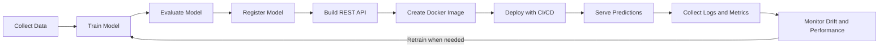
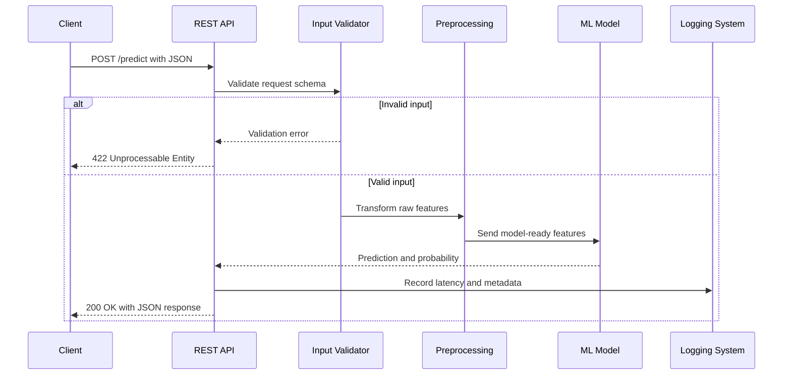
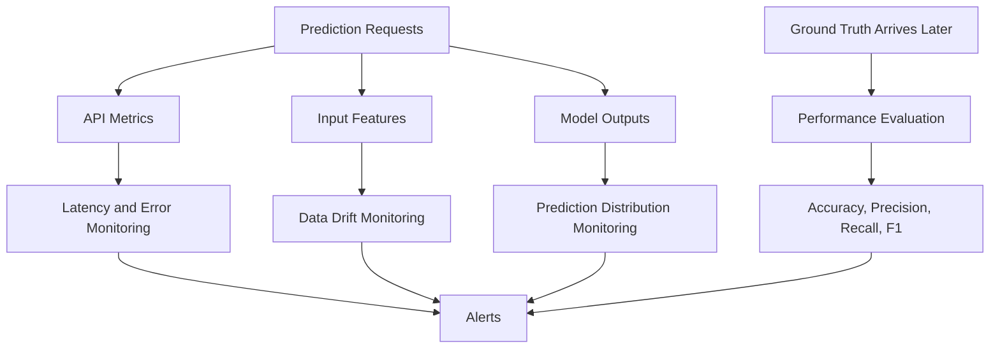

# 004 - REST API

**Course:** 04 - MLOps and Deployment
**Module:** Module 08 - MLOps
**Content Group:** Model Serving
**Roadmap Source:** MLOps / Model Serving
**Lesson Type:** MLOps
**Lesson Order:** 004
**Suggested Duration:** 22 minutes

---

## 1. Overview

A **REST API** is a common way to expose a machine learning model as a service that can be accessed by web applications, mobile applications, dashboards, data pipelines, or other backend systems.

During model development, a Data Scientist may run predictions directly inside a notebook:

```python
prediction = model.predict(input_data)
```

However, production applications usually cannot access the notebook directly. The model must be wrapped inside a service that accepts requests and returns predictions.

A typical prediction workflow looks like this:

```text
Client application
       |
       | HTTP request
       v
REST API endpoint
       |
       | Validate and preprocess input
       v
Machine learning model
       |
       | Generate prediction
       v
JSON response
```

A REST API helps transform a trained model from an experimental artifact into a reusable production service.

---

## 2. Learning Objectives

By the end of this lesson, you should be able to:

* Explain REST APIs in your own words.
* Describe how REST APIs are used for machine learning model serving.
* Understand HTTP methods, endpoints, requests, responses, and status codes.
* Design a basic prediction endpoint.
* Build a simple model API using FastAPI.
* Send prediction requests using `curl` or Python.
* Identify production concerns such as validation, logging, security, versioning, monitoring, and rollback.
* Package a model API as a portfolio-ready project.

---

## 3. What Is an API?

An **Application Programming Interface**, or **API**, defines how software systems communicate with one another.

An API specifies:

* What operations are available.
* What input data is required.
* What output data is returned.
* How errors are represented.
* How clients authenticate and access the service.

For example, a fraud detection application may send transaction data to a model API:

```json
{
  "amount": 250.0,
  "country": "VN",
  "device_age_days": 3,
  "previous_transactions": 12
}
```

The API may return:

```json
{
  "prediction": "fraud",
  "fraud_probability": 0.87,
  "model_version": "1.3.0"
}
```

The client does not need to know how the model was trained. It only needs to follow the API contract.

---

## 4. What Is REST?

**REST** stands for **Representational State Transfer**.

REST is an architectural style commonly used to design web APIs. REST APIs usually communicate over HTTP and exchange data using JSON.

A REST API organizes operations around **resources**.

Examples of resources include:

* Users
* Products
* Transactions
* Predictions
* Models
* Experiments

Example endpoints:

```text
GET  /health
GET  /models
POST /predict
GET  /predictions/123
```

REST is not a programming language or framework. It is a set of design principles that can be implemented using frameworks such as:

* FastAPI
* Flask
* Django REST Framework
* Express.js
* Spring Boot
* ASP.NET Core

---

## 5. REST API Components

### 5.1 Base URL

The base URL identifies the server hosting the API.

```text
https://api.example.com
```

For a local FastAPI application:

```text
http://localhost:8000
```

---

### 5.2 Endpoint

An endpoint represents a specific operation or resource.

```text
POST /predict
```

The complete URL may be:

```text
http://localhost:8000/predict
```

---

### 5.3 HTTP Method

The HTTP method describes the operation to perform.

| Method   | Typical Purpose                 | Example                        |
| -------- | ------------------------------- | ------------------------------ |
| `GET`    | Retrieve data                   | Get model information          |
| `POST`   | Create data or run an operation | Generate a prediction          |
| `PUT`    | Replace an existing resource    | Replace model configuration    |
| `PATCH`  | Partially update a resource     | Update one configuration field |
| `DELETE` | Remove a resource               | Delete a stored prediction     |

For model inference, `POST` is usually used because the client sends input data in the request body.

---

### 5.4 Request

A request may contain:

* URL parameters
* Query parameters
* HTTP headers
* Authentication credentials
* JSON body
* Uploaded files

Example prediction request:

```http
POST /predict
Content-Type: application/json
```

```json
{
  "age": 35,
  "income": 62000,
  "account_balance": 15000
}
```

---

### 5.5 Response

A response normally contains:

* HTTP status code
* Response headers
* JSON body

Example:

```json
{
  "prediction": 1,
  "label": "approved",
  "probability": 0.91
}
```

---

## 6. Common HTTP Status Codes

REST APIs use HTTP status codes to communicate the result of a request.

| Status Code                 | Meaning                              | ML API Example               |
| --------------------------- | ------------------------------------ | ---------------------------- |
| `200 OK`                    | Request completed successfully       | Prediction generated         |
| `201 Created`               | Resource created successfully        | Prediction record stored     |
| `400 Bad Request`           | Request is invalid                   | Malformed JSON               |
| `401 Unauthorized`          | Authentication is missing or invalid | Invalid API key              |
| `403 Forbidden`             | Client lacks permission              | User cannot access model     |
| `404 Not Found`             | Resource does not exist              | Model version not found      |
| `422 Unprocessable Entity`  | Input validation failed              | Missing required feature     |
| `429 Too Many Requests`     | Rate limit exceeded                  | Too many prediction requests |
| `500 Internal Server Error` | Unexpected server failure            | Model loading failed         |
| `503 Service Unavailable`   | Service temporarily unavailable      | Model server is restarting   |

Correct status codes make APIs easier to debug, monitor, and integrate.

---

## 7. REST APIs in the Machine Learning Workflow

A REST API is one part of a larger MLOps lifecycle.



A production system may include:

1. Data collection
2. Feature engineering
3. Model training
4. Experiment tracking
5. Model validation
6. Model registration
7. API development
8. Containerization
9. Deployment
10. Monitoring
11. Retraining
12. Rollback

The API is the interface between the trained model and external applications.

---

## 8. Online and Batch Inference

REST APIs are mainly used for **online inference**.

### 8.1 Online Inference

Online inference generates predictions immediately after receiving a request.

Examples:

* Fraud detection during a transaction
* Product recommendations on a website
* Image classification after an upload
* Customer churn scoring inside a CRM system
* Sentiment analysis for a new message

```text
Request → Model inference → Immediate response
```

Advantages:

* Low latency
* Real-time interaction
* Easy integration with applications

Limitations:

* Requires an always-available service
* Must handle traffic spikes
* Can be more expensive than batch processing
* Requires latency and reliability monitoring

---

### 8.2 Batch Inference

Batch inference processes many records together on a schedule.

Examples:

* Score all customers every night
* Generate weekly demand forecasts
* Classify one million documents
* Update recommendation candidates every hour

```text
Dataset → Batch job → Predictions file or database
```

A REST API is not always the best solution. Batch jobs may be more efficient when immediate responses are unnecessary.

---

## 9. Designing a Prediction API

A basic machine learning service should usually provide more than one endpoint.

| Endpoint      | Method | Purpose                              |
| ------------- | ------ | ------------------------------------ |
| `/health`     | `GET`  | Check whether the service is running |
| `/ready`      | `GET`  | Check whether the model is loaded    |
| `/predict`    | `POST` | Generate a prediction                |
| `/model-info` | `GET`  | Return model metadata                |
| `/metrics`    | `GET`  | Expose monitoring metrics            |

Example API structure:

```text
GET  /health
GET  /ready
GET  /model-info
POST /predict
```

---

## 10. API Input and Output Contract

An API contract defines the expected request and response formats.

### Request schema

```json
{
  "sepal_length": 5.1,
  "sepal_width": 3.5,
  "petal_length": 1.4,
  "petal_width": 0.2
}
```

### Response schema

```json
{
  "prediction": 0,
  "class_name": "setosa",
  "probabilities": {
    "setosa": 0.97,
    "versicolor": 0.02,
    "virginica": 0.01
  },
  "model_version": "1.0.0"
}
```

A good API contract should be:

* Explicit
* Stable
* Validated
* Versioned
* Documented
* Easy for clients to test

---

## 11. Building a REST API with FastAPI

FastAPI is a popular Python framework for building model APIs because it provides:

* Type validation
* Automatic OpenAPI documentation
* Interactive Swagger UI
* Asynchronous request support
* High performance
* Simple integration with Python ML libraries

Install the required packages:

```bash
pip install fastapi uvicorn scikit-learn joblib numpy
```

---

## 12. Training and Saving a Sample Model

The following script trains an Iris classification model and saves it to disk.

```python
# train.py

from pathlib import Path

import joblib
from sklearn.datasets import load_iris
from sklearn.ensemble import RandomForestClassifier


MODEL_DIR = Path("models")
MODEL_PATH = MODEL_DIR / "iris_model.joblib"


def train_model() -> None:
    iris = load_iris()

    model = RandomForestClassifier(
        n_estimators=100,
        random_state=42,
    )

    model.fit(iris.data, iris.target)

    MODEL_DIR.mkdir(parents=True, exist_ok=True)
    joblib.dump(model, MODEL_PATH)

    print(f"Model saved to {MODEL_PATH}")


if __name__ == "__main__":
    train_model()
```

Run the training script:

```bash
python train.py
```

This creates:

```text
models/iris_model.joblib
```

---

## 13. Creating the FastAPI Application

```python
# app/main.py

from pathlib import Path
from typing import Dict, List

import joblib
import numpy as np
from fastapi import FastAPI, HTTPException
from pydantic import BaseModel, Field


MODEL_PATH = Path("models/iris_model.joblib")
MODEL_VERSION = "1.0.0"

CLASS_NAMES = [
    "setosa",
    "versicolor",
    "virginica",
]


class PredictionRequest(BaseModel):
    sepal_length: float = Field(gt=0, examples=[5.1])
    sepal_width: float = Field(gt=0, examples=[3.5])
    petal_length: float = Field(gt=0, examples=[1.4])
    petal_width: float = Field(gt=0, examples=[0.2])


class PredictionResponse(BaseModel):
    prediction: int
    class_name: str
    probabilities: Dict[str, float]
    model_version: str


app = FastAPI(
    title="Iris Classification API",
    description="A simple REST API for serving an Iris classifier.",
    version=MODEL_VERSION,
)


if not MODEL_PATH.exists():
    raise RuntimeError(
        f"Model file was not found at {MODEL_PATH}. "
        "Run train.py before starting the API."
    )

model = joblib.load(MODEL_PATH)


@app.get("/health")
def health_check() -> dict:
    return {
        "status": "healthy",
    }


@app.get("/ready")
def readiness_check() -> dict:
    return {
        "status": "ready",
        "model_loaded": model is not None,
    }


@app.get("/model-info")
def model_info() -> dict:
    return {
        "model_name": "iris-random-forest",
        "model_version": MODEL_VERSION,
        "classes": CLASS_NAMES,
    }


@app.post(
    "/predict",
    response_model=PredictionResponse,
)
def predict(request: PredictionRequest) -> PredictionResponse:
    try:
        features = np.array(
            [
                [
                    request.sepal_length,
                    request.sepal_width,
                    request.petal_length,
                    request.petal_width,
                ]
            ],
            dtype=float,
        )

        prediction = int(model.predict(features)[0])
        probability_values = model.predict_proba(features)[0]

        probabilities = {
            class_name: round(float(probability), 6)
            for class_name, probability in zip(
                CLASS_NAMES,
                probability_values,
            )
        }

        return PredictionResponse(
            prediction=prediction,
            class_name=CLASS_NAMES[prediction],
            probabilities=probabilities,
            model_version=MODEL_VERSION,
        )

    except Exception as error:
        raise HTTPException(
            status_code=500,
            detail="Prediction could not be generated.",
        ) from error
```

---

## 14. Running the API

Start the server with Uvicorn:

```bash
uvicorn app.main:app --reload
```

The API is now available at:

```text
http://localhost:8000
```

Interactive API documentation:

```text
http://localhost:8000/docs
```

Alternative ReDoc documentation:

```text
http://localhost:8000/redoc
```

---

## 15. Sending a Prediction Request

### Using `curl`

```bash
curl -X POST \
  "http://localhost:8000/predict" \
  -H "Content-Type: application/json" \
  -d '{
    "sepal_length": 5.1,
    "sepal_width": 3.5,
    "petal_length": 1.4,
    "petal_width": 0.2
  }'
```

Example response:

```json
{
  "prediction": 0,
  "class_name": "setosa",
  "probabilities": {
    "setosa": 1.0,
    "versicolor": 0.0,
    "virginica": 0.0
  },
  "model_version": "1.0.0"
}
```

---

### Using Python

```python
import requests


url = "http://localhost:8000/predict"

payload = {
    "sepal_length": 5.1,
    "sepal_width": 3.5,
    "petal_length": 1.4,
    "petal_width": 0.2,
}

response = requests.post(
    url,
    json=payload,
    timeout=10,
)

response.raise_for_status()

print(response.json())
```

---

## 16. Request Processing Flow

A prediction request normally passes through several stages.



This separation makes the API easier to maintain and test.

---

## 17. Input Validation

Input validation is essential because production clients may send:

* Missing fields
* Wrong data types
* Negative values
* Unexpected categories
* Empty strings
* Extremely large payloads
* Values outside the training distribution

Example invalid request:

```json
{
  "sepal_length": -5.1,
  "sepal_width": "wide"
}
```

FastAPI and Pydantic can reject invalid inputs before the model is called.

Example validation model:

```python
class CustomerRequest(BaseModel):
    age: int = Field(ge=18, le=100)
    income: float = Field(ge=0)
    country: str = Field(min_length=2, max_length=2)
```

Validation prevents unnecessary model failures and improves API safety.

---

## 18. Preprocessing Consistency

The API must apply the same preprocessing logic used during training.

Common preprocessing steps include:

* Missing-value imputation
* Feature scaling
* Categorical encoding
* Tokenization
* Image resizing
* Text normalization
* Feature ordering

A common mistake is to train the model with transformed data but serve raw data without applying the same transformations.

A better approach is to save the entire preprocessing and modeling pipeline:

```python
from sklearn.pipeline import Pipeline
from sklearn.preprocessing import StandardScaler
from sklearn.linear_model import LogisticRegression


pipeline = Pipeline(
    steps=[
        ("scaler", StandardScaler()),
        ("model", LogisticRegression()),
    ]
)

pipeline.fit(X_train, y_train)
```

Then save the complete pipeline:

```python
joblib.dump(pipeline, "models/model_pipeline.joblib")
```

This reduces training-serving skew.

---

## 19. API Versioning

API contracts may change over time.

For example:

```text
POST /api/v1/predict
POST /api/v2/predict
```

Version 2 may:

* Add new features
* Rename fields
* Return additional metadata
* Use a different model
* Apply different preprocessing

API versioning allows existing clients to continue using the previous contract while new clients migrate gradually.

Model version and API version are related but different:

```json
{
  "api_version": "v1",
  "model_version": "2026-07-01",
  "prediction": "approved"
}
```

* **API version:** Defines the request and response contract.
* **Model version:** Identifies the trained model artifact.

---

## 20. Logging for Model APIs

Production APIs should create structured logs.

Useful fields include:

```json
{
  "timestamp": "2026-07-13T10:15:30Z",
  "request_id": "req-8e92a1",
  "endpoint": "/predict",
  "status_code": 200,
  "latency_ms": 42,
  "model_version": "1.0.0",
  "prediction": "setosa"
}
```

Avoid logging sensitive information such as:

* Passwords
* Authentication tokens
* Personal identifiers
* Medical records
* Full credit card numbers
* Raw private text
* Confidential images

Logs should support debugging without violating privacy or security requirements.

---

## 21. Monitoring a Model API

Monitoring should cover both software behavior and model behavior.

### 21.1 Service Metrics

Examples:

* Request count
* Error rate
* Request latency
* Throughput
* CPU usage
* Memory usage
* Container restarts
* Availability

---

### 21.2 Model Metrics

Examples:

* Prediction distribution
* Confidence distribution
* Feature distribution
* Missing-value rate
* Data drift
* Concept drift
* Accuracy
* Precision
* Recall
* F1 score
* Business outcome metrics



A service can be technically healthy while the model is producing poor predictions. Both layers must be monitored.

---

## 22. Testing a REST API

Model APIs require several types of tests.

### Unit tests

Test small components such as:

* Feature validation
* Preprocessing
* Prediction formatting
* Probability conversion

### Integration tests

Test interactions between:

* API and model
* API and database
* API and model registry
* API and logging system

### Contract tests

Verify that request and response schemas remain compatible.

### Load tests

Measure performance under many simultaneous requests.

### Smoke tests

Check critical endpoints immediately after deployment.

Example FastAPI test:

```python
from fastapi.testclient import TestClient

from app.main import app


client = TestClient(app)


def test_health_endpoint() -> None:
    response = client.get("/health")

    assert response.status_code == 200
    assert response.json()["status"] == "healthy"


def test_prediction_endpoint() -> None:
    payload = {
        "sepal_length": 5.1,
        "sepal_width": 3.5,
        "petal_length": 1.4,
        "petal_width": 0.2,
    }

    response = client.post(
        "/predict",
        json=payload,
    )

    assert response.status_code == 200

    body = response.json()

    assert "prediction" in body
    assert "class_name" in body
    assert "probabilities" in body
    assert "model_version" in body


def test_invalid_prediction_input() -> None:
    payload = {
        "sepal_length": -1,
        "sepal_width": 3.5,
        "petal_length": 1.4,
        "petal_width": 0.2,
    }

    response = client.post(
        "/predict",
        json=payload,
    )

    assert response.status_code == 422
```

Run the tests:

```bash
pytest
```

---

## 23. Containerizing the API

A Docker image packages:

* Application code
* Model artifact
* Python dependencies
* Runtime configuration

Example `Dockerfile`:

```dockerfile
FROM python:3.12-slim

WORKDIR /app

COPY requirements.txt .
RUN pip install --no-cache-dir -r requirements.txt

COPY app ./app
COPY models ./models

EXPOSE 8000

CMD [
  "uvicorn",
  "app.main:app",
  "--host",
  "0.0.0.0",
  "--port",
  "8000"
]
```

Example `requirements.txt`:

```text
fastapi
uvicorn
scikit-learn
joblib
numpy
pydantic
```

Build the image:

```bash
docker build -t iris-api:1.0.0 .
```

Run the container:

```bash
docker run \
  --rm \
  -p 8000:8000 \
  iris-api:1.0.0
```

---

## 24. Deployment Workflow

A common deployment workflow is:

```text
trained model
    ↓
model artifact
    ↓
REST API
    ↓
automated tests
    ↓
Docker image
    ↓
container registry
    ↓
CI/CD deployment
    ↓
production traffic
    ↓
logs and monitoring
```

A more complete workflow may look like this:


---

## 25. Security Considerations

A public model API should not accept unlimited unauthenticated requests.

Important controls include:

* API keys
* OAuth or JWT authentication
* HTTPS
* Rate limiting
* Request size limits
* Input sanitization
* Role-based access control
* Secret management
* Dependency scanning
* Audit logs
* Network restrictions

Sensitive values should be stored in environment variables or a secret manager.

Bad example:

```python
API_KEY = "my-production-secret-key"
```

Better approach:

```python
import os


API_KEY = os.environ["API_KEY"]
```

Do not commit production secrets to Git.

---

## 26. Performance Considerations

Model APIs may become slow because of:

* Large models
* Expensive preprocessing
* Network latency
* Database calls
* Cold starts
* Insufficient CPU or memory
* Single-request processing
* Repeated model loading

Potential optimizations include:

* Load the model once when the application starts.
* Cache repeated predictions where appropriate.
* Use batch inference inside the service.
* Use asynchronous I/O for external calls.
* Optimize the model format.
* Use GPU inference when justified.
* Add horizontal scaling.
* Use a dedicated model server.
* Apply request queues and timeouts.

Measure performance before optimizing.

Important metrics include:

```text
p50 latency
p95 latency
p99 latency
requests per second
error rate
```

Average latency alone may hide slow requests.

---

## 27. REST API vs Other Serving Approaches

| Approach         | Best Use Case                      | Main Advantage               | Main Limitation                  |
| ---------------- | ---------------------------------- | ---------------------------- | -------------------------------- |
| REST API         | General application integration    | Simple and widely supported  | HTTP overhead                    |
| gRPC             | High-performance internal services | Efficient and strongly typed | More complex client setup        |
| Batch job        | Large offline datasets             | Cost-efficient at scale      | No immediate response            |
| Message queue    | Asynchronous processing            | Handles traffic spikes well  | Delayed results                  |
| Streaming system | Continuous event processing        | Near-real-time pipelines     | Higher infrastructure complexity |
| Embedded model   | Mobile or edge inference           | No network dependency        | Device constraints               |

REST is a strong default choice, but it is not always the best option.

---

## 28. Common Mistakes

### 28.1 Only keeping the model in a notebook

A notebook may prove that the model works, but it does not provide a stable production interface.

**Better approach:** Save the model and create a reusable API or batch pipeline.

---

### 28.2 Loading the model for every request

This increases latency and wastes resources.

**Better approach:** Load the model once during application startup.

---

### 28.3 Missing input validation

Invalid input may cause incorrect predictions or server errors.

**Better approach:** Define strict request schemas and validation rules.

---

### 28.4 Training-serving skew

The API applies different preprocessing from the training pipeline.

**Better approach:** Save preprocessing and model logic together.

---

### 28.5 No model or dependency versioning

The team cannot reproduce or roll back a deployment.

**Better approach:** Version models, APIs, code, Docker images, and dependencies.

---

### 28.6 Returning only a raw number

A response such as this is difficult to understand:

```json
{
  "prediction": 1
}
```

A more useful response is:

```json
{
  "prediction": 1,
  "label": "approved",
  "probability": 0.91,
  "model_version": "1.0.0"
}
```

---

### 28.7 Logging sensitive raw data

Prediction requests may contain private or regulated information.

**Better approach:** Redact, hash, aggregate, or exclude sensitive fields.

---

### 28.8 No timeout or error handling

A slow model or dependency can block requests indefinitely.

**Better approach:** Configure timeouts and return controlled error responses.

---

### 28.9 Monitoring only server uptime

A running server does not guarantee useful predictions.

**Better approach:** Monitor data drift, prediction distribution, confidence, and real-world performance.

---

## 29. Practical Exercise

Build a small REST API around a trained machine learning model.

### Required tasks

1. Train or load a simple classification or regression model.
2. Save the trained model using `joblib`, `pickle`, or another model format.
3. Create a FastAPI application.
4. Add a `POST /predict` endpoint.
5. Define request and response schemas.
6. Validate all required features.
7. Add a `GET /health` endpoint.
8. Return the model version in every prediction response.
9. Add at least three automated tests.
10. Create a Dockerfile.
11. Write a README with setup and usage instructions.
12. Add sample `curl` and Python requests.
13. Document which logs and metrics would be required in production.

---

## 30. Suggested Project Structure

```text
ml-rest-api/
├── app/
│   ├── __init__.py
│   ├── main.py
│   ├── schemas.py
│   ├── preprocessing.py
│   └── model_service.py
├── models/
│   └── model.joblib
├── tests/
│   └── test_api.py
├── train.py
├── requirements.txt
├── Dockerfile
├── .dockerignore
├── .gitignore
└── README.md
```

This structure separates API routes, schemas, model logic, preprocessing, tests, and artifacts.

---

## 31. Production Readiness Checklist

### API design

* [ ] Request and response schemas are documented.
* [ ] Input values are validated.
* [ ] Errors use appropriate HTTP status codes.
* [ ] API versions are defined.
* [ ] Health and readiness endpoints are available.

### Model management

* [ ] The model artifact is versioned.
* [ ] Preprocessing is consistent with training.
* [ ] Model metadata is recorded.
* [ ] A rollback strategy exists.
* [ ] The model is loaded only once.

### Testing

* [ ] Unit tests pass.
* [ ] Integration tests pass.
* [ ] Invalid inputs are tested.
* [ ] Smoke tests are available.
* [ ] Performance has been measured.

### Operations

* [ ] Logs are structured.
* [ ] Sensitive fields are protected.
* [ ] Latency and error rates are monitored.
* [ ] Data and prediction drift are monitored.
* [ ] Alerts are configured.
* [ ] Dependencies are pinned.

### Deployment

* [ ] A Dockerfile is included.
* [ ] The service runs locally.
* [ ] The service runs inside a container.
* [ ] CI/CD steps are documented.
* [ ] Deployment configuration is reproducible.

---

## 32. Portfolio Project

### Mini Project: Deploy an ML Model API

Create a small but complete model-serving project with:

* A trained machine learning model
* A FastAPI endpoint at `/predict`
* Request validation
* Prediction probabilities
* Model version metadata
* A `/health` endpoint
* Automated API tests
* A Dockerfile
* A dependency file
* A clear README
* Sample requests and responses
* A section describing production monitoring

Example README sections:

```text
1. Project overview
2. Dataset
3. Model training
4. API contract
5. Local installation
6. Running the API
7. Example requests
8. Running tests
9. Docker usage
10. Monitoring plan
11. Limitations
12. Future improvements
```

This project demonstrates that you can move beyond notebook experimentation and build a deployable ML service.

---

## 33. Completion Checklist

* [ ] I can explain a REST API in one or two minutes.
* [ ] I understand endpoints, HTTP methods, requests, and responses.
* [ ] I can explain why `POST` is commonly used for predictions.
* [ ] I can interpret common HTTP status codes.
* [ ] I can create a basic FastAPI application.
* [ ] I can validate prediction input.
* [ ] I can load and serve a trained model.
* [ ] I can test an API with `curl`, Python, and automated tests.
* [ ] I understand model and API versioning.
* [ ] I can explain the role of Docker and CI/CD.
* [ ] I know which service and model metrics should be monitored.
* [ ] I have documented at least one limitation, assumption, or production risk.

---

## 34. Key Takeaways

* A REST API provides a standard interface between a machine learning model and external applications.
* The API contract defines what clients send and what the service returns.
* FastAPI provides validation, documentation, and a simple development experience.
* Production serving requires more than a `/predict` endpoint.
* Model versioning, input validation, testing, logging, security, monitoring, and rollback are essential MLOps concerns.
* Preprocessing must remain consistent between training and inference.
* A strong portfolio project should include source code, tests, a Dockerfile, sample requests, model metadata, and a clear README.

---

## 35. Summary

A **REST API** turns a machine learning model into a reusable software service.

Instead of keeping the model inside a notebook, you expose it through a documented endpoint that applications can call over HTTP.

The complete model-serving path is:

```text
Train model
    ↓
Validate model
    ↓
Save and version model artifact
    ↓
Build REST API
    ↓
Test request and response contracts
    ↓
Package with Docker
    ↓
Deploy through CI/CD
    ↓
Monitor latency, errors, drift, and performance
    ↓
Retrain or roll back when necessary
```

REST API development is therefore not only a backend programming task. It is a central part of deploying, operating, and maintaining machine learning systems in production.
