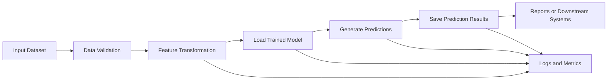
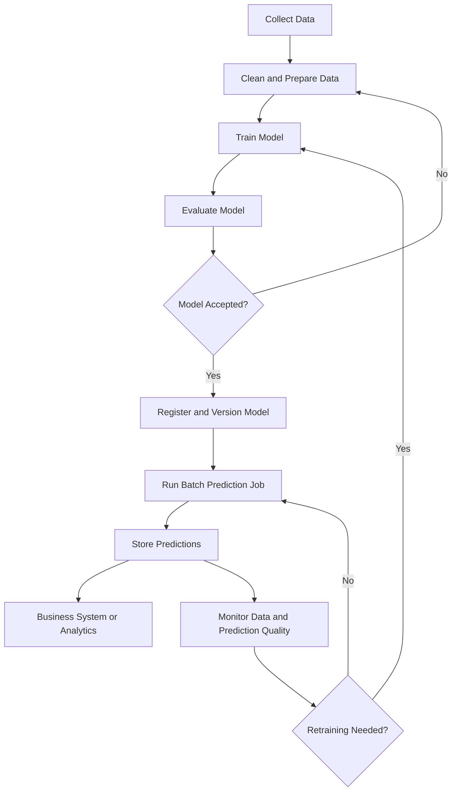
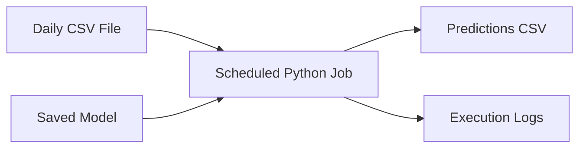
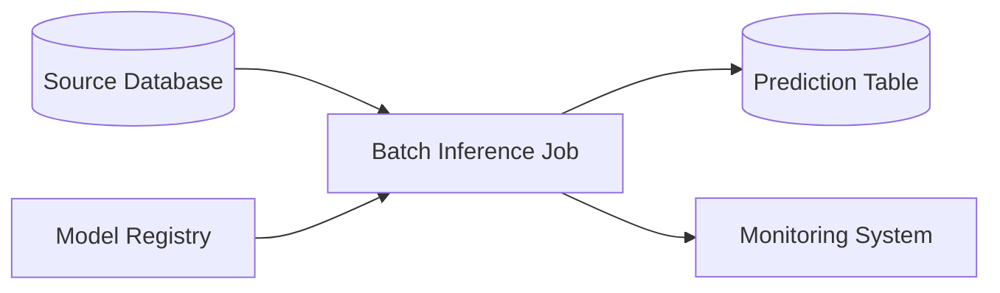
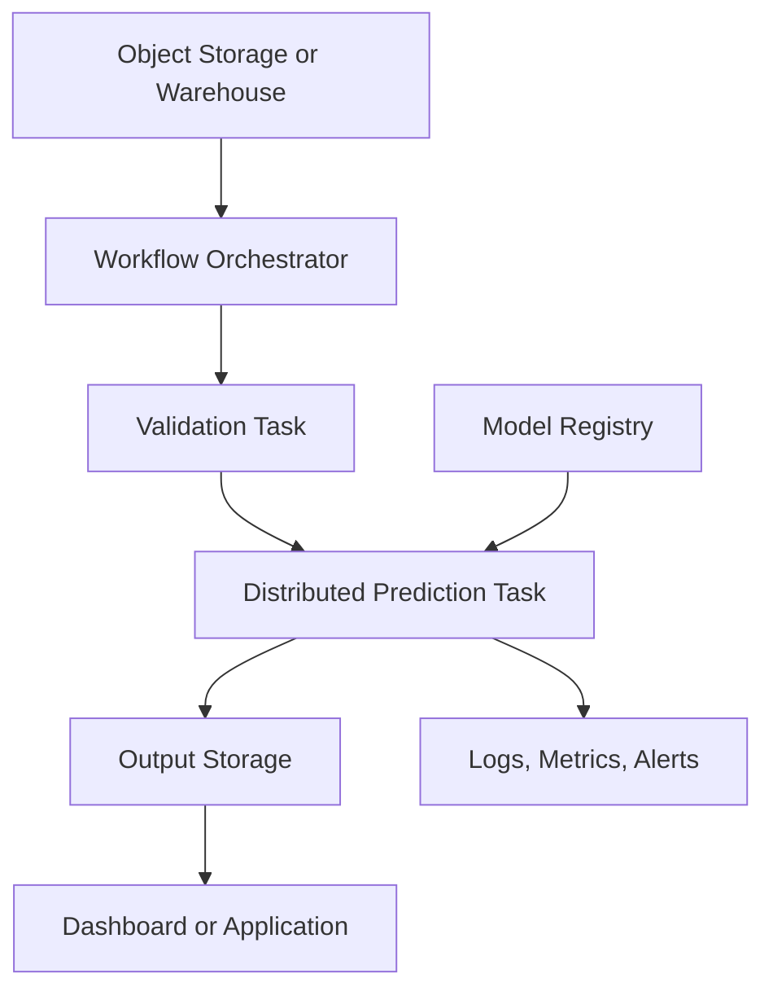
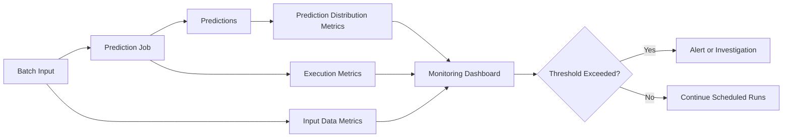
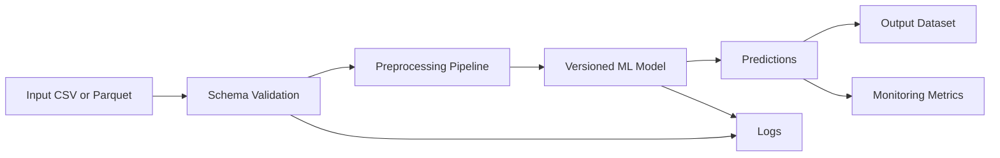

# 005 — Batch Prediction

| Item                   | Details                   |
| ---------------------- | ------------------------- |
| **Course Section**     | 04 — MLOps and Deployment |
| **Module**             | Module 08 — MLOps         |
| **Content Group**      | Model Serving             |
| **Roadmap Source**     | MLOps / Model Serving     |
| **Lesson Type**        | MLOps                     |
| **Order in Module**    | 005                       |
| **Suggested Duration** | 22 minutes                |

---

## 1. Overview

**Batch prediction**, also called **batch inference** or **offline inference**, is the process of using a trained machine learning model to generate predictions for a collection of records at once.

Unlike a real-time prediction API, a batch prediction job does not need to return a result immediately after receiving a request. Instead, it usually:

1. Reads a dataset from a file, database, data warehouse, or object storage.
2. Loads a previously trained model.
3. applies the model to many records.
4. Saves the predictions to another storage system.
5. Records logs, metrics, model versions, and execution results.

Batch prediction is useful when predictions can be calculated periodically rather than instantly.

Common examples include:

* Predicting customer churn every night.
* Generating product recommendations every morning.
* Scoring loan applications uploaded in a daily file.
* Forecasting demand for all products once per week.
* Detecting suspicious transactions after each processing window.
* Classifying thousands of documents in one scheduled job.

---

## 2. Learning Objectives

After completing this lesson, you should be able to:

* Explain batch prediction in your own words.
* Distinguish batch prediction from real-time prediction.
* Identify suitable use cases for offline inference.
* Build a simple batch prediction script.
* Load a versioned model and process a dataset safely.
* Save predictions together with useful metadata.
* Describe how batch inference fits into an MLOps workflow.
* Identify important production concerns such as monitoring, retries, data validation, and idempotency.
* Turn a batch prediction workflow into a portfolio-ready artifact.

---

## 3. What Is Batch Prediction?

Batch prediction means running a model against multiple input records as one processing job.

The model is usually trained earlier and stored as an artifact such as:

```text
model.pkl
model.joblib
model.onnx
model.pt
model.keras
```

The input may come from:

```text
CSV file
Parquet file
SQL database
Data warehouse
Data lake
Cloud object storage
Feature store
```

The output may be written to:

```text
CSV or Parquet file
Prediction table
Analytics database
Dashboard dataset
Message queue
Cloud storage
```

### Basic Flow



A batch prediction job is not simply a call to `model.predict()`.

A production-ready job must also manage:

* Model versions.
* Input schemas.
* Feature transformations.
* Dependencies.
* Prediction timestamps.
* Failure recovery.
* Data quality.
* Logging.
* Monitoring.
* Output consistency.

---

## 4. Batch Prediction vs. Real-Time Prediction

| Characteristic       | Batch Prediction                          | Real-Time Prediction                           |
| -------------------- | ----------------------------------------- | ---------------------------------------------- |
| Processing style     | Many records at once                      | One or a few records per request               |
| Response requirement | Minutes or hours may be acceptable        | Usually milliseconds or seconds                |
| Trigger              | Schedule, file arrival, or workflow event | API request or user action                     |
| Infrastructure       | Scheduled job or data pipeline            | Continuously running service                   |
| Cost                 | Often lower for large workloads           | Can be higher because the service stays online |
| Input source         | Files, database tables, warehouse         | HTTP request, event, application               |
| Output destination   | File, database, dashboard                 | API response or event stream                   |
| Typical use case     | Daily churn scores                        | Fraud check during payment                     |
| Scaling strategy     | Process data in chunks or parallel jobs   | Scale API instances based on traffic           |
| Failure handling     | Retry job or failed partition             | Retry individual request                       |

### Decision Rule

Use **batch prediction** when:

* Predictions are not required immediately.
* Records can be processed together.
* The dataset is large.
* Predictions are refreshed periodically.
* Lower infrastructure cost is important.
* Downstream systems read predictions later.

Use **real-time prediction** when:

* A user or application needs an immediate result.
* The prediction affects a live decision.
* Input arrives continuously.
* Low latency is a core requirement.

Some systems use both approaches.

For example:

* Batch prediction generates daily product recommendations.
* A real-time model adjusts the recommendations based on the user's current session.

---

## 5. Position in the Machine Learning Workflow

Batch prediction happens after the model has been trained, evaluated, and stored.



A typical MLOps system separates two pipelines:

### Training Pipeline

```text
historical data
    → feature engineering
    → model training
    → evaluation
    → model registry
```

### Batch Inference Pipeline

```text
new data
    → validation
    → same feature transformations
    → registered model
    → predictions
    → storage
```

The training and inference pipelines must use compatible preprocessing logic. Otherwise, the model may receive features that differ from those used during training.

This problem is often called **training-serving skew**.

---

## 6. Common Batch Prediction Architectures

### 6.1 Scheduled File-Based Job

A script runs at a fixed time and processes an input file.



Suitable for:

* Small projects.
* Portfolio demonstrations.
* Internal business tools.
* Simple daily workflows.

---

### 6.2 Database-Based Prediction Job

The job reads unscored rows from a database and writes predictions back to a prediction table.



Suitable for:

* Customer scoring.
* Risk analysis.
* Operational reporting.
* Business intelligence workflows.

---

### 6.3 Cloud Data Pipeline

A workflow orchestrator coordinates data extraction, inference, validation, and storage.



Possible orchestration tools include:

* Apache Airflow.
* Prefect.
* Dagster.
* Kubeflow Pipelines.
* AWS Step Functions.
* Google Cloud Workflows.
* Azure Data Factory.
* Cron or Kubernetes CronJob.

---

## 7. Minimal Batch Prediction Example

Assume that a classification model has already been trained and saved as:

```text
artifacts/churn_model.joblib
```

The input file contains customer features:

```csv
customer_id,monthly_spend,account_age,support_tickets
C001,49.5,18,2
C002,19.0,3,7
C003,88.4,42,0
```

### Python Script

```python
from pathlib import Path
from datetime import datetime, timezone
import argparse
import logging

import joblib
import pandas as pd


MODEL_FEATURES = [
    "monthly_spend",
    "account_age",
    "support_tickets",
]


def configure_logging() -> None:
    logging.basicConfig(
        level=logging.INFO,
        format="%(asctime)s | %(levelname)s | %(message)s",
    )


def validate_input(data: pd.DataFrame) -> None:
    required_columns = {"customer_id", *MODEL_FEATURES}
    missing_columns = required_columns.difference(data.columns)

    if missing_columns:
        raise ValueError(
            f"Missing required columns: {sorted(missing_columns)}"
        )

    if data["customer_id"].isna().any():
        raise ValueError("customer_id contains missing values.")

    if data[MODEL_FEATURES].isna().any().any():
        raise ValueError("One or more model features contain missing values.")


def run_batch_prediction(
    model_path: Path,
    input_path: Path,
    output_path: Path,
    model_version: str,
) -> None:
    logging.info("Loading input data from %s", input_path)
    data = pd.read_csv(input_path)

    validate_input(data)

    logging.info("Loading model from %s", model_path)
    model = joblib.load(model_path)

    features = data[MODEL_FEATURES]

    logging.info("Generating predictions for %d records", len(data))
    predictions = model.predict(features)

    output = pd.DataFrame(
        {
            "customer_id": data["customer_id"],
            "prediction": predictions,
            "model_version": model_version,
            "prediction_timestamp": datetime.now(timezone.utc).isoformat(),
        }
    )

    if hasattr(model, "predict_proba"):
        probabilities = model.predict_proba(features)
        output["prediction_probability"] = probabilities[:, 1]

    output_path.parent.mkdir(parents=True, exist_ok=True)
    output.to_csv(output_path, index=False)

    logging.info("Saved predictions to %s", output_path)
    logging.info("Batch prediction completed successfully")


def parse_arguments() -> argparse.Namespace:
    parser = argparse.ArgumentParser(
        description="Run batch predictions for customer churn."
    )

    parser.add_argument(
        "--model-path",
        type=Path,
        required=True,
        help="Path to the serialized model.",
    )

    parser.add_argument(
        "--input-path",
        type=Path,
        required=True,
        help="Path to the input CSV file.",
    )

    parser.add_argument(
        "--output-path",
        type=Path,
        required=True,
        help="Path for the output prediction file.",
    )

    parser.add_argument(
        "--model-version",
        type=str,
        required=True,
        help="Version of the model used for prediction.",
    )

    return parser.parse_args()


if __name__ == "__main__":
    configure_logging()
    args = parse_arguments()

    try:
        run_batch_prediction(
            model_path=args.model_path,
            input_path=args.input_path,
            output_path=args.output_path,
            model_version=args.model_version,
        )
    except Exception:
        logging.exception("Batch prediction failed")
        raise
```

### Run the Job

```bash
python batch_predict.py \
  --model-path artifacts/churn_model.joblib \
  --input-path data/customers.csv \
  --output-path outputs/churn_predictions.csv \
  --model-version 1.0.0
```

### Example Output

```csv
customer_id,prediction,model_version,prediction_timestamp,prediction_probability
C001,0,1.0.0,2026-07-13T01:00:00+00:00,0.124
C002,1,1.0.0,2026-07-13T01:00:00+00:00,0.883
C003,0,1.0.0,2026-07-13T01:00:00+00:00,0.057
```

---

## 8. Processing Large Datasets in Chunks

Loading an entire dataset into memory may not be practical.

Pandas can read a CSV file in chunks:

```python
from pathlib import Path
import joblib
import pandas as pd


FEATURES = [
    "monthly_spend",
    "account_age",
    "support_tickets",
]


def predict_in_chunks(
    model_path: Path,
    input_path: Path,
    output_path: Path,
    chunk_size: int = 10_000,
) -> None:
    model = joblib.load(model_path)
    first_chunk = True

    for chunk_number, chunk in enumerate(
        pd.read_csv(input_path, chunksize=chunk_size),
        start=1,
    ):
        features = chunk[FEATURES]

        chunk["prediction"] = model.predict(features)

        if hasattr(model, "predict_proba"):
            chunk["prediction_probability"] = (
                model.predict_proba(features)[:, 1]
            )

        chunk.to_csv(
            output_path,
            mode="w" if first_chunk else "a",
            index=False,
            header=first_chunk,
        )

        first_chunk = False
        print(f"Processed chunk {chunk_number}")
```

Chunking reduces memory usage, but the workflow must still handle:

* Partially written output files.
* Failed chunks.
* Duplicate records after retries.
* Record ordering.
* Progress tracking.
* Schema validation for every chunk.

For very large workloads, distributed systems such as Spark, Ray, Dask, or managed cloud batch services may be more appropriate.

---

## 9. Scheduling a Batch Prediction Job

### Cron Example

Run the job every day at 2:00 AM:

```cron
0 2 * * * /usr/bin/python3 /app/batch_predict.py \
  --model-path /app/artifacts/churn_model.joblib \
  --input-path /data/customers.csv \
  --output-path /outputs/churn_predictions.csv \
  --model-version 1.0.0
```

Cron is simple, but it provides limited support for:

* Dependency management.
* Retries.
* Task graphs.
* Monitoring dashboards.
* Backfills.
* Alerting.
* Historical execution tracking.

For more complex systems, a workflow orchestrator is usually more suitable.

---

## 10. Dockerizing the Batch Job

A batch prediction job can be packaged as a Docker image to create a reproducible execution environment.

### Example Project Structure

```text
batch-prediction-project/
├── artifacts/
│   └── churn_model.joblib
├── data/
│   └── customers.csv
├── outputs/
├── src/
│   └── batch_predict.py
├── requirements.txt
├── Dockerfile
└── README.md
```

### `requirements.txt`

```text
pandas==2.3.0
scikit-learn==1.7.0
joblib==1.5.1
```

The versions are examples. In a real project, use versions compatible with the environment used to train the model.

### `Dockerfile`

```dockerfile
FROM python:3.12-slim

WORKDIR /app

COPY requirements.txt .
RUN pip install --no-cache-dir -r requirements.txt

COPY src/ ./src/
COPY artifacts/ ./artifacts/

ENTRYPOINT ["python", "src/batch_predict.py"]
```

### Build the Image

```bash
docker build -t churn-batch-predictor:1.0.0 .
```

### Run the Container

```bash
docker run --rm \
  -v "$(pwd)/data:/data" \
  -v "$(pwd)/outputs:/outputs" \
  churn-batch-predictor:1.0.0 \
  --model-path /app/artifacts/churn_model.joblib \
  --input-path /data/customers.csv \
  --output-path /outputs/churn_predictions.csv \
  --model-version 1.0.0
```

Docker helps ensure that the same:

* Python version.
* Library versions.
* Script.
* Model artifact.
* Runtime behavior.

can be used across local development, testing, and production.

---

## 11. Production Requirements

### 11.1 Model Versioning

Every prediction should be traceable to the model that produced it.

Useful metadata includes:

```text
model_name
model_version
model_hash
training_run_id
feature_pipeline_version
prediction_timestamp
batch_id
source_data_version
```

Example:

```json
{
  "record_id": "C002",
  "prediction": 1,
  "probability": 0.883,
  "model_name": "customer_churn_classifier",
  "model_version": "1.0.0",
  "batch_id": "2026-07-13-nightly",
  "prediction_timestamp": "2026-07-13T02:03:41Z"
}
```

---

### 11.2 Data Validation

Validate the input before generating predictions.

Check:

* Required columns.
* Data types.
* Missing values.
* Duplicate identifiers.
* Allowed categories.
* Numerical ranges.
* Row count.
* Unexpected schema changes.
* Distribution changes.

Example checks:

```python
assert data["account_age"].ge(0).all()
assert data["monthly_spend"].ge(0).all()
assert data["customer_id"].is_unique
```

For larger systems, schema validation tools can help formalize these rules.

---

### 11.3 Idempotency

An idempotent job produces the same final result when it is safely executed again with the same inputs.

Suppose a job fails after writing half of its predictions. A retry must not create duplicate rows.

Possible strategies include:

* Write results to a temporary location first.
* Replace the final output only after successful completion.
* Use a unique `batch_id`.
* Use database upserts.
* Track processed partitions.
* Make output paths deterministic.
* Enforce unique keys such as `(record_id, model_version, scoring_date)`.

Example output path:

```text
predictions/model_version=1.0.0/scoring_date=2026-07-13/
```

---

### 11.4 Retries and Failure Recovery

A job may fail because of:

* Temporary database errors.
* Network problems.
* Corrupt input files.
* Invalid schemas.
* Missing model artifacts.
* Insufficient memory.
* Storage permission errors.

Retry transient failures, but do not repeatedly retry permanent validation errors without investigation.

A useful failure policy might be:

```text
temporary network failure → retry up to 3 times
invalid input schema      → fail immediately
missing required model    → fail immediately and alert
one invalid record        → quarantine record or fail based on policy
```

---

### 11.5 Logging

Useful logs should include:

* Job start and end times.
* Batch identifier.
* Model version.
* Input location.
* Output location.
* Number of records read.
* Number of records processed.
* Number of failed records.
* Processing duration.
* Prediction distribution.
* Error messages.
* Retry count.

Example:

```text
2026-07-13 02:00:01 | INFO | Starting batch_id=2026-07-13-nightly
2026-07-13 02:00:03 | INFO | Loaded model_version=1.0.0
2026-07-13 02:00:08 | INFO | Read 150000 input records
2026-07-13 02:01:27 | INFO | Generated 150000 predictions
2026-07-13 02:01:31 | INFO | Positive prediction rate=0.184
2026-07-13 02:01:34 | INFO | Job completed successfully
```

Do not log sensitive personal data, credentials, authentication tokens, or full confidential records.

---

## 12. Monitoring Batch Predictions

Monitoring should cover both the execution process and the model's behavior.

### Operational Metrics

| Metric               | Purpose                                    |
| -------------------- | ------------------------------------------ |
| Job status           | Indicates success or failure               |
| Processing duration  | Detects slower executions                  |
| Records processed    | Detects missing or unusually large batches |
| Failure count        | Measures record or job failures            |
| Retry count          | Reveals infrastructure instability         |
| Output row count     | Confirms completeness                      |
| Memory and CPU usage | Supports capacity planning                 |

### Data Quality Metrics

| Metric               | Purpose                   |
| -------------------- | ------------------------- |
| Missing-value rate   | Detects incomplete inputs |
| Feature ranges       | Detects invalid values    |
| Category frequencies | Detects unexpected labels |
| Duplicate rate       | Detects repeated records  |
| Schema changes       | Detects incompatible data |
| Feature distribution | Detects input drift       |

### Prediction Metrics

| Metric                   | Purpose                             |
| ------------------------ | ----------------------------------- |
| Class distribution       | Detects unusual output changes      |
| Average prediction score | Tracks score movement               |
| Confidence distribution  | Detects uncertainty changes         |
| Prediction volume        | Confirms expected output size       |
| Delayed accuracy metrics | Measures quality when labels arrive |

### Monitoring Flow



---

## 13. Data Drift and Model Performance

A batch job may complete successfully while the model performs poorly.

For example:

* Customer behavior changes.
* A new product category is introduced.
* A sensor is recalibrated.
* A data source changes its format.
* Economic conditions change.
* The relationship between features and labels changes.

### Input Drift

Input drift occurs when the distribution of model features changes.

Examples:

```text
Average monthly spend increases significantly.
A previously rare category becomes common.
Support ticket counts suddenly become zero.
```

### Prediction Drift

Prediction drift occurs when the output distribution changes.

Example:

```text
Last month: 18% of customers predicted to churn.
This month: 62% of customers predicted to churn.
```

This does not automatically prove that the model is wrong, but it should trigger investigation.

### Performance Monitoring

When true labels become available later, calculate metrics such as:

* Accuracy.
* Precision.
* Recall.
* F1-score.
* ROC-AUC.
* Mean absolute error.
* Root mean squared error.
* Mean absolute percentage error.

The correct metric depends on the business problem.

---

## 14. Testing a Batch Prediction Pipeline

A reliable batch prediction workflow should include several types of tests.

### Unit Tests

Test small functions independently:

* Input validation.
* Feature selection.
* Output formatting.
* Model loading.
* Probability extraction.

Example:

```python
import pandas as pd
import pytest

from batch_predict import validate_input


def test_validate_input_accepts_valid_data() -> None:
    data = pd.DataFrame(
        {
            "customer_id": ["C001"],
            "monthly_spend": [50.0],
            "account_age": [12],
            "support_tickets": [1],
        }
    )

    validate_input(data)


def test_validate_input_rejects_missing_column() -> None:
    data = pd.DataFrame(
        {
            "customer_id": ["C001"],
            "monthly_spend": [50.0],
        }
    )

    with pytest.raises(ValueError, match="Missing required columns"):
        validate_input(data)
```

### Integration Tests

Test the complete workflow using:

* A small test dataset.
* A known model artifact.
* A temporary output directory.
* Expected predictions or schema.

### Data Contract Tests

Confirm that:

* Required columns exist.
* Types are correct.
* Features follow expected constraints.
* Output columns remain stable.

### Regression Tests

Use a fixed sample dataset and compare new predictions against approved results.

A difference may be acceptable after a model update, but it should be intentional and reviewed.

---

## 15. Common Mistakes

### Mistake 1: Reimplementing Features Differently

The batch script creates features differently from the training notebook.

**Consequence:** Training-serving skew.

**Better approach:** Package preprocessing and the model in one pipeline.

```python
from sklearn.pipeline import Pipeline

pipeline = Pipeline(
    steps=[
        ("preprocessor", preprocessor),
        ("model", classifier),
    ]
)
```

---

### Mistake 2: Loading an Unversioned Model

The script loads:

```text
model.pkl
```

but nobody knows which training run created it.

**Better approach:** Use a versioned name or model registry.

```text
customer_churn/1.0.0/model.joblib
```

---

### Mistake 3: Overwriting Results Without Metadata

A daily output file is overwritten, making historical analysis impossible.

**Better approach:**

```text
outputs/scoring_date=2026-07-13/predictions.parquet
```

---

### Mistake 4: No Input Validation

The job runs with missing columns or incorrect data types.

**Consequence:** Failure, incorrect predictions, or silent data corruption.

---

### Mistake 5: No Retry or Recovery Strategy

A temporary network problem causes the whole workflow to fail permanently.

---

### Mistake 6: Loading the Entire Dataset into Memory

A local script works on 5,000 rows but crashes with 50 million rows.

**Better approach:** Use chunks, partitions, distributed processing, or warehouse-native inference.

---

### Mistake 7: Monitoring Only Job Success

The process reports success even though all prediction probabilities are nearly identical.

**Better approach:** Monitor input distributions and prediction distributions as well as job status.

---

### Mistake 8: Producing Duplicate Predictions After Retries

A restarted job inserts the same records again.

**Better approach:** Design idempotent writes and use deterministic batch identifiers.

---

### Mistake 9: Using Pickle Files from Untrusted Sources

Pickle-based formats can execute code during loading.

**Better approach:** Load only trusted artifacts and consider safer or more portable formats when appropriate.

---

## 16. Practical Exercise

Build a batch prediction pipeline for a classification or regression model.

### Suggested Problem

Use a customer churn, house price, fraud detection, or loan approval dataset.

### Requirements

1. Train or reuse a machine learning model.
2. Save the complete preprocessing and model pipeline.
3. Create a `batch_predict.py` script.
4. Read input records from CSV or Parquet.
5. Validate the required input schema.
6. Generate predictions.
7. Save prediction results with:

   * Record identifier.
   * Prediction.
   * Prediction probability, when available.
   * Model version.
   * Batch identifier.
   * Prediction timestamp.
8. Add structured logs.
9. Add at least two automated tests.
10. Package the job in Docker.
11. Document the execution commands in `README.md`.

### Optional Improvements

* Process input data in chunks.
* Write output as Parquet.
* Add a data drift report.
* Schedule the job with cron or Airflow.
* Store execution metadata in a database.
* Add retries.
* Add a failed-record quarantine file.
* Compare two model versions on the same batch.

---

## 17. Portfolio Project Structure

```text
ml-batch-prediction/
├── artifacts/
│   └── churn_pipeline.joblib
├── data/
│   ├── sample_input.csv
│   └── sample_output.csv
├── notebooks/
│   └── model_training.ipynb
├── src/
│   ├── batch_predict.py
│   ├── validation.py
│   └── monitoring.py
├── tests/
│   ├── test_validation.py
│   └── test_batch_predict.py
├── Dockerfile
├── requirements.txt
├── Makefile
└── README.md
```

### Recommended README Sections

```text
Project overview
Business problem
Dataset description
Model and features
Batch prediction architecture
Installation
Local execution
Docker execution
Input schema
Output schema
Testing
Monitoring strategy
Known limitations
Future improvements
```

### Useful README Diagram



---

## 18. Completion Checklist

* [ ] I can explain batch prediction in one or two minutes.
* [ ] I can distinguish batch prediction from real-time inference.
* [ ] I know when offline prediction is the better design choice.
* [ ] I can load a versioned model artifact.
* [ ] I can validate an input dataset before inference.
* [ ] I can generate predictions for multiple records.
* [ ] I can store predictions with timestamps and model metadata.
* [ ] I understand chunking and memory limitations.
* [ ] I understand idempotency and safe retries.
* [ ] I can describe useful operational and model-monitoring metrics.
* [ ] I have documented at least one caveat or assumption.
* [ ] I have a notebook, script, Docker image, or portfolio artifact for this lesson.

---

## 19. Related Outcome

Deploy, version, monitor, and operate machine learning models using APIs, batch jobs, Docker, CI/CD, scheduled workflows, and drift-aware monitoring.

---

## 20. Related Mini Project

### Mini Project: Batch Customer Churn Prediction

Create a production-style batch inference workflow that:

* Loads a versioned churn model.
* Processes a daily customer dataset.
* Validates the input schema.
* Generates churn labels and probabilities.
* Saves results to CSV or Parquet.
* Records execution and prediction metrics.
* Runs inside Docker.
* Includes tests and a detailed README.

This project can later be extended with:

* Airflow scheduling.
* MLflow model registry integration.
* Cloud object storage.
* Database output.
* Automated drift detection.
* Email or Slack failure alerts.

---

## 21. Summary

**Batch prediction** applies a trained machine learning model to many records in a scheduled or event-triggered workflow.

It is a strong choice when predictions do not need to be returned immediately and can be generated periodically. A reliable batch inference system requires more than a prediction function. It should include:

* Reusable preprocessing.
* Versioned model artifacts.
* Input validation.
* Reproducible dependencies.
* Safe and idempotent output writes.
* Logging.
* Failure recovery.
* Data and prediction monitoring.
* Clear documentation.

A notebook demonstrates that a model works. A batch prediction pipeline demonstrates that the model can be operated repeatedly, reliably, and transparently in a real system.
