# 006 — Real-Time Prediction

| Item                   | Details                   |
| ---------------------- | ------------------------- |
| **Course Section**     | 04 — MLOps and Deployment |
| **Module**             | Module 08 — MLOps         |
| **Content Group**      | Model Serving             |
| **Roadmap Source**     | MLOps / Model Serving     |
| **Lesson Type**        | MLOps                     |
| **Order in Module**    | 006                       |
| **Suggested Duration** | 22 minutes                |

---

## 1. Lesson Overview

**Real-time prediction**, also called **online inference**, is the process of generating a model prediction immediately after receiving a request.

Instead of processing thousands or millions of records at scheduled intervals, a real-time prediction service handles one request or a small group of requests at a time.

Common examples include:

* Detecting a fraudulent transaction during payment.
* Recommending products while a user is browsing.
* Classifying a customer-support message when it is submitted.
* Estimating delivery time when an order is created.
* Detecting spam before an email reaches the inbox.
* Predicting whether a user will click an advertisement.
* Running image classification from a mobile application.

A trained model in a notebook is not yet a production service. To support real-time predictions, the model must be packaged, deployed, exposed through an interface such as an API, monitored, tested, and versioned.

---

## 2. Learning Objectives

By the end of this lesson, you should be able to:

1. Explain real-time prediction in your own words.
2. Distinguish real-time prediction from batch prediction.
3. Describe the request-response lifecycle of an online inference system.
4. Package a trained model behind a prediction API.
5. Identify the main latency, reliability, and scaling requirements.
6. Define appropriate monitoring metrics for a real-time ML service.
7. Recognize common production problems such as feature mismatch, model drift, timeout errors, and dependency conflicts.
8. Build a small portfolio artifact containing an API, Dockerfile, README, and sample request.

---

## 3. What Is Real-Time Prediction?

Real-time prediction means that a model receives input and returns a result within a short period, usually milliseconds or seconds.

A typical interaction looks like this:

```text
Client sends input
        ↓
Prediction service validates the input
        ↓
Features are transformed
        ↓
Model generates a prediction
        ↓
Service returns the result
```

For example, an application may submit customer information:

```json
{
  "age": 35,
  "monthly_income": 4200,
  "account_age_months": 18,
  "previous_defaults": 0
}
```

The prediction service may respond with:

```json
{
  "prediction": "low_risk",
  "default_probability": 0.08,
  "model_version": "credit-risk-v1.3.0"
}
```

The application can immediately use this output to make a decision.

---

## 4. Position in the Machine Learning Workflow

Real-time prediction appears near the end of the machine learning lifecycle, after data preparation, training, evaluation, and model selection.

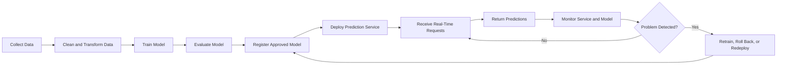

The deployment step does not end the ML workflow. Production monitoring creates a feedback loop that may trigger retraining, rollback, or feature updates.

---

## 5. Real-Time Prediction vs. Batch Prediction

| Aspect           | Real-Time Prediction                       | Batch Prediction                              |
| ---------------- | ------------------------------------------ | --------------------------------------------- |
| Processing style | One request or a small group at a time     | Large datasets processed together             |
| Response time    | Milliseconds or seconds                    | Minutes, hours, or days                       |
| Trigger          | User action, event, or API request         | Schedule or data availability                 |
| Infrastructure   | API server, container, autoscaling service | Scheduled job, workflow engine, data pipeline |
| Main concern     | Latency and availability                   | Throughput and processing cost                |
| Example          | Fraud detection during payment             | Daily churn scores for all customers          |
| Failure impact   | May immediately affect users               | Usually affects a scheduled output            |
| Scaling strategy | More API replicas or faster inference      | More workers or distributed processing        |

### Decision Rule

Use real-time prediction when the prediction must affect an immediate decision.

Use batch prediction when predictions can be computed in advance or when a delay is acceptable.

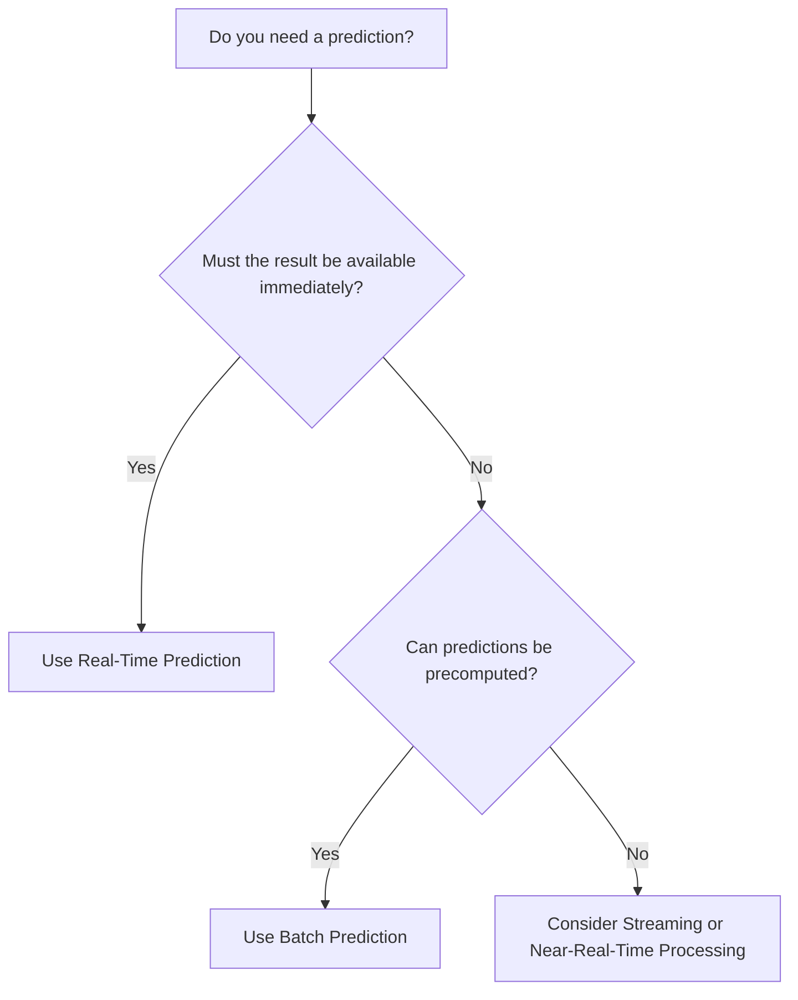

---

## 6. Core Components of a Real-Time Prediction System

A production-grade real-time prediction system usually contains several components.

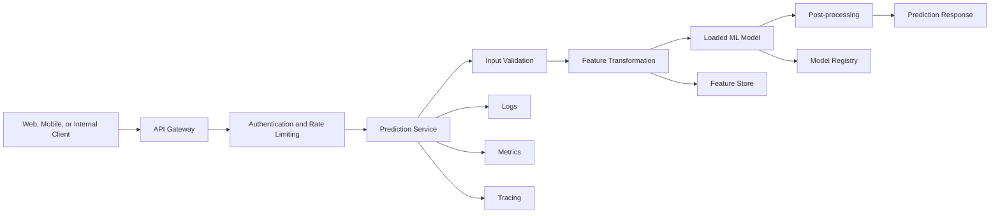

### 6.1 Client

The client may be:

* A web application.
* A mobile application.
* Another backend service.
* An Internet of Things device.
* A command-line tool.
* A streaming consumer.

The client sends the input and receives a prediction response.

### 6.2 API Gateway

An API gateway may manage:

* Authentication.
* Request routing.
* Rate limiting.
* TLS termination.
* Request size restrictions.
* Usage quotas.
* Access logging.

### 6.3 Prediction Service

The prediction service is the application that:

1. Receives the request.
2. Validates the schema.
3. Applies preprocessing.
4. Calls the model.
5. Formats the response.
6. Records logs and metrics.

Frameworks commonly used for this layer include FastAPI, Flask, Django, Spring Boot, Express, BentoML, KServe, and Seldon.

### 6.4 Preprocessing Pipeline

The preprocessing logic used in production must match the transformations used during training.

Examples include:

* Missing-value handling.
* Categorical encoding.
* Standardization.
* Tokenization.
* Image resizing.
* Feature normalization.
* Date feature extraction.

A common approach is to package preprocessing and the model together in a single pipeline.

### 6.5 Model Artifact

The model artifact may be stored as:

* A `joblib` file.
* A `pickle` file.
* An ONNX file.
* A TensorFlow SavedModel.
* A PyTorch checkpoint.
* A TorchScript artifact.
* A model package stored in a registry.

### 6.6 Monitoring System

Monitoring should cover both software behavior and model behavior.

Software monitoring includes:

* Request volume.
* Latency.
* Error rate.
* CPU usage.
* Memory usage.
* Container restarts.
* Timeout count.

Model monitoring includes:

* Prediction distribution.
* Input feature distribution.
* Data drift.
* Concept drift.
* Missing-value rate.
* Confidence scores.
* Model performance after labels become available.

---

## 7. The Request-Response Lifecycle

A real-time prediction request passes through several stages.

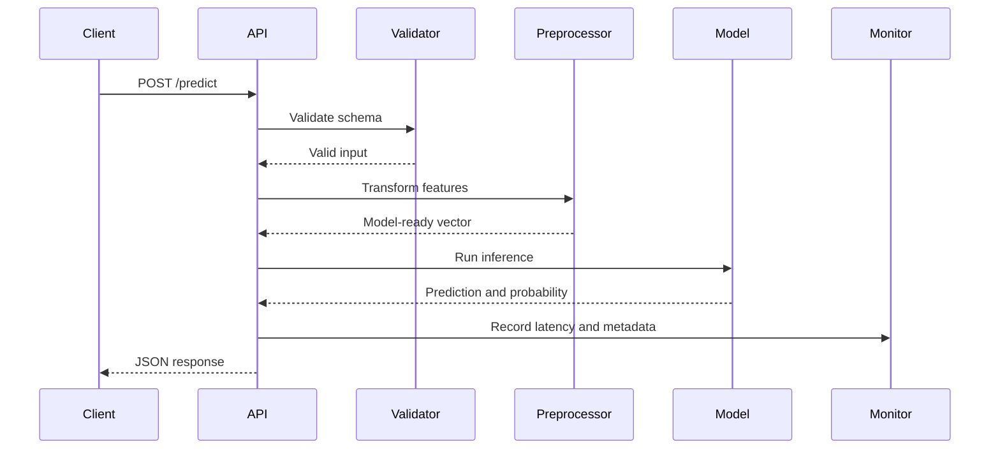

A simplified latency equation is:

[
T_{\text{total}}
================

T_{\text{network}}
+
T_{\text{validation}}
+
T_{\text{preprocessing}}
+
T_{\text{inference}}
+
T_{\text{postprocessing}}
]

Where:

* (T_{\text{network}}) is the communication time.
* (T_{\text{validation}}) is the input validation time.
* (T_{\text{preprocessing}}) is the feature transformation time.
* (T_{\text{inference}}) is the model computation time.
* (T_{\text{postprocessing}}) is the response formatting time.

To reduce total latency, engineers must examine every stage instead of optimizing only the model.

---

## 8. Latency, Throughput, and Availability

### 8.1 Latency

Latency is the amount of time required to complete one request.

Common latency statistics include:

* **p50:** Half of requests complete faster than this value.
* **p95:** 95% of requests complete faster than this value.
* **p99:** 99% of requests complete faster than this value.

Average latency alone may hide slow requests. Production systems commonly monitor percentile latency.

Example service-level objective:

```text
99% of prediction requests must finish within 300 milliseconds.
```

### 8.2 Throughput

Throughput is the number of requests handled during a unit of time.

[
\text{Throughput}
=================

\frac{\text{Number of completed requests}}
{\text{Time interval}}
]

It is often measured as:

```text
requests per second
```

### 8.3 Availability

Availability describes how often the service is operational.

[
\text{Availability}
===================

\frac{\text{Successful operating time}}
{\text{Total observed time}}
\times 100%
]

Example:

```text
Availability target: 99.9%
```

Approximately 99.9% monthly availability allows about 43 minutes of downtime in a 30-day month.

### 8.4 Trade-Offs

A complex model may provide better predictive performance but increase:

* Latency.
* Memory usage.
* Infrastructure cost.
* Timeout risk.
* Scaling difficulty.

The best production model is not always the model with the highest offline accuracy.

---

## 9. Example: Building a Prediction API with FastAPI

Assume that a classification pipeline has already been trained and saved as:

```text
artifacts/customer_churn_pipeline.joblib
```

### 9.1 Suggested Project Structure

```text
real-time-prediction/
├── app/
│   ├── __init__.py
│   ├── main.py
│   └── schemas.py
├── artifacts/
│   └── customer_churn_pipeline.joblib
├── tests/
│   └── test_api.py
├── Dockerfile
├── requirements.txt
└── README.md
```

### 9.2 Request and Response Schemas

```python
# app/schemas.py

from pydantic import BaseModel, Field


class PredictionRequest(BaseModel):
    age: int = Field(ge=18, le=120)
    monthly_spend: float = Field(ge=0)
    account_age_months: int = Field(ge=0)
    support_tickets: int = Field(ge=0)
    contract_type: str


class PredictionResponse(BaseModel):
    prediction: int
    churn_probability: float
    model_version: str
```

### 9.3 FastAPI Application

```python
# app/main.py

from contextlib import asynccontextmanager
from pathlib import Path
import logging
import time

import joblib
import pandas as pd
from fastapi import FastAPI, HTTPException

from app.schemas import PredictionRequest, PredictionResponse


MODEL_PATH = Path("artifacts/customer_churn_pipeline.joblib")
MODEL_VERSION = "customer-churn-v1.0.0"

logger = logging.getLogger(__name__)
model = None


@asynccontextmanager
async def lifespan(app: FastAPI):
    global model

    if not MODEL_PATH.exists():
        raise RuntimeError(f"Model artifact not found: {MODEL_PATH}")

    model = joblib.load(MODEL_PATH)
    logger.info("Loaded model version %s", MODEL_VERSION)

    yield

    model = None


app = FastAPI(
    title="Customer Churn Prediction API",
    version="1.0.0",
    lifespan=lifespan,
)


@app.get("/health")
def health_check() -> dict[str, str]:
    return {
        "status": "healthy",
        "model_version": MODEL_VERSION,
    }


@app.post("/predict", response_model=PredictionResponse)
def predict(payload: PredictionRequest) -> PredictionResponse:
    if model is None:
        raise HTTPException(
            status_code=503,
            detail="The prediction model is unavailable.",
        )

    started_at = time.perf_counter()

    try:
        features = pd.DataFrame([payload.model_dump()])

        prediction = int(model.predict(features)[0])
        probability = float(model.predict_proba(features)[0, 1])

        latency_ms = (time.perf_counter() - started_at) * 1000

        logger.info(
            "prediction_completed model_version=%s "
            "prediction=%s latency_ms=%.2f",
            MODEL_VERSION,
            prediction,
            latency_ms,
        )

        return PredictionResponse(
            prediction=prediction,
            churn_probability=round(probability, 4),
            model_version=MODEL_VERSION,
        )

    except Exception as error:
        logger.exception("Prediction failed")

        raise HTTPException(
            status_code=500,
            detail="Prediction could not be generated.",
        ) from error
```

### Why Load the Model at Startup?

The model should normally be loaded once when the service starts.

Loading the model inside every request would:

* Increase latency.
* Waste CPU and disk operations.
* Create unnecessary memory allocation.
* Reduce throughput.
* Increase the probability of timeout errors.

---

## 10. Running the API

Install the dependencies:

```bash
pip install fastapi uvicorn joblib pandas scikit-learn
```

Start the API:

```bash
uvicorn app.main:app --host 0.0.0.0 --port 8000
```

Open the interactive API documentation:

```text
http://localhost:8000/docs
```

Check service health:

```bash
curl http://localhost:8000/health
```

Example response:

```json
{
  "status": "healthy",
  "model_version": "customer-churn-v1.0.0"
}
```

Send a prediction request:

```bash
curl -X POST "http://localhost:8000/predict" \
  -H "Content-Type: application/json" \
  -d '{
    "age": 34,
    "monthly_spend": 89.5,
    "account_age_months": 16,
    "support_tickets": 3,
    "contract_type": "monthly"
  }'
```

Example prediction response:

```json
{
  "prediction": 1,
  "churn_probability": 0.7815,
  "model_version": "customer-churn-v1.0.0"
}
```

---

## 11. Containerizing the Service with Docker

A Docker image packages the application, model artifact, runtime, and dependencies into a reproducible unit.

### Dockerfile

```dockerfile
FROM python:3.12-slim

WORKDIR /app

COPY requirements.txt .

RUN pip install --no-cache-dir -r requirements.txt

COPY app ./app
COPY artifacts ./artifacts

EXPOSE 8000

CMD [
  "uvicorn",
  "app.main:app",
  "--host",
  "0.0.0.0",
  "--port",
  "8000"
]
```

### Build the Image

```bash
docker build -t churn-prediction-api:1.0.0 .
```

### Run the Container

```bash
docker run \
  --rm \
  -p 8000:8000 \
  churn-prediction-api:1.0.0
```

### Deployment Flow

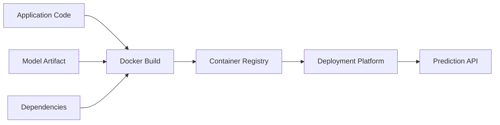

---

## 12. Input Validation

A production API must not assume that every request is valid.

Input validation may verify:

* Required fields.
* Data types.
* Numerical ranges.
* Allowed categorical values.
* String length.
* Date formats.
* Missing values.
* Maximum request size.
* Image dimensions.
* Supported file types.

Example invalid request:

```json
{
  "age": -5,
  "monthly_spend": "unknown",
  "account_age_months": null
}
```

Without validation, invalid data may cause:

* Runtime exceptions.
* Meaningless predictions.
* Security issues.
* Corrupted monitoring data.
* Unexpected model behavior.

FastAPI and Pydantic can reject invalid requests before they reach the model.

---

## 13. Training-Serving Skew

**Training-serving skew** occurs when production features differ from those used during model training.

Examples include:

* Training uses standardized values, but production sends raw values.
* Training fills missing values with the median, but production uses zero.
* Category labels are encoded differently.
* Training timestamps use UTC, while production uses local time.
* Tokenization versions differ.
* Production uses a different feature order.

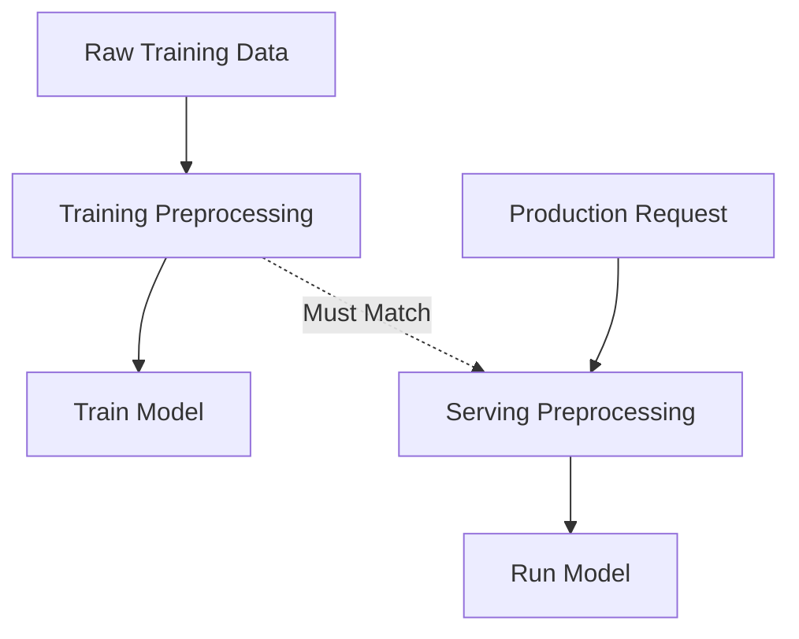

### Recommended Practice

Package preprocessing and prediction into one pipeline:

```python
from sklearn.compose import ColumnTransformer
from sklearn.pipeline import Pipeline
from sklearn.preprocessing import OneHotEncoder, StandardScaler
from sklearn.linear_model import LogisticRegression

preprocessor = ColumnTransformer(
    transformers=[
        (
            "numerical",
            StandardScaler(),
            [
                "age",
                "monthly_spend",
                "account_age_months",
                "support_tickets",
            ],
        ),
        (
            "categorical",
            OneHotEncoder(handle_unknown="ignore"),
            ["contract_type"],
        ),
    ]
)

pipeline = Pipeline(
    steps=[
        ("preprocessor", preprocessor),
        ("classifier", LogisticRegression()),
    ]
)
```

Saving the complete pipeline reduces the risk of inconsistent feature transformations.

---

## 14. Model Versioning

Each deployed model should have an identifiable version.

A model version may include:

* Model name.
* Semantic version.
* Training date.
* Git commit.
* Dataset version.
* Feature schema version.
* Dependency version.
* Evaluation metrics.

Example metadata:

```json
{
  "model_name": "customer-churn",
  "model_version": "1.3.0",
  "training_dataset_version": "2026-06-15",
  "feature_schema_version": "2.0",
  "git_commit": "a4d92f1",
  "python_version": "3.12",
  "validation_auc": 0.873
}
```

The prediction response may also include the model version:

```json
{
  "prediction": 1,
  "probability": 0.7815,
  "model_version": "customer-churn-v1.3.0"
}
```

This makes debugging, comparison, auditing, and rollback easier.

---

## 15. Deployment Strategies

### 15.1 Rolling Deployment

Instances are replaced gradually.

```text
v1 v1 v1
   ↓
v2 v1 v1
   ↓
v2 v2 v1
   ↓
v2 v2 v2
```

Advantages:

* Simple.
* Requires limited extra infrastructure.
* Avoids complete service interruption.

Risk:

* Two model versions may temporarily serve requests at the same time.

### 15.2 Blue-Green Deployment

Two complete environments are maintained:

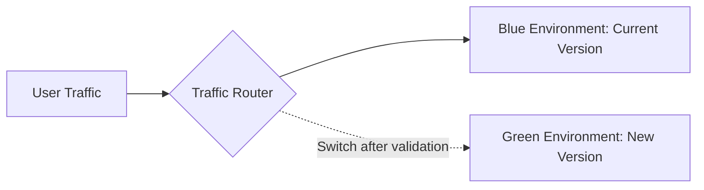

Advantages:

* Fast rollback.
* Clear separation between versions.

Disadvantage:

* Requires additional infrastructure.

### 15.3 Canary Deployment

A small percentage of traffic is sent to the new version.

```text
95% of traffic → model v1
 5% of traffic → model v2
```

The traffic percentage can gradually increase when the new version performs correctly.

### 15.4 Shadow Deployment

The new model receives copied production requests, but its predictions do not affect users.

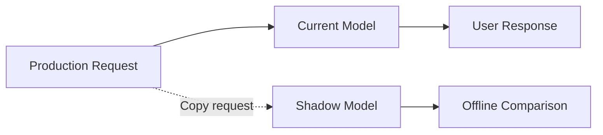

Shadow deployment is useful for validating:

* Latency.
* Prediction differences.
* Resource usage.
* Data compatibility.
* Error rates.

---

## 16. Scaling a Real-Time Prediction Service

When traffic increases, one server may become insufficient.

### Vertical Scaling

Increase the resources of one machine:

* More CPU.
* More memory.
* Faster GPU.
* Faster storage.

### Horizontal Scaling

Run multiple replicas of the prediction service.

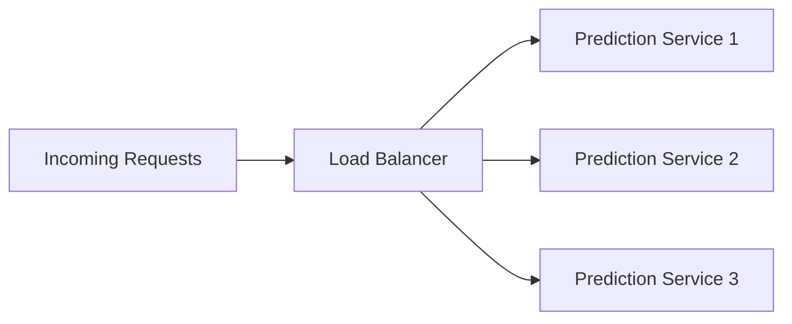

Horizontal scaling usually provides better fault tolerance.

### Autoscaling Signals

A platform may increase replicas based on:

* CPU utilization.
* Memory utilization.
* Requests per second.
* Queue size.
* Concurrent requests.
* p95 latency.
* GPU utilization.

### Important Constraint

Every replica must load the model into memory. Large models may make horizontal scaling expensive.

---

## 17. Online Inference Patterns

### 17.1 Synchronous Inference

The client waits until the prediction is complete.

```text
request → prediction → response
```

Use it when:

* Inference is fast.
* The result is needed immediately.
* Request duration remains within the timeout limit.

### 17.2 Asynchronous Inference

The service accepts the request and processes it later.

```text
request → job ID → background processing → result lookup
```

Use it when:

* Model execution is slow.
* Inputs are large.
* GPU capacity is limited.
* The client does not need an immediate response.

### 17.3 Micro-Batching

The service briefly collects multiple requests and sends them to the model together.

```text
Request 1 ┐
Request 2 ├─→ Small Batch → Model
Request 3 ┘
```

Micro-batching may improve GPU utilization and throughput but can add waiting time.

---

## 18. Caching Predictions

Caching can reduce repeated inference work.

Example cache key:

```text
hash(model_version + normalized_input)
```

Request flow:

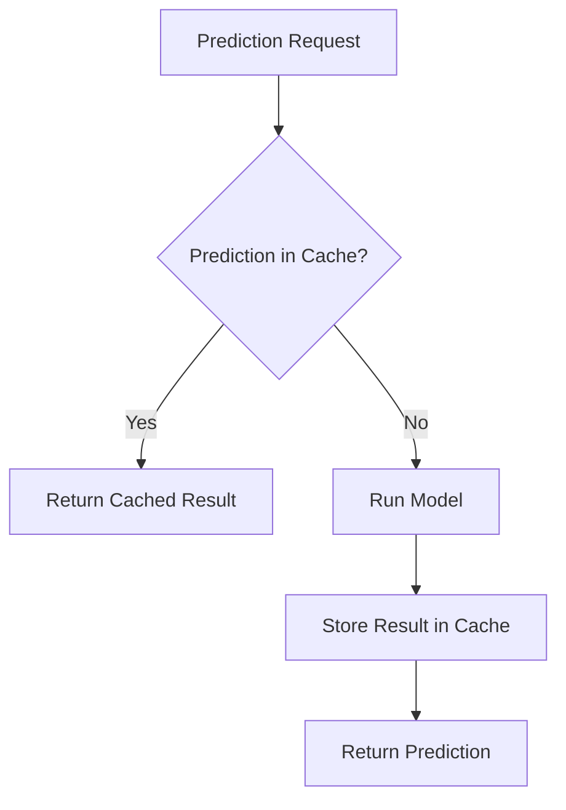

Caching is useful when:

* Identical requests are common.
* Predictions are deterministic.
* Results remain valid for a period.
* Model outputs are expensive to calculate.

Caching may be inappropriate when:

* Inputs are highly unique.
* Predictions must always reflect the newest data.
* The model is nondeterministic.
* Results contain sensitive information.
* Incorrect cache invalidation would cause stale decisions.

---

## 19. Logging

Logs should help engineers investigate failures without exposing sensitive data.

Useful fields include:

```text
timestamp
request_id
endpoint
model_version
status_code
latency_ms
prediction_class
confidence_bucket
input_schema_version
error_type
```

Example structured log:

```json
{
  "timestamp": "2026-07-13T00:15:31Z",
  "request_id": "req_8f321a",
  "endpoint": "/predict",
  "model_version": "customer-churn-v1.3.0",
  "status_code": 200,
  "latency_ms": 42.8,
  "prediction_class": 1
}
```

Avoid logging raw sensitive information such as:

* Passwords.
* Authentication tokens.
* Full payment-card numbers.
* Private medical data.
* Personally identifiable information.
* Complete user documents.
* Raw images when unnecessary.

---

## 20. Monitoring Metrics

### 20.1 Service Metrics

| Metric        | Meaning                                 |
| ------------- | --------------------------------------- |
| Request count | Total requests received                 |
| Error rate    | Percentage of failed requests           |
| p50 latency   | Typical response time                   |
| p95 latency   | Response time for most requests         |
| p99 latency   | Tail latency                            |
| Timeout rate  | Requests exceeding the deadline         |
| CPU usage     | Compute utilization                     |
| Memory usage  | Memory consumed by the service          |
| Restart count | Number of container restarts            |
| Availability  | Percentage of successful operating time |

### 20.2 Data Metrics

Monitor:

* Missing-value rate.
* Invalid request rate.
* Category frequency.
* Numerical mean and standard deviation.
* Minimum and maximum values.
* Feature distribution changes.
* Input volume changes.

### 20.3 Prediction Metrics

Monitor:

* Prediction class frequency.
* Mean prediction probability.
* Low-confidence prediction rate.
* Positive prediction rate.
* Rejection or fallback rate.
* Difference between current and baseline prediction distributions.

### 20.4 Model Performance Metrics

When ground-truth labels become available, monitor:

* Accuracy.
* Precision.
* Recall.
* F1-score.
* ROC-AUC.
* Mean absolute error.
* Root mean squared error.
* Calibration.
* Business outcome metrics.

---

## 21. Data Drift and Concept Drift

### Data Drift

Data drift occurs when the input distribution changes.

[
P_{\text{production}}(X)
\neq
P_{\text{training}}(X)
]

Example:

The average customer age in training data was 42, but it becomes 28 in production.

### Concept Drift

Concept drift occurs when the relationship between input and target changes.

[
P_{\text{production}}(Y \mid X)
\neq
P_{\text{training}}(Y \mid X)
]

Example:

A behavior that previously indicated fraud may become common among legitimate users.

### Monitoring Loop

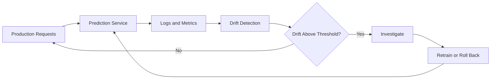

Drift does not automatically prove that a model is inaccurate, but it indicates that further investigation may be necessary.

---

## 22. Error Handling and Fallbacks

A real-time system must define how it behaves when prediction fails.

Possible failure scenarios include:

* Model artifact is unavailable.
* Input schema is invalid.
* Feature service is unavailable.
* Model inference times out.
* Memory is exhausted.
* External dependency fails.
* Input contains an unknown category.
* The model returns an invalid value.

Possible fallback strategies include:

1. Return a clear error response.
2. Use a rule-based decision.
3. Return a default prediction.
4. Use the previous stable model.
5. Queue the request for later processing.
6. Ask the user to retry.
7. Route traffic to another replica.

Example error response:

```json
{
  "error": "prediction_unavailable",
  "message": "The prediction service is temporarily unavailable.",
  "request_id": "req_8f321a"
}
```

Fallback behavior must be chosen carefully. A default prediction may be acceptable for content recommendation but dangerous for medical, financial, or safety-critical decisions.

---

## 23. Security Considerations

A public or internal prediction endpoint should consider:

* Authentication.
* Authorization.
* TLS encryption.
* Request rate limits.
* Maximum request size.
* Input sanitization.
* Secret management.
* Dependency vulnerability scanning.
* Container image scanning.
* Audit logs.
* Protection against model extraction attacks.
* Protection against adversarial inputs.
* Private-data minimization.

The model file should also be treated as an artifact with controlled access.

Never load an untrusted Pickle or Joblib file because deserialization may execute malicious code.

---

## 24. Testing Strategy

### 24.1 Unit Tests

Test individual components:

* Input transformations.
* Feature ordering.
* Probability formatting.
* Threshold logic.
* Error handling.

### 24.2 API Tests

Test endpoint behavior:

```python
# tests/test_api.py

from fastapi.testclient import TestClient

from app.main import app


client = TestClient(app)


def test_health_endpoint() -> None:
    response = client.get("/health")

    assert response.status_code == 200
    assert response.json()["status"] == "healthy"


def test_predict_rejects_invalid_age() -> None:
    response = client.post(
        "/predict",
        json={
            "age": -10,
            "monthly_spend": 89.5,
            "account_age_months": 16,
            "support_tickets": 3,
            "contract_type": "monthly",
        },
    )

    assert response.status_code == 422
```

### 24.3 Integration Tests

Verify that:

* The API loads the real model artifact.
* Preprocessing and inference work together.
* The Docker image starts correctly.
* Health checks succeed.
* Dependencies are compatible.

### 24.4 Load Tests

Measure:

* Maximum requests per second.
* p95 and p99 latency.
* Error rate under load.
* Memory growth.
* Autoscaling behavior.

### 24.5 Regression Tests

Store representative requests and expected outputs.

```json
{
  "input": {
    "age": 34,
    "monthly_spend": 89.5,
    "account_age_months": 16,
    "support_tickets": 3,
    "contract_type": "monthly"
  },
  "expected_prediction": 1,
  "expected_probability_range": [0.75, 0.82]
}
```

Regression tests help identify unexpected prediction changes after updating the model, preprocessing logic, or dependencies.

---

## 25. CI/CD Workflow

A simple deployment pipeline may include:

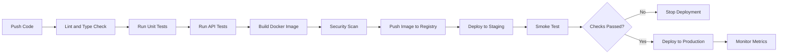

A model deployment pipeline may also verify:

* Model artifact checksum.
* Model signature.
* Feature schema.
* Offline evaluation threshold.
* Latency threshold.
* Memory requirement.
* Compatibility with the prediction service.

---

## 26. Common Mistakes

### Mistake 1: Keeping the Model Only in a Notebook

A notebook is useful for exploration but is not a reliable serving environment.

**Better approach:** Export the model and provide an API or executable service.

---

### Mistake 2: Loading the Model for Every Request

This creates unnecessary latency and resource usage.

**Better approach:** Load the model once during application startup.

---

### Mistake 3: Duplicating Preprocessing Logic

Separate training and serving transformations can become inconsistent.

**Better approach:** Save preprocessing and the model as one versioned pipeline.

---

### Mistake 4: Returning Only the Prediction

A prediction without model metadata is difficult to debug.

**Better approach:** Return or log the model version and request identifier.

---

### Mistake 5: Monitoring Only Server Availability

A service can be technically healthy while the model produces poor predictions.

**Better approach:** Monitor infrastructure, input data, predictions, drift, and delayed ground-truth performance.

---

### Mistake 6: Using Average Latency Only

Average latency may hide slow requests.

**Better approach:** Monitor p50, p95, and p99 latency.

---

### Mistake 7: Ignoring Invalid Input

Unexpected values may produce meaningless results.

**Better approach:** Add strict request validation and clear error responses.

---

### Mistake 8: Deploying Without Rollback

A new model may fail even after offline evaluation.

**Better approach:** Keep the previous stable model and use canary, blue-green, or rolling deployment.

---

### Mistake 9: Logging Sensitive Data

Prediction logs may accidentally expose private user information.

**Better approach:** Log metadata, hashes, aggregates, or redacted values.

---

### Mistake 10: Using the Most Accurate Model Without Measuring Latency

A large model may violate the product’s response-time requirement.

**Better approach:** Optimize for both predictive performance and operational constraints.

---

## 27. Practical Exercise

Build a small real-time prediction service for a classification or regression model.

### Required Tasks

1. Train or reuse a simple model.
2. Package preprocessing and prediction into one pipeline.
3. Save the pipeline with Joblib.
4. Create a FastAPI endpoint named `/predict`.
5. Add request validation with Pydantic.
6. Add a `/health` endpoint.
7. Include the model version in each prediction response.
8. Record prediction latency in logs.
9. Create a Dockerfile.
10. Add a README with setup and usage instructions.
11. Add at least two API tests.
12. Document the production metrics you would monitor.

### Suggested Dataset Options

* Customer churn.
* House-price prediction.
* Loan-default prediction.
* Iris classification.
* Titanic survival prediction.
* Spam-message classification.
* Product-review sentiment analysis.

---

## 28. Suggested API Contract

### Endpoint

```http
POST /predict
```

### Request

```json
{
  "feature_1": 12.5,
  "feature_2": "category_a",
  "feature_3": 4
}
```

### Successful Response

```json
{
  "prediction": 1,
  "probability": 0.8642,
  "model_version": "model-v1.0.0",
  "request_id": "req_123456"
}
```

### Validation Error

```json
{
  "error": "invalid_request",
  "details": [
    {
      "field": "feature_1",
      "message": "Value must be greater than or equal to zero."
    }
  ]
}
```

### Service Error

```json
{
  "error": "prediction_unavailable",
  "message": "The model could not generate a prediction.",
  "request_id": "req_123456"
}
```

---

## 29. Portfolio Deliverable

A strong portfolio repository should include:

```text
project/
├── app/
│   ├── main.py
│   ├── schemas.py
│   └── preprocessing.py
├── artifacts/
│   └── model.joblib
├── notebooks/
│   └── training.ipynb
├── tests/
│   └── test_api.py
├── Dockerfile
├── requirements.txt
├── sample_request.json
└── README.md
```

The README should explain:

* The prediction problem.
* The dataset.
* The model and evaluation metrics.
* How the model artifact was created.
* How to run the API locally.
* How to run the service with Docker.
* Example request and response.
* Model version.
* Known limitations.
* Monitoring plan.
* Possible future improvements.

---

## 30. Production Readiness Checklist

### Model

* [ ] The model has passed an offline evaluation threshold.
* [ ] The preprocessing pipeline is packaged with the model.
* [ ] The model artifact has a unique version.
* [ ] The feature schema is documented.
* [ ] The model can be loaded in the production environment.
* [ ] Expected memory and inference time have been measured.

### API

* [ ] Input validation is enabled.
* [ ] Errors return structured responses.
* [ ] A health endpoint is available.
* [ ] Request timeouts are configured.
* [ ] The response includes model-version information.
* [ ] Authentication and rate limiting are considered.

### Deployment

* [ ] A reproducible Docker image exists.
* [ ] Dependencies are pinned.
* [ ] Automated tests run in CI.
* [ ] A rollback strategy exists.
* [ ] A staging environment is available.
* [ ] Production deployment uses health checks.

### Monitoring

* [ ] Request count is monitored.
* [ ] Error rate is monitored.
* [ ] p50, p95, and p99 latency are monitored.
* [ ] CPU and memory usage are monitored.
* [ ] Input validation failures are monitored.
* [ ] Prediction distribution is monitored.
* [ ] Data drift is monitored.
* [ ] Model performance is measured when labels become available.

---

## 31. Completion Checklist

* [ ] I can explain real-time prediction in one or two minutes.
* [ ] I can distinguish real-time prediction from batch prediction.
* [ ] I understand the request-response inference lifecycle.
* [ ] I can expose a trained model through an API.
* [ ] I understand why preprocessing must match training.
* [ ] I can explain latency, throughput, and availability.
* [ ] I know why p95 and p99 latency matter.
* [ ] I can describe at least two deployment strategies.
* [ ] I know which service and model metrics should be monitored.
* [ ] I have created a notebook, model, API, Docker service, test, or portfolio note for this lesson.
* [ ] I have recorded at least one limitation, assumption, or open question.

---

## 32. Related Outcome

Deploy, version, monitor, and operate machine learning models using:

* Prediction APIs.
* Docker containers.
* Automated testing.
* CI/CD pipelines.
* Model registries.
* Service monitoring.
* Drift-aware workflows.
* Safe rollback strategies.

---

## 33. Related Mini Project

### Deploy an ML Model API

Build a complete mini project containing:

* A trained machine learning pipeline.
* A FastAPI endpoint at `/predict`.
* A health-check endpoint at `/health`.
* Pydantic request validation.
* A versioned model artifact.
* Structured prediction logs.
* Basic API tests.
* A Dockerfile.
* A sample request.
* A detailed README.
* A monitoring and rollback plan.

Optional improvements:

* Add Prometheus metrics.
* Add request tracing.
* Add Redis caching.
* Run load tests.
* Deploy to a cloud platform.
* Implement canary deployment.
* Compare two model versions.
* Add drift detection.

---

## 34. Summary

**Real-time prediction** transforms a trained model into an operational service that generates predictions immediately after receiving input.

A production-ready system requires more than a model file. It also requires:

```text
trained model
      ↓
versioned artifact
      ↓
validated prediction API
      ↓
Docker image
      ↓
CI/CD deployment
      ↓
logs, metrics, and tracing
      ↓
drift and performance monitoring
      ↓
retraining or rollback
```

The main production concerns are:

* Prediction latency.
* Throughput.
* Availability.
* Input validation.
* Training-serving consistency.
* Model versioning.
* Scalability.
* Security.
* Observability.
* Data and concept drift.
* Safe deployment and rollback.

Turning the lesson into a working API, Docker service, monitoring plan, and documented repository creates a practical portfolio artifact and demonstrates that you can move a model beyond the notebook.

---

# Bài luyện tập

## Mục tiêu


## Đề bài


## Yêu cầu hoàn thành

- [ ] 
- [ ] 
- [ ] 

## Kết quả / lời giải


## Ghi chú
