# 007 - Docker

**Course:** 04 - MLOps and Deployment
**Module:** Module 08 - MLOps
**Content Group:** Docker
**Roadmap Source:** MLOps / Docker
**Lesson Type:** MLOps
**Order in Module:** 007
**Suggested Duration:** 22 minutes

---

## 1. Overview

**Docker** is a platform for packaging an application, its dependencies, and its runtime configuration into a portable unit called a **container**.

In machine learning projects, a model may work correctly on one developer's laptop but fail on another machine because of differences in:

* Python versions
* Library versions
* Operating systems
* Environment variables
* System packages
* Model file locations
* Runtime commands

Docker reduces these inconsistencies by defining the environment as code.

A Docker image can contain:

* Application source code
* Python runtime
* Required libraries
* Model artifacts
* Configuration files
* Startup commands

The same image can then run on:

* A developer laptop
* A test server
* A CI/CD pipeline
* A cloud virtual machine
* Kubernetes
* A managed container platform

For AI and Data Science, Docker is especially useful for:

* Model-serving APIs
* Batch prediction jobs
* Data-processing pipelines
* Experiment environments
* Scheduled training jobs
* Reproducible portfolio projects

---

## 2. Learning Objectives

By the end of this lesson, you should be able to:

* Explain Docker in your own words.
* Distinguish between an image and a container.
* Understand the main parts of a Dockerfile.
* Build a Docker image.
* Run and stop a Docker container.
* Map container ports to host ports.
* Pass environment variables into a container.
* Mount files or directories as volumes.
* Package a FastAPI model service with Docker.
* Reduce Docker image size.
* Avoid storing secrets inside images.
* Use Docker Compose for multi-service projects.
* Identify common Docker mistakes in ML systems.

---

## 3. Why Docker Matters in MLOps

A machine learning application is more than a model file.

A complete system may require:

* Python
* NumPy
* Pandas
* Scikit-learn
* FastAPI
* Uvicorn
* System libraries
* Preprocessing code
* Model artifacts
* Environment configuration

Without containerization, each machine must be configured manually.

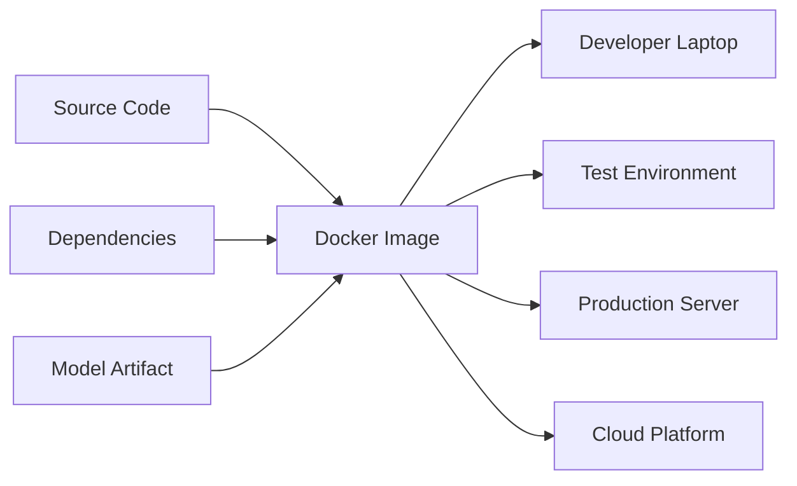

Docker helps create a consistent runtime across environments.

A useful principle is:

> Build once, run consistently in many environments.

---

## 4. The Environment Consistency Problem

Suppose a model was trained using:

```text
Python 3.12
scikit-learn 1.6
pandas 2.3
numpy 2.2
```

Another machine may have:

```text
Python 3.10
scikit-learn 1.2
pandas 1.5
numpy 1.24
```

The application may fail because:

* The serialized model is incompatible.
* A function has changed behavior.
* A dependency is missing.
* A system package is unavailable.
* The Python version is unsupported.

Docker places the application in a controlled environment.

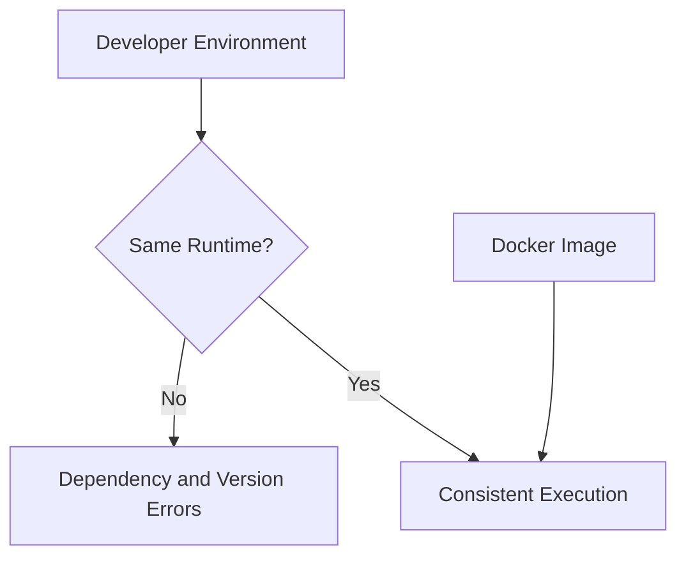

Docker does not guarantee that the application is correct, but it makes the runtime more predictable and reproducible.

---

## 5. Core Docker Concepts

### 5.1 Dockerfile

A **Dockerfile** is a text file containing instructions for building an image.

Example:

```dockerfile
FROM python:3.12-slim

WORKDIR /app

COPY requirements.txt .

RUN pip install --no-cache-dir -r requirements.txt

COPY app ./app
COPY models ./models

EXPOSE 8000

CMD ["uvicorn", "app.main:app", "--host", "0.0.0.0", "--port", "8000"]
```

Each instruction creates part of the image.

---

### 5.2 Docker Image

A Docker image is an immutable package containing:

* Runtime
* Dependencies
* Code
* Files
* Configuration defaults
* Startup instructions

You can think of an image as a reusable application template.

Example image name:

```text
churn-api:1.0.0
```

Here:

* `churn-api` is the repository or image name.
* `1.0.0` is the tag.

---

### 5.3 Docker Container

A container is a running instance of an image.

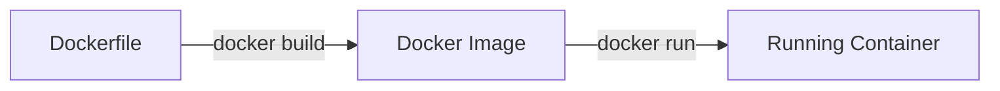

One image can create multiple containers.

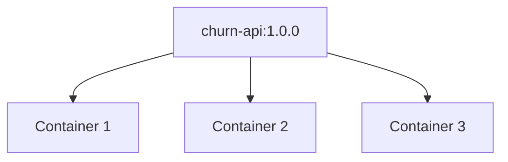

---

### 5.4 Docker Registry

A registry stores and distributes Docker images.

Examples include:

* Docker Hub
* GitHub Container Registry
* GitLab Container Registry
* Amazon Elastic Container Registry
* Google Artifact Registry
* Azure Container Registry

Typical workflow:

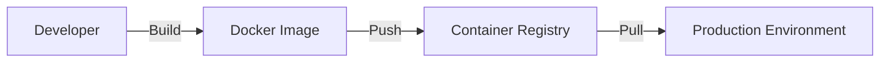

---

### 5.5 Volume

A volume stores data outside the writable container layer.

Volumes are useful for:

* Model artifacts
* Databases
* Logs
* Datasets
* Prediction outputs
* Persistent application state

Containers should generally be treated as replaceable. Important data should not exist only inside a running container.

---

### 5.6 Port Mapping

Applications inside containers listen on container ports.

To access them from the host machine, map a host port to a container port.

```bash
docker run -p 8000:8000 churn-api:1.0.0
```

The format is:

```text
HOST_PORT:CONTAINER_PORT
```

In this example:

```text
localhost:8000 → container port 8000
```

---

## 6. Containers vs. Virtual Machines

Docker containers and virtual machines solve related but different problems.

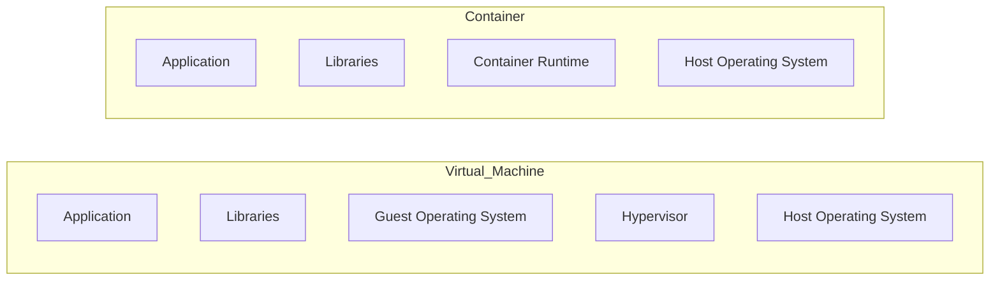

| Aspect           | Container              | Virtual Machine              |
| ---------------- | ---------------------- | ---------------------------- |
| Startup time     | Usually seconds        | Often slower                 |
| Size             | Usually MB to a few GB | Often several GB             |
| Operating system | Shares host kernel     | Includes guest OS            |
| Isolation        | Process-level          | Machine-level                |
| Portability      | High                   | High, but heavier            |
| Typical ML use   | APIs, jobs, pipelines  | Full isolated infrastructure |

Containers are lighter than virtual machines, but they are not identical to virtual machines.

---

## 7. Docker Architecture

Docker commonly includes the following components:

* Docker CLI
* Docker daemon
* Images
* Containers
* Networks
* Volumes
* Registries

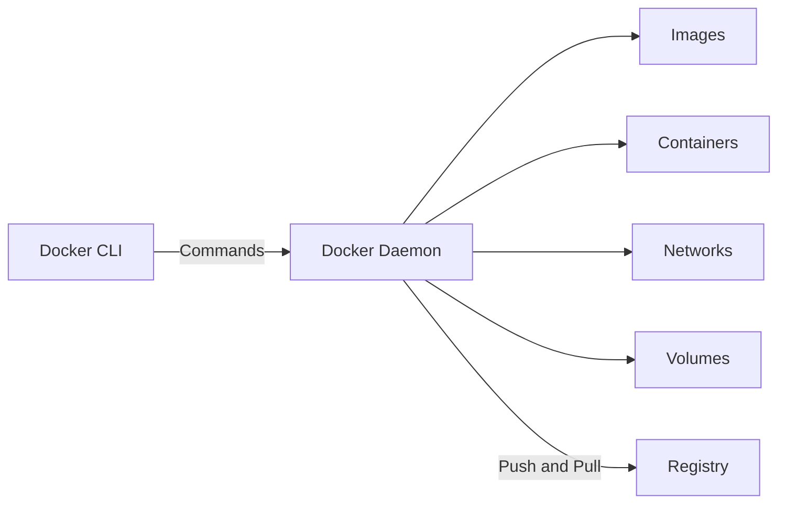

When you run:

```bash
docker build -t churn-api:1.0.0 .
```

the Docker client asks the Docker daemon to build an image from the Dockerfile and build context.

---

## 8. Understanding a Dockerfile

Consider this Dockerfile:

```dockerfile
FROM python:3.12-slim

WORKDIR /app

COPY requirements.txt .

RUN pip install --no-cache-dir -r requirements.txt

COPY app ./app
COPY models ./models

EXPOSE 8000

CMD ["uvicorn", "app.main:app", "--host", "0.0.0.0", "--port", "8000"]
```

### `FROM`

```dockerfile
FROM python:3.12-slim
```

Defines the base image.

The `slim` variant is smaller than a full Python image but still provides a practical Python runtime.

Prefer a specific version instead of:

```dockerfile
FROM python:latest
```

Specific versions improve reproducibility.

---

### `WORKDIR`

```dockerfile
WORKDIR /app
```

Sets the working directory for later commands.

Commands such as `COPY`, `RUN`, and `CMD` operate relative to this directory when appropriate.

---

### `COPY`

```dockerfile
COPY requirements.txt .
```

Copies files from the build context into the image.

Later:

```dockerfile
COPY app ./app
COPY models ./models
```

copies the application code and model artifacts.

---

### `RUN`

```dockerfile
RUN pip install --no-cache-dir -r requirements.txt
```

Runs a command while building the image.

The result becomes part of the image.

`--no-cache-dir` prevents pip from keeping unnecessary package cache files.

---

### `EXPOSE`

```dockerfile
EXPOSE 8000
```

Documents the port used by the application.

It does not automatically publish the port to the host. You still need:

```bash
docker run -p 8000:8000 churn-api:1.0.0
```

---

### `CMD`

```dockerfile
CMD ["uvicorn", "app.main:app", "--host", "0.0.0.0", "--port", "8000"]
```

Defines the default command executed when the container starts.

Use `0.0.0.0` rather than `127.0.0.1` so that the service is reachable from outside the container.

---

## 9. Build Context

The final dot in this command is important:

```bash
docker build -t churn-api:1.0.0 .
```

The dot represents the **build context**.

Docker can access files inside that directory when processing `COPY` and `ADD` instructions.

For example:

```text
model-serving-project/
├── app/
├── models/
├── requirements.txt
├── Dockerfile
└── README.md
```

If the command is run from `model-serving-project/`, Docker can copy these files into the image.

Avoid using an unnecessarily large build context because Docker must inspect and transfer it during the build.

---

## 10. The `.dockerignore` File

A `.dockerignore` file excludes unnecessary files from the build context.

Example:

```text
.git
.github
.venv
venv
__pycache__
*.pyc
*.pyo
.pytest_cache
.mypy_cache
.env
notebooks
data/raw
tests
README.md
```

Benefits include:

* Faster builds
* Smaller build context
* Lower risk of copying secrets
* Cleaner images
* Better layer caching

Do not copy local virtual environments into Docker images.

---

## 11. Basic Docker Workflow

### Step 1: Build the Image

```bash
docker build -t churn-api:1.0.0 .
```

### Step 2: List Images

```bash
docker images
```

Example output:

```text
REPOSITORY   TAG       IMAGE ID       CREATED          SIZE
churn-api    1.0.0     7a21c45f3102   20 seconds ago   420MB
```

### Step 3: Run the Container

```bash
docker run --name churn-api-container -p 8000:8000 churn-api:1.0.0
```

### Step 4: Test the Service

```bash
curl http://localhost:8000/health
```

### Step 5: List Running Containers

```bash
docker ps
```

### Step 6: Stop the Container

```bash
docker stop churn-api-container
```

### Step 7: Remove the Container

```bash
docker rm churn-api-container
```

---

## 12. Running Containers in Detached Mode

By default, the container runs in the foreground.

Use `-d` to run it in detached mode:

```bash
docker run \
  -d \
  --name churn-api-container \
  -p 8000:8000 \
  churn-api:1.0.0
```

View logs:

```bash
docker logs churn-api-container
```

Follow logs continuously:

```bash
docker logs -f churn-api-container
```

Stop and remove:

```bash
docker stop churn-api-container
docker rm churn-api-container
```

Or use:

```bash
docker rm -f churn-api-container
```

---

## 13. Packaging a FastAPI Model Service

### Suggested Project Structure

```text
model-serving-project/
├── app/
│   ├── __init__.py
│   ├── main.py
│   ├── schemas.py
│   └── inference.py
├── models/
│   └── churn_pipeline_v1.joblib
├── tests/
│   └── test_api.py
├── requirements.txt
├── Dockerfile
├── .dockerignore
└── README.md
```

---

### FastAPI Application

```python
from contextlib import asynccontextmanager
from pathlib import Path

import joblib
import numpy as np
from fastapi import FastAPI, HTTPException
from pydantic import BaseModel, Field


MODEL_PATH = Path("models/churn_pipeline_v1.joblib")
MODEL_VERSION = "1.0.0"

model = None


class PredictionRequest(BaseModel):
    age: int = Field(ge=18, le=100)
    income: float = Field(ge=0)
    account_age_months: int = Field(ge=0)


class PredictionResponse(BaseModel):
    prediction: int
    probability: float
    model_version: str


@asynccontextmanager
async def lifespan(app: FastAPI):
    global model

    if not MODEL_PATH.exists():
        raise RuntimeError(f"Model not found: {MODEL_PATH}")

    model = joblib.load(MODEL_PATH)

    yield

    model = None


app = FastAPI(
    title="Customer Churn API",
    version="1.0.0",
    lifespan=lifespan,
)


@app.get("/health")
def health_check():
    return {
        "status": "healthy",
        "model_loaded": model is not None,
        "model_version": MODEL_VERSION,
    }


@app.post("/predict", response_model=PredictionResponse)
def predict(payload: PredictionRequest):
    if model is None:
        raise HTTPException(
            status_code=503,
            detail="Model is unavailable",
        )

    try:
        features = np.array(
            [[
                payload.age,
                payload.income,
                payload.account_age_months,
            ]]
        )

        prediction = int(model.predict(features)[0])

        probability = (
            float(model.predict_proba(features)[0][1])
            if hasattr(model, "predict_proba")
            else 0.0
        )

        return PredictionResponse(
            prediction=prediction,
            probability=probability,
            model_version=MODEL_VERSION,
        )

    except Exception as exc:
        raise HTTPException(
            status_code=500,
            detail="Prediction failed",
        ) from exc
```

---

### Requirements File

```text
fastapi
uvicorn[standard]
numpy
scikit-learn
joblib
pydantic
```

For stronger reproducibility, pin exact versions:

```text
fastapi==0.116.0
uvicorn[standard]==0.35.0
numpy==2.3.1
scikit-learn==1.7.0
joblib==1.5.1
pydantic==2.11.7
```

The versions used in a real project should match the environment in which the model and service have been tested.

---

### Dockerfile

```dockerfile
FROM python:3.12-slim

ENV PYTHONDONTWRITEBYTECODE=1
ENV PYTHONUNBUFFERED=1

WORKDIR /app

COPY requirements.txt .

RUN pip install --no-cache-dir --upgrade pip \
    && pip install --no-cache-dir -r requirements.txt

COPY app ./app
COPY models ./models

EXPOSE 8000

CMD [
    "uvicorn",
    "app.main:app",
    "--host",
    "0.0.0.0",
    "--port",
    "8000"
]
```

---

### Build and Run

```bash
docker build -t churn-api:1.0.0 .
```

```bash
docker run \
  --rm \
  --name churn-api \
  -p 8000:8000 \
  churn-api:1.0.0
```

Test the health endpoint:

```bash
curl http://localhost:8000/health
```

Test prediction:

```bash
curl -X POST "http://localhost:8000/predict" \
  -H "Content-Type: application/json" \
  -d '{
    "age": 35,
    "income": 52000,
    "account_age_months": 18
  }'
```

---

## 14. Docker Layer Caching

Dockerfiles are built in layers.

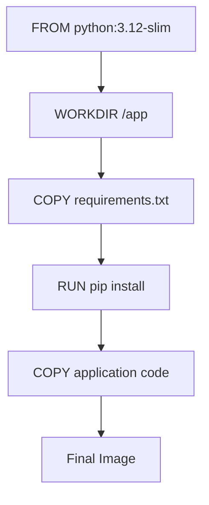

Docker can reuse unchanged layers from earlier builds.

This ordering is inefficient:

```dockerfile
COPY . .

RUN pip install --no-cache-dir -r requirements.txt
```

Every source-code change invalidates the copied layer and forces dependencies to be installed again.

A better ordering is:

```dockerfile
COPY requirements.txt .

RUN pip install --no-cache-dir -r requirements.txt

COPY app ./app
```

Now dependency installation is reused unless `requirements.txt` changes.

---

## 15. Environment Variables

Environment variables separate configuration from code.

Example application configuration:

```python
import os

MODEL_PATH = os.getenv(
    "MODEL_PATH",
    "models/churn_pipeline_v1.joblib",
)

LOG_LEVEL = os.getenv("LOG_LEVEL", "INFO")
```

Run the container with variables:

```bash
docker run \
  --rm \
  -p 8000:8000 \
  -e MODEL_PATH=models/churn_pipeline_v1.joblib \
  -e LOG_LEVEL=DEBUG \
  churn-api:1.0.0
```

You can also use an environment file:

```text
MODEL_PATH=models/churn_pipeline_v1.joblib
LOG_LEVEL=INFO
MODEL_VERSION=1.0.0
```

Run:

```bash
docker run \
  --rm \
  -p 8000:8000 \
  --env-file .env \
  churn-api:1.0.0
```

Do not copy `.env` files containing secrets into the image.

---

## 16. Managing Secrets

Secrets may include:

* Database passwords
* API keys
* Cloud credentials
* JWT signing keys
* Private registry tokens

Do not place secrets directly in a Dockerfile:

```dockerfile
ENV DATABASE_PASSWORD=my-secret-password
```

Do not copy secret files into the image:

```dockerfile
COPY .env .
```

Secrets embedded in images may remain visible in:

* Image layers
* Build cache
* Registry history
* Inspection output
* Shared artifacts

Better approaches include:

* Runtime environment variables
* Docker secrets
* Kubernetes Secrets
* Cloud secret managers
* CI/CD secret stores
* Mounted secret files

Example runtime injection:

```bash
docker run \
  -e DATABASE_PASSWORD="$DATABASE_PASSWORD" \
  churn-api:1.0.0
```

---

## 17. Volumes and Bind Mounts

### Bind Mount

A bind mount maps a host path into the container.

```bash
docker run \
  --rm \
  -p 8000:8000 \
  -v "$(pwd)/models:/app/models:ro" \
  churn-api:1.0.0
```

The `:ro` suffix makes the mounted directory read-only.

This is useful when:

* The model changes independently from the image.
* Large model files should not be embedded in the image.
* Local development requires live file access.

---

### Named Volume

Create a named volume:

```bash
docker volume create prediction-data
```

Use it:

```bash
docker run \
  --rm \
  -v prediction-data:/app/output \
  batch-predictor:1.0.0
```

Named volumes are managed by Docker.

---

### Container Data Flow

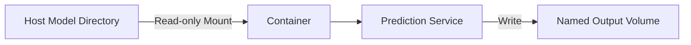

---

## 18. Container Networking

Containers can communicate through Docker networks.

Create a network:

```bash
docker network create ml-network
```

Start a database:

```bash
docker run \
  -d \
  --name prediction-db \
  --network ml-network \
  postgres:17
```

Start an API on the same network:

```bash
docker run \
  -d \
  --name model-api \
  --network ml-network \
  -p 8000:8000 \
  churn-api:1.0.0
```

Inside the network, the API can use the container name as the hostname:

```text
prediction-db
```

Do not use `localhost` to reach another container. Inside a container, `localhost` refers to that same container.

---

## 19. Docker Compose

Docker Compose defines multi-container applications in a YAML file.

It is useful when an ML application includes:

* Model API
* Database
* Redis cache
* Monitoring
* Message queue
* Worker process

Example `compose.yaml`:

```yaml
services:
  api:
    build:
      context: .
    image: churn-api:1.0.0
    ports:
      - "8000:8000"
    environment:
      MODEL_PATH: /app/models/churn_pipeline_v1.joblib
      LOG_LEVEL: INFO
    volumes:
      - ./models:/app/models:ro
    depends_on:
      - redis

  redis:
    image: redis:7-alpine
    volumes:
      - redis-data:/data

volumes:
  redis-data:
```

Start the application:

```bash
docker compose up --build
```

Run in detached mode:

```bash
docker compose up -d --build
```

View logs:

```bash
docker compose logs -f
```

Stop services:

```bash
docker compose down
```

Remove volumes as well:

```bash
docker compose down -v
```

---

## 20. Example MLOps Architecture with Docker

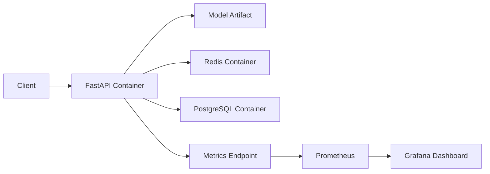

Docker can package each service separately while Docker Compose or Kubernetes coordinates them.

---

## 21. Containerizing a Batch Prediction Job

Not every model needs an API.

A batch job may read a dataset, generate predictions, and write an output file.

### Batch Script

```python
from pathlib import Path

import joblib
import pandas as pd


MODEL_PATH = Path("/app/models/model.joblib")
INPUT_PATH = Path("/app/input/customers.csv")
OUTPUT_PATH = Path("/app/output/predictions.csv")


def main() -> None:
    model = joblib.load(MODEL_PATH)
    data = pd.read_csv(INPUT_PATH)

    features = data[
        [
            "age",
            "income",
            "account_age_months",
        ]
    ]

    data["prediction"] = model.predict(features)

    OUTPUT_PATH.parent.mkdir(parents=True, exist_ok=True)
    data.to_csv(OUTPUT_PATH, index=False)


if __name__ == "__main__":
    main()
```

### Dockerfile

```dockerfile
FROM python:3.12-slim

WORKDIR /app

COPY requirements.txt .

RUN pip install --no-cache-dir -r requirements.txt

COPY scripts ./scripts

CMD ["python", "scripts/batch_predict.py"]
```

### Run with Mounted Directories

```bash
docker run \
  --rm \
  -v "$(pwd)/models:/app/models:ro" \
  -v "$(pwd)/data:/app/input:ro" \
  -v "$(pwd)/outputs:/app/output" \
  batch-predictor:1.0.0
```

This pattern separates:

* Application image
* Model artifacts
* Input data
* Prediction output

---

## 22. Image Size Optimization

Large images take longer to:

* Build
* Push
* Pull
* Start
* Scan
* Deploy

Ways to reduce image size include:

* Use a smaller base image.
* Add a `.dockerignore`.
* Avoid copying notebooks and raw datasets.
* Use `pip --no-cache-dir`.
* Remove build tools from the final image.
* Use multi-stage builds.
* Install only required dependencies.
* Avoid unnecessary package managers and utilities.
* Store very large models externally when appropriate.

Check image size:

```bash
docker images churn-api
```

Inspect layer size:

```bash
docker history churn-api:1.0.0
```

---

## 23. Multi-Stage Builds

A multi-stage build separates build dependencies from the final runtime image.

Example:

```dockerfile
FROM python:3.12-slim AS builder

WORKDIR /build

COPY requirements.txt .

RUN pip install \
    --prefix=/install \
    --no-cache-dir \
    -r requirements.txt


FROM python:3.12-slim AS runtime

ENV PYTHONDONTWRITEBYTECODE=1
ENV PYTHONUNBUFFERED=1

WORKDIR /app

COPY --from=builder /install /usr/local

COPY app ./app
COPY models ./models

EXPOSE 8000

CMD [
    "uvicorn",
    "app.main:app",
    "--host",
    "0.0.0.0",
    "--port",
    "8000"
]
```

Multi-stage builds are especially useful when packages require:

* Compilers
* Header files
* Build tools
* Temporary artifacts

The final runtime image does not need to contain all build-time tools.

---

## 24. Running as a Non-Root User

Containers often run as root by default.

For better security, create a non-root user.

```dockerfile
FROM python:3.12-slim

ENV PYTHONDONTWRITEBYTECODE=1
ENV PYTHONUNBUFFERED=1

RUN useradd \
    --create-home \
    --shell /usr/sbin/nologin \
    appuser

WORKDIR /app

COPY requirements.txt .

RUN pip install --no-cache-dir -r requirements.txt

COPY --chown=appuser:appuser app ./app
COPY --chown=appuser:appuser models ./models

USER appuser

EXPOSE 8000

CMD [
    "uvicorn",
    "app.main:app",
    "--host",
    "0.0.0.0",
    "--port",
    "8000"
]
```

This reduces the impact of some container vulnerabilities.

---

## 25. Health Checks

A container health check determines whether the application is functioning.

Dockerfile example:

```dockerfile
HEALTHCHECK \
    --interval=30s \
    --timeout=5s \
    --start-period=20s \
    --retries=3 \
    CMD python -c \
    "import urllib.request; urllib.request.urlopen('http://localhost:8000/health')"
```

Inspect status:

```bash
docker ps
```

You may see:

```text
Up 2 minutes (healthy)
```

A health check should test meaningful readiness, such as:

* The API is responding.
* The model is loaded.
* Critical dependencies are available.

Avoid expensive checks that place significant load on the service.

---

## 26. Logging in Containers

Containerized applications should usually write logs to:

* Standard output
* Standard error

Example Python logging:

```python
import logging

logging.basicConfig(
    level=logging.INFO,
    format=(
        "%(asctime)s "
        "%(levelname)s "
        "%(name)s "
        "%(message)s"
    ),
)

logger = logging.getLogger(__name__)

logger.info("Model loaded successfully")
```

View logs:

```bash
docker logs churn-api-container
```

Structured JSON logs are often easier to process in production:

```json
{
  "timestamp": "2026-07-13T10:42:11Z",
  "level": "INFO",
  "event": "prediction_completed",
  "latency_ms": 18.4,
  "model_version": "1.0.0"
}
```

Do not rely only on files inside a container for logs. The container may be removed and recreated.

---

## 27. Resource Limits

Machine learning containers can consume significant CPU and memory.

Example:

```bash
docker run \
  --rm \
  --memory=1g \
  --cpus=1.5 \
  -p 8000:8000 \
  churn-api:1.0.0
```

Resource limits help prevent one container from using all host resources.

Monitor resource usage:

```bash
docker stats
```

Important metrics include:

* CPU usage
* Memory usage
* Network input/output
* Block input/output
* Process count

For GPU workloads, the container runtime and host require compatible GPU support.

---

## 28. Docker Image Versioning

Avoid relying only on the `latest` tag.

Weak approach:

```bash
docker build -t churn-api:latest .
```

Better:

```bash
docker build -t churn-api:1.0.0 .
```

You may also tag the same image with a Git commit:

```bash
docker tag churn-api:1.0.0 churn-api:a82f19c
```

Useful tag strategies include:

* Semantic version: `1.2.0`
* Git commit: `a82f19c`
* Environment: `staging`
* Build number: `build-145`
* Release date: `2026-07-13`

Example:

```text
ghcr.io/team/churn-api:1.2.0
```

The deployed image tag should be traceable to:

* Source-code version
* Model version
* Dependency versions
* Build pipeline
* Release record

---

## 29. Publishing an Image

Tag the image for a registry:

```bash
docker tag \
  churn-api:1.0.0 \
  username/churn-api:1.0.0
```

Sign in:

```bash
docker login
```

Push:

```bash
docker push username/churn-api:1.0.0
```

Pull on another machine:

```bash
docker pull username/churn-api:1.0.0
```

Run:

```bash
docker run \
  --rm \
  -p 8000:8000 \
  username/churn-api:1.0.0
```

Use private registries for proprietary models and source code.

---

## 30. Docker in CI/CD

A CI/CD workflow may:

1. Check out source code.
2. Run tests.
3. Build the Docker image.
4. Scan the image.
5. Tag the image.
6. Push it to a registry.
7. Deploy it.
8. Run health checks.
9. Roll back if deployment fails.

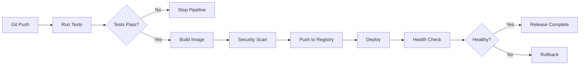

Docker creates the deployable artifact used throughout the pipeline.

---

## 31. Docker and Model Versioning

The application image and model artifact can be packaged in different ways.

### Option 1: Include the Model in the Image

```dockerfile
COPY models/model_v1.joblib ./models/model_v1.joblib
```

Advantages:

* Self-contained image
* Simple deployment
* Model and code released together
* Easy rollback

Disadvantages:

* Large image
* Rebuild required for every model update
* Slow image transfer for large models

---

### Option 2: Mount the Model at Runtime

```bash
docker run \
  -v "$(pwd)/models:/app/models:ro" \
  churn-api:1.0.0
```

Advantages:

* Model updates without rebuilding code image
* Smaller image
* Useful for local development

Disadvantages:

* Deployment must manage external files
* Greater risk of mismatched code and model versions

---

### Option 3: Download from a Model Registry

At startup, the service downloads a specific model version.

Advantages:

* Central model management
* Easier promotion between environments
* Strong version metadata

Disadvantages:

* Startup dependency on network and registry
* Credential management
* More complex readiness behavior

Whichever approach is selected, the deployed model version must be explicit and traceable.

---

## 32. Common Mistakes

### Mistake 1: Using `latest` Everywhere

The `latest` tag does not clearly identify what is deployed.

**Better approach:** Use immutable and traceable version tags.

---

### Mistake 2: Copying the Entire Project

```dockerfile
COPY . .
```

This may include:

* Raw datasets
* Git history
* Secrets
* Virtual environments
* Notebooks
* Test output
* Cache files

**Better approach:** Use `.dockerignore` and copy only required files.

---

### Mistake 3: Installing Unpinned Dependencies

```text
fastapi
scikit-learn
numpy
```

A future build may install different versions.

**Better approach:** Pin tested versions or use a lock file.

---

### Mistake 4: Loading the Model for Every Request

```python
@app.post("/predict")
def predict(payload):
    model = joblib.load("models/model.joblib")
```

This increases latency and resource use.

**Better approach:** Load the model once during application startup.

---

### Mistake 5: Binding the API to `127.0.0.1`

```bash
uvicorn app.main:app --host 127.0.0.1
```

The service may not be reachable through Docker port mapping.

**Better approach:**

```bash
uvicorn app.main:app --host 0.0.0.0
```

---

### Mistake 6: Storing Secrets in the Image

Secrets can remain in image history.

**Better approach:** Inject secrets at runtime using a secure secret manager.

---

### Mistake 7: Writing Important Data Inside the Container

The data may disappear when the container is replaced.

**Better approach:** Use volumes, databases, or object storage.

---

### Mistake 8: Running Everything as Root

This increases security risk.

**Better approach:** Run the service as a non-root user.

---

### Mistake 9: No Health Check

A running process does not always mean the model service is ready.

**Better approach:** Add readiness and liveness endpoints.

---

### Mistake 10: Ignoring Image Size

Large images slow CI/CD and deployments.

**Better approach:** Use small base images, `.dockerignore`, and multi-stage builds.

---

### Mistake 11: Packaging Development Tools in Production

Production images should not contain unnecessary:

* Notebook servers
* Debuggers
* Test datasets
* Compilers
* Editors

**Better approach:** Separate development and production images.

---

### Mistake 12: Assuming Docker Solves Reproducibility Completely

Docker does not automatically version:

* Training datasets
* Random seeds
* Model metadata
* External APIs
* Hardware behavior
* Cloud services

**Better approach:** Combine Docker with data versioning, model versioning, tests, and documented configuration.

---

## 33. Development vs. Production Dockerfiles

A development container may include:

* Source-code mounts
* Hot reload
* Test tools
* Debug dependencies

Example:

```yaml
services:
  api:
    build: .
    command:
      - uvicorn
      - app.main:app
      - --host
      - 0.0.0.0
      - --port
      - "8000"
      - --reload
    volumes:
      - ./app:/app/app
    ports:
      - "8000:8000"
```

A production container should normally avoid:

* `--reload`
* Source-code bind mounts
* Debug mode
* Development credentials
* Unnecessary tools

Production should use an immutable tested image.

---

## 34. Testing Docker Images

### Test That the Image Builds

```bash
docker build -t churn-api:test .
```

### Run the Container

```bash
docker run \
  -d \
  --name churn-api-test \
  -p 8001:8000 \
  churn-api:test
```

### Check Health

```bash
curl --fail http://localhost:8001/health
```

### Run an API Test

```bash
curl --fail \
  -X POST \
  http://localhost:8001/predict \
  -H "Content-Type: application/json" \
  -d '{
    "age": 35,
    "income": 52000,
    "account_age_months": 18
  }'
```

### Clean Up

```bash
docker rm -f churn-api-test
```

CI pipelines should verify that the built image itself works, not only that tests pass outside Docker.

---

## 35. Debugging Containers

View running containers:

```bash
docker ps
```

View all containers:

```bash
docker ps -a
```

View logs:

```bash
docker logs churn-api-container
```

Open a shell:

```bash
docker exec -it churn-api-container sh
```

Inspect configuration:

```bash
docker inspect churn-api-container
```

Check processes:

```bash
docker top churn-api-container
```

View live resource usage:

```bash
docker stats churn-api-container
```

Run an image with a temporary shell:

```bash
docker run --rm -it churn-api:1.0.0 sh
```

Common debugging questions include:

* Was the model copied to the expected path?
* Is the service listening on `0.0.0.0`?
* Is the port published correctly?
* Are environment variables present?
* Are required system libraries installed?
* Did the process exit immediately?
* Is the model compatible with the installed library versions?

---

## 36. Practical Exercise

Create a containerized model-serving project.

### Task 1: Prepare the Model Service

Create a FastAPI application with:

```text
GET /health
POST /predict
```

The prediction response should include:

* Prediction
* Confidence or probability
* Model version

---

### Task 2: Create `requirements.txt`

Include only necessary runtime dependencies.

Pin the versions that you tested.

---

### Task 3: Create a Dockerfile

The Dockerfile should:

* Use a specific Python base image.
* Set `/app` as the working directory.
* Install dependencies before copying source code.
* Copy only necessary files.
* Expose port `8000`.
* Start Uvicorn on `0.0.0.0`.
* Run as a non-root user if possible.

---

### Task 4: Add `.dockerignore`

Exclude:

* `.git`
* `.env`
* Virtual environments
* Python cache
* Raw data
* Notebooks
* Local test output

---

### Task 5: Build and Run

Build:

```bash
docker build -t ml-api:1.0.0 .
```

Run:

```bash
docker run \
  --rm \
  -p 8000:8000 \
  ml-api:1.0.0
```

---

### Task 6: Test the Endpoints

Test:

```bash
curl http://localhost:8000/health
```

Send one valid prediction request and at least two invalid requests.

---

### Task 7: Add Configuration

Move at least one setting to an environment variable, such as:

* Model path
* Log level
* Model version
* Prediction threshold

---

### Task 8: Add Documentation

The README should include:

* Project purpose
* Prerequisites
* Build command
* Run command
* Environment variables
* Health-check command
* Example prediction request
* Example response
* Stop and cleanup commands
* Known limitations

---

## 37. Suggested Mini-Project Structure

```text
docker-ml-api/
├── app/
│   ├── __init__.py
│   ├── main.py
│   ├── schemas.py
│   ├── inference.py
│   └── config.py
├── models/
│   └── model_v1.joblib
├── scripts/
│   └── train.py
├── tests/
│   ├── test_health.py
│   └── test_predict.py
├── Dockerfile
├── compose.yaml
├── requirements.txt
├── .dockerignore
├── .gitignore
└── README.md
```

---

## 38. Portfolio Mini Project

### Project: Containerized ML Model API

Build a portfolio-ready project containing:

* A trained classification or regression model
* A reusable preprocessing pipeline
* A FastAPI prediction service
* A `/health` endpoint
* A `/predict` endpoint
* Pydantic input validation
* Model-version metadata
* API tests
* A production-oriented Dockerfile
* A `.dockerignore` file
* Environment-variable configuration
* A Docker Compose file
* A detailed README

### Optional Extensions

Add one or more of the following:

* Redis prediction cache
* PostgreSQL prediction log
* Prometheus metrics
* Grafana dashboard
* Batch prediction container
* Multi-stage build
* Non-root user
* Container health check
* GitHub Actions image build
* Image security scan
* Container registry publishing
* Load testing
* Separate development and production configurations

---

## 39. Production Monitoring

A Dockerized model service should expose both container and ML metrics.

### Container Metrics

Track:

* CPU usage
* Memory usage
* Container restarts
* Container health status
* Network traffic
* Disk usage
* Startup time

### API Metrics

Track:

* Request count
* Error rate
* Latency percentiles
* Throughput
* Timeout rate
* Active requests

### Model Metrics

Track:

* Model version
* Input distributions
* Missing-value rates
* Prediction distribution
* Confidence scores
* Data drift
* Ground-truth performance

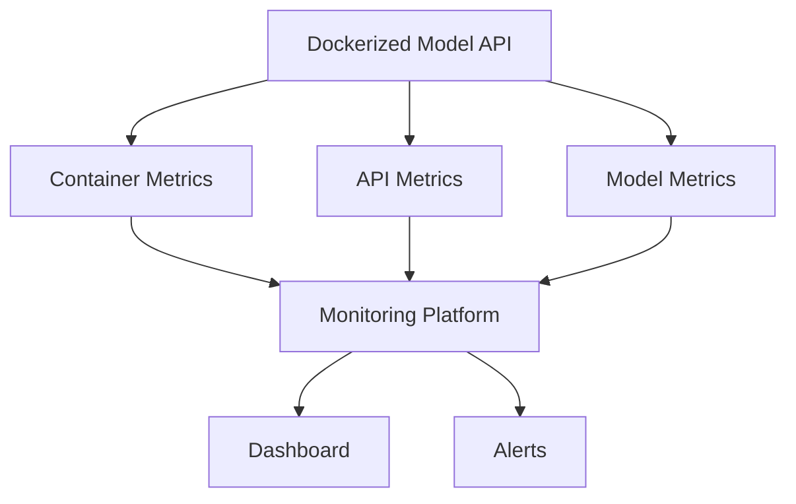

Docker makes deployment more consistent, but model monitoring remains necessary.

---

## 40. Completion Checklist

* [ ] I can explain Docker in one or two minutes.
* [ ] I understand the difference between an image and a container.
* [ ] I can explain what a Dockerfile does.
* [ ] I can build an image using `docker build`.
* [ ] I can start a container using `docker run`.
* [ ] I can map a host port to a container port.
* [ ] I can view container logs.
* [ ] I can stop and remove a container.
* [ ] I can use environment variables.
* [ ] I understand bind mounts and named volumes.
* [ ] I have created a `.dockerignore` file.
* [ ] I can package a FastAPI model service.
* [ ] I understand Docker layer caching.
* [ ] I avoid storing secrets in images.
* [ ] I use versioned image tags.
* [ ] I can explain when to include a model in an image or mount it externally.
* [ ] I know which container and model metrics to monitor.
* [ ] I have documented at least one production limitation.

---

## 41. Key Takeaways

* Docker packages code, dependencies, runtime, and configuration into a reproducible image.
* A Docker image is a template, while a container is a running instance of that image.
* Dockerfiles should be ordered to make effective use of layer caching.
* A `.dockerignore` file prevents unnecessary or sensitive files from entering the build context.
* Production images should be small, versioned, secure, and reproducible.
* Secrets should be injected at runtime rather than stored inside images.
* Persistent data should be stored in volumes, databases, or external storage.
* Docker Compose helps run multi-service ML systems locally.
* Docker improves environment consistency but does not replace model, data, and experiment versioning.
* A deployed container still requires health checks, logs, metrics, security, and drift monitoring.

---

## 42. Related Outcome

Deploy, version, monitor, and operate machine learning models using:

* FastAPI
* Docker
* Container registries
* Docker Compose
* Automated tests
* CI/CD pipelines
* Model registries
* Monitoring dashboards
* Drift-aware workflows

---

## 43. Summary

**Docker** is a foundational tool in modern MLOps because it turns an application environment into a portable, versioned artifact.

For a machine learning project, a Docker image may package:

* Prediction code
* Model dependencies
* Runtime configuration
* API endpoints
* Model artifacts
* Startup commands

A strong containerized ML project should include:

* A clear Dockerfile
* A small and appropriate base image
* Pinned dependencies
* A `.dockerignore` file
* Versioned image tags
* Runtime environment variables
* Secure secret handling
* Health checks
* Structured logs
* Resource monitoring
* A documented build and run workflow

The best way to learn Docker is to containerize a small model-serving API, run it locally, test its endpoints, and document how the same image could move through testing, staging, and production.

---

# Bài luyện tập

## Mục tiêu


## Đề bài


## Yêu cầu hoàn thành

- [ ] 
- [ ] 
- [ ] 

## Kết quả / lời giải


## Ghi chú
