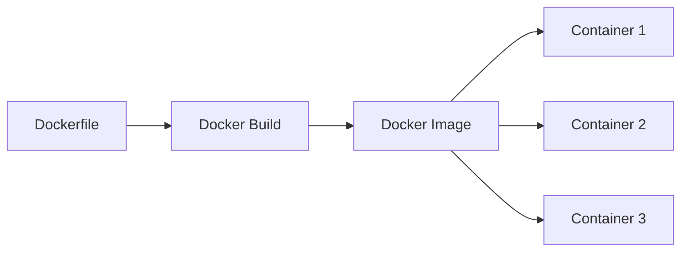
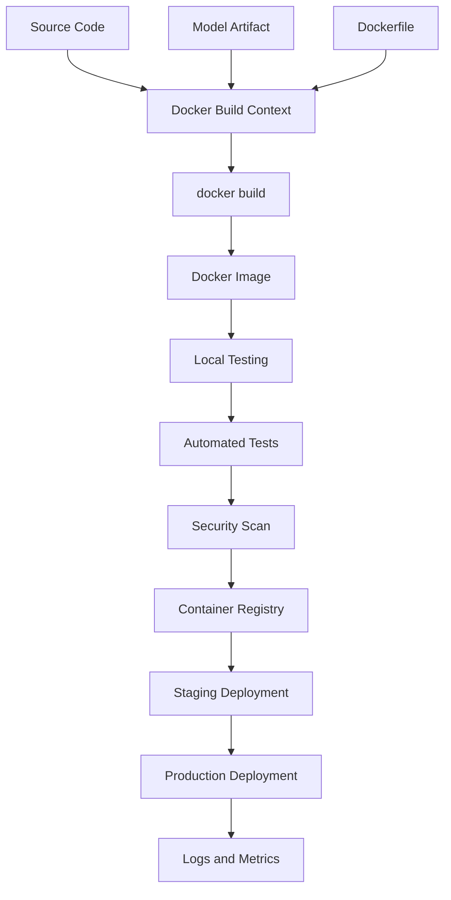
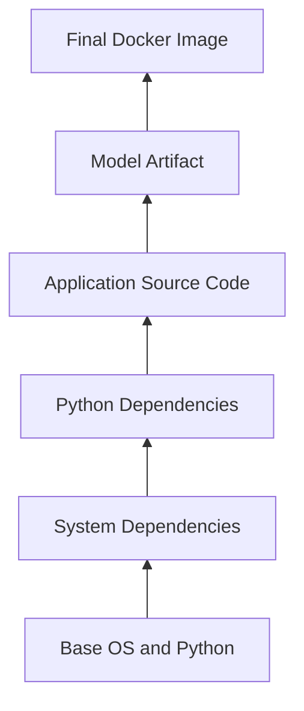
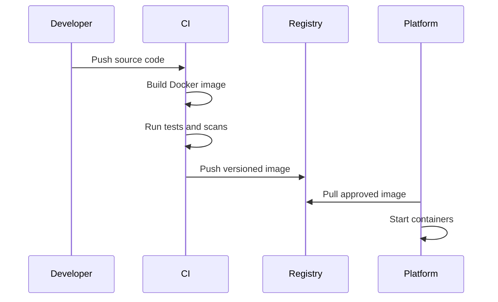

# 009 — Docker Image

## Lesson Information

| Item                   | Details                             |
| ---------------------- | ----------------------------------- |
| **Course**             | 04 — MLOps and Deployment           |
| **Module**             | Module 08 — MLOps                   |
| **Content Group**      | Docker                              |
| **Roadmap Source**     | MLOps / Docker                      |
| **Lesson Type**        | MLOps                               |
| **Order in Module**    | 009                                 |
| **Suggested Duration** | 22 minutes                          |
| **Difficulty**         | Beginner                            |
| **Main Deliverable**   | A Docker image containing an ML API |

---

## 1. Summary

This lesson explains a **Docker image** in the context of AI engineering, data science, and MLOps.

A Docker image is a packaged, immutable template that contains everything required to run an application:

* Application source code.
* Python runtime.
* System libraries.
* Python dependencies.
* Configuration defaults.
* Model artifacts.
* Startup commands.

A Docker image can be used to create one or more running containers.

```text
Dockerfile
    ↓
docker build
    ↓
Docker image
    ↓
docker run
    ↓
Running container
```

For machine learning systems, Docker images help package a model-serving application so it behaves consistently across:

* Developer laptops.
* Testing environments.
* CI/CD pipelines.
* Cloud platforms.
* Kubernetes clusters.
* Production servers.

A typical ML deployment workflow is:

```text
trained model
    ↓
FastAPI application
    ↓
Dockerfile
    ↓
Docker image
    ↓
Container registry
    ↓
Deployment platform
    ↓
Logs, metrics, and model monitoring
```

---

## 2. Learning Objectives

By the end of this lesson, you should be able to:

1. Explain what a Docker image is.
2. Distinguish between an image and a container.
3. Explain how images are created from Dockerfiles.
4. Understand image layers and build cache.
5. Build an image for a machine learning API.
6. Run a container from an image.
7. inspect, tag, and remove Docker images.
8. Push an image to a container registry.
9. Apply basic image optimization and security practices.
10. Version an ML service using immutable image tags.

---

## 3. What Is a Docker Image?

A **Docker image** is a read-only package used to create containers.

It includes the filesystem and instructions required to run an application.

For example, an ML API image may contain:

```text
Python 3.12
FastAPI
Uvicorn
scikit-learn
joblib
application code
model.joblib
environment configuration
startup command
```

The image itself is not the running application.

It becomes a running application when Docker creates a container from it.



One image can create many containers.

---

## 4. Image Versus Container

The difference between an image and a container is fundamental.

| Docker Image                    | Docker Container              |
| ------------------------------- | ----------------------------- |
| Read-only template              | Running or stopped instance   |
| Created with `docker build`     | Created with `docker run`     |
| Stored locally or in a registry | Exists on a Docker host       |
| Immutable by design             | Has a writable runtime layer  |
| Can create many containers      | Created from one image        |
| Similar to a class              | Similar to an object instance |

A simple analogy is:

```text
Image = application blueprint
Container = running application instance
```

Another analogy:

```text
Image = recipe
Container = prepared meal
```

In MLOps:

```text
Docker image:
ML code + model + dependencies + runtime

Container:
A running prediction service created from that image
```

---

## 5. Why Docker Images Matter in MLOps

Machine learning projects commonly fail outside notebooks because of differences in:

* Python versions.
* Package versions.
* Operating-system libraries.
* Environment variables.
* File paths.
* Model artifact locations.
* Startup commands.
* CPU architecture.

Docker images reduce these differences by packaging the runtime environment.

Without Docker:

```text
Developer environment
Python 3.10
scikit-learn 1.x
Custom system libraries
        ↓
Production environment
Python 3.12
Different package versions
Missing library
        ↓
Application fails
```

With Docker:

```text
Developer
    ↓
Build image
    ↓
Test the exact image
    ↓
Deploy the same image
    ↓
Consistent runtime
```

This supports the MLOps principle:

> Build once, test once, and promote the same immutable artifact across environments.

---

## 6. Docker Image Workflow



The image should normally be built once and promoted through the deployment pipeline.

A weaker workflow is:

```text
Build separately in development
Build again in staging
Build again in production
```

Separate builds may produce different results.

A stronger workflow is:

```text
Build once
    ↓
Test image
    ↓
Push image
    ↓
Deploy the same image to staging
    ↓
Deploy the same image to production
```

---

## 7. Dockerfile and Docker Image

A Docker image is usually created from a file named `Dockerfile`.

Example:

```dockerfile
FROM python:3.12-slim

WORKDIR /app

COPY requirements.txt .

RUN pip install --no-cache-dir -r requirements.txt

COPY app ./app
COPY artifacts ./artifacts

EXPOSE 8000

CMD [
    "uvicorn",
    "app.main:app",
    "--host",
    "0.0.0.0",
    "--port",
    "8000"
]
```

Build the image:

```bash
docker build -t ml-api:1.0.0 .
```

The command contains:

```text
docker build
│
├── -t ml-api:1.0.0
│       ├── repository name: ml-api
│       └── tag: 1.0.0
│
└── .
    └── current directory is the build context
```

---

## 8. Main Dockerfile Instructions

### 8.1 `FROM`

```dockerfile
FROM python:3.12-slim
```

`FROM` selects the base image.

The base image may provide:

* Operating-system files.
* Python runtime.
* Package-management tools.
* Standard system libraries.

For Python ML services, common choices include:

```text
python:3.12
python:3.12-slim
python:3.12-alpine
```

A slim image is often a useful balance between compatibility and image size.

Alpine-based images can be smaller, but Python scientific packages may require additional compilation steps or system dependencies.

---

### 8.2 `WORKDIR`

```dockerfile
WORKDIR /app
```

`WORKDIR` sets the working directory for later instructions.

After this instruction:

```dockerfile
COPY requirements.txt .
```

copies the file to:

```text
/app/requirements.txt
```

---

### 8.3 `COPY`

```dockerfile
COPY app ./app
COPY artifacts ./artifacts
```

`COPY` transfers files from the build context into the image.

For an ML service, copied files may include:

* API source code.
* Model artifacts.
* Configuration files.
* Dependency files.
* Utility modules.

Do not copy unnecessary files such as:

* Virtual environments.
* Git history.
* Large notebooks.
* Raw datasets.
* Test caches.
* Secret files.

---

### 8.4 `RUN`

```dockerfile
RUN pip install --no-cache-dir -r requirements.txt
```

`RUN` executes a command while building the image.

It creates a new image layer.

Common uses include:

* Installing Python dependencies.
* Installing system packages.
* Compiling application code.
* Creating directories.
* Removing temporary files.

`RUN` is executed during image build, not container startup.

---

### 8.5 `ENV`

```dockerfile
ENV PYTHONDONTWRITEBYTECODE=1
ENV PYTHONUNBUFFERED=1
```

`ENV` defines environment variables inside the image.

These examples:

* Prevent unnecessary Python bytecode files.
* Make Python logs appear immediately.

Environment-specific secrets should normally be injected at runtime rather than stored permanently in the image.

---

### 8.6 `EXPOSE`

```dockerfile
EXPOSE 8000
```

`EXPOSE` documents the port expected by the application.

It does not automatically publish the port to the host machine.

The port is published when running the container:

```bash
docker run -p 8000:8000 ml-api:1.0.0
```

---

### 8.7 `CMD`

```dockerfile
CMD [
    "uvicorn",
    "app.main:app",
    "--host",
    "0.0.0.0",
    "--port",
    "8000"
]
```

`CMD` defines the default command executed when a container starts.

The command can be overridden:

```bash
docker run ml-api:1.0.0 python -m pytest
```

---

### 8.8 `ENTRYPOINT`

`ENTRYPOINT` can define a fixed executable for the image.

Example:

```dockerfile
ENTRYPOINT ["python", "-m"]
CMD ["app.main"]
```

For beginner ML APIs, using `CMD` alone is often sufficient.

---

## 9. Image Layers

Docker images are composed of layers.

Each relevant Dockerfile instruction creates a new layer.



Example:

```dockerfile
FROM python:3.12-slim
COPY requirements.txt .
RUN pip install -r requirements.txt
COPY app ./app
COPY model.joblib ./model.joblib
```

Possible layer structure:

```text
Layer 1: Python base image
Layer 2: requirements.txt
Layer 3: installed Python packages
Layer 4: application code
Layer 5: model artifact
```

Layers support:

* Reuse.
* Build caching.
* Faster rebuilds.
* Efficient storage.
* Efficient registry transfers.

---

## 10. Build Cache

Docker may reuse unchanged layers from previous builds.

Consider this Dockerfile:

```dockerfile
FROM python:3.12-slim

WORKDIR /app

COPY requirements.txt .

RUN pip install --no-cache-dir -r requirements.txt

COPY app ./app
```

When application code changes but `requirements.txt` stays the same, Docker may reuse the dependency-installation layer.

This is faster than reinstalling all dependencies.

A less efficient Dockerfile is:

```dockerfile
FROM python:3.12-slim

WORKDIR /app

COPY . .

RUN pip install --no-cache-dir -r requirements.txt
```

Any source-code change can invalidate the `COPY . .` layer and force dependency installation again.

A better ordering is:

```text
Copy dependency file
    ↓
Install dependencies
    ↓
Copy frequently changing source code
```

---

## 11. Build Context

The build context is the set of files available to Docker during a build.

In this command:

```bash
docker build -t ml-api:1.0.0 .
```

the final dot means:

```text
Use the current directory as the build context.
```

Docker may send the entire context to the build engine.

A large context can make builds slower.

Common unwanted files include:

```text
.git/
.venv/
datasets/
notebooks/
__pycache__/
model checkpoints/
temporary files/
```

Use `.dockerignore` to exclude them.

Example:

```text
.git
.github
.venv
__pycache__
.pytest_cache
*.pyc
*.pyo
*.log
notebooks
datasets
tests
.env
```

Never rely only on `.dockerignore` for secret management. Secrets should not be stored in the project directory or committed to version control.

---

## 12. Practical Demo: Build an ML API Image

### 12.1 Project Structure

```text
ml-api/
├── app/
│   ├── __init__.py
│   └── main.py
├── artifacts/
│   └── model.joblib
├── requirements.txt
├── Dockerfile
├── .dockerignore
└── README.md
```

---

### 12.2 FastAPI Application

Create `app/main.py`:

```python
from pathlib import Path

import joblib
from fastapi import FastAPI
from pydantic import BaseModel


MODEL_PATH = Path("artifacts/model.joblib")

app = FastAPI(
    title="ML Prediction API",
    version="1.0.0",
)

model = joblib.load(MODEL_PATH)


class PredictionRequest(BaseModel):
    feature_1: float
    feature_2: float
    feature_3: float
    feature_4: float


class PredictionResponse(BaseModel):
    prediction: int
    model_version: str


@app.get("/health")
def health() -> dict[str, str]:
    return {
        "status": "healthy",
        "model_version": "1.0.0",
    }


@app.post(
    "/predict",
    response_model=PredictionResponse,
)
def predict(
    payload: PredictionRequest,
) -> PredictionResponse:
    features = [[
        payload.feature_1,
        payload.feature_2,
        payload.feature_3,
        payload.feature_4,
    ]]

    prediction = int(model.predict(features)[0])

    return PredictionResponse(
        prediction=prediction,
        model_version="1.0.0",
    )
```

For a production service, the model should usually be loaded through application startup or lifespan logic with proper error handling.

---

### 12.3 Requirements File

Create `requirements.txt`:

```text
fastapi
uvicorn[standard]
scikit-learn
joblib
```

A production project should use tested, pinned dependency versions.

Example:

```text
fastapi==0.x.x
uvicorn[standard]==0.x.x
scikit-learn==1.x.x
joblib==1.x.x
```

The exact versions should come from the project’s tested environment.

---

### 12.4 Dockerfile

```dockerfile
FROM python:3.12-slim

ENV PYTHONDONTWRITEBYTECODE=1
ENV PYTHONUNBUFFERED=1

WORKDIR /service

COPY requirements.txt .

RUN pip install \
    --no-cache-dir \
    --upgrade pip \
    && pip install \
    --no-cache-dir \
    -r requirements.txt

COPY app ./app
COPY artifacts ./artifacts

EXPOSE 8000

CMD [
    "uvicorn",
    "app.main:app",
    "--host",
    "0.0.0.0",
    "--port",
    "8000"
]
```

---

### 12.5 Build the Image

```bash
docker build -t ml-api:1.0.0 .
```

Possible output:

```text
Step 1/8 : FROM python:3.12-slim
Step 2/8 : ENV PYTHONDONTWRITEBYTECODE=1
Step 3/8 : ENV PYTHONUNBUFFERED=1
Step 4/8 : WORKDIR /service
Step 5/8 : COPY requirements.txt .
Step 6/8 : RUN pip install ...
Step 7/8 : COPY app ./app
Step 8/8 : CMD [...]
Successfully tagged ml-api:1.0.0
```

---

### 12.6 List Local Images

```bash
docker image ls
```

Example:

```text
REPOSITORY   TAG       IMAGE ID       CREATED          SIZE
ml-api       1.0.0     3c81a2f91abc   20 seconds ago   310MB
python       3.12-slim 8a17b4e51def   2 weeks ago      130MB
```

Important fields:

| Field      | Meaning                |
| ---------- | ---------------------- |
| Repository | Image name             |
| Tag        | Human-readable version |
| Image ID   | Local image identifier |
| Created    | Build time             |
| Size       | Total image size       |

---

### 12.7 Run a Container

```bash
docker run \
  --name ml-api-container \
  -p 8000:8000 \
  ml-api:1.0.0
```

The port mapping means:

```text
Host port 8000
       ↓
Container port 8000
```

Test the health endpoint:

```bash
curl http://localhost:8000/health
```

Example response:

```json
{
  "status": "healthy",
  "model_version": "1.0.0"
}
```

---

### 12.8 Run in Detached Mode

```bash
docker run \
  --detach \
  --name ml-api-container \
  --publish 8000:8000 \
  ml-api:1.0.0
```

View logs:

```bash
docker logs ml-api-container
```

Follow logs continuously:

```bash
docker logs -f ml-api-container
```

Stop the container:

```bash
docker stop ml-api-container
```

Remove the container:

```bash
docker rm ml-api-container
```

---

## 13. Inspect a Docker Image

Inspect image metadata:

```bash
docker image inspect ml-api:1.0.0
```

The output may include:

* Image ID.
* Creation time.
* Architecture.
* Environment variables.
* Entrypoint.
* Command.
* Exposed ports.
* Filesystem layers.
* Labels.

Inspect the image history:

```bash
docker history ml-api:1.0.0
```

This helps identify:

* Large layers.
* Build commands.
* Accidental file copies.
* Optimization opportunities.

---

## 14. Image Names and Tags

An image reference may contain:

```text
registry/repository:tag
```

Example:

```text
docker.io/khanh/ml-api:1.0.0
```

Components:

```text
docker.io
    └── registry

khanh/ml-api
    └── repository

1.0.0
    └── tag
```

Common tags include:

```text
ml-api:1.0.0
ml-api:1.1.0
ml-api:staging
ml-api:production
ml-api:latest
ml-api:git-a8f37c2
```

---

## 15. Avoid Depending Only on `latest`

The `latest` tag is only a tag name. It does not guarantee that the image is recent, correct, tested, or stable.

A weak production reference is:

```text
ml-api:latest
```

A better reference is:

```text
ml-api:1.4.2
```

An even more traceable reference may include a commit identifier:

```text
ml-api:git-a8f37c2
```

Production deployments should use immutable, traceable references.

Example mapping:

```text
Git commit: a8f37c2
Model version: churn-model-2.1.0
Image tag: ml-api:a8f37c2
Deployment: production-2026-07-13
```

---

## 16. Image Digest

Tags can be changed to point to another image.

A digest identifies exact image content.

Example:

```text
ml-api@sha256:4d7a...
```

A digest is useful for:

* Reproducibility.
* Supply-chain security.
* Exact rollback.
* Deployment verification.
* Preventing tag ambiguity.

```text
Tag
    ↓
Human-readable reference

Digest
    ↓
Content-addressed immutable reference
```

---

## 17. Tag an Image

Create an additional tag:

```bash
docker tag \
  ml-api:1.0.0 \
  username/ml-api:1.0.0
```

List images:

```bash
docker image ls
```

Both tags may point to the same image ID.

```text
REPOSITORY        TAG       IMAGE ID
ml-api            1.0.0     3c81a2f91abc
username/ml-api   1.0.0     3c81a2f91abc
```

The image data is not duplicated just because another tag exists.

---

## 18. Container Registry

A container registry stores and distributes Docker images.

Common registry types include:

* Public registries.
* Private company registries.
* Cloud provider registries.
* Self-hosted registries.

Registry workflow:



Push an image:

```bash
docker push username/ml-api:1.0.0
```

Pull an image:

```bash
docker pull username/ml-api:1.0.0
```

Run the pulled image:

```bash
docker run -p 8000:8000 username/ml-api:1.0.0
```

---

## 19. Image Versioning for ML Systems

An ML deployment contains multiple independently versioned artifacts.

```text
Source-code version
Model version
Dataset version
Feature version
Dependency version
Docker image version
Configuration version
```

A recommended metadata record may contain:

```json
{
  "service_name": "fraud-prediction-api",
  "image_tag": "2.4.1",
  "git_commit": "a8f37c2",
  "model_version": "fraud-model-7",
  "feature_schema_version": "3",
  "training_dataset_version": "2026-07-01",
  "python_version": "3.12"
}
```

This information supports:

* Reproducibility.
* Debugging.
* Incident analysis.
* Rollback.
* Auditing.
* Model governance.

---

## 20. Should the Model Be Inside the Image?

There are two common strategies.

### Strategy A: Package the model inside the image

```text
Docker image
├── API code
├── dependencies
└── model artifact
```

Advantages:

* Self-contained deployment.
* Easy reproducibility.
* Simple startup.
* Code and model can be versioned together.
* Easy rollback.

Disadvantages:

* Large image size.
* New image required for each model update.
* Slow build and transfer for large models.
* Multiple services may duplicate the same artifact.

This strategy works well for small and medium models.

---

### Strategy B: Download the model at startup

```text
Docker image
├── API code
└── dependencies

Container startup
    ↓
Model registry or object storage
    ↓
Download model
```

Advantages:

* Smaller application image.
* Model can be updated independently.
* Better for very large models.
* Central model storage.

Disadvantages:

* Startup depends on network and external storage.
* Additional authentication is required.
* Artifact integrity must be verified.
* Runtime version compatibility becomes more complex.
* Startup may be slow.

The best strategy depends on:

* Model size.
* Update frequency.
* Deployment platform.
* Security requirements.
* Startup-time limits.
* Rollback design.

---

## 21. Reducing Image Size

Large images:

* Take longer to build.
* Take longer to upload and download.
* Use more registry storage.
* Increase deployment startup time.
* May contain more unnecessary packages.

### Use a smaller base image

```dockerfile
FROM python:3.12-slim
```

instead of a full operating-system image when compatible.

---

### Exclude unnecessary files

Use `.dockerignore`.

```text
datasets
notebooks
.venv
.git
tests
*.log
```

---

### Avoid package caches

```dockerfile
RUN pip install --no-cache-dir -r requirements.txt
```

---

### Remove temporary operating-system files

```dockerfile
RUN apt-get update \
    && apt-get install -y --no-install-recommends \
        build-essential \
    && rm -rf /var/lib/apt/lists/*
```

---

### Use multi-stage builds

```dockerfile
FROM python:3.12-slim AS builder

WORKDIR /build

COPY requirements.txt .

RUN pip wheel \
    --no-cache-dir \
    --wheel-dir /wheels \
    -r requirements.txt


FROM python:3.12-slim

WORKDIR /app

COPY --from=builder /wheels /wheels
COPY requirements.txt .

RUN pip install \
    --no-cache-dir \
    --no-index \
    --find-links=/wheels \
    -r requirements.txt \
    && rm -rf /wheels

COPY app ./app
COPY artifacts ./artifacts

CMD [
    "uvicorn",
    "app.main:app",
    "--host",
    "0.0.0.0",
    "--port",
    "8000"
]
```

Multi-stage builds allow temporary build tools to remain outside the final runtime image.

---

## 22. Image Security

A Docker image can contain vulnerabilities or sensitive information.

Basic practices include:

* Use trusted base images.
* Pin important versions.
* Scan images for vulnerabilities.
* Remove unnecessary tools.
* Run as a non-root user.
* Do not store secrets in the image.
* Keep base images updated.
* Use a minimal runtime.
* Sign or verify release artifacts.
* Record a software bill of materials when required.

---

### Do Not Store Secrets in the Image

Bad:

```dockerfile
ENV DATABASE_PASSWORD=my-secret-password
ENV API_KEY=abc123
```

Bad:

```dockerfile
COPY .env .env
```

Even if a secret is removed in a later layer, it may still remain recoverable from earlier image layers.

Secrets should be injected at runtime:

```bash
docker run \
  -e API_KEY="$API_KEY" \
  ml-api:1.0.0
```

Production platforms should use dedicated secret-management systems.

---

### Run as a Non-Root User

Example:

```dockerfile
FROM python:3.12-slim

RUN addgroup --system appgroup \
    && adduser --system --ingroup appgroup appuser

WORKDIR /service

COPY requirements.txt .

RUN pip install \
    --no-cache-dir \
    -r requirements.txt

COPY app ./app
COPY artifacts ./artifacts

RUN chown -R appuser:appgroup /service

USER appuser

CMD [
    "uvicorn",
    "app.main:app",
    "--host",
    "0.0.0.0",
    "--port",
    "8000"
]
```

Running as a non-root user reduces the impact of some security failures.

---

## 23. CPU Architecture

Docker images may be built for different processor architectures.

Common architectures include:

```text
linux/amd64
linux/arm64
```

A developer may build on an ARM-based laptop while production uses AMD64 servers.

Build for a specific platform:

```bash
docker build \
  --platform linux/amd64 \
  -t ml-api:1.0.0 \
  .
```

Multi-platform images can contain variants for several architectures.

Architecture compatibility is especially important for:

* NumPy.
* PyTorch.
* TensorFlow.
* Native extensions.
* GPU libraries.
* Specialized inference runtimes.

---

## 24. CPU and GPU Images

### CPU image

```dockerfile
FROM python:3.12-slim
```

Suitable for:

* Small scikit-learn models.
* Lightweight NLP models.
* Traditional machine learning.
* Low-throughput inference.
* CPU-optimized runtimes.

### GPU image

A GPU image may require:

* CUDA runtime.
* GPU-compatible framework versions.
* Host GPU drivers.
* Container runtime support.
* Larger image layers.

```text
Host GPU driver
    ↓
GPU container runtime
    ↓
CUDA-enabled image
    ↓
PyTorch or TensorFlow
    ↓
Model inference
```

A GPU container does not automatically work simply because the image includes a deep-learning framework.

The host platform must also provide compatible GPU infrastructure.

---

## 25. Testing Docker Images

A successful build does not prove that the application works.

An image should be tested after it is built.

### Start the container

```bash
docker run \
  --detach \
  --name ml-api-test \
  --publish 8000:8000 \
  ml-api:1.0.0
```

### Test the health endpoint

```bash
curl --fail http://localhost:8000/health
```

### Test prediction

```bash
curl -X POST \
  http://localhost:8000/predict \
  -H "Content-Type: application/json" \
  -d '{
    "feature_1": 5.1,
    "feature_2": 3.5,
    "feature_3": 1.4,
    "feature_4": 0.2
  }'
```

### Inspect logs

```bash
docker logs ml-api-test
```

### Clean up

```bash
docker stop ml-api-test
docker rm ml-api-test
```

---

## 26. Docker Image in CI/CD

A basic CI/CD pipeline may follow this structure:

```mermaid
flowchart LR
    A[Push Code] --> B[Run Unit Tests]
    B --> C[Build Docker Image]
    C --> D[Run Container Tests]
    D --> E[Scan Image]
    E --> F[Push Versioned Image]
    F --> G[Deploy to Staging]
    G --> H[Run Smoke Tests]
    H --> I[Approve Production]
    I --> J[Deploy Same Image]
    J --> K[Monitor]
```



Important principle:

> The image deployed to production should be the same image that passed testing.

Do not rebuild the application after approval unless the rebuilt artifact is tested again.

---

## 27. Rollback with Images

Docker images support predictable rollback when old versions remain available.

```text
Production image: ml-api:2.0.0
        ↓
Error rate increases
        ↓
Rollback
        ↓
Previous image: ml-api:1.9.3
```

Example:

```bash
docker stop ml-api-production
docker rm ml-api-production

docker run \
  --detach \
  --name ml-api-production \
  --publish 8000:8000 \
  ml-api:1.9.3
```

A real production platform would normally manage this through a deployment controller or orchestration system.

Rollback also depends on:

* Model compatibility.
* API compatibility.
* Feature-schema compatibility.
* Database compatibility.
* Configuration compatibility.

An old image may not work if the surrounding system has changed incompatibly.

---

## 28. Image Labels

Docker labels add metadata to an image.

Example:

```dockerfile
LABEL org.opencontainers.image.title="ML Prediction API"
LABEL org.opencontainers.image.version="1.0.0"
LABEL org.opencontainers.image.revision="a8f37c2"
LABEL ml.model.version="churn-model-2.1.0"
```

Labels can help record:

* Project name.
* Image version.
* Source repository.
* Git commit.
* Build date.
* Model version.
* Maintainer.
* License.

Inspect labels:

```bash
docker image inspect ml-api:1.0.0
```

---

## 29. Common Mistakes

### Mistake 1: Confusing images with containers

An image is the package. A container is a running instance.

**Better approach:** learn the build-run relationship:

```text
Dockerfile → Image → Container
```

---

### Mistake 2: Using only `latest`

The tag does not uniquely identify a release.

**Better approach:** use semantic versions, commit tags, or digests.

---

### Mistake 3: Copying the entire project

```dockerfile
COPY . .
```

This may include:

* Datasets.
* Secrets.
* Virtual environments.
* Git history.
* Notebook outputs.
* Temporary files.

**Better approach:** copy only required files and maintain `.dockerignore`.

---

### Mistake 4: Including secrets

Secrets can remain in image history.

**Better approach:** inject secrets at runtime using a secret-management system.

---

### Mistake 5: Reinstalling dependencies on every build

Poor instruction ordering invalidates the dependency layer.

**Better approach:** copy dependency files before application source code.

---

### Mistake 6: Not pinning dependencies

A later build may install incompatible package versions.

**Better approach:** use tested lock files or pinned dependencies.

---

### Mistake 7: Running as root

Containers often run as root by default.

**Better approach:** create and use a dedicated non-root user.

---

### Mistake 8: Packaging raw training data

Raw datasets can make images huge and introduce privacy risk.

**Better approach:** include only runtime artifacts.

---

### Mistake 9: No health check

The container may be running while the model failed to load.

**Better approach:** expose a readiness endpoint that confirms required resources are available.

---

### Mistake 10: Building separately for every environment

Different builds can produce different artifacts.

**Better approach:** build once and promote the same image.

---

### Mistake 11: Ignoring architecture compatibility

An ARM image may not run correctly on an AMD64 host.

**Better approach:** define the target platform and test it.

---

### Mistake 12: Assuming smaller is always better

Extremely small images may create compatibility problems or require complex builds.

**Better approach:** optimize for security, compatibility, speed, and maintainability rather than size alone.

---

## 30. Practical Exercises

### Exercise 1: Build a Basic Image

Create a Docker image for a Python script that prints:

```text
Hello from an MLOps container
```

Requirements:

* Use a Python base image.
* Copy the script.
* Run the script with `CMD`.
* Tag the image as `ml-hello:1.0.0`.

---

### Exercise 2: Containerize an ML API

Create an image containing:

* FastAPI application.
* `/health` endpoint.
* `/predict` endpoint.
* Saved model artifact.
* Python dependencies.

Build and run it locally.

---

### Exercise 3: Add `.dockerignore`

Exclude:

```text
.git
.venv
notebooks
datasets
__pycache__
.env
```

Compare build-context size before and after.

---

### Exercise 4: Inspect Layers

Run:

```bash
docker history your-image:tag
```

Identify:

* The largest layer.
* Which Dockerfile instruction created it.
* One possible optimization.

---

### Exercise 5: Version the Image

Create these tags:

```text
ml-api:1.0.0
ml-api:git-<commit>
```

Document how both tags relate to:

* Git commit.
* Model version.
* Dataset version.

---

### Exercise 6: Add Security Improvements

Update the Dockerfile to:

* Run as a non-root user.
* Avoid copying secrets.
* Use a slim base image.
* Use `--no-cache-dir`.
* Add image labels.

---

### Exercise 7: Create a Rollback Plan

Document:

* Current image tag.
* Previous stable image tag.
* Rollback trigger.
* Rollback command.
* Post-rollback validation steps.

---

## 31. Mini Project

### Project: Package an ML Prediction Service as a Docker Image

Build a complete ML service using the following workflow:

```text
Dataset
    ↓
Training script
    ↓
Saved model artifact
    ↓
FastAPI application
    ↓
Dockerfile
    ↓
Versioned Docker image
    ↓
Container test
    ↓
README documentation
```

### Minimum Requirements

* Reproducible model-training script.
* Saved model artifact.
* FastAPI `/predict` endpoint.
* FastAPI `/health` endpoint.
* `requirements.txt`.
* Dockerfile.
* `.dockerignore`.
* Versioned image tag.
* Example `docker build` command.
* Example `docker run` command.
* Example prediction request.
* Model version in the response.
* Basic rollback plan.

### Recommended Additions

* Non-root user.
* Multi-stage build.
* Automated API tests.
* Container smoke tests.
* Image vulnerability scan.
* CI/CD workflow.
* Image labels.
* Commit-based tag.
* Registry publishing.
* Architecture diagram.
* Monitoring plan.

---

## 32. Suggested README Structure

```markdown
# ML Prediction Service

## Overview

## Problem Statement

## Dataset

## Model

## Evaluation Results

## Architecture

## Project Structure

## Requirements

## Train the Model

## Build the Docker Image

## Run the Container

## API Endpoints

## Example Prediction Request

## Example Prediction Response

## Run Tests

## Image Versioning

## Security Notes

## Monitoring Plan

## Rollback Plan

## Limitations

## Future Improvements
```

---

## 33. Completion Checklist

### Understanding

* [ ] I can explain a Docker image in one or two minutes.
* [ ] I understand the difference between an image and a container.
* [ ] I understand how a Dockerfile creates an image.
* [ ] I understand image layers.
* [ ] I understand Docker build cache.
* [ ] I understand image tags and digests.

### Implementation

* [ ] I created a Dockerfile.
* [ ] I built a Docker image.
* [ ] I listed local images.
* [ ] I ran a container from my image.
* [ ] I mapped a host port to a container port.
* [ ] I tested the health endpoint.
* [ ] I inspected image metadata.
* [ ] I added a `.dockerignore` file.

### MLOps Readiness

* [ ] I used a versioned image tag.
* [ ] I recorded the model version.
* [ ] I avoided storing secrets in the image.
* [ ] I considered running as a non-root user.
* [ ] I documented how to push the image to a registry.
* [ ] I documented a rollback strategy.
* [ ] I identified at least one image optimization.
* [ ] I documented at least one caveat or assumption.

---

## 34. Related Outcome

After completing this lesson, you should be closer to the following outcome:

> Deploy, version, monitor, and operate machine learning models using APIs, Docker images, containers, CI/CD pipelines, and drift-aware production workflows.

---

## 35. Key Takeaways

1. A Docker image is an immutable template used to create containers.
2. A container is a running instance of an image.
3. A Dockerfile defines how an image is built.
4. Image layers enable caching and efficient reuse.
5. Docker images make ML runtime environments more reproducible.
6. Versioned tags connect deployments to specific releases.
7. Digests identify exact image content.
8. Secrets should never be permanently stored inside images.
9. Production images should be tested, scanned, and traceable.
10. The same tested image should be promoted across environments.
11. Model, code, dependencies, and image versions should be recorded together.
12. A previous stable image is an important part of the rollback strategy.

---

## 36. Final Summary

A Docker image packages an application and its runtime dependencies into a reusable deployment artifact.

For an ML service, the image may contain:

```text
Python runtime
    +
ML dependencies
    +
API source code
    +
preprocessing logic
    +
model artifact
    +
startup command
```

The complete workflow is:

```text
Train model
    ↓
Save model artifact
    ↓
Create FastAPI service
    ↓
Write Dockerfile
    ↓
Build versioned image
    ↓
Test container
    ↓
Push image to registry
    ↓
Deploy the same image
    ↓
Monitor service and model
    ↓
Rollback to a previous image when necessary
```

A strong portfolio artifact for this lesson should include:

> A versioned Docker image for a tested ML API, together with a Dockerfile, `.dockerignore`, sample requests, deployment commands, model metadata, monitoring notes, and a rollback plan.
