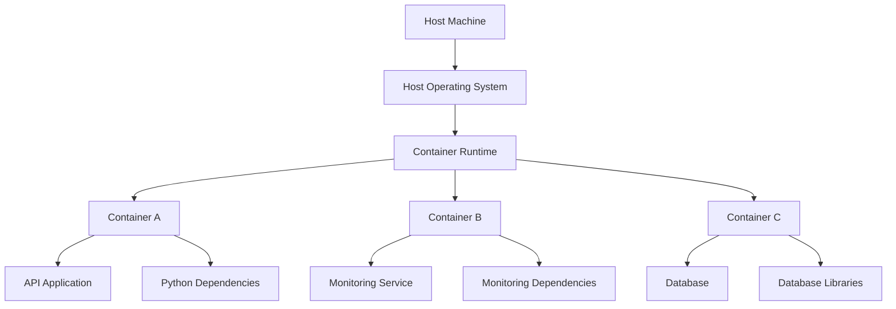
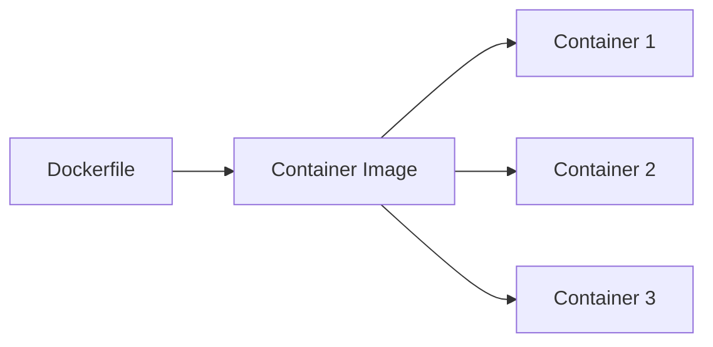
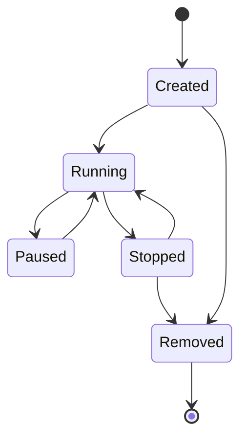
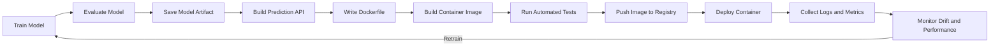
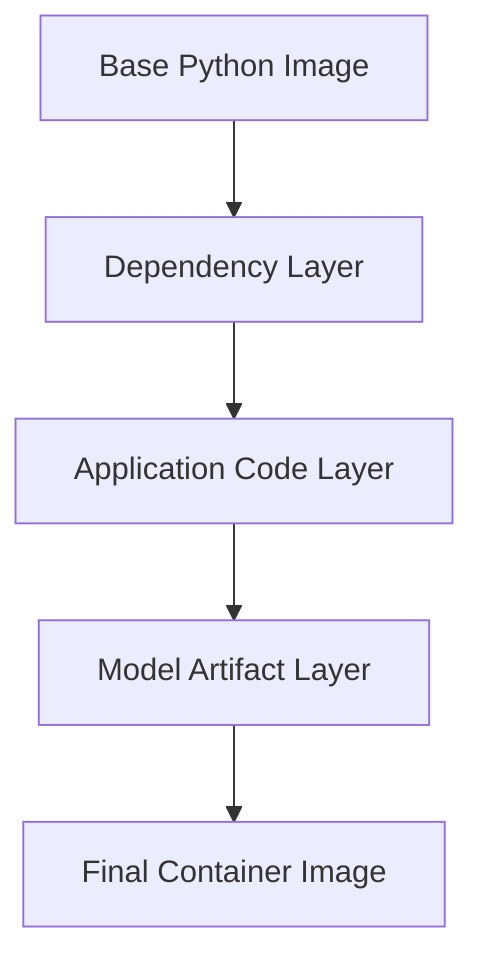
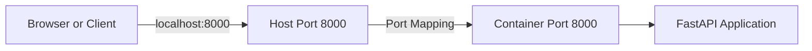
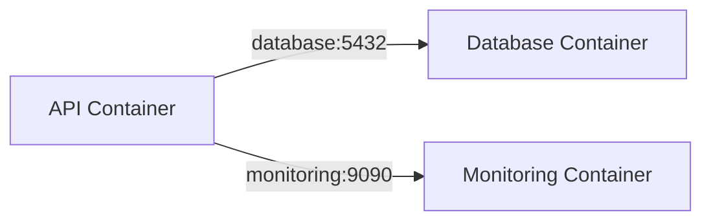
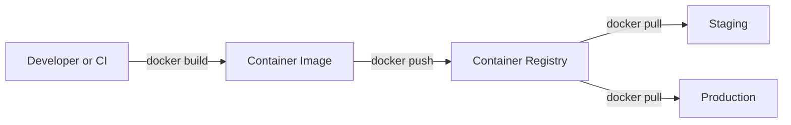
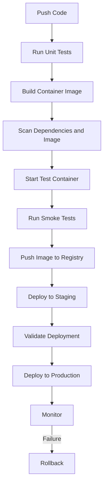
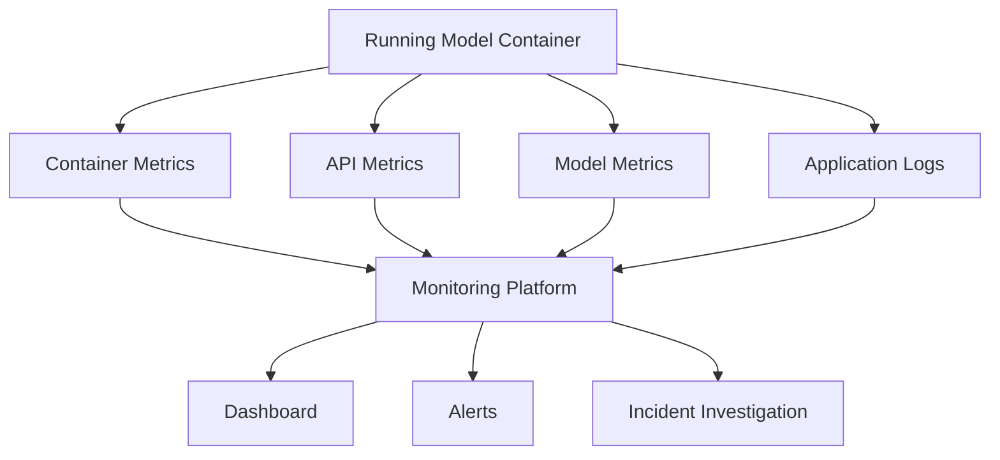

# 010 - Container

**Course:** 04 - MLOps and Deployment
**Module:** Module 08 - MLOps
**Content Group:** Docker
**Roadmap Source:** MLOps / Docker
**Lesson Type:** MLOps
**Lesson Order:** 010
**Suggested Duration:** 22 minutes

---

## 1. Overview

A **container** is a lightweight, isolated environment used to package and run an application together with its dependencies.

In Machine Learning, a model may work correctly inside a Data Scientist's notebook but fail when another developer, server, or cloud platform tries to run it.

Common causes include:

* Different Python versions
* Missing libraries
* Different operating-system packages
* Incorrect environment variables
* Missing model files
* Dependency conflicts
* Inconsistent startup commands

Containers solve many of these problems by packaging the application, runtime, dependencies, configuration, and model artifacts into a reproducible environment.

```text
Application code
+ Python runtime
+ Dependencies
+ System packages
+ Model artifact
+ Startup command
        ↓
    Container image
        ↓
Running container
```

A container helps transform a machine learning project from:

```text
"It works on my notebook"
```

into:

```text
"It runs consistently on my machine, the CI server, staging, and production."
```

---

## 2. Learning Objectives

By the end of this lesson, you should be able to:

* Explain what a container is in your own words.
* Distinguish between a container image and a running container.
* Explain how containers differ from virtual machines.
* Understand how containers support reproducible ML deployment.
* Build a simple Docker image for a FastAPI model service.
* Start, stop, inspect, and remove containers.
* Mount files and configure environment variables.
* Identify common containerization mistakes.
* Describe how containers fit into an MLOps workflow.
* Create a portfolio-ready containerized ML project.

---

## 3. What Is a Container?

A container is an isolated process that runs with its own:

* File system
* Installed packages
* Environment variables
* Network configuration
* Process space
* Startup command

However, containers usually share the host operating system kernel.

This makes them lighter and faster than traditional virtual machines.



Each container behaves like a separate environment even though multiple containers can run on the same host.

---

## 4. Why Containers Matter in Machine Learning

Machine learning systems often include more than a model file.

A deployable ML service may require:

* Python
* FastAPI or Flask
* NumPy
* Pandas
* Scikit-learn
* PyTorch or TensorFlow
* Model weights
* Preprocessing logic
* Configuration
* Operating-system libraries
* Startup scripts

Without containerization, every deployment environment must be configured manually.

```text
Developer laptop
    ├── Python 3.12
    ├── scikit-learn 1.x
    └── correct system packages

Production server
    ├── Python 3.10
    ├── older scikit-learn
    └── missing system package

Result: model fails or behaves differently
```

With containers:

```text
Same container image
    ├── Developer machine
    ├── CI pipeline
    ├── Staging server
    └── Production platform
```

The environment travels with the application.

---

## 5. Container Image vs Container

The terms **image** and **container** are related but not identical.

### Container image

A container image is a packaged, read-only template containing:

* Application code
* Runtime
* Libraries
* System dependencies
* Model files
* Default configuration
* Startup instructions

Example:

```text
iris-model-api:1.0.0
```

### Container

A container is a running instance of an image.

One image can be used to start multiple containers.



A useful analogy is:

```text
Image     = Class
Container = Object instance
```

Or:

```text
Image     = Application package
Container = Running application
```

---

## 6. Container Lifecycle

A container normally passes through several states.



Common commands:

```bash
docker create
docker start
docker run
docker stop
docker restart
docker rm
```

The most frequently used command is:

```bash
docker run
```

It creates and starts a container in one operation.

---

## 7. Containers vs Virtual Machines

Containers and virtual machines both provide isolation, but they operate differently.

### Virtual machine architecture

```text
Physical machine
    ↓
Host operating system
    ↓
Hypervisor
    ├── Guest OS + Application A
    ├── Guest OS + Application B
    └── Guest OS + Application C
```

### Container architecture

```text
Physical machine
    ↓
Host operating system
    ↓
Container runtime
    ├── Application A + Dependencies
    ├── Application B + Dependencies
    └── Application C + Dependencies
```

### Comparison

| Characteristic   | Container              | Virtual Machine                           |
| ---------------- | ---------------------- | ----------------------------------------- |
| Operating system | Shares host kernel     | Includes full guest OS                    |
| Startup time     | Usually seconds        | Usually slower                            |
| Image size       | Often MB to several GB | Often several GB or more                  |
| Resource usage   | Relatively lightweight | Heavier                                   |
| Isolation        | Process-level          | Machine-level                             |
| Portability      | High                   | High, but heavier                         |
| Common use       | Application deployment | Strong isolation and full OS environments |

Containers are not automatically more secure than virtual machines. They provide a different isolation model and still require secure configuration.

---

## 8. What Is Docker?

**Docker** is a platform commonly used to build, distribute, and run containers.

Docker provides tools for:

* Writing build instructions
* Building container images
* Running containers
* Managing container networks
* Mounting persistent storage
* Publishing images to registries
* Inspecting logs and runtime state

Important Docker concepts include:

| Concept        | Purpose                              |
| -------------- | ------------------------------------ |
| `Dockerfile`   | Instructions for building an image   |
| Image          | Packaged application template        |
| Container      | Running instance of an image         |
| Registry       | Storage for container images         |
| Volume         | Persistent or shared data storage    |
| Network        | Communication between containers     |
| Docker Compose | Defines multi-container applications |

---

## 9. Containerization in an MLOps Workflow

Containers are one part of a complete model delivery process.



A container packages the serving environment, but it does not replace:

* Model validation
* Testing
* Monitoring
* Security
* Model versioning
* Data validation
* CI/CD
* Rollback planning

---

## 10. Example ML Project Structure

A simple containerized model API may use the following structure:

```text
ml-container-project/
├── app/
│   ├── __init__.py
│   └── main.py
├── models/
│   └── iris_model.joblib
├── tests/
│   └── test_api.py
├── train.py
├── requirements.txt
├── Dockerfile
├── .dockerignore
├── compose.yaml
└── README.md
```

Each component has a clear responsibility:

| File or directory  | Purpose                               |
| ------------------ | ------------------------------------- |
| `app/`             | API application code                  |
| `models/`          | Serialized model artifacts            |
| `tests/`           | Automated tests                       |
| `train.py`         | Model training script                 |
| `requirements.txt` | Python dependencies                   |
| `Dockerfile`       | Image build instructions              |
| `.dockerignore`    | Files excluded from the build context |
| `compose.yaml`     | Multi-container configuration         |
| `README.md`        | Setup and usage documentation         |

---

## 11. Sample FastAPI Model Service

The following application loads a trained model and exposes prediction endpoints.

```python
# app/main.py

from contextlib import asynccontextmanager
from pathlib import Path
from typing import Any

import joblib
import numpy as np
from fastapi import FastAPI, HTTPException
from pydantic import BaseModel, Field


MODEL_PATH = Path("/app/models/iris_model.joblib")
MODEL_VERSION = "1.0.0"

model: Any | None = None


class PredictionRequest(BaseModel):
    sepal_length: float = Field(gt=0)
    sepal_width: float = Field(gt=0)
    petal_length: float = Field(gt=0)
    petal_width: float = Field(gt=0)


class PredictionResponse(BaseModel):
    prediction: int
    model_version: str


@asynccontextmanager
async def lifespan(app: FastAPI):
    global model

    if not MODEL_PATH.exists():
        raise RuntimeError(
            f"Model file was not found at {MODEL_PATH}"
        )

    model = joblib.load(MODEL_PATH)
    yield
    model = None


app = FastAPI(
    title="Iris Model API",
    version=MODEL_VERSION,
    lifespan=lifespan,
)


@app.get("/health")
def health_check() -> dict[str, str]:
    return {
        "status": "healthy",
    }


@app.get("/ready")
def readiness_check() -> dict[str, bool]:
    return {
        "ready": model is not None,
    }


@app.post(
    "/predict",
    response_model=PredictionResponse,
)
def predict(
    request: PredictionRequest,
) -> PredictionResponse:
    if model is None:
        raise HTTPException(
            status_code=503,
            detail="Model is not ready.",
        )

    features = np.array(
        [
            [
                request.sepal_length,
                request.sepal_width,
                request.petal_length,
                request.petal_width,
            ]
        ],
        dtype=float,
    )

    try:
        prediction = int(model.predict(features)[0])
    except Exception as error:
        raise HTTPException(
            status_code=500,
            detail="Prediction failed.",
        ) from error

    return PredictionResponse(
        prediction=prediction,
        model_version=MODEL_VERSION,
    )
```

The model is loaded once when the application starts rather than once for every request.

---

## 12. Python Dependencies

Example `requirements.txt`:

```text
fastapi==0.116.1
uvicorn[standard]==0.35.0
scikit-learn==1.7.1
joblib==1.5.1
numpy==2.3.1
pydantic==2.11.7
```

Pinning dependency versions improves reproducibility.

However, version pins should still be reviewed and updated regularly for:

* Security fixes
* Compatibility
* Performance
* Bug fixes

---

## 13. Writing a Dockerfile

A `Dockerfile` contains instructions for building a container image.

```dockerfile
FROM python:3.12-slim

WORKDIR /app

COPY requirements.txt .

RUN pip install \
    --no-cache-dir \
    --upgrade pip \
    && pip install \
    --no-cache-dir \
    -r requirements.txt

COPY app ./app
COPY models ./models

RUN useradd \
    --create-home \
    --shell /usr/sbin/nologin \
    appuser \
    && chown -R appuser:appuser /app

USER appuser

EXPOSE 8000

CMD [
    "uvicorn",
    "app.main:app",
    "--host",
    "0.0.0.0",
    "--port",
    "8000"
]
```

---

## 14. Understanding Dockerfile Instructions

### `FROM`

```dockerfile
FROM python:3.12-slim
```

Defines the base image.

The image already contains:

* A Linux user space
* Python
* Basic runtime tools

---

### `WORKDIR`

```dockerfile
WORKDIR /app
```

Sets the working directory inside the image.

Following commands operate relative to `/app`.

---

### `COPY`

```dockerfile
COPY requirements.txt .
```

Copies files from the build context into the image.

---

### `RUN`

```dockerfile
RUN pip install --no-cache-dir -r requirements.txt
```

Executes a command while building the image.

The result becomes part of an image layer.

---

### `USER`

```dockerfile
USER appuser
```

Runs the application as a non-root user.

This reduces the impact of some security vulnerabilities.

---

### `EXPOSE`

```dockerfile
EXPOSE 8000
```

Documents which port the application expects to use.

It does not automatically publish the port to the host.

---

### `CMD`

```dockerfile
CMD ["uvicorn", "app.main:app", "--host", "0.0.0.0", "--port", "8000"]
```

Defines the default command executed when the container starts.

The application must listen on:

```text
0.0.0.0
```

Inside a container, listening only on `127.0.0.1` may prevent the host from accessing the service.

---

## 15. Docker Image Layers

Most Dockerfile instructions create image layers.



Docker can reuse unchanged layers from its build cache.

This is why dependencies are often copied and installed before application code:

```dockerfile
COPY requirements.txt .
RUN pip install -r requirements.txt

COPY app ./app
```

When application code changes but dependencies do not, Docker may reuse the dependency layer.

This makes builds faster.

---

## 16. Creating a `.dockerignore` File

A `.dockerignore` file prevents unnecessary files from being included in the build context.

```text
.git
.github
.venv
venv
__pycache__
*.pyc
.pytest_cache
.mypy_cache
.coverage
htmlcov
notebooks
data
logs
.env
*.log
README-drafts
```

Benefits include:

* Faster builds
* Smaller build context
* Reduced risk of copying secrets
* Fewer unnecessary image layers

Do not copy `.env`, credentials, private keys, or local datasets into an image.

---

## 17. Building the Container Image

Build the image:

```bash
docker build \
  -t iris-model-api:1.0.0 \
  .
```

Command breakdown:

```text
docker build             Build an image
-t iris-model-api:1.0.0  Assign name and tag
.                        Use the current directory as build context
```

List local images:

```bash
docker image ls
```

Example output:

```text
REPOSITORY       TAG       IMAGE ID       SIZE
iris-model-api   1.0.0     a12bc34de56f   420MB
```

---

## 18. Running a Container

Start a container:

```bash
docker run \
  --name iris-api \
  -p 8000:8000 \
  iris-model-api:1.0.0
```

Port mapping:

```text
Host port : Container port
8000      : 8000
```

The application becomes available at:

```text
http://localhost:8000
```

Run in detached mode:

```bash
docker run \
  --detach \
  --name iris-api \
  --publish 8000:8000 \
  iris-model-api:1.0.0
```

Short form:

```bash
docker run -d --name iris-api -p 8000:8000 iris-model-api:1.0.0
```

---

## 19. Testing the Running Container

Check the health endpoint:

```bash
curl http://localhost:8000/health
```

Expected response:

```json
{
  "status": "healthy"
}
```

Send a prediction request:

```bash
curl \
  -X POST \
  "http://localhost:8000/predict" \
  -H "Content-Type: application/json" \
  -d '{
    "sepal_length": 5.1,
    "sepal_width": 3.5,
    "petal_length": 1.4,
    "petal_width": 0.2
  }'
```

Example response:

```json
{
  "prediction": 0,
  "model_version": "1.0.0"
}
```

---

## 20. Managing Containers

List running containers:

```bash
docker ps
```

List all containers:

```bash
docker ps --all
```

View logs:

```bash
docker logs iris-api
```

Follow logs continuously:

```bash
docker logs --follow iris-api
```

Inspect container configuration:

```bash
docker inspect iris-api
```

Stop the container:

```bash
docker stop iris-api
```

Start it again:

```bash
docker start iris-api
```

Restart it:

```bash
docker restart iris-api
```

Remove the stopped container:

```bash
docker rm iris-api
```

Force-remove a running container:

```bash
docker rm --force iris-api
```

Remove an image:

```bash
docker image rm iris-model-api:1.0.0
```

---

## 21. Containers Are Ephemeral

A container's writable file system is normally temporary.

When the container is removed, files created inside it may disappear.

```text
Container starts
    ↓
Application writes file
    ↓
Container is removed
    ↓
File is lost
```

This behavior is suitable for stateless services, but not for data that must persist.

Persistent data should normally be stored in:

* Docker volumes
* Bind mounts
* Databases
* Object storage
* External file systems

---

## 22. Volumes and Bind Mounts

### Bind mount

A bind mount maps a host directory into a container.

```bash
docker run \
  --name iris-api \
  -p 8000:8000 \
  --mount type=bind,source="$(pwd)/models",target=/app/models,readonly \
  iris-model-api:1.0.0
```

This allows the container to read model files from the host.

### Named volume

Create a volume:

```bash
docker volume create model-data
```

Mount it:

```bash
docker run \
  --name iris-api \
  -p 8000:8000 \
  --mount type=volume,source=model-data,target=/app/models \
  iris-model-api:1.0.0
```

### Comparison

| Storage method  | Typical use                       |
| --------------- | --------------------------------- |
| Container layer | Temporary runtime files           |
| Bind mount      | Development and local files       |
| Named volume    | Persistent container-managed data |
| Object storage  | Large production model artifacts  |
| Database        | Structured application data       |

A production model service often downloads its approved model artifact from a registry or object store during deployment or startup.

---

## 23. Environment Variables

Environment variables provide runtime configuration without rebuilding the image.

Example Python configuration:

```python
import os


MODEL_PATH = os.getenv(
    "MODEL_PATH",
    "/app/models/iris_model.joblib",
)

LOG_LEVEL = os.getenv(
    "LOG_LEVEL",
    "INFO",
)
```

Pass variables to the container:

```bash
docker run \
  --name iris-api \
  -p 8000:8000 \
  -e MODEL_PATH=/app/models/iris_model.joblib \
  -e LOG_LEVEL=DEBUG \
  iris-model-api:1.0.0
```

Using an environment file:

```text
MODEL_PATH=/app/models/iris_model.joblib
LOG_LEVEL=INFO
MODEL_VERSION=1.0.0
```

Start the container:

```bash
docker run \
  --env-file .env \
  -p 8000:8000 \
  iris-model-api:1.0.0
```

Do not bake production secrets directly into the image.

Use a secret-management solution for sensitive values.

---

## 24. Container Networking

Containers have their own network environment.

A port inside a container is not automatically accessible from the host.



Publish a port using:

```bash
docker run -p 8000:8000 iris-model-api:1.0.0
```

Two containers can also communicate over a Docker network.



Inside the network, containers normally communicate using service or container names rather than `localhost`.

---

## 25. Docker Compose

Docker Compose defines and runs multi-container applications.

Example `compose.yaml`:

```yaml
services:
  api:
    build:
      context: .
    image: iris-model-api:1.0.0
    container_name: iris-api
    ports:
      - "8000:8000"
    environment:
      MODEL_PATH: /app/models/iris_model.joblib
      LOG_LEVEL: INFO
    volumes:
      - ./models:/app/models:ro
    restart: unless-stopped
```

Start the application:

```bash
docker compose up
```

Start in detached mode:

```bash
docker compose up --detach
```

View logs:

```bash
docker compose logs --follow
```

Stop and remove containers:

```bash
docker compose down
```

Rebuild after code changes:

```bash
docker compose up --build
```

---

## 26. Health Checks

A container process may be running even when the application cannot serve requests.

A health check verifies actual service behavior.

Add a health check to the Dockerfile:

```dockerfile
HEALTHCHECK \
    --interval=30s \
    --timeout=5s \
    --start-period=20s \
    --retries=3 \
    CMD python -c \
    "import urllib.request; urllib.request.urlopen('http://localhost:8000/health')"
```

Or define it in `compose.yaml`:

```yaml
services:
  api:
    build: .
    ports:
      - "8000:8000"
    healthcheck:
      test:
        [
          "CMD",
          "python",
          "-c",
          "import urllib.request; urllib.request.urlopen('http://localhost:8000/health')"
        ]
      interval: 30s
      timeout: 5s
      retries: 3
      start_period: 20s
```

Health status can be inspected with:

```bash
docker inspect iris-api
```

Health checks help deployment platforms decide whether to:

* Route traffic to the container
* Restart the container
* Mark a release as unhealthy
* Trigger a rollback

---

## 27. Resource Limits

A model container can consume excessive CPU or memory.

Resource limits help protect the host and neighboring services.

Example:

```bash
docker run \
  --name iris-api \
  -p 8000:8000 \
  --memory 1g \
  --cpus 1.0 \
  iris-model-api:1.0.0
```

Resource constraints are particularly important for:

* Deep learning models
* Large batch requests
* Image processing
* Language models
* Memory-intensive preprocessing
* Multi-worker API servers

Monitor actual usage before choosing limits.

---

## 28. Container Logging

Applications should write logs to standard output and standard error.

```python
import logging


logging.basicConfig(
    level=logging.INFO,
    format=(
        "%(asctime)s "
        "%(levelname)s "
        "%(name)s "
        "%(message)s"
    ),
)

logger = logging.getLogger(__name__)


logger.info(
    "Prediction completed",
    extra={
        "model_version": "1.0.0",
    },
)
```

Docker captures these logs:

```bash
docker logs iris-api
```

Useful log fields include:

```json
{
  "timestamp": "2026-07-13T10:15:00Z",
  "request_id": "req-1827",
  "endpoint": "/predict",
  "status_code": 200,
  "latency_ms": 37,
  "model_version": "1.0.0"
}
```

Avoid logging:

* Passwords
* Authentication tokens
* Personal data
* Medical information
* Full raw requests
* Confidential images
* Private text content

---

## 29. Image Tagging and Versioning

Avoid relying only on the `latest` tag.

Weak versioning:

```text
iris-model-api:latest
```

Better versioning:

```text
iris-model-api:1.0.0
iris-model-api:1.1.0
iris-model-api:git-a51d279
iris-model-api:model-2026-07-13
```

A deployment should be traceable to:

* Source-code commit
* Model version
* Dependency versions
* Build pipeline
* Container image digest
* Training dataset version

Example metadata:

```json
{
  "service_version": "1.2.0",
  "model_version": "iris-rf-2026-07-13",
  "git_commit": "a51d279",
  "image_tag": "1.2.0"
}
```

This makes debugging and rollback easier.

---

## 30. Container Registry

A container registry stores and distributes images.

Typical workflow:



Generic commands:

```bash
docker tag \
  iris-model-api:1.0.0 \
  registry.example.com/ml/iris-model-api:1.0.0
```

```bash
docker push \
  registry.example.com/ml/iris-model-api:1.0.0
```

Production servers then pull the approved image.

```bash
docker pull \
  registry.example.com/ml/iris-model-api:1.0.0
```

---

## 31. CI/CD Integration

Containers are commonly built and tested inside CI/CD pipelines.



A CI pipeline should fail when:

* Unit tests fail
* The image cannot be built
* Security policy fails
* The model file is missing
* The application cannot start
* The health endpoint fails
* The API contract changes unexpectedly

---

## 32. Container Security

Containers require secure configuration.

Recommended practices include:

* Use trusted base images.
* Use specific image tags or digests.
* Run as a non-root user.
* Keep base images and dependencies updated.
* Remove unnecessary packages.
* Do not store secrets in the image.
* Scan images for known vulnerabilities.
* Use read-only mounts when possible.
* Restrict network access.
* Set CPU and memory limits.
* Avoid privileged containers.
* Use a minimal runtime image.
* Log security-relevant events.
* Sign and verify production images where supported.

Bad example:

```dockerfile
ENV API_KEY="production-secret"
```

Better approach:

```bash
docker run \
  -e API_KEY="$API_KEY" \
  iris-model-api:1.0.0
```

For production, use a dedicated secret manager rather than plain shell history or shared environment files.

---

## 33. Optimizing Image Size

Large images are slower to:

* Build
* Push
* Pull
* Scan
* Deploy
* Start on new nodes

Common optimization strategies include:

* Use a smaller base image.
* Exclude unnecessary files.
* Avoid installing development tools in production.
* Combine related `RUN` instructions.
* Clean package-manager caches.
* Use multi-stage builds.
* Keep training dependencies out of the serving image.
* Store very large model artifacts outside the image when appropriate.

Example multi-stage build:

```dockerfile
FROM python:3.12-slim AS builder

WORKDIR /build

COPY requirements.txt .

RUN pip install \
    --no-cache-dir \
    --prefix=/install \
    -r requirements.txt


FROM python:3.12-slim AS runtime

WORKDIR /app

COPY --from=builder /install /usr/local
COPY app ./app
COPY models ./models

RUN useradd \
    --create-home \
    --shell /usr/sbin/nologin \
    appuser \
    && chown -R appuser:appuser /app

USER appuser

EXPOSE 8000

CMD [
    "uvicorn",
    "app.main:app",
    "--host",
    "0.0.0.0",
    "--port",
    "8000"
]
```

Multi-stage builds are most useful when the build phase requires tools that the runtime phase does not need.

---

## 34. Development vs Production Containers

A development container may include:

* Source-code mounts
* Auto reload
* Debug logging
* Testing tools
* Interactive shells

Example development command:

```bash
docker run \
  --rm \
  -p 8000:8000 \
  -v "$(pwd)/app:/app/app" \
  iris-model-api:dev \
  uvicorn app.main:app \
    --host 0.0.0.0 \
    --port 8000 \
    --reload
```

A production container should normally use:

* Fixed image contents
* No auto reload
* Non-root user
* Controlled logging
* Health checks
* Resource limits
* Immutable version tags
* Security scanning
* Reproducible startup configuration

Development convenience should not automatically become production configuration.

---

## 35. Common Mistakes

### 35.1 Copying the entire project into the image

```dockerfile
COPY . .
```

This may copy:

* Git history
* Local virtual environments
* Notebooks
* Private datasets
* Secrets
* Test caches
* Log files

**Better approach:** Use `.dockerignore` and copy only required files.

---

### 35.2 Using only the `latest` tag

The deployed version becomes difficult to identify.

**Better approach:** Use immutable or traceable tags.

---

### 35.3 Running as root

A compromised application may have excessive permissions.

**Better approach:** Create and use a dedicated non-root user.

---

### 35.4 Loading the model for every request

This increases latency and resource usage.

**Better approach:** Load the model once during application startup.

---

### 35.5 Storing data inside the container

Files disappear when the container is replaced.

**Better approach:** Use volumes, databases, or object storage.

---

### 35.6 Baking secrets into the image

Secrets may remain visible in image layers and registries.

**Better approach:** Inject secrets at runtime.

---

### 35.7 Not pinning dependencies

A future rebuild may produce a different environment.

**Better approach:** Pin and review dependency versions.

---

### 35.8 Installing training dependencies in the serving image

The production image becomes unnecessarily large.

**Better approach:** Separate training and serving environments.

---

### 35.9 No health or readiness endpoint

The container may appear alive while the model is unavailable.

**Better approach:** Add health and readiness checks.

---

### 35.10 Assuming containers guarantee reproducibility

Containers improve environment reproducibility, but they do not automatically version:

* Training data
* Random seeds
* External services
* Model registry entries
* Hardware behavior
* Runtime configuration

**Better approach:** Combine containers with complete experiment and artifact tracking.

---

## 36. Container Limitations

Containers solve many deployment problems, but not every problem.

Containers do not automatically guarantee:

* Correct predictions
* High availability
* Data quality
* Model fairness
* Model security
* Low latency
* Drift detection
* Automatic scaling
* Correct secrets management
* Reproducible training data
* Safe rollback

A poorly designed application remains poorly designed inside a container.

Containerization packages the system. It does not replace engineering discipline.

---

## 37. Practical Exercise

Containerize a machine learning API.

### Required tasks

1. Train or load a simple model.
2. Save the model artifact.
3. Create a FastAPI application.
4. Add a `POST /predict` endpoint.
5. Add `/health` and `/ready` endpoints.
6. Create a pinned `requirements.txt`.
7. Write a Dockerfile.
8. Create a `.dockerignore` file.
9. Build the container image.
10. Run the container locally.
11. Send a sample prediction request.
12. Inspect the container logs.
13. Stop and remove the container.
14. Document the commands in a README.
15. Record which metrics should be monitored in production.

---

## 38. Extended Exercise

Improve the project by adding:

* A non-root container user
* Environment-based configuration
* A Docker health check
* Automated API tests
* A `compose.yaml` file
* CPU and memory limits
* Structured JSON logs
* Model version metadata
* Separate development and production configurations
* A CI pipeline that builds and tests the image

Optional challenge:

```text
Build two images:
1. Training image
2. Serving image
```

The training image may include notebooks and training libraries.

The serving image should contain only what is required for inference.

---

## 39. Suggested README

```markdown
# Iris Model API

## Overview

## Architecture

## Project Structure

## Model Information

## Requirements

## Train the Model

## Run Without Docker

## Build the Image

## Start the Container

## Test the Health Endpoint

## Send a Prediction Request

## View Logs

## Stop the Container

## Run Automated Tests

## Environment Variables

## Monitoring Plan

## Security Considerations

## Known Limitations

## Future Improvements
```

A strong README should allow another person to run the project without guessing.

---

## 40. Production Monitoring

A containerized model service should expose both infrastructure and model metrics.

### Container and service metrics

* CPU usage
* Memory usage
* Restart count
* Container health
* Request rate
* Error rate
* Request latency
* Active workers
* Disk usage
* Network traffic

### Model metrics

* Input distribution
* Missing-feature rate
* Prediction distribution
* Confidence distribution
* Data drift
* Concept drift
* Accuracy
* Precision
* Recall
* F1 score
* Business impact



A healthy container does not guarantee a healthy model.

---

## 41. Production Readiness Checklist

### Image

* [ ] The base image is trusted.
* [ ] The image uses a versioned tag.
* [ ] Dependencies are pinned.
* [ ] Unnecessary files are excluded.
* [ ] No secrets are stored in image layers.
* [ ] The image has been security-scanned.
* [ ] The image size is reasonable.

### Runtime

* [ ] The application runs as a non-root user.
* [ ] CPU and memory limits are defined.
* [ ] Health and readiness checks exist.
* [ ] The service writes logs to standard output.
* [ ] Persistent data is stored externally.
* [ ] Runtime configuration uses environment variables or secrets.
* [ ] The restart policy is appropriate.

### Model

* [ ] The model artifact is versioned.
* [ ] Preprocessing matches training.
* [ ] The model is loaded once.
* [ ] Model metadata is exposed.
* [ ] A rollback model is available.
* [ ] Input validation is enabled.

### Deployment

* [ ] Automated tests pass.
* [ ] The image is stored in a registry.
* [ ] The image is traceable to source code.
* [ ] Staging validation is performed.
* [ ] Monitoring and alerts are configured.
* [ ] A rollback procedure is documented.

---

## 42. Completion Checklist

* [ ] I can explain a container in one or two minutes.
* [ ] I understand the difference between an image and a container.
* [ ] I can compare containers with virtual machines.
* [ ] I understand the basic container lifecycle.
* [ ] I can write a simple Dockerfile.
* [ ] I can build a Docker image.
* [ ] I can run and stop a container.
* [ ] I can publish a container port.
* [ ] I can inspect container logs.
* [ ] I understand volumes and bind mounts.
* [ ] I can configure a container with environment variables.
* [ ] I understand why production containers should not run as root.
* [ ] I can explain how containers fit into an MLOps workflow.
* [ ] I have documented at least one limitation or production risk.

---

## 43. Portfolio Mini Project

### Deploy an ML Model in a Container

Build a project containing:

* A trained machine learning model
* A FastAPI `/predict` endpoint
* Input validation
* Health and readiness endpoints
* Model version metadata
* Automated tests
* A Dockerfile
* A `.dockerignore` file
* A `compose.yaml` file
* Sample `curl` requests
* Structured logging
* A monitoring plan
* A complete README

Suggested execution flow:

```text
Train model
    ↓
Save model artifact
    ↓
Build FastAPI service
    ↓
Test locally
    ↓
Write Dockerfile
    ↓
Build image
    ↓
Run container
    ↓
Test /health and /predict
    ↓
Inspect logs
    ↓
Document deployment and monitoring
```

This project demonstrates that you can move a model beyond a notebook and package it as a reproducible service.

---

## 44. Key Takeaways

* A container packages an application together with the environment required to run it.
* A container image is a reusable template, while a container is a running instance.
* Containers are lighter than virtual machines because they usually share the host kernel.
* Containers improve portability, isolation, and deployment reproducibility.
* Docker is a common tool for building and running containers.
* Containerized ML services still require testing, versioning, monitoring, security, and rollback.
* Containers should normally be stateless, with persistent data stored externally.
* Production containers should use controlled dependencies, non-root users, health checks, resource limits, and versioned images.
* A successful container does not guarantee a successful model.
* A strong MLOps portfolio project should include code, model artifacts, tests, a Dockerfile, sample requests, and clear documentation.

---

## 45. Summary

A **container** provides a consistent and isolated runtime environment for an application.

In Machine Learning, it packages the model-serving code, runtime, dependencies, model artifact, and startup command into a deployable unit.

The complete workflow is:

```text
Trained model
    ↓
Model artifact
    ↓
Prediction API
    ↓
Dockerfile
    ↓
Container image
    ↓
Automated tests
    ↓
Container registry
    ↓
Staging deployment
    ↓
Production deployment
    ↓
Logs, metrics, and drift monitoring
    ↓
Rollback or retraining
```

Containers are a key milestone in the AI and Data Scientist roadmap because they bridge the gap between experimentation and reliable software delivery.

The goal is not only to make the model run inside Docker. The goal is to create a versioned, testable, secure, observable, and reproducible model-serving system.
