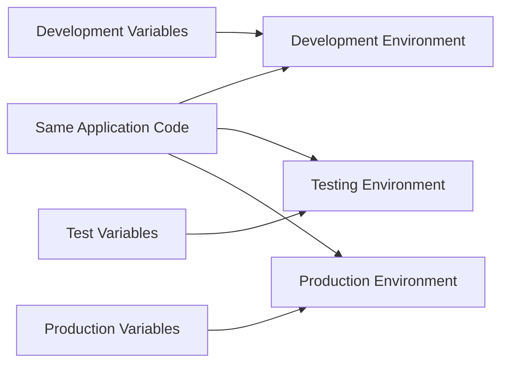
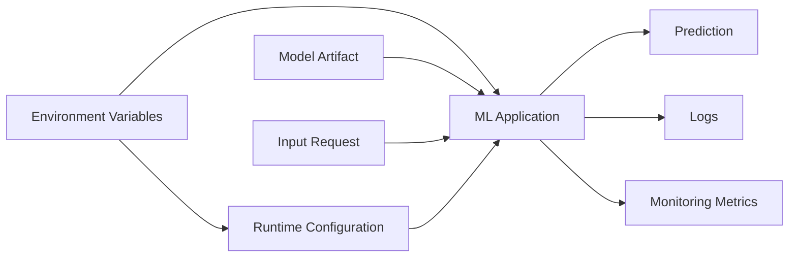
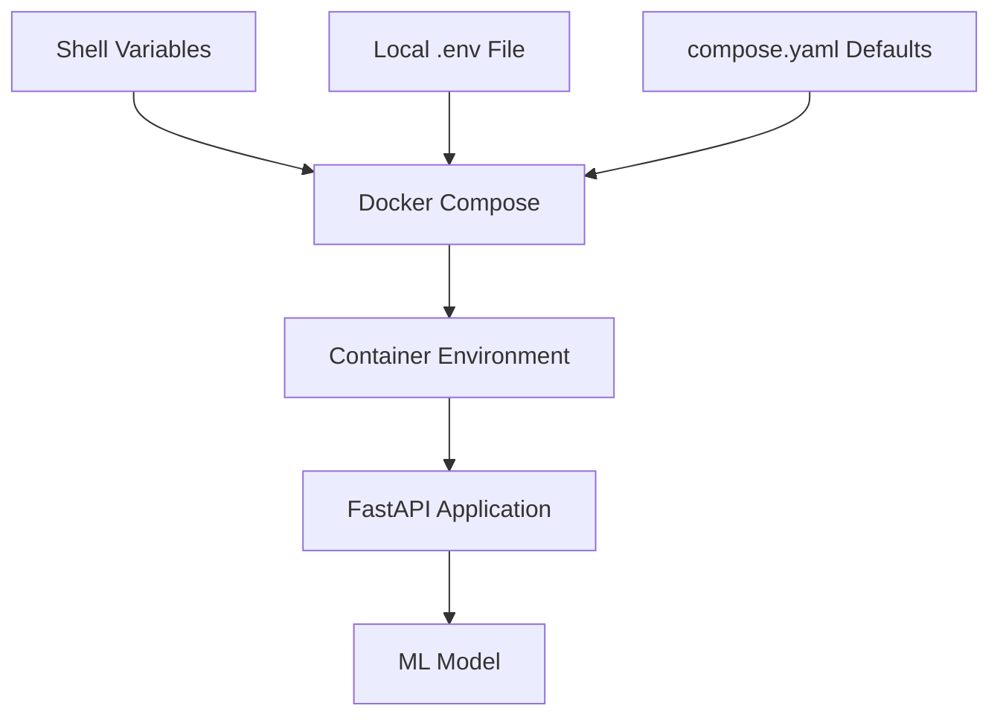
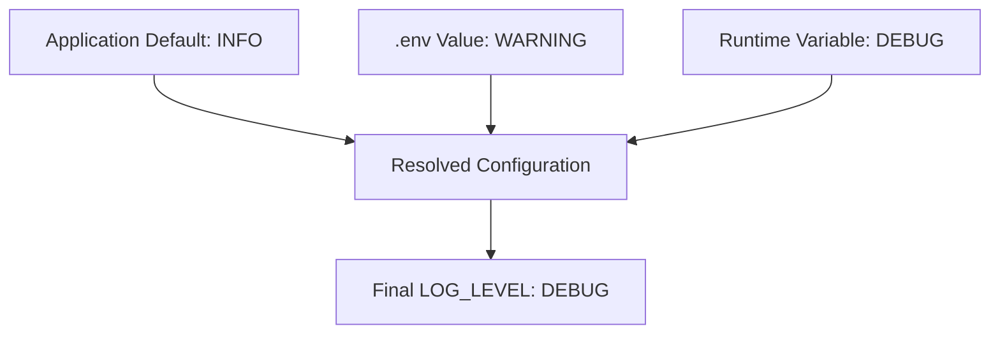
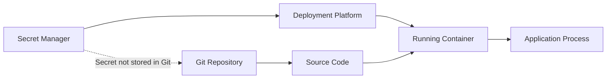
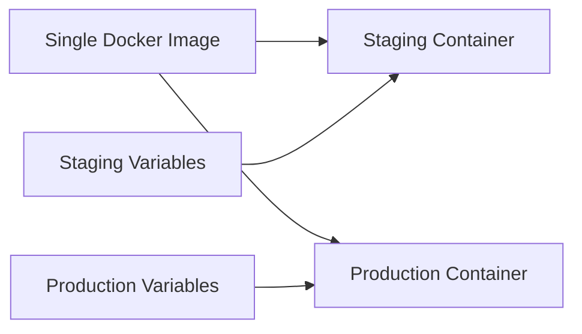
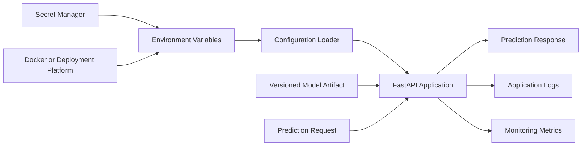

# 011 — Environment Variables

| Item                   | Details                   |
| ---------------------- | ------------------------- |
| **Course Section**     | 04 — MLOps and Deployment |
| **Module**             | Module 08 — MLOps         |
| **Content Group**      | Docker                    |
| **Roadmap Source**     | MLOps / Docker            |
| **Lesson Type**        | MLOps                     |
| **Order in Module**    | 011                       |
| **Suggested Duration** | 22 minutes                |

---

## 1. Overview

An **environment variable** is a named value provided by the operating system, container runtime, or deployment platform to configure an application.

Instead of placing configuration directly inside source code, an application can read values such as:

```text
APP_ENV=production
MODEL_PATH=/models/churn-model.joblib
DATABASE_URL=postgresql://database:5432/ml
LOG_LEVEL=INFO
PREDICTION_THRESHOLD=0.70
```

Environment variables are especially useful in MLOps because the same application may run in several environments:

* Local development.
* Automated testing.
* Staging.
* Production.
* Docker containers.
* CI/CD pipelines.
* Kubernetes clusters.
* Cloud platforms.

The application code remains the same, while its configuration changes according to the environment.

---

## 2. Learning Objectives

After completing this lesson, you should be able to:

* Explain environment variables in your own words.
* Describe why configuration should be separated from application code.
* Read environment variables in Python.
* Provide environment variables to a Docker container.
* Use an environment file with Docker and Docker Compose.
* Validate required configuration when an application starts.
* Distinguish Docker `ARG` from Docker `ENV`.
* Avoid exposing passwords, API keys, and other secrets.
* Configure an ML prediction API for development and production.
* Document environment variables in a project README.

---

## 3. What Is an Environment Variable?

An environment variable is a key-value pair available to a running process.

For example:

```text
MODEL_VERSION=2.1.0
```

In this example:

* `MODEL_VERSION` is the variable name.
* `2.1.0` is its value.

An application can read this variable while it is running.

### Python Example

```python
import os

model_version = os.getenv("MODEL_VERSION")

print(model_version)
```

Run the script with an environment variable:

```bash
MODEL_VERSION=2.1.0 python app.py
```

Output:

```text
2.1.0
```

Environment variables are normally stored as strings. The application must convert values into integers, floating-point numbers, booleans, or other types when necessary.

---

## 4. Why Environment Variables Matter

Without environment variables, developers may place configuration directly inside code:

```python
DATABASE_URL = "postgresql://localhost:5432/ml_database"
MODEL_PATH = "/home/developer/models/model.joblib"
DEBUG = True
```

This creates several problems:

* The code only works in one environment.
* Production configuration becomes mixed with development configuration.
* Credentials may be committed to Git.
* Changing configuration requires modifying and rebuilding the code.
* Testing different settings becomes difficult.

A better approach is:

```python
import os

DATABASE_URL = os.getenv("DATABASE_URL")
MODEL_PATH = os.getenv("MODEL_PATH", "/app/models/model.joblib")
DEBUG = os.getenv("DEBUG", "false").lower() == "true"
```

Now the same code can run with different configurations.



This supports an important deployment principle:

> Build the application once and configure it differently for each environment.

---

## 5. Environment Variables in an MLOps System

An ML service may need configuration for:

* Model location.
* Model version.
* Prediction threshold.
* Database connection.
* Feature store connection.
* Object storage bucket.
* Logging level.
* Monitoring endpoint.
* API port.
* Deployment environment.
* Batch size.
* Number of workers.

Example:

```text
APP_ENV=production
APP_PORT=8000
MODEL_NAME=customer-churn
MODEL_VERSION=3.2.0
MODEL_PATH=/models/churn-pipeline.joblib
PREDICTION_THRESHOLD=0.65
LOG_LEVEL=INFO
MAX_BATCH_SIZE=500
ENABLE_MONITORING=true
```

### MLOps Configuration Flow



The environment variables control how the application behaves without changing the prediction code itself.

---

## 6. Reading Environment Variables in Python

### 6.1 Reading an Optional Variable

```python
import os

log_level = os.getenv("LOG_LEVEL", "INFO")

print(f"Log level: {log_level}")
```

If `LOG_LEVEL` is not defined, the application uses `INFO`.

---

### 6.2 Reading a Required Variable

A required variable should cause the application to fail clearly when it is missing.

```python
import os


def get_required_variable(name: str) -> str:
    value = os.getenv(name)

    if not value:
        raise RuntimeError(
            f"Required environment variable '{name}' is missing."
        )

    return value


model_path = get_required_variable("MODEL_PATH")
```

Failing during application startup is usually better than failing later during a prediction request.

---

### 6.3 Reading an Integer

Environment variable values are strings by default.

```python
import os

port = int(os.getenv("APP_PORT", "8000"))
```

Add validation when the value may be invalid:

```python
import os


def get_integer(name: str, default: int) -> int:
    raw_value = os.getenv(name, str(default))

    try:
        return int(raw_value)
    except ValueError as exc:
        raise RuntimeError(
            f"{name} must be an integer, received: {raw_value}"
        ) from exc


app_port = get_integer("APP_PORT", 8000)
```

---

### 6.4 Reading a Float

```python
import os

prediction_threshold = float(
    os.getenv("PREDICTION_THRESHOLD", "0.5")
)
```

Validate the allowed range:

```python
if not 0.0 <= prediction_threshold <= 1.0:
    raise RuntimeError(
        "PREDICTION_THRESHOLD must be between 0 and 1."
    )
```

---

### 6.5 Reading a Boolean

Avoid using this code:

```python
debug = bool(os.getenv("DEBUG"))
```

It is incorrect because:

```python
bool("false")
```

returns `True`. Any non-empty string is considered true.

Use explicit parsing:

```python
import os


def get_boolean(name: str, default: bool = False) -> bool:
    raw_value = os.getenv(name)

    if raw_value is None:
        return default

    normalized = raw_value.strip().lower()

    if normalized in {"true", "1", "yes", "on"}:
        return True

    if normalized in {"false", "0", "no", "off"}:
        return False

    raise RuntimeError(
        f"{name} must be a valid boolean value."
    )


debug = get_boolean("DEBUG", False)
```

---

## 7. Centralized Application Settings

Configuration should normally be loaded in one module instead of calling `os.getenv()` throughout the entire codebase.

### `config.py`

```python
import os
from dataclasses import dataclass


def require_variable(name: str) -> str:
    value = os.getenv(name)

    if not value:
        raise RuntimeError(
            f"Required environment variable '{name}' is missing."
        )

    return value


def parse_boolean(value: str) -> bool:
    normalized = value.strip().lower()

    if normalized in {"true", "1", "yes", "on"}:
        return True

    if normalized in {"false", "0", "no", "off"}:
        return False

    raise ValueError(f"Invalid boolean value: {value}")


@dataclass(frozen=True)
class Settings:
    app_env: str
    app_port: int
    model_path: str
    model_version: str
    prediction_threshold: float
    log_level: str
    monitoring_enabled: bool


def load_settings() -> Settings:
    settings = Settings(
        app_env=os.getenv("APP_ENV", "development"),
        app_port=int(os.getenv("APP_PORT", "8000")),
        model_path=require_variable("MODEL_PATH"),
        model_version=os.getenv("MODEL_VERSION", "unknown"),
        prediction_threshold=float(
            os.getenv("PREDICTION_THRESHOLD", "0.5")
        ),
        log_level=os.getenv("LOG_LEVEL", "INFO"),
        monitoring_enabled=parse_boolean(
            os.getenv("ENABLE_MONITORING", "false")
        ),
    )

    if not 0 <= settings.prediction_threshold <= 1:
        raise RuntimeError(
            "PREDICTION_THRESHOLD must be between 0 and 1."
        )

    return settings
```

### Use the Settings

```python
from config import load_settings

settings = load_settings()

print(settings.model_path)
print(settings.model_version)
```

Benefits of centralized configuration include:

* One source of truth.
* Easier validation.
* Better testing.
* Clearer documentation.
* Consistent default values.
* Fewer configuration mistakes.

---

## 8. Setting Environment Variables

### Linux and macOS

Set a variable for one command:

```bash
APP_ENV=development python app.py
```

Export a variable for the current terminal session:

```bash
export APP_ENV=development
export MODEL_PATH=./models/model.joblib

python app.py
```

View a variable:

```bash
echo "$APP_ENV"
```

Remove a variable:

```bash
unset APP_ENV
```

---

### Windows PowerShell

Set a variable:

```powershell
$env:APP_ENV = "development"
$env:MODEL_PATH = ".\models\model.joblib"
```

Run the application:

```powershell
python app.py
```

View a variable:

```powershell
$env:APP_ENV
```

Remove a variable:

```powershell
Remove-Item Env:APP_ENV
```

---

## 9. Environment Files

An environment file stores multiple variables in one place.

### `.env`

```dotenv
APP_ENV=development
APP_PORT=8000
MODEL_PATH=/app/models/churn-model.joblib
MODEL_VERSION=1.0.0
PREDICTION_THRESHOLD=0.65
LOG_LEVEL=DEBUG
ENABLE_MONITORING=false
```

Benefits include:

* Easier local configuration.
* Fewer long terminal commands.
* A consistent development setup.
* Clear configuration documentation.

However, `.env` files may contain secrets and must be handled carefully.

### `.gitignore`

```gitignore
.env
.env.local
.env.production
*.secret
```

Do not commit sensitive environment files.

Instead, provide a safe template.

### `.env.example`

```dotenv
APP_ENV=development
APP_PORT=8000
MODEL_PATH=/app/models/model.joblib
MODEL_VERSION=1.0.0
PREDICTION_THRESHOLD=0.50
LOG_LEVEL=INFO
ENABLE_MONITORING=false
DATABASE_URL=replace-with-database-url
```

The example file documents required variables without exposing real credentials.

---

## 10. Environment Variables in Docker

Docker can provide environment variables to a container in several ways.

---

### 10.1 Dockerfile `ENV`

The `ENV` instruction defines a value inside the Docker image.

```dockerfile
FROM python:3.12-slim

WORKDIR /app

ENV APP_ENV=production
ENV APP_PORT=8000
ENV LOG_LEVEL=INFO

COPY requirements.txt .
RUN pip install --no-cache-dir -r requirements.txt

COPY app/ ./app/
COPY models/ ./models/

CMD ["python", "-m", "app.main"]
```

These values become default environment variables inside containers created from the image.

```bash
docker build -t ml-api:1.0.0 .
docker run --rm ml-api:1.0.0
```

Use `ENV` for safe default configuration, not for secrets.

---

### 10.2 Docker Run `-e`

Override or define a value when starting the container:

```bash
docker run --rm \
  -e APP_ENV=staging \
  -e LOG_LEVEL=DEBUG \
  -e MODEL_VERSION=1.1.0 \
  ml-api:1.0.0
```

Pass a variable from the current shell:

```bash
export DATABASE_URL="postgresql://database:5432/ml"

docker run --rm \
  -e DATABASE_URL \
  ml-api:1.0.0
```

This passes the current value of `DATABASE_URL` into the container.

---

### 10.3 Docker `--env-file`

Load variables from a file:

```bash
docker run --rm \
  --env-file .env \
  ml-api:1.0.0
```

This is cleaner than writing many `-e` arguments.

---

### 10.4 Override Order

A runtime value can override a Dockerfile default.

Dockerfile:

```dockerfile
ENV LOG_LEVEL=INFO
```

Run command:

```bash
docker run --rm \
  -e LOG_LEVEL=DEBUG \
  ml-api:1.0.0
```

Inside the container:

```text
LOG_LEVEL=DEBUG
```

The runtime configuration takes precedence.

---

## 11. Docker `ARG` vs. `ENV`

Docker provides both `ARG` and `ENV`, but they serve different purposes.

| Feature                             | `ARG`                    | `ENV`                 |
| ----------------------------------- | ------------------------ | --------------------- |
| Available during image build        | Yes                      | Yes                   |
| Available in the running container  | Normally no              | Yes                   |
| Set with `docker build --build-arg` | Yes                      | No                    |
| Set with `docker run -e`            | No                       | Yes                   |
| Main purpose                        | Build-time configuration | Runtime configuration |
| Appropriate for secrets             | No                       | No                    |

### `ARG` Example

```dockerfile
FROM python:3.12-slim

ARG APP_VERSION=unknown

RUN echo "Building application version: ${APP_VERSION}"

COPY . /app
```

Build the image:

```bash
docker build \
  --build-arg APP_VERSION=1.3.0 \
  -t ml-api:1.3.0 .
```

### `ENV` Example

```dockerfile
ENV MODEL_PATH=/app/models/model.joblib
```

The application can read `MODEL_PATH` while the container is running.

### Important Security Rule

Do not use either `ARG` or `ENV` to permanently store sensitive credentials in an image.

Values may appear in:

* Image metadata.
* Build logs.
* Docker history.
* CI/CD logs.
* Debug output.
* Inspection commands.

Use a proper secret-management mechanism for production secrets.

---

## 12. Docker Compose

Docker Compose makes it easier to define variables for multiple services.

### `compose.yaml`

```yaml
services:
  ml-api:
    build:
      context: .
    ports:
      - "${APP_PORT:-8000}:8000"
    environment:
      APP_ENV: "${APP_ENV:-development}"
      MODEL_PATH: "/app/models/churn-model.joblib"
      MODEL_VERSION: "${MODEL_VERSION:-1.0.0}"
      PREDICTION_THRESHOLD: "${PREDICTION_THRESHOLD:-0.5}"
      LOG_LEVEL: "${LOG_LEVEL:-INFO}"
      DATABASE_URL: "${DATABASE_URL}"
    volumes:
      - ./models:/app/models:ro
```

Start the service:

```bash
docker compose up --build
```

Compose can read variable values from a local `.env` file.

```dotenv
APP_PORT=8000
APP_ENV=development
MODEL_VERSION=1.0.0
PREDICTION_THRESHOLD=0.65
LOG_LEVEL=DEBUG
DATABASE_URL=postgresql://database:5432/ml
```

### Configuration Flow



Be careful because the `.env` file used for Compose interpolation and the container's environment are related but not always identical. Variables must still be declared under `environment` or `env_file` when they need to enter the container.

---

## 13. FastAPI ML Service Example

### Project Structure

```text
ml-environment-variable-demo/
├── app/
│   ├── __init__.py
│   ├── config.py
│   └── main.py
├── models/
│   └── churn-model.joblib
├── .env.example
├── .gitignore
├── compose.yaml
├── Dockerfile
├── requirements.txt
└── README.md
```

### `app/config.py`

```python
import os
from dataclasses import dataclass


def require_environment_variable(name: str) -> str:
    value = os.getenv(name)

    if value is None or not value.strip():
        raise RuntimeError(
            f"Required environment variable '{name}' is missing."
        )

    return value


@dataclass(frozen=True)
class Settings:
    app_env: str
    model_path: str
    model_version: str
    prediction_threshold: float
    log_level: str


def load_settings() -> Settings:
    threshold = float(
        os.getenv("PREDICTION_THRESHOLD", "0.5")
    )

    if not 0 <= threshold <= 1:
        raise RuntimeError(
            "PREDICTION_THRESHOLD must be between 0 and 1."
        )

    return Settings(
        app_env=os.getenv("APP_ENV", "development"),
        model_path=require_environment_variable("MODEL_PATH"),
        model_version=os.getenv("MODEL_VERSION", "unknown"),
        prediction_threshold=threshold,
        log_level=os.getenv("LOG_LEVEL", "INFO"),
    )
```

### `app/main.py`

```python
import logging
from contextlib import asynccontextmanager

import joblib
import numpy as np
from fastapi import FastAPI, HTTPException
from pydantic import BaseModel, Field

from app.config import load_settings


settings = load_settings()

logging.basicConfig(
    level=settings.log_level.upper(),
    format="%(asctime)s | %(levelname)s | %(message)s",
)

logger = logging.getLogger(__name__)

model = None


class PredictionRequest(BaseModel):
    monthly_spend: float = Field(ge=0)
    account_age: int = Field(ge=0)
    support_tickets: int = Field(ge=0)


class PredictionResponse(BaseModel):
    prediction: int
    probability: float
    model_version: str


@asynccontextmanager
async def lifespan(app: FastAPI):
    global model

    logger.info(
        "Loading model version=%s from path=%s",
        settings.model_version,
        settings.model_path,
    )

    try:
        model = joblib.load(settings.model_path)
    except Exception:
        logger.exception("Could not load the model.")
        raise

    logger.info(
        "Application started in environment=%s",
        settings.app_env,
    )

    yield

    logger.info("Application is shutting down.")


app = FastAPI(
    title="Customer Churn Prediction API",
    version=settings.model_version,
    lifespan=lifespan,
)


@app.get("/health")
def health() -> dict[str, str]:
    return {
        "status": "healthy",
        "environment": settings.app_env,
        "model_version": settings.model_version,
    }


@app.post("/predict", response_model=PredictionResponse)
def predict(request: PredictionRequest) -> PredictionResponse:
    if model is None:
        raise HTTPException(
            status_code=503,
            detail="Model is not available.",
        )

    features = np.array(
        [
            [
                request.monthly_spend,
                request.account_age,
                request.support_tickets,
            ]
        ]
    )

    probability = float(model.predict_proba(features)[0, 1])

    prediction = int(
        probability >= settings.prediction_threshold
    )

    return PredictionResponse(
        prediction=prediction,
        probability=probability,
        model_version=settings.model_version,
    )
```

### `requirements.txt`

```text
fastapi
uvicorn
joblib
numpy
scikit-learn
```

### `Dockerfile`

```dockerfile
FROM python:3.12-slim

WORKDIR /app

ENV PYTHONDONTWRITEBYTECODE=1
ENV PYTHONUNBUFFERED=1
ENV APP_ENV=production
ENV APP_PORT=8000
ENV LOG_LEVEL=INFO

COPY requirements.txt .

RUN pip install --no-cache-dir -r requirements.txt

COPY app/ ./app/
COPY models/ ./models/

EXPOSE 8000

CMD ["uvicorn", "app.main:app", "--host", "0.0.0.0", "--port", "8000"]
```

### Build the Image

```bash
docker build -t churn-api:1.0.0 .
```

### Run the Container

```bash
docker run --rm \
  -p 8000:8000 \
  -e APP_ENV=development \
  -e MODEL_PATH=/app/models/churn-model.joblib \
  -e MODEL_VERSION=1.0.0 \
  -e PREDICTION_THRESHOLD=0.65 \
  -e LOG_LEVEL=DEBUG \
  churn-api:1.0.0
```

### Test the Health Endpoint

```bash
curl http://localhost:8000/health
```

Example response:

```json
{
  "status": "healthy",
  "environment": "development",
  "model_version": "1.0.0"
}
```

### Test the Prediction Endpoint

```bash
curl -X POST "http://localhost:8000/predict" \
  -H "Content-Type: application/json" \
  -d '{
    "monthly_spend": 49.5,
    "account_age": 18,
    "support_tickets": 2
  }'
```

Example response:

```json
{
  "prediction": 0,
  "probability": 0.284,
  "model_version": "1.0.0"
}
```

---

## 14. Configuration Precedence

Applications often receive configuration from multiple sources.

A possible precedence order is:

```text
Command-line argument
        ↓
Runtime environment variable
        ↓
Environment file
        ↓
Application default
```

Higher-priority values override lower-priority values.

Example:



The exact order depends on the tools and frameworks used. The project should document its precedence rules clearly.

---

## 15. Environment Variables and Secrets

Environment variables are often used to deliver secrets to applications, but they are not automatically secure.

Examples of sensitive values include:

```text
DATABASE_PASSWORD
API_KEY
JWT_SECRET
CLOUD_ACCESS_TOKEN
PRIVATE_KEY
MONITORING_TOKEN
```

### Never Hardcode Secrets

Bad:

```python
API_KEY = "real-production-api-key"
```

Bad Dockerfile:

```dockerfile
ENV API_KEY=real-production-api-key
```

Bad Git repository:

```dotenv
DATABASE_PASSWORD=real-production-password
```

### Better Production Approach

Store secrets in a dedicated system, such as:

* A cloud secret manager.
* A CI/CD secret store.
* Kubernetes Secrets.
* Docker secrets.
* HashiCorp Vault.
* A platform-managed secret store.

The deployment system can then inject the secret into the running application.



### Logging Rule

Never log sensitive variables.

Bad:

```python
logger.info("Database URL: %s", database_url)
```

Better:

```python
logger.info("Database configuration loaded successfully.")
```

---

## 16. Environment-Specific Configuration

A project may have different settings for each deployment environment.

### Development

```dotenv
APP_ENV=development
LOG_LEVEL=DEBUG
ENABLE_MONITORING=false
PREDICTION_THRESHOLD=0.50
```

### Testing

```dotenv
APP_ENV=test
LOG_LEVEL=WARNING
ENABLE_MONITORING=false
PREDICTION_THRESHOLD=0.50
```

### Production

```dotenv
APP_ENV=production
LOG_LEVEL=INFO
ENABLE_MONITORING=true
PREDICTION_THRESHOLD=0.70
```

The same Docker image should ideally be used across staging and production.



This reduces the risk that production runs different code from the version that was tested.

---

## 17. Testing Configuration

Environment-based configuration should be tested.

### Example with `pytest`

```python
import pytest

from app.config import load_settings


def test_load_settings_uses_environment_variables(
    monkeypatch: pytest.MonkeyPatch,
) -> None:
    monkeypatch.setenv(
        "MODEL_PATH",
        "/tmp/test-model.joblib",
    )
    monkeypatch.setenv("MODEL_VERSION", "test-1.0")
    monkeypatch.setenv(
        "PREDICTION_THRESHOLD",
        "0.75",
    )

    settings = load_settings()

    assert settings.model_path == "/tmp/test-model.joblib"
    assert settings.model_version == "test-1.0"
    assert settings.prediction_threshold == 0.75


def test_missing_model_path_fails(
    monkeypatch: pytest.MonkeyPatch,
) -> None:
    monkeypatch.delenv("MODEL_PATH", raising=False)

    with pytest.raises(
        RuntimeError,
        match="MODEL_PATH",
    ):
        load_settings()


def test_invalid_threshold_fails(
    monkeypatch: pytest.MonkeyPatch,
) -> None:
    monkeypatch.setenv(
        "MODEL_PATH",
        "/tmp/test-model.joblib",
    )
    monkeypatch.setenv(
        "PREDICTION_THRESHOLD",
        "1.5",
    )

    with pytest.raises(
        RuntimeError,
        match="between 0 and 1",
    ):
        load_settings()
```

Useful tests include:

* Required variable is missing.
* Default value is applied.
* Invalid integer is rejected.
* Invalid boolean is rejected.
* Prediction threshold is outside its allowed range.
* Development and production configurations load correctly.

---

## 18. Common Mistakes

### Mistake 1: Hardcoding Configuration

```python
MODEL_PATH = "/home/user/project/model.joblib"
```

This path will probably fail in Docker or production.

Better:

```python
MODEL_PATH = os.getenv(
    "MODEL_PATH",
    "/app/models/model.joblib",
)
```

---

### Mistake 2: Committing `.env` Files

A committed `.env` file may expose passwords, tokens, or private endpoints.

Better:

```text
.env          → ignored by Git
.env.example  → committed as documentation
```

---

### Mistake 3: Storing Secrets in the Dockerfile

```dockerfile
ENV DATABASE_PASSWORD=production-password
```

The value can become part of the image history or metadata.

---

### Mistake 4: Assuming All Variables Exist

```python
threshold = float(os.getenv("PREDICTION_THRESHOLD"))
```

When the variable is missing, this may fail with an unclear error.

Better:

```python
threshold = float(
    os.getenv("PREDICTION_THRESHOLD", "0.5")
)
```

For required variables, raise a clear startup error.

---

### Mistake 5: Ignoring Data Types

```python
max_batch_size = os.getenv("MAX_BATCH_SIZE", "100")
```

This value is still a string.

Better:

```python
max_batch_size = int(
    os.getenv("MAX_BATCH_SIZE", "100")
)
```

---

### Mistake 6: Parsing Booleans with `bool()`

```python
debug = bool(os.getenv("DEBUG", "false"))
```

The string `"false"` is non-empty, so the result is `True`.

Use explicit boolean parsing.

---

### Mistake 7: Logging All Environment Variables

Avoid code such as:

```python
logger.info("Environment: %s", dict(os.environ))
```

It may expose:

* API keys.
* Tokens.
* Passwords.
* Internal endpoints.
* Cloud credentials.

---

### Mistake 8: Using Different Images for Each Environment

Building one image for staging and another for production can introduce untested differences.

Prefer:

```text
same image + different runtime variables
```

---

### Mistake 9: Using Environment Variables for Large Data

Environment variables are suitable for small configuration values, not:

* Entire model files.
* Large JSON documents.
* Training datasets.
* Certificates with complex formatting.
* Large feature configurations.

Use mounted files, object storage, databases, or configuration services for larger content.

---

### Mistake 10: Silently Using Unsafe Defaults

A default may be convenient locally but dangerous in production.

Example:

```python
database_url = os.getenv(
    "DATABASE_URL",
    "sqlite:///local.db",
)
```

If production accidentally omits `DATABASE_URL`, the service may use a local SQLite database without anyone noticing.

Critical production variables should be required.

---

## 19. Recommended Practices

### Use Clear Names

Good:

```text
MODEL_PATH
MODEL_VERSION
DATABASE_URL
LOG_LEVEL
PREDICTION_THRESHOLD
```

Unclear:

```text
PATH2
VER
URL1
VALUE
CONFIG
```

---

### Use Uppercase Names

Environment variable names are commonly written in uppercase with underscores:

```text
MAX_BATCH_SIZE
ENABLE_MONITORING
MODEL_REGISTRY_URI
```

---

### Provide Safe Defaults

Defaults are appropriate for non-sensitive local configuration:

```python
log_level = os.getenv("LOG_LEVEL", "INFO")
```

Require important production settings:

```python
database_url = require_environment_variable(
    "DATABASE_URL"
)
```

---

### Validate at Startup

The application should fail before serving requests when its configuration is invalid.

```text
Container starts
    → configuration loads
    → values are validated
    → model loads
    → health check becomes ready
```

---

### Document Every Variable

A README configuration table is useful:

| Variable               |   Required | Default       | Description                    |
| ---------------------- | ---------: | ------------- | ------------------------------ |
| `APP_ENV`              |         No | `development` | Deployment environment         |
| `APP_PORT`             |         No | `8000`        | API port                       |
| `MODEL_PATH`           |        Yes | None          | Path to the serialized model   |
| `MODEL_VERSION`        |         No | `unknown`     | Deployed model version         |
| `PREDICTION_THRESHOLD` |         No | `0.5`         | Classification threshold       |
| `LOG_LEVEL`            |         No | `INFO`        | Application logging level      |
| `DATABASE_URL`         | Production | None          | Database connection string     |
| `ENABLE_MONITORING`    |         No | `false`       | Enables monitoring integration |

---

## 20. Practical Exercise

Build a configurable FastAPI prediction service.

### Requirements

1. Create a FastAPI endpoint named `/predict`.
2. Load the model path from `MODEL_PATH`.
3. Load the model version from `MODEL_VERSION`.
4. Load the classification threshold from `PREDICTION_THRESHOLD`.
5. Load the logging level from `LOG_LEVEL`.
6. Validate all settings during startup.
7. Add a `/health` endpoint.
8. Package the application with Docker.
9. Run the container using `--env-file`.
10. Add `.env` to `.gitignore`.
11. Create a safe `.env.example`.
12. Document every variable in `README.md`.

### Suggested Commands

```bash
cp .env.example .env
```

Edit the local `.env` file:

```dotenv
APP_ENV=development
MODEL_PATH=/app/models/churn-model.joblib
MODEL_VERSION=1.0.0
PREDICTION_THRESHOLD=0.65
LOG_LEVEL=DEBUG
```

Build and run:

```bash
docker build -t configurable-ml-api:1.0.0 .
```

```bash
docker run --rm \
  -p 8000:8000 \
  --env-file .env \
  configurable-ml-api:1.0.0
```

### Optional Improvements

* Add configuration unit tests.
* Add Docker Compose.
* Inject a database URL.
* Use a secret manager for credentials.
* Validate an allowed list of environments.
* Add separate readiness and liveness endpoints.
* Add model hash or model registry information.
* Configure monitoring through environment variables.
* Run the service in a CI/CD pipeline.

---

## 21. Portfolio Project Structure

```text
environment-variable-ml-api/
├── app/
│   ├── __init__.py
│   ├── config.py
│   └── main.py
├── models/
│   └── churn-model.joblib
├── tests/
│   ├── test_config.py
│   └── test_api.py
├── .dockerignore
├── .env.example
├── .gitignore
├── compose.yaml
├── Dockerfile
├── requirements.txt
└── README.md
```

### Recommended README Sections

```text
Project overview
Architecture
Environment variables
Local setup
Docker setup
Docker Compose setup
API examples
Configuration validation
Testing
Secret-management policy
Known limitations
Production improvements
```

### Architecture Diagram



---

## 22. Completion Checklist

* [ ] I can explain an environment variable in one or two minutes.
* [ ] I understand why configuration should be separated from code.
* [ ] I can read environment variables in Python.
* [ ] I can provide default values for optional settings.
* [ ] I can validate required settings during startup.
* [ ] I can convert string values into integers, floats, and booleans.
* [ ] I understand the difference between Docker `ARG` and `ENV`.
* [ ] I can pass variables with `docker run -e`.
* [ ] I can use Docker `--env-file`.
* [ ] I can configure variables with Docker Compose.
* [ ] I know why `.env` should normally be ignored by Git.
* [ ] I can create a safe `.env.example`.
* [ ] I know that environment variables are not automatically secure.
* [ ] I avoid placing secrets inside Docker images.
* [ ] I can document an application's required configuration.

---

## 23. Related Outcome

Deploy, configure, version, monitor, and operate machine learning applications using APIs, Docker, CI/CD pipelines, environment-specific configuration, and secure secret-management practices.

---

## 24. Related Mini Project

### Mini Project: Configurable ML Model API

Deploy a machine learning model through a FastAPI `/predict` endpoint.

The service should:

* Load its model path from an environment variable.
* Expose the deployed model version.
* Support a configurable prediction threshold.
* Validate configuration during startup.
* Run inside Docker.
* Support development and production environments.
* Include a `.env.example` file.
* Avoid committing credentials.
* Include configuration tests.
* Document every environment variable in the README.

---

## 25. Summary

An **environment variable** is a runtime configuration value supplied to an application by its operating environment.

Environment variables allow the same application and Docker image to run in development, testing, staging, and production without modifying source code.

A reliable MLOps application should:

* Separate configuration from code.
* Use clear environment variable names.
* Validate required values during startup.
* Convert string values into the correct data types.
* Provide safe defaults only where appropriate.
* Keep `.env` files out of Git.
* Never store production secrets in Dockerfiles.
* Use a dedicated secret-management system for sensitive values.
* Document all supported configuration.
* Use the same container image across environments whenever possible.

Environment variables may appear simple, but they are an essential part of building portable, reproducible, secure, and production-ready machine learning systems.
