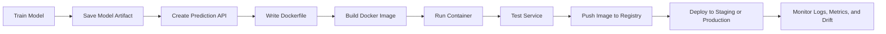
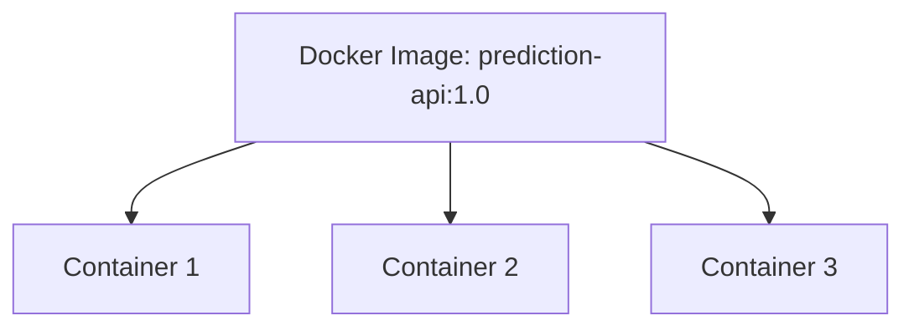
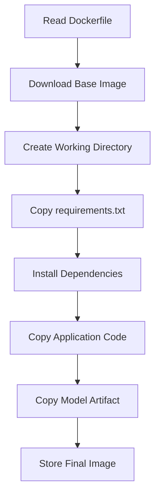
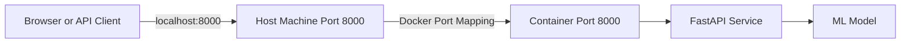
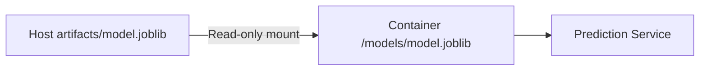
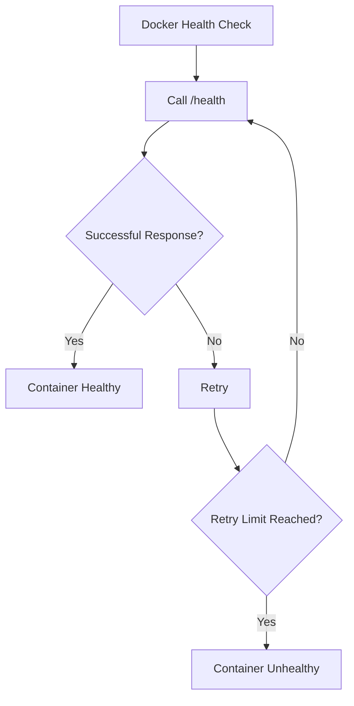
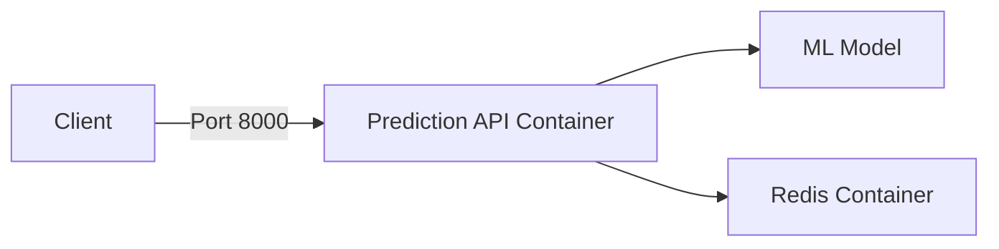
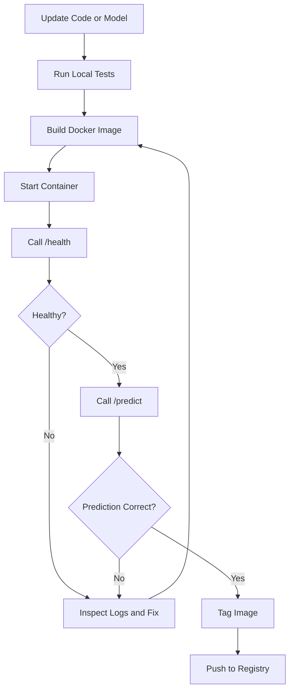
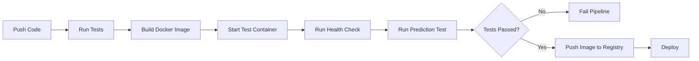
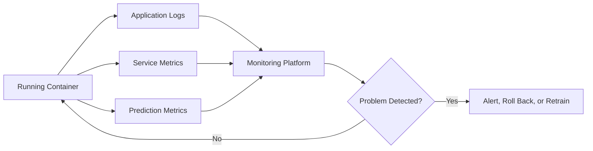

# 012 — Build and Run a Service

| Item                   | Details                   |
| ---------------------- | ------------------------- |
| **Course Section**     | 04 — MLOps and Deployment |
| **Module**             | Module 08 — MLOps         |
| **Content Group**      | Docker                    |
| **Roadmap Source**     | MLOps / Docker            |
| **Lesson Type**        | MLOps                     |
| **Order in Module**    | 012                       |
| **Suggested Duration** | 22 minutes                |

---

## 1. Lesson Overview

After writing a `Dockerfile`, the next step is to turn it into a runnable service.

This process has two main stages:

1. **Build an image** from the application code, dependencies, model artifact, and Dockerfile.
2. **Run a container** from that image.

```text
Application code + dependencies + model + Dockerfile
                         ↓
                    docker build
                         ↓
                    Docker image
                         ↓
                     docker run
                         ↓
                 Running container
                         ↓
                Accessible ML service
```

For an AI or data science project, the running container may expose:

* A prediction API.
* A batch-processing command.
* A model-monitoring service.
* A dashboard.
* A data-processing worker.
* A feature-engineering pipeline.
* A scheduled inference job.

The goal is to create a service that can run consistently on a developer laptop, CI server, staging environment, or cloud platform.

---

## 2. Learning Objectives

By the end of this lesson, you should be able to:

1. Explain the difference between a Docker image and a Docker container.
2. Build a Docker image from a Dockerfile.
3. Run an ML service inside a Docker container.
4. Publish a container port to the host machine.
5. pass configuration through environment variables.
6. Mount files and directories using Docker volumes.
7. inspect container logs and status.
8. Stop, restart, and remove containers safely.
9. Debug common build and runtime errors.
10. Create a reproducible Docker workflow for a machine learning API.

---

## 3. Where This Topic Fits in the MLOps Workflow

Building and running a service connects application development with deployment.



A notebook proves that a model works experimentally.

A running container proves that the model can operate as a service.

---

## 4. Docker Image vs. Docker Container

Docker images and containers are related but different.

| Concept          | Description                                                      |
| ---------------- | ---------------------------------------------------------------- |
| **Dockerfile**   | Instructions describing how to build the environment             |
| **Image**        | An immutable package containing the application and dependencies |
| **Container**    | A running instance of an image                                   |
| **Registry**     | A remote system used to store and distribute images              |
| **Volume**       | Persistent or shared storage mounted into a container            |
| **Port mapping** | Connection between a host port and a container port              |

### Analogy

```text
Dockerfile = recipe
Docker image = prepared package
Docker container = running application created from that package
```

One image can be used to start multiple containers.



Each container runs independently, even though all containers originate from the same image.

---

## 5. Example ML Service

Assume we have a FastAPI service that loads a trained model and exposes a `/predict` endpoint.

### Project Structure

```text
ml-prediction-service/
├── app/
│   ├── __init__.py
│   ├── main.py
│   └── schemas.py
├── artifacts/
│   └── model.joblib
├── tests/
│   └── test_api.py
├── .dockerignore
├── Dockerfile
├── requirements.txt
└── README.md
```

### Minimal FastAPI Application

```python
# app/main.py

from contextlib import asynccontextmanager
from pathlib import Path
import os

import joblib
import pandas as pd
from fastapi import FastAPI, HTTPException
from pydantic import BaseModel, Field


MODEL_PATH = Path(
    os.getenv("MODEL_PATH", "artifacts/model.joblib")
)

MODEL_VERSION = os.getenv(
    "MODEL_VERSION",
    "customer-churn-v1.0.0",
)

model = None


class PredictionRequest(BaseModel):
    age: int = Field(ge=18, le=120)
    monthly_spend: float = Field(ge=0)
    account_age_months: int = Field(ge=0)
    support_tickets: int = Field(ge=0)


class PredictionResponse(BaseModel):
    prediction: int
    probability: float
    model_version: str


@asynccontextmanager
async def lifespan(app: FastAPI):
    global model

    if not MODEL_PATH.exists():
        raise RuntimeError(
            f"Model artifact not found: {MODEL_PATH}"
        )

    model = joblib.load(MODEL_PATH)

    yield

    model = None


app = FastAPI(
    title="ML Prediction Service",
    version="1.0.0",
    lifespan=lifespan,
)


@app.get("/health")
def health_check() -> dict[str, str]:
    return {
        "status": "healthy",
        "model_version": MODEL_VERSION,
    }


@app.post(
    "/predict",
    response_model=PredictionResponse,
)
def predict(
    payload: PredictionRequest,
) -> PredictionResponse:
    if model is None:
        raise HTTPException(
            status_code=503,
            detail="Model is unavailable.",
        )

    features = pd.DataFrame(
        [payload.model_dump()]
    )

    prediction = int(model.predict(features)[0])
    probability = float(
        model.predict_proba(features)[0, 1]
    )

    return PredictionResponse(
        prediction=prediction,
        probability=round(probability, 4),
        model_version=MODEL_VERSION,
    )
```

---

## 6. Create the Dockerfile

A Dockerfile describes how Docker should package the service.

```dockerfile
FROM python:3.12-slim

WORKDIR /app

COPY requirements.txt .

RUN pip install \
    --no-cache-dir \
    -r requirements.txt

COPY app ./app
COPY artifacts ./artifacts

EXPOSE 8000

CMD [
    "uvicorn",
    "app.main:app",
    "--host",
    "0.0.0.0",
    "--port",
    "8000"
]
```

### Dockerfile Breakdown

#### Base Image

```dockerfile
FROM python:3.12-slim
```

This selects a lightweight Python environment.

#### Working Directory

```dockerfile
WORKDIR /app
```

All following commands run relative to `/app`.

#### Dependency Installation

```dockerfile
COPY requirements.txt .

RUN pip install \
    --no-cache-dir \
    -r requirements.txt
```

The dependency file is copied before the source code to improve Docker layer caching.

#### Copy Application Files

```dockerfile
COPY app ./app
COPY artifacts ./artifacts
```

This adds the API code and model artifact to the image.

#### Document the Service Port

```dockerfile
EXPOSE 8000
```

This documents that the application listens on port `8000`.

`EXPOSE` does not publish the port automatically. Port publishing happens when the container is started.

#### Start the Service

```dockerfile
CMD [
    "uvicorn",
    "app.main:app",
    "--host",
    "0.0.0.0",
    "--port",
    "8000"
]
```

The service listens on `0.0.0.0` so it can receive traffic from outside the container.

---

## 7. Create a `.dockerignore` File

A `.dockerignore` file prevents unnecessary files from being sent to the Docker build context.

```text
.git
.github
.venv
venv
__pycache__
*.pyc
*.pyo
.pytest_cache
.mypy_cache
.coverage
htmlcov
notebooks
data
logs
.env
README-drafts
```

Benefits include:

* Faster builds.
* Smaller build contexts.
* Reduced risk of copying secrets.
* Cleaner Docker images.
* Better layer caching.

Never copy files such as `.env`, credentials, API keys, or private datasets into an image.

---

## 8. Build the Docker Image

Run the build command from the directory containing the Dockerfile.

```bash
docker build -t ml-prediction-service:1.0.0 .
```

### Command Breakdown

```text
docker build
```

Starts an image build.

```text
-t ml-prediction-service:1.0.0
```

Assigns a name and tag to the image.

```text
.
```

Uses the current directory as the build context.

### Naming Structure

```text
repository-name:tag
```

Example:

```text
ml-prediction-service:1.0.0
```

Where:

* `ml-prediction-service` is the image repository name.
* `1.0.0` is the image tag.

---

## 9. Understanding the Build Process

During a build, Docker executes the Dockerfile instructions in order.



Each instruction creates a cached layer.

```text
Layer 1: Python base image
Layer 2: Working directory
Layer 3: requirements.txt
Layer 4: Python dependencies
Layer 5: API source code
Layer 6: model artifact
```

When rebuilding, Docker can reuse unchanged layers.

For example, changing only `app/main.py` should not require reinstalling all Python dependencies if `requirements.txt` is unchanged.

---

## 10. List Available Images

After the build completes, inspect local images:

```bash
docker image ls
```

Example output:

```text
REPOSITORY                 TAG       IMAGE ID       SIZE
ml-prediction-service      1.0.0     8cd14a920b71   315MB
python                     3.12-slim  511780f88f80   130MB
```

You can also use:

```bash
docker images
```

Inspect image details:

```bash
docker image inspect \
  ml-prediction-service:1.0.0
```

---

## 11. Run the Docker Container

Start a container from the image:

```bash
docker run \
  --name ml-prediction-api \
  -p 8000:8000 \
  ml-prediction-service:1.0.0
```

### Command Breakdown

```text
--name ml-prediction-api
```

Assigns a readable name to the container.

```text
-p 8000:8000
```

Maps the host port to the container port.

The format is:

```text
host_port:container_port
```

```text
localhost:8000
      ↓
container port 8000
      ↓
FastAPI service
```

### Port Mapping Diagram



---

## 12. Run a Container in Detached Mode

Without detached mode, the terminal remains attached to the running process.

Use `-d` to run the container in the background:

```bash
docker run \
  -d \
  --name ml-prediction-api \
  -p 8000:8000 \
  ml-prediction-service:1.0.0
```

Docker returns a container ID:

```text
6c863abc4436d1c2e6c39d7c52b875...
```

You can continue using the terminal while the service runs.

---

## 13. Test the Running Service

### Health Check

```bash
curl http://localhost:8000/health
```

Example response:

```json
{
  "status": "healthy",
  "model_version": "customer-churn-v1.0.0"
}
```

### Prediction Request

```bash
curl -X POST \
  "http://localhost:8000/predict" \
  -H "Content-Type: application/json" \
  -d '{
    "age": 35,
    "monthly_spend": 72.5,
    "account_age_months": 18,
    "support_tickets": 2
  }'
```

Example response:

```json
{
  "prediction": 1,
  "probability": 0.7824,
  "model_version": "customer-churn-v1.0.0"
}
```

### Interactive API Documentation

Open:

```text
http://localhost:8000/docs
```

FastAPI automatically provides a Swagger interface for testing the endpoints.

---

## 14. List Running Containers

Show currently running containers:

```bash
docker container ls
```

Equivalent command:

```bash
docker ps
```

Example output:

```text
CONTAINER ID   IMAGE                         PORTS
6c863abc4436   ml-prediction-service:1.0.0   0.0.0.0:8000->8000/tcp
```

Show all containers, including stopped containers:

```bash
docker container ls -a
```

Or:

```bash
docker ps -a
```

---

## 15. Inspect Container Logs

View container logs:

```bash
docker logs ml-prediction-api
```

Follow logs continuously:

```bash
docker logs -f ml-prediction-api
```

Show only the latest lines:

```bash
docker logs \
  --tail 100 \
  ml-prediction-api
```

Show logs generated during the last five minutes:

```bash
docker logs \
  --since 5m \
  ml-prediction-api
```

Typical logs may include:

```text
INFO: Started server process
INFO: Application startup complete
INFO: Uvicorn running on http://0.0.0.0:8000
INFO: 172.17.0.1 - "GET /health HTTP/1.1" 200
INFO: 172.17.0.1 - "POST /predict HTTP/1.1" 200
```

Logs are important for detecting:

* Startup failures.
* Missing model files.
* Invalid environment variables.
* Prediction exceptions.
* HTTP errors.
* Timeout problems.
* Dependency failures.

---

## 16. Stop and Restart the Service

Stop the container:

```bash
docker stop ml-prediction-api
```

Start it again:

```bash
docker start ml-prediction-api
```

Restart it:

```bash
docker restart ml-prediction-api
```

Remove a stopped container:

```bash
docker rm ml-prediction-api
```

Force-remove a running container:

```bash
docker rm -f ml-prediction-api
```

Use force removal carefully because it immediately stops the service.

---

## 17. Automatically Remove Temporary Containers

For local testing, use `--rm`:

```bash
docker run \
  --rm \
  -p 8000:8000 \
  ml-prediction-service:1.0.0
```

The container is automatically deleted after it stops.

This is useful for:

* Short experiments.
* Test runs.
* CI jobs.
* One-time batch commands.

Do not combine `--rm` with workflows that require inspecting the stopped container later.

---

## 18. Pass Environment Variables

Configuration should normally be separated from the Docker image.

Run the service with environment variables:

```bash
docker run \
  --rm \
  -p 8000:8000 \
  -e MODEL_VERSION=customer-churn-v1.1.0 \
  -e LOG_LEVEL=INFO \
  ml-prediction-service:1.0.0
```

Inside Python:

```python
import os

model_version = os.getenv(
    "MODEL_VERSION",
    "unknown",
)

log_level = os.getenv(
    "LOG_LEVEL",
    "INFO",
)
```

### Environment File

Create a local `.env` file:

```text
MODEL_VERSION=customer-churn-v1.1.0
LOG_LEVEL=INFO
MODEL_PATH=artifacts/model.joblib
```

Run with:

```bash
docker run \
  --rm \
  -p 8000:8000 \
  --env-file .env \
  ml-prediction-service:1.0.0
```

The `.env` file should usually be excluded from Git and Docker builds.

---

## 19. Mount a Model Artifact at Runtime

Instead of embedding the model inside the image, you can mount it from the host machine.

```bash
docker run \
  --rm \
  -p 8000:8000 \
  -e MODEL_PATH=/models/model.joblib \
  -v "$(pwd)/artifacts:/models:ro" \
  ml-prediction-service:1.0.0
```

### Volume Syntax

```text
host_path:container_path:mode
```

In this example:

```text
$(pwd)/artifacts
```

is the host directory.

```text
/models
```

is the container directory.

```text
ro
```

means read-only.

### Volume Diagram



Benefits include:

* Updating model artifacts without rebuilding application code.
* Keeping large models outside the image.
* Separating model lifecycle from API lifecycle.
* Using different models in different environments.

Risks include:

* Missing mount paths.
* File-permission problems.
* Model and code incompatibility.
* Harder reproducibility if artifact versions are not controlled.

---

## 20. Open a Shell Inside a Running Container

For debugging, execute a shell inside the container:

```bash
docker exec \
  -it \
  ml-prediction-api \
  /bin/sh
```

Some images include Bash:

```bash
docker exec \
  -it \
  ml-prediction-api \
  /bin/bash
```

Inside the container, you can inspect:

```bash
pwd
ls -la
ls -la artifacts
python --version
pip list
printenv
```

Exit the shell:

```bash
exit
```

Use this technique for debugging, not as a replacement for fixing the Dockerfile.

---

## 21. Run a One-Time Command

You can override the image’s default command.

Check the Python version:

```bash
docker run \
  --rm \
  ml-prediction-service:1.0.0 \
  python --version
```

Run tests inside the image:

```bash
docker run \
  --rm \
  ml-prediction-service:1.0.0 \
  pytest
```

Run a batch prediction script:

```bash
docker run \
  --rm \
  -v "$(pwd)/data:/data" \
  ml-prediction-service:1.0.0 \
  python -m app.batch_predict \
    --input /data/input.csv \
    --output /data/predictions.csv
```

This demonstrates that a Docker image can support both API and batch workloads.

---

## 22. Add a Health Check

A health check allows Docker or an orchestration platform to determine whether the service is functioning.

### Dockerfile Health Check

```dockerfile
HEALTHCHECK \
  --interval=30s \
  --timeout=5s \
  --start-period=20s \
  --retries=3 \
  CMD python -c \
  "import urllib.request; urllib.request.urlopen('http://localhost:8000/health')"
```

Inspect container health:

```bash
docker ps
```

Detailed health information:

```bash
docker inspect \
  ml-prediction-api
```

Possible statuses include:

```text
starting
healthy
unhealthy
```

### Health Check Flow



---

## 23. Add a Restart Policy

Docker can restart a service automatically after a failure.

```bash
docker run \
  -d \
  --name ml-prediction-api \
  --restart unless-stopped \
  -p 8000:8000 \
  ml-prediction-service:1.0.0
```

Common restart policies:

| Policy           | Behavior                                |
| ---------------- | --------------------------------------- |
| `no`             | Never restart automatically             |
| `on-failure`     | Restart only after a non-zero exit code |
| `always`         | Always restart after stopping           |
| `unless-stopped` | Restart unless manually stopped         |

A restart policy improves availability but does not fix the underlying cause of repeated crashes.

Always inspect logs and metrics when a container repeatedly restarts.

---

## 24. Resource Limits

Containers should not consume unlimited resources.

Example:

```bash
docker run \
  -d \
  --name ml-prediction-api \
  -p 8000:8000 \
  --memory 1g \
  --cpus 1.5 \
  ml-prediction-service:1.0.0
```

This limits the container to:

* 1 GB of memory.
* 1.5 CPU cores.

Resource limits help prevent one service from affecting other workloads.

Large machine learning models may require careful measurement of:

* Model-loading memory.
* Peak inference memory.
* CPU utilization.
* GPU memory.
* Concurrent request capacity.

---

## 25. Inspect Resource Usage

View live container resource usage:

```bash
docker stats
```

Example output:

```text
NAME                  CPU %    MEM USAGE / LIMIT
ml-prediction-api     12.4%    420MiB / 1GiB
```

Monitor:

* CPU percentage.
* Memory usage.
* Network input and output.
* Block input and output.
* Number of processes.

High memory usage may indicate:

* A large model.
* Too many worker processes.
* Request buffering.
* Memory leaks.
* Large temporary tensors.
* Unreleased data objects.

---

## 26. Build with Different Tags

Image tags identify releases.

```bash
docker build \
  -t ml-prediction-service:1.0.0 \
  .
```

After updating the service:

```bash
docker build \
  -t ml-prediction-service:1.1.0 \
  .
```

You may also assign multiple tags:

```bash
docker tag \
  ml-prediction-service:1.1.0 \
  ml-prediction-service:latest
```

Recommended tags include:

```text
1.0.0
1.1.0
2026-07-13
git-a4d92f1
staging
production
```

Avoid relying only on `latest` because it does not clearly identify the deployed version.

---

## 27. Rebuild Without Cache

Docker normally reuses cached layers.

Force a complete rebuild:

```bash
docker build \
  --no-cache \
  -t ml-prediction-service:1.0.0 \
  .
```

This may help when:

* Dependencies appear outdated.
* Cached layers are incorrect.
* Package installation is inconsistent.
* Debugging build-cache issues.

However, regular use of `--no-cache` makes builds slower and reduces the benefits of Docker layer caching.

---

## 28. Multi-Stage Build

A multi-stage build can reduce image size by separating build dependencies from runtime dependencies.

```dockerfile
FROM python:3.12-slim AS builder

WORKDIR /build

COPY requirements.txt .

RUN pip wheel \
    --no-cache-dir \
    --wheel-dir /wheels \
    -r requirements.txt


FROM python:3.12-slim AS runtime

WORKDIR /app

COPY --from=builder /wheels /wheels

RUN pip install \
    --no-cache-dir \
    /wheels/* \
    && rm -rf /wheels

COPY app ./app
COPY artifacts ./artifacts

RUN useradd \
    --create-home \
    appuser

USER appuser

EXPOSE 8000

CMD [
    "uvicorn",
    "app.main:app",
    "--host",
    "0.0.0.0",
    "--port",
    "8000"
]
```

Benefits include:

* Smaller runtime image.
* Fewer unnecessary build tools.
* Reduced attack surface.
* Cleaner separation of build and runtime stages.

---

## 29. Run as a Non-Root User

Containers run as root by default unless configured otherwise.

Create and use a non-root user:

```dockerfile
RUN useradd \
    --create-home \
    appuser

USER appuser
```

Running as a non-root user reduces the impact of a security vulnerability.

Additional security practices include:

* Use trusted base images.
* Pin dependency versions.
* Scan images for vulnerabilities.
* Do not embed secrets.
* Use read-only mounts where possible.
* Avoid unnecessary Linux packages.
* Limit CPU and memory.
* Keep the base image updated.

---

## 30. Docker Compose for Local Services

An ML API may depend on other services such as Redis, PostgreSQL, or Prometheus.

Docker Compose allows multiple containers to run together.

### `compose.yaml`

```yaml
services:
  prediction-api:
    build:
      context: .
    image: ml-prediction-service:1.0.0
    container_name: ml-prediction-api
    ports:
      - "8000:8000"
    environment:
      MODEL_VERSION: customer-churn-v1.0.0
      REDIS_URL: redis://redis:6379/0
    volumes:
      - ./artifacts:/models:ro
    depends_on:
      - redis
    restart: unless-stopped

  redis:
    image: redis:7-alpine
    container_name: prediction-redis
    restart: unless-stopped
```

Start all services:

```bash
docker compose up
```

Start in detached mode:

```bash
docker compose up -d
```

View logs:

```bash
docker compose logs -f
```

Stop and remove the services:

```bash
docker compose down
```

### Service Architecture



Inside the Compose network, the API can access Redis using the service name:

```text
redis:6379
```

It should not use `localhost:6379`, because `localhost` inside the API container refers to the API container itself.

---

## 31. Common Build Errors

### Error 1: Dockerfile Not Found

Example:

```text
failed to read dockerfile
```

Cause:

* The command was executed from the wrong directory.
* The Dockerfile has a different name.

Solution:

```bash
docker build \
  -f path/to/Dockerfile \
  -t ml-prediction-service:1.0.0 \
  .
```

---

### Error 2: File Not Found During `COPY`

Example:

```text
COPY failed: file not found
```

Possible causes:

* The source path is incorrect.
* The file is outside the build context.
* `.dockerignore` excludes the file.

Solution:

* Check the build context.
* Check the `COPY` path.
* Review `.dockerignore`.

---

### Error 3: Dependency Installation Fails

Possible causes:

* Incorrect package version.
* Missing system library.
* Unsupported Python version.
* Network failure.
* Architecture incompatibility.

Debug by inspecting the build output:

```bash
docker build \
  --progress=plain \
  -t ml-prediction-service:debug \
  .
```

---

### Error 4: Image Is Too Large

Possible causes:

* Large datasets copied into the image.
* Notebook outputs included.
* Unnecessary build tools.
* Large package caches.
* Multiple unused model files.

Solutions:

* Add `.dockerignore`.
* Use `--no-cache-dir`.
* Use a slim base image.
* Use multi-stage builds.
* Store large data externally.
* Remove temporary files.

---

## 32. Common Runtime Errors

### Error 1: Service Cannot Be Reached

Possible causes:

* Port was not published.
* Application listens only on `127.0.0.1`.
* Wrong host port.
* Container exited after startup.
* Firewall blocks the port.

Correct Uvicorn configuration:

```bash
uvicorn \
  app.main:app \
  --host 0.0.0.0 \
  --port 8000
```

Correct Docker port mapping:

```bash
docker run \
  -p 8000:8000 \
  ml-prediction-service:1.0.0
```

---

### Error 2: Port Is Already in Use

Example:

```text
Bind for 0.0.0.0:8000 failed:
port is already allocated
```

Use another host port:

```bash
docker run \
  -p 8080:8000 \
  ml-prediction-service:1.0.0
```

Access the service at:

```text
http://localhost:8080
```

The container still listens on port `8000`.

---

### Error 3: Model Artifact Not Found

Example:

```text
RuntimeError:
Model artifact not found
```

Check:

* The Dockerfile copied the artifact.
* The environment variable points to the correct path.
* The volume was mounted correctly.
* The file is not excluded by `.dockerignore`.

Inspect the container:

```bash
docker exec \
  -it \
  ml-prediction-api \
  ls -la /app/artifacts
```

---

### Error 4: Container Exits Immediately

Inspect its status:

```bash
docker ps -a
```

Read logs:

```bash
docker logs ml-prediction-api
```

Common causes include:

* Invalid startup command.
* Import error.
* Missing dependency.
* Missing model.
* Syntax error.
* Incorrect working directory.

---

### Error 5: Permission Denied

Possible causes:

* The non-root user cannot read the model.
* A mounted directory has incompatible permissions.
* The application writes to a read-only directory.

Check permissions:

```bash
docker exec \
  -it \
  ml-prediction-api \
  ls -la /models
```

Prefer mounting model artifacts as read-only when the application only needs to load them.

---

### Error 6: Dependency Version Mismatch

A model trained with one library version may fail under another.

Example:

```text
Incompatible scikit-learn version
```

Solution:

* Pin dependencies.
* Record the training environment.
* Include library versions in model metadata.
* Test model loading inside the final image.

Example `requirements.txt`:

```text
fastapi==0.116.1
uvicorn[standard]==0.35.0
pandas==2.3.1
scikit-learn==1.7.1
joblib==1.5.1
```

---

## 33. Build and Run Workflow

A reliable local workflow may look like this:



Example command sequence:

```bash
pytest

docker build \
  -t ml-prediction-service:1.0.0 \
  .

docker run \
  -d \
  --name ml-prediction-api \
  -p 8000:8000 \
  ml-prediction-service:1.0.0

curl http://localhost:8000/health

curl -X POST \
  http://localhost:8000/predict \
  -H "Content-Type: application/json" \
  -d @sample_request.json

docker logs ml-prediction-api

docker stop ml-prediction-api

docker rm ml-prediction-api
```

---

## 34. CI/CD Integration

The build and run process can be automated in CI/CD.



A CI job may:

1. Install test dependencies.
2. Run unit tests.
3. Build the image.
4. Start a temporary container.
5. Wait for `/health`.
6. Send a sample prediction request.
7. Stop the container.
8. Push the image if all checks pass.

Example smoke-test logic:

```bash
docker run \
  -d \
  --name test-api \
  -p 8000:8000 \
  ml-prediction-service:test

for attempt in $(seq 1 20); do
  if curl --fail \
    http://localhost:8000/health; then
    break
  fi

  sleep 2
done

curl --fail \
  -X POST \
  http://localhost:8000/predict \
  -H "Content-Type: application/json" \
  -d @sample_request.json

docker rm -f test-api
```

---

## 35. Production Monitoring

Building and running the service is not the end of the workflow.

Monitor infrastructure metrics:

* Container availability.
* Restart count.
* CPU usage.
* Memory usage.
* Request volume.
* Error rate.
* p50, p95, and p99 latency.
* Timeout count.
* Disk usage.

Monitor ML metrics:

* Feature distributions.
* Missing-value rates.
* Prediction distribution.
* Confidence distribution.
* Data drift.
* Model accuracy when labels arrive.
* Business outcome metrics.



---

## 36. Common Mistakes

### Mistake 1: Building Without an Image Tag

```bash
docker build .
```

This creates an image that is harder to identify.

Better:

```bash
docker build \
  -t ml-prediction-service:1.0.0 \
  .
```

---

### Mistake 2: Using Only the `latest` Tag

`latest` does not identify a specific release.

Better:

```text
ml-prediction-service:1.0.0
ml-prediction-service:git-a4d92f1
```

---

### Mistake 3: Running Without Port Mapping

The service runs inside the container but cannot be reached from the host.

Incorrect:

```bash
docker run \
  ml-prediction-service:1.0.0
```

Correct:

```bash
docker run \
  -p 8000:8000 \
  ml-prediction-service:1.0.0
```

---

### Mistake 4: Binding the API to `127.0.0.1`

Inside a container, binding to `127.0.0.1` prevents external access.

Use:

```text
0.0.0.0
```

---

### Mistake 5: Copying the Entire Project

```dockerfile
COPY . .
```

This may accidentally copy:

* Credentials.
* Local virtual environments.
* Large datasets.
* Git history.
* Notebook outputs.
* Temporary files.

Use `.dockerignore` and copy only required paths.

---

### Mistake 6: Storing Secrets in the Dockerfile

Incorrect:

```dockerfile
ENV API_KEY=secret-value
```

Secrets embedded in an image may be visible through image history.

Provide secrets at runtime through a secure secret-management system.

---

### Mistake 7: Not Pinning Dependencies

Unpinned dependencies make builds less reproducible.

Avoid:

```text
scikit-learn
pandas
fastapi
```

Prefer:

```text
scikit-learn==1.7.1
pandas==2.3.1
fastapi==0.116.1
```

---

### Mistake 8: Rebuilding the Image for Every Configuration Change

Configuration such as log level and model path should usually be supplied at runtime.

Use:

```bash
-e LOG_LEVEL=DEBUG
```

instead of changing the Dockerfile for every environment.

---

### Mistake 9: Ignoring Container Logs

A failed container often provides the cause in its logs.

Use:

```bash
docker logs container-name
```

before making assumptions.

---

### Mistake 10: No Health Check

A running process does not always mean the model service is ready.

A service may be running while:

* The model failed to load.
* A dependency is unavailable.
* Requests always return errors.
* Memory is exhausted.

Add a meaningful `/health` or `/ready` endpoint.

---

## 37. Practical Exercise

Build and run a Dockerized machine learning service.

### Required Tasks

1. Train or reuse a small machine learning model.
2. Save the complete preprocessing and model pipeline.
3. Create a FastAPI `/predict` endpoint.
4. Create a `/health` endpoint.
5. Write a Dockerfile.
6. Add a `.dockerignore` file.
7. Build a versioned Docker image.
8. Run the container on port `8000`.
9. Send a prediction request with `curl`.
10. Inspect the container logs.
11. Pass the model version through an environment variable.
12. Stop and remove the container.
13. Document all commands in the README.

### Suggested Commands

```bash
docker build \
  -t ml-prediction-service:1.0.0 \
  .

docker run \
  -d \
  --name ml-prediction-api \
  -p 8000:8000 \
  -e MODEL_VERSION=model-v1.0.0 \
  ml-prediction-service:1.0.0

docker ps

docker logs ml-prediction-api

curl http://localhost:8000/health

docker stats ml-prediction-api

docker stop ml-prediction-api

docker rm ml-prediction-api
```

---

## 38. Extended Exercise

Improve the basic service with the following features:

* Add a Docker health check.
* Run as a non-root user.
* Add CPU and memory limits.
* Mount the model as a read-only volume.
* Add structured JSON logging.
* Add API tests.
* Add a Redis container using Docker Compose.
* Add a smoke-test script.
* Create separate development and production image tags.
* Record build metadata such as Git commit and model version.
* Scan the image for vulnerabilities.
* Add a CI workflow that builds and tests the service.

---

## 39. Suggested README Structure

```markdown
# ML Prediction Service

## Problem

Explain the prediction problem and dataset.

## Model

Describe the algorithm, features, and evaluation metrics.

## Project Structure

Show the main files and directories.

## Requirements

List Docker and local requirements.

## Build the Image

Provide the docker build command.

## Run the Service

Provide the docker run command.

## Environment Variables

Document available configuration.

## API Endpoints

Document /health and /predict.

## Example Request

Provide a curl command and JSON payload.

## View Logs

Explain how to inspect logs.

## Stop the Service

Provide stop and remove commands.

## Testing

Explain how to run unit and integration tests.

## Monitoring

List service and model metrics.

## Limitations

Document assumptions and known problems.
```

---

## 40. Build and Run Checklist

### Dockerfile

* [ ] A suitable base image is used.
* [ ] Dependencies are pinned.
* [ ] Dependency installation is cached efficiently.
* [ ] Only required files are copied.
* [ ] The service listens on `0.0.0.0`.
* [ ] The container port is documented.
* [ ] The startup command is correct.
* [ ] The service runs as a non-root user when possible.

### Image

* [ ] The image has a meaningful name.
* [ ] The image has an explicit version tag.
* [ ] The model version is recorded.
* [ ] The image builds without errors.
* [ ] The final image size is reasonable.
* [ ] No credentials are stored in the image.

### Container

* [ ] The container starts successfully.
* [ ] The host port is mapped correctly.
* [ ] The health endpoint responds successfully.
* [ ] The prediction endpoint works.
* [ ] Logs are accessible.
* [ ] Environment variables are documented.
* [ ] CPU and memory requirements are known.
* [ ] A restart or rollback strategy exists.

### MLOps

* [ ] The model artifact is versioned.
* [ ] Training and serving dependencies are compatible.
* [ ] Prediction latency is measured.
* [ ] Input and output schemas are documented.
* [ ] Service metrics are monitored.
* [ ] Prediction distributions are monitored.
* [ ] Drift monitoring is planned.
* [ ] The previous stable image can be restored.

---

## 41. Completion Checklist

* [ ] I can explain the difference between an image and a container.
* [ ] I can build an image from a Dockerfile.
* [ ] I can assign a name and version tag to an image.
* [ ] I can run a container in foreground and detached modes.
* [ ] I understand host-to-container port mapping.
* [ ] I can test `/health` and `/predict`.
* [ ] I can inspect container logs.
* [ ] I can pass environment variables at runtime.
* [ ] I can mount a model or configuration file.
* [ ] I can stop, restart, and remove containers.
* [ ] I can debug common build and runtime errors.
* [ ] I can document the build and run workflow in a README.
* [ ] I have recorded at least one production limitation or open question.

---

## 42. Related Outcome

Deploy, version, monitor, and operate machine learning models using:

* Prediction APIs.
* Docker images.
* Docker containers.
* Environment-based configuration.
* Persistent volumes.
* Health checks.
* Automated testing.
* CI/CD pipelines.
* Service monitoring.
* Drift-aware workflows.
* Safe deployment and rollback.

---

## 43. Related Mini Project

### Deploy an ML Model API

Create a repository containing:

```text
ml-prediction-service/
├── app/
│   ├── main.py
│   └── schemas.py
├── artifacts/
│   └── model.joblib
├── tests/
│   └── test_api.py
├── .dockerignore
├── compose.yaml
├── Dockerfile
├── requirements.txt
├── sample_request.json
└── README.md
```

The project should demonstrate:

* Training or loading an ML model.
* Serving predictions through FastAPI.
* Building a versioned Docker image.
* Running the service locally.
* Passing configuration through environment variables.
* Testing the API.
* Viewing logs and resource usage.
* Documenting monitoring and rollback strategies.

---

## 44. Summary

Building and running a service transforms application code into an executable, reproducible deployment unit.

The main workflow is:

```text
source code
    +
dependencies
    +
model artifact
    +
Dockerfile
        ↓
docker build
        ↓
versioned Docker image
        ↓
docker run
        ↓
running container
        ↓
health and prediction tests
        ↓
logs and resource monitoring
        ↓
registry and deployment
```

The essential commands are:

```bash
# Build an image
docker build \
  -t ml-prediction-service:1.0.0 \
  .

# Run the service
docker run \
  -d \
  --name ml-prediction-api \
  -p 8000:8000 \
  ml-prediction-service:1.0.0

# Inspect running containers
docker ps

# View logs
docker logs -f ml-prediction-api

# Test the service
curl http://localhost:8000/health

# Stop the service
docker stop ml-prediction-api

# Remove the container
docker rm ml-prediction-api
```

A strong MLOps portfolio should not contain only a notebook or model file. It should also demonstrate how to build, configure, start, test, monitor, stop, and reproduce the service using Docker.

---

# Bài luyện tập

## Mục tiêu


## Đề bài


## Yêu cầu hoàn thành

- [ ] 
- [ ] 
- [ ] 

## Kết quả / lời giải


## Ghi chú
