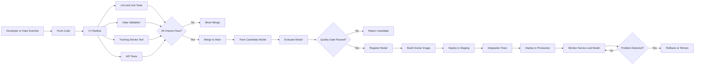
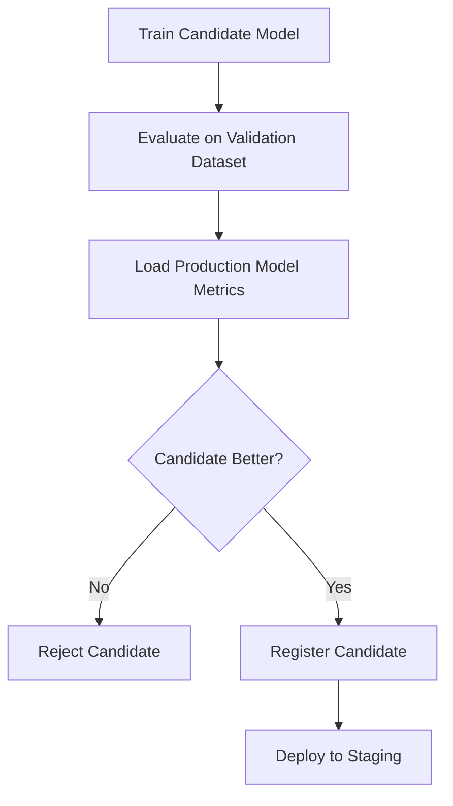
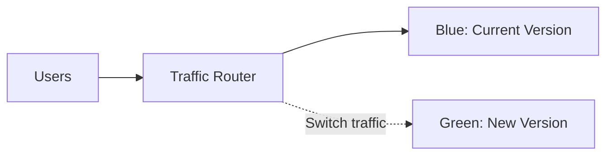
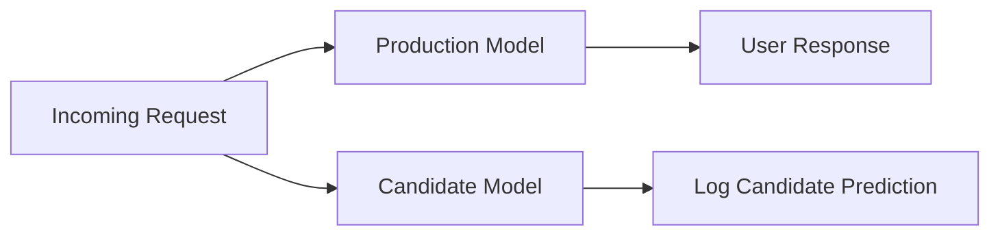
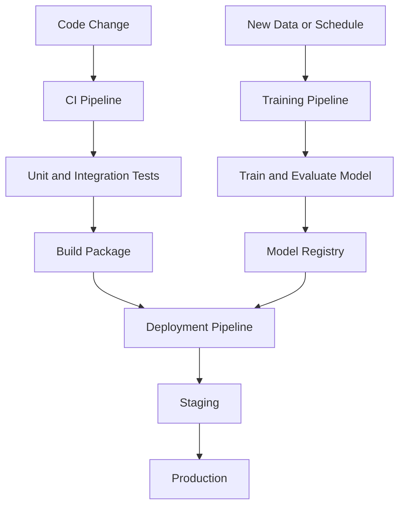
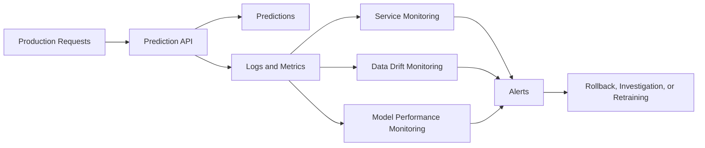
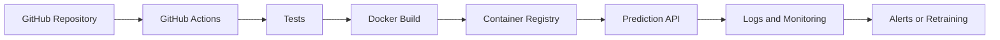

# 013 — CI/CD for Machine Learning

**Course:** 04 — MLOps and Deployment
**Module:** Module 08 — MLOps
**Content Group:** CI/CD
**Roadmap Source:** MLOps / CI/CD
**Lesson Type:** MLOps
**Order in Module:** 013
**Suggested Duration:** 22 minutes

---

## 1. Lesson Overview

**CI/CD for Machine Learning** applies software engineering automation to the process of building, testing, packaging, deploying, and monitoring machine learning systems.

In a traditional software project, CI/CD mainly validates source code and deploys an application. In an ML project, the workflow must also validate:

* Training data
* Data preprocessing
* Model artifacts
* Model quality
* Experiment configuration
* Inference behavior
* Infrastructure
* Production performance

The goal is to move from a manually executed notebook to a reproducible and reliable ML service.

```text
Notebook
   ↓
Reusable training pipeline
   ↓
Automated tests
   ↓
Versioned model artifact
   ↓
Docker image
   ↓
Automated deployment
   ↓
Monitoring and rollback
```

---

## 2. Learning Objectives

After completing this lesson, you should be able to:

* Explain CI/CD for ML in your own words.
* Distinguish CI, Continuous Delivery, Continuous Deployment, and Continuous Training.
* Identify the position of CI/CD in an end-to-end ML workflow.
* Describe how ML CI/CD differs from traditional software CI/CD.
* Add automated tests to an ML project.
* Package a prediction API with Docker.
* Create a basic GitHub Actions workflow.
* Define model quality gates before deployment.
* Explain how model versioning, monitoring, and rollback support production reliability.

---

## 3. Why ML Projects Need CI/CD

A model that performs well inside a notebook is not automatically ready for production.

Production ML systems must handle several additional requirements:

* The code must run consistently on another machine.
* The same preprocessing must be used during training and inference.
* Dependencies must be reproducible.
* The model must satisfy minimum quality requirements.
* The API must return valid responses.
* Failed deployments must be reversible.
* Model and data changes must be traceable.
* Production predictions must be monitored.

Without automation, every deployment depends on manual actions and personal knowledge.

This creates several risks:

* Different environments produce different results.
* A new model may have worse accuracy than the previous model.
* A preprocessing change may break inference.
* A dependency update may cause runtime errors.
* A model may be deployed without testing.
* Teams may not know which data produced a model.
* Rollback may be slow or impossible.

CI/CD reduces these risks by turning deployment steps into a repeatable pipeline.

---

## 4. What CI/CD Means

### 4.1 Continuous Integration

**Continuous Integration**, or CI, automatically validates changes whenever developers push code or open a pull request.

Typical CI tasks include:

* Installing dependencies
* Checking code formatting
* Running static analysis
* Running unit tests
* Validating data schemas
* Testing feature transformations
* Testing model loading
* Testing API endpoints
* Running a small training smoke test
* Checking model quality thresholds

The objective of CI is to detect problems before changes are merged.

```text
Developer pushes code
         ↓
Install dependencies
         ↓
Lint and type-check
         ↓
Run tests
         ↓
Validate model
         ↓
Allow or block merge
```

---

### 4.2 Continuous Delivery

**Continuous Delivery** means that every validated change is packaged and prepared for deployment.

However, production deployment still requires manual approval.

Example:

```text
Tests pass
   ↓
Build Docker image
   ↓
Push image to registry
   ↓
Deploy to staging
   ↓
Manual approval
   ↓
Deploy to production
```

Continuous Delivery is useful when a team wants automation but still requires human review before production release.

---

### 4.3 Continuous Deployment

**Continuous Deployment** automatically deploys every change that passes all required quality gates.

```text
Code change
   ↓
Automated tests
   ↓
Model validation
   ↓
Build artifact
   ↓
Deploy automatically
```

Continuous Deployment provides faster releases, but it requires strong testing, monitoring, and rollback mechanisms.

---

### 4.4 Continuous Training

Machine learning introduces another important concept: **Continuous Training**, sometimes abbreviated as CT.

Continuous Training automatically retrains a model when a trigger occurs.

Possible triggers include:

* New labeled data becomes available
* A scheduled retraining date is reached
* Data drift exceeds a threshold
* Model performance decreases
* A new training pipeline version is released
* A business rule changes

```text
New data or drift alert
          ↓
Validate training data
          ↓
Train candidate model
          ↓
Evaluate candidate
          ↓
Compare with current model
          ↓
Register and deploy if better
```

Continuous Training should not automatically replace the current model unless the candidate passes validation.

---

## 5. CI/CD Versus CI/CD for ML

Traditional software CI/CD mainly focuses on code. ML CI/CD must manage code, data, experiments, and model artifacts.

| Area              | Traditional Software       | Machine Learning                                     |
| ----------------- | -------------------------- | ---------------------------------------------------- |
| Main artifact     | Application package        | Model, code, preprocessing, metadata                 |
| Main input        | Source code                | Source code and data                                 |
| Testing           | Unit and integration tests | Code, data, model, pipeline, and inference tests     |
| Versioning        | Code version               | Code, data, model, configuration                     |
| Quality gate      | Tests pass                 | Tests pass and model metrics satisfy thresholds      |
| Deployment target | Application service        | Prediction service, batch job, or model endpoint     |
| Production risk   | Software defects           | Software defects, drift, bias, and performance decay |
| Update trigger    | Code change                | Code change, data change, schedule, or drift         |
| Monitoring        | Errors, latency, uptime    | Errors, latency, drift, prediction quality           |

---

## 6. The End-to-End ML CI/CD Workflow



---

## 7. Components of an ML CI/CD Pipeline

### 7.1 Source-Code Versioning

The project code should be stored in a version-control system such as Git.

Version-controlled files normally include:

```text
src/
tests/
Dockerfile
requirements.txt
pyproject.toml
README.md
.github/workflows/
configs/
```

Avoid storing large model artifacts directly in Git. Use a model registry, object storage, or a tool such as DVC when appropriate.

---

### 7.2 Data Validation

Training code should not assume that incoming data is valid.

Data validation can check:

* Required columns
* Column data types
* Missing-value ratios
* Allowed categories
* Numerical ranges
* Duplicate rows
* Class distribution
* Dataset size
* Schema compatibility

Example:

```python
import pandas as pd


REQUIRED_COLUMNS = {
    "age",
    "monthly_income",
    "account_balance",
    "churn",
}


def validate_training_data(data: pd.DataFrame) -> None:
    missing_columns = REQUIRED_COLUMNS - set(data.columns)

    if missing_columns:
        raise ValueError(
            f"Missing required columns: {sorted(missing_columns)}"
        )

    if data.empty:
        raise ValueError("Training dataset must not be empty.")

    if data["churn"].isna().any():
        raise ValueError("Target column contains missing values.")

    if not data["churn"].isin([0, 1]).all():
        raise ValueError("Target values must be either 0 or 1.")
```

A failed validation should stop the pipeline before training begins.

---

### 7.3 Unit Testing

Unit tests validate small pieces of the ML system.

Useful unit-test targets include:

* Feature transformations
* Missing-value handling
* Category encoding
* Input validation
* Metric calculation
* Model serialization
* Prediction output formatting

Example:

```python
from src.features import calculate_balance_ratio


def test_calculate_balance_ratio() -> None:
    result = calculate_balance_ratio(
        account_balance=5000.0,
        monthly_income=2500.0,
    )

    assert result == 2.0
```

---

### 7.4 Pipeline Testing

Pipeline tests verify that several components work together.

For example:

```text
Raw data
   ↓
Preprocessing
   ↓
Feature transformation
   ↓
Model prediction
   ↓
Valid response
```

A pipeline test should verify that:

* The preprocessing pipeline accepts expected input.
* The model receives the correct feature order.
* The output has the expected shape.
* Prediction values are valid.
* No training-only transformation is missing during inference.

---

### 7.5 Training Smoke Tests

A full training job may be expensive. CI pipelines can use a small dataset to verify that training code executes successfully.

```python
def test_training_pipeline_runs(sample_training_data):
    model, metrics = train_model(
        sample_training_data,
        max_rows=100,
    )

    assert model is not None
    assert "accuracy" in metrics
    assert 0.0 <= metrics["accuracy"] <= 1.0
```

A smoke test verifies execution, not final production quality.

---

### 7.6 Model Quality Gates

A model should not be deployed only because the code runs.

A quality gate defines the minimum conditions required for deployment.

Example:

```python
MIN_ACCURACY = 0.82
MIN_RECALL = 0.75
MAX_INFERENCE_MS = 100


def validate_model(metrics: dict[str, float]) -> None:
    if metrics["accuracy"] < MIN_ACCURACY:
        raise ValueError("Accuracy is below the required threshold.")

    if metrics["recall"] < MIN_RECALL:
        raise ValueError("Recall is below the required threshold.")

    if metrics["inference_latency_ms"] > MAX_INFERENCE_MS:
        raise ValueError("Inference latency is too high.")
```

Possible quality gates include:

* Accuracy greater than a minimum value
* F1 score greater than a minimum value
* Recall for an important class greater than a minimum value
* Fairness metric within an accepted range
* Inference latency below a threshold
* Model size below a threshold
* No significant regression compared with the current model

---

## 8. Candidate Model Versus Current Production Model

A fixed threshold is useful, but comparing the new model with the production model is often more reliable.



Example promotion rule:

```python
def should_promote_model(
    candidate_f1: float,
    production_f1: float,
    minimum_improvement: float = 0.01,
) -> bool:
    return candidate_f1 >= production_f1 + minimum_improvement
```

The definition of “better” depends on the business objective.

A model with slightly higher accuracy may still be rejected if it has:

* Much higher latency
* Lower recall for critical cases
* Larger infrastructure cost
* Worse fairness metrics
* Less stable predictions

---

## 9. Model Versioning

A production model should have a unique version.

Useful metadata includes:

* Model version
* Git commit hash
* Training dataset version
* Feature pipeline version
* Hyperparameters
* Evaluation metrics
* Training timestamp
* Python and library versions
* Model stage
* Model owner

Example metadata:

```json
{
  "model_name": "customer-churn-classifier",
  "model_version": "1.4.0",
  "git_commit": "6d8bc71",
  "dataset_version": "churn-data-2026-07",
  "accuracy": 0.874,
  "f1_score": 0.842,
  "stage": "staging"
}
```

This information makes an experiment reproducible and supports rollback.

---

## 10. Model Registry

A model registry stores and organizes model artifacts.

Typical model stages include:

```text
Development
    ↓
Candidate
    ↓
Staging
    ↓
Production
    ↓
Archived
```

A model registry can provide:

* Model artifact storage
* Version history
* Metrics and metadata
* Stage transitions
* Approval workflows
* Production model discovery
* Rollback support

Tools commonly used for this purpose include MLflow and managed cloud model registries.

---

## 11. Deployment Strategies

### 11.1 Recreate Deployment

The old version is stopped before the new version starts.

```text
Version 1 stopped
       ↓
Version 2 started
```

Advantages:

* Simple to implement
* Low infrastructure cost

Disadvantages:

* Possible downtime
* Difficult to test with real traffic before full release

---

### 11.2 Rolling Deployment

Instances are replaced gradually.

```text
V1 V1 V1 V1
   ↓
V2 V1 V1 V1
   ↓
V2 V2 V1 V1
   ↓
V2 V2 V2 V2
```

Advantages:

* Reduced downtime
* Gradual replacement

Disadvantages:

* Two versions may operate simultaneously
* Backward compatibility is important

---

### 11.3 Blue-Green Deployment

Two complete environments are maintained.



The new version is deployed to the inactive environment. Traffic switches only after validation.

Advantages:

* Fast rollback
* Minimal downtime

Disadvantages:

* Requires duplicate infrastructure
* More expensive

---

### 11.4 Canary Deployment

A small percentage of traffic is sent to the new version.

```text
95% traffic → Production model V1
 5% traffic → Candidate model V2
```

The new version is promoted gradually if its metrics remain healthy.

Canary metrics may include:

* Error rate
* Latency
* Prediction distribution
* User conversion
* Model accuracy from delayed labels
* Business outcome

---

### 11.5 Shadow Deployment

The production model serves the response, while the candidate model receives a copy of the request.



The candidate output is not shown to users.

This strategy is useful for comparing predictions safely under real production traffic.

---

## 12. Rollback

Rollback restores a previous stable version when the new deployment fails.

Rollback may be triggered by:

* High API error rate
* Increased prediction latency
* Invalid output
* Infrastructure failure
* Unexpected prediction distribution
* Business metric regression
* Severe data drift
* Incorrect model artifact

A rollback plan should identify:

* The previous stable Docker image
* The previous production model version
* The previous preprocessing version
* The deployment command
* The person or system authorized to trigger rollback

```text
Model V3 produces errors
          ↓
Monitoring alert
          ↓
Stop or redirect V3 traffic
          ↓
Restore model V2
          ↓
Investigate failure
```

Never overwrite a model artifact without preserving its version history.

---

## 13. Example Project Structure

```text
ml-cicd-project/
├── .github/
│   └── workflows/
│       ├── ci.yml
│       └── deploy.yml
├── artifacts/
│   └── model.joblib
├── configs/
│   └── model.yaml
├── data/
│   └── sample.csv
├── src/
│   ├── __init__.py
│   ├── api.py
│   ├── features.py
│   ├── predict.py
│   └── train.py
├── tests/
│   ├── test_api.py
│   ├── test_features.py
│   └── test_model.py
├── .dockerignore
├── Dockerfile
├── requirements.txt
├── README.md
└── pyproject.toml
```

---

## 14. Example FastAPI Prediction Service

```python
from pathlib import Path

import joblib
import numpy as np
from fastapi import FastAPI, HTTPException
from pydantic import BaseModel, Field


MODEL_PATH = Path("artifacts/model.joblib")

app = FastAPI(
    title="Customer Churn Prediction API",
    version="1.0.0",
)


class PredictionRequest(BaseModel):
    age: int = Field(ge=18, le=100)
    monthly_income: float = Field(gt=0)
    account_balance: float


class PredictionResponse(BaseModel):
    prediction: int
    probability: float
    model_version: str


if not MODEL_PATH.exists():
    raise RuntimeError(f"Model artifact not found: {MODEL_PATH}")

model = joblib.load(MODEL_PATH)


@app.get("/health")
def health_check() -> dict[str, str]:
    return {
        "status": "healthy",
        "model_version": "1.0.0",
    }


@app.post("/predict", response_model=PredictionResponse)
def predict(request: PredictionRequest) -> PredictionResponse:
    try:
        features = np.array(
            [[
                request.age,
                request.monthly_income,
                request.account_balance,
            ]]
        )

        probability = float(model.predict_proba(features)[0, 1])
        prediction = int(probability >= 0.5)

        return PredictionResponse(
            prediction=prediction,
            probability=probability,
            model_version="1.0.0",
        )
    except Exception as error:
        raise HTTPException(
            status_code=500,
            detail="Prediction failed.",
        ) from error
```

---

## 15. API Test Example

```python
from fastapi.testclient import TestClient

from src.api import app


client = TestClient(app)


def test_health_endpoint() -> None:
    response = client.get("/health")

    assert response.status_code == 200
    assert response.json()["status"] == "healthy"


def test_predict_endpoint() -> None:
    response = client.post(
        "/predict",
        json={
            "age": 35,
            "monthly_income": 2500,
            "account_balance": 4000,
        },
    )

    assert response.status_code == 200

    payload = response.json()

    assert payload["prediction"] in [0, 1]
    assert 0.0 <= payload["probability"] <= 1.0
    assert "model_version" in payload


def test_invalid_age_is_rejected() -> None:
    response = client.post(
        "/predict",
        json={
            "age": 10,
            "monthly_income": 2500,
            "account_balance": 4000,
        },
    )

    assert response.status_code == 422
```

---

## 16. Dockerfile Example

```dockerfile
FROM python:3.12-slim

ENV PYTHONDONTWRITEBYTECODE=1
ENV PYTHONUNBUFFERED=1

WORKDIR /app

COPY requirements.txt .

RUN pip install --no-cache-dir \
    --upgrade pip \
    && pip install --no-cache-dir -r requirements.txt

COPY src ./src
COPY artifacts ./artifacts

RUN useradd --create-home appuser
USER appuser

EXPOSE 8000

HEALTHCHECK \
    --interval=30s \
    --timeout=5s \
    --start-period=10s \
    --retries=3 \
    CMD python -c \
    "import urllib.request; urllib.request.urlopen('http://localhost:8000/health')"

CMD [
    "uvicorn",
    "src.api:app",
    "--host",
    "0.0.0.0",
    "--port",
    "8000"
]
```

Build and run the service:

```bash
docker build -t churn-api:1.0.0 .

docker run \
  --rm \
  -p 8000:8000 \
  churn-api:1.0.0
```

Send a request:

```bash
curl -X POST "http://localhost:8000/predict" \
  -H "Content-Type: application/json" \
  -d '{
    "age": 35,
    "monthly_income": 2500,
    "account_balance": 4000
  }'
```

Example response:

```json
{
  "prediction": 1,
  "probability": 0.7824,
  "model_version": "1.0.0"
}
```

---

## 17. Basic GitHub Actions CI Workflow

Create the following file:

```text
.github/workflows/ci.yml
```

```yaml
name: ML CI

on:
  push:
    branches:
      - main
      - develop

  pull_request:
    branches:
      - main
      - develop

jobs:
  test:
    runs-on: ubuntu-latest

    steps:
      - name: Check out repository
        uses: actions/checkout@v4

      - name: Set up Python
        uses: actions/setup-python@v5
        with:
          python-version: "3.12"
          cache: "pip"

      - name: Install dependencies
        run: |
          python -m pip install --upgrade pip
          pip install -r requirements.txt
          pip install pytest ruff mypy

      - name: Check formatting and linting
        run: |
          ruff check src tests

      - name: Run type checking
        run: |
          mypy src

      - name: Run tests
        run: |
          pytest tests --verbose

      - name: Validate model artifact
        run: |
          python -m src.predict --health-check

      - name: Build Docker image
        run: |
          docker build -t churn-api:${{ github.sha }} .
```

This workflow blocks unsafe changes before they reach the main branch.

---

## 18. Example Deployment Workflow

```yaml
name: Deploy ML API

on:
  push:
    branches:
      - main

jobs:
  deploy:
    runs-on: ubuntu-latest

    permissions:
      contents: read
      packages: write

    steps:
      - name: Check out repository
        uses: actions/checkout@v4

      - name: Log in to container registry
        uses: docker/login-action@v3
        with:
          registry: ghcr.io
          username: ${{ github.actor }}
          password: ${{ secrets.GITHUB_TOKEN }}

      - name: Build Docker image
        run: |
          docker build \
            -t ghcr.io/${{ github.repository }}/churn-api:${{ github.sha }} \
            -t ghcr.io/${{ github.repository }}/churn-api:latest \
            .

      - name: Push Docker image
        run: |
          docker push \
            ghcr.io/${{ github.repository }}/churn-api:${{ github.sha }}

          docker push \
            ghcr.io/${{ github.repository }}/churn-api:latest

      - name: Deploy to staging
        run: |
          echo "Run the staging deployment command here"

      - name: Run staging health check
        run: |
          echo "Call the staging /health endpoint here"

      - name: Deploy to production
        run: |
          echo "Run the production deployment command here"
```

In a real project, sensitive values must be stored in a secure secrets manager rather than committed to the repository.

---

## 19. Separating CI, Training, and Deployment

A production system should usually separate different responsibilities.



### CI Pipeline

Triggered by:

* Code push
* Pull request

Responsibilities:

* Validate code
* Run tests
* Build package
* Build Docker image

### Training Pipeline

Triggered by:

* New data
* Schedule
* Manual request
* Drift event

Responsibilities:

* Validate data
* Train model
* Evaluate model
* Register candidate

### Deployment Pipeline

Triggered by:

* Approved model version
* Release tag
* Merge to production branch

Responsibilities:

* Deploy model
* Run health checks
* Shift traffic
* Monitor release
* Roll back if necessary

---

## 20. Environment Promotion

Models should move through controlled environments.

```text
Local Development
        ↓
CI Test Environment
        ↓
Staging
        ↓
Production
```

### Local Development

Used for:

* Exploration
* Debugging
* Notebook experiments
* Small-scale training

### CI Environment

Used for:

* Automated testing
* Data schema validation
* Training smoke tests
* Docker build validation

### Staging

Used for:

* Integration tests
* API contract tests
* Load tests
* Shadow traffic
* Release verification

### Production

Used for:

* Real predictions
* Monitoring
* Alerting
* Business impact measurement

---

## 21. Production Monitoring

Deployment is not the end of the ML lifecycle.

A production ML service should monitor four main areas.

### 21.1 Infrastructure Metrics

* CPU usage
* Memory usage
* Disk usage
* Number of running instances
* Container restart count

### 21.2 Service Metrics

* Request count
* Error rate
* Prediction latency
* Throughput
* Timeout rate
* Availability

### 21.3 Data Metrics

* Missing-value rate
* Feature distributions
* Unknown categories
* Out-of-range values
* Data drift
* Schema changes

### 21.4 Model Metrics

* Prediction distribution
* Confidence distribution
* Accuracy
* Precision
* Recall
* F1 score
* Calibration
* Business KPI
* Concept drift



---

## 22. Prediction Logging

A prediction log can include:

```json
{
  "request_id": "req-12f94",
  "timestamp": "2026-07-13T08:30:00Z",
  "model_name": "customer-churn-classifier",
  "model_version": "1.4.0",
  "prediction": 1,
  "probability": 0.7824,
  "latency_ms": 34.7,
  "status": "success"
}
```

Be careful when logging input features.

Production logs must not expose:

* Passwords
* Authentication tokens
* Personal identifiers
* Medical information
* Financial secrets
* Other sensitive data

Use redaction, hashing, aggregation, or secure storage where necessary.

---

## 23. Testing Pyramid for ML Systems

```text
                 ┌───────────────────────────┐
                 │ Production / Canary Tests │
                 └───────────────────────────┘
              ┌─────────────────────────────────┐
              │ End-to-End and Integration Tests │
              └─────────────────────────────────┘
           ┌───────────────────────────────────────┐
           │ Data, Model, and Pipeline Tests        │
           └───────────────────────────────────────┘
        ┌─────────────────────────────────────────────┐
        │ Unit Tests                                   │
        └─────────────────────────────────────────────┘
```

A healthy ML project normally has:

* Many fast unit tests
* A moderate number of pipeline tests
* Fewer expensive end-to-end tests
* Carefully controlled production experiments

---

## 24. Common Pipeline Triggers

| Trigger               | Possible Action                        |
| --------------------- | -------------------------------------- |
| Pull request opened   | Run linting, unit tests, and API tests |
| Code merged to `main` | Build and publish Docker image         |
| New dataset version   | Train a candidate model                |
| Weekly schedule       | Retrain and evaluate model             |
| Drift alert           | Start investigation or retraining      |
| Model approved        | Deploy to staging                      |
| Release tag created   | Deploy to production                   |
| Error-rate alert      | Roll back deployment                   |

---

## 25. Common Mistakes

### 25.1 Keeping Everything in a Notebook

A notebook is useful for exploration, but production code should be moved into reusable modules.

Poor structure:

```text
train_model.ipynb
```

Better structure:

```text
notebooks/
src/features.py
src/train.py
src/evaluate.py
src/api.py
tests/
```

---

### 25.2 Testing Only the Code

An ML pipeline can pass normal unit tests while still producing a poor model.

Also test:

* Data schema
* Feature distributions
* Model quality
* Inference latency
* Prediction format
* Comparison with the production model

---

### 25.3 Using Different Preprocessing in Training and Production

This creates training-serving skew.

Incorrect workflow:

```text
Training preprocessing A → Model
Production preprocessing B → Model
```

Correct workflow:

```text
Shared preprocessing pipeline
        ├── Training
        └── Production inference
```

Store preprocessing and model logic together whenever possible.

---

### 25.4 Deploying Every Newly Trained Model

A retrained model is only a candidate.

It should be deployed only after:

* Data validation
* Evaluation
* Baseline comparison
* Fairness checks
* Latency tests
* Approval or automated quality gates

---

### 25.5 Overwriting Model Files

Avoid using only:

```text
model.pkl
```

Prefer immutable versions:

```text
customer-churn/
├── 1.2.0/
│   └── model.joblib
├── 1.3.0/
│   └── model.joblib
└── 1.4.0/
    └── model.joblib
```

---

### 25.6 Ignoring Rollback

A deployment process is incomplete unless it can restore a stable version.

Before deploying, answer:

* What is the previous stable model?
* Where is its artifact stored?
* Which container image contains it?
* How will traffic be switched back?
* How long will rollback take?
* Which metrics trigger rollback?

---

### 25.7 Ignoring Monitoring

A successful HTTP response does not guarantee a useful model.

The API may remain available while:

* Input distributions change
* Predictions collapse into one class
* Accuracy decreases
* Confidence becomes poorly calibrated
* Business outcomes deteriorate

---

### 25.8 Storing Secrets in the Repository

Never commit credentials directly into:

```yaml
password: my-secret-password
api_key: abc123
```

Use:

* GitHub Actions Secrets
* Cloud secrets managers
* Environment variables
* Workload identity
* Short-lived credentials

---

## 26. Practical Exercise

Build a small CI/CD-ready ML service.

### Task 1 — Train and Save a Model

Create a training script that:

* Loads a dataset
* Splits training and validation data
* Creates a preprocessing pipeline
* Trains a model
* Calculates evaluation metrics
* Saves the model artifact
* Saves model metadata

Suggested datasets:

* Iris classification
* Titanic survival
* Customer churn
* House-price prediction
* Loan default prediction

---

### Task 2 — Create a Prediction API

Build a FastAPI service with:

```text
GET  /health
POST /predict
```

The `/health` endpoint should return:

```json
{
  "status": "healthy",
  "model_version": "1.0.0"
}
```

The `/predict` endpoint should:

* Validate request data
* Apply preprocessing
* Generate a prediction
* Return the prediction
* Return the model version

---

### Task 3 — Add Automated Tests

Create tests for:

* Health endpoint
* Valid prediction request
* Invalid request
* Feature transformation
* Model loading
* Prediction value range

Run them with:

```bash
pytest tests --verbose
```

---

### Task 4 — Add Docker

Create:

```text
Dockerfile
.dockerignore
```

Verify the service:

```bash
docker build -t ml-api:local .
docker run --rm -p 8000:8000 ml-api:local
```

---

### Task 5 — Add GitHub Actions

Create a workflow that:

1. Checks out the repository.
2. Installs Python.
3. Installs dependencies.
4. Runs linting.
5. Runs tests.
6. Builds the Docker image.

Optional extensions:

* Push the image to a registry.
* Deploy to a staging environment.
* Run a health check after deployment.
* Require approval before production deployment.

---

### Task 6 — Define Monitoring Requirements

Document at least one metric in each category:

| Category       | Example Metric          |
| -------------- | ----------------------- |
| Infrastructure | Memory usage            |
| Service        | P95 prediction latency  |
| Data           | Missing-value rate      |
| Model          | F1 score                |
| Business       | Customer retention rate |

---

## 27. Portfolio Artifact

A strong portfolio project for this lesson should contain:

```text
ml-model-api/
├── .github/workflows/ci.yml
├── artifacts/model.joblib
├── src/api.py
├── src/train.py
├── src/features.py
├── tests/
├── Dockerfile
├── requirements.txt
└── README.md
```

The README should explain:

* The business problem
* The dataset
* The model
* Evaluation metrics
* Project architecture
* Local setup
* Test commands
* Docker commands
* API usage
* CI/CD workflow
* Monitoring plan
* Known limitations

A useful architecture diagram can be included:



---

## 28. Completion Checklist

* [ ] I can explain CI/CD for ML in one or two minutes.
* [ ] I understand the difference between CI, Continuous Delivery, Continuous Deployment, and Continuous Training.
* [ ] My training code can run outside a notebook.
* [ ] My project uses version control.
* [ ] My dependencies are reproducible.
* [ ] I have unit tests for preprocessing and prediction logic.
* [ ] I have tests for the prediction API.
* [ ] My pipeline validates input data.
* [ ] My model must pass a quality threshold before deployment.
* [ ] My model artifact has a version.
* [ ] My Docker image has a unique version or commit tag.
* [ ] My CI pipeline runs automatically.
* [ ] I have documented a rollback strategy.
* [ ] I have identified service, data, and model monitoring metrics.
* [ ] I have documented at least one assumption, limitation, or unresolved question.

---

## 29. Questions for Further Analysis

1. Should a model be deployed automatically whenever its accuracy improves?
2. Which metric should be treated as the primary deployment gate?
3. How should delayed labels be used to calculate production accuracy?
4. When should drift trigger retraining?
5. How much real traffic should a canary model receive?
6. Should retraining be scheduled or event-driven?
7. How should data, code, and model versions be connected?
8. What conditions should trigger an automatic rollback?
9. How can sensitive input data be monitored without violating privacy requirements?
10. How should teams test models whose training process is expensive?

---

## 30. Key Takeaways

* CI automatically validates code, data logic, model behavior, and API behavior.
* Continuous Delivery prepares validated releases for manual production approval.
* Continuous Deployment automatically releases changes that pass all gates.
* Continuous Training retrains models when new data, schedules, or monitoring events trigger the pipeline.
* ML CI/CD must version code, data, preprocessing, models, configuration, and dependencies.
* A successfully trained model is only a candidate, not automatically a production model.
* Model quality gates should evaluate performance, latency, fairness, cost, and regression.
* Docker provides a reproducible runtime environment.
* Monitoring must cover infrastructure, service health, data quality, model behavior, and business outcomes.
* Every production deployment needs a rollback strategy.

---

## 31. Related Outcome

Deploy, version, monitor, and operate machine learning models using APIs, Docker, CI/CD pipelines, model registries, quality gates, and drift-aware workflows.

---

## 32. Related Mini Project

### Deploy an ML Model API

Build a production-style project containing:

* A trained classification or regression model
* A reusable preprocessing pipeline
* A FastAPI `/predict` endpoint
* A `/health` endpoint
* Automated tests
* A Dockerfile
* A GitHub Actions CI pipeline
* Model version metadata
* A monitoring and rollback plan
* A complete README

---

## 33. Summary

**CI/CD for Machine Learning** transforms an experimental model into a controlled, testable, deployable, and observable production system.

The complete lifecycle is:

```text
Code and data
      ↓
Automated validation
      ↓
Model training
      ↓
Model evaluation
      ↓
Quality gates
      ↓
Model registry
      ↓
Docker packaging
      ↓
Staging deployment
      ↓
Production deployment
      ↓
Monitoring
      ↓
Rollback or retraining
```

A reliable ML project is not only a model with good offline metrics. It is a reproducible system that can be tested, deployed, monitored, compared, and safely restored when something goes wrong.
