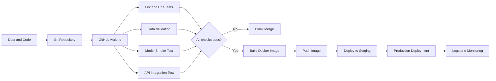
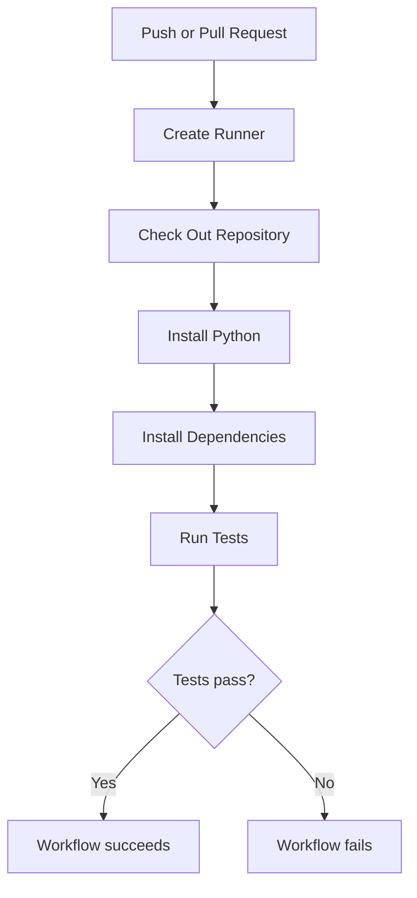
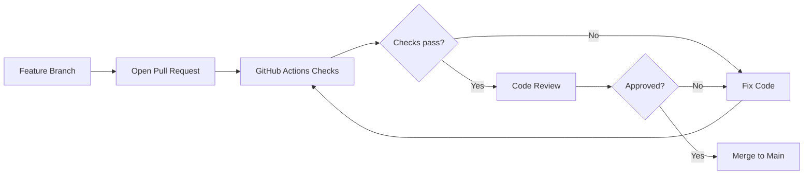
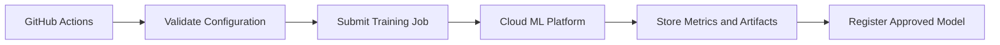
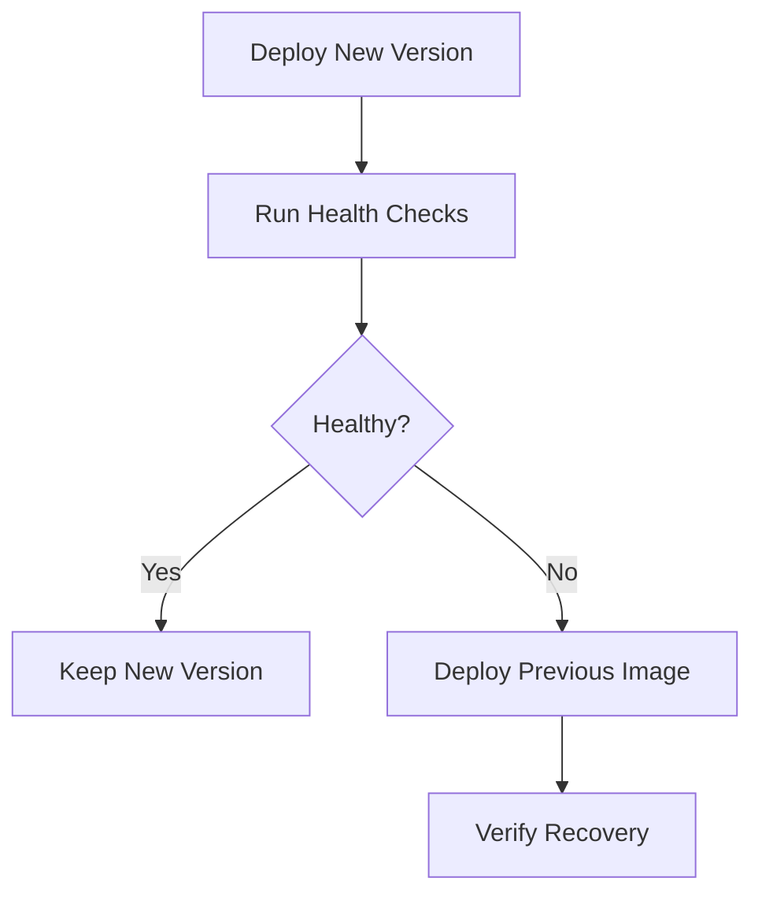
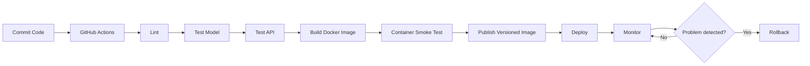

# 014 — GitHub Actions

| Item                   | Details                   |
| ---------------------- | ------------------------- |
| **Course**             | 04 — MLOps and Deployment |
| **Module**             | Module 08 — MLOps         |
| **Topic Group**        | CI/CD                     |
| **Roadmap Source**     | MLOps / CI/CD             |
| **Lesson Type**        | MLOps                     |
| **Lesson Order**       | 014                       |
| **Suggested Duration** | 22 minutes                |

---

## 1. Overview

**GitHub Actions** is a workflow automation platform integrated into GitHub.

It can automatically execute tasks whenever something happens in a repository, such as:

* Code being pushed to a branch
* A pull request being opened
* A new version tag being created
* A workflow being started manually
* A scheduled time being reached

In an ML project, GitHub Actions can automate:

* Code formatting and linting
* Unit and integration tests
* Data validation
* Model smoke tests
* API endpoint tests
* Docker image builds
* Security scans
* Model or package versioning
* Deployment to staging or production
* Scheduled model evaluation

Instead of manually testing and deploying every change, the team defines a workflow once and lets GitHub execute it consistently.

---

## 2. Learning Objectives

By the end of this lesson, you should be able to:

* Explain GitHub Actions in your own words.
* Understand where GitHub Actions fits into an MLOps workflow.
* Identify workflows, events, jobs, steps, actions, and runners.
* Create a basic CI workflow for a Python ML project.
* Run tests automatically when code is pushed.
* Build a Docker image for an ML prediction API.
* Use secrets without exposing credentials in the repository.
* Explain how GitHub Actions supports deployment and rollback.
* Add a working CI workflow to an ML portfolio project.

---

## 3. Why GitHub Actions Matters in MLOps

A machine learning system usually contains more than a trained model.

It may include:

* Data preprocessing code
* Feature engineering logic
* Model artifacts
* Prediction services
* API schemas
* Configuration files
* Dependency definitions
* Docker images
* Monitoring logic
* Infrastructure configuration

A change to any of these components may break the system.

For example:

* A dependency update may change model predictions.
* A preprocessing change may produce incompatible features.
* A new API field may break existing clients.
* A model file may not be copied into the Docker image.
* A deployment may use the wrong configuration.
* A schema change may introduce training-serving skew.

GitHub Actions reduces these risks by automatically checking each change before it reaches production.

```text
Developer changes code
        ↓
Push or pull request
        ↓
GitHub Actions starts
        ↓
Lint → Test → Validate → Build
        ↓
Deploy only if all checks pass
```

---

## 4. GitHub Actions in the ML Lifecycle

GitHub Actions connects software engineering practices with the ML lifecycle.



GitHub Actions does not replace experiment tracking, model registries, or production monitoring. It coordinates automated tasks around those systems.

---

## 5. Core Concepts

### 5.1 Workflow

A **workflow** is an automated process defined in a YAML file.

Workflow files are stored in:

```text
.github/workflows/
```

Example:

```text
.github/
└── workflows/
    ├── ci.yml
    ├── docker.yml
    └── deploy.yml
```

A repository can contain multiple workflows for different purposes.

---

### 5.2 Event

An **event** is something that starts a workflow.

Common events include:

| Event               | When it runs                        |
| ------------------- | ----------------------------------- |
| `push`              | Code is pushed                      |
| `pull_request`      | A pull request is opened or updated |
| `workflow_dispatch` | A user manually starts the workflow |
| `schedule`          | A workflow runs at a scheduled time |
| `release`           | A GitHub release is created         |
| `workflow_run`      | Another workflow finishes           |

Example:

```yaml
on:
  push:
    branches:
      - main

  pull_request:
    branches:
      - main
```

This workflow runs when:

1. Code is pushed directly to `main`.
2. A pull request targets `main`.

---

### 5.3 Job

A **job** is a collection of steps executed on the same runner.

Example jobs:

* `lint`
* `test`
* `build`
* `deploy`

```yaml
jobs:
  test:
    runs-on: ubuntu-latest
    steps:
      - name: Run tests
        run: pytest
```

Jobs run in parallel by default unless dependencies are specified.

---

### 5.4 Step

A **step** is one operation inside a job.

A step can:

* Run a shell command
* Execute a reusable action
* Set an environment variable
* Upload or download an artifact

```yaml
steps:
  - name: Install dependencies
    run: pip install -r requirements.txt

  - name: Run tests
    run: pytest
```

---

### 5.5 Action

An **action** is a reusable component that performs a common task.

Examples:

```yaml
- uses: actions/checkout@v4
```

This action downloads the repository code into the runner.

```yaml
- uses: actions/setup-python@v5
  with:
    python-version: "3.12"
```

This action installs the requested Python version.

---

### 5.6 Runner

A **runner** is the machine that executes a job.

GitHub provides hosted runners such as:

```yaml
runs-on: ubuntu-latest
```

Other available environments include Windows and macOS runners.

Organizations can also use **self-hosted runners** when they need:

* GPUs
* Private networks
* Custom dependencies
* Large storage
* Special hardware
* Access to internal infrastructure

---

## 6. Basic Workflow Structure

A GitHub Actions workflow usually contains:

```yaml
name: Python CI

on:
  push:
  pull_request:

jobs:
  test:
    runs-on: ubuntu-latest

    steps:
      - name: Check out repository
        uses: actions/checkout@v4

      - name: Set up Python
        uses: actions/setup-python@v5
        with:
          python-version: "3.12"

      - name: Install dependencies
        run: pip install -r requirements.txt

      - name: Run tests
        run: pytest
```

The execution flow is:



---

## 7. Example ML Project

Consider a small classification model exposed through FastAPI.

```text
ml-model-api/
├── app/
│   ├── __init__.py
│   ├── main.py
│   ├── schemas.py
│   └── predictor.py
├── model/
│   └── model.joblib
├── tests/
│   ├── test_api.py
│   └── test_predictor.py
├── requirements.txt
├── requirements-dev.txt
├── Dockerfile
├── README.md
└── .github/
    └── workflows/
        └── ci.yml
```

The pipeline should verify that:

1. Python code follows formatting and quality rules.
2. The model artifact can be loaded.
3. Predictions have the expected structure.
4. The FastAPI application starts correctly.
5. The `/predict` endpoint returns a valid response.
6. The Docker image can be built.

---

## 8. Complete CI Workflow for an ML API

Create the following file:

```text
.github/workflows/ci.yml
```

```yaml
name: ML API CI

on:
  push:
    branches:
      - main
      - develop

  pull_request:
    branches:
      - main
      - develop

  workflow_dispatch:

permissions:
  contents: read

jobs:
  quality:
    name: Code Quality
    runs-on: ubuntu-latest

    steps:
      - name: Check out repository
        uses: actions/checkout@v4

      - name: Set up Python
        uses: actions/setup-python@v5
        with:
          python-version: "3.12"
          cache: pip

      - name: Install development dependencies
        run: |
          python -m pip install --upgrade pip
          pip install -r requirements.txt
          pip install -r requirements-dev.txt

      - name: Check formatting
        run: black --check app tests

      - name: Run linter
        run: ruff check app tests

  test:
    name: Test Model and API
    runs-on: ubuntu-latest
    needs: quality

    steps:
      - name: Check out repository
        uses: actions/checkout@v4

      - name: Set up Python
        uses: actions/setup-python@v5
        with:
          python-version: "3.12"
          cache: pip

      - name: Install dependencies
        run: |
          python -m pip install --upgrade pip
          pip install -r requirements.txt
          pip install pytest pytest-cov httpx

      - name: Verify model artifact
        run: |
          test -f model/model.joblib
          python -c "import joblib; joblib.load('model/model.joblib')"

      - name: Run automated tests
        run: |
          pytest tests \
            --cov=app \
            --cov-report=term-missing \
            --cov-report=xml

      - name: Upload coverage report
        uses: actions/upload-artifact@v4
        with:
          name: coverage-report
          path: coverage.xml
          retention-days: 7

  docker:
    name: Build Docker Image
    runs-on: ubuntu-latest
    needs: test

    steps:
      - name: Check out repository
        uses: actions/checkout@v4

      - name: Set up Docker Buildx
        uses: docker/setup-buildx-action@v3

      - name: Build Docker image
        uses: docker/build-push-action@v6
        with:
          context: .
          push: false
          tags: ml-model-api:ci
          load: true

      - name: Start container
        run: |
          docker run \
            --detach \
            --name ml-api \
            --publish 8000:8000 \
            ml-model-api:ci

      - name: Wait for API
        run: |
          for attempt in {1..20}; do
            if curl --fail http://localhost:8000/health; then
              exit 0
            fi

            echo "Waiting for API..."
            sleep 2
          done

          docker logs ml-api
          exit 1

      - name: Test prediction endpoint
        run: |
          curl --fail \
            --request POST \
            --header "Content-Type: application/json" \
            --data '{"features": [5.1, 3.5, 1.4, 0.2]}' \
            http://localhost:8000/predict

      - name: Show container logs on failure
        if: failure()
        run: docker logs ml-api

      - name: Stop container
        if: always()
        run: docker rm --force ml-api
```

---

## 9. Understanding the Workflow

### Stage 1: Code quality

```yaml
jobs:
  quality:
```

This job checks formatting and code quality before running more expensive tests.

```yaml
- name: Check formatting
  run: black --check app tests

- name: Run linter
  run: ruff check app tests
```

A failed formatting or linting check stops the pipeline.

---

### Stage 2: Model and API tests

```yaml
test:
  needs: quality
```

The `test` job runs only after the `quality` job succeeds.

It validates that the model file exists and can be loaded:

```yaml
- name: Verify model artifact
  run: |
    test -f model/model.joblib
    python -c "import joblib; joblib.load('model/model.joblib')"
```

This is a simple **model smoke test**. It detects problems such as:

* Missing model files
* Corrupted artifacts
* Incompatible library versions
* Incorrect model paths

---

### Stage 3: Docker validation

```yaml
docker:
  needs: test
```

The Docker job runs only after the tests pass.

It:

1. Builds the image.
2. Starts a container.
3. Calls the health endpoint.
4. Calls the prediction endpoint.
5. Prints logs when the test fails.
6. Removes the test container.

This verifies that the application works in the same type of environment used for deployment.

---

## 10. Example API Tests

### Predictor test

```python
from app.predictor import load_model, predict


def test_model_can_be_loaded() -> None:
    model = load_model()

    assert model is not None


def test_prediction_has_expected_type() -> None:
    result = predict([5.1, 3.5, 1.4, 0.2])

    assert isinstance(result, int)
    assert result >= 0
```

### FastAPI endpoint test

```python
from fastapi.testclient import TestClient

from app.main import app


client = TestClient(app)


def test_health_endpoint() -> None:
    response = client.get("/health")

    assert response.status_code == 200
    assert response.json() == {"status": "healthy"}


def test_predict_endpoint() -> None:
    payload = {
        "features": [5.1, 3.5, 1.4, 0.2],
    }

    response = client.post("/predict", json=payload)

    assert response.status_code == 200
    assert "prediction" in response.json()
```

These tests verify the prediction logic and the external API contract.

---

## 11. Caching Dependencies

Installing dependencies on every workflow run can be slow.

The Python setup action can cache downloaded packages:

```yaml
- name: Set up Python
  uses: actions/setup-python@v5
  with:
    python-version: "3.12"
    cache: pip
```

The cache is invalidated when dependency files change.

For example:

```yaml
with:
  python-version: "3.12"
  cache: pip
  cache-dependency-path: |
    requirements.txt
    requirements-dev.txt
```

Caching improves execution speed, but it should not hide dependency problems. A reproducible dependency file is still required.

---

## 12. Testing Multiple Python Versions

A matrix strategy can run the same tests in multiple environments.

```yaml
jobs:
  test:
    runs-on: ubuntu-latest

    strategy:
      fail-fast: false
      matrix:
        python-version:
          - "3.10"
          - "3.11"
          - "3.12"

    steps:
      - name: Check out repository
        uses: actions/checkout@v4

      - name: Set up Python
        uses: actions/setup-python@v5
        with:
          python-version: ${{ matrix.python-version }}

      - name: Install dependencies
        run: |
          pip install -r requirements.txt
          pip install pytest

      - name: Run tests
        run: pytest
```

The workflow creates one job for each Python version.

```text
test-python-3.10
test-python-3.11
test-python-3.12
```

This is useful for reusable ML packages, but a production service may intentionally support only one pinned Python version.

---

## 13. Environment Variables and Secrets

### Normal environment variables

Non-sensitive configuration can be defined directly:

```yaml
env:
  APP_ENV: test
  MODEL_PATH: model/model.joblib
  LOG_LEVEL: INFO
```

A step can use them:

```yaml
- name: Run tests
  run: pytest
  env:
    APP_ENV: test
```

### Sensitive values

Credentials must not be committed to the repository.

Examples include:

* Cloud access tokens
* Container registry passwords
* Database credentials
* API keys
* Deployment tokens

Store them as GitHub secrets and access them with:

```yaml
${{ secrets.SECRET_NAME }}
```

Example:

```yaml
- name: Log in to container registry
  uses: docker/login-action@v3
  with:
    registry: ghcr.io
    username: ${{ github.actor }}
    password: ${{ secrets.GITHUB_TOKEN }}
```

Do not print secrets in logs:

```yaml
# Unsafe
- run: echo "${{ secrets.PRODUCTION_API_KEY }}"
```

---

## 14. Building and Publishing a Docker Image

A workflow can publish the image after tests pass.

```yaml
name: Publish Docker Image

on:
  push:
    tags:
      - "v*"

permissions:
  contents: read
  packages: write

jobs:
  publish:
    runs-on: ubuntu-latest

    steps:
      - name: Check out repository
        uses: actions/checkout@v4

      - name: Set up Docker Buildx
        uses: docker/setup-buildx-action@v3

      - name: Log in to GitHub Container Registry
        uses: docker/login-action@v3
        with:
          registry: ghcr.io
          username: ${{ github.actor }}
          password: ${{ secrets.GITHUB_TOKEN }}

      - name: Generate image metadata
        id: metadata
        uses: docker/metadata-action@v5
        with:
          images: ghcr.io/${{ github.repository }}
          tags: |
            type=ref,event=tag
            type=sha

      - name: Build and push image
        uses: docker/build-push-action@v6
        with:
          context: .
          push: true
          tags: ${{ steps.metadata.outputs.tags }}
          labels: ${{ steps.metadata.outputs.labels }}
```

A release tag such as:

```text
v1.2.0
```

may produce image tags based on the Git tag and commit SHA.

The SHA tag is valuable because it connects a deployed image to an exact source-code revision.

---

## 15. CI Versus CD

### Continuous Integration

Continuous Integration validates each code change.

Typical CI tasks include:

* Linting
* Unit tests
* Integration tests
* Data-schema validation
* Model-loading tests
* API contract tests
* Docker builds
* Dependency scans

```text
Pull request
    ↓
Automated checks
    ↓
Merge only when checks pass
```

### Continuous Delivery

Continuous Delivery prepares every valid change for deployment, but production release may require manual approval.

```text
Merge to main
    ↓
Build versioned image
    ↓
Deploy to staging
    ↓
Manual approval
    ↓
Deploy to production
```

### Continuous Deployment

Continuous Deployment automatically releases every change that passes all required checks.

```text
Merge to main
    ↓
Test
    ↓
Build
    ↓
Deploy automatically
```

For high-risk ML systems, Continuous Delivery with approval gates may be safer than fully automatic production deployment.

---

## 16. Environments and Approval Gates

GitHub environments can represent:

* `development`
* `staging`
* `production`

A deployment job can reference an environment:

```yaml
deploy-production:
  runs-on: ubuntu-latest
  environment: production
```

The production environment may have:

* Required reviewers
* Environment-specific secrets
* Deployment protection rules
* Restricted branches

Example workflow:

```yaml
jobs:
  deploy-staging:
    runs-on: ubuntu-latest
    environment: staging
    steps:
      - name: Deploy to staging
        run: ./scripts/deploy.sh staging

  deploy-production:
    runs-on: ubuntu-latest
    needs: deploy-staging
    environment: production
    steps:
      - name: Deploy to production
        run: ./scripts/deploy.sh production
```

---

## 17. Branch Protection

GitHub Actions is most effective when combined with branch protection.

A protected `main` branch may require:

* Pull requests before merging
* Successful CI checks
* Code review approval
* Resolved review conversations
* Up-to-date branches
* Restricted direct pushes



This prevents untested code from entering the deployment branch.

---

## 18. ML-Specific CI Checks

Traditional software tests are necessary, but ML projects need additional checks.

### 18.1 Data-schema validation

Verify that required columns exist and use expected data types.

```python
EXPECTED_COLUMNS = {
    "age",
    "income",
    "account_age_days",
    "transaction_count",
}


def test_training_columns(training_dataframe) -> None:
    assert EXPECTED_COLUMNS.issubset(training_dataframe.columns)
```

### 18.2 Missing-value checks

```python
def test_features_do_not_contain_missing_values(feature_dataframe) -> None:
    assert feature_dataframe.isna().sum().sum() == 0
```

### 18.3 Prediction shape

```python
def test_prediction_shape(model, sample_features) -> None:
    predictions = model.predict(sample_features)

    assert predictions.shape == (len(sample_features),)
```

### 18.4 Prediction range

```python
def test_probabilities_are_valid(model, sample_features) -> None:
    probabilities = model.predict_proba(sample_features)

    assert probabilities.min() >= 0.0
    assert probabilities.max() <= 1.0
```

### 18.5 Minimum model quality

```python
def test_model_meets_minimum_accuracy(evaluation_result) -> None:
    assert evaluation_result["accuracy"] >= 0.85
```

A minimum-quality check should use a stable validation dataset. Otherwise, random variation may make CI unreliable.

### 18.6 Inference latency

```python
import time


def test_prediction_latency(model, sample_features) -> None:
    start_time = time.perf_counter()
    model.predict(sample_features)
    elapsed_time = time.perf_counter() - start_time

    assert elapsed_time < 0.5
```

Latency thresholds should account for differences between CI runners and production hardware.

---

## 19. Training in GitHub Actions

Small training jobs can run directly in GitHub Actions:

```yaml
- name: Train model
  run: python scripts/train.py
```

However, this is not always appropriate.

Avoid running large training workloads on standard CI runners when the job requires:

* GPUs
* Many hours of execution
* Large private datasets
* High memory
* Distributed training
* Expensive repeated experiments

A more scalable pattern is:



GitHub Actions coordinates the job, while a dedicated ML platform performs the training.

---

## 20. Artifacts

Artifacts are files produced by a workflow and saved for later inspection.

Common ML workflow artifacts include:

* Test coverage reports
* Evaluation metrics
* Confusion matrices
* Data-validation reports
* Model-card drafts
* Small trained models
* API logs
* Benchmark results

Example:

```yaml
- name: Run evaluation
  run: python scripts/evaluate.py --output reports/metrics.json

- name: Upload evaluation report
  uses: actions/upload-artifact@v4
  with:
    name: model-evaluation
    path: reports/
    retention-days: 14
```

Artifacts are useful for debugging, but they are not a complete replacement for a model registry or experiment-tracking platform.

---

## 21. Scheduled Model Evaluation

A workflow can run on a schedule.

```yaml
name: Scheduled Model Evaluation

on:
  schedule:
    - cron: "0 2 * * 1"

  workflow_dispatch:

jobs:
  evaluate:
    runs-on: ubuntu-latest

    steps:
      - uses: actions/checkout@v4

      - uses: actions/setup-python@v5
        with:
          python-version: "3.12"

      - run: pip install -r requirements.txt

      - name: Evaluate model
        run: python scripts/evaluate_production_model.py
```

The example runs every Monday at `02:00 UTC`.

Scheduled workflows can support:

* Model-quality checks
* Drift reports
* Dependency audits
* Batch predictions
* Dataset freshness checks
* Retraining triggers

GitHub Actions can initiate these checks, but continuous production monitoring normally belongs in a dedicated monitoring system.

---

## 22. Model and Deployment Versioning

A production release should connect several versions:

```text
Git commit
    ↓
Application version
    ↓
Docker image tag
    ↓
Model version
    ↓
Deployment version
```

Useful metadata includes:

```json
{
  "git_commit": "b1f42a8",
  "application_version": "1.4.0",
  "model_version": "churn-model-2026-07-13",
  "dataset_version": "customers-2026-07-01",
  "image_tag": "sha-b1f42a8"
}
```

This information helps answer:

* Which code produced this prediction?
* Which model is currently deployed?
* Which dataset trained the model?
* Which container image is running?
* Can the previous version be restored?

---

## 23. Rollback Strategy

Deployment automation should include a rollback plan.

A simple container rollback can redeploy the previous image tag:

```text
Current version: ghcr.io/company/ml-api:v1.4.0
Previous version: ghcr.io/company/ml-api:v1.3.2
```



A rollback must consider both:

* Application version
* Model version

Rolling back only the application while keeping an incompatible model may not restore the service correctly.

---

## 24. Common Mistakes

### 24.1 Running only notebook code

A notebook may work interactively but fail in a clean CI environment.

**Better approach:**

* Move reusable logic into Python modules.
* Keep notebooks for exploration.
* Test production logic through scripts and packages.

---

### 24.2 Not pinning dependencies

Installing unpinned packages can produce different environments over time.

Weak:

```text
scikit-learn
pandas
```

More reproducible:

```text
scikit-learn==1.x.x
pandas==2.x.x
```

The exact version policy depends on the project, but production builds should be deterministic.

---

### 24.3 Committing secrets

Never store credentials in:

* Workflow YAML files
* Python source files
* Dockerfiles
* `.env` files committed to Git
* Notebook outputs

Use GitHub secrets or an external secret manager.

---

### 24.4 Deploying before testing

Do not make deployment independent from testing.

Weak design:

```yaml
deploy:
  runs-on: ubuntu-latest
```

Safer design:

```yaml
deploy:
  needs:
    - quality
    - test
    - docker
```

---

### 24.5 Testing only the Python process

A Python test may pass while the Docker container is broken.

The workflow should also test:

* Container startup
* Health endpoint
* Prediction endpoint
* Required model files
* Runtime environment variables

---

### 24.6 Using `latest` as the only image tag

The `latest` tag does not clearly identify a release.

Prefer immutable tags such as:

```text
v1.4.0
sha-b1f42a8
model-churn-v7
```

---

### 24.7 Training a model on every small commit

Training may be expensive and unnecessary.

Separate workflows for:

* Code validation
* Model training
* Model evaluation
* Deployment

Trigger training only when relevant files or configurations change.

---

### 24.8 Ignoring data and model validation

A successful Docker build does not prove that the model is valid.

Include tests for:

* Input schema
* Preprocessing
* Model loading
* Prediction output
* Minimum performance
* Training-serving compatibility

---

### 24.9 No timeout or resource limit

A failed process may run indefinitely.

Example:

```yaml
jobs:
  test:
    timeout-minutes: 15
```

Set realistic limits for each job.

---

### 24.10 No rollback plan

Deployment success does not guarantee application health.

Keep previous versions available and define how to restore them.

---

## 25. Recommended Workflow Separation

For a production-style repository, use separate workflows.

```text
.github/workflows/
├── pull-request-ci.yml
├── publish-image.yml
├── deploy-staging.yml
├── deploy-production.yml
└── scheduled-evaluation.yml
```

### Pull-request workflow

Runs:

* Formatting
* Linting
* Unit tests
* Model smoke tests
* API tests
* Docker build

### Image publication workflow

Runs:

* On version tags
* Builds an immutable image
* Publishes it to a registry

### Deployment workflow

Runs:

* After approval
* Deploys a selected image
* Performs health checks
* Supports rollback

### Scheduled evaluation workflow

Runs:

* On a recurring schedule
* Evaluates quality and drift
* Uploads reports
* Opens alerts when thresholds fail

---

## 26. Practical Exercise

Build a GitHub Actions workflow for the mini project:

> Deploy an ML model with a FastAPI `/predict` endpoint, Dockerfile, tests, and README.

### Task 1: Prepare the repository

Create:

```text
app/
tests/
model/
.github/workflows/
```

Add:

* A serialized model
* A prediction module
* A FastAPI application
* A `/health` endpoint
* A `/predict` endpoint
* Unit and API tests
* A Dockerfile

### Task 2: Create the CI workflow

The workflow must:

1. Run on pushes and pull requests.
2. Install Python.
3. Install project dependencies.
4. Check formatting.
5. Run linting.
6. Load the model artifact.
7. Run automated tests.
8. Build the Docker image.
9. Start the container.
10. Test `/health`.
11. Test `/predict`.

### Task 3: Add failure diagnostics

When a container test fails, print:

```bash
docker logs ml-api
```

Clean up the container with:

```yaml
if: always()
```

### Task 4: Document the project

The README should include:

* Project purpose
* Model description
* Dataset summary
* Local installation
* Test command
* Docker build command
* Docker run command
* Sample API request
* GitHub Actions workflow description
* Model limitations
* Monitoring plan
* Rollback strategy

---

## 27. Example Local Commands

Run tests:

```bash
pytest tests -v
```

Check formatting:

```bash
black --check app tests
```

Run linting:

```bash
ruff check app tests
```

Build the image:

```bash
docker build -t ml-model-api:local .
```

Run the container:

```bash
docker run \
  --rm \
  --publish 8000:8000 \
  ml-model-api:local
```

Check service health:

```bash
curl http://localhost:8000/health
```

Send a prediction request:

```bash
curl \
  --request POST \
  --header "Content-Type: application/json" \
  --data '{"features": [5.1, 3.5, 1.4, 0.2]}' \
  http://localhost:8000/predict
```

---

## 28. Portfolio Artifact

A strong GitHub portfolio project should contain:

```text
ml-model-api/
├── app/
├── tests/
├── model/
├── scripts/
├── .github/
│   └── workflows/
├── Dockerfile
├── requirements.txt
├── README.md
└── LICENSE
```

The repository should demonstrate that you can:

* Train or load a model.
* Separate notebook experiments from application code.
* Test prediction behavior.
* Expose predictions through an API.
* Package the service with Docker.
* Automatically validate changes.
* Version releases.
* Explain monitoring and rollback.

A CI badge can also be displayed in the README:

```markdown

```

Replace `USERNAME` and `REPOSITORY` with the actual repository information.

---

## 29. Completion Checklist

* [ ] I can explain GitHub Actions in one or two minutes.
* [ ] I understand workflows, events, jobs, steps, actions, and runners.
* [ ] I created a workflow inside `.github/workflows/`.
* [ ] My workflow runs on pushes or pull requests.
* [ ] My workflow installs dependencies in a clean environment.
* [ ] My workflow checks formatting and linting.
* [ ] My workflow runs unit and API tests.
* [ ] My workflow verifies that the model artifact can be loaded.
* [ ] My workflow builds the Docker image.
* [ ] My workflow tests the running container.
* [ ] Sensitive credentials are stored as secrets.
* [ ] My application and model have traceable versions.
* [ ] I documented at least one limitation or assumption.
* [ ] I described a production monitoring strategy.
* [ ] I described how to roll back a failed release.

---

## 30. Key Caveats

GitHub Actions can automate an ML workflow, but it does not automatically solve every MLOps problem.

Important limitations include:

* CI runners may not be suitable for large training jobs.
* Passing tests does not guarantee good production performance.
* Static validation does not replace live drift monitoring.
* A reproducible image still requires reproducible data and model versions.
* Secrets must be carefully scoped and protected.
* Production deployments need health checks and rollback procedures.
* ML performance thresholds must be chosen using stable evaluation data.
* Self-hosted runners require additional security and maintenance.

---

## 31. Related Outcome

After completing this lesson, you should be closer to the following outcome:

> Deploy, version, monitor, and operate ML models using APIs, Docker, CI/CD, automated testing, and drift-aware workflows.

---

## 32. Related Mini Project

### Deploy an ML Model API

Build a portfolio project containing:

* A trained classification or regression model
* A FastAPI `/predict` endpoint
* A `/health` endpoint
* Input validation with Pydantic
* Unit and integration tests
* A Dockerfile
* A GitHub Actions CI workflow
* A versioned Docker image
* Sample requests in the README
* A monitoring and rollback plan

Suggested pipeline:



---

## 33. Summary

**GitHub Actions** automates development, testing, packaging, and deployment workflows directly from a GitHub repository.

For an ML project, it can verify:

* Code quality
* Data assumptions
* Model compatibility
* Prediction behavior
* API contracts
* Docker packaging
* Deployment readiness

The most important idea is not merely to create a YAML file. The goal is to turn the ML system into a reproducible and testable product.

```text
Notebook experiment
        ↓
Reusable Python code
        ↓
Automated tests
        ↓
Prediction API
        ↓
Docker image
        ↓
GitHub Actions
        ↓
Versioned deployment
        ↓
Monitoring and rollback
```

A strong MLOps portfolio project should make it easy for another person to understand, test, run, deploy, and troubleshoot the model without depending on the original notebook environment.

---

# Bài luyện tập

## Mục tiêu


## Đề bài


## Yêu cầu hoàn thành

- [ ] 
- [ ] 
- [ ] 

## Kết quả / lời giải


## Ghi chú
