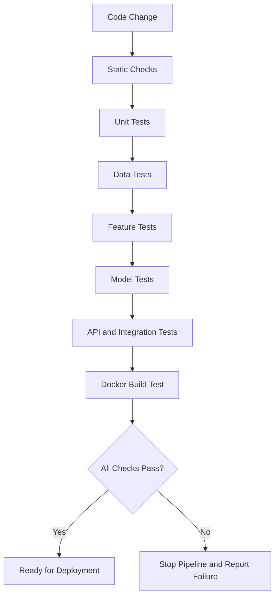
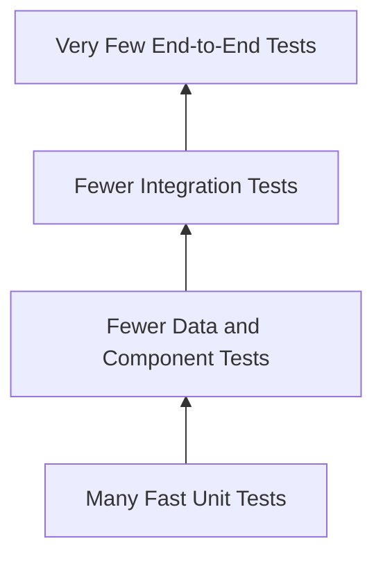
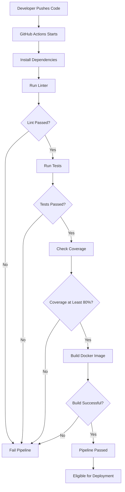
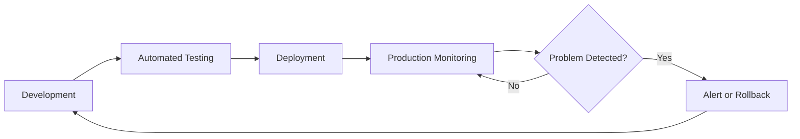
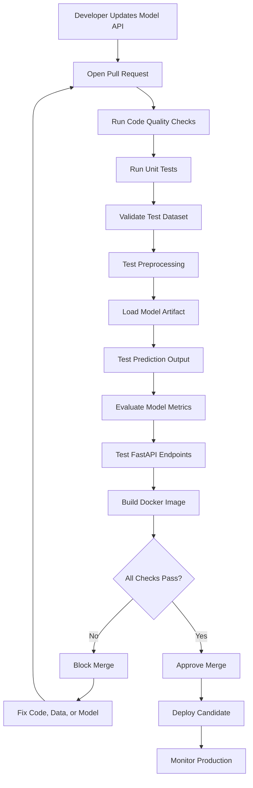

# 015 — Test Pipeline

| Item                   | Details                   |
| ---------------------- | ------------------------- |
| **Course**             | 04 — MLOps and Deployment |
| **Module**             | Module 08 — MLOps         |
| **Content Group**      | CI/CD                     |
| **Roadmap Source**     | MLOps / CI/CD             |
| **Lesson Type**        | MLOps                     |
| **Order in Module**    | 015                       |
| **Suggested Duration** | 22 minutes                |

---

## 1. Lesson Overview

A **test pipeline** is an automated workflow that checks whether an ML project is correct, reproducible, and safe to deploy.

In a traditional software project, a test pipeline usually verifies application logic. In an ML project, it must validate more than code. It may also need to check:

* Data schemas
* Data quality
* Feature transformations
* Model behavior
* Prediction outputs
* API responses
* Docker builds
* Dependency compatibility
* Performance thresholds

A test pipeline helps detect problems before they reach production.

```text
Code or data change
        ↓
Automated tests
        ↓
Quality checks
        ↓
Build verification
        ↓
Deploy only if all checks pass
```

After this lesson, you should understand where testing belongs in the ML lifecycle and how to create a small automated test pipeline for an ML API.

---

## 2. Learning Objectives

By the end of this lesson, you should be able to:

* Explain a test pipeline in your own words.
* Describe why ML pipelines require more than ordinary unit tests.
* Identify the main testing layers in an ML system.
* Write basic tests for preprocessing, models, and APIs.
* Add automated tests to a CI workflow.
* Define model quality thresholds that block unsafe deployments.
* Connect testing with versioning, monitoring, deployment, and rollback.
* Create a small portfolio artifact that demonstrates automated ML testing.

---

## 3. What Is a Test Pipeline?

A **test pipeline** is a sequence of automated checks executed when code, configuration, data definitions, or model artifacts change.

Its main purpose is to answer the following question:

> Is this version of the ML system safe and reliable enough to continue toward deployment?

A simple test pipeline may contain:

```text
Lint code
   ↓
Run unit tests
   ↓
Test data validation
   ↓
Test model predictions
   ↓
Test the API
   ↓
Build the Docker image
```

A more advanced pipeline may also evaluate:

* Model accuracy
* Fairness metrics
* Inference latency
* Memory usage
* Data drift
* Model compatibility
* Security vulnerabilities
* Integration with external services

---

## 4. Why Testing ML Systems Is Different

Machine learning systems combine several components:

1. Application code
2. Training data
3. Feature engineering logic
4. Model artifacts
5. Configuration
6. Infrastructure
7. Runtime dependencies

A codebase can be syntactically correct while the ML system is still incorrect.

For example:

* The API may run, but feature columns may be in the wrong order.
* The model may load, but predictions may always return the same class.
* The training pipeline may complete, but the input data may contain missing columns.
* Accuracy may decrease below an acceptable threshold.
* A dependency update may change preprocessing behavior.
* A model may work locally but fail inside Docker.

Therefore, ML testing should verify both **software correctness** and **model behavior**.

---

## 5. Main Testing Layers

A complete ML test pipeline can contain several layers.



### 5.1 Static Checks

Static checks inspect code without executing the complete application.

Typical tools include:

* Ruff
* Flake8
* Pylint
* Black
* MyPy

Example:

```bash
ruff check .
black --check .
mypy src/
```

These checks can detect:

* Syntax problems
* Unused imports
* Formatting inconsistencies
* Type mismatches
* Potential programming errors

Static checks are fast and should usually run early in the pipeline.

---

### 5.2 Unit Tests

Unit tests verify small, isolated functions.

Examples include:

* A normalization function returns the expected values.
* Missing values are filled correctly.
* A categorical encoder maps labels correctly.
* A prediction formatter returns valid JSON.
* A model loader returns the correct object type.

Example preprocessing function:

```python
def normalize_age(age: float, minimum: float, maximum: float) -> float:
    if maximum <= minimum:
        raise ValueError("maximum must be greater than minimum")

    return (age - minimum) / (maximum - minimum)
```

Example unit tests:

```python
import pytest

from src.features import normalize_age


def test_normalize_age_returns_expected_value() -> None:
    result = normalize_age(age=30, minimum=20, maximum=40)
    assert result == pytest.approx(0.5)


def test_normalize_age_rejects_invalid_range() -> None:
    with pytest.raises(ValueError):
        normalize_age(age=30, minimum=40, maximum=20)
```

A unit test should be:

* Small
* Fast
* Deterministic
* Independent
* Easy to understand

---

### 5.3 Data Validation Tests

Data tests verify that incoming data matches the system's expectations.

Important checks include:

* Required columns exist.
* Column types are correct.
* Values are within valid ranges.
* Missing-value rates are acceptable.
* Categories belong to known sets.
* IDs are unique when required.
* Timestamps are valid.
* The target column is not accidentally included in features.

Example validation function:

```python
import pandas as pd


REQUIRED_COLUMNS = {
    "age",
    "income",
    "account_length",
}


def validate_input_data(data: pd.DataFrame) -> None:
    missing_columns = REQUIRED_COLUMNS - set(data.columns)

    if missing_columns:
        raise ValueError(
            f"Missing required columns: {sorted(missing_columns)}"
        )

    if data["age"].isna().any():
        raise ValueError("Column 'age' contains missing values")

    if not data["age"].between(18, 100).all():
        raise ValueError("Column 'age' contains invalid values")
```

Example data test:

```python
import pandas as pd
import pytest

from src.validation import validate_input_data


def test_valid_input_data_passes_validation() -> None:
    data = pd.DataFrame(
        {
            "age": [25, 40],
            "income": [30000, 70000],
            "account_length": [2, 8],
        }
    )

    validate_input_data(data)


def test_missing_column_fails_validation() -> None:
    data = pd.DataFrame(
        {
            "age": [25],
            "income": [30000],
        }
    )

    with pytest.raises(ValueError, match="Missing required columns"):
        validate_input_data(data)
```

Data validation prevents corrupted or incompatible data from silently entering the model.

---

### 5.4 Feature Engineering Tests

Feature tests verify that raw inputs are transformed correctly.

Typical checks include:

* Output feature count is correct.
* Column order is stable.
* No unexpected missing values are introduced.
* Numeric values are scaled correctly.
* Categorical values are encoded consistently.
* Training and inference transformations are identical.

Example:

```python
def test_preprocessor_returns_expected_feature_count(
    fitted_preprocessor,
    sample_input,
) -> None:
    transformed = fitted_preprocessor.transform(sample_input)

    assert transformed.shape[0] == len(sample_input)
    assert transformed.shape[1] == 12
```

A critical ML failure occurs when training and inference use different transformations.

A good solution is to save the preprocessing logic and model together as one pipeline.

```python
from sklearn.pipeline import Pipeline

pipeline = Pipeline(
    steps=[
        ("preprocessor", preprocessor),
        ("model", classifier),
    ]
)
```

---

### 5.5 Model Artifact Tests

Model artifact tests verify that a stored model can be loaded and used.

Example:

```python
import joblib
import numpy as np


def test_model_artifact_can_generate_prediction() -> None:
    model = joblib.load("artifacts/model.joblib")

    sample = np.array([[30, 50000, 4]])
    prediction = model.predict(sample)

    assert len(prediction) == 1
    assert prediction[0] in {0, 1}
```

Useful model artifact checks include:

* The file exists.
* The file can be loaded.
* The model exposes the required method.
* The model accepts the expected feature shape.
* Predictions contain valid values.
* Probabilities are between 0 and 1.
* Output dimensions are correct.

---

### 5.6 Model Quality Tests

Model quality tests verify that a new model meets minimum performance requirements.

For a classification model, possible quality gates include:

```text
Accuracy ≥ 0.85
F1 score ≥ 0.80
Recall ≥ 0.75
Inference latency ≤ 100 ms
```

Example:

```python
from sklearn.metrics import f1_score


def test_model_meets_minimum_f1_score(
    trained_model,
    validation_features,
    validation_labels,
) -> None:
    predictions = trained_model.predict(validation_features)
    score = f1_score(validation_labels, predictions)

    assert score >= 0.80, (
        f"F1 score {score:.3f} is below the required threshold"
    )
```

A quality test converts a business or technical requirement into an automated deployment rule.

```text
New model
   ↓
Evaluate on validation dataset
   ↓
Compare metric with threshold
   ↓
Pass → continue
Fail → stop deployment
```

---

### 5.7 Regression Tests

Regression tests ensure that a new version does not unexpectedly perform worse than the current version.

Suppose the production model has an F1 score of `0.84`.

A new candidate model has an F1 score of `0.81`.

Even if the minimum threshold is `0.80`, the new model may still represent a meaningful regression.

Example rule:

```python
MAXIMUM_ALLOWED_DEGRADATION = 0.01


def test_candidate_does_not_regress(
    baseline_f1: float,
    candidate_f1: float,
) -> None:
    assert candidate_f1 >= (
        baseline_f1 - MAXIMUM_ALLOWED_DEGRADATION
    )
```

A model comparison gate can use multiple metrics:

| Metric   | Baseline | Candidate | Result |
| -------- | -------: | --------: | ------ |
| F1 score |     0.84 |      0.86 | Pass   |
| Recall   |     0.79 |      0.82 | Pass   |
| Latency  |    75 ms |     91 ms | Pass   |
| Memory   |   420 MB |    610 MB | Review |

The best model is not always the one with the highest accuracy. Production constraints also matter.

---

### 5.8 API Tests

API tests verify that the deployed interface behaves correctly.

For a FastAPI application:

```python
from fastapi import FastAPI

app = FastAPI()


@app.get("/health")
def health() -> dict[str, str]:
    return {"status": "healthy"}


@app.post("/predict")
def predict(payload: dict[str, float]) -> dict[str, int]:
    prediction = 1
    return {"prediction": prediction}
```

Example tests:

```python
from fastapi.testclient import TestClient

from src.main import app


client = TestClient(app)


def test_health_endpoint() -> None:
    response = client.get("/health")

    assert response.status_code == 200
    assert response.json() == {"status": "healthy"}


def test_predict_endpoint() -> None:
    payload = {
        "age": 30,
        "income": 50000,
        "account_length": 4,
    }

    response = client.post("/predict", json=payload)

    assert response.status_code == 200
    assert "prediction" in response.json()


def test_predict_rejects_invalid_payload() -> None:
    response = client.post(
        "/predict",
        json={"age": "invalid"},
    )

    assert response.status_code in {400, 422}
```

Important API tests include:

* Valid requests return `200`.
* Invalid requests return clear error codes.
* Required fields are enforced.
* Output structure is stable.
* Health checks work.
* The correct model version is reported.
* Sensitive internal information is not exposed.

---

### 5.9 Integration Tests

Integration tests verify that multiple components work together.

For example:

```text
Input JSON
   ↓
FastAPI validation
   ↓
Preprocessing pipeline
   ↓
Model prediction
   ↓
Response formatter
   ↓
Output JSON
```

An integration test might:

1. Start the application.
2. Send a realistic request.
3. Load the actual model artifact.
4. Run preprocessing.
5. Generate a prediction.
6. Validate the complete response.

Example:

```python
def test_complete_prediction_flow() -> None:
    response = client.post(
        "/predict",
        json={
            "age": 35,
            "income": 62000,
            "account_length": 6,
        },
    )

    body = response.json()

    assert response.status_code == 200
    assert body["prediction"] in {0, 1}
    assert 0.0 <= body["probability"] <= 1.0
    assert "model_version" in body
```

Integration tests are slower than unit tests, so they may run after fast checks have passed.

---

### 5.10 Docker Build Tests

A model service should also be tested inside its deployment environment.

Example Docker build test:

```bash
docker build -t customer-churn-api:test .
```

Run the container:

```bash
docker run --rm -d \
  --name customer-churn-api \
  -p 8000:8000 \
  customer-churn-api:test
```

Test the health endpoint:

```bash
curl --fail http://localhost:8000/health
```

Stop the container:

```bash
docker stop customer-churn-api
```

This verifies that:

* The Dockerfile is valid.
* Dependencies can be installed.
* The model artifact is included.
* The application starts.
* The correct port is exposed.
* The health endpoint responds.

---

## 6. Testing Pyramid for ML Projects

Not all tests should have the same scope.



A practical distribution could be:

| Test Type         | Quantity | Speed     | Purpose                          |
| ----------------- | -------: | --------- | -------------------------------- |
| Unit tests        |     High | Very fast | Verify isolated functions        |
| Data tests        |   Medium | Fast      | Verify schemas and distributions |
| Component tests   |   Medium | Moderate  | Verify model and preprocessing   |
| Integration tests |      Low | Slower    | Verify components together       |
| End-to-end tests  | Very low | Slowest   | Verify production-like workflow  |

Most tests should be fast and focused.

---

## 7. Test Pipeline Execution Order

Fast and inexpensive checks should run first.


This ordering saves time.

For example, there is no reason to build a Docker image if a basic unit test has already failed.

---

## 8. Recommended Project Structure

```text
ml-api-project/
├── .github/
│   └── workflows/
│       └── test.yml
├── artifacts/
│   └── model.joblib
├── data/
│   └── validation.csv
├── src/
│   ├── __init__.py
│   ├── features.py
│   ├── main.py
│   ├── model.py
│   └── validation.py
├── tests/
│   ├── test_api.py
│   ├── test_features.py
│   ├── test_model.py
│   └── test_validation.py
├── Dockerfile
├── pyproject.toml
├── requirements.txt
└── README.md
```

This structure separates:

* Application code
* Model artifacts
* Validation data
* Automated tests
* Deployment configuration
* CI/CD workflows

---

## 9. Running Tests Locally

Install development dependencies:

```bash
pip install pytest pytest-cov ruff
```

Run all tests:

```bash
pytest
```

Run tests with detailed output:

```bash
pytest -v
```

Run one test file:

```bash
pytest tests/test_api.py
```

Run one test function:

```bash
pytest tests/test_api.py::test_health_endpoint
```

Run tests with coverage:

```bash
pytest --cov=src --cov-report=term-missing
```

Example result:

```text
Name                 Stmts   Miss   Cover
-----------------------------------------
src/features.py         18      2      89%
src/main.py             24      3      88%
src/model.py            20      1      95%
src/validation.py       16      0     100%
-----------------------------------------
TOTAL                    78      6      92%
```

Coverage is useful, but high coverage does not automatically mean high-quality tests.

Tests must verify meaningful behavior.

---

## 10. GitHub Actions Test Pipeline

Create the following file:

```text
.github/workflows/test.yml
```

Example workflow:

```yaml
name: Test ML Pipeline

on:
  push:
    branches:
      - main
      - develop

  pull_request:
    branches:
      - main
      - develop

jobs:
  test:
    runs-on: ubuntu-latest

    strategy:
      matrix:
        python-version:
          - "3.10"
          - "3.11"

    steps:
      - name: Check out repository
        uses: actions/checkout@v4

      - name: Set up Python
        uses: actions/setup-python@v5
        with:
          python-version: ${{ matrix.python-version }}
          cache: pip

      - name: Install dependencies
        run: |
          python -m pip install --upgrade pip
          pip install -r requirements.txt
          pip install pytest pytest-cov ruff

      - name: Run lint checks
        run: |
          ruff check .

      - name: Run automated tests
        run: |
          pytest \
            --cov=src \
            --cov-report=term-missing \
            --cov-fail-under=80

      - name: Build Docker image
        run: |
          docker build \
            -t ml-model-api:${{ github.sha }} \
            .
```

The pipeline runs automatically when:

* Code is pushed to `main`.
* Code is pushed to `develop`.
* A pull request targets `main`.
* A pull request targets `develop`.

The pipeline stops when any required step fails.

---

## 11. Pipeline Logic



The basic rule is:

```text
Any required check fails → deployment is blocked
All required checks pass → deployment may continue
```

---

## 12. Separating Fast and Slow Tests

Some ML tests are too expensive to run on every small commit.

You can classify tests using markers.

Example:

```python
import pytest


@pytest.mark.slow
def test_full_model_evaluation() -> None:
    ...
```

Register the marker in `pytest.ini`:

```ini
[pytest]
markers =
    slow: tests that require more execution time
    integration: tests involving several components
```

Run only fast tests:

```bash
pytest -m "not slow"
```

Run only integration tests:

```bash
pytest -m integration
```

A practical CI design is:

```text
Every commit:
- Lint
- Unit tests
- API tests
- Small data sample tests

Pull request:
- Integration tests
- Model quality tests
- Docker build

Nightly or scheduled:
- Full training
- Large dataset validation
- Drift checks
- Expensive benchmarks
```

---

## 13. Testing Training Pipelines

A training pipeline should also be tested.

Typical training pipeline:


Tests can verify that:

* Data loading succeeds.
* Dataset splitting is reproducible.
* No leakage occurs between training and validation sets.
* Feature dimensions are correct.
* Training completes on a small sample.
* Metrics are calculated correctly.
* The model artifact is saved.
* Metadata contains the correct version.

A lightweight smoke test should not train on the full dataset.

```python
def test_training_pipeline_runs_on_small_sample(
    small_training_dataset,
    temporary_directory,
) -> None:
    result = train_model(
        data=small_training_dataset,
        output_directory=temporary_directory,
    )

    assert result.model_path.exists()
    assert result.metrics["accuracy"] >= 0.50
```

The purpose of this smoke test is to confirm that the pipeline runs, not to produce a production model.

---

## 14. Deterministic Tests

Tests should produce repeatable results.

Use fixed random seeds:

```python
import random

import numpy as np


RANDOM_SEED = 42

random.seed(RANDOM_SEED)
np.random.seed(RANDOM_SEED)
```

For scikit-learn:

```python
from sklearn.ensemble import RandomForestClassifier

model = RandomForestClassifier(
    n_estimators=100,
    random_state=42,
)
```

For train-test splitting:

```python
from sklearn.model_selection import train_test_split

X_train, X_test, y_train, y_test = train_test_split(
    features,
    labels,
    test_size=0.2,
    random_state=42,
    stratify=labels,
)
```

Without fixed seeds, the same test may randomly pass or fail.

Such unstable tests are called **flaky tests**.

---

## 15. Test Data Management

Tests should use controlled datasets.

Possible test data strategies include:

### Small Realistic Sample

Store a small anonymized sample:

```text
tests/fixtures/sample_customers.csv
```

Advantages:

* Realistic structure
* Fast to load
* Easy to reproduce

### Synthetic Data

Generate data during the test:

```python
import pandas as pd


def create_test_dataset() -> pd.DataFrame:
    return pd.DataFrame(
        {
            "age": [25, 45, 32],
            "income": [30000, 90000, 52000],
            "account_length": [1, 10, 5],
        }
    )
```

Advantages:

* No sensitive information
* Fully controlled
* Easy to create edge cases

### Temporary Files

Use pytest temporary directories:

```python
def test_model_is_saved(tmp_path) -> None:
    output_path = tmp_path / "model.joblib"

    save_model(model, output_path)

    assert output_path.exists()
```

Avoid using production data directly in ordinary CI tests.

---

## 16. Testing Edge Cases

Normal examples are not enough.

A prediction system should also test:

* Minimum allowed values
* Maximum allowed values
* Missing values
* Unknown categories
* Empty requests
* Extra fields
* Incorrect data types
* Very large numbers
* Duplicate rows
* Constant input values
* Out-of-distribution values

Example:

```python
import pytest


@pytest.mark.parametrize(
    "payload",
    [
        {},
        {"age": None},
        {"age": -5},
        {"age": 500},
        {"age": "thirty"},
    ],
)
def test_invalid_age_inputs_are_rejected(payload) -> None:
    response = client.post("/predict", json=payload)

    assert response.status_code in {400, 422}
```

Parameterized tests make it easy to verify many input cases.

---

## 17. Testing Non-Functional Requirements

A production model must satisfy more than predictive accuracy.

### Latency Test

```python
import time


def test_prediction_latency(model, sample_features) -> None:
    start_time = time.perf_counter()

    model.predict(sample_features)

    elapsed_ms = (
        time.perf_counter() - start_time
    ) * 1000

    assert elapsed_ms < 100
```

### Model Size Test

```python
from pathlib import Path


def test_model_artifact_size() -> None:
    model_path = Path("artifacts/model.joblib")
    size_mb = model_path.stat().st_size / (1024 * 1024)

    assert size_mb < 200
```

### Batch Output Test

```python
def test_batch_prediction_preserves_row_count(
    model,
    batch_features,
) -> None:
    predictions = model.predict(batch_features)

    assert len(predictions) == len(batch_features)
```

These checks help verify that a model is practical for its deployment environment.

---

## 18. Testing and Monitoring Are Different

Testing and monitoring are related but not identical.

| Testing                             | Monitoring                             |
| ----------------------------------- | -------------------------------------- |
| Happens before or during deployment | Happens after deployment               |
| Uses controlled test cases          | Uses real production traffic           |
| Detects known failure conditions    | Detects unexpected runtime changes     |
| Blocks bad releases                 | Alerts teams about production problems |
| Usually runs in CI/CD               | Runs continuously or periodically      |

A complete workflow requires both.



Tests reduce deployment risk.

Monitoring detects problems that tests could not predict.

---

## 19. Connection to Model Versioning

Test results should be associated with a specific model version.

Example model metadata:

```json
{
  "model_name": "customer-churn-classifier",
  "model_version": "1.4.0",
  "git_commit": "a82c51d",
  "dataset_version": "customers-2026-07",
  "f1_score": 0.86,
  "test_status": "passed"
}
```

This allows the team to answer:

* Which code produced this model?
* Which dataset was used?
* Which tests passed?
* Which metrics were recorded?
* Which version is currently deployed?
* Which previous version can be restored?

---

## 20. Connection to Rollback

Even a well-tested model can fail in production.

A rollback strategy should preserve the previous stable version.

```text
Model v1.4 deployed
        ↓
Production error detected
        ↓
Stop new traffic to v1.4
        ↓
Restore model v1.3
        ↓
Investigate failure
```

The test pipeline supports rollback by ensuring that model artifacts are:

* Versioned
* Reproducible
* Stored safely
* Linked to metrics
* Linked to source code
* Compatible with the serving application

---

## 21. Example Complete Test Workflow



---

## 22. Practical Demo

Consider a customer churn model served through FastAPI.

The complete path is:

```text
Training data
      ↓
Training pipeline
      ↓
Versioned model artifact
      ↓
FastAPI prediction service
      ↓
Automated test pipeline
      ↓
Docker image
      ↓
Deployment
      ↓
Logs and monitoring
```

The test pipeline checks:

```text
Does the data schema match?
Does preprocessing behave correctly?
Can the model be loaded?
Are predictions valid?
Does the model meet the F1 threshold?
Does the API accept valid requests?
Does the API reject invalid requests?
Can the Docker image be built?
```

Only after these checks pass should the system become eligible for deployment.

---

## 23. Practical Exercise

Build a small automated test pipeline for an ML prediction API.

### Requirements

1. Package a trained model as either:

   * A FastAPI service, or
   * A batch prediction script.

2. Add at least:

   * One preprocessing unit test
   * One input validation test
   * One model prediction test
   * One API test
   * One model metric threshold test

3. Add a GitHub Actions workflow that:

   * Installs dependencies
   * Runs lint checks
   * Runs tests
   * Measures code coverage
   * Builds the Docker image

4. Add a `README.md` with:

   * Installation instructions
   * Local test commands
   * API startup commands
   * A sample prediction request
   * An explanation of the CI workflow

5. Document the production monitoring signals you would track.

Suggested signals:

* Request count
* Error rate
* Prediction latency
* Input missing-value rate
* Input distribution
* Prediction distribution
* Model confidence
* Ground-truth performance
* Data drift
* Model version

---

## 24. Example Sample Request

Start the service:

```bash
uvicorn src.main:app --host 0.0.0.0 --port 8000
```

Send a prediction request:

```bash
curl -X POST "http://localhost:8000/predict" \
  -H "Content-Type: application/json" \
  -d '{
    "age": 35,
    "income": 62000,
    "account_length": 6
  }'
```

Example response:

```json
{
  "prediction": 0,
  "probability": 0.87,
  "model_version": "1.0.0"
}
```

---

## 25. Common Mistakes

### 25.1 Testing Only the Notebook

A notebook may work interactively but fail in automation.

**Better approach:** Move reusable logic into Python modules and test those modules.

---

### 25.2 Testing Only Code

An ML system may have correct code but invalid data or poor model performance.

**Better approach:** Add data, model, API, and metric tests.

---

### 25.3 Using the Full Dataset in Every Test

This makes tests slow and expensive.

**Better approach:** Use a small representative sample for regular CI tests.

---

### 25.4 Using Unstable Random Results

Random training behavior can create flaky tests.

**Better approach:** Set random seeds and control test inputs.

---

### 25.5 Using Exact Floating-Point Comparisons

This test may be unreliable:

```python
assert result == 0.3
```

Use an approximate comparison:

```python
import pytest

assert result == pytest.approx(0.3)
```

---

### 25.6 Setting Unrealistic Model Thresholds

A threshold may be too strict or unrelated to business requirements.

**Better approach:** Define thresholds using baseline performance, business risk, and production constraints.

---

### 25.7 Ignoring Dependency Versions

A new library version may change model behavior.

**Better approach:** Pin important dependencies and test supported Python versions.

Example:

```text
scikit-learn==1.5.1
pandas==2.2.2
fastapi==0.115.0
```

---

### 25.8 Not Testing Model Loading

The code may pass tests while the production artifact is missing or incompatible.

**Better approach:** Load the actual artifact in at least one integration test.

---

### 25.9 No Deployment Block

A CI pipeline is less useful if failed tests do not prevent merging or deployment.

**Better approach:** Configure required status checks for protected branches.

---

### 25.10 No Monitoring After Deployment

Passing tests does not guarantee permanent production quality.

**Better approach:** Combine automated testing with logs, metrics, drift detection, and rollback procedures.

---

## 26. Testing Checklist

### Code Quality

* [ ] The code passes lint checks.
* [ ] Formatting is consistent.
* [ ] Important functions include type hints.
* [ ] Dependencies are pinned or constrained.

### Unit Tests

* [ ] Feature functions have unit tests.
* [ ] Validation functions have unit tests.
* [ ] Edge cases are covered.
* [ ] Tests are deterministic.

### Data Tests

* [ ] Required columns are validated.
* [ ] Data types are checked.
* [ ] Missing values are checked.
* [ ] Numeric ranges are validated.
* [ ] Unknown categories are handled.

### Model Tests

* [ ] The model artifact can be loaded.
* [ ] The model accepts the expected feature shape.
* [ ] Prediction values are valid.
* [ ] Probabilities are within valid ranges.
* [ ] Minimum quality thresholds are enforced.
* [ ] Regression against the baseline is checked.

### API Tests

* [ ] The health endpoint works.
* [ ] Valid requests succeed.
* [ ] Invalid requests are rejected.
* [ ] The response schema is stable.
* [ ] The model version is available.

### Deployment Tests

* [ ] The Docker image builds successfully.
* [ ] The container starts correctly.
* [ ] The health check responds from the container.
* [ ] Required environment variables are documented.
* [ ] A rollback version is available.

### CI/CD

* [ ] Tests run automatically on pull requests.
* [ ] Failed tests block the pipeline.
* [ ] Code coverage is reported.
* [ ] Test logs are available.
* [ ] The Docker image is built only after tests pass.

---

## 27. Completion Checklist

* [ ] I can explain a **test pipeline** in one or two minutes.
* [ ] I understand why ML tests must validate code, data, and models.
* [ ] I can distinguish unit, integration, API, and end-to-end tests.
* [ ] I can write at least one test using `pytest`.
* [ ] I can test a FastAPI prediction endpoint.
* [ ] I can define a minimum model quality threshold.
* [ ] I can run tests automatically with GitHub Actions.
* [ ] I understand how tests can block an unsafe deployment.
* [ ] I have created a notebook, script, model, API, or CI artifact for this lesson.
* [ ] I have documented at least one caveat, assumption, or open question.

---

## 28. Portfolio Artifact

A strong portfolio project for this lesson should contain:

```text
ML model
├── Reproducible training or loading process
├── FastAPI /predict endpoint
├── Input schema validation
├── Unit tests
├── Model quality tests
├── API integration tests
├── Dockerfile
├── GitHub Actions test workflow
├── README with local commands
└── Monitoring and rollback notes
```

A reviewer should be able to:

1. Clone the repository.
2. Install dependencies.
3. Run the tests.
4. Start the API.
5. Send a sample request.
6. Build the Docker image.
7. Understand which conditions block deployment.

---

## 29. Related Outcome

Deploy, version, test, monitor, and operate ML models using:

* Prediction APIs
* Docker containers
* Automated CI/CD workflows
* Model quality gates
* Versioned artifacts
* Production monitoring
* Drift-aware workflows
* Rollback strategies

---

## 30. Related Mini Project

### Deploy an ML Model API

Build a project containing:

* A trained classification or regression model
* A FastAPI `/predict` endpoint
* A `/health` endpoint
* Input validation
* Unit and integration tests
* A model quality threshold
* A Dockerfile
* A GitHub Actions test pipeline
* A clear README
* Sample requests and responses
* A production monitoring plan

Optional improvements:

* Add test coverage reporting.
* Add model version metadata.
* Compare the candidate model with a baseline.
* Test inference latency.
* Run slow tests on a scheduled workflow.
* Publish the Docker image after all tests pass.

---

## 31. Summary

A **test pipeline** automatically verifies whether an ML system is reliable enough to move toward deployment.

It should test more than ordinary application code. A practical ML testing strategy may validate:

* Source code
* Data schemas
* Feature transformations
* Model artifacts
* Model metrics
* API contracts
* Docker builds
* Runtime performance

The core workflow is:

```text
Code, data, or model change
            ↓
Automated validation and tests
            ↓
Model quality gates
            ↓
API and Docker verification
            ↓
Pass → eligible for deployment
Fail → stop, fix, and rerun
```

A production-ready ML project should combine:

```text
Versioning
+ automated testing
+ deployment
+ monitoring
+ rollback
```

Do not leave the model only inside a notebook. Turn it into a reproducible service or batch pipeline with tests, documentation, versioned dependencies, and automated deployment checks.

---

# Bài luyện tập

## Mục tiêu


## Đề bài


## Yêu cầu hoàn thành

- [ ] 
- [ ] 
- [ ] 

## Kết quả / lời giải


## Ghi chú
