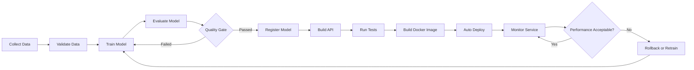
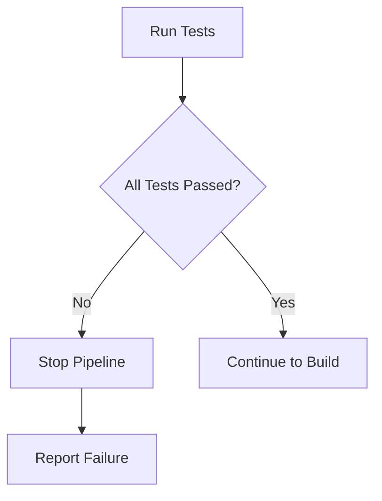
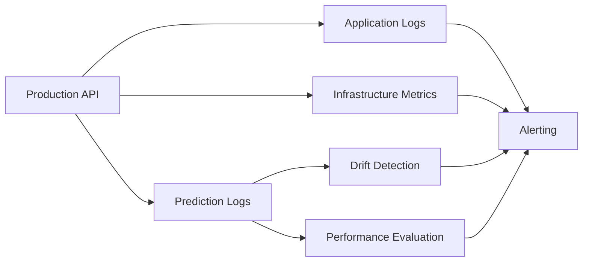
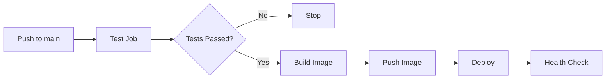
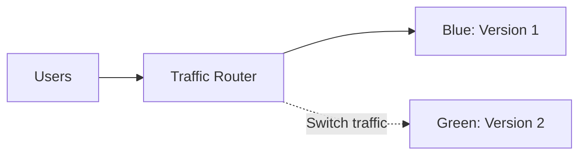
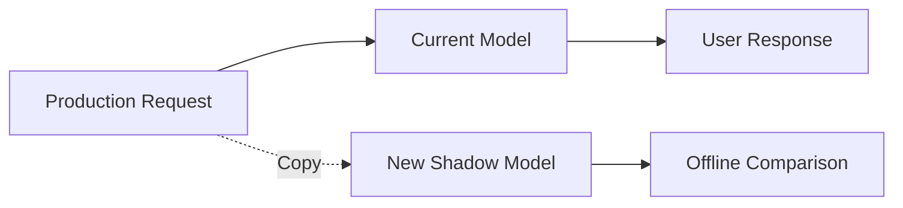
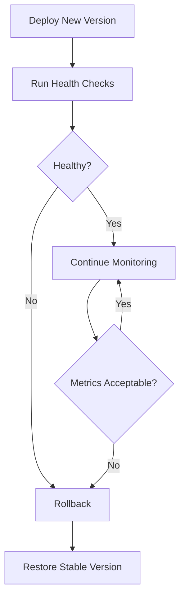
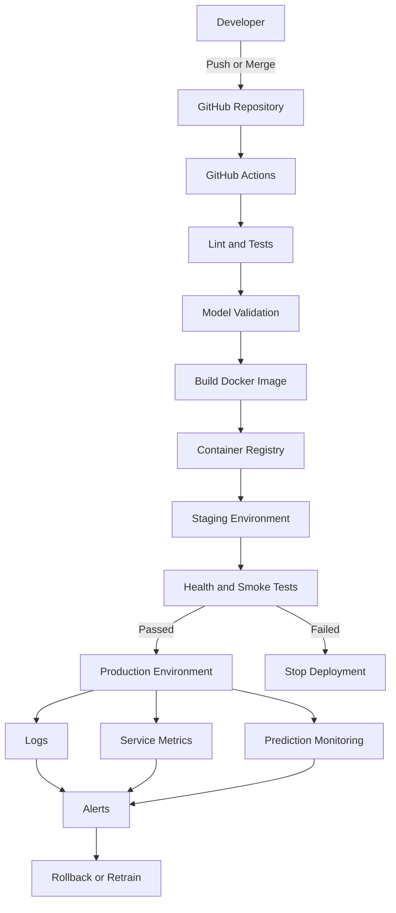
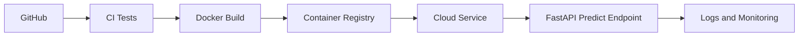

# 016 - Auto Deploy

| Item                   | Details                   |
| ---------------------- | ------------------------- |
| **Course**             | 04 - MLOps and Deployment |
| **Module**             | Module 08 - MLOps         |
| **Content Group**      | CI/CD                     |
| **Roadmap Source**     | MLOps / CI/CD             |
| **Lesson Type**        | MLOps                     |
| **Order in Module**    | 016                       |
| **Suggested Duration** | 22 minutes                |

---

## 1. Lesson Overview

**Auto Deploy**, or automated deployment, is the process of automatically releasing an application, machine learning model, API, or data service after its code passes a predefined set of checks.

In a traditional workflow, a developer may need to:

1. Pull the latest source code.
2. Install dependencies.
3. run tests.
4. Build a Docker image.
5. Connect to a server.
6. Replace the running application.
7. Restart the service.
8. Verify that the deployment succeeded.

With Auto Deploy, these steps are executed by a CI/CD pipeline.

For an AI or Data Scientist, Auto Deploy helps transform a model from a local notebook into a reproducible service that can be tested, released, monitored, and rolled back safely.

A common deployment flow is:

```text
Code change
    ↓
Automated tests
    ↓
Build application or Docker image
    ↓
Push artifact to registry
    ↓
Deploy to environment
    ↓
Run health checks
    ↓
Monitor logs and metrics
```

Auto Deploy is not simply “uploading code automatically.” A reliable deployment workflow must include testing, versioning, security, validation, monitoring, and rollback mechanisms.

---

## 2. Learning Objectives

After completing this lesson, you should be able to:

* Explain Auto Deploy in your own words.
* Describe where automated deployment belongs in an ML lifecycle.
* Distinguish continuous delivery from continuous deployment.
* Identify the main stages of an automated deployment pipeline.
* Build a basic deployment workflow for a machine learning API.
* Explain how model, code, Docker image, and configuration versions are connected.
* Define health checks and post-deployment validation.
* Describe rollback strategies when a deployment fails.
* Identify security risks related to deployment credentials and secrets.
* Add a basic Auto Deploy workflow to an AI portfolio project.

---

## 3. What Is Auto Deploy?

Auto Deploy is a CI/CD capability that automatically releases a tested software artifact to a target environment.

The deployed artifact may be:

* A Python API.
* A machine learning prediction service.
* A Docker container.
* A batch prediction job.
* A dashboard.
* A data pipeline.
* A model-serving application.
* A scheduled training workflow.
* A serverless function.

For example, suppose you have a FastAPI model service:

```text
POST /predict
```

When you push a code change to the `main` branch, an automated pipeline may:

1. Download the repository.
2. Install Python dependencies.
3. Run unit and integration tests.
4. Build a Docker image.
5. Tag the image with a commit identifier.
6. Push the image to a container registry.
7. Deploy the new image to a cloud service.
8. Call the `/health` endpoint.
9. Mark the deployment as successful or roll it back.

---

## 4. Auto Deploy in the ML Lifecycle

Automated deployment is one stage of a larger machine learning lifecycle.



In standard software engineering, deployment primarily focuses on code.

In MLOps, deployment may depend on several versioned components:

```text
Application code
+ Model artifact
+ Feature logic
+ Dependency versions
+ Configuration
+ Infrastructure
= Deployable ML service
```

A deployment may fail even when the Python code is correct. For example:

* The model file is missing.
* The input schema has changed.
* The feature order is incorrect.
* The production dependency version differs from training.
* The model consumes too much memory.
* The API cannot access a required data source.
* The model performs poorly on current production data.

Therefore, ML deployment pipelines require both software tests and model-related validation.

---

## 5. Continuous Delivery vs. Continuous Deployment

These terms are related but not identical.

### Continuous Delivery

The pipeline automatically prepares a release, but a person approves the final production deployment.

```text
Commit
  ↓
Test
  ↓
Build
  ↓
Deploy to staging
  ↓
Manual approval
  ↓
Production
```

Continuous delivery is useful when:

* The application has high business risk.
* The model affects financial or medical decisions.
* Regulations require human approval.
* Production releases need coordination.
* The team wants to inspect staging results first.

### Continuous Deployment

Every change that passes all required checks is automatically released to production.

```text
Commit
  ↓
Test
  ↓
Build
  ↓
Validation
  ↓
Automatic production deployment
```

Continuous deployment is appropriate when:

* Test coverage is strong.
* Rollback is reliable.
* Changes are small and frequent.
* Production monitoring is mature.
* The service has low deployment risk.

### Comparison

| Topic                 | Continuous Delivery | Continuous Deployment |
| --------------------- | ------------------- | --------------------- |
| Tests automated       | Yes                 | Yes                   |
| Build automated       | Yes                 | Yes                   |
| Staging deployment    | Usually             | Usually               |
| Production deployment | Manual approval     | Automatic             |
| Human gate            | Yes                 | No                    |
| Operational risk      | Lower               | Potentially higher    |
| Release speed         | Fast                | Very fast             |

---

## 6. Main Components of an Auto Deploy Pipeline

### 6.1 Source Repository

The source repository stores:

* Application code.
* Model-loading logic.
* Tests.
* Dockerfile.
* Dependency files.
* Deployment configuration.
* CI/CD workflow files.

Example structure:

```text
ml-api/
├── app/
│   ├── main.py
│   ├── schemas.py
│   └── model_service.py
├── models/
│   └── model.joblib
├── tests/
│   ├── test_health.py
│   └── test_predict.py
├── Dockerfile
├── requirements.txt
├── README.md
└── .github/
    └── workflows/
        └── deploy.yml
```

---

### 6.2 Deployment Trigger

The trigger determines when the pipeline starts.

Common triggers include:

* A push to `main`.
* A merged pull request.
* A Git tag such as `v1.2.0`.
* A manual workflow action.
* A scheduled deployment.
* A model registry event.
* Approval from a reviewer.

Example:

```yaml
on:
  push:
    branches:
      - main
```

This configuration starts the workflow whenever new code is pushed to the `main` branch.

---

### 6.3 Test Stage

Before deployment, the pipeline should verify that the application behaves correctly.

Common tests include:

* Unit tests.
* API tests.
* Integration tests.
* Model loading tests.
* Input schema tests.
* Output schema tests.
* Data validation tests.
* Security scans.
* Dependency checks.
* Docker build tests.

Example commands:

```bash
ruff check .
pytest -v
```

A deployment should stop when a required test fails.



---

### 6.4 Build Stage

The build stage creates a deployable artifact.

For a containerized ML API, the artifact is usually a Docker image.

```bash
docker build -t fraud-api:latest .
```

A production image should use an immutable version tag.

Examples:

```text
fraud-api:1.3.0
fraud-api:git-a82c19f
fraud-api:2026-07-13
```

Avoid relying only on:

```text
fraud-api:latest
```

The `latest` tag can change and does not clearly identify which code or model is running.

A better approach is:

```text
Image version = Git commit SHA
```

For example:

```bash
docker build -t registry.example.com/fraud-api:a82c19f .
```

---

### 6.5 Artifact or Container Registry

The registry stores deployable versions of the application.

Examples include:

* GitHub Container Registry.
* Docker Hub.
* Google Artifact Registry.
* Amazon Elastic Container Registry.
* Azure Container Registry.

The deployment server pulls a specific image version from the registry.

```text
GitHub repository
       ↓
CI pipeline builds image
       ↓
Container registry
       ↓
Production service pulls image
```

---

### 6.6 Deployment Environment

Common deployment targets include:

* Virtual machines.
* Kubernetes clusters.
* Managed container services.
* Serverless platforms.
* Internal company servers.
* Edge devices.

A typical environment structure is:

```text
Development → Staging → Production
```

| Environment | Purpose                             |
| ----------- | ----------------------------------- |
| Development | Local experimentation and debugging |
| Staging     | Production-like validation          |
| Production  | Real users and live traffic         |

The same Docker image should ideally move through all environments. Only configuration should change.

---

### 6.7 Health Checks

A health check determines whether the deployed service is running.

A basic FastAPI health endpoint may look like this:

```python
from fastapi import FastAPI

app = FastAPI()


@app.get("/health")
def health_check() -> dict[str, str]:
    return {"status": "healthy"}
```

The pipeline can test it after deployment:

```bash
curl --fail https://api.example.com/health
```

However, a basic process check may not be enough for an ML service.

A more useful readiness check can verify that:

* The model file exists.
* The model can be loaded.
* Required feature definitions are available.
* The database connection works.
* The prediction component is ready.

Example:

```python
@app.get("/ready")
def readiness_check() -> dict[str, object]:
    return {
        "status": "ready",
        "model_loaded": model_service.is_loaded(),
        "model_version": model_service.version,
    }
```

---

### 6.8 Monitoring

Deployment is not complete when the API starts successfully.

The service should be monitored for:

* Request count.
* Error rate.
* Response latency.
* CPU usage.
* Memory usage.
* Container restarts.
* Prediction distribution.
* Input distribution.
* Missing values.
* Data drift.
* Model performance.
* Model version.
* Application version.



---

## 7. Example Auto Deploy Workflow

The following example uses GitHub Actions to:

1. Run tests.
2. Build a Docker image.
3. Push it to GitHub Container Registry.
4. Trigger a deployment command.

```yaml
name: Test and Deploy ML API

on:
  push:
    branches:
      - main

permissions:
  contents: read
  packages: write

env:
  IMAGE_NAME: ghcr.io/${{ github.repository }}/ml-api

jobs:
  test:
    runs-on: ubuntu-latest

    steps:
      - name: Check out repository
        uses: actions/checkout@v4

      - name: Set up Python
        uses: actions/setup-python@v5
        with:
          python-version: "3.12"

      - name: Install dependencies
        run: |
          python -m pip install --upgrade pip
          pip install -r requirements.txt

      - name: Run code checks
        run: |
          ruff check .

      - name: Run tests
        run: |
          pytest -v

  build-and-deploy:
    runs-on: ubuntu-latest
    needs: test

    steps:
      - name: Check out repository
        uses: actions/checkout@v4

      - name: Log in to container registry
        uses: docker/login-action@v3
        with:
          registry: ghcr.io
          username: ${{ github.actor }}
          password: ${{ secrets.GITHUB_TOKEN }}

      - name: Build Docker image
        run: |
          docker build \
            -t $IMAGE_NAME:${{ github.sha }} \
            -t $IMAGE_NAME:latest \
            .

      - name: Push Docker image
        run: |
          docker push $IMAGE_NAME:${{ github.sha }}
          docker push $IMAGE_NAME:latest

      - name: Deploy service
        env:
          DEPLOY_WEBHOOK: ${{ secrets.DEPLOY_WEBHOOK }}
        run: |
          curl --fail \
            --request POST \
            "$DEPLOY_WEBHOOK"

      - name: Verify deployment
        run: |
          sleep 10
          curl --fail https://api.example.com/health
```

### Workflow Dependency

The following line ensures that deployment starts only after testing succeeds:

```yaml
needs: test
```

The execution order becomes:



---

## 8. Managing Secrets

Deployment pipelines often require sensitive values such as:

* Cloud credentials.
* Registry passwords.
* API tokens.
* SSH private keys.
* Database passwords.
* Deployment webhooks.

Never store secrets directly in:

* Python source code.
* Dockerfiles.
* GitHub workflow files.
* Repository configuration files.
* Public README files.

Incorrect:

```yaml
env:
  API_TOKEN: "my-real-secret-token"
```

Better:

```yaml
env:
  API_TOKEN: ${{ secrets.API_TOKEN }}
```

Important rules:

1. Use the minimum permissions required.
2. Rotate credentials regularly.
3. Separate staging and production credentials.
4. Never print secrets in logs.
5. Prefer short-lived credentials when supported.
6. Protect production environments with approval rules.
7. Restrict who can modify deployment workflows.

---

## 9. Model Versioning in Auto Deploy

An ML deployment should identify both the code version and model version.

Example metadata:

```json
{
  "service_version": "a82c19f",
  "model_name": "fraud-detector",
  "model_version": "12",
  "training_dataset_version": "2026-07-01",
  "feature_schema_version": "3"
}
```

A prediction log may contain:

```json
{
  "request_id": "req-8102",
  "timestamp": "2026-07-13T08:30:00Z",
  "service_version": "a82c19f",
  "model_version": "12",
  "prediction": 1,
  "probability": 0.91,
  "latency_ms": 24
}
```

This information helps answer questions such as:

* Which model produced this prediction?
* Which code version was running?
* Which dataset trained the model?
* When did model performance begin to decline?
* Which deployment introduced an error?

---

## 10. Deployment Quality Gates

A quality gate is a condition that must be satisfied before deployment continues.

### Software Quality Gates

* Unit tests pass.
* API tests pass.
* Code formatting is valid.
* Static analysis passes.
* Security scan finds no critical issue.
* Docker image builds successfully.

### Model Quality Gates

* Accuracy exceeds the required threshold.
* F1-score does not fall significantly.
* Recall for an important class remains acceptable.
* Inference latency stays below the limit.
* Model size remains within infrastructure limits.
* Output schema remains compatible.
* Fairness metrics remain within an approved range.
* Training data passes validation.

Example logic:

```python
minimum_f1 = 0.82
maximum_latency_ms = 100

if evaluation["f1_score"] < minimum_f1:
    raise RuntimeError("Model failed the F1-score quality gate")

if evaluation["p95_latency_ms"] > maximum_latency_ms:
    raise RuntimeError("Model failed the latency quality gate")
```

The pipeline should not deploy a model simply because training completed successfully.

---

## 11. Deployment Strategies

Replacing the production service immediately is not always the safest approach.

### 11.1 Recreate Deployment

The old version stops before the new version starts.

```text
Version 1 stops → Version 2 starts
```

Advantages:

* Simple.
* Low infrastructure cost.

Disadvantages:

* May cause downtime.
* Risky when startup is slow.

---

### 11.2 Rolling Deployment

Instances are updated gradually.

```text
V1 V1 V1
   ↓
V2 V1 V1
   ↓
V2 V2 V1
   ↓
V2 V2 V2
```

Advantages:

* Usually no full downtime.
* Gradual replacement.

Disadvantages:

* Two versions may run simultaneously.
* Compatibility must be maintained.

---

### 11.3 Blue-Green Deployment

Two complete environments exist:

```text
Blue environment  = current production
Green environment = new release
```

After validation, traffic switches from Blue to Green.



Advantages:

* Fast rollback.
* New version can be tested before receiving traffic.

Disadvantages:

* Requires additional infrastructure.

---

### 11.4 Canary Deployment

A small percentage of users receives the new version first.

```text
95% traffic → Version 1
 5% traffic → Version 2
```

If metrics remain healthy:

```text
50% traffic → Version 1
50% traffic → Version 2
```

Finally:

```text
100% traffic → Version 2
```

Advantages:

* Reduces deployment risk.
* Supports real production validation.

Disadvantages:

* Requires traffic routing and strong monitoring.
* Model comparisons can become complex.

---

### 11.5 Shadow Deployment

The new model receives copies of production requests, but its predictions do not affect users.



This strategy is especially useful for machine learning systems.

It allows teams to compare:

* Prediction differences.
* Latency.
* Resource usage.
* Drift sensitivity.
* Failure rate.

---

## 12. Rollback

A rollback restores a previously stable application or model version.

A rollback may be required when:

* Health checks fail.
* Error rate increases.
* Latency becomes too high.
* The API schema is broken.
* The model produces invalid predictions.
* Drift alerts appear.
* Business performance declines.
* Resource usage becomes excessive.

A simple rollback can redeploy the previous Docker image:

```bash
docker pull registry.example.com/ml-api:a82c19f
docker stop ml-api
docker rm ml-api

docker run -d \
  --name ml-api \
  -p 8000:8000 \
  registry.example.com/ml-api:a82c19f
```

A production workflow should record:

* Current image version.
* Previous stable image version.
* Model version.
* Deployment time.
* Deployment owner or pipeline.
* Validation result.



---

## 13. Auto Deploy Architecture Example



---

## 14. Practical Demo

Assume that you have already created:

* A trained model saved as `model.joblib`.
* A FastAPI application.
* A `/predict` endpoint.
* A `/health` endpoint.
* A Dockerfile.
* Automated tests.

### Step 1: Run the Tests Locally

```bash
pytest -v
```

### Step 2: Build the Docker Image

```bash
docker build -t ml-api:local .
```

### Step 3: Run the Container

```bash
docker run \
  --rm \
  -p 8000:8000 \
  ml-api:local
```

### Step 4: Test the Health Endpoint

```bash
curl http://localhost:8000/health
```

Expected response:

```json
{
  "status": "healthy"
}
```

### Step 5: Test a Prediction

```bash
curl \
  --request POST \
  http://localhost:8000/predict \
  --header "Content-Type: application/json" \
  --data '{
    "feature_1": 12.5,
    "feature_2": 4.2,
    "feature_3": 0
  }'
```

Example response:

```json
{
  "prediction": 1,
  "probability": 0.87,
  "model_version": "1.0.0"
}
```

### Step 6: Push the Project

```bash
git add .
git commit -m "Add automated deployment workflow"
git push origin main
```

The CI/CD platform should now:

```text
Run tests
    ↓
Build image
    ↓
Push image
    ↓
Deploy service
    ↓
Check health
```

---

## 15. What Should Be Logged?

A production ML API should log enough information for debugging and monitoring without exposing sensitive data.

Recommended fields include:

```text
timestamp
request_id
endpoint
response_status
latency_ms
service_version
model_version
input_schema_version
prediction
prediction_confidence
error_type
```

Avoid logging:

* Passwords.
* Access tokens.
* Full financial records.
* Personally identifiable information.
* Raw medical information.
* Secret environment variables.

Example structured log:

```json
{
  "timestamp": "2026-07-13T08:30:00Z",
  "level": "INFO",
  "request_id": "req-8102",
  "endpoint": "/predict",
  "status_code": 200,
  "latency_ms": 24,
  "service_version": "a82c19f",
  "model_version": "12"
}
```

---

## 16. Common Mistakes

### 16.1 Deploying Directly from a Notebook

A notebook is useful for experimentation, but it is usually not a reliable production interface.

Problems include:

* Hidden state.
* Manual execution order.
* Missing dependency definitions.
* Limited testing.
* Difficult automation.

Move reusable logic into Python modules, scripts, APIs, or pipelines.

---

### 16.2 Deploying Without Tests

A pipeline that builds and deploys immediately after every push can release broken code.

At minimum, test:

* Application startup.
* Model loading.
* Health endpoint.
* Prediction endpoint.
* Input validation.
* Output format.

---

### 16.3 Using Only the `latest` Tag

The `latest` tag makes rollback and investigation difficult.

Use an immutable identifier such as:

```text
Git commit SHA
Release version
Model registry version
```

---

### 16.4 Storing Secrets in the Repository

Secrets committed to Git may remain in repository history even after deletion.

Use:

* CI/CD secret stores.
* Cloud secret managers.
* Identity-based authentication.
* Short-lived credentials.

---

### 16.5 No Post-Deployment Check

A deployment command can succeed even when the application is unhealthy.

Always verify:

* Health endpoint.
* Readiness endpoint.
* Test prediction.
* Error rate.
* Basic latency.
* Model version.

---

### 16.6 No Rollback Plan

Teams sometimes design deployment automation but forget failure recovery.

Before enabling production Auto Deploy, determine:

```text
What is the previous stable version?
How is it redeployed?
Who receives the alert?
How quickly can traffic be restored?
```

---

### 16.7 Ignoring Model-Specific Risks

A healthy API does not guarantee a healthy model.

The service may return HTTP `200` while:

* Predictions are meaningless.
* Features are in the wrong order.
* Input distributions have changed.
* The wrong model version is loaded.
* Accuracy has decreased.

Service monitoring and model monitoring must be treated separately.

---

### 16.8 Deploying Every Experiment

Not every trained model should become a production release.

A model should pass:

* Technical tests.
* Evaluation thresholds.
* Data validation.
* Business requirements.
* Responsible AI checks.
* Approval rules when required.

---

## 17. Recommended Production Checklist

### Before Deployment

* [ ] Code review is complete.
* [ ] Unit tests pass.
* [ ] Integration tests pass.
* [ ] Model loads successfully.
* [ ] Input and output schemas are validated.
* [ ] Model quality gates pass.
* [ ] Docker image builds successfully.
* [ ] Image has an immutable version tag.
* [ ] Secrets are stored securely.
* [ ] Previous stable version is recorded.

### During Deployment

* [ ] The correct environment is selected.
* [ ] Database or schema changes are compatible.
* [ ] Health checks are enabled.
* [ ] Deployment logs are available.
* [ ] Traffic strategy is defined.
* [ ] Automatic rollback conditions are configured.

### After Deployment

* [ ] Health endpoint responds successfully.
* [ ] Readiness endpoint confirms model availability.
* [ ] A sample prediction succeeds.
* [ ] Error rate is normal.
* [ ] Latency is acceptable.
* [ ] Resource usage is acceptable.
* [ ] Model and service versions are visible.
* [ ] Prediction distribution is monitored.
* [ ] Alerts are functioning.

---

## 18. Practical Exercise

Create an automated deployment workflow for a small machine learning API.

### Required Tasks

1. Train or reuse a simple classification model.
2. Save the model using Joblib or another serialization method.
3. Create a FastAPI application.
4. Add a `POST /predict` endpoint.
5. Add a `GET /health` endpoint.
6. Add model and application version information.
7. Write at least two API tests.
8. Create a Dockerfile.
9. Add a GitHub Actions workflow.
10. Run tests automatically on every pull request.
11. Deploy automatically after a successful merge to `main`.
12. Run a health check after deployment.
13. Document a rollback procedure.

### Suggested Pipeline

```text
Pull request
    ↓
Lint
    ↓
Unit tests
    ↓
API integration tests
    ↓
Merge to main
    ↓
Build Docker image
    ↓
Push image to registry
    ↓
Deploy to staging
    ↓
Health check
    ↓
Deploy to production
```

### Questions to Answer

* What event triggers your deployment?
* Which tests must pass?
* How is your Docker image versioned?
* Where are your deployment secrets stored?
* How do you know that the new service is healthy?
* How do you identify the deployed model version?
* What happens when the health check fails?
* How would you restore the previous version?
* Which model metrics should be monitored after deployment?

---

## 19. Portfolio Artifact

A strong Auto Deploy portfolio project should include:

```text
ml-model-api/
├── app/
├── models/
├── tests/
├── Dockerfile
├── requirements.txt
├── .github/workflows/deploy.yml
├── sample_request.json
└── README.md
```

The README should explain:

1. The problem being solved.
2. The dataset and model.
3. The model evaluation metrics.
4. How to run tests.
5. How to run the API locally.
6. How to build the Docker image.
7. How the deployment workflow works.
8. Which environment variables are required.
9. How health checks work.
10. How rollback is performed.
11. Which production metrics should be monitored.

A useful architecture diagram can make the project easier to understand:



---

## 20. Completion Checklist

* [ ] I can explain Auto Deploy in one or two minutes.
* [ ] I understand the difference between continuous delivery and continuous deployment.
* [ ] I can describe the stages of an automated deployment pipeline.
* [ ] I know why deployment must depend on automated tests.
* [ ] I can build and version a Docker image.
* [ ] I understand how CI/CD secrets should be managed.
* [ ] I can create a health endpoint for an ML API.
* [ ] I understand why model validation is different from application testing.
* [ ] I can describe rolling, blue-green, canary, and shadow deployments.
* [ ] I can explain how to roll back to a previous version.
* [ ] I know which service and model metrics should be monitored.
* [ ] I have created an API, Docker service, workflow file, or deployment note for this lesson.
* [ ] I have documented at least one assumption, caveat, or unresolved question.

---

## 21. Related Outcome

Deploy, version, monitor, and operate machine learning models using:

* APIs.
* Docker.
* CI/CD pipelines.
* Container registries.
* Automated tests.
* Model quality gates.
* Health checks.
* Production monitoring.
* Drift-aware workflows.
* Rollback strategies.

---

## 22. Related Mini Project

### Deploy an ML Model API

Build a small production-style machine learning service containing:

* A FastAPI `/predict` endpoint.
* A `/health` endpoint.
* A versioned model artifact.
* Input validation.
* Automated tests.
* A Dockerfile.
* A GitHub Actions workflow.
* Automatic staging or production deployment.
* Post-deployment health verification.
* A documented rollback process.
* A complete README with sample requests.

---

## 23. Summary

**Auto Deploy** automatically releases tested application or model versions to a target environment.

A reliable ML Auto Deploy workflow usually follows this sequence:

```text
Code or model change
    ↓
Automated tests
    ↓
Model validation
    ↓
Build versioned artifact
    ↓
Push to registry
    ↓
Deploy to environment
    ↓
Run health checks
    ↓
Monitor service and model
    ↓
Rollback or retrain when necessary
```

The objective is not merely to deploy faster. The objective is to make deployment:

* Repeatable.
* Testable.
* Traceable.
* Secure.
* Observable.
* Reversible.

For an AI or Data Scientist, Auto Deploy is an important step between building a successful notebook experiment and operating a dependable machine learning system in production.

---

# Bài luyện tập

## Mục tiêu


## Đề bài


## Yêu cầu hoàn thành

- [ ] 
- [ ] 
- [ ] 

## Kết quả / lời giải


## Ghi chú
