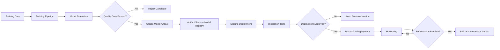
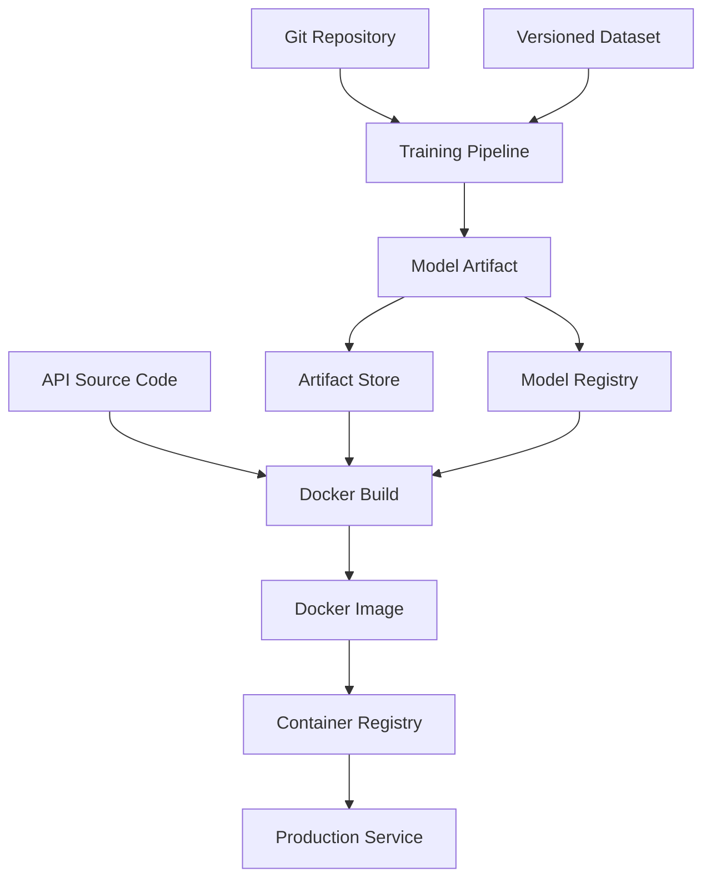
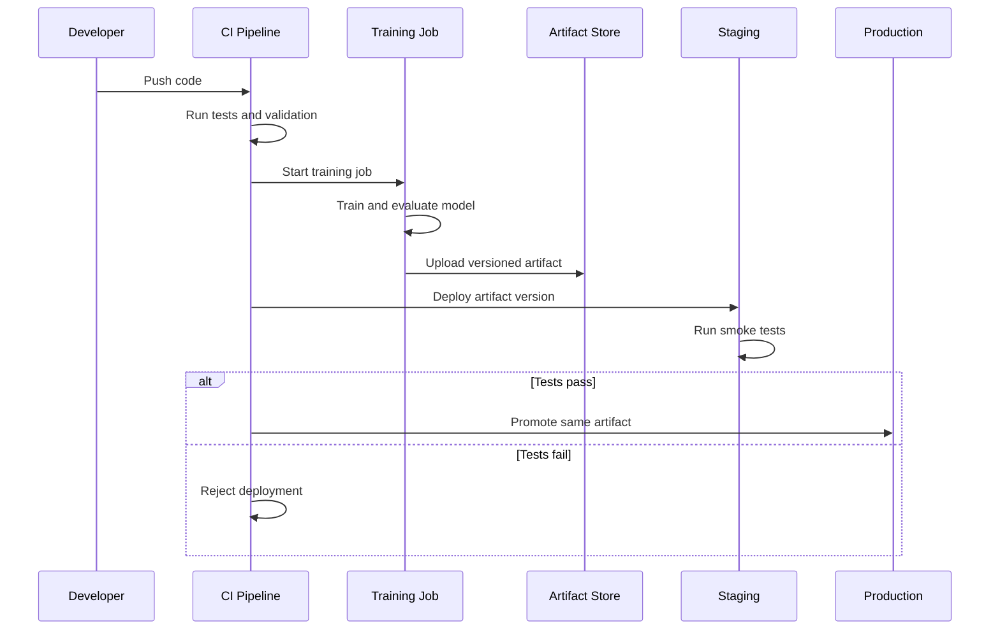
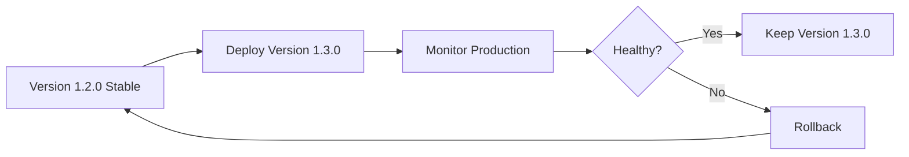

# 017 — Model Artifact

| Item                   | Details                   |
| ---------------------- | ------------------------- |
| **Course**             | 04 — MLOps and Deployment |
| **Module**             | Module 08 — MLOps         |
| **Content Group**      | CI/CD                     |
| **Roadmap Source**     | MLOps / CI/CD             |
| **Lesson Type**        | MLOps                     |
| **Order in Module**    | 017                       |
| **Suggested Duration** | 22 minutes                |

---

## 1. Lesson Overview

A **model artifact** is a saved, versioned, and deployable output produced by a machine learning training process.

It may contain:

* Trained model parameters
* Preprocessing logic
* Feature definitions
* Class labels
* Model configuration
* Dependency information
* Evaluation metrics
* Training metadata
* A model signature or input/output schema

A model artifact allows a trained model to move from an experimental environment, such as a Jupyter notebook, into testing, staging, and production environments.

```text
Training code
     ↓
Trained model
     ↓
Model artifact
     ↓
Registry or artifact storage
     ↓
API, batch job, or streaming service
```

Without a model artifact, the model may exist only in notebook memory and cannot be reliably reproduced, tested, deployed, or rolled back.

---

## 2. Learning Objectives

After completing this lesson, you should be able to:

* Explain what a model artifact is in your own words.
* Distinguish a model artifact from training code and a Docker image.
* Identify the files and metadata that should be included with a model.
* Save and load a trained model safely.
* Version model artifacts for CI/CD workflows.
* Connect a model artifact to a model registry or artifact store.
* Use an artifact in a FastAPI prediction service.
* Describe how artifacts support deployment, monitoring, and rollback.

---

## 3. What Is a Model Artifact?

A model artifact is the persistent result of model training.

For example, after training a scikit-learn classifier, the Python variable `model` exists only in memory:

```python
model.fit(X_train, y_train)
```

If the Python process stops, the trained model disappears unless it is saved.

```python
import joblib

joblib.dump(model, "model.joblib")
```

The file `model.joblib` is a simple model artifact.

However, a production artifact usually contains more than only the trained estimator.

```text
model-artifact/
├── model.joblib
├── preprocessing.joblib
├── metadata.json
├── metrics.json
├── signature.json
├── requirements.txt
└── README.md
```

This package gives developers and deployment systems enough information to understand, validate, load, and operate the model.

---

## 4. Model Artifact in the ML Lifecycle

A model artifact acts as the connection between model training and model serving.



The artifact should be created only after the training pipeline has produced a valid model and the required quality checks have passed.

---

## 5. What Should a Model Artifact Contain?

### 5.1 Trained Model

The central file stores the trained model parameters or structure.

Common formats include:

| Framework          | Common artifact formats                            |
| ------------------ | -------------------------------------------------- |
| scikit-learn       | `.joblib`, `.pkl`                                  |
| XGBoost            | `.json`, `.ubj`, `.bin`                            |
| LightGBM           | `.txt`, `.bin`                                     |
| TensorFlow / Keras | SavedModel, `.keras`, `.h5`                        |
| PyTorch            | `.pt`, `.pth`                                      |
| ONNX               | `.onnx`                                            |
| Hugging Face       | `config.json`, model weight files, tokenizer files |

The best format depends on the framework, serving environment, portability requirements, and security constraints.

---

### 5.2 Preprocessing Logic

The prediction service must perform the same transformations used during training.

Examples include:

* Missing-value imputation
* Numerical scaling
* Categorical encoding
* Feature selection
* Text tokenization
* Image resizing and normalization

A recommended approach in scikit-learn is to package preprocessing and prediction inside one pipeline.

```python
from sklearn.compose import ColumnTransformer
from sklearn.impute import SimpleImputer
from sklearn.linear_model import LogisticRegression
from sklearn.pipeline import Pipeline
from sklearn.preprocessing import OneHotEncoder, StandardScaler

numeric_pipeline = Pipeline(
    steps=[
        ("imputer", SimpleImputer(strategy="median")),
        ("scaler", StandardScaler()),
    ]
)

categorical_pipeline = Pipeline(
    steps=[
        ("imputer", SimpleImputer(strategy="most_frequent")),
        ("encoder", OneHotEncoder(handle_unknown="ignore")),
    ]
)

preprocessor = ColumnTransformer(
    transformers=[
        ("numeric", numeric_pipeline, ["age", "income"]),
        ("categorical", categorical_pipeline, ["country"]),
    ]
)

model_pipeline = Pipeline(
    steps=[
        ("preprocessor", preprocessor),
        ("classifier", LogisticRegression()),
    ]
)

model_pipeline.fit(X_train, y_train)
```

Saving this complete pipeline helps prevent **training-serving skew**.

```python
import joblib

joblib.dump(model_pipeline, "artifacts/model_pipeline.joblib")
```

---

### 5.3 Model Metadata

Metadata explains where the artifact came from and how it should be used.

Example:

```json
{
  "model_name": "customer-churn-classifier",
  "model_version": "1.3.0",
  "created_at": "2026-07-13T00:00:00Z",
  "framework": "scikit-learn",
  "framework_version": "1.7.0",
  "algorithm": "LogisticRegression",
  "training_dataset_version": "churn-data-2026-07",
  "git_commit": "8f3ac7d",
  "training_run_id": "run-20260713-001",
  "target_column": "churn",
  "artifact_checksum": "sha256:example-checksum",
  "status": "candidate"
}
```

Useful metadata fields include:

* Model name
* Model version
* Creation time
* Training run ID
* Source-code commit
* Dataset version
* Framework and framework version
* Hyperparameters
* Model owner
* Approval status
* Artifact checksum

---

### 5.4 Evaluation Metrics

The artifact should be connected to the metrics used to approve it.

```json
{
  "accuracy": 0.873,
  "precision": 0.842,
  "recall": 0.791,
  "f1_score": 0.816,
  "roc_auc": 0.914,
  "validation_samples": 4200
}
```

Metrics help CI/CD systems decide whether a model candidate is good enough for deployment.

For example:

```text
Deploy only when:

ROC-AUC >= 0.90
AND recall >= 0.78
AND validation dataset contains at least 3,000 samples
```

A model should not be promoted only because its artifact was created successfully.

---

### 5.5 Model Signature

A model signature describes the expected inputs and outputs.

Example:

```json
{
  "inputs": [
    {
      "name": "age",
      "type": "integer",
      "required": true,
      "minimum": 18
    },
    {
      "name": "income",
      "type": "number",
      "required": true
    },
    {
      "name": "country",
      "type": "string",
      "required": true
    }
  ],
  "outputs": [
    {
      "name": "prediction",
      "type": "integer"
    },
    {
      "name": "churn_probability",
      "type": "number"
    }
  ]
}
```

The signature can be used for:

* API request validation
* Contract testing
* Schema compatibility checks
* Documentation generation
* Detection of missing or unexpected features

---

### 5.6 Dependency Information

A model may fail to load when the serving environment uses incompatible library versions.

Example `requirements.txt`:

```text
fastapi==0.116.0
joblib==1.5.1
numpy==2.3.1
pandas==2.3.0
pydantic==2.11.7
scikit-learn==1.7.0
uvicorn==0.35.0
```

For stronger reproducibility, use a lock file or environment definition such as:

* `poetry.lock`
* `uv.lock`
* `requirements.lock`
* `conda-lock.yml`
* Docker image digest

---

## 6. Artifact, Model Registry, and Docker Image

These concepts are related but not identical.

| Concept            | Purpose                                                  |
| ------------------ | -------------------------------------------------------- |
| **Training code**  | Defines how the model is trained                         |
| **Model artifact** | Stores the trained model and related files               |
| **Artifact store** | Stores model files and other large outputs               |
| **Model registry** | Tracks model versions, stages, metadata, and approvals   |
| **Docker image**   | Packages the serving application and runtime environment |
| **Deployment**     | Runs a selected model version in an environment          |

A model artifact is usually copied into or downloaded by a Docker image during deployment.



An alternative approach is to build one generic serving image and download the selected model artifact when the container starts.

---

## 7. Artifact Versioning

Every deployable artifact should have a unique and traceable version.

### Example versions

```text
customer-churn-model:1.0.0
customer-churn-model:1.1.0
customer-churn-model:2.0.0
```

A version may be based on:

* Semantic versioning
* Git commit SHA
* Training run ID
* Timestamp
* CI pipeline number
* Content checksum

A useful production identifier could combine several values:

```text
customer-churn-model/
└── 1.3.0-8f3ac7d-run20260713/
```

### Recommended principle

> Build an artifact once, validate it once, and promote the same immutable artifact across environments.

Avoid retraining or rebuilding the model separately for staging and production.

```text
Incorrect:

Train for staging → artifact A
Train again for production → artifact B

Recommended:

Train once → artifact A
Test artifact A in staging
Promote artifact A to production
```

This ensures the production model is exactly the model that passed staging tests.

---

## 8. Saving a Complete Model Artifact

The following example creates a simple artifact package.

```python
from __future__ import annotations

import hashlib
import json
from datetime import datetime, timezone
from pathlib import Path
from typing import Any

import joblib
from sklearn.pipeline import Pipeline


def calculate_sha256(file_path: Path) -> str:
    sha256 = hashlib.sha256()

    with file_path.open("rb") as file:
        for chunk in iter(lambda: file.read(8192), b""):
            sha256.update(chunk)

    return sha256.hexdigest()


def save_model_artifact(
    model: Pipeline,
    metrics: dict[str, float],
    artifact_directory: str,
    metadata: dict[str, Any],
) -> Path:
    artifact_path = Path(artifact_directory)
    artifact_path.mkdir(parents=True, exist_ok=True)

    model_path = artifact_path / "model.joblib"
    metrics_path = artifact_path / "metrics.json"
    metadata_path = artifact_path / "metadata.json"

    joblib.dump(model, model_path)

    metrics_path.write_text(
        json.dumps(metrics, indent=2),
        encoding="utf-8",
    )

    complete_metadata = {
        **metadata,
        "created_at": datetime.now(timezone.utc).isoformat(),
        "artifact_checksum": calculate_sha256(model_path),
    }

    metadata_path.write_text(
        json.dumps(complete_metadata, indent=2),
        encoding="utf-8",
    )

    return artifact_path
```

Example usage:

```python
metrics = {
    "accuracy": 0.873,
    "f1_score": 0.816,
    "roc_auc": 0.914,
}

metadata = {
    "model_name": "customer-churn-classifier",
    "model_version": "1.3.0",
    "git_commit": "8f3ac7d",
    "dataset_version": "churn-data-2026-07",
}

artifact_path = save_model_artifact(
    model=model_pipeline,
    metrics=metrics,
    artifact_directory="artifacts/customer-churn/1.3.0",
    metadata=metadata,
)

print(f"Artifact saved to: {artifact_path}")
```

---

## 9. Loading and Validating an Artifact

The serving application should validate the artifact before using it.

```python
from __future__ import annotations

import hashlib
import json
from pathlib import Path
from typing import Any

import joblib


def calculate_sha256(file_path: Path) -> str:
    sha256 = hashlib.sha256()

    with file_path.open("rb") as file:
        for chunk in iter(lambda: file.read(8192), b""):
            sha256.update(chunk)

    return sha256.hexdigest()


def load_model_artifact(
    artifact_directory: str,
) -> tuple[Any, dict, dict]:
    artifact_path = Path(artifact_directory)

    model_path = artifact_path / "model.joblib"
    metadata_path = artifact_path / "metadata.json"
    metrics_path = artifact_path / "metrics.json"

    required_files = [model_path, metadata_path, metrics_path]

    for required_file in required_files:
        if not required_file.exists():
            raise FileNotFoundError(
                f"Required artifact file is missing: {required_file}"
            )

    metadata = json.loads(metadata_path.read_text(encoding="utf-8"))
    metrics = json.loads(metrics_path.read_text(encoding="utf-8"))

    expected_checksum = metadata.get("artifact_checksum")
    actual_checksum = calculate_sha256(model_path)

    if expected_checksum != actual_checksum:
        raise ValueError("Model artifact checksum validation failed")

    model = joblib.load(model_path)

    return model, metadata, metrics
```

Validation can detect:

* Missing files
* Corrupted files
* Unexpected model versions
* Unsupported framework versions
* Schema incompatibility
* Artifact tampering

---

## 10. Serving the Artifact with FastAPI

### Suggested project structure

```text
ml-model-api/
├── app/
│   ├── __init__.py
│   ├── main.py
│   └── schemas.py
├── artifacts/
│   └── customer-churn/
│       └── 1.3.0/
│           ├── model.joblib
│           ├── metadata.json
│           ├── metrics.json
│           └── signature.json
├── tests/
│   └── test_api.py
├── Dockerfile
├── requirements.txt
└── README.md
```

### Request and response schemas

```python
# app/schemas.py

from pydantic import BaseModel, Field


class PredictionRequest(BaseModel):
    age: int = Field(ge=18, le=120)
    income: float = Field(ge=0)
    country: str = Field(min_length=2)


class PredictionResponse(BaseModel):
    prediction: int
    churn_probability: float
    model_version: str
```

### Prediction API

```python
# app/main.py

from contextlib import asynccontextmanager
from typing import Any

import pandas as pd
from fastapi import FastAPI, HTTPException

from app.schemas import PredictionRequest, PredictionResponse
from app.artifact import load_model_artifact


model: Any = None
model_metadata: dict = {}


@asynccontextmanager
async def lifespan(app: FastAPI):
    global model, model_metadata

    model, model_metadata, _ = load_model_artifact(
        "artifacts/customer-churn/1.3.0"
    )

    yield

    model = None
    model_metadata = {}


app = FastAPI(
    title="Customer Churn Prediction API",
    version="1.0.0",
    lifespan=lifespan,
)


@app.get("/health")
def health_check() -> dict:
    return {
        "status": "healthy",
        "model_name": model_metadata.get("model_name"),
        "model_version": model_metadata.get("model_version"),
    }


@app.post(
    "/predict",
    response_model=PredictionResponse,
)
def predict(request: PredictionRequest) -> PredictionResponse:
    if model is None:
        raise HTTPException(
            status_code=503,
            detail="Model artifact is not loaded",
        )

    input_frame = pd.DataFrame([request.model_dump()])

    prediction = int(model.predict(input_frame)[0])
    probability = float(model.predict_proba(input_frame)[0, 1])

    return PredictionResponse(
        prediction=prediction,
        churn_probability=probability,
        model_version=model_metadata["model_version"],
    )
```

### Sample request

```bash
curl -X POST "http://localhost:8000/predict" \
  -H "Content-Type: application/json" \
  -d '{
    "age": 34,
    "income": 4200,
    "country": "VN"
  }'
```

### Sample response

```json
{
  "prediction": 1,
  "churn_probability": 0.7813,
  "model_version": "1.3.0"
}
```

Returning the model version makes prediction logs easier to trace.

---

## 11. Model Artifacts in CI/CD

A CI/CD pipeline may perform the following steps:

```text
1. Run unit tests
2. Train a candidate model
3. Evaluate the candidate
4. Check quality thresholds
5. Create the model artifact
6. Generate a checksum
7. Upload the artifact
8. Register the model version
9. Deploy to staging
10. Run integration and smoke tests
11. Promote the same artifact to production
```



### Example quality gate

```python
def validate_metrics(metrics: dict[str, float]) -> None:
    minimum_requirements = {
        "roc_auc": 0.90,
        "recall": 0.78,
    }

    failed_metrics = []

    for metric_name, minimum_value in minimum_requirements.items():
        actual_value = metrics.get(metric_name)

        if actual_value is None or actual_value < minimum_value:
            failed_metrics.append(
                f"{metric_name}: expected >= {minimum_value}, "
                f"received {actual_value}"
            )

    if failed_metrics:
        raise ValueError(
            "Model quality gate failed:\n" + "\n".join(failed_metrics)
        )
```

A CI job can terminate with an error when the candidate model does not meet the required thresholds.

---

## 12. Artifact Storage Options

Model artifacts should normally not be committed directly to Git, especially when they are large binary files.

Possible storage systems include:

* Amazon S3
* Google Cloud Storage
* Azure Blob Storage
* MinIO
* MLflow Artifact Store
* Weights & Biases Artifacts
* DVC remote storage
* Git LFS for selected use cases
* A private package or model repository

A typical storage path might look like:

```text
s3://ml-artifacts/
└── customer-churn-classifier/
    ├── 1.1.0/
    ├── 1.2.0/
    └── 1.3.0/
        ├── model.joblib
        ├── metadata.json
        ├── metrics.json
        └── signature.json
```

Each version should be immutable after it has been registered.

---

## 13. Model Registry

An artifact store saves files. A model registry adds lifecycle management.

A registry may track:

* Model name
* Version
* Artifact location
* Validation metrics
* Current deployment stage
* Approval status
* Model owner
* Training run
* Dataset lineage
* Deployment history

Example lifecycle:

```text
Candidate
   ↓
Validated
   ↓
Staging
   ↓
Production
   ↓
Archived
```

The registry helps answer questions such as:

* Which model version is currently in production?
* Which dataset was used to train it?
* Which Git commit created it?
* Who approved the deployment?
* Which previous version can be restored?
* What metrics did the model achieve before deployment?

---

## 14. Rollback Using Model Artifacts

Versioned artifacts make rollback possible.

Suppose version `1.3.0` produces unexpected predictions after deployment.

```text
Production before release:
customer-churn-model:1.2.0

New deployment:
customer-churn-model:1.3.0

Monitoring detects:
- Increased error rate
- Input schema failures
- Prediction distribution shift

Rollback:
customer-churn-model:1.2.0
```

The rollback process should reference a known artifact version rather than retraining the old model.



A rollback is reliable only when:

* Previous artifacts are retained.
* Artifacts are immutable.
* Dependencies are reproducible.
* Deployment configuration is versioned.
* Database or feature changes remain compatible.

---

## 15. Artifact Monitoring and Traceability

Prediction logs should record which artifact generated each output.

Example structured log:

```json
{
  "timestamp": "2026-07-13T00:30:00Z",
  "request_id": "req-8ab23d",
  "model_name": "customer-churn-classifier",
  "model_version": "1.3.0",
  "prediction": 1,
  "prediction_probability": 0.7813,
  "latency_ms": 18,
  "status": "success"
}
```

Do not log sensitive raw input data unless it is necessary, authorized, and protected.

Useful monitoring dimensions include:

* Model version
* Prediction latency
* Request error rate
* Input schema failures
* Prediction distribution
* Feature distribution
* Missing-value rate
* Data drift
* Concept drift
* Ground-truth performance

Without model-version information, it may be difficult to identify which artifact caused a production problem.

---

## 16. Security Considerations

### Unsafe deserialization

Formats such as Python Pickle and Joblib can execute code during loading.

Therefore:

* Never load an untrusted `.pkl` or `.joblib` file.
* Restrict artifact write permissions.
* Validate checksums or signatures.
* Store artifacts in controlled repositories.
* Scan dependencies and container images.
* Record artifact provenance.

For environments that need cross-language portability or stronger isolation, consider formats such as ONNX or framework-specific safe serialization formats.

However, no format removes the need for access control, integrity verification, and supply-chain security.

---

## 17. Common Mistakes

### 17.1 Saving Only the Estimator

```text
Saved:
model.joblib

Missing:
preprocessing logic
feature order
label mapping
metadata
dependencies
```

This commonly causes differences between training and production.

**Better approach:** save a complete preprocessing-and-model pipeline.

---

### 17.2 Overwriting the Same Artifact

```text
artifacts/model.joblib
```

Every training run replaces the previous file.

Consequences:

* No rollback
* No audit trail
* Difficult debugging
* Unclear production version

**Better approach:**

```text
artifacts/customer-churn/1.2.0/model.joblib
artifacts/customer-churn/1.3.0/model.joblib
```

---

### 17.3 Using the File Name `final_model`

```text
final_model.pkl
final_model_v2.pkl
final_model_v2_fixed.pkl
final_model_really_final.pkl
```

These names do not provide reliable version history.

Use a structured versioning system instead.

---

### 17.4 Ignoring Dependency Versions

A model trained with one framework version may not load correctly with another.

Record:

* Python version
* Framework version
* Preprocessing library versions
* Operating-system or container information

---

### 17.5 Retraining During Deployment

Deployment should normally retrieve an approved artifact.

It should not train a new model unexpectedly.

```text
Training pipeline → creates artifact
Deployment pipeline → deploys approved artifact
```

Keeping these responsibilities separate improves reliability and traceability.

---

### 17.6 Committing Large Binary Files to Git

Large artifacts can make Git repositories slow and difficult to maintain.

Store them in an artifact repository and commit only:

* Artifact configuration
* Model version reference
* Download script
* Checksum
* Metadata
* Documentation

---

### 17.7 Missing Input and Output Contracts

A model file alone does not explain:

* Required feature names
* Feature order
* Data types
* Allowed values
* Output meaning

Add a model signature and API schema.

---

## 18. Practical Exercise

### Objective

Create a versioned model artifact and use it in a small FastAPI service.

### Task 1 — Train a Model

Train a simple classification model using a dataset such as:

* Iris
* Titanic
* Customer churn
* Loan approval
* Breast cancer classification

Create one preprocessing-and-model pipeline.

---

### Task 2 — Save the Artifact

Create the following structure:

```text
artifacts/
└── my-classifier/
    └── 1.0.0/
        ├── model.joblib
        ├── metadata.json
        ├── metrics.json
        └── signature.json
```

The metadata should include:

* Model name
* Version
* Creation time
* Algorithm
* Dataset version
* Git commit
* Framework version

---

### Task 3 — Create an API

Implement:

```text
GET  /health
POST /predict
GET  /model-info
```

The `/model-info` endpoint should return:

```json
{
  "model_name": "my-classifier",
  "model_version": "1.0.0",
  "algorithm": "LogisticRegression",
  "metrics": {
    "accuracy": 0.95
  }
}
```

---

### Task 4 — Add Tests

Create tests for:

* Successful artifact loading
* Missing artifact file
* Invalid checksum
* Valid prediction request
* Invalid input schema
* Health endpoint
* Model version in the response

---

### Task 5 — Add Deployment Documentation

The README should explain:

```bash
pip install -r requirements.txt
uvicorn app.main:app --reload
```

Include a sample `/predict` request and response.

---

### Task 6 — Describe Production Monitoring

Write down which signals you would monitor:

* API error rate
* Request latency
* Feature drift
* Prediction distribution
* Model performance
* Artifact version
* Schema validation failures

---

## 19. Portfolio Artifact

A strong portfolio project could contain:

```text
model-artifact-project/
├── app/
│   ├── artifact.py
│   ├── main.py
│   └── schemas.py
├── artifacts/
│   └── model-name/
│       └── 1.0.0/
├── notebooks/
│   └── model_training.ipynb
├── src/
│   └── train.py
├── tests/
│   ├── test_artifact.py
│   └── test_api.py
├── .github/
│   └── workflows/
│       └── ci.yml
├── Dockerfile
├── requirements.txt
└── README.md
```

A strong README should answer:

1. What problem does the model solve?
2. Which dataset was used?
3. How was the model evaluated?
4. What files are included in the artifact?
5. How is the artifact versioned?
6. How can the API be started?
7. What does a sample request look like?
8. How would the model be monitored?
9. How would a rollback be performed?

---

## 20. Completion Checklist

* [ ] I can explain a model artifact in one or two minutes.
* [ ] I understand the difference between an artifact, registry, Docker image, and deployment.
* [ ] I can save and load a trained model.
* [ ] My preprocessing logic is included with the model.
* [ ] My artifact contains metadata and evaluation metrics.
* [ ] My artifact has a unique version.
* [ ] I record the source-code and dataset versions.
* [ ] I validate the artifact before serving it.
* [ ] My prediction response includes the model version.
* [ ] I understand how model artifacts support rollback.
* [ ] I have documented at least one security concern.
* [ ] I have created a notebook, model package, API, or deployment note for this lesson.

---

## 21. Key Takeaways

A **model artifact** is not merely a saved model file. It is a versioned, traceable, and deployable package produced by a machine learning pipeline.

A production-ready artifact should connect:

```text
Model parameters
+ preprocessing logic
+ input/output schema
+ evaluation metrics
+ training metadata
+ dependency information
+ source and dataset versions
```

In an MLOps workflow, model artifacts provide the foundation for:

* Reproducible deployment
* Automated testing
* Model registration
* Staging and production promotion
* Monitoring
* Auditing
* Incident investigation
* Rollback

The most important CI/CD principle is:

> Train once, create an immutable artifact, test that artifact, and promote the exact same artifact to production.

---

## 22. Related Outcome

Deploy, version, monitor, and operate machine learning models using APIs, Docker, CI/CD pipelines, model registries, and drift-aware workflows.

---

## 23. Related Mini Project

**Deploy a Machine Learning Model API**

Required components:

* A trained classification model
* A versioned model artifact
* FastAPI endpoint `POST /predict`
* Health and model-information endpoints
* Input validation
* Model-version logging
* Automated tests
* Dockerfile
* CI workflow
* README with setup and sample requests

---

## 24. Summary

A **model artifact** transforms a model from an object living inside a notebook into a portable and manageable production asset.

It captures not only the trained parameters, but also the information required to reproduce, validate, deploy, monitor, and replace the model safely.

By versioning artifacts and connecting them to CI/CD pipelines, artifact stores, registries, APIs, and monitoring systems, machine learning teams can operate models with the same engineering discipline used for production software.

---

# Bài luyện tập

## Mục tiêu


## Đề bài


## Yêu cầu hoàn thành

- [ ] 
- [ ] 
- [ ] 

## Kết quả / lời giải


## Ghi chú
