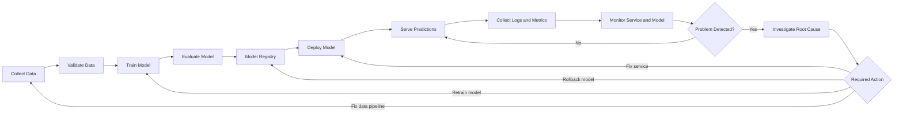
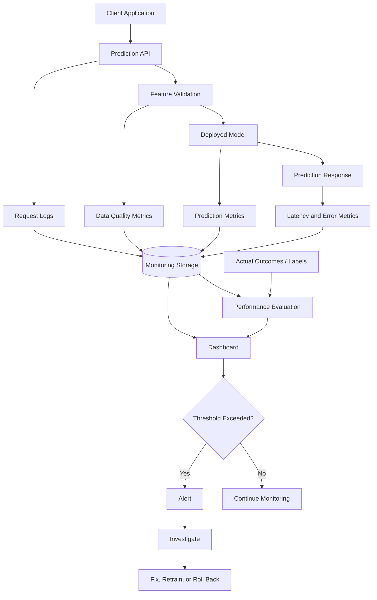
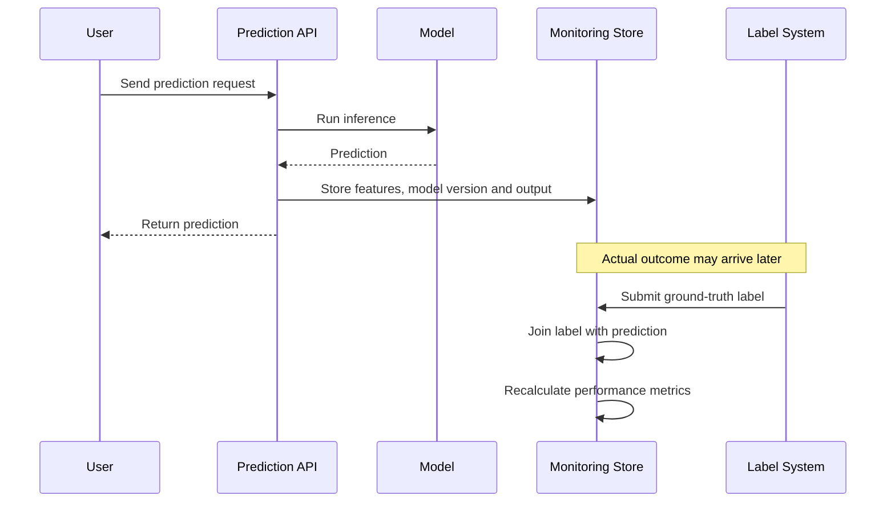
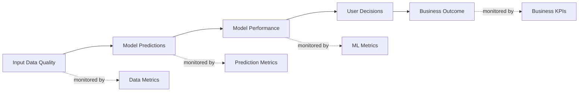
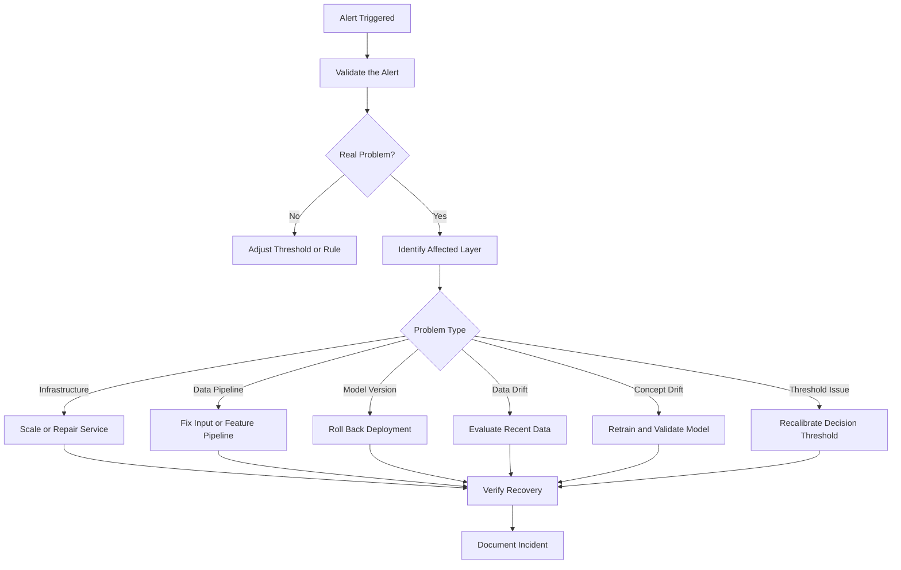
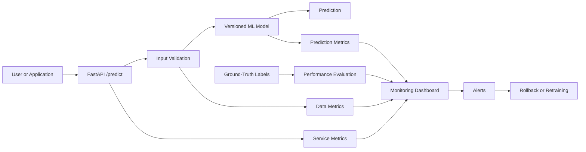

# 018 — Model Monitoring

| Item                   | Details                           |
| ---------------------- | --------------------------------- |
| **Course**             | 04 — MLOps and Deployment         |
| **Module**             | Module 08 — MLOps                 |
| **Content Group**      | Monitoring and Versioning         |
| **Roadmap Source**     | MLOps / Monitoring and Versioning |
| **Lesson Type**        | MLOps                             |
| **Lesson Order**       | 018                               |
| **Suggested Duration** | 22 minutes                        |

---

## 1. Lesson Overview

Training and deploying a machine learning model is not the end of the machine learning lifecycle.

After deployment, the model begins receiving real-world data. That data may differ from the training data, user behavior may change, upstream systems may introduce errors, and the relationship between features and outcomes may evolve.

**Model monitoring** is the process of continuously observing a deployed model to determine whether it remains:

* Available
* Reliable
* Accurate
* Fast enough
* Fair
* Consistent with expected data patterns

Model monitoring helps teams detect problems before they significantly affect users or business decisions.

A complete monitoring system does more than collect application logs. It tracks the health of the service, incoming data, predictions, model performance, and changes in the production environment.

---

## 2. Learning Objectives

After completing this lesson, you should be able to:

* Explain model monitoring in your own words.
* Describe why deployed models may degrade over time.
* Distinguish between service, data, prediction, and performance monitoring.
* Identify useful metrics for a production machine learning system.
* Recognize data drift and concept drift.
* Design a basic monitoring workflow for an ML API.
* Define alerts, thresholds, and responses to monitoring incidents.
* Document a monitoring strategy in an MLOps portfolio project.

---

## 3. What Is Model Monitoring?

**Model monitoring** is the continuous collection and analysis of information about a deployed model, its inputs, its outputs, and its operational environment.

Its main purpose is to answer questions such as:

* Is the prediction service available?
* Are requests being processed successfully?
* Is prediction latency acceptable?
* Has the input data distribution changed?
* Are predictions becoming unusually concentrated?
* Is model accuracy decreasing?
* Are some user groups receiving systematically different results?
* Should the model be retrained, rolled back, or replaced?

A simple model lifecycle can be represented as:

```text
Training
   ↓
Validation
   ↓
Deployment
   ↓
Monitoring
   ↓
Investigation
   ↓
Retraining or rollback
```

Monitoring closes the feedback loop between production and model development.

---

## 4. Position in the MLOps Workflow

Model monitoring begins after deployment, but its design should start before deployment.



Without monitoring, a team may continue serving incorrect predictions without knowing that the system has degraded.

---

## 5. Why Models Fail in Production

A model can perform well during offline evaluation and still fail after deployment.

Common reasons include:

### 5.1 Real-world data differs from training data

The training dataset may not represent current users, devices, locations, products, or economic conditions.

### 5.2 Upstream data pipelines change

A column may be renamed, units may change, missing values may increase, or a feature may stop being generated.

### 5.3 User behavior changes

Customers may adopt new habits, fraud patterns may evolve, or users may respond to the model itself.

### 5.4 The environment changes

Software dependencies, hardware, feature services, or external APIs may behave differently.

### 5.5 Labels arrive late

For many applications, the correct outcome becomes available only after several hours, days, or months.

Examples:

* Loan repayment may be known months later.
* Fraud confirmation may require investigation.
* Customer churn may be measured after a subscription period.
* Delivery-time accuracy may be evaluated after delivery.

### 5.6 Feedback loops appear

Predictions can influence future data.

For example, a recommendation model changes what users see. Their future behavior is therefore partly caused by previous model predictions.

---

## 6. Main Monitoring Layers

A production ML system should usually be monitored at several layers.

| Monitoring layer              | Main question                                    | Example metrics                                       |
| ----------------------------- | ------------------------------------------------ | ----------------------------------------------------- |
| **Infrastructure monitoring** | Is the underlying environment healthy?           | CPU, memory, disk, GPU utilization                    |
| **Service monitoring**        | Is the prediction API operating correctly?       | Availability, latency, error rate                     |
| **Data-quality monitoring**   | Are input values valid?                          | Missing values, invalid ranges, schema errors         |
| **Data-drift monitoring**     | Has the input distribution changed?              | PSI, KS statistic, category frequency changes         |
| **Prediction monitoring**     | Are model outputs behaving normally?             | Prediction distribution, confidence, positive rate    |
| **Performance monitoring**    | Is the model still accurate?                     | Accuracy, F1, RMSE, precision, recall                 |
| **Fairness monitoring**       | Are outcomes consistent across important groups? | Group recall, false-positive rate, demographic parity |
| **Business monitoring**       | Does the model still create value?               | Conversion, fraud loss, retention, revenue impact     |

Monitoring only API uptime is not enough. A service can return HTTP `200` responses while producing poor predictions.

---

## 7. Monitoring Architecture

A basic model-monitoring architecture may look like this:



Important components include:

* Prediction service
* Structured logs
* Metrics collector
* Monitoring database or time-series store
* Dashboard
* Alerting system
* Model registry
* Retraining or rollback workflow

---

## 8. Service Monitoring

Service monitoring checks whether the model endpoint is technically available and responsive.

Typical service-level metrics include:

| Metric            | Description                                 |
| ----------------- | ------------------------------------------- |
| **Request count** | Number of prediction requests               |
| **Request rate**  | Requests per second or minute               |
| **Error rate**    | Percentage of failed requests               |
| **Latency**       | Time required to return a prediction        |
| **Availability**  | Percentage of time the service is reachable |
| **Timeout rate**  | Requests that exceed the allowed duration   |
| **CPU usage**     | Processing-resource consumption             |
| **Memory usage**  | Memory consumed by the service              |
| **Queue length**  | Number of requests waiting for processing   |

### Latency percentiles

Average latency may hide slow requests. Production dashboards commonly track percentiles:

* **p50:** Half of requests are faster than this value.
* **p95:** 95% of requests are faster than this value.
* **p99:** 99% of requests are faster than this value.

Example:

```text
p50 latency: 45 ms
p95 latency: 120 ms
p99 latency: 420 ms
```

A high p99 value may indicate occasional but serious delays.

---

## 9. Data-Quality Monitoring

Data-quality monitoring verifies that production inputs satisfy the assumptions used during training.

Useful checks include:

* Required columns are present.
* Feature types are correct.
* Values fall within expected ranges.
* Categorical values belong to known categories.
* Missing-value rates remain acceptable.
* Timestamps are valid.
* Identifiers are not duplicated unexpectedly.
* Feature freshness is acceptable.

Example validation rules:

```yaml
age:
  type: integer
  minimum: 18
  maximum: 100
  missing_allowed: false

monthly_income:
  type: float
  minimum: 0
  maximum: 1000000
  missing_rate_threshold: 0.02

country:
  type: category
  allowed_values:
    - VN
    - TH
    - SG
    - MY
```

A model may still return a prediction for invalid data, so input validation should happen before inference.

---

## 10. Data Drift

**Data drift** occurs when the statistical distribution of production input data changes relative to a reference dataset.

The reference is often:

* The training dataset
* The validation dataset
* A previous production period
* A known stable production window

Suppose a credit-risk model was trained with the following age distribution:

```text
Training:
18–30 years: 20%
31–50 years: 55%
51+ years:   25%
```

The production distribution later becomes:

```text
Production:
18–30 years: 55%
31–50 years: 35%
51+ years:   10%
```

The model may still run, but it is now processing a substantially different population.

### Causes of data drift

* New customer segments
* Seasonal behavior
* Marketing campaigns
* Economic changes
* Sensor degradation
* Data-pipeline modifications
* Changes in product design
* New geographic markets

### Important limitation

Data drift does not automatically mean model performance has decreased.

It is a warning that the model is operating under conditions different from its original training environment.

---

## 11. Concept Drift

**Concept drift** occurs when the relationship between input features and the target outcome changes.

In mathematical terms, the relationship

[
P(y \mid x)
]

changes over time.

Where:

* (x) represents input features.
* (y) represents the target outcome.

For example, older transaction patterns may no longer identify fraud because attackers have adopted new strategies.

```text
Previously:
Unusually large transfer → high fraud probability

Later:
Fraudsters use many small transfers → old relationship becomes weaker
```

### Data drift versus concept drift

| Characteristic   | Data drift                 | Concept drift                                |
| ---------------- | -------------------------- | -------------------------------------------- |
| What changes?    | Input distribution (P(x))  | Relationship (P(y \mid x))                   |
| Requires labels? | Not always                 | Usually yes                                  |
| Example          | Users become younger       | Younger users behave differently than before |
| Main risk        | Model sees unfamiliar data | Learned decision patterns become incorrect   |

A production system can experience either type of drift or both simultaneously.

---

## 12. Prediction Monitoring

Prediction monitoring observes the outputs produced by the model even when true labels are not yet available.

Useful prediction metrics include:

* Predicted-class distribution
* Mean predicted probability
* Confidence distribution
* Positive prediction rate
* Rejection rate
* Outlier prediction rate
* Frequency of fallback behavior
* Frequency of unknown categories
* Prediction stability over time

Example:

```text
Reference positive prediction rate: 18%
Current positive prediction rate:   52%
```

A sudden increase may indicate:

* Input drift
* Broken feature processing
* Incorrect model version
* Threshold configuration error
* Genuine change in user behavior

Prediction monitoring helps detect anomalies before ground-truth labels arrive.

---

## 13. Model-Performance Monitoring

When ground-truth labels become available, the team can directly evaluate model quality.

### Classification metrics

Common classification metrics include:

* Accuracy
* Precision
* Recall
* F1 score
* ROC-AUC
* Log loss
* False-positive rate
* False-negative rate
* Calibration error

For example:

[
\text{Precision} =
\frac{TP}{TP + FP}
]

[
\text{Recall} =
\frac{TP}{TP + FN}
]

[
F_1 =
2 \times
\frac{\text{Precision} \times \text{Recall}}
{\text{Precision} + \text{Recall}}
]

### Regression metrics

Common regression metrics include:

* Mean Absolute Error
* Mean Squared Error
* Root Mean Squared Error
* Mean Absolute Percentage Error
* (R^2)

[
MAE =
\frac{1}{n}
\sum_{i=1}^{n}
|y_i-\hat{y}_i|
]

[
RMSE =
\sqrt{
\frac{1}{n}
\sum_{i=1}^{n}
(y_i-\hat{y}_i)^2
}
]

### Ranking and recommendation metrics

Examples include:

* Precision@K
* Recall@K
* Mean Reciprocal Rank
* Normalized Discounted Cumulative Gain
* Click-through rate
* Conversion rate

The selected metrics should reflect the actual business cost of model errors.

---

## 14. Delayed Ground Truth

In many systems, actual outcomes are unavailable at prediction time.

A monitoring system must later join predictions with outcomes.

Example prediction log:

```json
{
  "prediction_id": "pred-92814",
  "timestamp": "2026-07-13T09:00:00Z",
  "model_version": "credit-risk-v3",
  "prediction": 1,
  "probability": 0.82
}
```

Outcome recorded later:

```json
{
  "prediction_id": "pred-92814",
  "actual_outcome": 0,
  "label_timestamp": "2026-08-13T09:00:00Z"
}
```

The common `prediction_id` allows the monitoring pipeline to calculate model-performance metrics later.



---

## 15. Drift Detection Methods

Different feature types require different monitoring methods.

### 15.1 Numerical features

Common approaches include:

* Mean and standard-deviation comparison
* Quantile comparison
* Kolmogorov–Smirnov test
* Population Stability Index
* Wasserstein distance

### 15.2 Categorical features

Common approaches include:

* Category-frequency comparison
* New-category detection
* Chi-square test
* Jensen–Shannon divergence

### 15.3 Embeddings and unstructured data

For text, images, or embeddings, monitoring may include:

* Embedding-distribution distance
* Topic-distribution changes
* Text-length distribution
* Language distribution
* Image brightness or resolution
* Out-of-distribution scores

No single drift metric works perfectly for every problem.

A good monitoring strategy combines statistical tests, practical thresholds, domain knowledge, and model-performance evidence.

---

## 16. Population Stability Index

The **Population Stability Index**, or PSI, is commonly used to compare two distributions.

[
PSI =
\sum_{i=1}^{k}
(A_i-E_i)
\ln\left(\frac{A_i}{E_i}\right)
]

Where:

* (E_i) is the expected proportion in bucket (i).
* (A_i) is the actual production proportion in bucket (i).
* (k) is the number of buckets.

A simplified interpretation may be:

|  PSI value | Possible interpretation                 |
| ---------: | --------------------------------------- |
| Below 0.10 | Small change                            |
|  0.10–0.25 | Moderate change requiring investigation |
| Above 0.25 | Significant distribution change         |

These values are practical conventions, not universal laws. Thresholds should be validated for the specific system.

---

## 17. Fairness and Segment Monitoring

Aggregate performance may hide problems affecting particular groups.

Consider a model with overall recall of 90%.

| Segment            | Recall |
| ------------------ | -----: |
| Existing customers |    95% |
| New customers      |    68% |
| Overall            |    90% |

The overall metric looks acceptable, but the model performs poorly for new customers.

Useful segments may include:

* Region
* Device type
* Product category
* Customer type
* Language
* Data source
* Time period
* Model-confidence range

Sensitive attributes require careful legal, ethical, privacy, and organizational review.

Monitoring should avoid collecting unnecessary personal data.

---

## 18. Business Metrics

Technical model metrics do not always describe real business impact.

For example, a recommendation model may maintain the same offline accuracy while customer conversion decreases.

Business-level metrics may include:

* Conversion rate
* Revenue per recommendation
* Customer-retention rate
* Fraud loss prevented
* Manual-review workload
* Delivery delay
* Customer complaints
* Loan default rate
* Cost per correct prediction



A complete monitoring strategy connects technical metrics to business outcomes.

---

## 19. Logging Strategy

Prediction logs should contain enough information to investigate problems without exposing unnecessary sensitive data.

A useful structured log may include:

```json
{
  "timestamp": "2026-07-13T10:15:22Z",
  "request_id": "req-a72c91",
  "prediction_id": "pred-b41f90",
  "model_name": "customer-churn",
  "model_version": "2.3.1",
  "feature_schema_version": "1.4",
  "prediction": 1,
  "prediction_probability": 0.87,
  "latency_ms": 42,
  "status": "success"
}
```

Potentially useful metadata:

* Request ID
* Prediction ID
* Timestamp
* Model name
* Model version
* Feature-pipeline version
* Dataset or schema version
* Prediction
* Confidence score
* Response latency
* Validation result
* Error category
* Deployment environment

Avoid directly logging:

* Passwords
* Authentication tokens
* Credit-card numbers
* Full personal documents
* Unnecessary personal identifiers
* Raw sensitive text

Use hashing, aggregation, masking, access controls, and retention policies where appropriate.

---

## 20. Basic FastAPI Monitoring Example

The following simplified service records request count, latency, model version, and prediction information.

```python
from __future__ import annotations

import logging
import time
import uuid

from fastapi import FastAPI, HTTPException
from pydantic import BaseModel, Field


logging.basicConfig(level=logging.INFO)
logger = logging.getLogger("prediction-service")

app = FastAPI(title="Churn Prediction API")

MODEL_VERSION = "churn-model-v1.2.0"


class PredictionRequest(BaseModel):
    tenure_months: int = Field(ge=0, le=600)
    monthly_spend: float = Field(ge=0)
    support_tickets: int = Field(ge=0)


class PredictionResponse(BaseModel):
    prediction_id: str
    model_version: str
    churn_probability: float
    churn_prediction: int


def predict_churn(data: PredictionRequest) -> float:
    """A placeholder for a real trained model."""

    score = (
        0.45
        - 0.002 * data.tenure_months
        + 0.001 * data.monthly_spend
        + 0.05 * data.support_tickets
    )

    return max(0.0, min(1.0, score))


@app.post("/predict", response_model=PredictionResponse)
def predict(request: PredictionRequest) -> PredictionResponse:
    start_time = time.perf_counter()
    prediction_id = str(uuid.uuid4())

    try:
        probability = predict_churn(request)
        prediction = int(probability >= 0.5)

        latency_ms = (time.perf_counter() - start_time) * 1000

        logger.info(
            "prediction_success",
            extra={
                "prediction_id": prediction_id,
                "model_version": MODEL_VERSION,
                "prediction": prediction,
                "probability": round(probability, 4),
                "latency_ms": round(latency_ms, 2),
            },
        )

        return PredictionResponse(
            prediction_id=prediction_id,
            model_version=MODEL_VERSION,
            churn_probability=probability,
            churn_prediction=prediction,
        )

    except Exception as exc:
        latency_ms = (time.perf_counter() - start_time) * 1000

        logger.exception(
            "prediction_failure",
            extra={
                "prediction_id": prediction_id,
                "model_version": MODEL_VERSION,
                "latency_ms": round(latency_ms, 2),
            },
        )

        raise HTTPException(
            status_code=500,
            detail="Prediction failed.",
        ) from exc
```

In a real system, these logs or metrics would be sent to a centralized monitoring platform.

---

## 21. Simple Drift Check with Python

The following example compares a feature from the training reference data with recent production data.

```python
from __future__ import annotations

import numpy as np
from scipy.stats import ks_2samp


def detect_numerical_drift(
    reference_values: np.ndarray,
    current_values: np.ndarray,
    significance_level: float = 0.05,
) -> dict[str, float | bool]:
    """
    Compare two numerical distributions with the
    Kolmogorov-Smirnov two-sample test.
    """

    if reference_values.size == 0 or current_values.size == 0:
        raise ValueError("Both datasets must contain values.")

    statistic, p_value = ks_2samp(
        reference_values,
        current_values,
    )

    return {
        "ks_statistic": float(statistic),
        "p_value": float(p_value),
        "drift_detected": bool(p_value < significance_level),
    }


reference_age = np.array(
    [22, 25, 28, 31, 35, 37, 42, 45, 51, 58]
)

current_age = np.array(
    [18, 19, 20, 21, 22, 23, 24, 26, 27, 28]
)

result = detect_numerical_drift(
    reference_values=reference_age,
    current_values=current_age,
)

print(result)
```

Example output:

```text
{
  'ks_statistic': 0.7,
  'p_value': 0.012,
  'drift_detected': True
}
```

A statistical result should not automatically trigger retraining. It should initiate further investigation.

---

## 22. Monitoring Windows

Metrics should be calculated over appropriate time windows.

Examples:

```text
Last 5 minutes:
- API errors
- Latency
- Service availability

Last 24 hours:
- Missing values
- Prediction distribution
- Feature drift

Last 7 or 30 days:
- Model accuracy
- Business outcomes
- Segment performance
```

Using only a very short window may produce noisy alerts.

Using only a very long window may hide sudden incidents.

Many systems compare multiple windows:

```text
Current hour vs previous hour
Current day vs previous seven-day average
Current week vs training reference
```

---

## 23. Alert Design

An alert should communicate:

* What changed
* Which model is affected
* When the problem began
* How severe the problem is
* Which metric crossed the threshold
* Where supporting logs or dashboards can be found
* What action should be considered

Example alert:

```text
Alert: High Prediction Latency

Model: churn-model-v1.2.0
Environment: production
Metric: p95 latency
Current value: 410 ms
Threshold: 250 ms
Duration: 15 minutes
Suggested checks:
- CPU and memory utilization
- Recent deployment changes
- Feature-store response time
```

### Avoid alert fatigue

Too many low-quality alerts cause teams to ignore important incidents.

Good alerts should be:

* Actionable
* Prioritized
* Deduplicated
* Based on sustained conditions
* Assigned to an owner
* Connected to an incident-response procedure

---

## 24. Example Monitoring Rules

```yaml
service:
  error_rate:
    warning: 0.02
    critical: 0.05

  p95_latency_ms:
    warning: 200
    critical: 500

data_quality:
  missing_rate:
    monthly_income:
      warning: 0.02
      critical: 0.05

  unknown_category_rate:
    country:
      warning: 0.01
      critical: 0.03

predictions:
  positive_rate:
    expected_minimum: 0.10
    expected_maximum: 0.30

performance:
  recall:
    warning_below: 0.80
    critical_below: 0.70
```

These values should be treated as project-specific examples rather than universal thresholds.

---

## 25. Response to Monitoring Incidents

Monitoring is useful only when it leads to an appropriate response.



Possible actions include:

* Restarting or scaling the service
* Repairing an upstream data pipeline
* Rolling back to a previous model
* Changing the decision threshold
* Retraining with recent data
* Adding new validation rules
* Updating monitoring thresholds
* Temporarily routing predictions to a fallback system

---

## 26. Retraining Is Not Always the Correct Response

A drift alert should not automatically retrain the model.

The root cause may be:

* A broken data pipeline
* A unit-conversion error
* A changed category encoding
* A temporary marketing campaign
* A small or noisy sample
* A deployment configuration error
* A genuinely new population

Before retraining:

1. Validate the monitoring result.
2. Inspect recent deployments.
3. Check feature-pipeline health.
4. Confirm sufficient sample size.
5. Evaluate model performance with labels.
6. Review business impact.
7. Compare retraining with rollback or threshold adjustment.

Automatic retraining without safeguards can deploy a worse model.

---

## 27. Monitoring and Model Versioning

Every prediction should be traceable to the model and data pipeline that produced it.

Useful versions include:

```text
Model version:            churn-model-v1.2.0
Training dataset version: churn-data-2026-06
Feature schema version:   schema-v4
Preprocessing version:    preprocessing-v2.1
API version:              api-v1
Docker image:             churn-api:1.2.0
Git commit:               a91f40c
```

This information helps answer:

* Which model caused the incident?
* When was it deployed?
* Which data was used to train it?
* Which feature transformation was active?
* Can the previous system be restored?

Monitoring, versioning, deployment, and rollback should be designed together.

---

## 28. Monitoring Dashboard Example

A useful dashboard may contain the following sections.

### Service health

```text
Requests per minute
Error rate
p50 / p95 / p99 latency
CPU and memory usage
```

### Input health

```text
Missing-value rates
Schema-validation failures
Feature distributions
Unknown-category rates
```

### Prediction health

```text
Prediction-class distribution
Confidence distribution
Positive prediction rate
Fallback rate
```

### Model quality

```text
Accuracy
Precision
Recall
F1 score
Calibration
Performance by segment
```

### Business impact

```text
Conversion
Revenue
Fraud loss
Manual-review workload
Customer complaints
```

The dashboard should make trends and sudden changes easy to identify.

---

## 29. Practical Mini Project

### Project: Monitor a Deployed Churn Prediction API

Build a small service containing:

```text
project/
├── app/
│   ├── main.py
│   ├── model.py
│   ├── schemas.py
│   └── monitoring.py
├── model/
│   └── churn_model.joblib
├── tests/
│   ├── test_api.py
│   └── test_monitoring.py
├── data/
│   └── reference_statistics.json
├── Dockerfile
├── requirements.txt
└── README.md
```

### Required components

1. A FastAPI endpoint:

```text
POST /predict
```

2. Request validation.

3. Structured prediction logs.

4. Model-version information in each response.

5. Monitoring metrics for:

```text
Request count
Error count
Latency
Missing values
Prediction distribution
```

6. A script that compares recent inputs with a reference dataset.

7. A README explaining:

* How to run the API
* How to build the Docker image
* How to send a sample request
* Which metrics are monitored
* Which thresholds generate alerts
* How to roll back the model

---

## 30. Example API Request

```bash
curl -X POST "http://localhost:8000/predict" \
  -H "Content-Type: application/json" \
  -d '{
    "tenure_months": 8,
    "monthly_spend": 120.5,
    "support_tickets": 4
  }'
```

Example response:

```json
{
  "prediction_id": "8ec9dce1-2e71-44cb-8a24-a0ea3242c8fa",
  "model_version": "churn-model-v1.2.0",
  "churn_probability": 0.7525,
  "churn_prediction": 1
}
```

---

## 31. Practical Exercise

### Task 1 — Define monitoring layers

For your deployed model, identify at least one metric for each category:

| Category            | Your metric |
| ------------------- | ----------- |
| Service health      |             |
| Data quality        |             |
| Data drift          |             |
| Prediction behavior |             |
| Model performance   |             |
| Business impact     |             |

### Task 2 — Define thresholds

Choose warning and critical thresholds for three metrics.

Example:

```text
Metric: API error rate
Warning: greater than 2% for 10 minutes
Critical: greater than 5% for 5 minutes
```

### Task 3 — Add structured logging

Record:

```text
prediction_id
timestamp
model_version
prediction
confidence
latency
status
```

### Task 4 — Simulate drift

Create two datasets:

* Reference data resembling the training distribution
* Production data with a shifted distribution

Compare their statistics and visualize the result.

### Task 5 — Write an incident response

Describe what the team should do when:

```text
The positive prediction rate increases from 15% to 60%
within one hour.
```

Consider multiple possible causes rather than immediately retraining the model.

---

## 32. Common Mistakes

### 32.1 Monitoring only infrastructure

CPU and memory may be normal while model predictions are incorrect.

### 32.2 Monitoring only aggregate metrics

Overall accuracy can hide poor performance for important segments.

### 32.3 Logging predictions without model versions

Without version information, incidents are difficult to reproduce.

### 32.4 Collecting too much sensitive data

Monitoring systems must follow privacy, security, and retention requirements.

### 32.5 Treating every drift alert as model failure

Drift is an investigation signal, not proof that the model is inaccurate.

### 32.6 Retraining automatically without validation

A broken input pipeline may contaminate the retraining dataset.

### 32.7 Using static thresholds forever

Thresholds may need adjustment as traffic, seasonality, and business conditions change.

### 32.8 Ignoring delayed labels

Prediction distributions cannot replace direct performance evaluation indefinitely.

### 32.9 Creating dashboards without alerts

A dashboard is ineffective when nobody watches it during an incident.

### 32.10 Creating alerts without response procedures

Every important alert should have an owner and an expected response.

---

## 33. Production Checklist

### Service monitoring

* [ ] Request volume is recorded.
* [ ] Error rate is tracked.
* [ ] p50, p95, and p99 latency are tracked.
* [ ] Availability and timeout rates are monitored.
* [ ] CPU and memory usage are visible.

### Data monitoring

* [ ] Input schema is validated.
* [ ] Missing-value rates are tracked.
* [ ] Feature ranges are checked.
* [ ] Unknown categories are detected.
* [ ] Reference distributions are stored.
* [ ] Drift metrics are calculated.

### Prediction monitoring

* [ ] Prediction distribution is tracked.
* [ ] Confidence scores are monitored.
* [ ] Model version is recorded.
* [ ] Prediction IDs are generated.
* [ ] Unusual prediction patterns generate alerts.

### Performance monitoring

* [ ] Predictions can be joined with actual outcomes.
* [ ] Appropriate evaluation metrics are calculated.
* [ ] Performance is analyzed by useful segments.
* [ ] Business metrics are connected to model metrics.

### Operations

* [ ] Dashboards are available.
* [ ] Alert thresholds are documented.
* [ ] Alert ownership is defined.
* [ ] A rollback procedure exists.
* [ ] A retraining procedure exists.
* [ ] Sensitive information is protected.
* [ ] Monitoring data has a retention policy.

---

## 34. Completion Checklist

* [ ] I can explain **Model Monitoring** in one or two minutes.
* [ ] I understand the difference between data drift and concept drift.
* [ ] I can identify service, data, prediction, performance, and business metrics.
* [ ] I understand why production labels may be delayed.
* [ ] I can design a basic monitoring pipeline for an ML API.
* [ ] I can define an alert threshold and incident response.
* [ ] I can connect monitoring events to rollback or retraining.
* [ ] I have created a notebook, chart, API, dashboard, or monitoring note for this lesson.
* [ ] I have documented at least one assumption, limitation, or unanswered question.

---

## 35. Related Outcome

After completing this lesson, you should be better prepared to:

> Deploy, version, monitor, and operate machine learning models using APIs, Docker, CI/CD, structured logging, performance evaluation, and drift-aware workflows.

---

## 36. Related Portfolio Project

### Mini Project: Deploy and Monitor an ML Model API

Create a portfolio-ready project containing:

* A trained classification or regression model
* A FastAPI `/predict` endpoint
* Input-schema validation
* A versioned model artifact
* A Dockerfile
* Automated tests
* Structured prediction logs
* Latency and error metrics
* Data-drift analysis
* A simple monitoring dashboard
* Alert definitions
* A rollback and retraining plan
* A clear README with sample requests

Suggested architecture:



---

## 37. Summary

**Model monitoring** is the continuous observation of a deployed machine learning system.

It helps teams determine whether:

* The service is available and responsive.
* Production inputs remain valid.
* Data distributions have changed.
* Prediction patterns remain reasonable.
* Model performance remains acceptable.
* Important user segments receive reliable results.
* The model continues to support business goals.

A strong monitoring solution combines:

```text
Service metrics
+ Data-quality checks
+ Drift detection
+ Prediction analysis
+ Ground-truth evaluation
+ Business metrics
+ Alerts
+ Incident response
+ Model versioning
```

The key lesson is:

> A machine learning model is not production-ready merely because it can return predictions. It is production-ready when the team can observe, diagnose, version, recover, and improve it safely.
