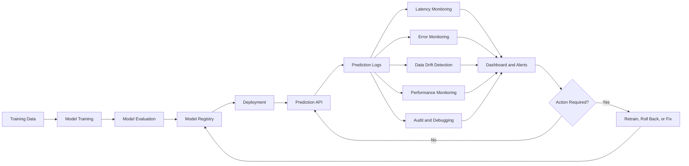
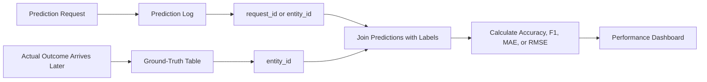
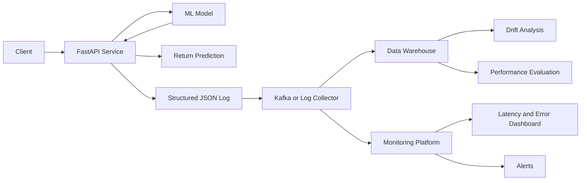

# 019 - Prediction Log

**Course:** 04 - MLOps and Deployment
**Module:** Module 08 - MLOps
**Content Group:** Monitoring and Versioning
**Roadmap Source:** MLOps / Monitoring and Versioning
**Lesson Type:** MLOps
**Order in Module:** 019
**Suggested Duration:** 22 minutes

---

## 1. Overview

A **prediction log** is a structured record created whenever a machine learning model produces a prediction.

It helps an AI or Data Science team answer questions such as:

* Which model version produced this prediction?
* What input data was used?
* What was the predicted output?
* How confident was the model?
* How long did inference take?
* Did the request fail?
* Has the input distribution changed?
* Is the model becoming less accurate over time?

Prediction logs connect model serving with monitoring, debugging, auditing, drift detection, and performance evaluation.

A production ML workflow may look like this:

```text
Client request
      ↓
Prediction API
      ↓
Input validation
      ↓
Model inference
      ↓
Prediction log
      ↓
Monitoring database or log platform
      ↓
Drift, latency, error, and performance dashboards
```

Without prediction logs, a deployed model behaves like a black box. The team knows that predictions are being generated, but it cannot easily understand what happened, reproduce problems, or evaluate model quality.

---

## 2. Learning Objectives

After completing this lesson, you should be able to:

1. Explain prediction logging in your own words.
2. Describe where prediction logs belong in an MLOps workflow.
3. Identify the important fields of a prediction log.
4. Distinguish prediction logs from application logs and training logs.
5. Add structured prediction logging to a small API.
6. Use prediction logs to monitor latency, errors, drift, and model quality.
7. Recognize privacy and security risks when logging model inputs.
8. Design a small monitoring artifact for your portfolio.

---

## 3. What Is a Prediction Log?

A prediction log records information about an inference event.

An inference event occurs when a trained model receives an input and returns a prediction.

For example, consider a customer churn model.

### Input

```json
{
  "customer_id": "C1024",
  "monthly_spend": 82.5,
  "contract_type": "monthly",
  "support_tickets": 4
}
```

### Prediction

```json
{
  "prediction": "high_churn_risk",
  "probability": 0.87
}
```

### Prediction Log

```json
{
  "timestamp": "2026-07-13T00:30:12Z",
  "request_id": "req_91f20c",
  "model_name": "customer-churn-classifier",
  "model_version": "2.3.0",
  "input_features": {
    "monthly_spend": 82.5,
    "contract_type": "monthly",
    "support_tickets": 4
  },
  "prediction": "high_churn_risk",
  "confidence": 0.87,
  "latency_ms": 24.6,
  "status": "success"
}
```

This record gives the team enough information to understand what the model did and which model version was responsible.

---

## 4. Prediction Logs in the MLOps Workflow

Prediction logging is part of the model monitoring and observability layer.



Prediction logs form the bridge between deployment and monitoring.

They can support:

* Operational monitoring
* Model performance monitoring
* Data drift detection
* Concept drift investigation
* Incident debugging
* Model version comparison
* Compliance auditing
* Retraining decisions
* A/B testing
* Shadow deployment evaluation

---

## 5. Prediction Logs vs. Other Logs

Prediction logs are related to other log types, but they serve a specific purpose.

| Log Type        | Main Purpose                   | Example Information                                   |
| --------------- | ------------------------------ | ----------------------------------------------------- |
| Application log | Monitor software behavior      | Server started, database connection failed            |
| Access log      | Record HTTP requests           | Endpoint, status code, IP address, response time      |
| Error log       | Record failures and exceptions | Stack trace, validation error                         |
| Training log    | Record model training          | Epoch, loss, accuracy, learning rate                  |
| Experiment log  | Compare experiments            | Parameters, metrics, dataset version                  |
| Prediction log  | Record inference events        | Input features, prediction, confidence, model version |
| Audit log       | Track sensitive actions        | User action, permission change, model approval        |

A single API request may generate multiple log records.

For example:

```text
Access log:
POST /predict returned HTTP 200 in 31 ms

Application log:
Model loaded successfully

Prediction log:
Model v2.3 predicted high_churn_risk with confidence 0.87
```

---

## 6. Important Fields in a Prediction Log

A useful prediction log normally contains several groups of information.

### 6.1 Request Metadata

```json
{
  "timestamp": "2026-07-13T00:30:12Z",
  "request_id": "req_91f20c",
  "endpoint": "/predict"
}
```

These fields help trace a prediction across multiple services.

### 6.2 Model Metadata

```json
{
  "model_name": "customer-churn-classifier",
  "model_version": "2.3.0",
  "deployment_environment": "production"
}
```

Model metadata makes predictions reproducible and supports rollback analysis.

### 6.3 Input Information

```json
{
  "input_features": {
    "monthly_spend": 82.5,
    "contract_type": "monthly",
    "support_tickets": 4
  }
}
```

Input fields can later be used for drift detection.

However, raw inputs should not always be stored. Sensitive fields may need to be removed, masked, hashed, or aggregated.

### 6.4 Prediction Output

```json
{
  "predicted_class": "high_churn_risk",
  "confidence": 0.87
}
```

For regression models, the output may be a numeric value:

```json
{
  "predicted_price": 245000.0
}
```

### 6.5 Performance Information

```json
{
  "latency_ms": 24.6,
  "status": "success"
}
```

These fields help monitor service health.

### 6.6 Ground-Truth Information

The true outcome may become available later.

```json
{
  "actual_outcome": "customer_churned",
  "label_received_at": "2026-08-13T10:00:00Z"
}
```

When ground truth is available, the team can calculate real production metrics such as:

* Accuracy
* Precision
* Recall
* F1-score
* Mean absolute error
* Root mean squared error
* Calibration error

---

## 7. Recommended Prediction Log Schema

A practical schema may look like this:

```json
{
  "timestamp": "2026-07-13T00:30:12Z",
  "request_id": "req_91f20c",
  "model": {
    "name": "customer-churn-classifier",
    "version": "2.3.0"
  },
  "request": {
    "endpoint": "/predict",
    "input_schema_version": "1.1",
    "features": {
      "monthly_spend": 82.5,
      "contract_type": "monthly",
      "support_tickets": 4
    }
  },
  "response": {
    "predicted_class": "high_churn_risk",
    "confidence": 0.87
  },
  "performance": {
    "latency_ms": 24.6
  },
  "status": "success",
  "error": null
}
```

For failed predictions:

```json
{
  "timestamp": "2026-07-13T00:31:40Z",
  "request_id": "req_91f21d",
  "model": {
    "name": "customer-churn-classifier",
    "version": "2.3.0"
  },
  "status": "failed",
  "error": {
    "type": "InputValidationError",
    "message": "monthly_spend must be greater than or equal to zero"
  }
}
```

---

## 8. Structured Logging

Prediction logs should usually be written in a structured format such as JSON.

### Unstructured Log

```text
The churn model predicted high risk for customer C1024.
```

This is readable by humans, but difficult to query reliably.

### Structured Log

```json
{
  "model": "churn-model",
  "version": "2.3.0",
  "prediction": "high_risk",
  "confidence": 0.87
}
```

Structured logs can be searched, filtered, aggregated, and visualized more easily.

For example, a monitoring system can calculate:

```text
Average inference latency by model version
Error rate by endpoint
Prediction distribution by hour
Confidence distribution by customer segment
```

---

## 9. FastAPI Prediction Logging Example

The following example demonstrates a small prediction API with JSON-style logging.

```python
import json
import logging
import time
import uuid
from datetime import datetime, timezone

import joblib
from fastapi import FastAPI, HTTPException
from pydantic import BaseModel, Field

app = FastAPI(title="Churn Prediction API")

logging.basicConfig(
    level=logging.INFO,
    format="%(message)s",
)

logger = logging.getLogger("prediction_logger")

MODEL_NAME = "customer-churn-classifier"
MODEL_VERSION = "1.0.0"

model = joblib.load("model.joblib")


class PredictionRequest(BaseModel):
    monthly_spend: float = Field(ge=0)
    contract_months: int = Field(ge=0)
    support_tickets: int = Field(ge=0)


class PredictionResponse(BaseModel):
    prediction: int
    probability: float
    model_version: str


@app.post("/predict", response_model=PredictionResponse)
def predict(data: PredictionRequest) -> PredictionResponse:
    request_id = str(uuid.uuid4())
    start_time = time.perf_counter()

    features = [
        [
            data.monthly_spend,
            data.contract_months,
            data.support_tickets,
        ]
    ]

    try:
        prediction = int(model.predict(features)[0])
        probability = float(model.predict_proba(features)[0][1])

        latency_ms = (time.perf_counter() - start_time) * 1000

        prediction_log = {
            "timestamp": datetime.now(timezone.utc).isoformat(),
            "request_id": request_id,
            "model_name": MODEL_NAME,
            "model_version": MODEL_VERSION,
            "input_features": {
                "monthly_spend": data.monthly_spend,
                "contract_months": data.contract_months,
                "support_tickets": data.support_tickets,
            },
            "prediction": prediction,
            "probability": probability,
            "latency_ms": round(latency_ms, 2),
            "status": "success",
        }

        logger.info(json.dumps(prediction_log))

        return PredictionResponse(
            prediction=prediction,
            probability=probability,
            model_version=MODEL_VERSION,
        )

    except Exception as error:
        latency_ms = (time.perf_counter() - start_time) * 1000

        error_log = {
            "timestamp": datetime.now(timezone.utc).isoformat(),
            "request_id": request_id,
            "model_name": MODEL_NAME,
            "model_version": MODEL_VERSION,
            "latency_ms": round(latency_ms, 2),
            "status": "failed",
            "error_type": type(error).__name__,
            "error_message": str(error),
        }

        logger.exception(json.dumps(error_log))

        raise HTTPException(
            status_code=500,
            detail="Prediction failed",
        ) from error
```

A successful request may produce this log:

```json
{
  "timestamp": "2026-07-13T00:30:12.493821+00:00",
  "request_id": "62f8cb3e-6653-48fc-9691-27d258e6ca8a",
  "model_name": "customer-churn-classifier",
  "model_version": "1.0.0",
  "input_features": {
    "monthly_spend": 82.5,
    "contract_months": 3,
    "support_tickets": 4
  },
  "prediction": 1,
  "probability": 0.87,
  "latency_ms": 18.42,
  "status": "success"
}
```

---

## 10. Sample API Request

Start the API:

```bash
uvicorn main:app --reload
```

Send a prediction request:

```bash
curl -X POST "http://localhost:8000/predict" \
  -H "Content-Type: application/json" \
  -d '{
    "monthly_spend": 82.5,
    "contract_months": 3,
    "support_tickets": 4
  }'
```

Example response:

```json
{
  "prediction": 1,
  "probability": 0.87,
  "model_version": "1.0.0"
}
```

---

## 11. Using Prediction Logs for Monitoring

### 11.1 Prediction Distribution

Suppose a binary classifier normally produces:

```text
Class 0: 70%
Class 1: 30%
```

Later, the logs show:

```text
Class 0: 20%
Class 1: 80%
```

This change may indicate:

* Input data drift
* A data pipeline error
* A change in user behavior
* A real-world event
* A model deployment problem

The change does not automatically mean the model is wrong, but it should be investigated.

### 11.2 Confidence Monitoring

Track the model's confidence over time.

```text
Average confidence last month: 0.89
Average confidence this month: 0.63
```

A decrease may indicate that production inputs are becoming different from the training data.

### 11.3 Latency Monitoring

Prediction logs can be used to calculate:

```text
p50 latency
p95 latency
p99 latency
Maximum latency
Timeout rate
```

Example:

| Metric      |  Value |
| ----------- | -----: |
| p50 latency |  25 ms |
| p95 latency |  90 ms |
| p99 latency | 210 ms |
| Error rate  |   0.7% |

### 11.4 Error Monitoring

Track errors by category:

```text
InputValidationError
ModelLoadError
PredictionTimeout
MissingFeatureError
DatabaseWriteError
```

A sudden increase in one error type may reveal a deployment or data contract problem.

### 11.5 Production Accuracy

When actual outcomes arrive later, join them with prediction logs using an identifier.



For example:

```text
Prediction date: July 13
Prediction: Customer will churn
Actual outcome date: August 13
Actual result: Customer churned
```

This prediction becomes a true positive.

---

## 12. Data Drift Detection

Prediction logs often contain input features or feature summaries.

A team can compare:

```text
Training feature distribution
              vs.
Production feature distribution
```

Example:

| Feature         | Training Mean | Production Mean |
| --------------- | ------------: | --------------: |
| Monthly spend   |          51.2 |            79.8 |
| Support tickets |           1.4 |             3.9 |
| Contract months |          15.6 |             5.2 |

Possible drift metrics include:

* Population Stability Index
* Kolmogorov-Smirnov statistic
* Jensen-Shannon divergence
* Wasserstein distance
* Category frequency difference

Prediction logs provide the production data required for these comparisons.

---

## 13. Privacy and Security

Prediction logs may contain sensitive information.

Examples include:

* Names
* Email addresses
* Phone numbers
* Medical information
* Financial data
* Authentication tokens
* Exact locations
* User messages
* Images or documents
* Internal business identifiers

Avoid logging sensitive values unless they are necessary and legally permitted.

### Unsafe Log

```json
{
  "name": "Alice Nguyen",
  "email": "alice@example.com",
  "credit_card": "4111111111111111",
  "prediction": "high_risk"
}
```

### Safer Log

```json
{
  "customer_hash": "fa83c19d",
  "monthly_spend_bucket": "50_to_100",
  "prediction": "high_risk"
}
```

Recommended practices:

1. Remove unnecessary personal information.
2. Mask or hash identifiers.
3. Avoid storing authentication credentials.
4. Apply retention policies.
5. Encrypt logs in transit and at rest.
6. Restrict access using roles and permissions.
7. Document which fields are logged.
8. Sample logs when full logging is too expensive.
9. Separate operational logs from sensitive audit records.
10. Validate compliance requirements before deployment.

---

## 14. Logging Strategies

### Full Logging

Store every prediction event.

Advantages:

* Complete debugging history
* Better auditability
* Accurate aggregate statistics

Disadvantages:

* High storage cost
* Greater privacy risk
* Higher write load

### Sampled Logging

Store only a percentage of predictions.

```python
import random

if random.random() < 0.10:
    log_prediction()
```

This example stores approximately 10% of prediction events.

### Aggregated Logging

Store summary statistics rather than individual records.

```json
{
  "time_window": "2026-07-13T00:00:00Z",
  "request_count": 1520,
  "average_latency_ms": 27.4,
  "positive_prediction_rate": 0.36,
  "error_rate": 0.004
}
```

### Selective Logging

Store detailed logs only for:

* Errors
* Low-confidence predictions
* High-risk decisions
* New model versions
* Unusual inputs
* Shadow deployments

---

## 15. Storage and Monitoring Architecture

Prediction logs may be written to:

* Standard output
* Log files
* PostgreSQL
* MongoDB
* Elasticsearch
* Cloud logging platforms
* Data warehouses
* Object storage
* Kafka topics
* Monitoring platforms

A scalable architecture may look like this:



For a small portfolio project, writing JSON logs to a file or SQLite database is sufficient.

For a large production system, logs are often sent asynchronously to avoid slowing down prediction responses.

---

## 16. Monitoring Metrics from Prediction Logs

Useful metrics include:

### Operational Metrics

* Request count
* Error rate
* Timeout rate
* Average latency
* p95 latency
* p99 latency
* CPU usage
* Memory usage

### Prediction Metrics

* Prediction distribution
* Average confidence
* Low-confidence rate
* Missing-feature rate
* Out-of-range feature rate
* Rejection rate

### Drift Metrics

* Feature distribution difference
* Prediction distribution difference
* Unknown category rate
* Missing-value rate
* Embedding drift

### Performance Metrics

When labels are available:

* Accuracy
* Precision
* Recall
* F1-score
* ROC-AUC
* Log loss
* Mean absolute error
* Root mean squared error
* Calibration error

---

## 17. Prediction Log Dashboard Example

A basic dashboard could contain:

```text
┌───────────────────────────────────────────┐
│ Model: customer-churn-classifier v2.3.0  │
├───────────────────────────────────────────┤
│ Requests today:              12,450       │
│ Error rate:                   0.42%       │
│ Average latency:              31 ms       │
│ p95 latency:                  88 ms       │
│ Positive prediction rate:     34%         │
│ Average confidence:           0.81        │
│ Drift status:                 Warning     │
└───────────────────────────────────────────┘
```

Recommended charts:

1. Request count over time
2. Prediction distribution over time
3. Confidence distribution
4. Latency percentiles
5. Error count by type
6. Feature drift score
7. Production performance by model version

---

## 18. Common Mistakes

### 18.1 Logging Without Model Version

Bad:

```json
{
  "prediction": 1
}
```

Better:

```json
{
  "model_name": "churn-model",
  "model_version": "2.3.0",
  "prediction": 1
}
```

Without the model version, it is difficult to determine which deployment created the prediction.

### 18.2 Logging Only Errors

Error logs are important, but successful prediction logs are also needed for distribution and drift monitoring.

### 18.3 Logging Sensitive Raw Data

Do not store private data by default. Log only what is necessary.

### 18.4 Using Unstructured Text Only

Free-text logs are difficult to aggregate and analyze. Prefer JSON or another structured format.

### 18.5 Blocking the Prediction Response

Sending logs to a slow external system inside the request path may increase latency.

For larger systems, use:

* Background workers
* Message queues
* Buffered log collectors
* Asynchronous logging

### 18.6 No Request Identifier

A unique request ID makes it possible to trace one prediction across services.

### 18.7 No Retention Policy

Logs should not be stored forever without a clear reason.

Define:

```text
What is stored?
Why is it stored?
Who can access it?
How long is it stored?
When is it deleted?
```

### 18.8 No Connection to Ground Truth

Logging predictions alone cannot measure actual model accuracy. A process is required to collect labels and connect them to past predictions.

---

## 19. Practical Exercise

Extend a small FastAPI machine learning service with prediction logging.

### Task 1: Package the Model

Create:

```text
project/
├── app/
│   └── main.py
├── model/
│   └── model.joblib
├── tests/
│   └── test_predict.py
├── Dockerfile
├── requirements.txt
└── README.md
```

### Task 2: Add a `/predict` Endpoint

The endpoint should:

1. Validate the request.
2. Run model inference.
3. Return the prediction.
4. Record a structured prediction log.

### Task 3: Include Required Log Fields

Each successful log should contain:

```text
timestamp
request_id
model_name
model_version
input summary
prediction
confidence
latency_ms
status
```

Each failed log should contain:

```text
timestamp
request_id
model_name
model_version
error type
error message
latency_ms
status
```

### Task 4: Create a Monitoring Notebook

Use prediction logs to create at least three charts:

1. Prediction distribution
2. Latency over time
3. Confidence distribution

Optional additional charts:

* Error count by type
* Feature distribution
* Predictions by model version

### Task 5: Document Production Considerations

Add a section to the README answering:

* Which fields are logged?
* Which sensitive fields are excluded?
* Where are logs stored?
* How long are logs retained?
* How would ground truth be collected?
* Which conditions should trigger an alert?

---

## 20. Portfolio Artifact

A strong portfolio project should include:

```text
trained model
    +
FastAPI prediction endpoint
    +
Dockerfile
    +
structured prediction logs
    +
monitoring notebook or dashboard
    +
README with architecture and run instructions
```

Suggested project title:

> Production-Ready ML Prediction API with Logging and Monitoring

Suggested README sections:

```markdown
# Project Overview

## Architecture

## Dataset

## Model Training

## API Endpoints

## Prediction Log Schema

## Monitoring Metrics

## Privacy Considerations

## Docker Setup

## Example Requests

## Limitations

## Future Improvements
```

---

## 21. Completion Checklist

* [ ] I can explain prediction logging in one or two minutes.
* [ ] I understand the difference between prediction logs and application logs.
* [ ] I can identify the main fields in a prediction log.
* [ ] I include the model name and model version in every prediction record.
* [ ] I include a request ID for traceability.
* [ ] I measure prediction latency.
* [ ] I record successful and failed inference events.
* [ ] I use structured logging rather than free-text logs only.
* [ ] I understand how prediction logs support drift detection.
* [ ] I know that ground truth is required to measure production accuracy.
* [ ] I avoid storing unnecessary sensitive information.
* [ ] I have created an API, notebook, chart, dashboard, or deployment artifact.
* [ ] I have documented at least one assumption, limitation, or open question.

---

## 22. Related Outcome

Deploy, version, monitor, and operate machine learning models using APIs, Docker, CI/CD, structured logging, and drift-aware workflows.

---

## 23. Related Mini Project

Build and deploy a machine learning model API with:

* FastAPI endpoint `/predict`
* Saved model artifact
* Model version information
* Structured JSON prediction logs
* Dockerfile
* README
* Sample API request
* Basic monitoring notebook or dashboard

---

## 24. Key Takeaways

A prediction log is a structured record of what happened when a deployed model processed an input.

A useful prediction log should answer:

```text
When was the prediction created?
Which request generated it?
Which model and version were used?
What input or input summary was processed?
What prediction was returned?
How confident was the model?
How long did inference take?
Did the prediction succeed or fail?
```

Prediction logs make it possible to monitor model behavior after deployment. They support debugging, drift detection, latency monitoring, error analysis, auditing, performance evaluation, retraining, and rollback.

A model should not be considered production-ready only because it can return predictions. It should also provide enough observability to understand, monitor, and improve those predictions over time.

---

# Bài luyện tập

## Mục tiêu


## Đề bài


## Yêu cầu hoàn thành

- [ ] 
- [ ] 
- [ ] 

## Kết quả / lời giải


## Ghi chú
