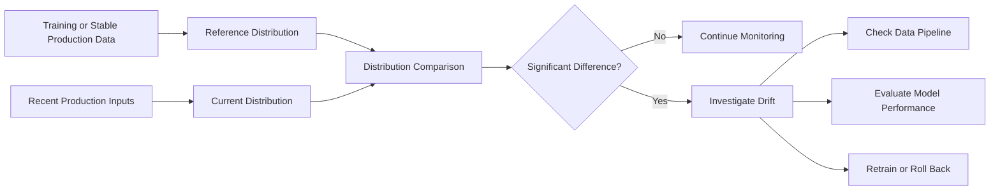
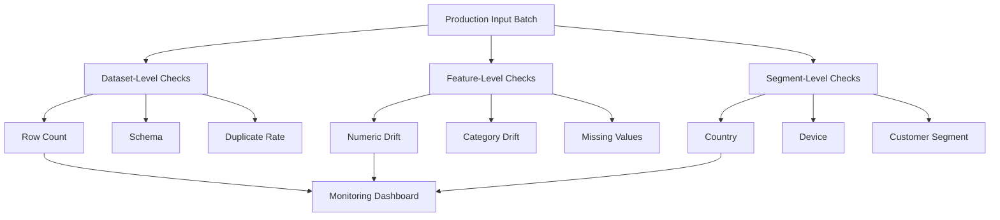
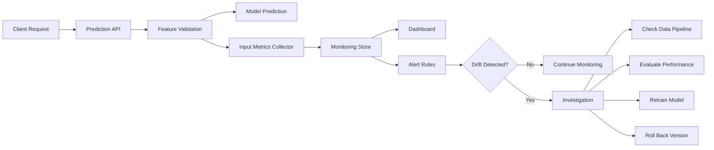
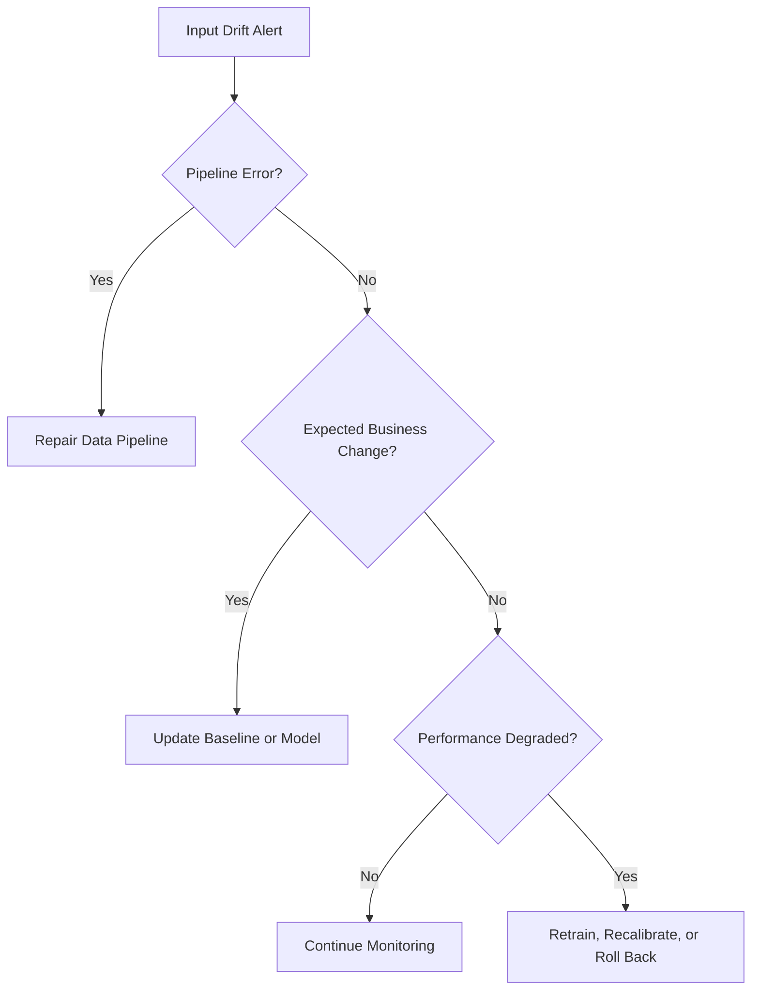
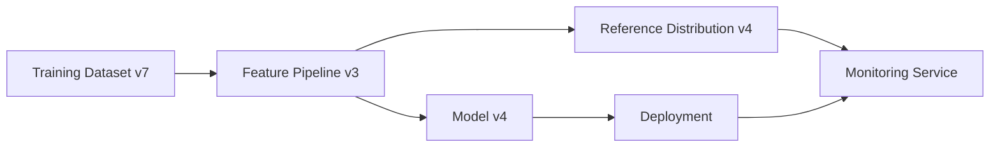
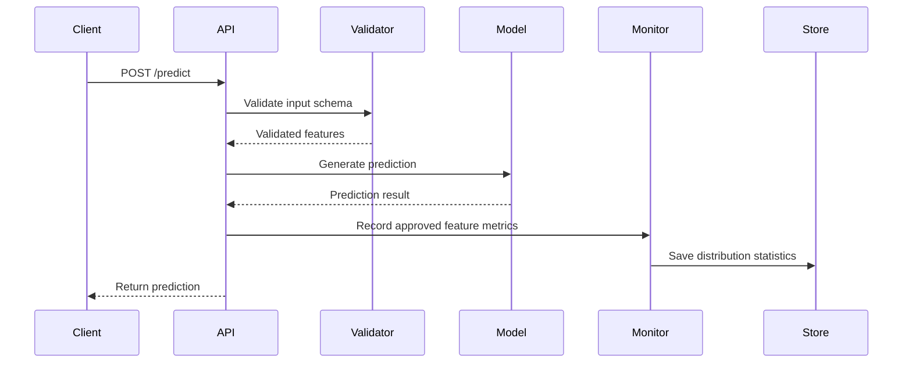

# 020 — Input Distribution

**Course:** 04 — MLOps and Deployment
**Module:** Module 08 — MLOps
**Content Group:** Monitoring and Versioning
**Roadmap Source:** MLOps / Monitoring and Versioning
**Lesson Type:** MLOps
**Lesson Order:** 020
**Suggested Duration:** 22 minutes

---

## 1. Lesson Overview

This lesson explains **input distribution** in the context of machine learning operations.

An input distribution describes how the feature values received by a model are distributed. During training, the model learns patterns from a particular training-data distribution. After deployment, production inputs may gradually or suddenly become different.

Monitoring input distributions helps an ML team answer questions such as:

* Are production inputs similar to the training data?
* Have numeric features shifted over time?
* Are category frequencies changing?
* Are new or previously unseen categories appearing?
* Are missing values becoming more common?
* Is the model receiving invalid or corrupted inputs?
* Should the model be investigated, retrained, or rolled back?

Input-distribution monitoring is one of the earliest ways to detect **data drift**, especially when production labels are unavailable.

---

## 2. Learning Objectives

After completing this lesson, you should be able to:

1. Explain input distribution in your own words.
2. Distinguish between training, reference, and production distributions.
3. Identify input distributions for numeric, categorical, text, image, and time-based features.
4. Compare a reference distribution with a current production distribution.
5. Recognize common indicators of input drift.
6. Calculate simple drift metrics such as PSI, KS statistic, and Jensen–Shannon divergence.
7. Design a basic input-distribution monitoring workflow.
8. Create a chart, notebook, dashboard, or alert related to production feature drift.

---

## 3. What Is an Input Distribution?

An **input distribution** describes the possible values of an input feature and how frequently those values occur.

For a numeric feature such as customer age, the distribution may describe:

* minimum and maximum values;
* mean and median;
* standard deviation;
* percentiles;
* histogram-bin frequencies;
* missing-value rate.

For a categorical feature such as device type, the distribution may describe the percentage of records belonging to each category.

```text
Feature: device_type

Training distribution:
mobile   = 65%
desktop  = 30%
tablet   = 5%

Production distribution:
mobile   = 82%
desktop  = 14%
tablet   = 4%
```

The production distribution is different from the training distribution. This does not automatically mean the model is failing, but it is a signal that should be investigated.

---

## 4. Reference Distribution and Current Distribution

Input monitoring normally compares two distributions.

### 4.1 Reference distribution

The **reference distribution** is the expected or trusted distribution used as a comparison baseline.

It may come from:

* the model training dataset;
* the validation dataset;
* a stable production period;
* the previous model version;
* a rolling historical window;
* a manually approved dataset.

### 4.2 Current distribution

The **current distribution** is calculated from recent production inputs.

Examples include:

* inputs from the last hour;
* inputs from the last day;
* inputs from the current week;
* the most recent 10,000 predictions;
* inputs from a particular country or platform.

### 4.3 Distribution comparison



---

## 5. Input Distribution in the ML Lifecycle

During training, a model learns a relationship between input features (X) and target values (Y):

[
P_{\text{train}}(X, Y)
]

After deployment, the model receives production data:

[
P_{\text{prod}}(X, Y)
]

Input drift occurs when the input-feature distribution changes:

[
P_{\text{prod}}(X) \neq P_{\text{train}}(X)
]

This difference is often called:

* feature drift;
* covariate shift;
* input drift;
* data drift.

The model still uses the patterns learned from the training distribution even when the production distribution changes.

```text
Training data
     |
     v
Learn patterns from P_train(X, Y)
     |
     v
Deploy model
     |
     v
Receive production inputs P_prod(X)
     |
     v
Compare P_prod(X) with P_reference(X)
```

---

## 6. Why Input Distribution Matters

Machine-learning models usually assume that future data will be reasonably similar to the data used during development.

When that assumption is violated, several problems may occur:

* prediction quality may decline;
* calibration may become unreliable;
* some customer groups may receive poorer predictions;
* invalid values may cause runtime errors;
* business rules may no longer match current behavior;
* the model may operate outside its supported domain.

Input monitoring provides an early-warning signal.

It is especially useful when ground-truth labels arrive slowly. For example, a fraud-detection system may receive transaction features immediately, while confirmed fraud labels arrive weeks later.

---

## 7. Types of Input Distributions

Different feature types require different monitoring approaches.

---

### 7.1 Numeric features

Examples:

* age;
* income;
* transaction amount;
* temperature;
* session duration;
* sensor measurement.

Useful statistics include:

* count;
* minimum;
* maximum;
* mean;
* median;
* standard deviation;
* percentiles;
* histogram frequencies;
* missing-value rate;
* outlier rate.

Example:

| Statistic                 | Training | Production |
| ------------------------- | -------: | ---------: |
| Mean transaction amount   |     82.4 |      121.7 |
| Median transaction amount |     43.2 |       57.8 |
| Standard deviation        |     95.1 |      184.5 |
| Missing rate              |     0.2% |       3.7% |
| 95th percentile           |    251.0 |      489.2 |

The increase in the mean, standard deviation, missing rate, and upper percentile suggests a meaningful change.

---

### 7.2 Categorical features

Examples:

* country;
* payment method;
* browser;
* product category;
* subscription plan;
* device type.

Monitor:

* category frequencies;
* missing-category rate;
* unseen categories;
* dominant-category changes;
* rare-category growth.

Example:

| Payment Method | Training | Production |
| -------------- | -------: | ---------: |
| Credit card    |      55% |        38% |
| Bank transfer  |      25% |        24% |
| Digital wallet |      18% |        33% |
| Other          |       2% |         3% |
| New category   |       0% |         2% |

The digital-wallet share has increased substantially, and a new category has appeared.

---

### 7.3 Boolean features

Examples:

* is_premium;
* has_coupon;
* is_returning_user;
* device_is_mobile.

Monitor the percentage of `True`, `False`, and missing values.

```text
Reference:
is_returning_user = True  -> 72%

Current:
is_returning_user = True  -> 41%
```

A major change may indicate a business shift, campaign effect, tracking bug, or upstream schema issue.

---

### 7.4 Date and time features

Examples:

* request hour;
* weekday;
* month;
* account age;
* time since last transaction.

Monitor:

* hourly distribution;
* weekday distribution;
* seasonal patterns;
* sudden timestamp gaps;
* future or impossible timestamps;
* timezone-related changes.

A system may appear to have drift simply because traffic differs between weekdays and weekends. Monitoring should therefore account for seasonality.

---

### 7.5 Text inputs

Examples:

* customer reviews;
* search queries;
* support messages;
* user prompts;
* document content.

Possible monitoring signals include:

* text length;
* token count;
* language distribution;
* empty-text rate;
* character-set distribution;
* embedding distribution;
* topic distribution;
* toxicity or sentiment distribution;
* out-of-vocabulary rate.

Example:

| Text Metric            | Reference | Current |
| ---------------------- | --------: | ------: |
| Average token count    |        42 |      89 |
| English-language rate  |       91% |     63% |
| Empty-input rate       |      0.3% |    4.8% |
| Average embedding norm |       7.4 |    10.2 |

---

### 7.6 Image inputs

Examples:

* medical images;
* product photos;
* satellite images;
* underwater images;
* security-camera frames.

Possible monitoring signals include:

* width and height;
* aspect ratio;
* brightness;
* contrast;
* sharpness;
* color-channel statistics;
* compression artifacts;
* image-embedding distribution;
* corrupted-image rate;
* object-count distribution.

Example:

```text
Reference images:
- Mean brightness: 128
- Mean width: 1024 px
- Blur rate: 4%

Current images:
- Mean brightness: 71
- Mean width: 640 px
- Blur rate: 26%
```

These changes may indicate a new camera, poor lighting, image resizing, or a broken preprocessing pipeline.

---

### 7.7 Vector and embedding features

Embedding-based systems may monitor:

* vector norms;
* mean embedding vectors;
* cosine-distance distributions;
* cluster frequencies;
* nearest-neighbor distances;
* principal components;
* outlier scores.

This is useful for:

* recommendation systems;
* semantic search;
* retrieval-augmented generation;
* anomaly detection;
* vision-language systems.

---

## 8. Dataset-Level and Feature-Level Monitoring

Input monitoring should be performed at more than one level.

### Dataset-level checks

These evaluate the entire incoming dataset or prediction batch.

Examples:

* number of records;
* schema correctness;
* duplicate rate;
* missing-row rate;
* batch arrival time;
* file size;
* corrupted-record count.

### Feature-level checks

These evaluate each feature independently.

Examples:

* mean and standard deviation;
* category percentages;
* missing-value rate;
* minimum and maximum;
* drift score;
* unseen-value count.

### Segment-level checks

These evaluate distributions for important subgroups.

Examples:

* country;
* device platform;
* customer plan;
* model version;
* traffic source;
* age group;
* API client.



---

## 9. Visual Methods for Comparing Distributions

Charts are often the fastest way to understand input drift.

### Numeric features

Useful charts include:

* overlapping histograms;
* density plots;
* box plots;
* percentile charts;
* cumulative distribution functions;
* time-series charts of summary statistics.

```text
Reference frequency
      ████
    ███████
  ██████████
██████████████
------------------> Feature value

Current frequency
          ████
        ████████
      ███████████
    ██████████████
------------------> Feature value
```

The current distribution is shifted to the right.

### Categorical features

Use:

* grouped bar charts;
* stacked bar charts;
* category-frequency tables;
* top-category trend charts.

### Monitoring over time

A single comparison may miss gradual drift. Track metrics continuously:

```text
Drift score
1.0 |                              *
0.8 |                         *    *
0.6 |                    *    *
0.4 |          *    *    *
0.2 | *   *    *
0.0 +--------------------------------
      Mon Tue Wed Thu Fri Sat Sun
```

---

## 10. Common Distribution-Comparison Metrics

No single drift metric works perfectly for every feature type. A practical monitoring system usually combines metrics, rules, and visual inspection.

---

### 10.1 Population Stability Index

The **Population Stability Index**, or PSI, compares the proportion of records in each bin.

[
PSI = \sum_{i=1}^{n}
\left(
p_i - q_i
\right)
\ln\left(
\frac{p_i}{q_i}
\right)
]

where:

* (p_i) is the current proportion in bin (i);
* (q_i) is the reference proportion in bin (i).

A commonly used interpretation is:

|               PSI | Possible Interpretation |
| ----------------: | ----------------------- |
|     Less than 0.1 | Little or no shift      |
|          0.1–0.25 | Moderate shift          |
| Greater than 0.25 | Significant shift       |

These thresholds are conventions, not universal laws. They should be calibrated for the business and feature.

---

### 10.2 Kolmogorov–Smirnov test

The **Kolmogorov–Smirnov test** compares the cumulative distributions of two numeric samples.

[
D = \sup_x
\left|
F_{\text{reference}}(x)
-----------------------

F_{\text{current}}(x)
\right|
]

where (F(x)) is the cumulative distribution function.

The test returns:

* a KS statistic;
* a p-value.

A small p-value suggests that the two samples may come from different distributions.

However, with very large sample sizes, even a small and operationally unimportant difference may become statistically significant.

---

### 10.3 Kullback–Leibler divergence

KL divergence measures how one probability distribution differs from another:

[
D_{KL}(P \parallel Q)
=====================

\sum_x P(x)
\log
\frac{P(x)}{Q(x)}
]

Important properties:

* (D_{KL}(P \parallel Q)) is not symmetric;
* it may become undefined when (Q(x)=0) while (P(x)>0);
* smoothing may be required.

---

### 10.4 Jensen–Shannon divergence

Jensen–Shannon divergence is a symmetric and smoother version of KL divergence.

[
M = \frac{1}{2}(P+Q)
]

[
D_{JS}(P,Q)
===========

\frac{1}{2}D_{KL}(P \parallel M)
+
\frac{1}{2}D_{KL}(Q \parallel M)
]

It is useful for comparing categorical or histogram-based distributions.

---

### 10.5 Wasserstein distance

Wasserstein distance describes the amount of movement required to transform one distribution into another.

For one-dimensional distributions, it captures both:

* how much probability mass changed;
* how far that probability mass moved.

It is especially useful for numeric features where the magnitude of the shift matters.

---

### 10.6 Chi-square test

A chi-square test can compare category frequencies between a reference sample and a current sample.

It is useful for:

* categorical variables;
* discrete values;
* frequency tables.

Very small expected counts should be handled carefully because they can make the result unreliable.

---

## 11. Simple Python Demo

The following example compares the training and production distributions of a numeric feature.

```python
import numpy as np
import pandas as pd
from scipy.stats import ks_2samp, wasserstein_distance

rng = np.random.default_rng(seed=42)

reference = rng.normal(
    loc=50,
    scale=10,
    size=5_000,
)

current = rng.normal(
    loc=57,
    scale=14,
    size=5_000,
)

ks_result = ks_2samp(reference, current)
wasserstein = wasserstein_distance(reference, current)

summary = pd.DataFrame(
    {
        "dataset": ["reference", "current"],
        "mean": [reference.mean(), current.mean()],
        "std": [reference.std(), current.std()],
        "median": [np.median(reference), np.median(current)],
        "p05": [
            np.percentile(reference, 5),
            np.percentile(current, 5),
        ],
        "p95": [
            np.percentile(reference, 95),
            np.percentile(current, 95),
        ],
    }
)

print(summary.round(3))
print(f"KS statistic: {ks_result.statistic:.4f}")
print(f"KS p-value: {ks_result.pvalue:.6f}")
print(f"Wasserstein distance: {wasserstein:.4f}")
```

Possible interpretation:

* the current mean is higher;
* the current standard deviation is larger;
* the KS statistic indicates a difference in shape;
* the Wasserstein distance measures the magnitude of the shift.

---

## 12. Calculating PSI

```python
import numpy as np


def calculate_psi(
    reference: np.ndarray,
    current: np.ndarray,
    bins: int = 10,
    epsilon: float = 1e-6,
) -> float:
    """Calculate Population Stability Index for numeric samples."""

    reference = np.asarray(reference, dtype=float)
    current = np.asarray(current, dtype=float)

    reference = reference[np.isfinite(reference)]
    current = current[np.isfinite(current)]

    if reference.size == 0 or current.size == 0:
        raise ValueError("Both samples must contain valid numeric values.")

    breakpoints = np.quantile(
        reference,
        np.linspace(0, 1, bins + 1),
    )

    # Avoid duplicate boundaries for low-cardinality features.
    breakpoints = np.unique(breakpoints)

    if breakpoints.size < 3:
        raise ValueError(
            "Not enough unique values to create PSI bins."
        )

    breakpoints[0] = -np.inf
    breakpoints[-1] = np.inf

    reference_counts, _ = np.histogram(
        reference,
        bins=breakpoints,
    )
    current_counts, _ = np.histogram(
        current,
        bins=breakpoints,
    )

    reference_ratio = reference_counts / reference_counts.sum()
    current_ratio = current_counts / current_counts.sum()

    reference_ratio = np.clip(
        reference_ratio,
        epsilon,
        None,
    )
    current_ratio = np.clip(
        current_ratio,
        epsilon,
        None,
    )

    psi_values = (
        current_ratio - reference_ratio
    ) * np.log(
        current_ratio / reference_ratio
    )

    return float(np.sum(psi_values))
```

Usage:

```python
psi_score = calculate_psi(reference, current)

print(f"PSI: {psi_score:.4f}")
```

The value should not be interpreted without context. Compare it with:

* historical drift scores;
* business thresholds;
* model-performance changes;
* known seasonal behavior.

---

## 13. Monitoring Categorical Inputs

```python
import pandas as pd

reference = pd.Series(
    [
        "mobile",
        "mobile",
        "desktop",
        "mobile",
        "tablet",
        "desktop",
    ]
)

current = pd.Series(
    [
        "mobile",
        "mobile",
        "mobile",
        "mobile",
        "smart_tv",
        "desktop",
    ]
)

reference_dist = reference.value_counts(
    normalize=True
)

current_dist = current.value_counts(
    normalize=True
)

comparison = (
    pd.concat(
        [reference_dist, current_dist],
        axis=1,
        keys=["reference", "current"],
    )
    .fillna(0)
    .sort_index()
)

comparison["absolute_change"] = (
    comparison["current"]
    - comparison["reference"]
).abs()

print(comparison)
```

Possible output:

```text
          reference  current  absolute_change
desktop       0.333    0.167            0.166
mobile        0.500    0.667            0.167
smart_tv      0.000    0.167            0.167
tablet        0.167    0.000            0.167
```

This comparison reveals:

* a new category called `smart_tv`;
* the disappearance of `tablet`;
* an increase in mobile traffic;
* a decrease in desktop traffic.

---

## 14. Input Distribution Monitoring Pipeline

A production monitoring pipeline may follow these steps:

1. Log model inputs or approved feature summaries.
2. Validate the schema.
3. Calculate distribution statistics.
4. Compare current values with reference values.
5. Store the monitoring metrics.
6. Display results in a dashboard.
7. Trigger alerts when thresholds are exceeded.
8. Investigate data pipelines and model behavior.
9. Retrain, repair, or roll back when necessary.



---

## 15. Monitoring Window Design

The comparison window has a major effect on drift detection.

### Fixed window

Compare a fixed time period with the original training data.

```text
Training baseline vs. production data from today
```

Advantages:

* easy to understand;
* stable reference;
* useful for detecting long-term drift.

Limitations:

* may generate repeated alerts;
* may not represent legitimate business evolution.

### Rolling window

Compare the latest period with the immediately preceding period.

```text
Last 24 hours vs. previous 24 hours
```

Advantages:

* detects recent changes;
* adapts to gradual trends.

Limitations:

* slow drift may become invisible;
* both windows may already be degraded.

### Seasonal window

Compare equivalent periods.

```text
Monday morning vs. previous Monday morning
July traffic vs. July traffic last year
```

This is useful when data has strong seasonal behavior.

### Multiple baselines

A mature system may compare production data with:

* training distribution;
* previous week;
* same period last month;
* previous model version;
* approved stable production period.

---

## 16. Example Monitoring Table

| Feature        | Type        | Metric               | Reference | Current | Status  |
| -------------- | ----------- | -------------------- | --------: | ------: | ------- |
| `age`          | Numeric     | PSI                  |         — |    0.08 | Healthy |
| `income`       | Numeric     | PSI                  |         — |    0.31 | Alert   |
| `device_type`  | Categorical | JS divergence        |         — |    0.17 | Warning |
| `country`      | Categorical | Unseen-category rate |        0% |    2.4% | Warning |
| `email_length` | Numeric     | Mean                 |        42 |      79 | Alert   |
| `credit_score` | Numeric     | Missing rate         |      0.3% |    7.1% | Alert   |
| `request_hour` | Time        | KS statistic         |         — |    0.06 | Healthy |

---

## 17. Example Alert Rules

A simple ruleset might include:

```yaml
monitoring:
  income:
    psi_warning: 0.10
    psi_critical: 0.25

  country:
    unseen_category_warning: 0.01
    unseen_category_critical: 0.05

  credit_score:
    missing_rate_warning: 0.02
    missing_rate_critical: 0.05

  request_size:
    max_value: 10000
```

Alerts should contain enough information for investigation:

```text
Alert: Significant input drift detected

Model: credit-risk-v3
Feature: annual_income
Metric: PSI
Reference window: 2026-06-01 to 2026-06-30
Current window: 2026-07-12
Observed PSI: 0.31
Warning threshold: 0.10
Critical threshold: 0.25
Affected predictions: 18,420
Suggested action: inspect upstream income normalization
```

---

## 18. Input Drift Does Not Always Mean Model Failure

A changed input distribution is a warning signal, not proof of degraded performance.

Possible causes include:

* a successful marketing campaign;
* a new customer segment;
* seasonal behavior;
* product expansion into a new country;
* a legitimate business-policy change;
* a new sensor or device;
* an upstream pipeline error;
* a preprocessing bug;
* missing or delayed data;
* intentional feature redesign.

The recommended investigation sequence is:



---

## 19. Relationship to Model Performance

Input drift becomes more concerning when it is associated with:

* lower accuracy;
* higher prediction error;
* worse calibration;
* lower precision or recall;
* increased business cost;
* larger differences between customer segments;
* more low-confidence predictions.

A complete monitoring system should connect:

```text
Input distribution
        +
Prediction distribution
        +
Ground-truth performance
        +
Operational health
        =
Reliable model monitoring
```

For example:

| Signal            | Observation                                    |
| ----------------- | ---------------------------------------------- |
| Input drift       | Customer income PSI increased to 0.31          |
| Prediction drift  | High-risk predictions increased from 8% to 21% |
| Performance drift | Precision decreased from 0.79 to 0.62          |
| Business impact   | Manual-review workload doubled                 |

Together, these signals provide stronger evidence than any single metric.

---

## 20. Data Quality Checks Before Drift Checks

Before calculating sophisticated drift metrics, verify basic data quality.

Important checks include:

* expected columns are present;
* data types are correct;
* values are within valid ranges;
* missing rates are acceptable;
* category values are known;
* timestamps are valid;
* units are consistent;
* feature transformations match training;
* no columns are swapped;
* preprocessing versions are compatible.

Example:

```python
def validate_transaction_amount(value: float) -> None:
    if value < 0:
        raise ValueError(
            "transaction_amount cannot be negative"
        )

    if value > 1_000_000:
        raise ValueError(
            "transaction_amount exceeds supported range"
        )
```

A unit-conversion bug may change an amount from dollars to cents, causing dramatic drift:

```text
Expected amount: 49.99
Received amount: 4999
```

A data-quality rule may detect this faster than a statistical test.

---

## 21. Privacy and Logging Considerations

Logging every raw model input may create privacy and security risks.

Sensitive data may include:

* personal identifiers;
* financial details;
* health information;
* private text;
* authentication tokens;
* user-uploaded documents;
* images containing faces or documents.

Safer approaches include logging:

* aggregated feature statistics;
* hashed identifiers;
* category frequencies;
* histogram counts;
* quantiles;
* embedding summaries;
* redacted samples;
* sampled records with strict access controls.

The monitoring design should follow:

* data-retention policies;
* consent requirements;
* access-control rules;
* encryption requirements;
* regional privacy regulations.

---

## 22. Input Distribution and Model Versioning

Every model version should be linked to its expected input distribution.

A model registry may store:

```text
Model version: churn-model-v4
Training dataset: customers-2026-05
Feature schema: feature-schema-v7
Preprocessing version: preprocessing-v3
Reference statistics: reference-profile-v4.json
Deployment image: churn-api:4.0.0
```

When a new model is deployed, its reference baseline should also be versioned.



Without versioned baselines, the monitoring service may compare production inputs against the wrong training distribution.

---

## 23. Practical Exercise

### Scenario

You deployed a customer-churn model through a FastAPI endpoint.

The model uses these features:

```text
age
monthly_spend
contract_type
support_tickets
country
days_since_last_login
```

### Task 1: Define reference statistics

For every feature, record:

* data type;
* valid range or categories;
* missing-value rate;
* summary statistics;
* histogram or frequency distribution.

Example:

| Feature                 | Monitoring Data                            |
| ----------------------- | ------------------------------------------ |
| `age`                   | Mean, standard deviation, percentiles, PSI |
| `monthly_spend`         | Histogram, PSI, missing rate               |
| `contract_type`         | Category frequencies, unseen categories    |
| `support_tickets`       | Mean, maximum, zero rate                   |
| `country`               | Category frequencies, unseen categories    |
| `days_since_last_login` | Percentiles, outlier rate, PSI             |

### Task 2: Simulate production drift

Create a production dataset in which:

* average monthly spending increases;
* a new contract type appears;
* the missing rate of `days_since_last_login` increases;
* traffic from one country becomes dominant.

### Task 3: Compare distributions

Calculate at least two of the following:

* PSI;
* KS statistic;
* Wasserstein distance;
* Jensen–Shannon divergence;
* missing-rate difference;
* unseen-category rate.

### Task 4: Create charts

Create:

* one histogram for a numeric feature;
* one category-frequency chart;
* one time-series chart for a drift metric.

### Task 5: Define alerts

Write alert rules for:

* significant numeric drift;
* unseen categories;
* missing-value growth;
* invalid values.

### Task 6: Document the response process

Explain what the team should do when an alert is triggered.

---

## 24. Mini Project Integration

### Project

Deploy an ML model API with:

* a FastAPI `/predict` endpoint;
* a Dockerfile;
* a README;
* structured prediction logging;
* input-distribution monitoring.

### Suggested project structure

```text
ml-monitoring-project/
├── app/
│   ├── main.py
│   ├── schemas.py
│   ├── predictor.py
│   └── monitoring.py
├── artifacts/
│   ├── model.joblib
│   └── reference_distribution.json
├── notebooks/
│   └── input_distribution_analysis.ipynb
├── tests/
│   ├── test_api.py
│   └── test_monitoring.py
├── Dockerfile
├── requirements.txt
└── README.md
```

### Example prediction flow



---

## 25. Common Mistakes

### Mistake 1: Monitoring only model accuracy

Accuracy may not be available immediately. Input drift can provide an earlier signal.

### Mistake 2: Using only averages

Two distributions can have the same mean but completely different shapes.

```text
Distribution A: values concentrated near 50
Distribution B: values concentrated near 20 and 80

Both may have mean = 50
```

Monitor percentiles, variance, histograms, or statistical distances as well.

### Mistake 3: Treating statistical significance as business significance

With millions of records, tiny differences may produce very small p-values.

Always evaluate:

* effect size;
* model sensitivity;
* business impact;
* historical behavior.

### Mistake 4: Ignoring seasonality

Weekend, holiday, and campaign traffic may differ from normal traffic.

Use appropriate comparison windows.

### Mistake 5: Using one threshold for every feature

Different features have different variability and importance.

Thresholds should be feature-specific when possible.

### Mistake 6: Ignoring feature segments

Overall distributions may appear stable while one country or customer group experiences severe drift.

### Mistake 7: Forgetting preprocessing

The raw input distribution may remain stable while transformed model features change because of a preprocessing defect.

### Mistake 8: Logging sensitive raw inputs

Prefer privacy-preserving statistics and carefully controlled samples.

### Mistake 9: Comparing against the wrong model baseline

Every deployed model version should use the corresponding reference distribution.

### Mistake 10: Creating alerts without an action plan

Every alert should have:

* an owner;
* severity;
* investigation steps;
* escalation rules;
* rollback or retraining criteria.

---

## 26. Production Checklist

### Reference data

* [ ] The reference dataset is clearly defined.
* [ ] Reference statistics are stored and versioned.
* [ ] The reference profile matches the deployed model version.
* [ ] Important segments have separate baselines where necessary.

### Data quality

* [ ] Required features are present.
* [ ] Data types are validated.
* [ ] Valid ranges are checked.
* [ ] Missing-value rates are monitored.
* [ ] New categories are detected.
* [ ] Unit and preprocessing consistency are checked.

### Drift monitoring

* [ ] Numeric distributions are monitored.
* [ ] Categorical distributions are monitored.
* [ ] Drift metrics are calculated regularly.
* [ ] Distribution charts are available.
* [ ] Seasonal patterns are considered.
* [ ] Segment-level drift is monitored.

### Operations

* [ ] Alert thresholds are documented.
* [ ] Alerts identify the affected feature and model.
* [ ] Monitoring metrics are stored over time.
* [ ] The team has an investigation playbook.
* [ ] Retraining and rollback procedures are available.
* [ ] Privacy and retention policies are followed.

---

## 27. Completion Checklist

* [ ] I can explain input distribution in one or two minutes.
* [ ] I can distinguish reference and current distributions.
* [ ] I can identify suitable statistics for numeric and categorical features.
* [ ] I can explain how input drift differs from model-performance drift.
* [ ] I can calculate at least one distribution-comparison metric.
* [ ] I can create a chart comparing training and production data.
* [ ] I understand why input drift is a warning rather than proof of failure.
* [ ] I can define an alert and investigation workflow.
* [ ] I have created a notebook, dashboard, API log, or monitoring artifact.
* [ ] I have documented at least one assumption, caveat, or unanswered question.

---

## 28. Key Takeaways

1. An input distribution describes the values and frequencies of features received by a model.
2. Production inputs should be compared with a trusted reference distribution.
3. Input drift occurs when the production feature distribution differs from the expected distribution.
4. Numeric, categorical, text, image, and embedding features require different monitoring methods.
5. Useful signals include summary statistics, missing rates, unseen categories, PSI, KS statistic, Jensen–Shannon divergence, and Wasserstein distance.
6. Drift does not always mean model failure; it may reflect valid business or seasonal changes.
7. Input monitoring should be combined with prediction, performance, operational, and business monitoring.
8. Reference distributions must be versioned with the model and preprocessing pipeline.
9. Effective alerts require clear thresholds, ownership, and response procedures.
10. Privacy should be considered when collecting and storing production-input information.

---

## 29. Related Outcome

Deploy, version, monitor, and operate machine-learning models using APIs, Docker, CI/CD pipelines, versioned artifacts, and drift-aware workflows.

---

## 30. Related Project

**Mini Project:** Deploy an ML Model API with:

* a FastAPI `/predict` endpoint;
* a versioned model artifact;
* a Dockerfile;
* a README with sample requests;
* prediction logging;
* reference-distribution statistics;
* input-drift metrics;
* a small monitoring dashboard or report.

---

## 31. Summary

**Input distribution** is a fundamental concept in production ML monitoring.

A model is trained using a specific data distribution, but real-world inputs can change because of customer behavior, seasonality, business expansion, data-pipeline defects, new devices, or changes in upstream systems.

By comparing recent production inputs with a versioned reference distribution, an ML team can detect unusual changes before they become serious model failures.

Turn this lesson into a practical portfolio artifact such as:

* an input-distribution analysis notebook;
* a drift-monitoring dashboard;
* a FastAPI service with monitored features;
* a versioned reference-statistics file;
* an alert configuration;
* or a documented production investigation playbook.
