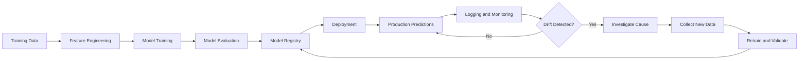
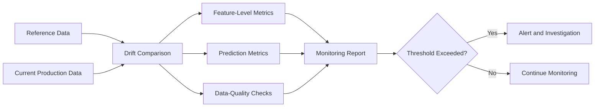
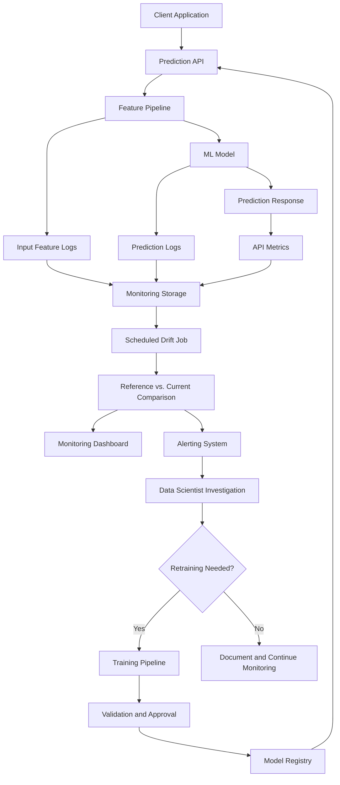
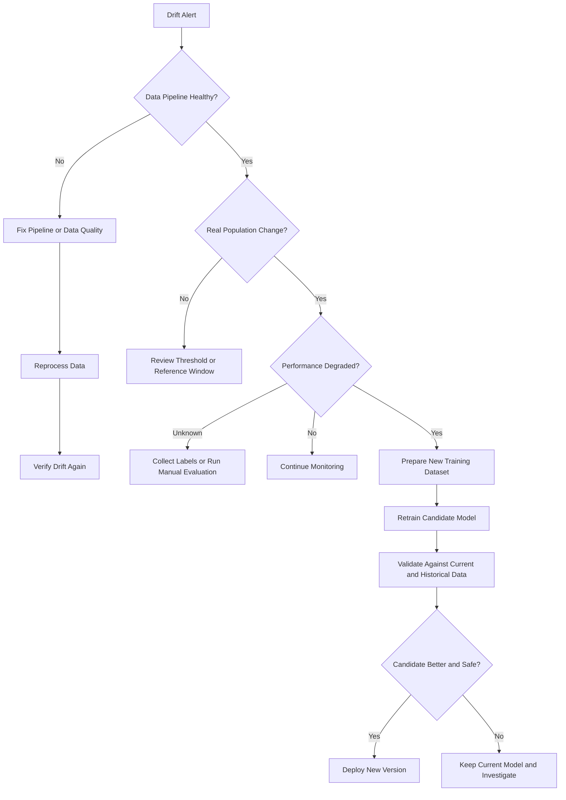

# 021 — Data Drift

| Item                   | Details                           |
| ---------------------- | --------------------------------- |
| **Course**             | 04 — MLOps and Deployment         |
| **Module**             | Module 08 — MLOps                 |
| **Topic Group**        | Monitoring and Versioning         |
| **Roadmap Source**     | MLOps / Monitoring and Versioning |
| **Lesson Type**        | MLOps                             |
| **Lesson Order**       | 021                               |
| **Suggested Duration** | 22 minutes                        |

---

## 1. Lesson Overview

**Data drift** occurs when the statistical distribution of production input data changes compared with the data used to train a machine learning model.

A deployed model may continue running without technical errors while its predictions gradually become less accurate. The source code, model file, API, and Docker image may remain unchanged, but the real-world environment around the model can change.

Examples include:

* Customer behavior changes after a marketing campaign.
* Product prices increase because of inflation.
* New devices produce different sensor values.
* Users from a new geographic region begin using the application.
* A data pipeline changes units, formats, or missing-value handling.
* Seasonal events change normal purchasing patterns.

Therefore, deploying a model is not the end of the machine learning lifecycle. Production models must be continuously monitored.

---

## 2. Learning Objectives

After completing this lesson, you should be able to:

* Explain data drift in your own words.
* Describe why drift can reduce model performance.
* Distinguish data drift from concept drift and prediction drift.
* Identify which production features should be monitored.
* Compare reference data with current production data.
* Use simple statistical metrics to detect drift.
* Design a basic drift-monitoring workflow.
* Create a small notebook, chart, dashboard, or monitoring report.

---

## 3. Why Data Drift Matters

A machine learning model learns patterns from historical data:

[
\hat{y} = f(X)
]

During training, the input features follow a particular distribution:

[
P_{\text{train}}(X)
]

After deployment, the production inputs may follow a different distribution:

[
P_{\text{production}}(X)
]

Data drift occurs when:

[
P_{\text{production}}(X) \neq P_{\text{train}}(X)
]

The model may then receive values or combinations of values that were rare or absent during training.

For example, suppose a credit-risk model was trained using customers with monthly incomes mostly between $1,000 and $5,000. If the product later expands to business customers whose incomes are much higher, the model will operate outside its original training distribution.

Even though the prediction API still returns valid responses, the predictions may no longer be reliable.

---

## 4. Position in the MLOps Workflow



Data drift monitoring connects production operations with model retraining.

Without monitoring, a team may not know that the model is receiving unfamiliar data until users report incorrect predictions or business performance declines.

---

## 5. Main Types of Drift

### 5.1 Data Drift

Data drift means that the distribution of input features changes.

[
P(X)*{\text{production}} \neq P(X)*{\text{reference}}
]

Example:

* Training average customer age: 35
* Production average customer age: 52

The relationship between the input and target may remain unchanged, but the population being scored is different.

---

### 5.2 Concept Drift

Concept drift means that the relationship between input features and the target changes.

[
P(Y \mid X)*{\text{production}}
\neq
P(Y \mid X)*{\text{training}}
]

Example:

Before an economic crisis, high income may strongly indicate a low probability of loan default. During a crisis, even high-income customers may face greater financial risk.

The same feature values can now correspond to different outcomes.

---

### 5.3 Prediction Drift

Prediction drift occurs when the distribution of model outputs changes.

[
P(\hat{Y})*{\text{production}}
\neq
P(\hat{Y})*{\text{reference}}
]

Example:

A fraud-detection model previously marked 2% of transactions as suspicious, but now marks 15%.

Prediction drift can be caused by:

* Real changes in the population
* Data-quality problems
* Data drift
* A pipeline bug
* Changes in user behavior

---

### 5.4 Label Drift

Label drift means that the distribution of the target variable changes.

[
P(Y)*{\text{production}} \neq P(Y)*{\text{training}}
]

Example:

The proportion of customers who cancel a subscription increases from 8% to 20%.

Label drift can only be measured when the true outcomes become available.

---

## 6. Drift Comparison

| Drift Type           | What Changes?                          | Example                                           |
| -------------------- | -------------------------------------- | ------------------------------------------------- |
| **Data drift**       | Input distribution (P(X))              | Customer age distribution changes                 |
| **Concept drift**    | Relationship (P(Y \mid X))             | Customer behavior changes after an economic event |
| **Prediction drift** | Model output distribution (P(\hat{Y})) | More transactions are classified as fraud         |
| **Label drift**      | Target distribution (P(Y))             | Churn rate increases over time                    |

---

## 7. Common Causes of Data Drift

### 7.1 Natural Changes

The real world changes over time.

Examples:

* Seasonal demand
* Inflation
* New market trends
* Economic events
* Changes in customer preferences
* New competitors

### 7.2 Population Changes

A product may begin serving a different group of users.

Examples:

* Launching in another country
* Expanding from students to professionals
* Supporting new device types
* Entering a new market segment

### 7.3 Data-Pipeline Changes

Drift may be caused by engineering changes rather than real-world behavior.

Examples:

* Changing currency from USD to cents
* Changing temperature from Celsius to Fahrenheit
* Renaming categories
* Modifying missing-value imputation
* Replacing a data provider
* Changing timestamp interpretation
* Updating feature-extraction logic

### 7.4 Upstream System Problems

Production data may be incomplete or corrupted.

Examples:

* A sensor stops reporting
* A database column becomes null
* An API changes its response schema
* A categorical value is encoded incorrectly
* A batch job processes duplicate records

---

## 8. What Should Be Monitored?

A drift-monitoring system should observe more than model accuracy.

### 8.1 Input Features

For numerical features, monitor:

* Mean
* Median
* Standard deviation
* Minimum and maximum
* Percentiles
* Missing-value rate
* Outlier rate
* Histogram distribution

For categorical features, monitor:

* Category frequency
* New categories
* Missing categories
* Most common category
* Rare-category rate

---

### 8.2 Model Predictions

Monitor:

* Prediction class distribution
* Average predicted probability
* Confidence-score distribution
* Positive prediction rate
* Rejection rate
* Uncertain prediction rate

---

### 8.3 Model Performance

When labels are available, monitor:

* Accuracy
* Precision
* Recall
* F1-score
* ROC-AUC
* Mean Absolute Error
* Root Mean Squared Error
* Calibration error

---

### 8.4 Business Metrics

Technical metrics alone may not reveal whether the model is still useful.

Monitor metrics such as:

* Conversion rate
* Fraud losses
* Loan default rate
* Customer churn
* Recommendation click-through rate
* Revenue per user
* Manual review rate
* Customer complaints

---

### 8.5 Operational Metrics

Monitor the service itself:

* Request count
* Error rate
* Response latency
* Timeout rate
* CPU and memory usage
* Prediction throughput
* Invalid request rate

---

## 9. Reference Data and Current Data

Drift detection requires two datasets.

### Reference Dataset

The reference dataset represents normal or expected behavior.

It may be:

* The model-training dataset
* The validation dataset
* A recent stable production window
* A curated production baseline

### Current Dataset

The current dataset contains recent production observations.

It may represent:

* The latest hour
* The latest day
* The latest week
* The latest 10,000 predictions



---

## 10. Drift Detection Methods

### 10.1 Difference in Summary Statistics

A basic method compares statistics between the reference and current datasets.

For example:

[
\Delta_{\text{mean}}
====================

\left|
\mu_{\text{current}}
--------------------

\mu_{\text{reference}}
\right|
]

This method is simple but may miss changes in the full distribution.

Two datasets can have the same mean but very different shapes.

---

### 10.2 Population Stability Index

The **Population Stability Index**, or PSI, compares the proportions of observations across distribution bins.

[
PSI =
\sum_{i=1}^{n}
(A_i - E_i)
\ln
\left(
\frac{A_i}{E_i}
\right)
]

Where:

* (E_i) is the proportion in reference bin (i)
* (A_i) is the proportion in current bin (i)
* (n) is the number of bins

A commonly used interpretation is:

|     PSI Value | Possible Interpretation         |
| ------------: | ------------------------------- |
|      (< 0.10) | Little or no significant change |
| (0.10 - 0.25) | Moderate change; investigate    |
|      (> 0.25) | Significant change              |

These thresholds are only guidelines. Appropriate thresholds depend on the feature, dataset size, business risk, and model sensitivity.

---

### 10.3 Kolmogorov–Smirnov Test

The **Kolmogorov–Smirnov test** compares two numerical distributions.

Its statistic measures the maximum distance between their cumulative distribution functions:

[
D =
\sup_x
\left|
F_{\text{reference}}(x)
-----------------------

F_{\text{current}}(x)
\right|
]

A small p-value suggests that the two samples may come from different distributions.

However, with very large datasets, even small and unimportant differences may become statistically significant. Statistical significance should therefore be combined with effect size and business impact.

---

### 10.4 Jensen–Shannon Divergence

The **Jensen–Shannon divergence** measures the difference between two probability distributions.

[
JSD(P \parallel Q)
==================

\frac{1}{2}D_{KL}(P \parallel M)
+
\frac{1}{2}D_{KL}(Q \parallel M)
]

Where:

[
M = \frac{1}{2}(P + Q)
]

Jensen–Shannon divergence is symmetric and bounded, making it useful for comparing normalized histograms or categorical distributions.

---

### 10.5 Chi-Square Test

A chi-square test can be used for categorical features.

It compares the observed category frequencies with the expected frequencies:

[
\chi^2 =
\sum_i
\frac{(O_i-E_i)^2}{E_i}
]

Where:

* (O_i) is the current observed frequency
* (E_i) is the expected reference frequency

---

### 10.6 Wasserstein Distance

The Wasserstein distance measures how much probability mass would need to be moved to transform one distribution into another.

For one-dimensional distributions:

[
W(P,Q)
======

\int_0^1
\left|
F_P^{-1}(u)
-----------

F_Q^{-1}(u)
\right|
du
]

It is often intuitive for numerical features because it uses the original feature scale.

---

## 11. Choosing a Drift Metric

| Feature Type           | Possible Methods                                              |
| ---------------------- | ------------------------------------------------------------- |
| Numerical              | PSI, KS test, Wasserstein distance, Jensen–Shannon divergence |
| Categorical            | PSI, chi-square test, Jensen–Shannon divergence               |
| Prediction probability | PSI, KS test, histogram comparison                            |
| Binary prediction      | Positive-rate difference, PSI, chi-square test                |
| Text                   | Embedding-distance comparison, vocabulary frequency           |
| Image                  | Embedding drift, brightness, resolution, class distribution   |

No single metric is best for every situation.

A production system may combine:

* A statistical test
* An effect-size metric
* A data-quality check
* A business-impact threshold

---

## 12. Simple Python Example

The following example compares a training feature with a simulated production feature.

```python
import numpy as np
import pandas as pd
import matplotlib.pyplot as plt
from scipy.stats import ks_2samp

rng = np.random.default_rng(seed=42)

reference_income = rng.normal(
    loc=3_000,
    scale=700,
    size=5_000,
)

current_income = rng.normal(
    loc=3_700,
    scale=900,
    size=5_000,
)

ks_statistic, p_value = ks_2samp(
    reference_income,
    current_income,
)

summary = pd.DataFrame(
    {
        "dataset": ["reference", "current"],
        "mean": [
            reference_income.mean(),
            current_income.mean(),
        ],
        "std": [
            reference_income.std(),
            current_income.std(),
        ],
        "median": [
            np.median(reference_income),
            np.median(current_income),
        ],
    }
)

print(summary)
print(f"KS statistic: {ks_statistic:.4f}")
print(f"p-value: {p_value:.6f}")

plt.hist(
    reference_income,
    bins=40,
    alpha=0.5,
    density=True,
    label="Reference",
)

plt.hist(
    current_income,
    bins=40,
    alpha=0.5,
    density=True,
    label="Current",
)

plt.xlabel("Monthly income")
plt.ylabel("Density")
plt.title("Reference vs. Current Income Distribution")
plt.legend()
plt.show()
```

### Expected Interpretation

The current production distribution has:

* A higher average
* A larger standard deviation
* A visibly shifted histogram
* A high KS statistic
* A low p-value

This is evidence that the income feature has drifted.

It does not automatically prove that the model has failed. The next step is to investigate whether this feature shift affects prediction quality or business outcomes.

---

## 13. Simple PSI Implementation

```python
import numpy as np


def calculate_psi(
    reference: np.ndarray,
    current: np.ndarray,
    bins: int = 10,
    epsilon: float = 1e-6,
) -> float:
    """Calculate Population Stability Index for a numerical feature."""

    breakpoints = np.quantile(
        reference,
        np.linspace(0, 1, bins + 1),
    )

    breakpoints[0] = -np.inf
    breakpoints[-1] = np.inf

    reference_counts, _ = np.histogram(
        reference,
        bins=breakpoints,
    )

    current_counts, _ = np.histogram(
        current,
        bins=breakpoints,
    )

    reference_ratio = reference_counts / len(reference)
    current_ratio = current_counts / len(current)

    reference_ratio = np.clip(
        reference_ratio,
        epsilon,
        None,
    )

    current_ratio = np.clip(
        current_ratio,
        epsilon,
        None,
    )

    psi_values = (
        current_ratio - reference_ratio
    ) * np.log(
        current_ratio / reference_ratio
    )

    return float(np.sum(psi_values))


psi = calculate_psi(
    reference_income,
    current_income,
)

print(f"PSI: {psi:.4f}")
```

---

## 14. Feature-Level Monitoring Report

A monitoring job can generate a table like this:

| Feature          | Type         |      Drift Metric | Value | Threshold | Status         |
| ---------------- | ------------ | ----------------: | ----: | --------: | -------------- |
| `monthly_income` | Numerical    |               PSI |  0.31 |      0.25 | Drift detected |
| `customer_age`   | Numerical    |      KS statistic |  0.07 |      0.15 | Normal         |
| `country`        | Categorical  |               PSI |  0.18 |      0.10 | Warning        |
| `device_type`    | Categorical  | New-category rate |  4.2% |      1.0% | Drift detected |
| `missing_income` | Data quality |      Missing rate |  6.4% |      2.0% | Drift detected |

This report can be:

* Printed by a batch job
* Stored in a database
* Displayed in a dashboard
* Sent to an alerting system
* Attached to a model-monitoring report

---

## 15. Production Monitoring Architecture



---

## 16. Recommended Logging Schema

Each prediction log may include:

```json
{
  "timestamp": "2026-07-13T10:30:00Z",
  "model_name": "customer-churn-model",
  "model_version": "2.3.0",
  "request_id": "req_7fc2c1",
  "features": {
    "age": 34,
    "monthly_spend": 82.5,
    "contract_type": "monthly"
  },
  "prediction": 1,
  "prediction_probability": 0.81,
  "latency_ms": 37
}
```

In a real system, logging must follow privacy, security, and data-retention requirements.

Sensitive features should be:

* Removed
* Masked
* Hashed
* Aggregated
* Stored only in approved systems

---

## 17. Alerting Strategy

Not every small statistical change should trigger an emergency alert.

A useful monitoring system can define several levels.

### Information

A minor change is detected, but no action is required.

Example:

```text
PSI = 0.06
```

### Warning

A feature has moderately drifted and should be reviewed.

Example:

```text
PSI = 0.17
```

### Critical

A large shift or data-quality failure is detected.

Example:

```text
PSI = 0.42
Missing-value rate increased from 1% to 18%
```

An alert should include:

* Model name and version
* Affected feature
* Reference period
* Current period
* Metric and threshold
* Visualization
* Possible business impact
* Link to the monitoring dashboard
* Recommended investigation steps

---

## 18. Drift Investigation Workflow

When drift is detected, do not immediately retrain the model.

Use a structured investigation.



Questions to ask:

1. Is the drift caused by a pipeline bug?
2. Did the product recently change?
3. Did the user population change?
4. Is the shift temporary or permanent?
5. Which features contribute most to the drift?
6. Has model performance declined?
7. Are business metrics affected?
8. Is retraining necessary?
9. Is the current reference dataset still appropriate?

---

## 19. Retraining Strategies

### Scheduled Retraining

Retrain at a fixed interval.

Examples:

* Every week
* Every month
* Every quarter

This is simple but may retrain unnecessarily.

### Drift-Triggered Retraining

Retrain when drift or performance metrics exceed predefined thresholds.

This is more responsive but requires reliable monitoring and safeguards.

### Performance-Triggered Retraining

Retrain only when labeled production performance falls below an acceptable level.

This is useful when labels are available quickly.

### Manual Approval

The monitoring system detects problems, but a data scientist reviews the evidence before retraining or deployment.

This is often safer for high-risk systems.

---

## 20. Practical Exercise

### Objective

Create a small drift-monitoring notebook for one numerical feature and one categorical feature.

### Step 1 — Prepare Reference Data

Use a training or validation dataset containing fields such as:

```text
age
monthly_income
device_type
country
prediction
```

### Step 2 — Simulate Production Drift

Create a copy of the data and modify:

* The mean of one numerical feature
* The frequency of one categorical feature
* The missing-value rate of one feature

### Step 3 — Compare the Datasets

Calculate:

* Mean and standard deviation
* Missing-value rate
* PSI or KS statistic
* Category proportions

### Step 4 — Create Visualizations

Create:

* Overlapping histograms
* Category-frequency bar charts
* A drift-status table

### Step 5 — Define Thresholds

For example:

```python
PSI_WARNING = 0.10
PSI_CRITICAL = 0.25
MAX_MISSING_RATE = 0.05
```

### Step 6 — Produce a Monitoring Report

Your report should answer:

* Which features drifted?
* How large was the drift?
* Could the shift be caused by a data bug?
* Could the shift affect predictions?
* What should the team investigate next?

---

## 21. Mini Project Extension

Extend the existing FastAPI model project with basic production monitoring.

### Suggested Project Structure

```text
ml-model-service/
├── app/
│   ├── main.py
│   ├── schemas.py
│   ├── predictor.py
│   └── logging_config.py
├── monitoring/
│   ├── drift_report.py
│   ├── metrics.py
│   └── reference_data.csv
├── model/
│   └── model.joblib
├── tests/
│   ├── test_api.py
│   └── test_drift.py
├── Dockerfile
├── requirements.txt
└── README.md
```

### API Endpoint

```text
POST /predict
```

Example request:

```json
{
  "age": 35,
  "monthly_income": 3200,
  "device_type": "mobile"
}
```

Example response:

```json
{
  "prediction": 1,
  "probability": 0.78,
  "model_version": "1.0.0"
}
```

### Monitoring Command

```bash
python monitoring/drift_report.py \
  --reference monitoring/reference_data.csv \
  --current data/current_production_data.csv
```

Example output:

```text
Feature: monthly_income
Metric: PSI
Value: 0.287
Status: CRITICAL

Feature: device_type
Metric: PSI
Value: 0.134
Status: WARNING
```

---

## 22. README Requirements

Your README should explain:

1. What the model predicts
2. How to install dependencies
3. How to start the API
4. How to send a sample prediction request
5. How prediction events are logged
6. How to run the drift-monitoring script
7. Which features are monitored
8. Which thresholds are used
9. What happens when drift is detected
10. Which limitations remain

---

## 23. Common Mistakes

### Mistake 1 — Monitoring Only Model Accuracy

Model labels may arrive days or months later.

Input drift and prediction drift can provide earlier warning signals.

---

### Mistake 2 — Treating Every Drift Alert as Model Failure

A distribution change does not automatically mean that predictions are incorrect.

Drift should trigger investigation, not automatic conclusions.

---

### Mistake 3 — Using Only p-Values

With large production datasets, tiny changes can produce very small p-values.

Use statistical significance together with:

* Effect size
* Visualization
* Model sensitivity
* Business impact

---

### Mistake 4 — Monitoring Every Feature Equally

Some features are more important than others.

Prioritize:

* High-importance model features
* Business-critical features
* Features with known data-quality risks
* Features used in important decision rules

---

### Mistake 5 — Ignoring Data-Quality Problems

A sudden distribution change may be caused by:

* Missing data
* Duplicate records
* Unit conversion errors
* Incorrect category encoding
* Broken feature pipelines

Always validate data quality before interpreting the change as real-world drift.

---

### Mistake 6 — Using an Outdated Reference Dataset

The original training dataset may no longer represent normal production behavior.

The reference window should be reviewed and updated carefully.

---

### Mistake 7 — Logging Without Model Versioning

Drift reports are difficult to interpret without knowing which model generated each prediction.

Every production log should include:

* Model name
* Model version
* Feature-pipeline version
* Timestamp

---

### Mistake 8 — Retraining Automatically Without Validation

A newly trained model can perform worse, create fairness problems, or forget important historical patterns.

Retrained models must be tested before deployment.

---

### Mistake 9 — Keeping Only a Notebook

A notebook is useful for exploration, but production monitoring should be repeatable.

Convert important logic into:

* Python modules
* Scheduled jobs
* Tests
* Dashboard queries
* CI/CD checks

---

## 24. Production Checklist

### Data

* [ ] Reference data is clearly defined.
* [ ] Current production data is collected.
* [ ] Numerical and categorical features are monitored.
* [ ] Missing values and invalid categories are tracked.
* [ ] Sensitive information is protected.

### Model

* [ ] The model version is included in prediction logs.
* [ ] Prediction distributions are monitored.
* [ ] Performance metrics are calculated when labels arrive.
* [ ] Retraining criteria are documented.

### Monitoring

* [ ] Drift metrics and thresholds are defined.
* [ ] Drift reports contain visualizations.
* [ ] Alerts contain enough investigation context.
* [ ] Monitoring jobs run on a repeatable schedule.
* [ ] Business metrics are connected to model metrics.

### Operations

* [ ] The API can be run outside the notebook.
* [ ] Dependencies are versioned.
* [ ] The service is packaged with Docker.
* [ ] Tests cover the prediction and monitoring logic.
* [ ] The README explains how to reproduce the workflow.

---

## 25. Completion Checklist

After completing this lesson, confirm that:

* [ ] I can explain data drift in one or two minutes.
* [ ] I understand the difference between data drift and concept drift.
* [ ] I can compare reference and current data distributions.
* [ ] I know at least two statistical drift metrics.
* [ ] I can create a histogram or category-frequency comparison.
* [ ] I understand why drift does not automatically mean model failure.
* [ ] I can describe an investigation and retraining workflow.
* [ ] I have created a notebook, script, report, dashboard, or API-related artifact.
* [ ] I have documented at least one limitation or assumption.

---

## 26. Portfolio Artifact

A strong portfolio artifact for this lesson could include:

* A trained classification model
* A FastAPI `/predict` endpoint
* A Dockerfile
* Prediction logging
* Reference and simulated production datasets
* PSI and KS drift calculations
* Feature-distribution charts
* A drift-status report
* Unit tests
* A README explaining the monitoring workflow

Example portfolio description:

> Built a drift-aware machine learning service using FastAPI and Docker. The project logs model inputs and predictions, compares production features with a reference dataset using PSI and KS statistics, generates feature-level drift reports, and defines investigation and retraining procedures.

---

## 27. Key Takeaways

* Data drift occurs when production input distributions change relative to reference data.
* A model can become less reliable even when its source code and deployment remain unchanged.
* Drift monitoring should cover input features, predictions, model performance, business metrics, and data quality.
* Common detection methods include PSI, KS tests, chi-square tests, Jensen–Shannon divergence, and Wasserstein distance.
* Statistical drift does not automatically prove performance degradation.
* Drift alerts should lead to investigation before retraining.
* Model versioning, logging, dashboards, and repeatable monitoring jobs are essential parts of production MLOps.

---

## 28. Final Workflow

```text
training data
    ↓
model training
    ↓
validation and model registry
    ↓
FastAPI prediction service
    ↓
Docker deployment
    ↓
production feature and prediction logs
    ↓
reference vs. current data comparison
    ↓
drift, quality and performance metrics
    ↓
dashboard and alerts
    ↓
investigation
    ↓
retraining, validation and controlled redeployment
```

**Data drift monitoring transforms a deployed model from a static prediction artifact into an observable, maintainable, and production-ready machine learning system.**

---

# Bài luyện tập

## Mục tiêu


## Đề bài


## Yêu cầu hoàn thành

- [ ] 
- [ ] 
- [ ] 

## Kết quả / lời giải


## Ghi chú
