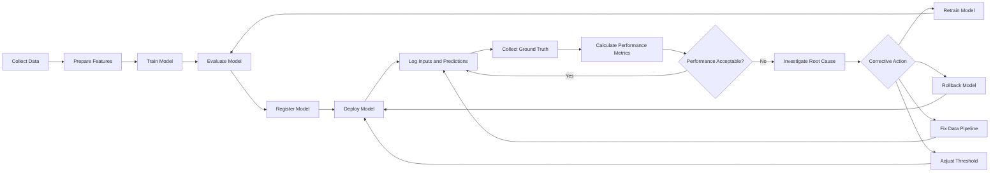
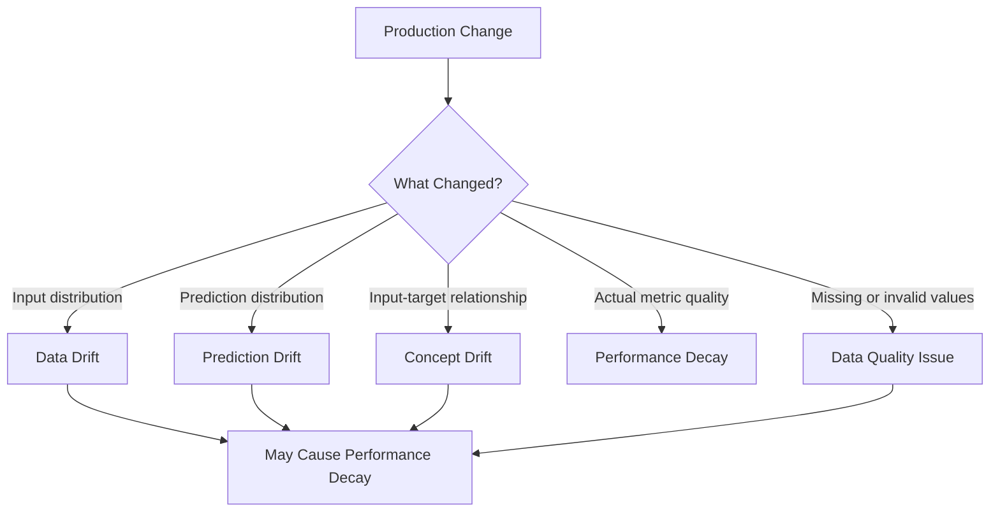
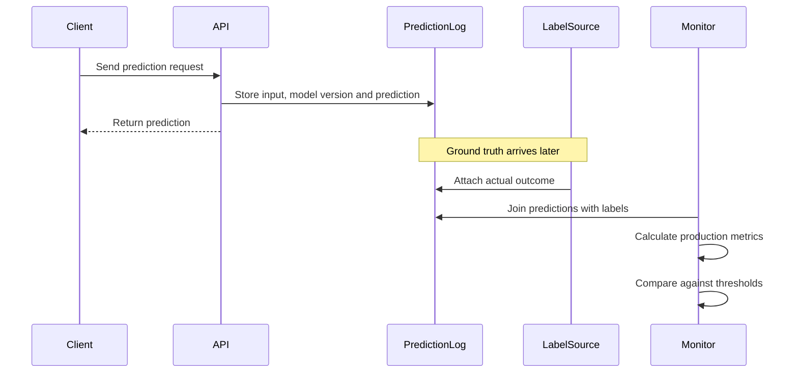
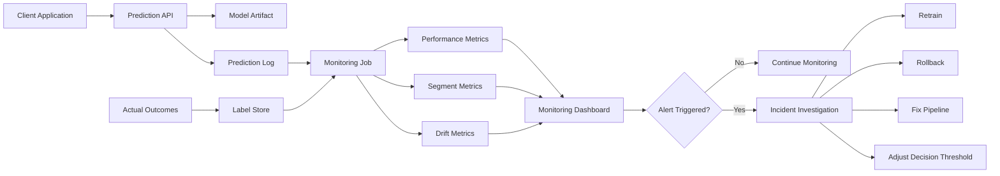
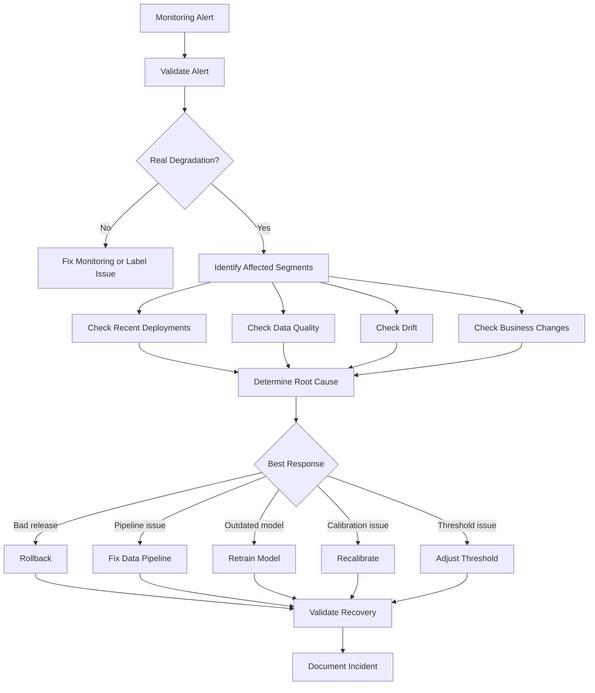

# 022 — Model Performance Decay

**Course:** 04 — MLOps and Deployment
**Module:** Module 08 — MLOps
**Content Group:** Monitoring and Versioning
**Roadmap Source:** MLOps / Monitoring and Versioning
**Lesson Type:** MLOps
**Lesson Order:** 022
**Suggested Duration:** 22 minutes

---

## 1. Overview

**Model performance decay** is the gradual or sudden reduction in a machine learning model's effectiveness after it has been deployed.

A model may perform well during training and offline evaluation but become less accurate in production because:

* user behavior changes;
* input data distributions change;
* relationships between features and targets change;
* upstream data pipelines change;
* real-world conditions differ from the training environment;
* data quality problems appear;
* the business definition of success changes.

Model performance decay answers an important production question:

> Is the deployed model still producing useful and reliable predictions?

Monitoring model performance helps teams detect degradation early, investigate its causes, and decide whether to retrain, replace, roll back, or recalibrate the model.

---

## 2. Learning Objectives

By the end of this lesson, you should be able to:

* explain model performance decay in your own words;
* distinguish performance decay from data drift and concept drift;
* identify common causes of model degradation;
* define metrics for monitoring production model quality;
* understand the role of delayed ground-truth labels;
* design alerts and retraining triggers;
* create a small notebook, dashboard, API, or monitoring artifact related to performance decay.

---

## 3. What Is Model Performance Decay?

Model performance decay occurs when a deployed model's production metrics become worse over time.

For a classification model, this may appear as declining:

* accuracy;
* precision;
* recall;
* F1-score;
* ROC-AUC;
* PR-AUC;
* calibration quality.

For a regression model, it may appear as increasing:

* Mean Absolute Error;
* Mean Squared Error;
* Root Mean Squared Error;
* Mean Absolute Percentage Error.

For a recommendation or ranking system, it may appear as declining:

* click-through rate;
* conversion rate;
* precision at K;
* recall at K;
* Normalized Discounted Cumulative Gain;
* revenue per recommendation.

A simplified definition is:

[
\text{Performance Decay}
========================

## \text{Current Error}

\text{Baseline Error}
]

For metrics where a higher value is better:

[
\text{Relative Decay}
=====================

\frac{M_{\text{baseline}} - M_{\text{current}}}
{M_{\text{baseline}}}
]

Where:

* (M_{\text{baseline}}) is the expected production metric;
* (M_{\text{current}}) is the recently observed metric.

### Example

Suppose a fraud detection model had an initial F1-score of `0.84`.

After three months, its F1-score falls to `0.71`.

[
\text{Relative Decay}
=====================

\frac{0.84 - 0.71}{0.84}
\approx 15.5%
]

The model has experienced approximately **15.5% relative performance decay**.

---

## 4. Where It Fits in the ML Lifecycle

Model performance decay is mainly handled during the production monitoring and maintenance stages.



Monitoring is not the end of the ML workflow. It creates a feedback loop between production behavior and future model development.

---

## 5. Performance Decay vs. Data Drift vs. Concept Drift

These concepts are related but not identical.

| Concept            | What Changes?                            | Labels Required? | Example                                          |
| ------------------ | ---------------------------------------- | ---------------: | ------------------------------------------------ |
| Data drift         | Distribution of input features           |               No | Customer income distribution changes             |
| Prediction drift   | Distribution of model outputs            |               No | Positive prediction rate rises from 10% to 30%   |
| Concept drift      | Relationship between inputs and target   |      Usually yes | Previous fraud patterns no longer indicate fraud |
| Performance decay  | Actual model quality becomes worse       |              Yes | Production F1-score decreases                    |
| Data quality issue | Input data becomes invalid or incomplete |               No | A feature becomes mostly null                    |

A model can experience data drift without immediate performance decay.

For example, the age distribution of users may change, but the model may still remain accurate.

Similarly, model performance may decay even when input distributions appear stable. This can happen when the relationship between features and outcomes changes.



---

## 6. Common Causes of Model Performance Decay

### 6.1 Changes in User Behavior

Users may interact with a product differently over time.

Examples:

* customers adopt a new payment method;
* users change search behavior;
* fraudsters discover how to avoid detection;
* viewers prefer a new type of content.

### 6.2 Seasonal Effects

Some models perform differently during:

* holidays;
* weekends;
* sales campaigns;
* weather events;
* academic semesters;
* economic cycles.

A demand forecasting model trained on normal months may perform poorly during a major holiday.

### 6.3 Concept Drift

Concept drift occurs when the mapping between input variables and the target changes.

Initially:

[
P(Y \mid X) = P_{\text{training}}(Y \mid X)
]

After deployment:

[
P_{\text{production}}(Y \mid X)
\neq
P_{\text{training}}(Y \mid X)
]

For example, a high transaction amount may have previously been a strong fraud indicator. Later, inflation or changing customer behavior may make large transactions normal.

### 6.4 Data Pipeline Changes

A model may degrade because of technical changes rather than real-world behavior.

Examples:

* feature units change from dollars to cents;
* a categorical encoding changes;
* timestamps use a different time zone;
* a feature is renamed;
* missing values are filled differently;
* a preprocessing step is removed.

### 6.5 Poor Data Quality

Common problems include:

* missing features;
* duplicate records;
* invalid values;
* delayed data;
* corrupted events;
* incorrect joins;
* schema mismatches.

### 6.6 Training-Serving Skew

Training-serving skew occurs when features are computed differently during training and production inference.

For example:

```text
Training:
average_purchase_30d includes the current transaction

Production:
average_purchase_30d excludes the current transaction
```

Even a small difference can reduce production accuracy.

### 6.7 Feedback Loops

Model predictions may influence future training data.

For example:

1. a recommendation model promotes certain products;
2. promoted products receive more clicks;
3. click data is used as new training data;
4. the model becomes increasingly biased toward already promoted products.

### 6.8 External Events

Unexpected events can invalidate previous patterns.

Examples:

* policy changes;
* economic shocks;
* pandemics;
* competitor launches;
* supply-chain disruption;
* new regulations.

---

## 7. Types of Performance Decay

### 7.1 Gradual Decay

Performance slowly becomes worse over weeks or months.

```text
0.88 → 0.87 → 0.85 → 0.82 → 0.79
```

Possible causes:

* gradual changes in customer behavior;
* slow concept drift;
* long-term market changes.

### 7.2 Sudden Decay

Performance drops sharply at a specific time.

```text
0.87 → 0.86 → 0.85 → 0.61
```

Possible causes:

* broken feature pipeline;
* software release;
* schema change;
* incorrect model artifact;
* external event.

### 7.3 Recurring Decay

Performance changes according to a repeating pattern.

Examples:

* lower accuracy every weekend;
* higher error during holiday periods;
* reduced performance during nighttime traffic.

### 7.4 Segment-Specific Decay

Overall performance may appear stable while a particular segment performs poorly.

Examples:

* a geographic region;
* a device type;
* new users;
* high-value customers;
* one product category.

This is why monitoring only one global metric is often insufficient.

---

## 8. Measuring Performance in Production

To measure true model performance, predictions must eventually be matched with actual outcomes.

### Classification Example

A prediction log might contain:

| Prediction ID | Timestamp        | Prediction | Probability | Actual Label |
| ------------- | ---------------- | ---------: | ----------: | -----------: |
| p001          | 2026-07-01 10:00 |          1 |        0.92 |            1 |
| p002          | 2026-07-01 10:01 |          0 |        0.18 |            1 |
| p003          | 2026-07-01 10:02 |          0 |        0.07 |            0 |

From these records, the system can calculate:

[
\text{Precision}
================

\frac{TP}{TP + FP}
]

[
\text{Recall}
=============

\frac{TP}{TP + FN}
]

[
F_1
===

2 \times
\frac{\text{Precision} \times \text{Recall}}
{\text{Precision} + \text{Recall}}
]

### Regression Example

For a demand forecasting model:

| Date  | Predicted Demand | Actual Demand | Absolute Error |
| ----- | ---------------: | ------------: | -------------: |
| Day 1 |              120 |           110 |             10 |
| Day 2 |              150 |           170 |             20 |
| Day 3 |              135 |           140 |              5 |

[
MAE
===

\frac{1}{n}
\sum_{i=1}^{n}
|y_i-\hat{y}_i|
]

---

## 9. The Delayed Ground-Truth Problem

In many real systems, the actual label is not immediately available.

Examples:

* loan default may be known after several months;
* customer churn may be confirmed after 30 days;
* fraud may be investigated after several weeks;
* medical outcomes may require follow-up;
* product returns may happen after a purchase.

The monitoring workflow becomes:



Until labels become available, teams often monitor proxy indicators such as:

* input drift;
* prediction drift;
* confidence distribution;
* data quality;
* business outcomes;
* user feedback;
* manual review results.

These indicators cannot fully replace ground-truth performance metrics, but they can provide early warnings.

---

## 10. Establishing a Baseline

A monitoring system needs a reference point.

Possible baselines include:

* validation-set performance;
* test-set performance;
* performance during the first production week;
* previous model-version performance;
* rolling historical average;
* business-defined target.

Example:

| Metric              | Baseline | Warning Threshold | Critical Threshold |
| ------------------- | -------: | ----------------: | -----------------: |
| F1-score            |     0.84 |        below 0.80 |         below 0.75 |
| Recall              |     0.90 |        below 0.86 |         below 0.80 |
| False-positive rate |     0.06 |        above 0.09 |         above 0.12 |
| Prediction latency  |   120 ms |      above 200 ms |       above 500 ms |

Thresholds should be based on business impact rather than arbitrary percentages.

For a medical diagnosis system, a small recall reduction may be critical. For a movie recommendation model, a similar reduction may be less urgent.

---

## 11. Rolling Performance Metrics

Production metrics are commonly calculated over rolling windows.

Examples:

* last hour;
* last 24 hours;
* last 7 days;
* last 1,000 labeled predictions;
* current calendar month.

For a rolling window of size (w):

[
M_t
===

f
\left(
(y_{t-w+1},\hat{y}_{t-w+1}),
\ldots,
(y_t,\hat{y}_t)
\right)
]

Rolling windows help reveal trends while reducing the effect of individual observations.

### Window Trade-Off

| Window Type        | Advantage                 | Limitation                      |
| ------------------ | ------------------------- | ------------------------------- |
| Small window       | Detects changes quickly   | Noisy and unstable              |
| Large window       | More statistically stable | Detects changes slowly          |
| Time-based window  | Easy to interpret         | Volume may vary                 |
| Count-based window | Consistent sample size    | Covers different time durations |

A production system may use several windows simultaneously.

---

## 12. Segment-Level Monitoring

Global metrics can hide local failures.

Suppose a model has an overall accuracy of `91%`.

| Customer Segment | Accuracy |
| ---------------- | -------: |
| Existing users   |      94% |
| New users        |      72% |
| Mobile users     |      90% |
| Web users        |      93% |

The global metric appears healthy, but the model performs poorly for new users.

Important segmentation dimensions may include:

* country or region;
* customer type;
* product category;
* device type;
* traffic source;
* age group;
* time of day;
* model confidence;
* input-value ranges.

Use segment monitoring carefully. Very small segments may produce unstable metrics.

---

## 13. Example Monitoring Pipeline

```text
trained model
    ↓
model registry
    ↓
deployment API
    ↓
prediction logs
    ↓
ground-truth labels
    ↓
metric calculation
    ↓
dashboard and alerts
    ↓
investigation
    ↓
retrain, recalibrate, roll back or fix pipeline
```

A more complete architecture is:



---

## 14. Practical Python Demo

The following example simulates declining classification performance over several weeks.

```python
from __future__ import annotations

import pandas as pd
from sklearn.metrics import accuracy_score, f1_score, precision_score, recall_score


def calculate_metrics(group: pd.DataFrame) -> pd.Series:
    """Calculate classification metrics for one monitoring period."""
    y_true = group["actual"]
    y_pred = group["prediction"]

    return pd.Series(
        {
            "sample_size": len(group),
            "accuracy": accuracy_score(y_true, y_pred),
            "precision": precision_score(
                y_true,
                y_pred,
                zero_division=0,
            ),
            "recall": recall_score(
                y_true,
                y_pred,
                zero_division=0,
            ),
            "f1_score": f1_score(
                y_true,
                y_pred,
                zero_division=0,
            ),
        }
    )


prediction_data = pd.DataFrame(
    {
        "week": [
            "2026-W23",
            "2026-W23",
            "2026-W23",
            "2026-W23",
            "2026-W24",
            "2026-W24",
            "2026-W24",
            "2026-W24",
            "2026-W25",
            "2026-W25",
            "2026-W25",
            "2026-W25",
        ],
        "actual": [
            1, 0, 1, 0,
            1, 0, 1, 1,
            1, 0, 1, 1,
        ],
        "prediction": [
            1, 0, 1, 0,
            1, 0, 0, 1,
            0, 1, 0, 1,
        ],
    }
)

weekly_metrics = (
    prediction_data
    .groupby("week", as_index=False)
    .apply(calculate_metrics, include_groups=False)
    .reset_index(drop=True)
)

print(weekly_metrics)
```

Possible output:

```text
       week  sample_size  accuracy  precision  recall  f1_score
0  2026-W23          4.0      1.00       1.00    1.00      1.00
1  2026-W24          4.0      0.75       1.00    0.67      0.80
2  2026-W25          4.0      0.25       0.50    0.33      0.40
```

This small example shows a clear decline in production performance.

In a real system, use a much larger sample before drawing conclusions.

---

## 15. Detecting Decay Against a Baseline

```python
from __future__ import annotations

import pandas as pd


BASELINE_F1 = 0.84
WARNING_THRESHOLD = 0.80
CRITICAL_THRESHOLD = 0.75


def assign_status(f1_score: float) -> str:
    """Assign a monitoring status based on production F1-score."""
    if f1_score < CRITICAL_THRESHOLD:
        return "critical"

    if f1_score < WARNING_THRESHOLD:
        return "warning"

    return "healthy"


metrics = pd.DataFrame(
    {
        "date": pd.to_datetime(
            [
                "2026-07-01",
                "2026-07-08",
                "2026-07-15",
                "2026-07-22",
            ]
        ),
        "f1_score": [0.85, 0.82, 0.78, 0.71],
    }
)

metrics["absolute_change"] = (
    metrics["f1_score"] - BASELINE_F1
)

metrics["relative_decay"] = (
    BASELINE_F1 - metrics["f1_score"]
) / BASELINE_F1

metrics["status"] = metrics["f1_score"].apply(assign_status)

print(metrics)
```

Example result:

| Date       | F1-score | Relative Decay | Status   |
| ---------- | -------: | -------------: | -------- |
| 2026-07-01 |     0.85 |          -1.2% | Healthy  |
| 2026-07-08 |     0.82 |           2.4% | Healthy  |
| 2026-07-15 |     0.78 |           7.1% | Warning  |
| 2026-07-22 |     0.71 |          15.5% | Critical |

---

## 16. Example SQL Query

Assume a production table stores predictions and eventual labels.

```sql
SELECT
    DATE_TRUNC('week', prediction_timestamp) AS metric_week,
    model_version,
    COUNT(*) AS labeled_predictions,
    AVG(
        CASE
            WHEN prediction = actual_label THEN 1.0
            ELSE 0.0
        END
    ) AS accuracy
FROM prediction_logs
WHERE actual_label IS NOT NULL
GROUP BY
    DATE_TRUNC('week', prediction_timestamp),
    model_version
ORDER BY
    metric_week,
    model_version;
```

This query provides weekly accuracy by model version.

A more complete system should also calculate:

* precision;
* recall;
* false-positive rate;
* false-negative rate;
* segment-level performance;
* confidence calibration;
* sample size.

---

## 17. Monitoring Dashboard Design

A useful dashboard might contain:

### Summary Cards

* current model version;
* total predictions;
* percentage of predictions with labels;
* current performance metric;
* baseline performance;
* relative decay;
* alert status.

### Time-Series Charts

* accuracy or F1-score over time;
* error rate over time;
* sample volume over time;
* prediction confidence over time;
* business KPI over time.

### Segment Tables

* metric by country;
* metric by device type;
* metric by customer segment;
* metric by product category.

### Diagnostic Panels

* feature drift;
* prediction drift;
* missing-value rate;
* schema-validation failures;
* API latency;
* error rate.

```text
+-------------------------------------------------------------+
| Model: fraud-detector-v12      Status: WARNING              |
+----------------------+----------------------+----------------+
| F1: 0.78             | Baseline: 0.84       | Decay: 7.1%   |
+----------------------+----------------------+----------------+
| Performance over time                                      |
| 0.90 ──╮                                                   |
| 0.85   ╰──╮                                                |
| 0.80      ╰────╮                                           |
| 0.75           ╰──                                         |
+-------------------------------------------------------------+
| Segment performance                                        |
| Region A: 0.82 | Region B: 0.76 | Region C: 0.61           |
+-------------------------------------------------------------+
| Drift | Missing values | Prediction rate | API latency      |
+-------------------------------------------------------------+
```

---

## 18. Alerting Strategy

Alerts should identify meaningful degradation without creating excessive noise.

A simple rule might be:

```text
Trigger warning:
F1-score < 0.80 for two consecutive monitoring windows

Trigger critical alert:
F1-score < 0.75 and sample size >= 1,000
```

A better alert usually combines:

* performance threshold;
* minimum sample size;
* duration;
* comparison baseline;
* segment severity;
* business impact.

### Example

```python
def should_alert(
    current_f1: float,
    baseline_f1: float,
    sample_size: int,
    minimum_sample_size: int = 1000,
    maximum_relative_decay: float = 0.10,
) -> bool:
    """Return True when performance decay exceeds the allowed level."""
    if sample_size < minimum_sample_size:
        return False

    relative_decay = (
        baseline_f1 - current_f1
    ) / baseline_f1

    return relative_decay >= maximum_relative_decay
```

---

## 19. What to Do When Performance Decays

Retraining is only one possible response.

### 19.1 Verify the Monitoring Data

Check whether:

* labels are correct;
* joins are correct;
* timestamps align;
* sample sizes are sufficient;
* metric code is correct;
* monitoring jobs completed successfully.

### 19.2 Check Recent Deployments

Investigate:

* new model versions;
* API releases;
* preprocessing changes;
* feature-store updates;
* configuration changes;
* dependency upgrades.

### 19.3 Inspect Data Quality

Look for:

* missing values;
* unexpected categories;
* changed units;
* out-of-range values;
* duplicated records;
* schema violations.

### 19.4 Analyze Drift

Compare production data against:

* training data;
* validation data;
* previous production periods;
* healthy time windows.

### 19.5 Analyze Segments

Determine whether degradation affects:

* all predictions;
* one customer group;
* one region;
* one device;
* one input range;
* one model version.

### 19.6 Choose a Corrective Action

| Cause             | Possible Response                       |
| ----------------- | --------------------------------------- |
| Broken pipeline   | Fix pipeline and replay affected data   |
| Poor new model    | Roll back to previous model             |
| Data drift        | Retrain with recent representative data |
| Concept drift     | Redesign features or modeling strategy  |
| Calibration drift | Recalibrate probabilities               |
| Threshold issue   | Adjust decision threshold               |
| Seasonal pattern  | Build seasonal models or features       |
| Label problem     | Repair label collection process         |

---

## 20. Retraining Strategy

Retraining can be:

### Schedule-Based

Retrain at a fixed interval.

```text
Every week
Every month
Every quarter
```

### Performance-Based

Retrain when a production metric crosses a threshold.

```text
Retrain when F1-score < 0.78
```

### Drift-Based

Retrain when significant drift is detected.

```text
Retrain when PSI > 0.20 for critical features
```

### Hybrid

Use multiple conditions.

```text
Retrain monthly
OR
when performance decay exceeds 10%
OR
when critical feature drift persists for 3 days
```

Retraining should not be fully automatic without safeguards.

A retrained model should pass:

* data validation;
* unit tests;
* integration tests;
* offline evaluation;
* fairness checks;
* performance comparison;
* deployment approval;
* canary or shadow testing.

---

## 21. Versioning Requirements

When monitoring performance, every prediction should be traceable to the complete ML configuration.

Important metadata includes:

* model version;
* dataset version;
* feature version;
* preprocessing version;
* source-code commit;
* dependency version;
* container image tag;
* decision threshold;
* deployment environment;
* prediction timestamp.

Example prediction log:

```json
{
  "prediction_id": "pred-20260713-000184",
  "timestamp": "2026-07-13T00:18:42Z",
  "model_name": "fraud-detector",
  "model_version": "12",
  "container_image": "fraud-api:1.8.0",
  "git_commit": "9fc62ad",
  "prediction": 1,
  "probability": 0.91,
  "threshold": 0.72,
  "actual_label": null
}
```

Without version metadata, it may be impossible to identify which model produced a problematic prediction.

---

## 22. Model Performance Decay Incident Workflow



---

## 23. Practical Exercise

Build a small model-performance monitoring notebook.

### Task

1. Train a binary classification model.
2. Create several simulated production batches.
3. Gradually change the input-target relationship.
4. Generate predictions for every batch.
5. Calculate accuracy, precision, recall, and F1-score.
6. Plot the metrics over time.
7. Define warning and critical thresholds.
8. Mark the first time each threshold is crossed.
9. Calculate metrics for at least two data segments.
10. Write a short incident response recommendation.

### Suggested Output

```text
performance_decay_monitoring.ipynb
├── Load or generate data
├── Train baseline model
├── Simulate production periods
├── Log predictions
├── Attach labels
├── Calculate rolling metrics
├── Compare with baseline
├── Analyze segments
├── Trigger alerts
└── Recommend corrective action
```

---

## 24. Mini Production Exercise

Extend a FastAPI model service with a prediction log.

### Endpoint

```text
POST /predict
```

### Example Request

```json
{
  "age": 35,
  "monthly_income": 4200,
  "transaction_amount": 780
}
```

### Example Response

```json
{
  "prediction_id": "pred-000184",
  "prediction": 1,
  "probability": 0.87,
  "model_version": "12"
}
```

Store the following information for every request:

```text
prediction_id
timestamp
model_version
input features or feature hashes
prediction
probability
latency
actual label when available
```

Add a batch monitoring script:

```bash
python scripts/calculate_production_metrics.py \
  --window-days 7 \
  --model-version 12
```

The script should:

1. load labeled predictions;
2. calculate performance metrics;
3. compare them with the baseline;
4. print the monitoring status;
5. save a JSON or CSV report.

---

## 25. Common Mistakes

### Mistake 1: Monitoring Only Data Drift

Data drift is useful, but it does not prove that model quality has declined.

**Better approach:** Monitor data drift and true labeled performance.

### Mistake 2: Using Only One Global Metric

Overall accuracy may hide failures in important segments.

**Better approach:** Monitor global and segment-level metrics.

### Mistake 3: Ignoring Sample Size

An F1-score calculated from 15 observations may be highly unstable.

**Better approach:** Require a minimum sample size before triggering alerts.

### Mistake 4: Comparing Incompatible Time Windows

Comparing one hour of data with one month of baseline data may produce misleading results.

**Better approach:** Use comparable windows and account for seasonality.

### Mistake 5: Retraining Immediately After Every Alert

The problem may be caused by a broken pipeline, label issue, or bad deployment.

**Better approach:** Investigate the root cause before retraining.

### Mistake 6: Not Logging Model Versions

Without model-version metadata, poor predictions cannot be traced to a specific artifact.

**Better approach:** Log model, data, feature, code, and container versions.

### Mistake 7: Monitoring Technical Metrics Only

Low latency does not mean the model is making useful predictions.

**Better approach:** Combine system metrics, model metrics, and business metrics.

### Mistake 8: Ignoring Label Delay

Recent performance may look unavailable simply because labels have not arrived.

**Better approach:** Track label completeness and calculate metrics only on mature observations.

---

## 26. Completion Checklist

* [ ] I can explain model performance decay in one or two minutes.
* [ ] I can distinguish performance decay from data drift.
* [ ] I understand why ground-truth labels are required.
* [ ] I can choose an appropriate production performance metric.
* [ ] I can define a baseline and alert threshold.
* [ ] I can calculate performance over rolling windows.
* [ ] I can analyze performance by segment.
* [ ] I understand delayed-label monitoring.
* [ ] I can describe when to retrain, roll back, recalibrate, or fix a pipeline.
* [ ] I have created a notebook, chart, dashboard, query, API, or monitoring note.
* [ ] I have documented at least one caveat, assumption, or unanswered question.

---

## 27. Portfolio Artifact

A strong portfolio project could include:

```text
model-performance-monitor/
├── app/
│   ├── main.py
│   ├── schemas.py
│   └── prediction_logger.py
├── monitoring/
│   ├── calculate_metrics.py
│   ├── detect_decay.py
│   └── generate_report.py
├── notebooks/
│   └── performance_decay_analysis.ipynb
├── tests/
│   ├── test_metrics.py
│   └── test_decay_detection.py
├── model/
│   └── classifier.joblib
├── reports/
│   └── latest_metrics.json
├── Dockerfile
├── requirements.txt
└── README.md
```

The README should explain:

* the business problem;
* the model and dataset;
* the baseline metric;
* the prediction-log schema;
* the monitoring windows;
* the warning and critical thresholds;
* how delayed labels are handled;
* how to run the API;
* how to generate a monitoring report;
* what action is taken when decay is detected.

---

## 28. Related Outcome

Deploy, version, monitor, and operate machine learning models using:

* APIs;
* Docker;
* CI/CD;
* model registries;
* prediction logs;
* performance monitoring;
* drift-aware workflows;
* retraining and rollback strategies.

---

## 29. Related Project

**Mini Project:** Deploy an ML Model API

Required components:

* FastAPI endpoint at `/predict`;
* serialized model artifact;
* model-version metadata;
* prediction logging;
* Dockerfile;
* dependency file;
* monitoring script;
* performance-decay thresholds;
* example monitoring report;
* README with setup and sample requests.

---

## 30. Summary

**Model performance decay** is the reduction of a deployed model's real-world effectiveness over time.

It may be caused by:

* data drift;
* concept drift;
* changing user behavior;
* seasonal effects;
* data quality failures;
* training-serving skew;
* software or pipeline changes;
* unexpected external events.

A reliable monitoring system should:

1. log predictions and model versions;
2. collect ground-truth labels;
3. calculate rolling performance metrics;
4. compare metrics against a meaningful baseline;
5. inspect important data segments;
6. trigger statistically reliable alerts;
7. investigate the root cause;
8. retrain, recalibrate, roll back, or repair the pipeline when necessary.

A production model is not finished when it is deployed.

It must be continuously observed, evaluated, maintained, and improved.
