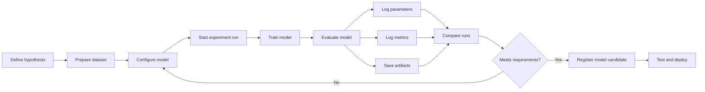
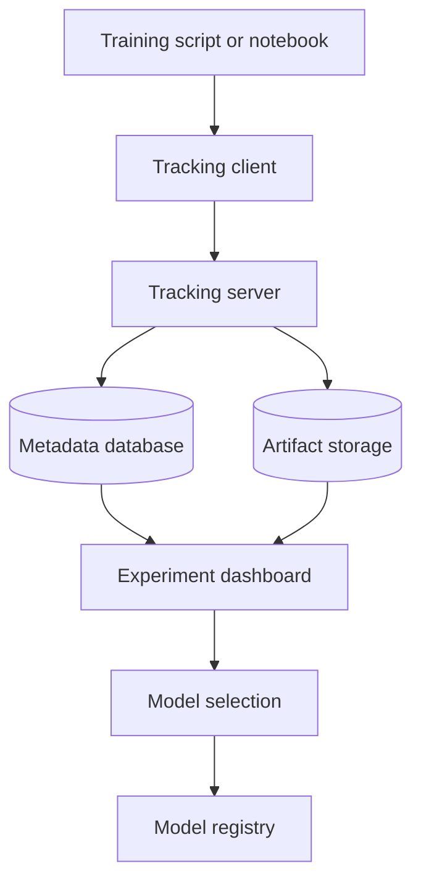
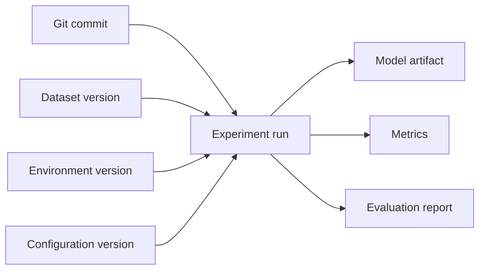
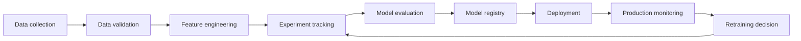

# 023 — Experiment Tracking

## Lesson Information

| Item               | Details                           |
| ------------------ | --------------------------------- |
| Course             | 04 — MLOps and Deployment         |
| Module             | Module 08 — MLOps                 |
| Content Group      | Monitoring and Versioning         |
| Roadmap Source     | MLOps / Monitoring and Versioning |
| Lesson Type        | MLOps                             |
| Lesson Order       | 023                               |
| Suggested Duration | 22 minutes                        |

---

## 1. Overview

**Experiment Tracking** is the process of recording, organizing, and comparing machine learning experiments.

During model development, a data scientist may train dozens or hundreds of model versions using different:

* datasets;
* preprocessing steps;
* features;
* algorithms;
* hyperparameters;
* random seeds;
* evaluation metrics;
* software environments.

Without experiment tracking, these results are often scattered across notebooks, terminal logs, spreadsheets, and manually named model files.

An experiment tracking system connects each result to the exact configuration that produced it.

```text
Experiment configuration
        +
Dataset version
        +
Source code version
        +
Training environment
        ↓
     Model run
        ↓
Metrics + parameters + artifacts + logs
```

Experiment tracking helps answer questions such as:

* Which model achieved the best validation score?
* Which hyperparameters were used?
* Which dataset version produced this result?
* Can the experiment be reproduced?
* Was the improvement real or caused by data leakage?
* Which trained model should be promoted to production?

---

## 2. Learning Objectives

After completing this lesson, you should be able to:

1. Explain experiment tracking in your own words.
2. Describe the difference between an experiment, a run, and an artifact.
3. Identify the information that should be recorded during model training.
4. Compare multiple model runs using metrics and parameters.
5. Track a small machine learning experiment using a tool or structured files.
6. Connect experiment tracking with model versioning and deployment.
7. Create a portfolio artifact that demonstrates reproducible experimentation.

---

## 3. Why Experiment Tracking Is Necessary

A typical notebook may contain code such as:

```python
model = RandomForestClassifier(
    n_estimators=200,
    max_depth=10,
    random_state=42,
)

model.fit(X_train, y_train)
```

After changing the model several times, it becomes difficult to remember:

* whether the best run used 100 or 200 trees;
* whether feature scaling was enabled;
* which train-test split was used;
* which dataset file was loaded;
* whether accuracy came from training or validation data;
* where the trained model was saved.

This creates a common situation:

> “The model performed well yesterday, but I cannot reproduce the result today.”

Experiment tracking solves this problem by storing the context of every run.

---

## 4. Core Concepts

### 4.1 Experiment

An **experiment** is a collection of related model-development runs.

For example:

```text
Experiment: Customer Churn Classification
```

This experiment may contain runs for:

* Logistic Regression;
* Random Forest;
* XGBoost;
* different feature sets;
* different hyperparameter combinations.

---

### 4.2 Run

A **run** is one execution of a training or evaluation pipeline.

Each run should have a unique identifier.

```text
Experiment: Customer Churn Classification
│
├── Run 001: Logistic Regression
├── Run 002: Random Forest, depth=5
├── Run 003: Random Forest, depth=10
└── Run 004: XGBoost, learning_rate=0.05
```

A run normally records:

* input parameters;
* output metrics;
* generated artifacts;
* execution time;
* source code version;
* environment information.

---

### 4.3 Parameters

**Parameters** describe how the experiment was configured.

Examples include:

```text
model_type = random_forest
n_estimators = 200
max_depth = 10
test_size = 0.20
random_seed = 42
feature_scaling = false
```

Parameters are usually fixed before or during a run.

---

### 4.4 Metrics

**Metrics** measure the result of a run.

For a classification model, common metrics include:

* accuracy;
* precision;
* recall;
* F1-score;
* ROC-AUC;
* log loss.

For a regression model, common metrics include:

* Mean Absolute Error;
* Mean Squared Error;
* Root Mean Squared Error;
* (R^2).

Example:

```text
accuracy = 0.912
precision = 0.894
recall = 0.876
f1_score = 0.885
roc_auc = 0.941
```

Metrics may be recorded once or tracked over time.

For example, a neural network may log training loss after every epoch.

---

### 4.5 Artifacts

An **artifact** is a file produced or used by an experiment.

Common artifacts include:

* trained model files;
* confusion matrices;
* evaluation reports;
* feature importance charts;
* prediction samples;
* preprocessing pipelines;
* configuration files;
* training logs;
* dataset summaries.

Example structure:

```text
artifacts/
├── model.joblib
├── confusion_matrix.png
├── metrics.json
├── feature_importance.csv
└── classification_report.txt
```

---

### 4.6 Metadata and Tags

Metadata provides additional context about a run.

Useful metadata may include:

```text
author = khanh
purpose = baseline
environment = local
git_commit = a14c92f
dataset_version = churn_v3
status = completed
```

Tags make experiments easier to search and group.

Examples:

```text
baseline
candidate
production
failed
feature-engineering
hyperparameter-search
```

---

## 5. What Should Be Tracked?

A useful experiment record should answer four questions:

1. **What did we use?**
2. **What did we run?**
3. **What result did we get?**
4. **Can we reproduce it?**

### Recommended Tracking Information

| Category        | Examples                                         |
| --------------- | ------------------------------------------------ |
| Dataset         | Name, version, path, checksum, row count         |
| Split           | Train, validation and test proportions           |
| Features        | Feature names, transformations, selected columns |
| Model           | Algorithm, architecture, framework               |
| Hyperparameters | Learning rate, depth, batch size, epochs         |
| Metrics         | Accuracy, F1-score, ROC-AUC, RMSE                |
| Artifacts       | Model file, charts, reports, predictions         |
| Code            | Git branch, commit hash, script path             |
| Environment     | Python version, package versions, hardware       |
| Timing          | Start time, end time, duration                   |
| Status          | Running, completed, failed                       |
| Notes           | Assumptions, caveats, observations               |

---

## 6. Experiment Tracking Workflow



The workflow usually begins with a hypothesis.

Example:

> Increasing the number of trees from 100 to 300 will improve validation F1-score without significantly increasing prediction latency.

The experiment should then record enough evidence to accept or reject that hypothesis.

---

## 7. Example Experiment Table

Assume that four models were trained for a customer churn problem.

| Run     | Model               | Main Parameters         | Accuracy | F1-score | Training Time |
| ------- | ------------------- | ----------------------- | -------: | -------: | ------------: |
| Run 001 | Logistic Regression | `C=1.0`                 |    0.851 |    0.781 |         2.1 s |
| Run 002 | Random Forest       | `trees=100`, `depth=5`  |    0.882 |    0.824 |         8.7 s |
| Run 003 | Random Forest       | `trees=300`, `depth=10` |    0.914 |    0.871 |        25.4 s |
| Run 004 | XGBoost             | `lr=0.05`, `depth=6`    |    0.921 |    0.879 |        31.8 s |

Run 004 has the highest F1-score, but it may not automatically be the best production choice.

The team should also consider:

* inference latency;
* model size;
* memory usage;
* interpretability;
* training cost;
* fairness;
* operational complexity.

Experiment tracking stores the evidence needed to make this decision.

---

## 8. Manual Experiment Tracking

A simple project can track experiments without a dedicated platform.

### Suggested Directory Structure

```text
ml-project/
├── data/
├── notebooks/
├── src/
│   ├── train.py
│   └── evaluate.py
├── experiments/
│   ├── run_001/
│   │   ├── config.json
│   │   ├── metrics.json
│   │   ├── model.joblib
│   │   └── confusion_matrix.png
│   └── run_002/
│       ├── config.json
│       ├── metrics.json
│       ├── model.joblib
│       └── confusion_matrix.png
├── requirements.txt
└── README.md
```

### Example Configuration

```json
{
  "run_id": "run_003",
  "model": "RandomForestClassifier",
  "parameters": {
    "n_estimators": 300,
    "max_depth": 10,
    "random_state": 42
  },
  "dataset_version": "churn_v3",
  "git_commit": "a14c92f"
}
```

### Example Metrics File

```json
{
  "accuracy": 0.914,
  "precision": 0.887,
  "recall": 0.856,
  "f1_score": 0.871,
  "training_time_seconds": 25.4
}
```

This method is suitable for small projects, but it becomes difficult to manage when the number of runs grows.

---

## 9. Experiment Tracking Platforms

Common experiment tracking platforms include:

* MLflow;
* Weights & Biases;
* TensorBoard;
* Neptune;
* ClearML;
* Comet;
* cloud-based machine learning platforms.

These tools commonly provide:

* run history;
* metric charts;
* parameter comparison;
* artifact storage;
* model registration;
* team collaboration;
* experiment search;
* API integration.

A typical tracking architecture looks like this:



The metadata database may store parameters and metrics, while object storage stores large artifacts such as model files and charts.

---

## 10. Practical Example with MLflow

Install the required packages:

```bash
pip install mlflow scikit-learn pandas joblib
```

### Training Script

```python
from pathlib import Path

import mlflow
import mlflow.sklearn
from sklearn.datasets import load_breast_cancer
from sklearn.ensemble import RandomForestClassifier
from sklearn.metrics import accuracy_score, f1_score
from sklearn.model_selection import train_test_split


RANDOM_STATE = 42
ARTIFACT_DIR = Path("artifacts")
ARTIFACT_DIR.mkdir(exist_ok=True)


def main() -> None:
    dataset = load_breast_cancer()
    X_train, X_test, y_train, y_test = train_test_split(
        dataset.data,
        dataset.target,
        test_size=0.20,
        random_state=RANDOM_STATE,
        stratify=dataset.target,
    )

    parameters = {
        "n_estimators": 200,
        "max_depth": 8,
        "random_state": RANDOM_STATE,
    }

    mlflow.set_experiment("breast-cancer-classification")

    with mlflow.start_run():
        model = RandomForestClassifier(**parameters)
        model.fit(X_train, y_train)

        predictions = model.predict(X_test)

        accuracy = accuracy_score(y_test, predictions)
        f1 = f1_score(y_test, predictions)

        mlflow.log_params(parameters)
        mlflow.log_param("test_size", 0.20)
        mlflow.log_param("dataset", "sklearn_breast_cancer")

        mlflow.log_metric("accuracy", accuracy)
        mlflow.log_metric("f1_score", f1)

        mlflow.sklearn.log_model(
            sk_model=model,
            artifact_path="model",
        )

        print(f"Accuracy: {accuracy:.4f}")
        print(f"F1-score: {f1:.4f}")


if __name__ == "__main__":
    main()
```

Run the script:

```bash
python train.py
```

Open the local tracking interface:

```bash
mlflow ui
```

The interface allows you to:

* inspect each run;
* compare parameters;
* compare metrics;
* download artifacts;
* identify the best candidate model.

---

## 11. Tracking Multiple Runs

To compare hyperparameters, execute multiple configurations.

```python
from itertools import product

depth_values = [4, 8, 12]
tree_values = [100, 200, 300]

for max_depth, n_estimators in product(depth_values, tree_values):
    with mlflow.start_run():
        model = RandomForestClassifier(
            n_estimators=n_estimators,
            max_depth=max_depth,
            random_state=42,
        )

        model.fit(X_train, y_train)
        predictions = model.predict(X_test)

        f1 = f1_score(y_test, predictions)

        mlflow.log_param("max_depth", max_depth)
        mlflow.log_param("n_estimators", n_estimators)
        mlflow.log_metric("f1_score", f1)
        mlflow.sklearn.log_model(model, "model")
```

This creates nine separate runs:

[
3 \text{ depth values} \times 3 \text{ tree values} = 9 \text{ runs}
]

Each run can then be sorted by F1-score.

---

## 12. Tracking Training Curves

Some models generate metrics over multiple steps or epochs.

```python
for epoch in range(number_of_epochs):
    train_loss = train_one_epoch(model, train_loader)
    validation_loss = evaluate(model, validation_loader)

    mlflow.log_metric(
        "train_loss",
        train_loss,
        step=epoch,
    )

    mlflow.log_metric(
        "validation_loss",
        validation_loss,
        step=epoch,
    )
```

This produces a training curve.

```text
Loss
│\
│ \
│  \       Validation loss
│   \___  /
│       \/
│        \
│         \ Training loss
└──────────────────────── Epoch
```

Tracking curves can help detect:

* overfitting;
* underfitting;
* unstable optimization;
* learning-rate problems;
* early-stopping opportunities.

---

## 13. Experiment Tracking and Versioning

Experiment tracking is closely related to several forms of version control.



### Code Version

Record the Git commit associated with the run.

```bash
git rev-parse HEAD
```

Example:

```text
git_commit = a14c92f3c8e1
```

### Dataset Version

A result is not reproducible unless the dataset can be identified.

Possible dataset identifiers include:

```text
dataset_version = churn_v3
dataset_path = data/processed/churn_2026_07.parquet
dataset_hash = sha256:9cc20...
```

### Environment Version

Record the software environment.

```bash
pip freeze > requirements-lock.txt
```

You may also record:

* Python version;
* operating system;
* CPU or GPU type;
* CUDA version;
* Docker image tag.

---

## 14. Experiment Tracking vs. Model Registry

Experiment tracking and model registration are related but different.

| Experiment Tracking             | Model Registry                     |
| ------------------------------- | ---------------------------------- |
| Records training runs           | Manages approved model versions    |
| Compares parameters and metrics | Tracks model lifecycle stages      |
| Stores development artifacts    | Stores deployable model candidates |
| Used during experimentation     | Used during release and deployment |
| May contain failed runs         | Usually contains selected models   |

A common workflow is:

```text
Many experiment runs
        ↓
Best candidate selected
        ↓
Model registered
        ↓
Validation and approval
        ↓
Staging deployment
        ↓
Production deployment
```

Not every tracked run should become a registered model.

---

## 15. Experiment Tracking in the MLOps Lifecycle



Experiment tracking connects model development with deployment.

When production performance declines, the team can:

1. inspect the currently deployed model version;
2. locate the original training run;
3. review its dataset and parameters;
4. retrain using updated data;
5. compare the new run against the previous model;
6. promote or reject the candidate.

---

## 16. Reproducible Experiment Design

A reproducible run should include the following information:

```text
Run ID
├── Dataset version
├── Data split
├── Feature configuration
├── Model configuration
├── Random seed
├── Source code commit
├── Package versions
├── Hardware information
├── Evaluation metrics
└── Saved artifacts
```

### Random Seeds

Many machine learning operations include randomness.

```python
import random

import numpy as np

random.seed(42)
np.random.seed(42)
```

For scikit-learn models:

```python
model = RandomForestClassifier(random_state=42)
```

A fixed seed improves reproducibility, although identical results are not guaranteed in every framework or hardware environment.

---

## 17. Good Experiment Naming

Avoid unclear experiment names such as:

```text
test
test2
final
final_new
final_really_best
```

Use names that communicate purpose:

```text
churn-baseline-logistic-regression
churn-random-forest-feature-selection
fraud-xgboost-class-weight-search
image-classification-efficientnet-augmentation
```

Run names may include important configuration values:

```text
rf_depth-10_trees-300_seed-42
```

However, structured parameters should still be logged separately.

---

## 18. Common Mistakes

### 18.1 Tracking Only the Best Run

Failed and weak runs also provide useful information.

They help prevent the team from repeating unsuccessful experiments.

---

### 18.2 Logging Training Metrics Only

A model may have excellent training performance but poor validation performance.

Always distinguish between:

```text
train_accuracy
validation_accuracy
test_accuracy
```

---

### 18.3 Reusing the Test Set Repeatedly

The test set should provide a final, relatively unbiased estimate.

Repeatedly selecting models based on test-set performance causes indirect overfitting to the test set.

Use:

```text
Training set → model fitting
Validation set → model selection
Test set → final evaluation
```

---

### 18.4 Ignoring Dataset Versions

The same code and parameters may produce different results when the dataset changes.

The dataset version must be associated with every important run.

---

### 18.5 Saving Metrics Without the Model

A high score is not useful if the corresponding model artifact cannot be located.

Store the trained model together with its experiment record.

---

### 18.6 Saving the Model Without Preprocessing

Production inference must use the same transformations as training.

Whenever possible, save a complete pipeline.

```python
from sklearn.pipeline import Pipeline
from sklearn.preprocessing import StandardScaler

pipeline = Pipeline(
    steps=[
        ("scaler", StandardScaler()),
        ("model", LogisticRegression()),
    ]
)
```

---

### 18.7 Comparing Incompatible Metrics

Do not compare metrics calculated using different:

* datasets;
* data splits;
* preprocessing rules;
* metric definitions;
* thresholds;
* label mappings.

Two numbers are only comparable when their evaluation conditions are consistent.

---

### 18.8 No Hypothesis or Experiment Purpose

Running random configurations without a clear purpose produces many results but little knowledge.

Each experiment should ideally answer a question.

Example:

```text
Hypothesis:
Adding transaction-frequency features will improve fraud recall
without reducing precision below 0.80.
```

---

## 19. Practical Exercise

### Objective

Track and compare at least three classification model runs.

### Suggested Dataset

Use one of the following:

* Iris;
* Breast Cancer Wisconsin;
* Titanic;
* customer churn;
* credit card fraud;
* your own portfolio dataset.

### Tasks

1. Create a train-validation-test split.
2. Train at least three model configurations.
3. Record the parameters of each run.
4. Record at least two evaluation metrics.
5. Save the trained model from each run.
6. Generate one evaluation artifact, such as:

   * confusion matrix;
   * ROC curve;
   * feature importance chart;
   * classification report.
7. Compare the runs in a table or experiment dashboard.
8. Select one candidate model.
9. Document why it was selected.
10. Record at least one caveat or unresolved question.

### Example Runs

```text
Run 1: Logistic Regression baseline
Run 2: Random Forest with max_depth=5
Run 3: Random Forest with max_depth=10
```

### Expected Output

```text
experiments/
├── run_001/
├── run_002/
├── run_003/
└── comparison.csv
```

Example comparison file:

```csv
run_id,model,max_depth,accuracy,f1_score
run_001,logistic_regression,,0.851,0.781
run_002,random_forest,5,0.882,0.824
run_003,random_forest,10,0.914,0.871
```

---

## 20. Portfolio Artifact

A strong portfolio project should include more than a notebook.

### Recommended Structure

```text
experiment-tracking-project/
├── README.md
├── requirements.txt
├── Dockerfile
├── src/
│   ├── train.py
│   ├── evaluate.py
│   └── predict.py
├── tests/
├── artifacts/
├── experiments/
├── model/
└── screenshots/
    └── experiment-dashboard.png
```

### README Sections

Your README should explain:

1. the business or data problem;
2. the dataset;
3. the experiment hypothesis;
4. the tracked parameters;
5. the evaluation metrics;
6. how to run the experiments;
7. how to open the tracking dashboard;
8. how the final model was selected;
9. known limitations;
10. possible production monitoring requirements.

### Example Commands

```bash
pip install -r requirements.txt
python src/train.py
mlflow ui
```

---

## 21. Production Considerations

Experiment tracking should not record sensitive data carelessly.

Avoid logging:

* passwords;
* API keys;
* access tokens;
* personally identifiable information;
* raw customer records;
* confidential prediction payloads.

Instead, store safe metadata such as:

```text
dataset_version
row_count
schema_version
feature_count
data_hash
```

For team or production environments, also consider:

* access control;
* artifact retention;
* backup policies;
* encryption;
* storage cost;
* audit history;
* run ownership;
* deletion policies.

---

## 22. Completion Checklist

* [ ] I can explain experiment tracking in one or two minutes.
* [ ] I understand the difference between an experiment and a run.
* [ ] I can distinguish parameters, metrics, artifacts, and metadata.
* [ ] I know which dataset and code versions produced a model.
* [ ] I have tracked at least three model runs.
* [ ] I have compared multiple runs using consistent metrics.
* [ ] I have saved the corresponding model artifacts.
* [ ] I have recorded the random seed and environment information.
* [ ] I can explain why one model was selected over another.
* [ ] I have documented at least one caveat or assumption.
* [ ] My project includes instructions for reproducing the experiment.

---

## 23. Related Outcome

Deploy, version, monitor, and operate machine learning models using:

* reproducible experiments;
* model APIs;
* Docker;
* CI/CD;
* model registries;
* prediction logging;
* drift-aware monitoring;
* rollback workflows.

---

## 24. Related Mini Project

### Deploy an ML Model API

Build a small system containing:

```text
Dataset
   ↓
Tracked training experiments
   ↓
Selected model candidate
   ↓
Saved model artifact
   ↓
FastAPI /predict endpoint
   ↓
Docker image
   ↓
CI/CD tests
   ↓
Prediction and performance monitoring
```

Minimum deliverables:

* tracked experiment runs;
* selected model artifact;
* FastAPI endpoint at `/predict`;
* Dockerfile;
* dependency file;
* README;
* sample request and response;
* basic test;
* production monitoring notes.

---

## 25. Summary

**Experiment Tracking** creates a structured history of machine learning development.

It connects:

```text
parameters
+ dataset version
+ code version
+ environment
+ metrics
+ artifacts
= reproducible experiment
```

A good experiment tracking process allows a team to:

* reproduce results;
* compare models fairly;
* understand why performance changed;
* recover trained artifacts;
* select deployment candidates;
* collaborate effectively;
* audit model-development decisions.

Experiment tracking is not simply a dashboard of scores. It is the evidence system that connects machine learning ideas, code, data, models, and production decisions.

---

# Bài luyện tập

## Mục tiêu


## Đề bài


## Yêu cầu hoàn thành

- [ ] 
- [ ] 
- [ ] 

## Kết quả / lời giải


## Ghi chú
