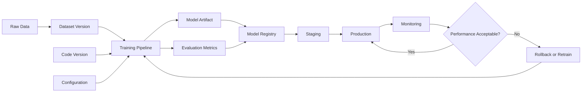
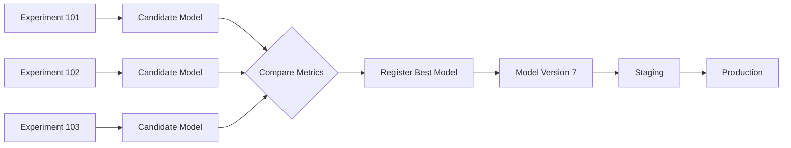
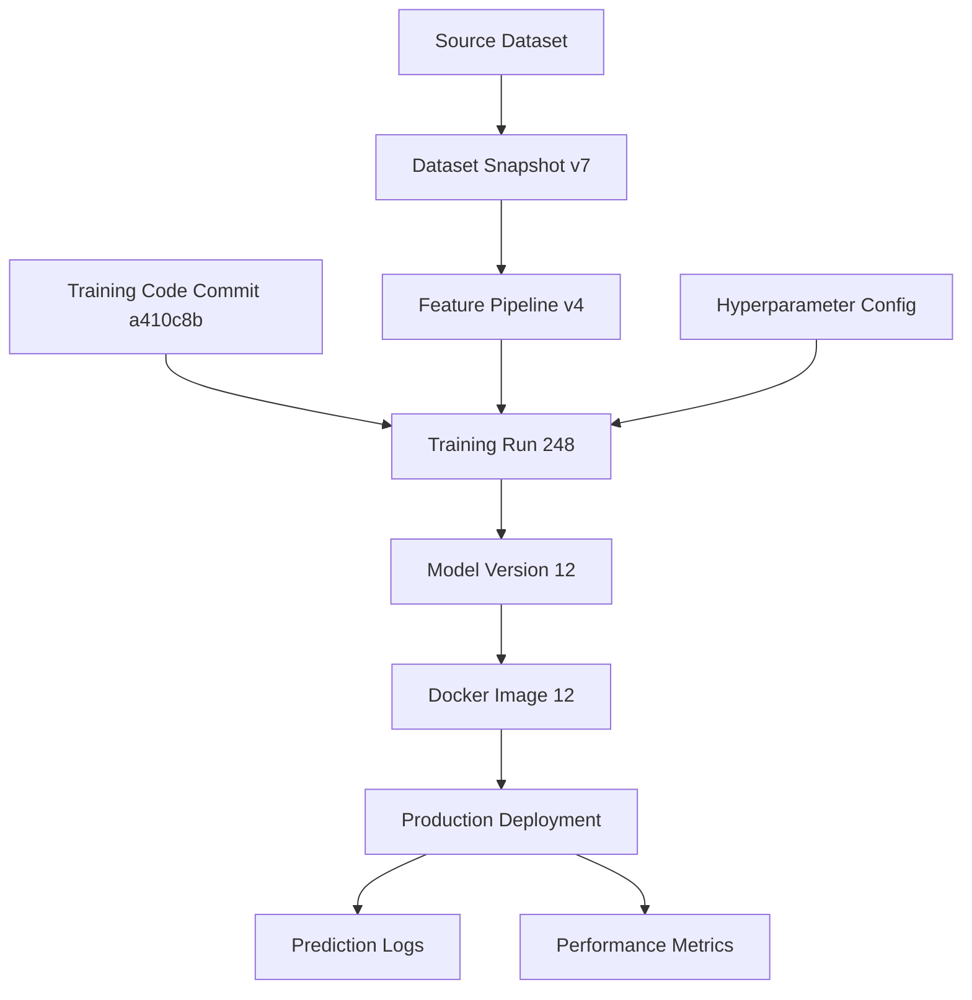
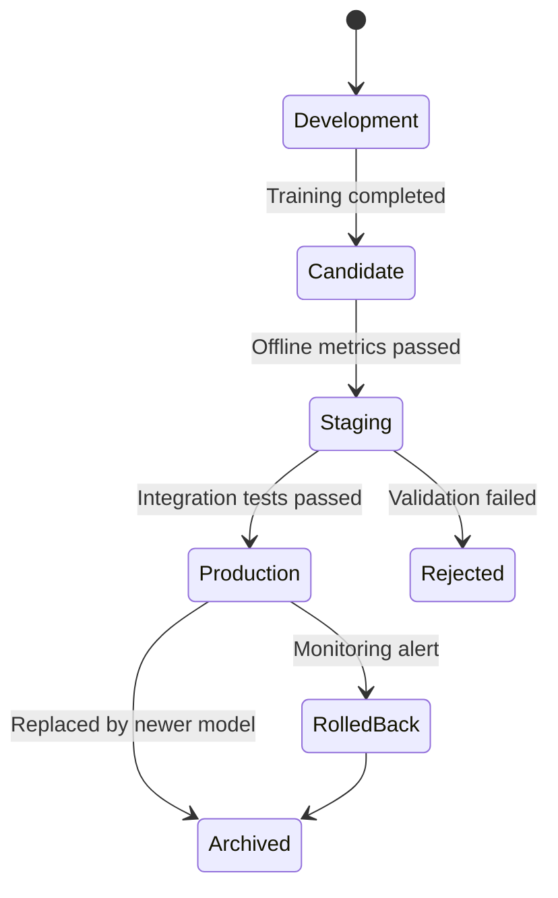
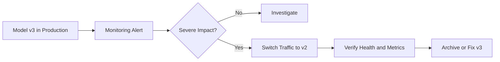
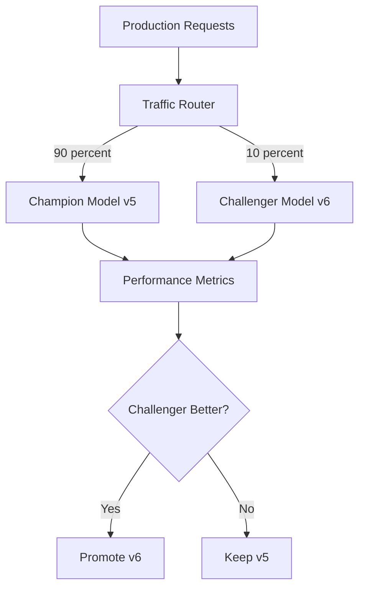
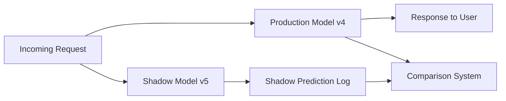
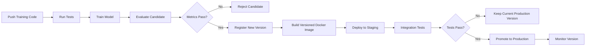

# 024 — Model Versioning

| Item                   | Details                           |
| ---------------------- | --------------------------------- |
| **Course**             | 04 — MLOps and Deployment         |
| **Module**             | Module 08 — MLOps                 |
| **Content Group**      | Monitoring and Versioning         |
| **Roadmap Source**     | MLOps / Monitoring and Versioning |
| **Lesson Type**        | MLOps                             |
| **Lesson Order**       | 024                               |
| **Suggested Duration** | 22 minutes                        |

---

## 1. Overview

**Model versioning** is the practice of assigning a unique identity to every important version of a machine learning model.

A model version should represent more than a single serialized file such as `model.pkl`. It should also connect the model to:

* the training code,
* the dataset or dataset snapshot,
* the feature-processing logic,
* the hyperparameters,
* the evaluation metrics,
* the runtime environment,
* and the deployment configuration.

Without model versioning, it becomes difficult to answer important production questions:

* Which model is currently serving predictions?
* Which dataset was used to train it?
* What metrics did it achieve before deployment?
* Which code commit produced it?
* Why did prediction quality change?
* Can we restore the previous model quickly?
* Can the same model be reproduced on another machine?

Model versioning transforms machine learning development from an informal notebook workflow into a reproducible and auditable engineering process.

---

## 2. Learning Objectives

After completing this lesson, you should be able to:

* Explain model versioning in your own words.
* Distinguish model versioning from code versioning.
* Identify the artifacts that belong to a model version.
* Understand where model versioning fits into the ML lifecycle.
* Create a basic model versioning strategy for a small project.
* Connect a model version to its dataset, code, metrics, and deployment.
* Explain how versioning supports rollback, monitoring, and reproducibility.
* Build a small portfolio artifact that demonstrates model version management.

---

## 3. What Is Model Versioning?

Model versioning means saving and tracking different model releases so that each model can be uniquely identified, evaluated, deployed, compared, and restored.

A model version may use a simple identifier such as:

```text
fraud-detection-model:v1
fraud-detection-model:v2
fraud-detection-model:v3
```

A more detailed naming convention may include the model name, version, training date, and environment:

```text
fraud-detector-2.1.0-2026-07-13-production
```

Each version should be immutable after registration. If a model changes, a new version should be created instead of replacing the existing one.

```text
Wrong:

model_v2.pkl
    |
    +-- file overwritten with a new model

Correct:

model_v1.pkl
model_v2.pkl
model_v3.pkl
```

The goal is not merely to keep old model files. The goal is to preserve the full context required to understand and reproduce each model.

---

## 4. Why Model Versioning Matters

Machine learning systems change frequently.

A new version may be created because of:

* new training data,
* corrected labels,
* updated feature engineering,
* different algorithms,
* new hyperparameters,
* dependency upgrades,
* bug fixes,
* fairness improvements,
* latency optimization,
* or drift-related retraining.

Without versioning, these changes become difficult to trace.

### Example

Suppose model `v3` performs worse than model `v2` after deployment.

Without model versioning, the team may not know:

* what changed between `v2` and `v3`,
* which training data was used,
* whether the preprocessing logic changed,
* or how to restore the previous model.

With model versioning, the comparison is explicit:

| Property            |     Version 2 |  Version 3 |
| ------------------- | ------------: | ---------: |
| Algorithm           | Random Forest |    XGBoost |
| Dataset version     |     `data_v5` |  `data_v6` |
| Code commit         |     `9d2a13f` |  `a410c8b` |
| Accuracy            |          0.91 |       0.93 |
| Production accuracy |          0.89 |       0.82 |
| Average latency     |         35 ms |      48 ms |
| Status              |      Archived | Production |

The team can then investigate the exact differences and roll back safely.

---

## 5. Model Versioning in the ML Lifecycle

Model versioning connects experimentation, deployment, monitoring, and retraining.



A typical process is:

1. Version the training data.
2. Version the source code.
3. run a training experiment.
4. Save the trained model artifact.
5. Record metrics and parameters.
6. Register the model as a new version.
7. Validate the version in staging.
8. Promote the approved version to production.
9. Monitor its behavior.
10. Roll back or retrain when necessary.

---

## 6. What Belongs to a Model Version?

A production-ready model version should include enough metadata to reconstruct its history.

### 6.1 Model artifact

The model artifact is the saved output of the training process.

Examples:

```text
model.pkl
model.joblib
model.onnx
model.pt
model.keras
model.xgb
```

### 6.2 Model identifier

Each version needs a unique identity.

```text
model_name: customer-churn
model_version: 1.3.0
```

### 6.3 Code version

The model should be linked to the exact Git commit used for training.

```text
git_commit: 7f93a21
```

### 6.4 Dataset version

The model should identify the data used during training.

```text
dataset_version: churn_dataset_2026_07
```

### 6.5 Feature schema

The required input features and their types should be recorded.

```json
{
  "age": "integer",
  "monthly_spend": "float",
  "contract_type": "string",
  "support_tickets": "integer"
}
```

### 6.6 Hyperparameters

Training configuration should be stored.

```json
{
  "n_estimators": 300,
  "max_depth": 8,
  "learning_rate": 0.05,
  "random_state": 42
}
```

### 6.7 Evaluation metrics

Metrics provide evidence for whether a model should be promoted.

```json
{
  "accuracy": 0.91,
  "precision": 0.88,
  "recall": 0.84,
  "f1_score": 0.86,
  "roc_auc": 0.94
}
```

### 6.8 Dependency versions

The environment affects reproducibility.

```text
python==3.12
scikit-learn==1.7.0
pandas==2.3.0
numpy==2.2.6
```

### 6.9 Deployment information

A model version should also identify where and how it was deployed.

```text
environment: production
endpoint: /predict
docker_image: churn-api:1.3.0
deployed_at: 2026-07-13T10:00:00Z
```

---

## 7. Code Versioning vs. Model Versioning

Code versioning and model versioning are related, but they are not the same.

| Code Versioning                                  | Model Versioning                                        |
| ------------------------------------------------ | ------------------------------------------------------- |
| Tracks source code changes                       | Tracks trained model releases                           |
| Usually managed with Git                         | Usually managed with a model registry or artifact store |
| Records branches, commits, and tags              | Records model files, metrics, parameters, and stages    |
| Answers “Which code changed?”                    | Answers “Which trained model is deployed?”              |
| Does not automatically store large binary models | Designed to manage model artifacts and metadata         |

Git alone is usually insufficient for model versioning because trained model files can be large and may change frequently.

A complete system often combines several tools:

```text
Git                  -> code version
DVC or data storage  -> dataset version
MLflow or registry   -> experiment and model version
Docker registry      -> serving image version
CI/CD system         -> deployment history
Monitoring system    -> production performance
```

---

## 8. Model Versioning vs. Experiment Tracking

Experiment tracking and model versioning are closely connected.

### Experiment tracking

Experiment tracking records the training process:

* parameters,
* metrics,
* datasets,
* notes,
* logs,
* and output artifacts.

### Model versioning

Model versioning manages selected model artifacts as formal releases.



Not every experiment becomes a registered model version.

For example:

```text
100 experiments
       |
       v
5 strong candidates
       |
       v
1 registered model version
       |
       v
1 production deployment
```

---

## 9. Model Registry

A **model registry** is a centralized system for storing and managing model versions.

It typically records:

* model name,
* model version,
* model artifact location,
* training metadata,
* performance metrics,
* approval status,
* deployment stage,
* deployment history,
* and ownership information.

### Common model stages

```text
Development
    |
    v
Candidate
    |
    v
Staging
    |
    v
Production
    |
    v
Archived
```

Different platforms may use different names, but the concept is similar.

### Example registry table

| Model            | Version | F1 Score | Stage      | Created At |
| ---------------- | ------: | -------: | ---------- | ---------- |
| Churn Classifier |       1 |     0.81 | Archived   | 2026-05-10 |
| Churn Classifier |       2 |     0.85 | Archived   | 2026-06-02 |
| Churn Classifier |       3 |     0.87 | Production | 2026-07-01 |
| Churn Classifier |       4 |     0.89 | Staging    | 2026-07-12 |

---

## 10. Version Naming Strategies

A good naming strategy should be consistent and understandable.

### 10.1 Sequential versions

```text
v1
v2
v3
v4
```

This is simple but provides little information.

### 10.2 Date-based versions

```text
2026-07-01
2026-07-13
```

This is useful for scheduled retraining pipelines.

### 10.3 Semantic versioning

Semantic versioning uses:

```text
MAJOR.MINOR.PATCH
```

Example:

```text
2.4.1
```

A possible ML interpretation is:

* **MAJOR**: incompatible input schema or major algorithm change.
* **MINOR**: meaningful model improvement with compatible inputs.
* **PATCH**: minor fix, metadata update, or retraining with similar behavior.

Example:

```text
1.0.0 -> first production model
1.1.0 -> improved model using additional training data
1.1.1 -> corrected preprocessing bug
2.0.0 -> new feature schema requiring API changes
```

### 10.4 Composite version

A composite name can include multiple identifiers:

```text
churn-xgb-2.1.0-data-v7-a410c8b
```

This includes:

* model name,
* algorithm,
* semantic version,
* dataset version,
* and Git commit.

---

## 11. Model Lineage

**Model lineage** describes the complete chain of dependencies that produced a model.



Lineage helps answer questions such as:

* Which data generated this model?
* Which code commit created it?
* Which feature pipeline was used?
* Which deployment currently uses it?
* Which predictions were produced by it?

---

## 12. Basic File-Based Versioning Example

For a small portfolio project, model versions can be stored in directories.

```text
project/
├── app/
│   └── main.py
├── models/
│   ├── v1/
│   │   ├── model.joblib
│   │   ├── metadata.json
│   │   └── metrics.json
│   ├── v2/
│   │   ├── model.joblib
│   │   ├── metadata.json
│   │   └── metrics.json
│   └── production.json
├── src/
│   ├── train.py
│   └── preprocess.py
├── tests/
├── Dockerfile
├── requirements.txt
└── README.md
```

The file `production.json` may point to the current production version:

```json
{
  "model_name": "churn-classifier",
  "production_version": "v2"
}
```

The API can read this configuration when loading the model.

---

## 13. Practical Python Example

### 13.1 Training and saving a versioned model

```python
from __future__ import annotations

import json
from datetime import datetime, timezone
from pathlib import Path

import joblib
from sklearn.datasets import load_iris
from sklearn.ensemble import RandomForestClassifier
from sklearn.metrics import accuracy_score
from sklearn.model_selection import train_test_split


MODEL_NAME = "iris-classifier"
MODEL_VERSION = "1.0.0"
OUTPUT_DIR = Path("models") / MODEL_NAME / MODEL_VERSION


def train_model() -> None:
    data = load_iris(as_frame=True)

    X_train, X_test, y_train, y_test = train_test_split(
        data.data,
        data.target,
        test_size=0.2,
        random_state=42,
        stratify=data.target,
    )

    model = RandomForestClassifier(
        n_estimators=200,
        max_depth=6,
        random_state=42,
    )

    model.fit(X_train, y_train)

    predictions = model.predict(X_test)
    accuracy = accuracy_score(y_test, predictions)

    OUTPUT_DIR.mkdir(parents=True, exist_ok=True)

    joblib.dump(model, OUTPUT_DIR / "model.joblib")

    metadata = {
        "model_name": MODEL_NAME,
        "model_version": MODEL_VERSION,
        "algorithm": "RandomForestClassifier",
        "created_at": datetime.now(timezone.utc).isoformat(),
        "dataset": "scikit-learn iris",
        "dataset_version": "builtin-v1",
        "features": list(data.feature_names),
        "target_names": list(data.target_names),
        "parameters": model.get_params(),
        "metrics": {
            "accuracy": accuracy
        },
    }

    with open(OUTPUT_DIR / "metadata.json", "w", encoding="utf-8") as file:
        json.dump(metadata, file, indent=2)

    print(f"Saved model version: {MODEL_VERSION}")
    print(f"Accuracy: {accuracy:.4f}")


if __name__ == "__main__":
    train_model()
```

After execution:

```text
models/
└── iris-classifier/
    └── 1.0.0/
        ├── model.joblib
        └── metadata.json
```

---

## 14. Loading a Specific Model Version

```python
from pathlib import Path

import joblib


def load_model(
    model_name: str,
    model_version: str,
):
    model_path = (
        Path("models")
        / model_name
        / model_version
        / "model.joblib"
    )

    if not model_path.exists():
        raise FileNotFoundError(
            f"Model version not found: {model_path}"
        )

    return joblib.load(model_path)


model = load_model(
    model_name="iris-classifier",
    model_version="1.0.0",
)
```

This is safer than loading a generic file such as:

```python
joblib.load("model.joblib")
```

because the requested model version is explicit.

---

## 15. FastAPI Model Version Example

A prediction API should expose the model version being used.

```python
from pathlib import Path

import joblib
import pandas as pd
from fastapi import FastAPI
from pydantic import BaseModel, Field


MODEL_NAME = "iris-classifier"
MODEL_VERSION = "1.0.0"

MODEL_PATH = (
    Path("models")
    / MODEL_NAME
    / MODEL_VERSION
    / "model.joblib"
)

model = joblib.load(MODEL_PATH)

app = FastAPI(
    title="Versioned Iris Model API",
    version=MODEL_VERSION,
)


class PredictionRequest(BaseModel):
    sepal_length: float = Field(gt=0)
    sepal_width: float = Field(gt=0)
    petal_length: float = Field(gt=0)
    petal_width: float = Field(gt=0)


@app.get("/health")
def health() -> dict:
    return {
        "status": "healthy",
        "model_name": MODEL_NAME,
        "model_version": MODEL_VERSION,
    }


@app.post("/predict")
def predict(payload: PredictionRequest) -> dict:
    input_frame = pd.DataFrame(
        [
            {
                "sepal length (cm)": payload.sepal_length,
                "sepal width (cm)": payload.sepal_width,
                "petal length (cm)": payload.petal_length,
                "petal width (cm)": payload.petal_width,
            }
        ]
    )

    prediction = int(model.predict(input_frame)[0])
    probabilities = model.predict_proba(input_frame)[0].tolist()

    return {
        "prediction": prediction,
        "probabilities": probabilities,
        "model_name": MODEL_NAME,
        "model_version": MODEL_VERSION,
    }
```

### Sample request

```bash
curl -X POST "http://localhost:8000/predict" \
  -H "Content-Type: application/json" \
  -d '{
    "sepal_length": 5.1,
    "sepal_width": 3.5,
    "petal_length": 1.4,
    "petal_width": 0.2
  }'
```

### Sample response

```json
{
  "prediction": 0,
  "probabilities": [
    0.99,
    0.01,
    0.0
  ],
  "model_name": "iris-classifier",
  "model_version": "1.0.0"
}
```

Returning the version in every prediction response makes debugging and auditing easier.

---

## 16. Versioning the Docker Image

The Docker image should be versioned together with the model.

```dockerfile
FROM python:3.12-slim

WORKDIR /app

COPY requirements.txt .
RUN pip install --no-cache-dir -r requirements.txt

COPY app/ ./app/
COPY models/iris-classifier/1.0.0/ \
     ./models/iris-classifier/1.0.0/

ENV MODEL_NAME=iris-classifier
ENV MODEL_VERSION=1.0.0

CMD [
  "uvicorn",
  "app.main:app",
  "--host",
  "0.0.0.0",
  "--port",
  "8000"
]
```

Build the image with a version tag:

```bash
docker build -t iris-model-api:1.0.0 .
```

Run it:

```bash
docker run --rm -p 8000:8000 iris-model-api:1.0.0
```

A production container should not use only the `latest` tag because `latest` does not clearly identify the deployed version.

```text
Avoid:

iris-model-api:latest

Prefer:

iris-model-api:1.0.0
iris-model-api:1.1.0
iris-model-api:2.0.0
```

---

## 17. Promotion Workflow

A model should not move directly from training to production without validation.



### Example promotion requirements

A model may be promoted only when:

```text
F1 score >= 0.85
Recall >= 0.80
Average latency <= 100 ms
No schema compatibility errors
All integration tests pass
No major fairness regression
```

These requirements can be automated in a CI/CD pipeline.

---

## 18. Version Comparison

Before promoting a new model, compare it against the current production model.

| Metric     | Production `v2` | Candidate `v3` | Decision  |
| ---------- | --------------: | -------------: | --------- |
| Accuracy   |            0.90 |           0.92 | Improved  |
| Precision  |            0.88 |           0.90 | Improved  |
| Recall     |            0.86 |           0.84 | Regressed |
| F1 Score   |            0.87 |           0.87 | Unchanged |
| Latency    |           42 ms |          71 ms | Worse     |
| Model size |           45 MB |         120 MB | Worse     |

The candidate should not automatically be promoted just because one metric improved.

The decision should consider:

* business requirements,
* error costs,
* latency,
* infrastructure cost,
* fairness,
* stability,
* and operational complexity.

---

## 19. Rollback

Rollback means restoring a previously approved model version when the current model causes problems.



A rollback process should be:

* fast,
* automated when possible,
* tested before an incident,
* and independent of model retraining.

### Example

```bash
export MODEL_VERSION=1.2.0
docker compose up -d --force-recreate
```

In a registry-based system, rollback may be performed by changing the production alias:

```text
production -> model version 8
```

instead of:

```text
production -> model version 9
```

---

## 20. Model Aliases

Aliases provide human-readable references to model versions.

```text
candidate   -> version 10
staging     -> version 10
production  -> version 9
champion    -> version 9
challenger  -> version 10
```

The application can load the model using the alias rather than a hardcoded version number.

```python
model = registry.load_model(
    name="fraud-detector",
    alias="production",
)
```

When a new version is promoted, the alias changes:

```text
Before:

production -> version 9

After:

production -> version 10
```

The model files remain immutable.

---

## 21. Champion–Challenger Strategy

The **champion** is the currently approved production model.

The **challenger** is a new candidate being evaluated against it.



This strategy allows the team to test a new version with real traffic before full promotion.

---

## 22. Shadow Deployment

In shadow deployment, the production model returns the actual response, while a candidate model receives the same input silently.



The user receives only the production model’s prediction.

The candidate model can be evaluated without affecting users.

---

## 23. Logging Model Versions

Every prediction log should include the model version.

```json
{
  "timestamp": "2026-07-13T10:30:00Z",
  "request_id": "req-7d32e",
  "model_name": "churn-classifier",
  "model_version": "1.3.0",
  "prediction": 1,
  "prediction_probability": 0.87,
  "latency_ms": 43
}
```

This enables questions such as:

* Which version created this prediction?
* Did errors begin after a deployment?
* Which model version experienced data drift?
* Which users were affected by a faulty release?

---

## 24. Monitoring by Model Version

Production metrics should be grouped by model version.

```text
prediction_count{model_version="1.2.0"}
prediction_count{model_version="1.3.0"}

prediction_latency_ms{model_version="1.2.0"}
prediction_latency_ms{model_version="1.3.0"}

prediction_error_count{model_version="1.2.0"}
prediction_error_count{model_version="1.3.0"}
```

A monitoring dashboard may compare:

| Metric                   | Version 1.2.0 | Version 1.3.0 |
| ------------------------ | ------------: | ------------: |
| Requests                 |       120,000 |        15,000 |
| Error rate               |          0.2% |          1.8% |
| P95 latency              |         80 ms |        145 ms |
| Positive prediction rate |           31% |           44% |
| Drift score              |          0.08 |          0.21 |

Version-aware monitoring makes deployment regressions easier to detect.

---

## 25. Minimal Metadata Schema

A small model registry can store metadata in JSON.

```json
{
  "model_name": "customer-churn",
  "model_version": "2.1.0",
  "status": "staging",
  "artifact_uri": "models/customer-churn/2.1.0/model.joblib",
  "training_run_id": "run-20260713-001",
  "git_commit": "a410c8b",
  "dataset_version": "churn-data-v7",
  "feature_pipeline_version": "features-v4",
  "created_at": "2026-07-13T08:30:00Z",
  "created_by": "ml-training-pipeline",
  "metrics": {
    "accuracy": 0.91,
    "precision": 0.89,
    "recall": 0.86,
    "f1_score": 0.87,
    "roc_auc": 0.94
  },
  "runtime": {
    "python": "3.12",
    "scikit_learn": "1.7.0"
  }
}
```

---

## 26. CI/CD Integration

Model versioning should be connected to the deployment pipeline.



The model version can be generated automatically from a release tag:

```bash
git tag model-v1.3.0
git push origin model-v1.3.0
```

The CI pipeline can then:

1. Extract version `1.3.0`.
2. Train or package the model.
3. Register model version `1.3.0`.
4. Build Docker image `model-api:1.3.0`.
5. Deploy the same version to staging.
6. Promote it after validation.

---

## 27. Common Tools

### Git

Used for:

* training code,
* preprocessing code,
* configuration,
* tests,
* API code,
* and deployment files.

### DVC

Used for:

* dataset versioning,
* large artifact tracking,
* and reproducible data pipelines.

### MLflow

Used for:

* experiment tracking,
* metric logging,
* artifact storage,
* and model registration.

### Weights & Biases

Used for:

* experiment tracking,
* visualization,
* artifact lineage,
* and model management.

### Cloud model registries

Examples include managed registries provided by cloud ML platforms.

They commonly support:

* version registration,
* approval workflows,
* deployment integration,
* access control,
* and audit history.

### Docker registry

Used to store versioned model-serving images.

```text
registry.example.com/churn-api:1.2.0
registry.example.com/churn-api:1.3.0
```

---

## 28. Practical Exercise

Build a small versioned ML model service.

### Task 1: Train two model versions

Create:

```text
models/iris-classifier/1.0.0/
models/iris-classifier/1.1.0/
```

Use different hyperparameters for each version.

For example:

```python
# Version 1.0.0
RandomForestClassifier(
    n_estimators=100,
    max_depth=4,
    random_state=42,
)

# Version 1.1.0
RandomForestClassifier(
    n_estimators=300,
    max_depth=8,
    random_state=42,
)
```

### Task 2: Save metadata

For each version, save:

* model name,
* version,
* parameters,
* training date,
* dataset version,
* feature names,
* and evaluation metrics.

### Task 3: Compare models

Create a comparison table:

| Metric             | Version 1.0.0 | Version 1.1.0 |
| ------------------ | ------------: | ------------: |
| Accuracy           |               |               |
| F1 Score           |               |               |
| Training time      |               |               |
| Model size         |               |               |
| Prediction latency |               |               |

### Task 4: Select a production version

Create:

```json
{
  "production_version": "1.1.0"
}
```

### Task 5: Build a FastAPI service

Create:

```text
GET /health
POST /predict
GET /model-info
```

The `/model-info` endpoint should return:

```json
{
  "model_name": "iris-classifier",
  "model_version": "1.1.0",
  "status": "production"
}
```

### Task 6: Package the service

Add:

* `Dockerfile`,
* `requirements.txt`,
* `.dockerignore`,
* and `README.md`.

### Task 7: Document rollback

Explain how to change the production version from `1.1.0` back to `1.0.0`.

---

## 29. Suggested Project Structure

```text
model-versioning-demo/
├── app/
│   ├── __init__.py
│   └── main.py
├── config/
│   └── production.json
├── data/
│   └── README.md
├── models/
│   └── iris-classifier/
│       ├── 1.0.0/
│       │   ├── model.joblib
│       │   └── metadata.json
│       └── 1.1.0/
│           ├── model.joblib
│           └── metadata.json
├── src/
│   ├── compare_models.py
│   └── train.py
├── tests/
│   ├── test_api.py
│   └── test_model.py
├── .dockerignore
├── Dockerfile
├── README.md
└── requirements.txt
```

---

## 30. Common Mistakes

### 30.1 Overwriting the same model file

```text
model.pkl
```

Every training run replaces the previous model.

**Better approach:**

```text
models/model-name/1.0.0/model.pkl
models/model-name/1.1.0/model.pkl
```

---

### 30.2 Versioning only the model file

A model file without metadata is difficult to understand.

Always link it to:

* code,
* data,
* features,
* parameters,
* metrics,
* and dependencies.

---

### 30.3 Using only the `latest` tag

```text
model-api:latest
```

This does not identify the actual deployed version.

Use an immutable tag:

```text
model-api:1.3.0
```

---

### 30.4 Modifying an existing registered version

A registered version should be immutable.

Create a new version when the model changes.

---

### 30.5 No rollback strategy

A deployment process is incomplete if it can promote a model but cannot restore the previous version.

---

### 30.6 Training and serving use different preprocessing

The training model may use one feature pipeline while the API uses another.

Version the preprocessing logic together with the model.

---

### 30.7 Missing model version in logs

Without a model version in prediction logs, incidents are difficult to investigate.

---

### 30.8 Choosing a version based only on accuracy

A production model must also satisfy:

* latency requirements,
* memory limits,
* fairness constraints,
* stability requirements,
* explainability requirements,
* and business objectives.

---

### 30.9 No input-schema versioning

A new model may require different inputs but still be deployed behind the same API.

Breaking schema changes should trigger a major version update or a new API endpoint.

---

### 30.10 Storing secrets in model metadata

Model metadata should not contain:

* API keys,
* database passwords,
* private tokens,
* or sensitive user data.

---

## 31. Production Checklist

Before registering a model version:

* [ ] The model has a unique version identifier.
* [ ] The model artifact is stored safely.
* [ ] The Git commit is recorded.
* [ ] The dataset version is recorded.
* [ ] The feature schema is documented.
* [ ] Hyperparameters are stored.
* [ ] Evaluation metrics are stored.
* [ ] Dependency versions are recorded.
* [ ] The model can be loaded successfully.
* [ ] The model has passed offline evaluation.

Before promoting it to production:

* [ ] API compatibility tests pass.
* [ ] Data validation tests pass.
* [ ] Latency is within the required threshold.
* [ ] Model size is acceptable.
* [ ] Fairness checks are complete when applicable.
* [ ] The Docker image has an immutable version tag.
* [ ] Monitoring includes the model version.
* [ ] Prediction logs include the model version.
* [ ] A rollback procedure exists.
* [ ] The previous production model is still available.

---

## 32. Completion Checklist

* [ ] I can explain model versioning in one or two minutes.
* [ ] I understand the difference between code versioning and model versioning.
* [ ] I can identify the artifacts associated with a model version.
* [ ] I can explain how model versioning supports reproducibility.
* [ ] I can connect a model version to its code, data, metrics, and dependencies.
* [ ] I can save multiple model versions without overwriting earlier ones.
* [ ] I can expose the model version through an API.
* [ ] I can include the model version in prediction logs.
* [ ] I understand staging, production, and archived model states.
* [ ] I can describe a rollback strategy.
* [ ] I have created a notebook, script, API, model registry entry, or portfolio note for this lesson.
* [ ] I have documented at least one assumption, limitation, or unanswered question.

---

## 33. Related Outcome

After completing this topic, you should be better prepared to:

> Deploy, version, monitor, and operate machine learning models using APIs, Docker, CI/CD pipelines, model registries, and drift-aware workflows.

Model versioning connects directly to:

* experiment tracking,
* data versioning,
* model registries,
* Docker image versioning,
* CI/CD for machine learning,
* model monitoring,
* prediction logging,
* data drift detection,
* performance decay,
* and rollback strategies.

---

## 34. Related Mini Project

### Deploy a Versioned ML Model API

Build a small machine learning service containing:

* a FastAPI `/predict` endpoint,
* a `/health` endpoint,
* a `/model-info` endpoint,
* at least two model versions,
* metadata for each model,
* a production version configuration,
* a versioned Docker image,
* prediction logs containing the model version,
* automated tests,
* and a README explaining deployment and rollback.

### Suggested portfolio evidence

Your repository should include:

```text
README.md
Dockerfile
requirements.txt
training script
versioned model directories
model metadata
FastAPI application
API request examples
test files
model comparison table
rollback instructions
```

---

## 35. Key Takeaways

1. Model versioning assigns a unique identity to every important trained model release.
2. A model version includes more than the model file; it also includes data, code, parameters, metrics, dependencies, and schema information.
3. Code versioning and model versioning solve different problems and should be used together.
4. Registered model versions should be immutable.
5. A model registry manages versions, stages, aliases, and deployment history.
6. Model versions should appear in APIs, logs, metrics, Docker tags, and deployment records.
7. Versioning enables reproducibility, comparison, auditing, monitoring, and rollback.
8. A model should be promoted only after passing technical and business validation.
9. Production monitoring should always distinguish between model versions.
10. A strong MLOps portfolio demonstrates not only model training, but also versioning, deployment, monitoring, and recovery.

---

## 36. Summary

**Model versioning** is a foundational MLOps practice for tracking, comparing, deploying, and restoring machine learning models.

It creates a traceable connection between:

```text
training data
    +
training code
    +
feature pipeline
    +
hyperparameters
    +
evaluation metrics
    +
model artifact
    +
runtime environment
    +
deployment
```

The complete operational workflow is:

```text
versioned data
    -> versioned code
    -> tracked experiment
    -> registered model version
    -> versioned Docker image
    -> staging validation
    -> production deployment
    -> monitoring
    -> rollback or retraining
```

Do not leave the model as an unnamed file inside a notebook. Turn it into a reproducible, identifiable, testable, deployable, and monitorable software artifact.
