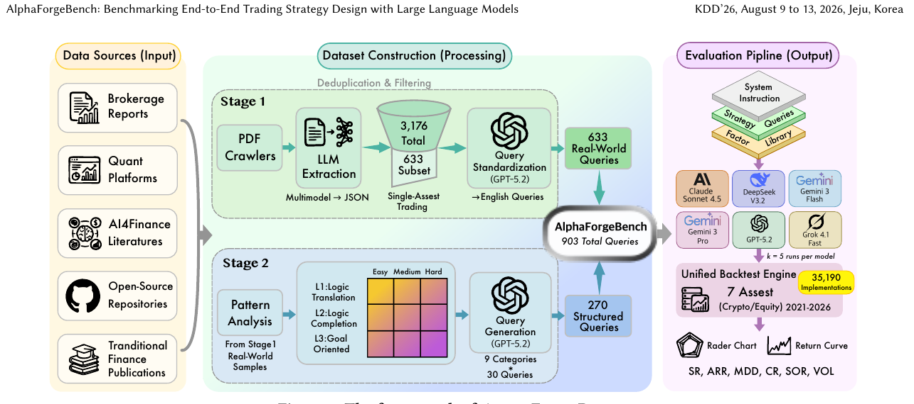

# Bài 03 - Kiến trúc tổng thể của AlphaForgeBench

**Loại:** Lesson  
**Nguồn chính:** PDF trang 3-4

## 1. Ba khối của hệ thống

Figure 1 tổ chức framework thành ba vùng lớn:

1. **Data Sources (Input)** - nguồn chiến lược và factor.
2. **Dataset Construction (Processing)** - thu thập, trích xuất, chuẩn hóa, tạo structured query.
3. **Evaluation Pipeline (Output)** - prompt LLM, sinh code, backtest và tổng hợp metric.

## 2. Nguồn dữ liệu đầu vào

Stage 1 lấy dữ liệu từ năm nhóm:

- brokerage reports;
- quantitative investment platforms;
- AI-for-finance literature;
- open-source repositories;
- traditional finance publications.

## 3. Hai nhánh xây dựng query

### 3.1 Real-world query

Nguồn thực -> crawl/extract -> chuẩn hóa -> tập 633 single-asset queries dùng đánh giá.

### 3.2 Structured query

Pattern từ dữ liệu thật -> taxonomy mức năng lực và độ khó -> sinh 270 structured queries.

## 4. Hợp nhất thành benchmark

633 real-world queries + 270 structured queries = **903 total queries**.

## 5. Evaluation pipeline

Mỗi query được ghép với system instruction và factor library, sau đó gửi tới một trong các LLM được đánh giá. Mô hình sinh code chiến lược; code chạy qua unified backtest engine; cuối cùng benchmark thu thập các metric như SR, ARR, MDD, CR, SoR và VOL.

## 6. Vì sao kiến trúc này quan trọng?

Framework cố tách hai nguồn bất định:

- **bất định do sinh nội dung của LLM**;
- **bất định do engine thực thi**.

AlphaForgeBench cố giữ phần engine xác định để khi kết quả thay đổi giữa các lần chạy, thay đổi đó phản ánh nhiều hơn stochasticity của phần generation thay vì sự ngẫu nhiên của execution.
