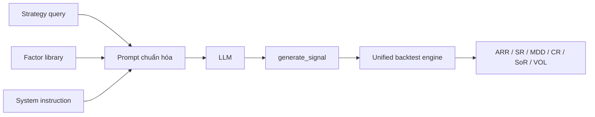

# Bài 05 - Pipeline sinh code và backtest xác định

**Loại:** Lesson  
**Nguồn chính:** PDF trang 4

## 1. Tổng quan generate-and-backtest

Với mỗi query, AlphaForgeBench đi qua ba bước:

1. Prompt construction.
2. Code generation.
3. Backtest-based assessment.

## 2. Bước 1 - Prompt construction

Prompt chuẩn hóa gồm ba phần:

- **System instruction:** mô tả task, schema dữ liệu và interface đầu ra.
- **Strategy query:** mô tả ngôn ngữ tự nhiên của chiến lược mục tiêu.
- **Factor-library reference:** tên indicator hỗ trợ kèm định nghĩa toán học.

Dữ liệu mặc định gồm OHLCV cùng các technical-indicator factors được tính trước. Bài báo cho phép model tự sinh factor-computation code khi cần factor mới.

Điểm quan trọng là prompt template được giữ giống nhau giữa các model để giảm tác động của model-specific prompt tuning.

## 3. Bước 2 - Code generation

LLM phải trả về một hàm Python tự chứa có tên `generate_signal`. Hàm nhận dataframe chứa OHLCV và factor, rồi tạo ra trading-signal series cho backtest engine.

Mã giả minh họa cách hiểu interface:

```python
# Mã giả biên soạn để minh họa, không phải code nguyên văn từ bài báo.
def generate_signal(df):
    # đọc OHLCV / factor
    # áp dụng logic chiến lược
    # trả về chuỗi tín hiệu invest/cash phù hợp interface của engine
    ...
```

Benchmark kiểm tra nghiêm interface contract để code có thể chạy tự động mà không cần sửa tay.

## 4. Bước 3 - Backtest-based assessment

Mỗi implementation được thực thi trong unified deterministic backtest engine trên bảy tài sản ở hai nhóm thị trường: cryptocurrency và US equity.

Engine sinh ra các metric về:

- return generation;
- risk exposure;
- risk-adjusted efficiency.

## 5. Tại sao "deterministic downstream execution" là cốt lõi?

Nếu hai lần LLM sinh ra cùng logic thì engine phải cho cùng kết quả. Nhờ vậy cross-run variance được quy về khác biệt trong generation thay vì random execution.

## 6. Một cách nhìn hệ thống



Sơ đồ trên là bản diễn giải lại từ Figure 1 để phục vụ học tập.
