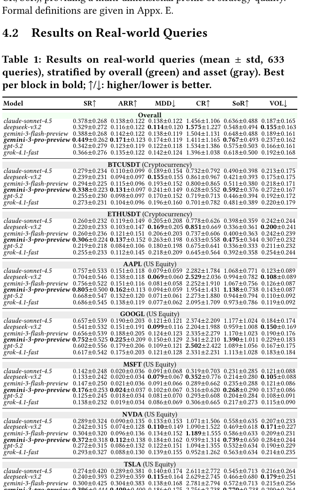

# Bài 07 - Kết quả Stage 1: Real-world queries

**Loại:** Lesson  
**Nguồn chính:** PDF trang 5-6

## 1. Bức tranh tổng thể

Table 1 cho thấy một hierarchy rõ ở nhóm metric thiên về return. Theo phần phân tích của bài báo:

- `gemini-3-pro-preview` dẫn đầu về Sharpe và ARR;
- `gemini-3-flash-preview` và `claude-sonnet-4.5` tạo thành nhóm giữa mạnh;
- các model còn lại thấp hơn về return-oriented metrics.

Khoảng ARR giữa model tốt nhất và kém nhất là **5,5 điểm phần trăm**, tương ứng khoảng **47% cải thiện tương đối** theo cách tính của bài báo.

## 2. Return-risk inversion

Model sinh return cao nhất cũng có MDD và VOL cao hơn. Ngược lại, `deepseek-v3.2` tạo chiến lược bảo thủ hơn với MDD/VOL thấp và Calmar Ratio tốt.

Kết luận quan trọng: **không thể dùng một metric duy nhất để xếp hạng toàn diện**.

## 3. Độ tin cậy của khoảng cách giữa model

Bài báo cho biết độ lệch chuẩn intra-query qua 5 lần chạy thường nhỏ hơn khoảng một bậc độ lớn so với inter-query standard deviation. Điều này được dùng làm bằng chứng rằng khác biệt ranking chủ yếu phản ánh khác biệt năng lực hơn là noise do generation.

## 4. Phân tích theo tài sản

### 4.1 Gradient độ khó

Trong Stage 1:

- AAPL và GOOGL dễ hơn với mọi model;
- BTCUSDT và ETHUSDT nằm ở nhóm trung gian với volatility và drawdown cao hơn;
- MSFT được mô tả là khó nhất trong giai đoạn đánh giá;
- TSLA có return tuyệt đối cao và độ phân tán giữa model rộng.

### 4.2 Ranking ổn định qua asset class

Bài báo nhận thấy thứ tự tương đối của nhóm model thiên về return và nhóm thiên về risk-control được duy trì qua crypto và US equity.

## 5. Bốn kết luận của Stage 1

1. **High code-generation reliability:** cả sáu model có backtest pass rate > 96%.
2. **Stable and reproducible evaluation:** run-to-run variance thấp hơn rõ rệt inter-query variance.
3. **Implicit risk preferences:** mỗi model thể hiện profile risk-return tương đối ổn định.
4. **Cross-asset robustness:** hierarchy và asset difficulty gradient có tính nhất quán trên bảy tài sản.

## 6. Cách đọc Table 1 đúng

Không nên chỉ nhìn model có ARR cao nhất. Hãy đọc ít nhất ba trục cùng lúc:

- return: ARR;
- risk: MDD và VOL;
- risk-adjusted efficiency: SR, CR, SoR.

Khi một model thắng ở return nhưng thua ở risk, đó không phải mâu thuẫn; đó chính là risk preference khác nhau mà benchmark muốn phơi bày.
