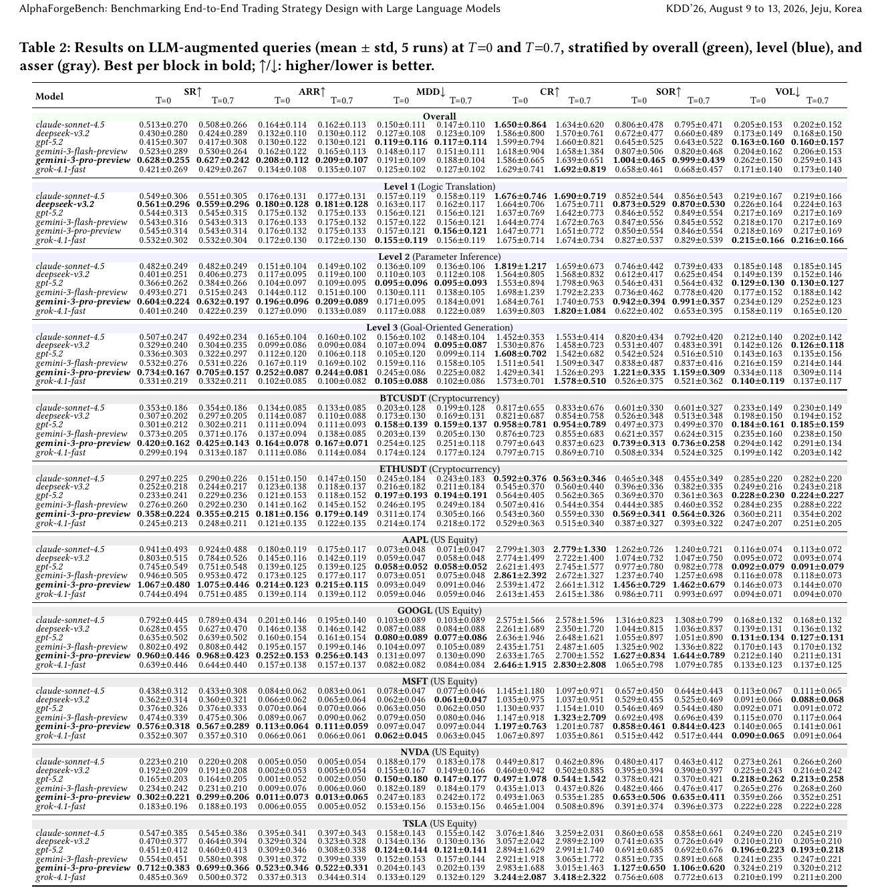
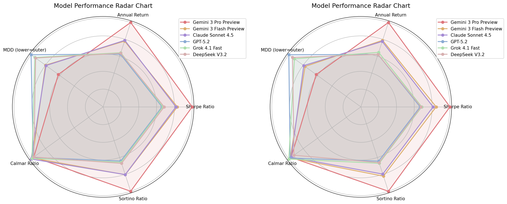
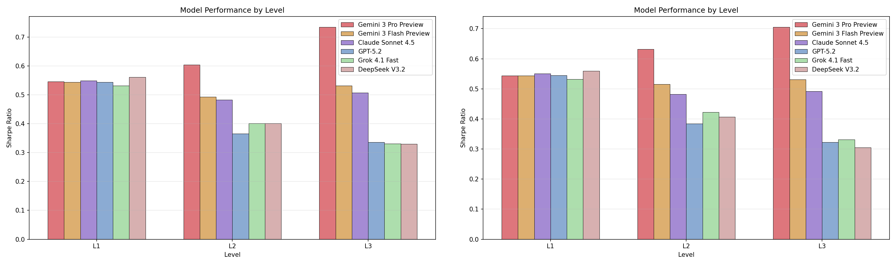
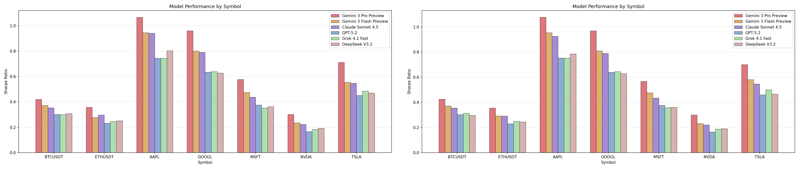
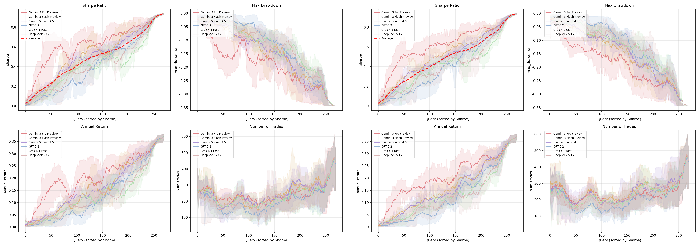

# Bài 08 - Kết quả Stage 2: Structured queries và chẩn đoán năng lực

**Loại:** Lesson  
**Nguồn chính:** PDF trang 6-9

## 1. Kết quả tổng thể

Stage 2 vẫn giữ hierarchy tương tự Stage 1 nhưng khoảng cách được khuếch đại. Ở temperature 0, `gemini-3-pro-preview` đạt SR = **0,628** trong overall block của Table 2.

Khoảng ARR tốt nhất - kém nhất là **7,8 điểm phần trăm**, lớn hơn 5,5 điểm phần trăm của Stage 1.

## 2. Temperature invariance

Bài báo nhấn mạnh kết quả giữa T=0 và T=0,7 rất gần nhau, với chênh lệch SR tối đa dưới **0,008** trong phân tích Stage 2.

Hai radar gần như trùng hình dạng. Tác giả diễn giải đây là bằng chứng rằng khi execution đã xác định, temperature chủ yếu ảnh hưởng biến thể bề mặt của code thay vì làm xáo trộn liên tục hành động ở từng timestep.

## 3. Per-level analysis

### 3.1 Level 1 - Logic Translation

Đây là năng lực gần bão hòa. SR giữa các model rất sát nhau, range khoảng **0,029**. `deepseek-v3.2` dẫn ở level này dù không dẫn overall, cho thấy code translation và strategic reasoning là hai năng lực khác nhau.

### 3.2 Level 2 - Parameter Inference

Khi model phải điền threshold, lookback window hoặc indicator parameter, khoảng cách SR giữa model mở rộng thành khoảng **8 lần** Level 1.

### 3.3 Level 3 - Goal-Oriented Generation

Khoảng cách đạt khoảng **14 lần** Level 1. `gemini-3-pro-preview` cải thiện khi task mở hơn, trong khi một số model mạnh ở translation lại giảm khi cần thiết kế từ mục tiêu cấp cao.

Bài báo cũng ghi nhận model-averaged SR giảm khoảng **16%** từ L1 sang L2; chuyển từ L2 sang L3 chủ yếu làm tăng độ phân tán giữa model hơn là giảm mạnh mean thêm một lần nữa.

## 4. Per-asset analysis

Stage 2 tiếp tục cho thấy:

- AAPL/GOOGL là các môi trường tương đối dễ;
- MSFT/NVDA khó hơn trong equity;
- crypto thuộc nhóm thách thức nhất;
- TSLA có return cao nhưng cross-model variance rộng.

Bài báo nhận thấy structured query làm khoảng cách giữa model rõ hơn trong từng asset.

## 5. Aligned return curves

Figure 5 dùng dải 25th-75th percentile qua 5 runs. Bài báo rút ra bốn điểm:

1. Khoảng cách giữa model lớn hơn confidence band của từng model.
2. Run-to-run stability nhìn chung cao.
3. Hai panel T=0 và T=0,7 có hình dạng rất giống nhau.
4. Query khó làm inter-model divergence rộng hơn.

## 6. Ba profile hành vi model

Bài báo nhóm các model thành ba archetype:

### 6.1 Aggressive-creative

`gemini-3-pro-preview`: mạnh ở open-ended generation và return, nhưng drawdown/volatility cao hơn.

### 6.2 Balanced-stable

`claude-sonnet-4.5` và `gemini-3-flash-preview`: confidence band hẹp hơn và suy giảm nhẹ hơn khi tăng mức mở của task; Claude có Calmar Ratio overall tốt ở T=0 trong Stage 2.

### 6.3 Conservative-rigid

`gpt-5.2`, `deepseek-v3.2`, `grok-4.1-fast`: thiên về logic rủi ro thấp hơn nhưng suy giảm mạnh hơn từ task có cấu trúc sang task mở. Bài báo mô tả `grok-4.1-fast` là model có run-to-run variance cao nhất trong nhóm phân tích này.

## 7. Năm kết luận Stage 2

1. Temperature invariance.
2. Difficulty progression có hệ thống.
3. Ranking reversal giữa các level.
4. Risk profile tái lập.
5. Cross-asset robustness.

Ý nghĩa lớn nhất của Stage 2 là benchmark không chỉ cho một leaderboard mà còn cho biết **mô hình giỏi loại reasoning nào**.
