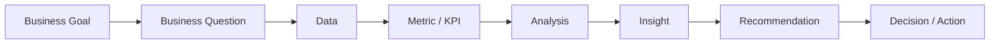

# 003 - Why BI Matters?

**Module:** Module 01 - Introduction - Giới thiệu BI Analyst  
**Roadmap item:** 1.3  
**Loại nội dung:** BI foundations  
**Thời lượng gợi ý:** 35–55 phút

---

## 1. Tóm tắt

Business Intelligence quan trọng vì doanh nghiệp cần ra quyết định trong khi dữ liệu ngày càng nhiều, phân tán và thay đổi liên tục.

BI giúp doanh nghiệp:

- hỗ trợ ra quyết định dựa trên dữ liệu;
- theo dõi hiệu suất kinh doanh;
- phát hiện xu hướng;
- nhận diện rủi ro;
- tìm kiếm cơ hội;
- biến kết quả phân tích thành recommendation hoặc next action.

Giá trị của BI không nằm ở việc có thật nhiều dashboard. Giá trị nằm ở việc **đúng người nhận được đúng thông tin, từ đúng dữ liệu, đúng thời điểm và có thể dùng thông tin đó để hành động**.

---

## 2. Mục tiêu học tập

Sau bài này, người học có thể:

- Giải thích được vì sao BI có giá trị đối với hoạt động ra quyết định.
- Phân biệt được ba nhóm giá trị: theo dõi hiệu suất, phát hiện thay đổi và hỗ trợ hành động.
- Mô tả được cách metric và dashboard giúp doanh nghiệp theo dõi mục tiêu.
- Nhận diện được cách BI hỗ trợ phát hiện xu hướng, rủi ro và cơ hội.
- Đánh giá được một insight BI dựa trên mức độ liên quan, độ tin cậy và khả năng hành động.

---

## 3. Vì sao doanh nghiệp cần BI?

Một doanh nghiệp có thể có rất nhiều dữ liệu nhưng vẫn ra quyết định kém nếu dữ liệu:

- nằm rải rác ở nhiều nguồn;
- không có metric thống nhất;
- được cập nhật quá chậm;
- không được kiểm tra chất lượng;
- chỉ được báo cáo dưới dạng bảng số liệu khó hiểu;
- không gắn với business question.

BI giúp tổ chức dữ liệu thành một hệ thống thông tin phục vụ quyết định.

Một câu hỏi quan trọng không phải:

> Chúng ta có bao nhiêu dữ liệu?

Mà là:

> Dữ liệu nào giúp chúng ta hiểu vấn đề và quyết định tốt hơn?

---

## 4. BI hỗ trợ ra quyết định dựa trên dữ liệu

Ra quyết định dựa trên dữ liệu không có nghĩa là con người chỉ làm theo con số. Dữ liệu cung cấp bằng chứng để stakeholder đánh giá tình hình, so sánh lựa chọn và giảm bớt phỏng đoán.

Một BI workflow có thể được mô tả như sau:



Sơ đồ cho thấy quyết định không xuất hiện trực tiếp từ dữ liệu thô. Cần đi qua định nghĩa metric, phân tích và diễn giải.

### Ví dụ minh họa

Một trưởng nhóm marketing muốn biết:

> Nên ưu tiên kiểm tra kênh nào khi hiệu quả chiến dịch giảm?

BI có thể giúp:

1. thống nhất metric hiệu quả;
2. so sánh theo kênh và thời gian;
3. kiểm tra data quality;
4. phát hiện nơi có biến động đáng chú ý;
5. đưa ra các giả thuyết cần kiểm tra;
6. trình bày next action.

BI không tự thay thế quyết định của trưởng nhóm; nó làm cho quyết định có căn cứ hơn.

---

## 5. BI giúp theo dõi hiệu suất kinh doanh

Doanh nghiệp cần biết mình đang ở đâu so với mục tiêu.

BI hỗ trợ theo dõi thông qua:

- KPI;
- trend;
- target;
- breakdown;
- dashboard;
- report.

Ví dụ, một dashboard bán hàng có thể giúp theo dõi:

- doanh thu;
- số đơn;
- giá trị đơn trung bình;
- tỷ lệ hủy;
- hiệu suất theo khu vực;
- hiệu suất theo sản phẩm.

Điều quan trọng là mỗi KPI phải có định nghĩa và bối cảnh rõ ràng.

Một con số đứng một mình thường không đủ. Người dùng cần biết:

- so với kỳ trước thế nào;
- so với target ra sao;
- khu vực hoặc phân khúc nào đóng góp nhiều nhất;
- biến động bắt đầu từ thời điểm nào.

### Monitoring không chỉ là “xem số”

Theo dõi hiệu suất tốt giúp phát hiện sớm sự thay đổi.

Ví dụ:

> Tổng doanh thu vẫn gần target nhưng một khu vực đang giảm liên tục.

Nếu chỉ nhìn tổng số, vấn đề có thể bị che khuất. BI cho phép drill down để tìm nơi cần chú ý.

---

## 6. BI giúp phát hiện xu hướng

`Trend` là hướng biến động theo thời gian.

BI có thể giúp nhận diện:

- tăng trưởng dần;
- suy giảm kéo dài;
- tính mùa vụ;
- biến động bất thường;
- khác biệt giữa nhóm sản phẩm, khách hàng hoặc khu vực.

Nhận diện trend hữu ích vì một snapshot đơn lẻ có thể gây hiểu nhầm.

Ví dụ:

> Doanh số tuần này cao hơn tuần trước.

Điều đó chưa chắc là tín hiệu tích cực nếu:

- tuần trước là kỳ bất thường;
- doanh số vẫn thấp hơn xu hướng dài hạn;
- tăng trưởng chỉ đến từ một chương trình khuyến mãi ngắn hạn;
- tỷ lệ hủy đang tăng.

Vì vậy, BI Analyst cần đặt metric trong **chuỗi thời gian và bối cảnh**.

---

## 7. BI giúp nhận diện rủi ro

Một số rủi ro có thể biểu hiện qua dữ liệu trước khi trở thành vấn đề lớn.

Ví dụ:

- tỷ lệ hủy tăng;
- retention giảm;
- số lỗi vận hành tăng;
- một nhóm sản phẩm suy giảm liên tục;
- dữ liệu đầu vào đột nhiên thiếu;
- một metric lệch khỏi pattern thông thường.

BI giúp biến các dấu hiệu này thành thông tin có thể theo dõi.

Tuy nhiên, phát hiện một biến động không đồng nghĩa với việc đã biết nguyên nhân.

Một cách diễn đạt cẩn trọng:

> Metric X đang lệch khỏi pattern gần đây và cần được điều tra thêm.

Tốt hơn việc khẳng định ngay:

> X là nguyên nhân gây ra vấn đề.

BI tốt cần cho stakeholder biết cả **evidence** và **uncertainty**.

---

## 8. BI giúp tìm cơ hội

BI không chỉ dùng để phát hiện vấn đề. Dữ liệu cũng có thể cho thấy cơ hội.

Ví dụ:

- một nhóm khách hàng có mức độ sử dụng cao;
- một sản phẩm đang tăng trưởng nhanh;
- một khu vực có conversion tốt;
- một kênh mang lại khách hàng chất lượng;
- một quy trình có thể tối ưu thêm.

Từ đó, stakeholder có thể đặt câu hỏi:

- Có nên tăng đầu tư vào nhóm này?
- Có thể nhân rộng pattern này sang khu vực khác không?
- Có phân khúc nào đang bị bỏ sót?
- Có thể thiết kế thử nghiệm để kiểm tra cơ hội không?

BI giúp biến “có vẻ thú vị” thành một giả thuyết có dữ liệu hỗ trợ.

---

## 9. Từ dashboard đến hành động

Một dashboard chỉ có giá trị khi nó giúp người dùng biết nên chú ý điều gì.

Một cấu trúc hữu ích:

```text
KPI
 ↓
Biến động
 ↓
Breakdown
 ↓
Insight
 ↓
Risk / Opportunity
 ↓
Recommendation
 ↓
Next Action
```

### Ví dụ

**KPI:** conversion rate giảm.  
**Breakdown:** giảm tập trung ở một kênh.  
**Insight:** thay đổi xuất hiện từ một thời điểm cụ thể.  
**Risk:** nếu xu hướng tiếp tục, hiệu quả acquisition có thể giảm.  
**Next action:** kiểm tra tracking, traffic quality và funnel của kênh đó.

Ví dụ này không khẳng định nguyên nhân khi chưa có dữ liệu. Nó cho thấy cách BI dẫn từ tín hiệu đến hành động điều tra.

---

## 10. Khi BI không tạo ra giá trị

BI có thể thất bại dù dashboard được làm đẹp.

### 10.1. Metric không thống nhất

Nếu các phòng ban dùng định nghĩa khác nhau cho cùng một KPI, người dùng sẽ tranh luận về con số thay vì quyết định.

### 10.2. Data quality kém

Dashboard chỉ phản ánh dữ liệu đầu vào. Nếu dữ liệu sai, kết luận có thể sai.

### 10.3. Báo cáo quá nhiều nhưng không có ưu tiên

Một report chứa hàng chục chart có thể khiến stakeholder không biết điều gì quan trọng.

### 10.4. Insight không dẫn tới hành động

“Doanh thu giảm 8%” chỉ là một mô tả nếu không có context, breakdown hoặc câu hỏi tiếp theo.

### 10.5. Không hiểu người sử dụng

Dashboard dành cho lãnh đạo, quản lý vận hành và analyst có thể cần độ chi tiết khác nhau.

BI phải được thiết kế cho **decision context**, không chỉ cho dữ liệu.

---

## 11. Khung đánh giá một insight BI

Trước khi gửi insight, có thể kiểm tra theo năm câu hỏi:

| Tiêu chí | Câu hỏi |
| --- | --- |
| Relevance | Insight có trả lời đúng business question không? |
| Reliability | Dữ liệu và metric có đáng tin cậy không? |
| Context | Có so sánh hoặc bối cảnh đủ để hiểu con số không? |
| Clarity | Stakeholder có hiểu thông điệp nhanh không? |
| Actionability | Insight có dẫn tới quyết định, kiểm tra hoặc hành động tiếp theo không? |

Một insight mạnh không nhất thiết dài. Nó cần đúng, rõ và hữu ích.

---

## 12. Ví dụ tổng hợp

Giả sử một ứng dụng muốn theo dõi hiệu suất kinh doanh.

### Business question

> Phần nào của hoạt động kinh doanh đang thay đổi đáng kể và cần ưu tiên kiểm tra?

### Dashboard theo dõi

Có thể gồm:

- KPI tổng quan;
- trend theo thời gian;
- breakdown theo sản phẩm/kênh/khu vực;
- bảng chi tiết cho nhóm có biến động mạnh.

### Khi phát hiện biến động

BI Analyst cần:

1. kiểm tra dữ liệu có đầy đủ không;
2. xác nhận metric definition;
3. so sánh với kỳ tham chiếu;
4. drill down theo dimension phù hợp;
5. ghi lại insight được hỗ trợ bởi dữ liệu;
6. phân biệt observation với hypothesis;
7. đề xuất next action.

### Giá trị tạo ra

Stakeholder không chỉ biết “metric đã thay đổi” mà còn biết:

- thay đổi ở đâu;
- mức độ đáng chú ý ra sao;
- phần nào cần điều tra;
- quyết định nào có thể được cân nhắc.

---

## 13. Bài tập thực hành

Chọn một công ty hoặc sản phẩm quen thuộc.

Viết một **BI decision note** gồm:

**1. Business decision**  
Stakeholder đang cần quyết định gì?

**2. KPI**  
Chọn 3–5 metric có thể hỗ trợ quyết định.

**3. Monitoring view**  
Nêu cách theo dõi metric theo thời gian hoặc theo nhóm.

**4. Risk signal**  
Một biến động nào có thể là tín hiệu rủi ro?

**5. Opportunity signal**  
Một biến động nào có thể là tín hiệu cơ hội?

**6. Next action**  
Nếu tín hiệu xuất hiện, stakeholder nên kiểm tra hoặc làm gì tiếp theo?

Không tự đặt số liệu nếu không có dữ liệu thực tế.

### Tiêu chí hoàn thành

- KPI gắn với quyết định.
- Có bối cảnh để đọc metric.
- Phân biệt rõ observation và hypothesis.
- Risk/opportunity được diễn đạt có điều kiện.
- Có next action cụ thể.

---

## 14. Artifact nên tạo

Tạo một **BI Decision Support One-Pager** cho portfolio.

Nội dung gợi ý:

- stakeholder;
- business question;
- KPI;
- một dashboard sketch;
- một risk signal;
- một opportunity signal;
- một insight mẫu;
- recommendation hoặc next action;
- limitation/data quality note.

Checklist:

- [ ] Business question rõ.
- [ ] KPI có định nghĩa.
- [ ] Dashboard hỗ trợ decision context.
- [ ] Insight có evidence.
- [ ] Không khẳng định nguyên nhân khi chưa đủ dữ liệu.
- [ ] Có next action.

---

## 15. Câu hỏi ôn tập

### Câu 1

Vì sao BI quan trọng đối với doanh nghiệp?

A. Vì BI giúp biến dữ liệu thành thông tin hỗ trợ quyết định.  
B. Vì BI loại bỏ hoàn toàn nhu cầu phán đoán của con người.  
C. Vì mọi doanh nghiệp bắt buộc phải có thật nhiều dashboard.  
D. Vì BI chỉ dùng để lưu trữ dữ liệu.

**Đáp án:** A

**Giải thích:** Giá trị cốt lõi của BI là giúp tổ chức dữ liệu thành thông tin có thể dùng để theo dõi, phân tích và hỗ trợ hành động.

### Câu 2

Một dashboard cho thấy KPI giảm. Điều gì nên làm trước khi kết luận nguyên nhân?

A. Đổi chart sang 3D.  
B. Kiểm tra data quality, metric definition và breakdown liên quan.  
C. Xóa KPI khỏi dashboard.  
D. Khẳng định nguyên nhân theo trực giác.

**Đáp án:** B

**Giải thích:** Một biến động chỉ là tín hiệu ban đầu. Cần kiểm tra độ tin cậy của dữ liệu và phân tích sâu hơn trước khi kết luận nguyên nhân.

### Câu 3

Phát biểu nào đúng về trend?

A. Một snapshot đơn lẻ luôn đủ để xác định xu hướng.  
B. Trend chỉ dùng trong dữ liệu tài chính.  
C. Trend giúp hiểu hướng biến động theo thời gian và cần được đọc trong bối cảnh.  
D. Trend luôn chứng minh quan hệ nhân quả.

**Đáp án:** C

**Giải thích:** Trend cho biết pattern theo thời gian nhưng không tự chứng minh nguyên nhân.

### Câu 4

Một insight được xem là có tính `actionable` khi nào?

A. Khi chứa nhiều thuật ngữ kỹ thuật.  
B. Khi được trình bày bằng biểu đồ phức tạp.  
C. Khi có thật nhiều metric.  
D. Khi nó giúp stakeholder xác định quyết định, kiểm tra hoặc hành động tiếp theo.

**Đáp án:** D

**Giải thích:** Actionability là khả năng biến insight thành bước tiếp theo có ý nghĩa.

### Câu 5

Một analyst thấy retention giảm và viết: “Nguyên nhân chắc chắn là sản phẩm mới kém chất lượng.” Lỗi chính là gì?

A. Kết luận nguyên nhân vượt quá bằng chứng dữ liệu đã nêu.  
B. Retention không phải metric.  
C. Analyst không được phép viết insight.  
D. BI chỉ được dùng cho doanh thu.

**Đáp án:** A

**Giải thích:** Retention giảm là observation. Để khẳng định nguyên nhân cần thêm evidence và phân tích; nếu chưa có, nên trình bày đó là hypothesis cần kiểm tra.

---

## 16. Tổng kết

BI quan trọng vì nó giúp doanh nghiệp biến dữ liệu thành một hệ thống hỗ trợ quyết định.

Giá trị của BI thể hiện rõ nhất khi doanh nghiệp có thể:

- theo dõi hiệu suất;
- phát hiện thay đổi;
- nhận diện xu hướng;
- cảnh báo rủi ro;
- tìm cơ hội;
- chuyển insight thành recommendation hoặc next action.

Một BI Analyst tạo ra giá trị không phải bằng số lượng dashboard, mà bằng khả năng trả lời câu hỏi:

> **Thông tin này giúp stakeholder quyết định tốt hơn như thế nào?**
