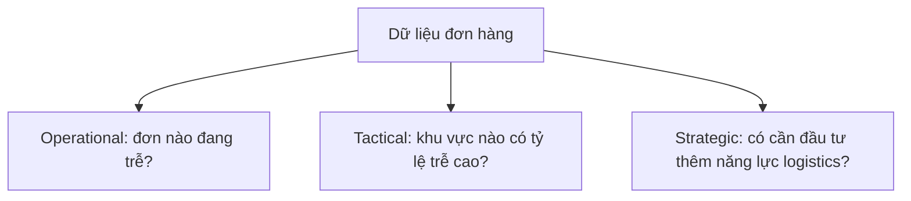

# 002 - Types of BI Operations

**Module:** Module 02 - Business Fundamentals - Nền tảng kinh doanh  
**Roadmap item:** 2.2  
**Loại nội dung:** Business fundamentals  
**Thời lượng gợi ý:** 35–55 phút

---

## 1. Tóm tắt

Business Intelligence không chỉ phục vụ một loại quyết định. Tùy theo **thời gian phản ứng**, **mức độ chi tiết** và **phạm vi của quyết định**, hoạt động BI có thể được nhìn theo ba lớp chính: **Operational BI**, **Tactical BI** và **Strategic BI**.

Phân biệt ba lớp này giúp BI Analyst trả lời đúng câu hỏi của đúng stakeholder. Một dashboard theo dõi vận hành trong ngày không nên được thiết kế giống một báo cáo chiến lược cho lãnh đạo, dù cả hai có thể dùng chung một phần dữ liệu.

## 2. Mục tiêu học tập

Sau bài học, người học có thể:

- Phân biệt được **Operational BI**, **Tactical BI** và **Strategic BI**.
- Xác định loại BI phù hợp dựa trên business question và người ra quyết định.
- Chọn mức độ chi tiết, tần suất cập nhật và cách trình bày phù hợp với từng loại BI.
- Nhận diện rủi ro khi dùng dữ liệu quá chi tiết hoặc quá tổng hợp cho sai cấp quyết định.
- Thiết kế một mini-report hoặc dashboard brief phù hợp với một trong ba lớp BI.

## 3. Vì sao cần phân loại hoạt động BI?

Một tổ chức có thể đặt các câu hỏi rất khác nhau:

- “Đơn hàng nào đang bị trễ ngay hôm nay?”
- “Khu vực nào có tỷ lệ giao hàng trễ cao nhất trong tháng này?”
- “Trong năm tới có nên mở rộng năng lực giao hàng tại khu vực đó không?”

Ba câu hỏi cùng liên quan đến vận hành giao hàng, nhưng khác nhau về **horizon**, **stakeholder** và **mức độ quyết định**. Nếu BI Analyst dùng một dashboard duy nhất cho cả ba, thông tin dễ bị quá tải hoặc thiếu chiều sâu.

## 4. Operational BI

**Operational BI** hỗ trợ các quyết định gắn với hoạt động hằng ngày hoặc các vấn đề cần phản ứng tương đối nhanh.

### 4.1. Đặc điểm

- tập trung vào trạng thái hiện tại hoặc gần hiện tại;
- thường cần mức chi tiết cao;
- phục vụ nhân sự vận hành, supervisor hoặc team lead;
- câu hỏi thường thiên về phát hiện và xử lý ngoại lệ;
- insight thường dẫn đến hành động trực tiếp.

Ví dụ câu hỏi:

- Đơn hàng nào đang quá SLA?
- Hệ thống nào có số lỗi tăng bất thường?
- Kho nào sắp thiếu hàng?
- Ca làm việc nào đang tồn backlog cao?

### 4.2. Cách trình bày phù hợp

Operational dashboard nên ưu tiên:

- trạng thái hiện tại;
- danh sách ngoại lệ;
- cảnh báo hoặc ngưỡng;
- khả năng drill-down tới đối tượng cụ thể;
- timestamp hoặc độ mới của dữ liệu khi điều đó ảnh hưởng đến quyết định.

Mục tiêu là giúp người dùng **nhìn thấy vấn đề và xử lý**.

## 5. Tactical BI

**Tactical BI** hỗ trợ các quyết định trung hạn của quản lý và các nhóm chức năng. Nó thường tập trung vào việc tối ưu hiệu suất, phân bổ nguồn lực hoặc điều chỉnh kế hoạch.

### 5.1. Đặc điểm

- thường xem dữ liệu theo tuần, tháng hoặc quý;
- mức độ tổng hợp cao hơn Operational BI;
- thường so sánh giữa team, sản phẩm, khu vực hoặc giai đoạn;
- phục vụ manager hoặc head of function;
- tập trung vào “vì sao hiệu suất khác nhau” và “nên điều chỉnh ở đâu”.

Ví dụ câu hỏi:

- Kênh marketing nào đang có hiệu quả tốt hơn trong tháng?
- Team sales nào có conversion rate giảm so với kỳ trước?
- Khu vực nào cần bổ sung nhân lực vận hành?
- Chi phí nào tăng nhanh hơn kế hoạch?

### 5.2. Cách trình bày phù hợp

Tactical BI thường cần:

- trend theo thời gian;
- benchmark giữa các nhóm;
- variance so với target hoặc kỳ trước;
- breakdown để tìm driver;
- recommendation cho hành động quản lý.

Mục tiêu là giúp người quản lý **điều chỉnh cách vận hành hoặc phân bổ nguồn lực**.

## 6. Strategic BI

**Strategic BI** hỗ trợ các quyết định dài hạn có ảnh hưởng lớn tới hướng đi của tổ chức.

### 6.1. Đặc điểm

- horizon thường dài hơn;
- dữ liệu được tổng hợp ở cấp cao;
- tập trung vào xu hướng, cơ hội, rủi ro và kết quả tổng thể;
- stakeholder thường là senior leadership hoặc executive;
- câu hỏi thường liên quan đến ưu tiên chiến lược và đầu tư.

Ví dụ câu hỏi:

- Doanh nghiệp nên tập trung tăng trưởng ở thị trường nào?
- Cơ cấu doanh thu đang thay đổi theo hướng nào?
- Biên lợi nhuận có xu hướng bền vững không?
- Năng lực vận hành hiện tại có hỗ trợ kế hoạch mở rộng không?

### 6.2. Cách trình bày phù hợp

Strategic BI nên ưu tiên:

- ít KPI nhưng quan trọng;
- trend dài hạn;
- target và benchmark;
- phân tích driver ở mức vừa đủ;
- risk, implication và recommendation.

Mục tiêu là giúp lãnh đạo **ra quyết định định hướng**, không phải xử lý từng trường hợp riêng lẻ.

## 7. So sánh ba loại BI

| Tiêu chí | Operational BI | Tactical BI | Strategic BI |
| --- | --- | --- | --- |
| Trọng tâm | Vận hành hiện tại | Tối ưu và điều chỉnh | Định hướng dài hạn |
| Stakeholder điển hình | Operator, supervisor, team lead | Manager, functional lead | Executive, senior leadership |
| Mức chi tiết | Cao | Trung bình | Tổng hợp |
| Tần suất xem | Thường xuyên | Định kỳ | Theo chu kỳ quản trị |
| Câu hỏi chính | Cần xử lý gì ngay? | Hiệu suất đang lệch ở đâu và vì sao? | Nên ưu tiên hướng nào? |
| Output phù hợp | Alert, operational dashboard, exception list | Performance dashboard, monthly analysis | Executive dashboard, strategic brief |

Ba loại BI không tách biệt tuyệt đối. Một vấn đề có thể bắt đầu ở dashboard Operational, sau đó được tổng hợp thành Tactical analysis và cuối cùng ảnh hưởng đến quyết định Strategic.

## 8. Từ cùng một dữ liệu đến ba câu hỏi khác nhau

Giả sử doanh nghiệp có dữ liệu đơn hàng.

Điểm khác biệt không nằm ở việc có hay không có dữ liệu, mà ở **câu hỏi**, **grain phân tích** và **quyết định cần hỗ trợ**.

## 9. Cách xác định loại BI cho một yêu cầu

Khi nhận yêu cầu từ stakeholder, BI Analyst có thể hỏi:

1. **Ai sẽ dùng kết quả?**
2. **Họ cần ra quyết định gì?**
3. **Quyết định cần được đưa ra trong bao lâu?**
4. **Họ cần nhìn ở mức tổng hợp hay mức bản ghi cụ thể?**
5. **Khi KPI thay đổi, hành động tiếp theo là gì?**

Nếu câu trả lời thiên về xử lý từng ngoại lệ hiện tại, yêu cầu có xu hướng Operational. Nếu thiên về điều chỉnh hiệu suất theo chu kỳ, đó thường là Tactical. Nếu liên quan đến hướng đi dài hạn và phân bổ nguồn lực lớn, đó thường là Strategic.

## 10. Điểm dễ sai

- Dùng dashboard quá chi tiết cho lãnh đạo cấp cao.
- Dùng báo cáo tổng hợp để xử lý vấn đề vận hành cần drill-down.
- Cố làm một dashboard phục vụ mọi stakeholder.
- Không ghi rõ độ mới của dữ liệu khi người dùng cần phản ứng nhanh.
- Chỉ báo cáo “what happened” mà thiếu “why” và “next action”.
- Chọn chart trước khi xác định loại quyết định cần hỗ trợ.

## 11. Thực hành: phân loại yêu cầu BI

Với mỗi tình huống dưới đây, xác định **Operational**, **Tactical** hoặc **Strategic** và giải thích lý do:

1. Quản lý kho muốn biết SKU nào sắp hết hàng trong ngày.
2. Head of Operations muốn so sánh tỷ lệ giao hàng đúng hạn giữa các khu vực trong quý.
3. Ban lãnh đạo muốn đánh giá có nên đầu tư thêm trung tâm phân phối vào năm tới.

Sau đó chọn **một** tình huống và viết dashboard brief gồm:

- stakeholder;
- business question;
- quyết định cần hỗ trợ;
- 3–5 metric/KPI;
- grain dữ liệu;
- tần suất cập nhật;
- insight hoặc action mong đợi.

**Deliverable**

Tạo một **BI Operation Brief** dài khoảng một trang. Đây có thể là artifact dùng trong portfolio để thể hiện khả năng chuyển business need thành yêu cầu phân tích.

## 12. Câu hỏi ôn tập

### Câu 1

Một supervisor muốn biết ngay những đơn hàng đang quá SLA để phân công xử lý. Đây chủ yếu là loại BI nào?

A. Strategic BI.  
B. Tactical BI.  
C. Operational BI.  
D. Không thuộc BI.

**Đáp án:** C

**Giải thích:** Câu hỏi tập trung vào trạng thái hiện tại, mức chi tiết cao và hành động trực tiếp, phù hợp với Operational BI.

### Câu 2

Một manager so sánh hiệu suất các team trong ba tháng để điều chỉnh phân bổ nguồn lực. Loại BI phù hợp nhất là gì?

A. Tactical BI.  
B. Operational BI.  
C. Strategic BI.  
D. Chỉ là data entry.

**Đáp án:** A

**Giải thích:** Quyết định mang tính quản lý trung hạn và tối ưu nguồn lực, đặc trưng của Tactical BI.

### Câu 3

Điều nào thường phù hợp hơn với Strategic BI?

A. Danh sách từng đơn hàng lỗi.  
B. Trạng thái từng ticket trong giờ.  
C. Trend dài hạn và KPI tổng hợp gắn với mục tiêu.  
D. Log chi tiết của từng request.

**Đáp án:** C

**Giải thích:** Strategic BI ưu tiên xu hướng, kết quả tổng thể, cơ hội và rủi ro ở cấp định hướng.

### Câu 4

Cùng một dataset có thể phục vụ Operational, Tactical và Strategic BI không?

A. Không, mỗi loại BI bắt buộc phải có database riêng.  
B. Có, nếu business question, grain và cách tổng hợp được điều chỉnh phù hợp.  
C. Chỉ khi dữ liệu không có timestamp.  
D. Chỉ với dữ liệu Finance.

**Đáp án:** B

**Giải thích:** Dữ liệu có thể được tái sử dụng, nhưng cách phân tích và trình bày phải phù hợp với quyết định của từng cấp.

### Câu 5

Khi stakeholder yêu cầu “dashboard cho mọi người”, BI Analyst nên làm gì đầu tiên?

A. Chọn thật nhiều chart để đáp ứng mọi nhu cầu.  
B. Xác định các nhóm stakeholder và quyết định họ cần hỗ trợ.  
C. Dùng chung một mức chi tiết cho tất cả.  
D. Bỏ toàn bộ filter.

**Đáp án:** B

**Giải thích:** Phân tách stakeholder và decision context giúp xác định liệu cần một dashboard hay nhiều view khác nhau.

## 13. Tổng kết

Operational BI, Tactical BI và Strategic BI khác nhau chủ yếu ở **loại quyết định**, **thời gian phản ứng**, **mức chi tiết** và **stakeholder**. BI Analyst cần xác định đúng lớp BI trước khi thiết kế metric, query hoặc dashboard.

Một artifact tốt sau bài học là **BI Operation Brief** thể hiện rõ business question, người dùng, grain dữ liệu, tần suất cập nhật và action mà insight cần hỗ trợ.
