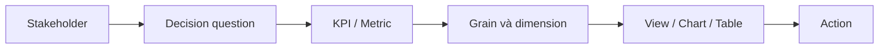

# 003 - Stakeholder Identification

**Module:** Module 02 - Business Fundamentals - Nền tảng kinh doanh  
**Roadmap item:** 2.3  
**Loại nội dung:** Business fundamentals  
**Thời lượng gợi ý:** 35–55 phút

---

## 1. Tóm tắt

Một dashboard chỉ hữu ích khi được thiết kế cho **đúng người**, **đúng quyết định** và **đúng bối cảnh sử dụng**. Vì vậy, trước khi chọn metric, chart hoặc tool, BI Analyst cần xác định stakeholder: ai sử dụng dashboard, ai ra quyết định, ai chịu trách nhiệm về dữ liệu và ai bị ảnh hưởng bởi kết quả phân tích.

Stakeholder Identification giúp tránh một lỗi phổ biến: xây dashboard đầy đủ về dữ liệu nhưng không trả lời được nhu cầu thật của người dùng.

## 2. Mục tiêu học tập

Sau bài học, người học có thể:

- Xác định các nhóm stakeholder liên quan đến một yêu cầu BI.
- Phân biệt **dashboard user**, **decision maker**, **data owner** và các bên bị ảnh hưởng.
- Thu thập nhu cầu theo business question thay vì chỉ hỏi “muốn xem chart gì”.
- Chuyển nhu cầu stakeholder thành metric, grain, filter và mức độ chi tiết phù hợp.
- Tạo một **Stakeholder Map** và một **Dashboard Requirement Brief** ngắn.

## 3. Stakeholder là ai trong một dự án BI?

**Stakeholder** là cá nhân hoặc nhóm có liên quan đến vấn đề, dữ liệu, quyết định hoặc kết quả của sản phẩm BI.

Không phải stakeholder nào cũng sử dụng dashboard trực tiếp. Một dự án BI có thể có:

- người xem dashboard hằng ngày;
- người ra quyết định cuối cùng;
- người cung cấp hoặc sở hữu dữ liệu;
- nhóm chịu trách nhiệm thực thi hành động;
- nhóm bị ảnh hưởng bởi quyết định.

Việc xác định vai trò giúp BI Analyst biết **cần hỏi ai điều gì**.

## 4. Xác định người dùng dashboard

Dashboard user là người trực tiếp tương tác với báo cáo hoặc dashboard.

Các câu hỏi cần làm rõ:

- Họ xem dashboard với tần suất nào?
- Họ dùng desktop, màn hình lớn hay thiết bị khác?
- Họ cần overview hay drill-down?
- Họ cần xem theo khu vực, sản phẩm, team hay thời gian?
- Khi thấy một chỉ số bất thường, họ sẽ làm gì tiếp theo?

Ví dụ, một operations supervisor có thể cần danh sách chi tiết để xử lý ngoại lệ; trong khi một director có thể chỉ cần vài KPI tổng hợp và xu hướng.

## 5. Xác định người ra quyết định

Người xem dashboard và người ra quyết định có thể là cùng một người, nhưng không phải lúc nào cũng vậy.

Ví dụ:

- Analyst chuẩn bị báo cáo.
- Manager xem và diễn giải kết quả.
- Director quyết định phân bổ ngân sách.

Nếu BI Analyst chỉ phỏng vấn người trực tiếp sử dụng dashboard mà bỏ qua decision maker, dashboard có thể tối ưu cho thao tác nhưng không đủ thông tin cho quyết định cuối cùng.

### 5.1. Tập trung vào decision question

Thay vì hỏi:

> “Anh/chị muốn dashboard có những chart nào?”

nên bắt đầu bằng các câu hỏi như:

- Quyết định nào cần được đưa ra?
- Quyết định đó được đưa ra khi nào?
- Điều gì khiến anh/chị thay đổi quyết định?
- KPI nào đang được dùng để đánh giá kết quả?
- Khi KPI lệch target, hành động tiếp theo là gì?

Business question rõ sẽ dẫn tới yêu cầu dữ liệu rõ hơn.

### 5.2. Phân biệt “need” và “request”

Stakeholder có thể yêu cầu một chart hoặc một con số cụ thể, nhưng yêu cầu đó chưa chắc phản ánh nhu cầu gốc.

Ví dụ:

> Request: “Cho tôi biểu đồ doanh thu theo ngày.”

Nhu cầu thực có thể là:

> “Tôi cần biết chiến dịch mới có làm doanh thu tăng bền vững hay chỉ tạo spike ngắn hạn.”

Nếu hiểu nhu cầu gốc, BI Analyst có thể cần thêm benchmark, baseline hoặc breakdown, chứ không chỉ một line chart.

## 6. Hiểu nhu cầu từng phòng ban

Mỗi business function có mục tiêu và ngôn ngữ riêng. BI Analyst không nên dùng cùng một bộ câu hỏi cho mọi phòng ban.

| Phòng ban | Nhu cầu thường gặp | Câu hỏi BI điển hình |
| --- | --- | --- |
| Finance | Doanh thu, chi phí, lợi nhuận, kiểm soát | Kết quả thực tế lệch kế hoạch ở đâu? |
| Marketing | Campaign, acquisition, conversion | Kênh nào tạo ra kết quả tốt hơn? |
| Operations | Tốc độ, chất lượng, backlog, capacity | Quy trình đang nghẽn ở bước nào? |
| HR | Headcount, tuyển dụng, nghỉ việc | Nhóm nào có biến động nhân sự đáng chú ý? |
| Sales | Pipeline, win rate, revenue | Khu vực hoặc team nào đang lệch mục tiêu? |

Bảng này là điểm khởi đầu. Khi làm việc thực tế, BI Analyst cần dùng thuật ngữ và định nghĩa mà tổ chức đang thống nhất.

## 7. Stakeholder Map

Một cách đơn giản để hệ thống hóa stakeholder là ghi lại **vai trò, nhu cầu, quyết định và mức ảnh hưởng**.

| Stakeholder | Vai trò | Câu hỏi chính | Quyết định/Hành động | Mức chi tiết cần xem |
| --- | --- | --- | --- | --- |
| Executive | Decision maker | Kết quả có đạt mục tiêu không? | Điều chỉnh ưu tiên | Tổng hợp |
| Manager | Owner/manager | Driver nào làm KPI thay đổi? | Điều chỉnh nguồn lực | Trung bình |
| Analyst | Power user | Dữ liệu thay đổi ở nhóm nào? | Phân tích sâu | Chi tiết |
| Operator | Action owner | Case nào cần xử lý? | Xử lý trực tiếp | Rất chi tiết |

Stakeholder Map giúp tránh việc cố thiết kế một view duy nhất cho những người có nhu cầu rất khác nhau.

## 8. Từ stakeholder đến yêu cầu dashboard

Sau khi xác định stakeholder, BI Analyst có thể chuyển nhu cầu thành các yêu cầu cụ thể.

Thứ tự này quan trọng. Chart là một phương tiện trình bày, không phải điểm bắt đầu của bài toán BI.

### 8.1. Những trường cần ghi trong requirement brief

Một Dashboard Requirement Brief có thể gồm:

- stakeholder chính;
- business question;
- decision/action;
- KPI và metric;
- dimension cần phân tích;
- grain dữ liệu;
- khoảng thời gian;
- tần suất cập nhật;
- filter cần thiết;
- data source;
- rủi ro hoặc giả định cần xác nhận.

### 8.2. Ví dụ mini-case

Giả sử Head of Marketing hỏi:

> “Tôi cần biết chiến dịch nào nên được tăng ngân sách.”

BI Analyst không nên chỉ đưa một bảng chi phí. Cần làm rõ:

- “hiệu quả” được đo bằng metric nào;
- đối tượng chuyển đổi là gì;
- thời gian đánh giá;
- có cần so sánh theo kênh, campaign hoặc audience không;
- ai có quyền quyết định tăng ngân sách;
- ngưỡng hoặc điều kiện nào dẫn tới hành động.

Kết quả cuối cùng là một dashboard phục vụ quyết định, không chỉ là nơi tập hợp dữ liệu marketing.

## 9. Điểm dễ sai

- Chỉ xác định người yêu cầu dashboard mà bỏ qua người ra quyết định.
- Hỏi stakeholder muốn chart gì trước khi hiểu quyết định.
- Dùng thuật ngữ kỹ thuật thay cho ngôn ngữ kinh doanh.
- Không thống nhất định nghĩa metric giữa các phòng ban.
- Thiết kế một dashboard duy nhất cho tất cả cấp người dùng.
- Không xác định hành động khi KPI thay đổi.
- Không kiểm tra data freshness, grain và phạm vi trước khi kết luận.

## 10. Thực hành: Stakeholder Mapping

Chọn một bài toán, ví dụ:

- theo dõi hiệu suất Sales;
- đánh giá chiến dịch Marketing;
- theo dõi vận hành giao hàng;
- phân tích chi phí Finance;
- theo dõi tuyển dụng HR.

Thực hiện:

1. Liệt kê ít nhất 3 stakeholder.
2. Xác định ai là dashboard user và ai là decision maker.
3. Viết một business question cho từng stakeholder.
4. Chọn metric/KPI phù hợp với từng câu hỏi.
5. Xác định mức chi tiết dữ liệu mỗi stakeholder cần.
6. Viết 5–7 dòng mô tả insight nào có thể dẫn tới hành động.

**Deliverable**

Tạo hai artifact:

- **Stakeholder Map**;
- **Dashboard Requirement Brief** cho stakeholder chính.

Checklist chất lượng:

- stakeholder rõ;
- decision question rõ;
- metric có định nghĩa;
- grain phù hợp;
- chart/table phục vụ câu hỏi;
- insight có next action.

## 11. Câu hỏi ôn tập

### Câu 1

Một analyst sử dụng dashboard hằng ngày nhưng director mới là người quyết định ngân sách. Ai là decision maker?

A. Analyst.  
B. Director.  
C. Database administrator.  
D. Không có ai.

**Đáp án:** B

**Giải thích:** Decision maker là người có quyền đưa ra quyết định kinh doanh cuối cùng, không nhất thiết là người sử dụng dashboard thường xuyên nhất.

### Câu 2

Câu hỏi nào nên được ưu tiên khi bắt đầu thu thập yêu cầu dashboard?

A. “Anh/chị thích màu nền nào?”  
B. “Anh/chị muốn pie chart hay bar chart?”  
C. “Quyết định nào dashboard cần hỗ trợ?”  
D. “Có thể thêm thật nhiều filter không?”

**Đáp án:** C

**Giải thích:** Decision question giúp xác định KPI, dữ liệu và mức chi tiết cần thiết; chart nên được chọn sau.

### Câu 3

Stakeholder yêu cầu “doanh thu theo ngày”. BI Analyst phát hiện nhu cầu thật là đánh giá tác động của chiến dịch. Cách xử lý phù hợp nhất là gì?

A. Chỉ làm đúng line chart được yêu cầu.  
B. Bỏ qua yêu cầu vì không đủ chi tiết.  
C. Làm rõ metric, baseline và breakdown cần thiết để đánh giá chiến dịch.  
D. Tự thay đổi mục tiêu chiến dịch.

**Đáp án:** C

**Giải thích:** BI Analyst cần hiểu nhu cầu gốc và bổ sung ngữ cảnh phân tích cần thiết để dashboard hỗ trợ quyết định.

### Câu 4

Vì sao không nên mặc định một dashboard phục vụ mọi stakeholder?

A. Vì dashboard chỉ được phép có một người dùng.  
B. Vì stakeholder có thể cần mức chi tiết và quyết định rất khác nhau.  
C. Vì chart không thể dùng lại.  
D. Vì mọi phòng ban dùng database khác nhau.

**Đáp án:** B

**Giải thích:** Executive, manager, analyst và operator có nhu cầu khác nhau về grain, tần suất và hành động.

### Câu 5

Chuỗi nào hợp lý nhất khi thiết kế một dashboard BI?

A. Chart → màu sắc → stakeholder → dữ liệu.  
B. Stakeholder → decision question → metric → dữ liệu/view → action.  
C. Data source → chart → title → stakeholder.  
D. Tool → chart → metric → decision.

**Đáp án:** B

**Giải thích:** Thiết kế nên bắt đầu từ người dùng và quyết định, sau đó mới xác định metric, dữ liệu và cách trình bày.

## 12. Tổng kết

Stakeholder Identification là bước nền tảng để biến một yêu cầu mơ hồ thành bài toán BI có thể triển khai. BI Analyst cần biết **ai sử dụng**, **ai quyết định**, **họ cần trả lời câu hỏi gì** và **insight nào sẽ dẫn tới hành động**.

Sau bài học, artifact quan trọng nhất là một **Stakeholder Map** đi kèm **Dashboard Requirement Brief**, đủ rõ để một người khác có thể hiểu dashboard cần phục vụ ai và vì sao.
