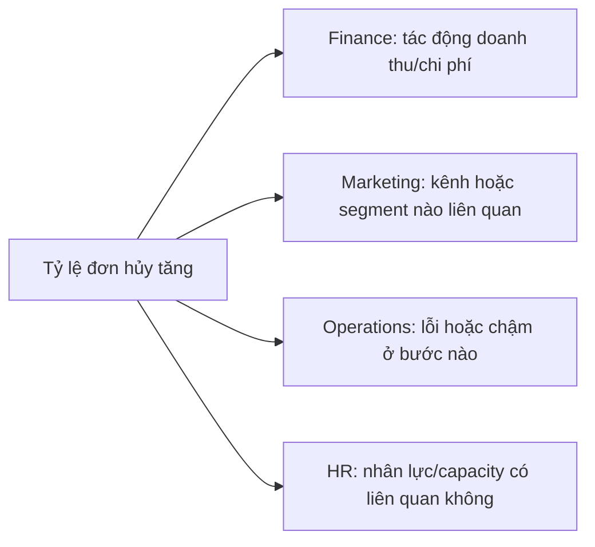

# 004 - Key Business Functions

**Module:** Module 02 - Business Fundamentals - Nền tảng kinh doanh  
**Roadmap item:** 2.4  
**Loại nội dung:** Business fundamentals  
**Thời lượng gợi ý:** 35–55 phút

---

## 1. Tóm tắt

BI Analyst thường làm việc với nhiều phòng ban nhưng mỗi phòng ban nhìn doanh nghiệp qua một lăng kính khác nhau. **Finance** quan tâm đến kết quả tài chính và kiểm soát nguồn lực; **Marketing** tập trung vào thu hút và chuyển đổi khách hàng; **Operations** quan tâm đến hiệu quả quy trình; **HR** theo dõi lực lượng lao động và năng lực tổ chức.

Hiểu các business function giúp BI Analyst đặt đúng business question, chọn metric phù hợp và diễn giải insight bằng ngôn ngữ của stakeholder.

## 2. Mục tiêu học tập

Sau bài học, người học có thể:

- Mô tả vai trò cơ bản của Finance, Marketing, Operations và HR.
- Liên kết từng business function với các câu hỏi phân tích điển hình.
- Nhận diện metric/KPI thường gặp của từng phòng ban.
- Phân biệt cùng một sự kiện kinh doanh khi được nhìn từ nhiều chức năng khác nhau.
- Xây dựng một stakeholder-and-metric map cho một business problem liên phòng ban.

## 3. Vì sao BI Analyst cần hiểu business functions?

BI không tồn tại tách rời khỏi hoạt động kinh doanh. Một bảng dữ liệu chỉ trở nên có nghĩa khi BI Analyst hiểu:

- quy trình nào tạo ra dữ liệu;
- phòng ban nào sở hữu hoặc sử dụng dữ liệu;
- mục tiêu nào đang được theo dõi;
- quyết định nào sẽ được đưa ra.

Ví dụ, cùng một sự kiện “khách hàng hủy đơn” có thể được nhìn theo nhiều góc:

- Finance: doanh thu hoặc chi phí bị ảnh hưởng bao nhiêu?
- Marketing: nhóm khách hàng hoặc kênh nào có tỷ lệ hủy cao?
- Operations: bước nào trong quy trình gây chậm hoặc lỗi?
- HR: năng lực nhân sự hoặc lịch làm việc có liên quan không?

Một BI Analyst giỏi không chỉ biết query dữ liệu mà còn hiểu **ý nghĩa kinh doanh** của các trường và metric.

## 4. Finance

Finance tập trung vào việc theo dõi và quản lý nguồn lực tài chính của tổ chức.

### 4.1. Câu hỏi thường gặp

- Doanh thu đang tăng hay giảm?
- Chi phí nào đang vượt kế hoạch?
- Lợi nhuận hoặc margin thay đổi vì yếu tố nào?
- Kết quả thực tế khác target ở đâu?
- Khoản mục nào cần được điều tra thêm?

### 4.2. Metric và output BI thường gặp

Ví dụ nhóm chỉ số:

- Revenue;
- Cost;
- Profit;
- Margin;
- Budget vs Actual;
- variance theo thời gian hoặc bộ phận.

Output có thể là financial dashboard, variance analysis hoặc executive summary. BI Analyst cần đặc biệt chú ý đến **định nghĩa tài chính**, kỳ báo cáo và phạm vi dữ liệu trước khi so sánh.

## 5. Marketing

Marketing tập trung vào việc tiếp cận thị trường, thu hút khách hàng tiềm năng và hỗ trợ quá trình chuyển đổi.

### 5.1. Câu hỏi thường gặp

- Kênh nào tạo nhiều lead hoặc conversion hơn?
- Campaign nào đang mang lại kết quả tốt?
- Chi phí để có một lead hoặc conversion có thay đổi không?
- Audience nào phản hồi tốt hơn?
- Hiệu suất thay đổi theo thời gian như thế nào?

### 5.2. Metric và output BI thường gặp

Ví dụ nhóm chỉ số:

- impressions hoặc reach;
- clicks;
- leads;
- conversion rate;
- campaign cost;
- cost per lead hoặc cost per conversion.

Output có thể là campaign performance dashboard, channel comparison hoặc funnel analysis.

## 6. Operations

Operations tập trung vào cách doanh nghiệp biến nguồn lực thành sản phẩm hoặc dịch vụ một cách ổn định và hiệu quả.

### 6.1. Câu hỏi thường gặp

- Quy trình đang nghẽn ở đâu?
- Thời gian xử lý có tăng không?
- Tỷ lệ lỗi hoặc backlog có bất thường không?
- Capacity hiện tại có đáp ứng nhu cầu không?
- Team hoặc khu vực nào có hiệu suất thấp hơn?

### 6.2. Metric và output BI thường gặp

Ví dụ nhóm chỉ số:

- cycle time;
- throughput;
- backlog;
- error rate;
- on-time rate;
- utilization hoặc capacity-related metrics.

Output thường là operational dashboard, exception report hoặc process performance analysis.

## 7. HR

HR tập trung vào lực lượng lao động, tuyển dụng, duy trì nhân sự và các hoạt động liên quan đến con người trong tổ chức.

### 7.1. Câu hỏi thường gặp

- Headcount thay đổi như thế nào?
- Bộ phận nào có turnover cao?
- Mất bao lâu để tuyển được một vị trí?
- Tỷ lệ vắng mặt có biến động không?
- Nhu cầu nhân lực có phù hợp với kế hoạch vận hành không?

### 7.2. Metric và output BI thường gặp

Ví dụ nhóm chỉ số:

- headcount;
- turnover;
- time to hire;
- absenteeism;
- hiring pipeline metrics.

Output có thể là workforce dashboard, recruitment funnel hoặc retention analysis.

## 8. So sánh bốn business functions

| Function | Mục tiêu phân tích chính | Ví dụ câu hỏi | Ví dụ metric |
| --- | --- | --- | --- |
| Finance | Kết quả và kiểm soát tài chính | Kết quả lệch kế hoạch ở đâu? | Revenue, Cost, Profit, Margin |
| Marketing | Thu hút và chuyển đổi | Kênh/campaign nào hiệu quả hơn? | Leads, Conversion Rate, Campaign Cost |
| Operations | Hiệu quả quy trình | Quy trình đang nghẽn ở đâu? | Cycle Time, Backlog, Error Rate |
| HR | Năng lực và biến động nhân sự | Nhóm nào có turnover cao? | Headcount, Turnover, Time to Hire |

Không nên hiểu bảng này như một danh sách KPI cố định. Cùng một metric có thể mang ý nghĩa khác nhau tùy mục tiêu, định nghĩa và bối cảnh của tổ chức.

## 9. Khi một business problem đi qua nhiều phòng ban

Các vấn đề thực tế thường không nằm gọn trong một function.

Ví dụ: **tỷ lệ đơn hàng hủy tăng**.

BI Analyst cần tránh kết luận từ một góc nhìn duy nhất. Nếu tỷ lệ hủy tăng ở một khu vực, nguyên nhân có thể liên quan đến chất lượng traffic, tồn kho, vận hành hoặc capacity nhân sự.

## 10. Từ business function đến dữ liệu

Khi nhận yêu cầu từ một phòng ban, hãy đi theo luồng:

1. Xác định mục tiêu của function.
2. Xác định stakeholder và decision maker.
3. Viết business question.
4. Xác định KPI/metric.
5. Xác định dữ liệu và grain cần thiết.
6. Kiểm tra data quality và định nghĩa metric.
7. Phân tích driver.
8. Chuyển kết quả thành recommendation, risk hoặc next action.

Điểm quan trọng là **không bắt đầu từ tool**. Power BI, Tableau, SQL hay spreadsheet chỉ là phương tiện. Bài toán kinh doanh quyết định cách dùng chúng.

## 11. Điểm dễ sai

- Dùng cùng một vocabulary cho mọi phòng ban mà không kiểm tra định nghĩa.
- Giả định metric có cùng ý nghĩa giữa Finance và Marketing.
- Phân tích một function nhưng bỏ qua dependency với function khác.
- Tập trung vào dữ liệu sẵn có thay vì decision question.
- Kết luận từ chart mà chưa kiểm tra data freshness, grain hoặc logic tính.
- Đưa ra insight nhưng không gắn với owner hoặc next action.

## 12. Thực hành: Business Function Map

Chọn một vấn đề kinh doanh, ví dụ:

- doanh thu giảm;
- campaign conversion giảm;
- giao hàng trễ tăng;
- turnover tăng.

Tạo bảng:

| Business function | Business question | Stakeholder | Metric/KPI | Data cần dùng | Action có thể xảy ra |
| --- | --- | --- | --- | --- | --- |
| Finance |  |  |  |  |  |
| Marketing |  |  |  |  |  |
| Operations |  |  |  |  |  |
| HR |  |  |  |  |  |

Không bắt buộc mọi function đều liên quan như nhau. Nếu một function không thực sự liên quan, hãy ghi rõ lý do thay vì cố tạo metric.

**Deliverable**

Tạo một **Business Function Map** và một đoạn **executive summary 5–7 dòng** trả lời:

- vấn đề chính là gì;
- function nào bị ảnh hưởng;
- metric nào cần ưu tiên;
- dữ liệu nào cần kiểm tra thêm;
- stakeholder nên cân nhắc hành động nào tiếp theo.

## 13. Câu hỏi ôn tập

### Câu 1

Phòng ban nào thường quan tâm trực tiếp nhất đến Budget vs Actual?

A. Finance.  
B. Operations.  
C. HR.  
D. Không phòng ban nào.

**Đáp án:** A

**Giải thích:** Budget vs Actual là góc nhìn điển hình của Finance để đánh giá chênh lệch giữa kế hoạch và kết quả thực tế.

### Câu 2

“Quy trình đang nghẽn ở bước nào?” là câu hỏi phù hợp nhất với function nào?

A. Marketing.  
B. HR.  
C. Operations.  
D. Finance.

**Đáp án:** C

**Giải thích:** Operations tập trung vào hiệu quả, chất lượng và luồng của quy trình vận hành.

### Câu 3

Một campaign có nhiều clicks nhưng conversion thấp. BI Analyst nên làm gì?

A. Kết luận ngay rằng campaign thành công vì clicks cao.  
B. Chỉ nhìn chi phí tổng.  
C. Kiểm tra funnel và metric chuyển đổi theo kênh/segment trước khi kết luận.  
D. Bỏ dữ liệu conversion.

**Đáp án:** C

**Giải thích:** Clicks chỉ phản ánh một phần của funnel; cần xem conversion và breakdown để đánh giá hiệu quả kinh doanh.

### Câu 4

Vì sao cùng một vấn đề có thể cần dữ liệu từ nhiều business functions?

A. Vì mọi function luôn có cùng KPI.  
B. Vì nguyên nhân và tác động có thể trải qua nhiều quy trình và phòng ban.  
C. Vì BI Analyst phải dùng tất cả database.  
D. Vì dashboard bắt buộc có bốn tab.

**Đáp án:** B

**Giải thích:** Một vấn đề như đơn hủy tăng có thể liên quan đến acquisition, vận hành, tài chính hoặc capacity, nên cần nhìn theo nhiều góc nếu dữ liệu cho thấy có liên hệ.

### Câu 5

Trình tự nào phù hợp nhất khi BI Analyst nhận yêu cầu từ một phòng ban?

A. Chọn tool → chọn chart → hỏi business question.  
B. Xác định mục tiêu → stakeholder → business question → metric → dữ liệu → insight/action.  
C. Lấy mọi dữ liệu → tạo dashboard → tìm mục tiêu sau.  
D. Chỉ hỏi phòng ban muốn xem màu gì.

**Đáp án:** B

**Giải thích:** BI nên đi từ mục tiêu và quyết định đến dữ liệu, không đi ngược từ tool hoặc chart.

## 14. Tổng kết

Finance, Marketing, Operations và HR có mục tiêu, câu hỏi và metric khác nhau. Hiểu các business function giúp BI Analyst không chỉ “đọc dữ liệu” mà còn hiểu **dữ liệu đại diện cho hoạt động kinh doanh nào** và **ai sẽ dùng insight để ra quyết định**.

Sau bài học, người học nên có một **Business Function Map** cho thấy mối quan hệ giữa vấn đề, stakeholder, metric, dữ liệu và action.
