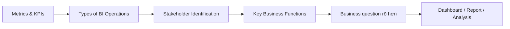

# Module 02 - Business Fundamentals - Nền tảng kinh doanh

Module này xây dựng nền tảng business cần thiết để một BI Analyst chuyển dữ liệu thành quyết định. Trọng tâm không nằm ở một công cụ BI cụ thể mà ở cách xác định **mục tiêu**, **metric/KPI**, **stakeholder**, **cấp độ quyết định** và **business function** trước khi thiết kế query, dashboard hoặc report.

## 1. Mục tiêu module

Sau khi hoàn thành module, người học có thể:

- phân biệt metric và KPI;
- lựa chọn KPI theo business question;
- phân biệt Operational, Tactical và Strategic BI;
- xác định dashboard user và decision maker;
- thu thập nhu cầu stakeholder theo quyết định cần hỗ trợ;
- nhận diện nhu cầu phân tích điển hình của Finance, Marketing, Operations và HR;
- tạo các artifact cơ bản có thể đưa vào portfolio BI Analyst.

## 2. Danh sách bài học

| Roadmap | Bài học | Trọng tâm | Artifact chính |
| --- | --- | --- | --- |
| 2.1 | [001 - Metrics and KPIs](001-metrics-and-kpis.md) | Metric, KPI, cách chọn KPI, KPI theo phòng ban | KPI Tree + Metric/KPI Dictionary |
| 2.2 | [002 - Types of BI Operations](002-types-of-bi-operations.md) | Operational, Tactical, Strategic BI | BI Operation Brief |
| 2.3 | [003 - Stakeholder Identification](003-stakeholder-identification.md) | Dashboard user, decision maker, nhu cầu stakeholder | Stakeholder Map + Dashboard Requirement Brief |
| 2.4 | [004 - Key Business Functions](004-key-business-functions.md) | Finance, Marketing, Operations, HR | Business Function Map |

## 3. Luồng kiến thức



Bốn bài liên kết theo một logic chung:

1. Xác định **đo cái gì** qua metric và KPI.
2. Xác định **quyết định ở cấp nào** qua loại BI.
3. Xác định **ai dùng và ai quyết định** qua stakeholder.
4. Xác định **bối cảnh nghiệp vụ** qua business function.
5. Chuyển toàn bộ thành dashboard, report hoặc analysis phục vụ hành động.

## 4. Cách học đề xuất

Mỗi bài nên được học theo ba lượt:

### Lượt 1 — Hiểu khái niệm

Đọc phần kiến thức cốt lõi và tự diễn giải lại bằng ngôn ngữ của mình.

### Lượt 2 — Áp dụng vào một business case

Chọn một case xuyên suốt, ví dụ:

- doanh thu giảm;
- campaign conversion giảm;
- giao hàng trễ tăng;
- turnover tăng.

Dùng cùng case đó trong cả bốn bài để thấy cách metric, cấp BI, stakeholder và business function liên kết với nhau.

### Lượt 3 — Tạo portfolio artifact

Không dừng ở ghi chú lý thuyết. Sau mỗi bài, tạo artifact nhỏ có thể review và cải thiện.

## 5. Bộ artifact cuối module

Khi hoàn thành Module 02, người học nên có:

- một **KPI Tree**;
- một **Metric/KPI Dictionary**;
- một **BI Operation Brief**;
- một **Stakeholder Map**;
- một **Dashboard Requirement Brief**;
- một **Business Function Map**;
- một executive summary ngắn biến insight thành recommendation hoặc next action.

Các artifact này có thể được kết hợp thành một mini case study trong portfolio BI Analyst.

## 6. Checklist chất lượng chung

Trước khi kết luận một phân tích hoặc dashboard đã hoàn thành, kiểm tra:

- Business question có rõ không?
- Stakeholder và decision maker đã được xác định chưa?
- Metric/KPI có định nghĩa và phạm vi rõ không?
- Data source, grain và freshness có phù hợp không?
- Loại BI là Operational, Tactical hay Strategic?
- Mức chi tiết có phù hợp với người dùng không?
- Insight có chỉ ra driver, risk hoặc vấn đề đáng chú ý không?
- Recommendation có dẫn tới hành động cụ thể không?

## 7. Kết quả mong đợi

Sau module này, người học không chỉ biết tạo chart hoặc query mà có thể bắt đầu một bài toán BI bằng chuỗi tư duy:

```text
Business goal
→ Stakeholder
→ Decision question
→ KPI / Metric
→ Data
→ Analysis
→ Insight
→ Recommendation / Action
```

Đây là nền tảng để các kỹ năng kỹ thuật BI ở những module tiếp theo tạo ra giá trị kinh doanh thay vì chỉ tạo ra báo cáo.
