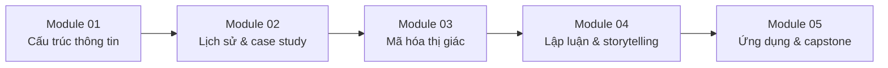

# 00 — Course Map

## Kết quả đầu ra

Sau khi hoàn thành, người học có thể:

1. Giải thích Information Mapping và vì sao “chunking + labeling” giúp tài liệu dễ đọc.
2. Phân tích các ví dụ kinh điển như Minard, John Snow và Florence Nightingale.
3. Chọn biểu đồ theo câu hỏi dữ liệu thay vì theo thói quen.
4. Hiểu thứ bậc độ chính xác của các mã hóa thị giác cơ bản.
5. Dùng màu có chủ đích, không phụ thuộc riêng vào màu để truyền nghĩa.
6. Xây dựng câu chuyện dữ liệu dựa trên giả thuyết, bằng chứng và giới hạn.
7. Đánh giá rủi ro sai lệch khi trực quan hóa dữ liệu y tế, thảm họa, tài chính và giáo dục.

## Lộ trình

## Đề xuất thời lượng

| Module | Nội dung | Thời lượng |
|---|---|---:|
| 01 | Information Mapping & structured writing | 2–3 giờ |
| 02 | Ba case study lịch sử | 3–4 giờ |
| 03 | Perception, chart choice, color | 4–5 giờ |
| 04 | Hypothesis, evidence, narrative | 3 giờ |
| 05 | Ứng dụng + capstone | 4–6 giờ |

## Tiêu chí hoàn thành

Một người học được coi là hoàn thành khi có thể lấy một dataset nhỏ, viết **1 câu hỏi phân tích**, chọn **1 biểu diễn phù hợp**, giải thích **vì sao mã hóa đó dễ đọc**, thêm **annotation có bằng chứng**, và ghi rõ **nguồn + hạn chế dữ liệu**.
