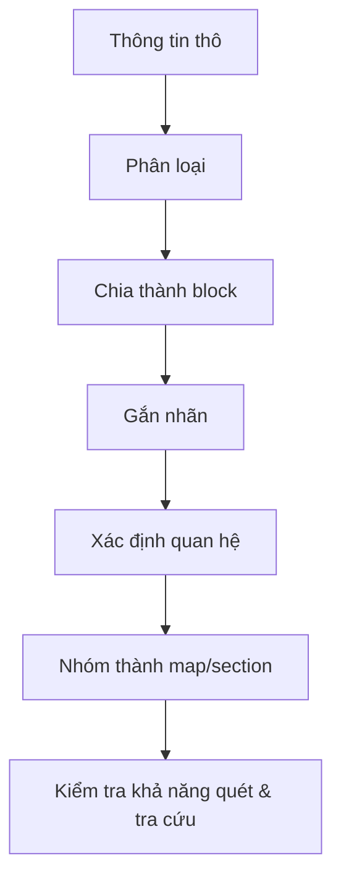

# 01.01 — Information Mapping là gì?

## Mục tiêu bài học

Hiểu Information Mapping như một phương pháp **phân tích, tổ chức và trình bày thông tin** theo các đơn vị nhỏ, có nhãn, có quan hệ rõ ràng; phân biệt nó với “vẽ mind map” hay “làm infographic đẹp”.

## 1. Khái niệm cốt lõi

Information Mapping được Robert E. Horn phát triển từ thập niên 1960. Trong tài liệu kỹ thuật, phương pháp này thay đoạn văn dài bằng các **information block**: đơn vị nội dung nhỏ, có chức năng rõ như định nghĩa, nguyên tắc, ví dụ, quy trình, bảng quyết định hoặc sự kiện.

Điểm quan trọng là: **cấu trúc phải phản ánh nhiệm vụ đọc**. Người đọc tài liệu hướng dẫn thường không đọc từ đầu đến cuối; họ quét tiêu đề, tìm bước cần làm, kiểm tra điều kiện rồi hành động.

## 2. Bốn nguyên tắc thực hành

| Nguyên tắc | Ý nghĩa thực hành |
|---|---|
| Chunking | Chia thông tin thành khối vừa xử lý |
| Labeling | Mỗi khối có nhãn cho biết nó nói về gì |
| Relevance | Chỉ giữ nội dung phục vụ mục tiêu của khối |
| Consistency | Duy trì thuật ngữ và định dạng nhất quán |

## 3. Sơ đồ từ “thông tin thô” đến “bản đồ thông tin”

## 4. Information Mapping không phải gì?

- Không chỉ là sơ đồ tư duy.
- Không đồng nghĩa với data visualization.
- Không phải quy tắc “mỗi đoạn 3 câu”.
- Không phải trang trí tài liệu bằng icon.

Nó là **kiến trúc thông tin ở cấp nội dung**. Trực quan hóa dữ liệu có thể nằm bên trong một information block, nhưng không thay thế cấu trúc tài liệu.

## 5. Ví dụ chuyển đổi

### Trước

> Hệ thống sẽ kiểm tra token. Nếu token hết hạn thì người dùng cần đăng nhập lại. Nếu token hợp lệ thì request tiếp tục. Một số endpoint công khai không yêu cầu token.

### Sau

**Quy tắc xác thực**

| Điều kiện | Hành động |
|---|---|
| Endpoint công khai | Cho phép request |
| Token hợp lệ | Tiếp tục xử lý |
| Token hết hạn/không hợp lệ | Yêu cầu đăng nhập lại |

Cùng một nội dung, nhưng cấu trúc sau giúp người đọc **nhìn điều kiện → hành động** nhanh hơn.

## 6. Bài tập

Chọn một đoạn tài liệu kỹ thuật dài 150–300 từ và tách thành ít nhất 4 block: **Định nghĩa / Nguyên tắc / Quy trình / Ví dụ**. Nếu một block không có chức năng rõ, hãy xem nó có cần tồn tại hay không.

## Tự kiểm tra

- Tôi có thể nói mỗi block “dùng để làm gì” bằng một câu không?
- Tiêu đề block có giúp người đọc đoán đúng nội dung không?
- Có thông tin nào thuộc block khác nhưng đang bị trộn vào không?

## Nguồn đọc thêm

- David K. Farkas, *Explicit Structure in Print and On-Screen Documents* (Technical Communication Quarterly, 2005): https://faculty.washington.edu/farkas/TC510-Fall2011/Farkas-ExplicitStructure-TCQ05.pdf
- Robert E. Horn, *Information Mapping: How It Helps Task Analysis*: https://files.eric.ed.gov/fulltext/ED126314.pdf
