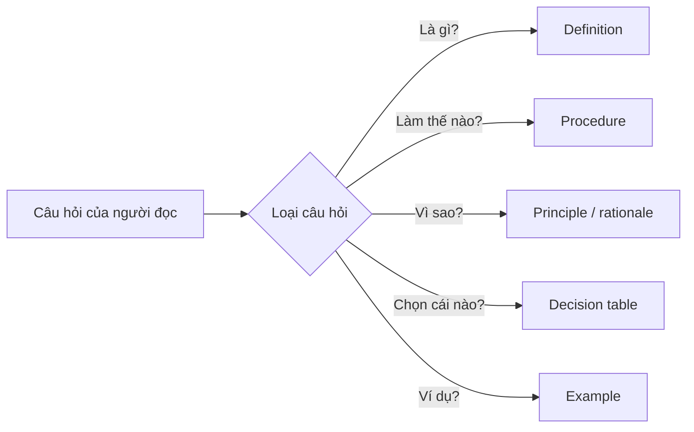

# 01.02 — Information Blocks và Structured Writing

## Mục tiêu bài học

Biết cách biến một chủ đề rộng thành hệ thống bài học nhỏ, nhất quán và có thể tái sử dụng — chính là cách bộ course Markdown này được tổ chức.

## 1. Từ paragraph sang block

Đoạn văn là đơn vị ngôn ngữ; block là đơn vị **chức năng**. Một block tốt trả lời một kiểu câu hỏi cụ thể:

- **Definition** — “X là gì?”
- **Fact** — “Điều gì đã xảy ra / số liệu là gì?”
- **Principle** — “Quy tắc chung là gì?”
- **Procedure** — “Làm thế nào?”
- **Process** — “Hệ thống vận hành ra sao?”
- **Decision** — “Khi nào chọn A hay B?”
- **Example** — “Trường hợp cụ thể trông như thế nào?”

## 2. Quy tắc một block — một ý định đọc



Khi hai ý định đọc khác nhau nằm trong cùng một block, người đọc phải tự “giải nén” cấu trúc — làm tăng tải nhận thức.

## 3. Tổ chức phân tầng

Một cấu trúc học liệu dễ mở rộng thường có dạng:

```text
Course
└── Module
    └── Lesson
        ├── Concept
        ├── Principle
        ├── Example
        ├── Practice
        └── References
```

Đánh số (`01`, `02`, `03`) giúp thứ tự ổn định trên hệ thống file, Git và LMS.

## 4. Khi nào nên dùng bảng, sơ đồ hay văn bản?

| Nhu cầu | Định dạng phù hợp |
|---|---|
| So sánh thuộc tính | Bảng |
| Thể hiện trình tự | Flowchart |
| Thể hiện quan hệ thành phần | Diagram / tree |
| Trình bày lập luận | Văn bản ngắn + heading |
| Hướng dẫn thao tác | Steps + điều kiện |
| Chọn theo điều kiện | Decision table |

Nguyên tắc: **định dạng phải giảm công suy luận của người đọc**, không phải làm trang trông “nhiều visual” hơn.

## 5. Checklist biên tập Markdown

1. Một H1 duy nhất cho title.
2. H2 cho các khối lớn; H3 khi thật sự cần.
3. Không tạo heading chỉ để trang trí.
4. Bảng phải có mục đích so sánh rõ ràng.
5. Code, công thức, Mermaid đặt trong fenced block.
6. Link nguồn ở cuối lesson hoặc ngay sau dữ kiện nhạy cảm.
7. Tên file không dấu, tránh khoảng trắng nếu repo cần tương thích đa hệ thống.

## Bài tập

Tạo một lesson Markdown về “Git rebase” hoặc “CNN convolution” chỉ với 6 block chức năng. Sau đó thử tìm lại một thông tin cụ thể trong 10 giây. Nếu khó tìm, sửa heading và thứ tự block.

## Nguồn đọc thêm

- Colorado State University, *Technical Writing / Structured Writing*: https://wac.colostate.edu/docs/books/writingspaces6/technical.pdf
- Farkas (2005): https://faculty.washington.edu/farkas/TC510-Fall2011/Farkas-ExplicitStructure-TCQ05.pdf
