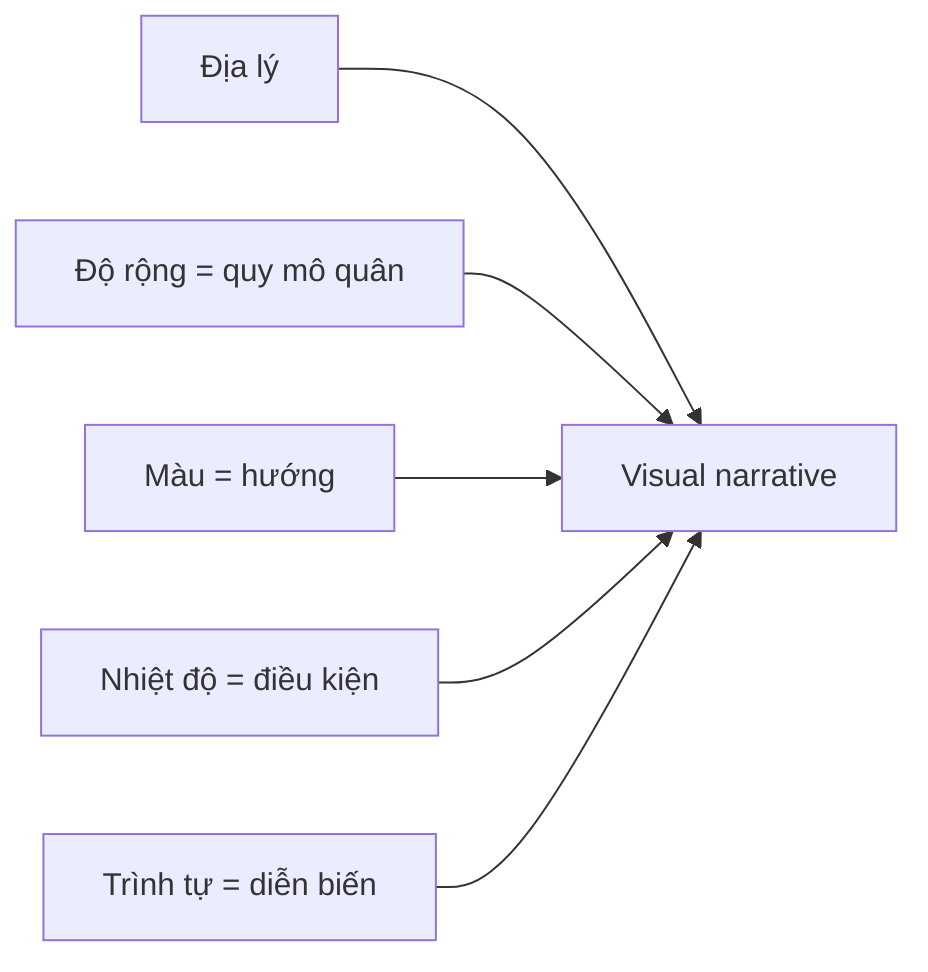

# 02.01 — Minard và chiến dịch Nga 1812: một hình, nhiều biến

## Mục tiêu bài học

Phân tích cách Charles Joseph Minard kết hợp **địa lý, hướng di chuyển, số quân và nhiệt độ** trong một đồ họa duy nhất về chiến dịch Nga của Napoleon.

## 1. Vì sao case này quan trọng?

Bản đồ của Minard (1869) thường được nhắc như một ví dụ nổi bật của đồ họa đa biến. Điểm đáng học không phải danh tiếng của tác phẩm, mà là cách **mỗi đặc tính thị giác gánh một phần thông tin**.

*Nguồn ảnh: Wikimedia Commons, tác phẩm gốc của Charles Joseph Minard; xem thông tin giấy phép trong `references/02_image_licenses.md`.*

## 2. Những biến được mã hóa

| Biến | Cách thể hiện |
|---|---|
| Vị trí | Trên bản đồ |
| Hướng tiến / rút | Hai dải màu khác nhau |
| Quy mô quân | Độ rộng dải |
| Thời gian/địa điểm | Trình tự theo tuyến |
| Nhiệt độ khi rút | Đồ thị bên dưới |

## 3. Sơ đồ đọc đồ họa

## 4. Bài học thiết kế

### Mã hóa phải có vai trò

Nếu bỏ một kênh thị giác mà ý nghĩa vẫn nguyên vẹn, kênh đó có thể là trang trí. Ngược lại, trong Minard, độ rộng của dải là dữ liệu; nó không đơn thuần là “nét vẽ đẹp”.

### Kể chuyện nhưng không bỏ dữ liệu gốc

Đồ họa tạo cảm giác diễn biến theo thời gian, nhưng vẫn cho phép người xem tra cứu vị trí và quy mô tương đối. Storytelling tốt không có nghĩa là biến chart thành poster.

### Context giúp giải thích biến động

Nhiệt độ được đặt cạnh hành trình rút quân, tạo bối cảnh để người đọc xem xét mối liên hệ. Tuy nhiên, **trực quan hóa không tự động chứng minh quan hệ nhân quả**.

## 5. Bài tập phân tích

Hãy chọn một log hệ thống hoặc chuỗi training ML và thử ánh xạ:

- X = thời gian
- Y = throughput hoặc loss
- độ rộng/kích thước = workload
- màu = phase hoặc trạng thái
- annotation = sự kiện quan trọng

Mục tiêu là kể được “quá trình” mà không che mất giá trị định lượng.

## Nguồn

- Smithsonian Libraries, *The Minard System*: https://www.si.edu/object/minard-system-complete-statistical-graphics-charles-joseph-minard-collection-ecole-nationale-des%3Asiris_sil_1094659
- Wikimedia Commons, `Minard.png`: https://commons.wikimedia.org/wiki/File:Minard.png
