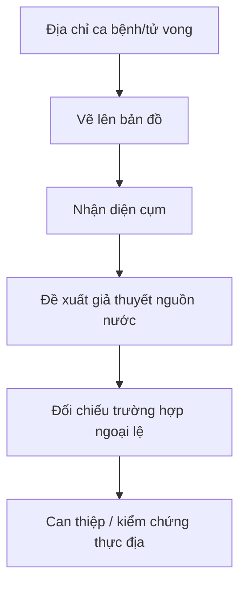

# 02.02 — John Snow và bản đồ dịch tả: từ vị trí đến giả thuyết

## Mục tiêu bài học

Hiểu cách dữ liệu không gian hỗ trợ phát hiện **mẫu phân bố**, nhưng cần kết hợp quan sát, điều tra và lập luận để đi từ “cluster” đến giả thuyết nguyên nhân.

## 1. Case Broad Street

Trong đợt dịch tả Soho năm 1854, John Snow lập bản đồ các ca tử vong theo vị trí. Các dấu trên bản đồ tập trung quanh khu vực bơm nước Broad Street, trở thành một phần quan trọng trong cuộc điều tra về nguồn lây qua nước.

*Nguồn ảnh: Wellcome Collection qua Wikimedia Commons, CC BY 4.0.*

## 2. Từ dữ liệu đến lập luận

Điểm cần nhớ: **cluster không đồng nghĩa nguyên nhân**. Một cụm có thể xuất hiện do mật độ dân cư, cách lấy mẫu hoặc nhiều biến nhiễu khác.

## 3. Ba lớp của một bản đồ phân tích

1. **Base map** — đường phố, ranh giới, địa điểm.
2. **Data layer** — ca bệnh, mật độ, tỷ lệ hoặc giá trị.
3. **Context/annotation** — bơm nước, thời gian, giả thuyết, ngoại lệ.

Thiếu lớp 3, người xem có thể thấy pattern nhưng không hiểu câu hỏi phân tích. Thiếu lớp 2, ta chỉ có bản đồ địa lý thông thường.

## 4. Count và rate khác nhau

Một lỗi phổ biến là tô màu khu vực theo **số ca tuyệt đối** mà bỏ qua quy mô dân số. Nếu mục tiêu là so sánh rủi ro giữa vùng, thường cần rate hoặc standardized rate. Count vẫn hữu ích khi câu hỏi là “tổng tải” hoặc “số nguồn lực cần phân bổ”.

## 5. Bài tập

Giả sử có 5 quận với số ca bệnh và dân số. Hãy tạo hai bản đồ khái niệm:

- Bản đồ A: số ca tuyệt đối.
- Bản đồ B: ca trên 100.000 dân.

Viết 3 câu về việc kết luận có thể thay đổi như thế nào giữa hai bản đồ.

## Nguồn

- Wellcome Collection, *Plan Showing the Ascertained Deaths from Cholera*: https://wellcomecollection.org/works/dx4prdbj
- London Museum, *John Snow: Cholera & the Broad Street pump*: https://www.londonmuseum.org.uk/collections/london-stories/john-snow-cholera-broad-street-pump/
