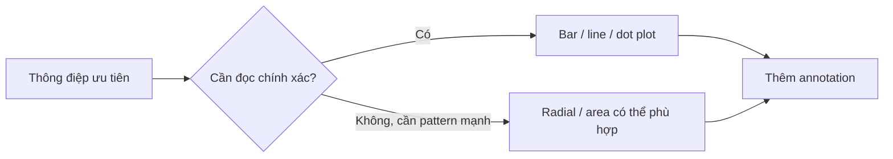

# 02.03 — Florence Nightingale và Coxcomb: trực quan hóa để hỗ trợ quyết định

## Mục tiêu bài học

Hiểu cách một biểu đồ có thể kết hợp **thống kê, thời gian và mục tiêu truyền thông**, đồng thời nhận ra giới hạn của biểu đồ radial khi so sánh định lượng chính xác.

## 1. Coxcomb / polar-area diagram

Florence Nightingale sử dụng các biểu đồ dạng cực để trình bày nguyên nhân tử vong của binh sĩ trong Chiến tranh Krym. Một phiên bản nổi tiếng phân biệt bệnh có thể phòng ngừa, vết thương và các nguyên nhân khác theo tháng.

*Nguồn ảnh: Wikimedia Commons, public domain.*

## 2. Vì sao biểu đồ có sức thuyết phục?

- Cho thấy thay đổi theo tháng.
- Dùng diện tích để nhấn mạnh quy mô.
- Cho phép so sánh tương đối nguyên nhân tử vong.
- Gắn thống kê với thông điệp cải thiện vệ sinh và chăm sóc.

## 3. Nhưng diện tích không phải kênh chính xác nhất

Nghiên cứu về graphical perception sau này cho thấy con người thường so sánh **vị trí trên cùng một trục** chính xác hơn so với diện tích hay góc. Vì vậy, nếu mục tiêu là đọc số gần chính xác, bar/line chart có thể phù hợp hơn.

## 4. Bài học quan trọng

Trực quan hóa tốt không chỉ “đúng số”. Nó phải phù hợp với **nhiệm vụ của người xem**: tra cứu chính xác, phát hiện pattern, so sánh, hay thuyết phục người ra quyết định chú ý đến một vấn đề.

## 5. Bài tập

Lấy một dữ liệu theo tháng (ví dụ số lỗi production theo loại) và tạo hai thiết kế trên giấy:

1. Stacked bar chart.
2. Polar-area chart.

Viết ngắn: thiết kế nào giúp so sánh số tốt hơn, thiết kế nào tạo ấn tượng pattern tốt hơn, và rủi ro hiểu sai của mỗi loại.

## Nguồn

- Wikimedia Commons, *Coxcomb.jpg*: https://commons.wikimedia.org/wiki/File:Coxcomb.jpg
- WHO, *Tools for making good data visualizations*: https://www.who.int/europe/publications/i/item/WHO-EURO-2021-1998-41753-57181
