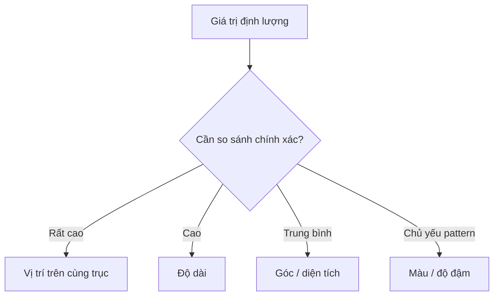

# 03.01 — Graphical Perception: mắt đọc biểu đồ như thế nào?

## Mục tiêu bài học

Hiểu vì sao một số cách mã hóa số liệu dễ so sánh hơn các cách khác và dùng nguyên tắc đó để chọn chart.

## 1. Graphical perception

Cleveland và McGill mô tả graphical perception là quá trình người xem **giải mã thông tin định lượng từ biểu đồ**. Họ nghiên cứu các tác vụ thị giác cơ bản và đề xuất ưu tiên những tác vụ mà con người thực hiện chính xác hơn.

Một thứ bậc thực hành thường dùng:

1. Vị trí trên cùng một thang đo.
2. Vị trí trên các thang không thẳng hàng.
3. Độ dài / hướng / góc.
4. Diện tích.
5. Thể tích / độ cong.
6. Độ đậm hay saturation của màu.

## 2. Sơ đồ lựa chọn mã hóa

## 3. Hệ quả cho chart phổ biến

| Chart | Tác vụ chính | Nhận xét |
|---|---|---|
| Dot plot | Position | Tốt cho so sánh chính xác |
| Bar chart | Position + length | Dễ đọc, quen thuộc |
| Line chart | Position + slope | Tốt cho xu hướng theo thứ tự/thời gian |
| Pie chart | Angle/area | Khó so sánh lát gần nhau |
| Bubble chart | Area | Hữu ích cho overview, kém chính xác hơn |
| Choropleth | Color/lightness | Tốt cho spatial pattern, không tốt cho đọc số chính xác |

## 4. “Đẹp” không đồng nghĩa “dễ đọc”

3D bar, perspective và hiệu ứng glow có thể khiến giá trị khó ước lượng. Khi thêm hiệu ứng, hãy hỏi: **người xem có đọc dữ liệu tốt hơn không?** Nếu câu trả lời là không, hiệu ứng có thể đang cạnh tranh với dữ liệu.

## 5. Bài tập

Cho 8 giá trị gần nhau. Hãy biểu diễn bằng pie chart và dot plot. Không nhìn nhãn số, thử xếp thứ tự từ lớn đến nhỏ. Ghi lại loại chart nào giúp làm việc đó nhanh hơn.

## Nguồn

- Cleveland & McGill (1984), *Graphical Perception*: https://doi.org/10.1080/01621459.1984.10478080
- Cornell INFO 3312/5312 lecture notes: https://info3312.infosci.cornell.edu/slides/04-graphical-perception.html
