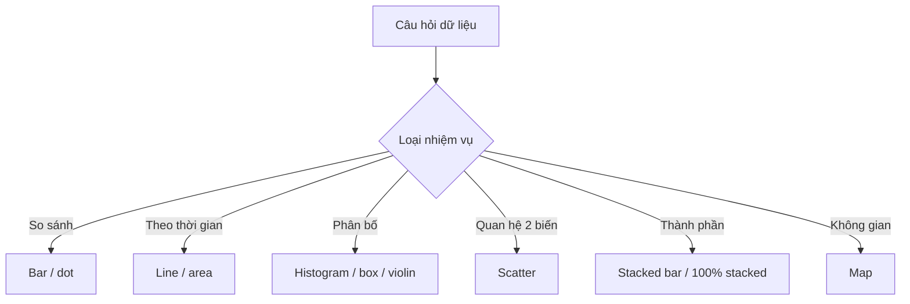

# 03.02 — Chọn biểu đồ theo câu hỏi, không theo sở thích

## Mục tiêu bài học

Biết chuyển một câu hỏi phân tích thành loại chart phù hợp dựa trên **semantic của dữ liệu** và **nhiệm vụ người xem**.

## 1. Bắt đầu từ câu hỏi

Không nên hỏi “chart nào đẹp?” trước. Hãy hỏi:

- Tôi muốn **so sánh**?
- Tôi muốn thấy **xu hướng**?
- Tôi muốn thấy **phân bố**?
- Tôi muốn thấy **mối quan hệ**?
- Tôi muốn thấy **thành phần**?
- Tôi muốn thấy **không gian địa lý**?

## 2. Decision tree

## 3. Một chart không phù hợp với mọi tình huống

WHO Data Design Language nhấn mạnh việc chọn biểu diễn dựa trên **dimensions, information focus và usage context**. Cùng một dataset có thể cần chart khác khi câu hỏi khác.

Ví dụ với doanh thu theo tháng và khu vực:

- “Tổng doanh thu thay đổi ra sao?” → line chart.
- “Khu vực nào cao nhất trong tháng 8?” → bar chart.
- “Tỷ trọng vùng thay đổi ra sao?” → 100% stacked area/bar, dùng cẩn thận.
- “Doanh thu phân bố theo điểm bán ở đâu?” → map, nếu không gian thực sự liên quan.

## 4. Table vẫn là một visualization hợp lệ

Nếu người dùng cần **tra cứu chính xác nhiều giá trị**, table thường tốt hơn chart. Chart tốt cho pattern; table tốt cho lookup. Nhiều dashboard hiệu quả dùng cả hai.

## 5. Bài tập

Với dataset `date, city, temperature, humidity, alert`, hãy chọn chart cho 4 câu hỏi khác nhau và giải thích mỗi lựa chọn bằng 2 câu.

## Nguồn

- WHO Data Design Language — Charts: https://apps.who.int/gho/data/design-language/charts/
- WHO Data Design Principles: https://data.who.int/about/datadot/data-design-principles
