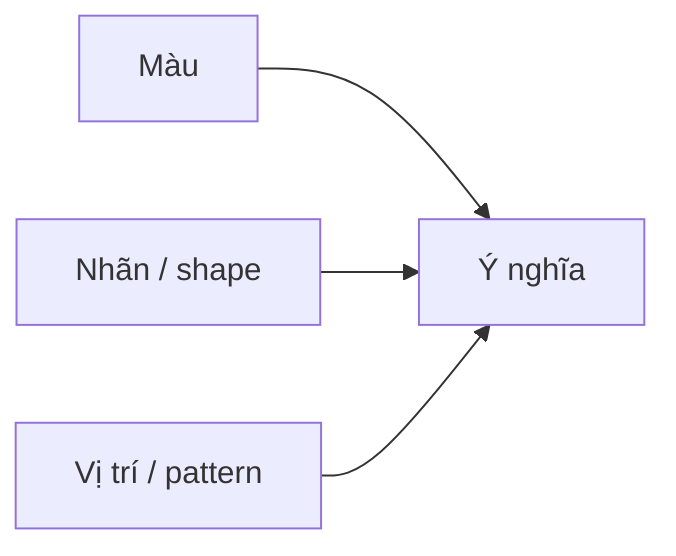

# 03.03 — Màu sắc, ngữ nghĩa và accessibility

## Mục tiêu bài học

Dùng màu để hỗ trợ phân nhóm và nhấn mạnh mà không làm thông tin phụ thuộc hoàn toàn vào khả năng phân biệt màu.

## 1. Ba kiểu palette cơ bản

| Kiểu | Khi dùng | Ví dụ |
|---|---|---|
| Categorical | Nhóm không có thứ tự | Loại sản phẩm |
| Sequential | Giá trị từ thấp → cao | Mật độ, tỷ lệ |
| Diverging | Có điểm giữa có nghĩa | Lệch so với baseline |

## 2. Không dùng hue để giả vờ có thứ tự

Màu đỏ, xanh, tím không tự tạo ra thứ tự định lượng. Với dữ liệu thấp → cao, nên dùng lightness/saturation có quy luật hoặc palette sequential phù hợp.

## 3. Không truyền nghĩa chỉ bằng màu

WCAG khuyến nghị không dùng màu như phương tiện duy nhất để truyền thông tin. Hãy bổ sung ít nhất một trong các tín hiệu:

- nhãn trực tiếp;
- icon;
- pattern;
- hình dạng marker;
- line style;
- text annotation.

## 4. Highlight có chọn lọc

Nếu mọi thứ đều nổi bật thì không còn thứ gì nổi bật. Một dashboard thường hiệu quả hơn khi phần lớn dữ liệu dùng màu trung tính, chỉ một số điểm cần chú ý được nhấn.

## 5. Kiểm tra accessibility tối thiểu

1. Xem chart ở grayscale.
2. Kiểm tra contrast của text/label.
3. Không dùng cặp màu khó phân biệt làm tín hiệu duy nhất.
4. Với map, thêm legend rõ ràng và chú thích đơn vị.
5. Với trạng thái critical/warning/success, thêm text hoặc icon.

## Bài tập

Thiết kế một chart 5 series. Sau đó bỏ toàn bộ legend và thử xem mỗi series còn nhận ra được nhờ direct labels hay không. Nếu không, cải thiện thiết kế.

## Nguồn

- W3C WCAG 2.2 — Use of Color: https://www.w3.org/WAI/WCAG22/Understanding/use-of-color
- WHO Data Design Language: https://data.who.int/about/datadot/data-design-language
