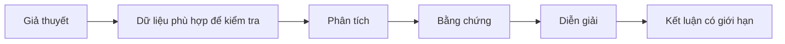

# 04.01 — Từ giả thuyết đến bằng chứng và câu chuyện dữ liệu

## Mục tiêu bài học

Biết phân biệt **giả thuyết**, **bằng chứng**, **diễn giải** và **kết luận** để tránh biến chart thành công cụ hợp thức hóa điều ta đã muốn tin từ trước.

## 1. Bốn lớp lập luận

Một visualization có thể làm bằng chứng dễ nhìn hơn, nhưng không sửa được:

- sampling bias;
- confounder;
- sai đơn vị;
- thiếu baseline;
- data leakage;
- correlation bị diễn giải thành causation.

## 2. Storytelling không phải “chọn dữ liệu có lợi”

Một câu chuyện dữ liệu tốt thường gồm:

1. **Context** — vấn đề và phạm vi.
2. **Question** — câu hỏi cụ thể.
3. **Evidence** — dữ liệu/charts liên quan.
4. **Tension** — pattern hoặc bất thường.
5. **Interpretation** — điều có thể giải thích.
6. **Limits** — điều chưa chứng minh được.
7. **Action** — quyết định nào được hỗ trợ.

## 3. Annotation là cầu nối

Title chỉ nên nói “chart là gì” nếu người xem cần tự khám phá. Khi mục tiêu là truyền đạt insight, có thể dùng title/annotation nêu rõ pattern quan trọng — nhưng phải để người đọc nhìn thấy dữ liệu đứng sau nhận định đó.

## 4. Ví dụ

Sai: **“Chiến dịch marketing làm doanh thu tăng 40%.”**

Tốt hơn: **“Doanh thu tăng 40% sau thời điểm bắt đầu chiến dịch; dữ liệu hiện tại chưa tách được tác động của mùa vụ và thay đổi giá.”**

Câu thứ hai giữ được insight nhưng không vượt quá bằng chứng.

## 5. Bài tập

Lấy một chart bất kỳ trên mạng. Viết lại tiêu đề theo ba cấp:

- mô tả trung tính;
- insight có bằng chứng;
- claim quá mức.

Sau đó chỉ ra đâu là ranh giới giữa “phân tích” và “suy đoán”.

## Nguồn

- WHO Data Design Principles — realistic / transparent data: https://data.who.int/about/datadot/data-design-principles
- WHO Data Principles — transparency and provenance: https://www.who.int/data/principles
