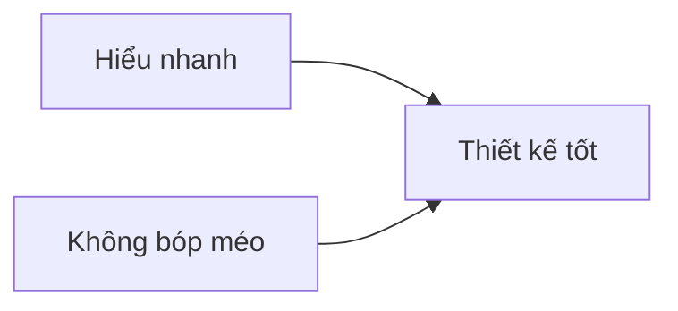

# 04.02 — Trực quan hóa trong báo chí và tài chính: tốc độ không được đánh đổi tính đúng

## Mục tiêu bài học

Phân tích yêu cầu đặc thù của visualization trong môi trường báo chí, dashboard tài chính và nội dung thời sự — những nơi người đọc cần hiểu nhanh nhưng hậu quả của cách biểu diễn sai có thể lớn.

## 1. Hai mục tiêu cạnh tranh

Nội dung báo chí thường tối ưu cho thời gian đọc ngắn. Dashboard tài chính lại cần cập nhật nhanh và so sánh nhiều biến. Cả hai đều dễ mắc lỗi “thổi phồng” biến động.

## 2. Trục và baseline

Bar chart thường cần baseline 0 để độ dài phản ánh độ lớn. Line chart không phải lúc nào cũng cần bắt đầu từ 0, nhưng trục bị cắt có thể phóng đại biến động. Vì vậy phải nhìn **mục tiêu biểu diễn** và **ghi rõ phạm vi trục**.

## 3. Index, percentage và absolute value

Ba con số này trả lời câu hỏi khác nhau:

- Giá trị tuyệt đối: quy mô.
- Phần trăm thay đổi: tốc độ tương đối.
- Index (base = 100): so sánh quỹ đạo từ một mốc chung.

Không nên thay đổi giữa chúng mà không nói rõ.

## 4. Thời gian và cherry-picking

Chọn điểm bắt đầu khác nhau có thể tạo câu chuyện khác nhau. Khi dữ liệu tài chính hoặc kinh tế nhạy với cửa sổ thời gian, nên:

- nêu rõ start/end date;
- cho phép xem nhiều horizon nếu dashboard tương tác;
- tránh chỉ chọn window làm claim trông mạnh nhất.

## 5. Một template an toàn

**Headline:** Pattern chính, có phạm vi thời gian.

**Chart:** Tối giản, trục và đơn vị rõ.

**Annotation:** Sự kiện có nguồn.

**Footnote:** Data source, frequency, missing data, inflation adjustment nếu liên quan.

## Bài tập

Vẽ cùng một chuỗi 24 tháng theo ba cách: absolute, % change MoM, index=100. Viết một câu mô tả đúng cho từng chart và chỉ ra câu nào không thể suy ra từ hai chart còn lại.

## Nguồn

- WHO guidance on clear, straightforward visualizations: https://apps.who.int/gho/data/design-language/principles/straightforward/
- Cleveland & McGill (1984): https://doi.org/10.1080/01621459.1984.10478080
