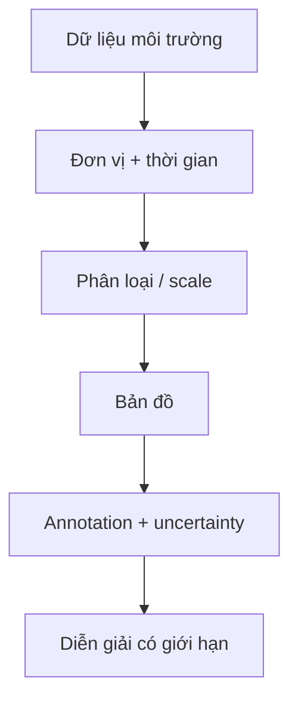

# 05.01 — Case ứng dụng: y tế, thảm họa và giáo dục

## Mục tiêu bài học

Áp dụng nguyên tắc visualization vào các bối cảnh có rủi ro cao: public health, thảm họa môi trường và hạ tầng giáo dục.

## 1. Public health — dữ liệu phải đi kèm phạm vi

WHO nhấn mạnh rằng data presentation cần rõ ràng về **coverage, precision, provenance và context**. Một biểu đồ ca bệnh mà không nói rõ population, thời gian, phương pháp thu thập hoặc missing data có thể dẫn đến diễn giải sai.

## 2. Chernobyl — bản đồ không chỉ là “vùng màu”

UNSCEAR công bố các bản đồ lắng đọng caesium-137 và nhiều dữ liệu về phơi nhiễm sau tai nạn Chernobyl. Khi đọc bản đồ thảm họa, cần phân biệt:

- mức đo được tại thời điểm nào;
- đơn vị;
- ngưỡng phân loại;
- phạm vi không gian;
- mô hình hay phép đo thực địa;
- độ bất định.

Nguồn bản đồ tham khảo: https://www.unscear.org/unscear/en/areas-of-work/chernobyl.html

## 3. Giáo dục / hạ tầng mạng — count không đủ

Với ví dụ kiểu “Wi‑Fi trong hàng trăm trường học”, câu hỏi không nên chỉ là **bao nhiêu access point**. Các metric có thể gồm:

- số trường được phủ;
- % khu vực đạt RSSI mục tiêu;
- concurrent users;
- throughput/user;
- downtime;
- latency;
- số incident;
- mức độ sử dụng theo thời gian.

Một con số tổng lớn có thể che giấu trường có trải nghiệm rất kém.

## 4. Chọn chart theo loại quyết định

| Quyết định | Chart gợi ý |
|---|---|
| Tìm vùng bất thường | Map + anomaly list |
| Theo dõi xu hướng | Line chart |
| So sánh trường / bệnh viện | Dot/bar plot |
| Xem phân bố latency | Histogram/boxplot |
| Xem quan hệ tải–latency | Scatter plot |

## 5. Bài tập

Thiết kế dashboard một trang cho tình huống “600 trường học”. Chỉ dùng tối đa 4 chart. Với mỗi chart, ghi **decision it supports**. Nếu không gắn được với quyết định, bỏ chart đó.

## Nguồn

- UNSCEAR — The Chornobyl Accident: https://www.unscear.org/unscear/en/areas-of-work/chernobyl.html
- WHO Data Principles: https://www.who.int/data/principles
- WHO Data Design Language: https://data.who.int/about/datadot/data-design-language
