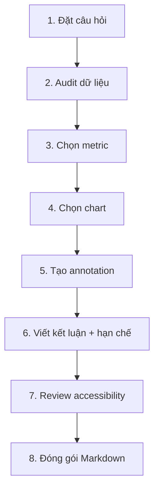

# 05.02 — Capstone: biến một dataset thành câu chuyện có thể kiểm chứng

## Mục tiêu

Hoàn thành một mini-project end-to-end, áp dụng Information Mapping + Data Visualization + Evidence-based Storytelling.

## Đề bài

Chọn một dataset có ít nhất:

- 1 biến thời gian hoặc không gian;
- 1 biến định lượng;
- 1 biến phân nhóm;
- tối thiểu 100 dòng.

Có thể dùng dữ liệu thời tiết, IoT, logs, tài chính giả lập, dữ liệu học tập hoặc public-health dataset công khai.

## Quy trình bắt buộc



## Deliverables

```text
capstone/
├── README.md
├── 01_question.md
├── 02_data_audit.md
├── 03_analysis.md
├── 04_visual_story.md
├── 05_limitations.md
└── assets/
```

## Rubric tự chấm

| Tiêu chí | Đạt khi... |
|---|---|
| Câu hỏi | cụ thể, có thể kiểm tra bằng dữ liệu |
| Metric | đúng đơn vị và population |
| Chart | phù hợp nhiệm vụ thị giác |
| Màu | có mục đích và không là tín hiệu duy nhất |
| Annotation | chỉ ra evidence, không bịa nguyên nhân |
| Nguồn | có provenance rõ |
| Hạn chế | nêu được ít nhất 2 giới hạn |
| Cấu trúc | mỗi Markdown có vai trò riêng |

## Checklist cuối

- [ ] Title nói đúng điều chart thể hiện.
- [ ] Axis/units rõ.
- [ ] Không dùng 3D/perspective gây méo.
- [ ] Không cherry-pick thời gian mà không giải thích.
- [ ] Không đổi count ↔ rate mà không báo.
- [ ] Không kết luận causal từ correlation đơn thuần.
- [ ] Có nguồn dữ liệu.
- [ ] Có ít nhất một đoạn “Limitations”.
- [ ] Markdown có hierarchy dễ duyệt.

## Bài mở rộng

Tạo hai phiên bản cùng một insight:

1. **Exploratory** — cho analyst, nhiều context hơn.
2. **Explanatory** — cho người ra quyết định, ít chart hơn nhưng annotation rõ hơn.

So sánh hai phiên bản và giải thích vì sao khác nhau.
