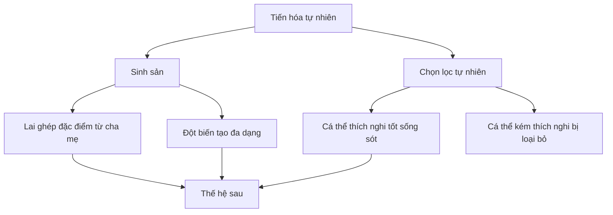
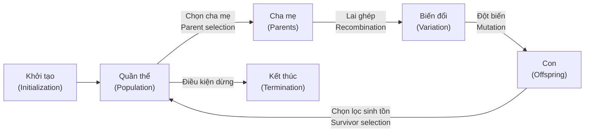
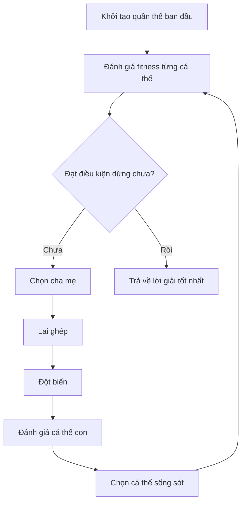
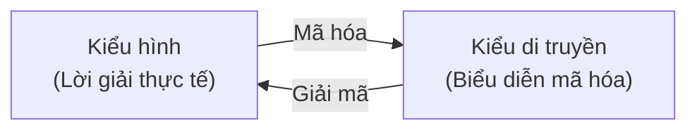
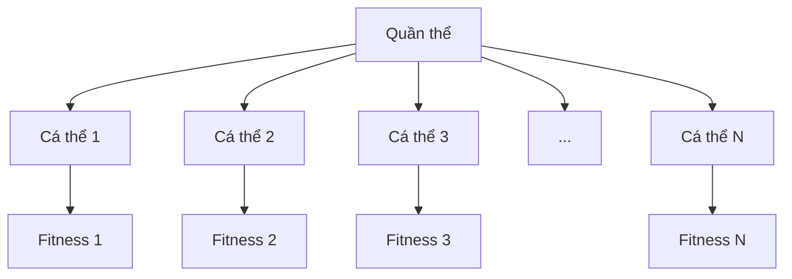
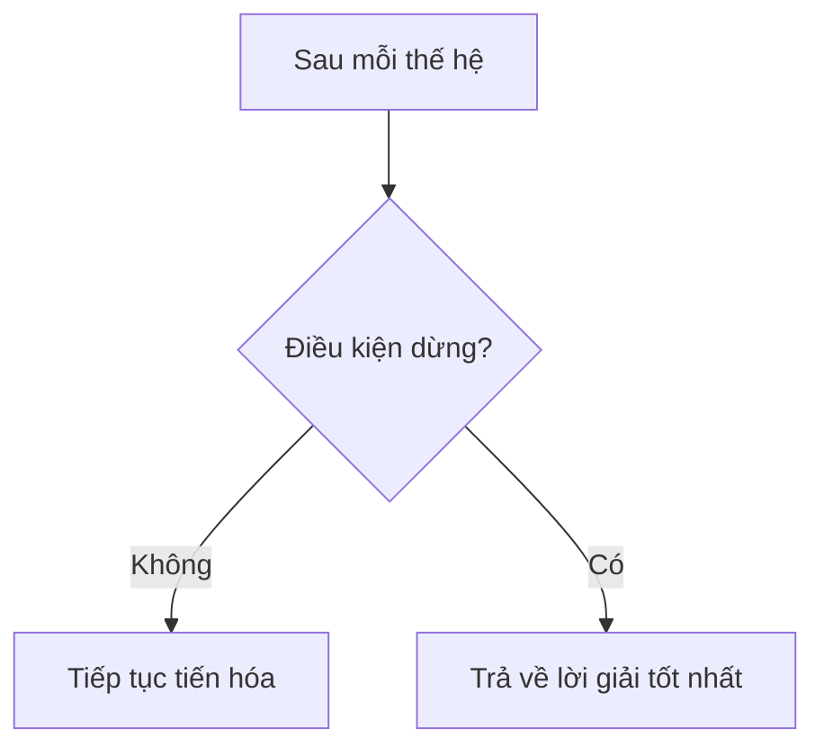
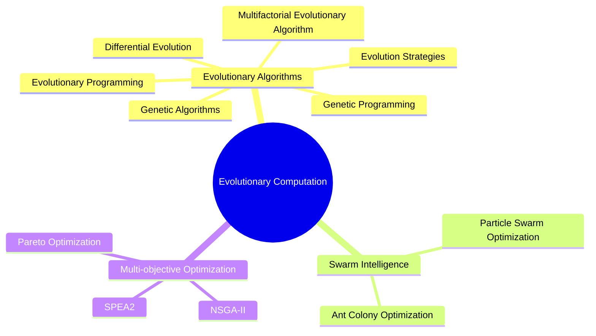
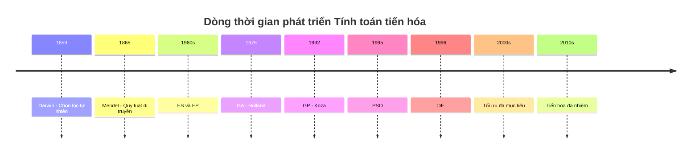
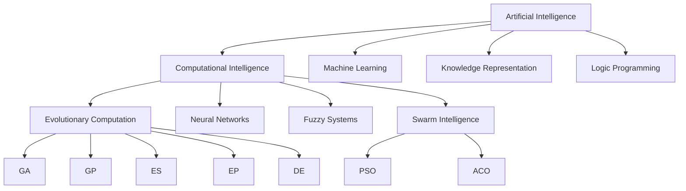
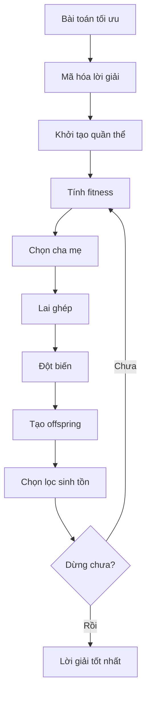

# Chương 1: Giới Thiệu Tính Toán Tiến Hóa

## Mục tiêu bài học

Sau chương này, người học có thể:

* Hiểu **Tính toán tiến hóa** là gì và vì sao nó được dùng để giải các bài toán tối ưu khó.
* Nắm được mối liên hệ giữa **tiến hóa tự nhiên** và **giải thuật tiến hóa**.
* Mô tả được khung tổng quát của một **Evolutionary Algorithm – EA**.
* Phân biệt các thành phần chính: **quần thể, cá thể, fitness, chọn lọc, lai ghép, đột biến, chọn lọc sinh tồn**.
* Nhận biết các nhánh phổ biến của EC như **GA, GP, EP, ES, DE, PSO, ACO, MFEA**.
* Biết khi nào nên dùng giải thuật tiến hóa thay vì thuật toán tối ưu truyền thống.

---

## 1. Bài toán tối ưu

Trong thực tế, rất nhiều vấn đề có thể phát biểu dưới dạng **bài toán tối ưu**.

Ví dụ:

* Tìm đường đi ngắn nhất.
* Lập lịch thi sao cho ít xung đột nhất.
* Tối ưu chi phí sản xuất.
* Tối ưu kiến trúc mạng nơ-ron.
* Tìm chiến lược tốt nhất trong game.
* Tối ưu danh mục đầu tư.

### Định nghĩa

Một **bài toán tối ưu** là bài toán cần tìm lời giải tốt nhất trong tập các lời giải khả thi.

Với bài toán tối thiểu hóa, ta cần tìm:

```text
x* ∈ X sao cho f(x*) ≤ f(x), với mọi x ∈ X
```

Trong đó:

| Ký hiệu     | Ý nghĩa                                              |                         |
| ----------- | ---------------------------------------------------- | ----------------------- |
| `X`         | Tập lời giải khả thi, còn gọi là không gian tìm kiếm |                         |
| `x`         | Một lời giải ứng viên                                |                         |
| `x*`        | Lời giải tối ưu                                      |                         |
| `f(x)`      | Hàm mục tiêu hoặc hàm chi phí                        |                         |
| `f(x*)`     | Giá trị tối ưu                                       |                         |
| `S = {x ∈ X | f(x) = f(x*)}`                                       | Tập các lời giải tối ưu |

---

## 2. Phân loại bài toán tối ưu

### Theo số lượng hàm mục tiêu

| Loại bài toán                     | Số hàm mục tiêu | Ví dụ                                         |
| --------------------------------- | --------------: | --------------------------------------------- |
| **Single-objective optimization** |               1 | Tối thiểu hóa chi phí                         |
| **Multi-objective optimization**  |             2–3 | Tối ưu chi phí và thời gian                   |
| **Many-objective optimization**   |    Từ 4 trở lên | Tối ưu nhiều tiêu chí trong thiết kế kỹ thuật |

Với bài toán đa mục tiêu, các mục tiêu thường **mâu thuẫn nhau**.

Ví dụ:

```text
Muốn chi phí thấp hơn  → chất lượng có thể giảm
Muốn tốc độ nhanh hơn → năng lượng tiêu thụ có thể tăng
```

Vì vậy, thay vì chỉ có một lời giải tối ưu duy nhất, ta thường tìm một tập lời giải cân bằng gọi là **Pareto optimal set**.

---

### Theo lý thuyết tính toán

| Lớp bài toán  | Ý nghĩa                                                       |
| ------------- | ------------------------------------------------------------- |
| **P**         | Có thuật toán giải trong thời gian đa thức                    |
| **NP**        | Có thể kiểm tra lời giải trong thời gian đa thức              |
| **NP-Khó**    | Chưa có thuật toán chính xác hiệu quả trong thời gian đa thức |
| **NP-Đầy Đủ** | Vừa thuộc NP, vừa thuộc NP-Khó                                |

Trong thực tế, nhiều bài toán tối ưu quan trọng là **NP-Khó** hoặc **NP-Đầy Đủ**, khiến các phương pháp chính xác trở nên không khả thi khi dữ liệu lớn.

---

## 3. Vì sao bài toán tối ưu khó?

Bài toán tối ưu thường khó vì:

* Không gian tìm kiếm rất lớn.
* Không gian lời giải phức tạp.
* Có nhiều ràng buộc.
* Hàm mục tiêu có nhiều cực trị địa phương.
* Hàm mục tiêu không khả vi hoặc không có công thức rõ ràng.
* Dữ liệu thay đổi theo thời gian.
* Có nhiều mục tiêu mâu thuẫn nhau.

Ví dụ với bài toán lập lịch:

```text
Số môn học lớn
+ Nhiều phòng thi
+ Nhiều ca thi
+ Nhiều ràng buộc sinh viên/giảng viên
= Không gian tìm kiếm khổng lồ
```

Do đó, nếu dùng vét cạn, số lượng trường hợp cần kiểm tra có thể tăng theo cấp số nhân.

---

## 4. Các hướng tiếp cận giải bài toán tối ưu

Có hai hướng chính:

| Hướng tiếp cận                    | Đặc điểm                                       | Khi phù hợp                    |
| --------------------------------- | ---------------------------------------------- | ------------------------------ |
| **Thuật toán chính xác**          | Tìm lời giải đúng/tối ưu toàn cục              | Bài toán nhỏ, cấu trúc rõ      |
| **Thuật toán xấp xỉ / heuristic** | Tìm lời giải gần tối ưu trong thời gian hợp lý | Bài toán lớn, phức tạp, NP-Khó |

Trong thực tế, thuật toán chính xác thường không khả thi với các bài toán lớn. Vì vậy, ta cần các kỹ thuật tìm kiếm xấp xỉ thông minh, trong đó có **Tính toán tiến hóa**.

---

## 5. Tính toán tiến hóa là gì?

**Tính toán tiến hóa** hay **Evolutionary Computation – EC** là một họ các thuật toán tối ưu và tìm kiếm lấy cảm hứng từ quá trình tiến hóa sinh học trong tự nhiên.

Ý tưởng chính:

```text
Tính toán tiến hóa
= Quần thể lời giải
+ Đánh giá độ thích nghi
+ Chọn lọc
+ Lai ghép
+ Đột biến
+ Lặp lại qua nhiều thế hệ
```

Thay vì chỉ cải thiện một lời giải duy nhất, EC duy trì **một quần thể nhiều lời giải**. Các lời giải tốt có khả năng được chọn để sinh sản, tạo ra thế hệ lời giải mới tốt hơn.

> Trong tự nhiên, cá thể thích nghi tốt có xu hướng sống sót và truyền gen cho thế hệ sau.
> Trong tính toán tiến hóa, lời giải có fitness tốt có xu hướng được chọn để tạo ra lời giải mới.

---

## 6. Giải thuật tiến hóa – Evolutionary Algorithms

**Giải thuật tiến hóa** hay **Evolutionary Algorithms – EAs** là nhóm thuật toán tối ưu dựa trên học thuyết tiến hóa của Darwin.

### Đặc điểm chính

* Là thuật toán ngẫu nhiên.
* Dựa trên quần thể.
* Không yêu cầu hàm mục tiêu khả vi.
* Có thể giải bài toán liên tục, rời rạc, đa biến, phi tuyến.
* Cho lời giải tốt trong thời gian hợp lý.
* Phù hợp với nhiều bài toán NP-Khó và NP-Đầy Đủ.

---

## 7. Cơ sở sinh học của giải thuật tiến hóa

Giải thuật tiến hóa mô phỏng hai quá trình cơ bản của tiến hóa tự nhiên:

### 1. Sinh sản

Sinh sản giúp tạo ra thế hệ mới thông qua:

* **Lai ghép**: kết hợp đặc điểm tốt từ cha mẹ.
* **Đột biến**: tạo sự đa dạng mới.

### 2. Chọn lọc tự nhiên

Chọn lọc tự nhiên quyết định cá thể nào được tồn tại:

* Cá thể khỏe mạnh, thích nghi tốt sẽ có khả năng sống sót cao.
* Cá thể kém thích nghi bị đào thải.



Bản chất của giải thuật tiến hóa là mô phỏng hai quá trình này:

```text
Sinh sản + Chọn lọc tự nhiên → Quần thể ngày càng tốt hơn
```

---

## 8. Ánh xạ từ sinh học sang tính toán

| Sinh học             | Tính toán tiến hóa                    |
| -------------------- | ------------------------------------- |
| Cá thể               | Một lời giải ứng viên                 |
| Quần thể             | Tập hợp nhiều lời giải                |
| Nhiễm sắc thể / gene | Cấu trúc mã hóa lời giải              |
| Kiểu di truyền       | Biểu diễn mã hóa của lời giải         |
| Kiểu hình            | Lời giải thực tế sau khi giải mã      |
| Độ thích nghi        | Chất lượng lời giải                   |
| Sinh sản             | Tạo lời giải mới                      |
| Lai ghép             | Kết hợp hai hoặc nhiều lời giải       |
| Đột biến             | Thay đổi ngẫu nhiên một phần lời giải |
| Chọn lọc tự nhiên    | Giữ lại lời giải tốt hơn              |
| Thế hệ               | Một vòng lặp của thuật toán           |

---

## 9. Sơ đồ chung của giải thuật tiến hóa

Sơ đồ tổng quát gồm 3 thành phần chính:

* **Population**: quần thể hiện tại.
* **Parents**: các cá thể cha mẹ được chọn.
* **Offspring**: các cá thể con được tạo ra.

Các quá trình chính:

* Khởi tạo quần thể.
* Chọn cha mẹ.
* Lai ghép.
* Đột biến.
* Chọn lọc sinh tồn.
* Kiểm tra điều kiện dừng.



---

## 10. Khung tổng quát của một thuật toán tiến hóa

Hầu hết các thuật toán tiến hóa đều đi theo vòng lặp sau:



### Mã giả

```text
BẮT ĐẦU

    Khởi tạo quần thể ngẫu nhiên
    Đánh giá từng cá thể

    LẶP ĐẾN KHI điều kiện dừng là đúng:

        1. Chọn cha mẹ
        2. Lai ghép cha mẹ
        3. Đột biến cá thể con
        4. Đánh giá cá thể con mới
        5. Chọn cá thể cho thế hệ tiếp theo

KẾT THÚC

Trả về cá thể tốt nhất tìm được
```

---

## 11. Các thành phần của một giải thuật tiến hóa

Một EA thường có các thành phần sau:

| Thành phần                   | Vai trò                              |
| ---------------------------- | ------------------------------------ |
| **Mã hóa biểu diễn**         | Quy định cách biểu diễn lời giải     |
| **Hàm thích nghi**           | Đánh giá chất lượng của cá thể       |
| **Quần thể**                 | Tập hợp các cá thể                   |
| **Cơ chế chọn cha mẹ**       | Chọn cá thể để sinh sản              |
| **Toán tử sinh sản**         | Lai ghép và đột biến                 |
| **Cơ chế chọn lọc sinh tồn** | Chọn cá thể tồn tại sang thế hệ sau  |
| **Điều kiện dừng**           | Quy định khi nào thuật toán kết thúc |

---

## 12. Kiểu di truyền và kiểu hình

### Kiểu di truyền – Genotype

**Kiểu di truyền** là biểu diễn mã hóa của lời giải.

Ví dụ trong bài toán 8 quân hậu:

```text
Genotype: [1, 5, 8, 6, 3, 7, 2, 4]
```

Dãy trên có thể biểu diễn vị trí các quân hậu theo từng cột.

---

### Kiểu hình – Phenotype

**Kiểu hình** là lời giải thực tế sau khi giải mã từ kiểu di truyền.

Ví dụ:

```text
Phenotype: Bàn cờ 8x8 với các quân hậu được đặt theo genotype
```

---

### Mã hóa và giải mã

| Quá trình   | Hướng chuyển đổi           | Ý nghĩa                                        |
| ----------- | -------------------------- | ---------------------------------------------- |
| **Mã hóa**  | Kiểu hình → Kiểu di truyền | Chuyển lời giải thật thành dạng máy xử lý được |
| **Giải mã** | Kiểu di truyền → Kiểu hình | Chuyển mã biểu diễn thành lời giải thực tế     |



Điều kiện quan trọng để có thể tìm tối ưu toàn cục:

> Biểu diễn mã hóa phải có khả năng biểu diễn mọi lời giải khả thi của bài toán.

Nếu một lời giải khả thi không thể được mã hóa, thuật toán sẽ không bao giờ tìm thấy lời giải đó.

---

## 13. Hàm thích nghi

**Hàm thích nghi** hay **fitness function** dùng để đánh giá mức độ tốt của một cá thể trong môi trường.

Trong bài toán tối ưu, fitness thường được xây dựng từ hàm chi phí.

Ví dụ:

```text
fitness(individual) = 1 - cost(individual)
```

hoặc:

```text
fitness(individual) = 1 / cost(individual)
```

Ý nghĩa:

* Fitness càng cao, cá thể càng tốt.
* Cá thể có fitness cao thường có khả năng được chọn làm cha mẹ cao hơn.
* Fitness định hướng quá trình tìm kiếm của thuật toán.

---

## 14. Quần thể

**Quần thể** là tập hợp các cá thể trong quá trình tiến hóa.

Đặc điểm:

* Số lượng cá thể thường cố định.
* Mỗi cá thể là một lời giải ứng viên.
* Quần thể càng đa dạng, khả năng khám phá không gian tìm kiếm càng tốt.

Đa dạng quần thể thể hiện qua:

* Đa dạng giá trị thích nghi.
* Đa dạng kiểu di truyền.
* Đa dạng kiểu hình.



---

## 15. Chọn lọc cha mẹ

**Chọn lọc cha mẹ** là quá trình chọn các cá thể từ quần thể hiện tại để tham gia sinh sản.

Thông thường, cá thể có fitness cao sẽ có xác suất được chọn cao hơn.

Một số cơ chế chọn lọc phổ biến:

| Cơ chế                       | Ý tưởng                                             |
| ---------------------------- | --------------------------------------------------- |
| **Chọn ngẫu nhiên**          | Chọn cá thể một cách ngẫu nhiên                     |
| **Chọn theo thứ hạng**       | Xếp hạng cá thể rồi chọn theo thứ hạng              |
| **Tournament selection**     | Chọn một nhóm nhỏ, cá thể tốt nhất trong nhóm thắng |
| **Roulette wheel selection** | Xác suất chọn tỷ lệ với fitness                     |

---

## 16. Toán tử lai ghép

**Lai ghép** hay **crossover** tạo cá thể con bằng cách kết hợp gene từ các cá thể cha mẹ.

Ví dụ với chuỗi nhị phân:

```text
Parent 1: 110010
Parent 2: 001111

Crossover tại vị trí 3:

Child:    110111
```

Ý nghĩa:

* Kết hợp đặc điểm tốt từ nhiều cá thể.
* Tạo lời giải mới từ các lời giải đã có.
* Giúp khai thác các vùng tốt trong không gian tìm kiếm.

Xác suất lai ghép thường ký hiệu là:

```text
pc
```

Trong đó `pc` là xác suất xảy ra lai ghép.

---

## 17. Toán tử đột biến

**Đột biến** hay **mutation** là thao tác thay đổi ngẫu nhiên một phần cá thể.

Ví dụ với chuỗi nhị phân:

```text
Trước đột biến: 110010
Sau đột biến:   111010
```

Một bit đã bị đảo từ `0` thành `1`.

Ý nghĩa:

* Tạo đặc điểm mới không có trong cha mẹ.
* Duy trì đa dạng quần thể.
* Giúp thuật toán tránh kẹt ở cực trị địa phương.

Xác suất đột biến thường ký hiệu là:

```text
pm
```

Thông thường:

```text
pm << pc
```

Tức là xác suất đột biến nhỏ hơn nhiều so với xác suất lai ghép.

---

## 18. Chọn lọc sinh tồn

**Chọn lọc sinh tồn** quyết định cá thể nào được giữ lại cho thế hệ tiếp theo.

Một số cơ chế phổ biến:

* Chọn cá thể tốt nhất theo fitness.
* Chọn theo thứ hạng.
* Loại bỏ cá thể quá già.
* Thay thế toàn bộ quần thể.
* Thay thế một phần quần thể.
* Kết hợp cha mẹ và con rồi chọn cá thể tốt nhất.

Ví dụ:

```text
Population hiện tại + Offspring → Chọn N cá thể tốt nhất → Population mới
```

---

## 19. Điều kiện dừng

Thuật toán tiến hóa có thể dừng khi:

* Đạt số thế hệ tối đa.
* Không cải thiện lời giải sau một số thế hệ.
* Đạt chất lượng lời giải mong muốn.
* Hết thời gian chạy.
* Hết số lần đánh giá fitness cho phép.



---

## 20. Khai thác và khám phá

Trong giải thuật tiến hóa, cần cân bằng giữa hai yếu tố:

| Yếu tố                       | Ý nghĩa                          | Rủi ro nếu quá nhiều |
| ---------------------------- | -------------------------------- | -------------------- |
| **Exploration – Khám phá**   | Tìm kiếm ở nhiều vùng mới        | Hội tụ chậm          |
| **Exploitation – Khai thác** | Tập trung quanh các lời giải tốt | Dễ kẹt local optimum |

```text
Thuật toán tốt = Khám phá đủ rộng + Khai thác đủ sâu
```

Nếu quần thể mất đa dạng quá sớm, thuật toán có thể gặp hiện tượng **hội tụ sớm**.

---

## 21. Các biến thể phổ biến của giải thuật tiến hóa



---

## 22. So sánh các thuật toán tiến hóa phổ biến

| Thuật toán | Mã hóa lời giải                     | Lai ghép                  | Đột biến             | Ứng dụng chính               | Đặc điểm nổi bật               |
| ---------- | ----------------------------------- | ------------------------- | -------------------- | ---------------------------- | ------------------------------ |
| **GA**     | Chuỗi nhị phân, số nguyên, vector   | Có                        | Có                   | Tối ưu rời rạc, tổ hợp       | Nhấn mạnh lai ghép             |
| **GP**     | Cây chương trình                    | Trao đổi cây con          | Thay đổi nút/cây con | Sinh chương trình, biểu thức | Cấu trúc cây                   |
| **EP**     | Vector giá trị thực hoặc trạng thái | Thường không              | Gaussian mutation    | Học máy, tối ưu số           | 1 cha sinh 1 con               |
| **ES**     | Vector giá trị thực                 | Có thể có                 | Gaussian mutation    | Tối ưu liên tục              | Tự thích nghi tham số          |
| **DE**     | Vector số thực                      | Dựa trên vector sai phân  | Có                   | Tối ưu hàm liên tục          | Dùng hiệu giữa các cá thể      |
| **PSO**    | Vị trí và vận tốc hạt               | Không theo kiểu di truyền | Cập nhật vận tốc     | Tối ưu liên tục              | Mô phỏng bầy đàn               |
| **ACO**    | Đường đi trên đồ thị                | Không truyền thống        | Cập nhật pheromone   | TSP, routing                 | Mô phỏng đàn kiến              |
| **MFEA**   | Biểu diễn dùng chung nhiều tác vụ   | Có                        | Có                   | Tối ưu đa nhiệm              | Chia sẻ tri thức giữa bài toán |

---

## 23. Một số nhánh chính

### Genetic Algorithms – GA

**Giải thuật di truyền** sử dụng các toán tử di truyền như chọn lọc, lai ghép và đột biến để tìm kiếm lời giải tối ưu.

Đặc điểm:

* Thường dùng chuỗi nhị phân hoặc vector.
* Phù hợp với bài toán tối ưu rời rạc.
* Lai ghép đóng vai trò quan trọng.

---

### Genetic Programming – GP

**Lập trình di truyền** mở rộng GA bằng cách tiến hóa các chương trình hoặc biểu thức.

Đặc điểm:

* Mã hóa lời giải dưới dạng cây.
* Lai ghép bằng cách trao đổi cây con.
* Dùng trong symbolic regression, sinh chương trình, học máy.

---

### Evolutionary Programming – EP

**Lập trình tiến hóa** tập trung vào tiến hóa hành vi hoặc chiến lược.

Đặc điểm:

* Thường không dùng lai ghép.
* Một cha sinh một con.
* Đột biến thường theo phân phối Gauss.
* Có thể dùng cho tối ưu số và học máy.

---

### Evolution Strategies – ES

**Chiến lược tiến hóa** tập trung vào tối ưu hàm liên tục.

Đặc điểm:

* Dùng vector số thực.
* Dùng đột biến Gaussian.
* Có cơ chế tự thích nghi tham số đột biến.
* Dùng cơ chế chọn lọc `(µ, λ)` hoặc `(µ + λ)`.

---

### Differential Evolution – DE

**Tiến hóa sai phân** tạo lời giải mới dựa trên sự khác biệt giữa các vector cá thể.

Ý tưởng:

```text
Vector mới = Vector cơ sở + F × (Vector A - Vector B)
```

DE đặc biệt hiệu quả với tối ưu số thực liên tục.

---

### Particle Swarm Optimization – PSO

**Tối ưu bầy đàn** lấy cảm hứng từ hành vi di chuyển của chim hoặc cá.

Mỗi cá thể gọi là một **particle** và di chuyển dựa trên:

* Kinh nghiệm tốt nhất của chính nó.
* Kinh nghiệm tốt nhất của toàn đàn.

---

### Ant Colony Optimization – ACO

**Tối ưu đàn kiến** mô phỏng cách kiến tìm đường bằng pheromone.

Ý tưởng:

* Kiến đi qua các cạnh trên đồ thị.
* Đường tốt được để lại nhiều pheromone.
* Các kiến sau có xu hướng đi theo đường có pheromone cao.
* Dùng nhiều trong bài toán đường đi, TSP, routing.

---

### Multifactorial Evolutionary Algorithm – MFEA

**Tiến hóa đa nhiệm** cho phép một quần thể giải nhiều bài toán tối ưu cùng lúc.

Ý tưởng:

```text
Một quần thể chung
→ Nhiều tác vụ tối ưu
→ Chia sẻ tri thức giữa các bài toán
```

---

## 24. Lịch sử phát triển

| Giai đoạn | Sự kiện                                                 |
| --------- | ------------------------------------------------------- |
| 1859      | Darwin công bố thuyết chọn lọc tự nhiên                 |
| 1865      | Mendel công bố các quy luật di truyền                   |
| 1960s     | Rechenberg và Schwefel phát triển Evolution Strategies  |
| 1960s     | Fogel phát triển Evolutionary Programming               |
| 1975      | Holland đặt nền móng cho Genetic Algorithms             |
| 1992      | Koza phát triển Genetic Programming                     |
| 1995      | Kennedy và Eberhart giới thiệu PSO                      |
| 1996–1997 | Storn và Price giới thiệu Differential Evolution        |
| 2000s     | Multi-objective evolutionary algorithms phát triển mạnh |
| 2010s     | Evolutionary Multitasking được quan tâm nhiều hơn       |



---

## 25. Vị trí của EC trong AI

Tính toán tiến hóa thường được xếp trong nhóm **Computational Intelligence**, cùng với:

* Neural Networks.
* Fuzzy Systems.
* Swarm Intelligence.
* Evolutionary Computation.

EC cũng được sử dụng rất nhiều trong **Machine Learning**, ví dụ:

* Tối ưu siêu tham số.
* Chọn đặc trưng.
* Tìm kiến trúc mạng nơ-ron.
* Sinh luật phân loại.
* Tối ưu mô hình.



---

## 26. Khi nào nên dùng tính toán tiến hóa?

Nên dùng EC khi bài toán có các đặc điểm sau:

* Không gian tìm kiếm rất lớn.
* Không thể vét cạn.
* Hàm mục tiêu không khả vi.
* Hàm mục tiêu là black-box.
* Có nhiều cực trị địa phương.
* Bài toán có nhiều ràng buộc phức tạp.
* Bài toán rời rạc, liên tục hoặc hỗn hợp.
* Cần tìm nhiều lời giải tốt thay vì một lời giải duy nhất.
* Bài toán thuộc nhóm NP-Khó hoặc NP-Đầy Đủ.

---

## 27. So sánh EC với các phương pháp tối ưu khác

| Tiêu chí                | Gradient / Giải tích | Vét cạn / Quy hoạch động | Tính toán tiến hóa |
| ----------------------- | -------------------- | ------------------------ | ------------------ |
| Cần đạo hàm             | Có                   | Không                    | Không              |
| Đảm bảo tối ưu toàn cục | Có nếu bài toán lồi  | Có nếu duyệt hết         | Không đảm bảo      |
| Phù hợp bài toán lớn    | Tốt nếu hàm trơn     | Kém                      | Tốt                |
| Phù hợp bài toán NP-Khó | Hạn chế              | Thường không khả thi     | Phù hợp            |
| Phù hợp black-box       | Không tốt            | Có thể nhưng chậm        | Tốt                |
| Tính linh hoạt          | Trung bình           | Thấp                     | Cao                |

---

## 28. No Free Lunch Theorem

Một nguyên lý quan trọng trong tối ưu là:

> Không có thuật toán nào tốt nhất cho mọi bài toán.

Điều này có nghĩa là:

* GA không phải lúc nào cũng tốt nhất.
* PSO không phải lúc nào cũng tốt nhất.
* DE không phải lúc nào cũng tốt nhất.
* Hiệu quả thuật toán phụ thuộc vào đặc điểm bài toán.

Vì vậy, cần học nhiều nhánh EC khác nhau để biết chọn phương pháp phù hợp.

---

## 29. Ứng dụng của tính toán tiến hóa

| Lĩnh vực         | Ứng dụng                                 |
| ---------------- | ---------------------------------------- |
| Lập kế hoạch     | Tối ưu đường đi, lập lịch                |
| Thiết kế         | Tối ưu cấu trúc, thiết kế mạng nơ-ron    |
| Điều khiển       | Điều khiển robot, game engine            |
| Học máy          | Chọn đặc trưng, tối ưu siêu tham số      |
| Khai phá dữ liệu | Phân cụm, phân loại                      |
| Tài chính        | Tối ưu danh mục đầu tư                   |
| Y tế             | Chẩn đoán, tối ưu điều trị               |
| Giao thông       | Tối ưu định tuyến, điều phối phương tiện |
| An ninh mạng     | Phát hiện xâm nhập, tối ưu phòng thủ     |
| Xử lý ảnh        | Nhận dạng mẫu, xử lý tín hiệu            |
| Nghệ thuật       | Soạn nhạc, sinh thiết kế                 |
| Kỹ thuật         | Tối ưu kết cấu, khí động học             |

---

## 30. Các hội thảo và tạp chí liên quan

| Tên                                               | Loại     | Nội dung                                                    |
| ------------------------------------------------- | -------- | ----------------------------------------------------------- |
| **IEEE WCCI**                                     | Hội thảo | Trí tuệ tính toán, bao gồm EC, neural networks, fuzzy logic |
| **GECCO**                                         | Hội thảo | Genetic and Evolutionary Computation                        |
| **FOGA**                                          | Hội thảo | Nền tảng lý thuyết của Genetic Algorithms                   |
| **IEEE Transactions on Evolutionary Computation** | Tạp chí  | Tạp chí hàng đầu về EC                                      |
| **Swarm and Evolutionary Computation**            | Tạp chí  | Tối ưu tiến hóa và bầy đàn                                  |

---

## 31. Tóm tắt quy trình EA



---

## 32. Bộ khung Python tối giản

```python
import random

def evolutionary_algorithm(
    pop_size,
    n_generations,
    init_fn,
    fitness_fn,
    select_fn,
    crossover_fn,
    mutate_fn,
    survivor_fn
):
    # 1. Khởi tạo quần thể
    population = [init_fn() for _ in range(pop_size)]

    # 2. Đánh giá ban đầu
    fitnesses = [fitness_fn(ind) for ind in population]

    best = max(zip(population, fitnesses), key=lambda x: x[1])

    # 3. Lặp qua nhiều thế hệ
    for generation in range(n_generations):

        # Chọn cha mẹ
        parents = select_fn(population, fitnesses)

        # Sinh cá thể con
        offspring = []

        for i in range(0, len(parents), 2):
            p1 = parents[i]
            p2 = parents[(i + 1) % len(parents)]

            child = crossover_fn(p1, p2)
            child = mutate_fn(child)

            offspring.append(child)

        # Đánh giá cá thể con
        offspring_fitnesses = [fitness_fn(ind) for ind in offspring]

        # Chọn cá thể sống sót
        population, fitnesses = survivor_fn(
            population,
            fitnesses,
            offspring,
            offspring_fitnesses
        )

        # Cập nhật lời giải tốt nhất
        current_best = max(zip(population, fitnesses), key=lambda x: x[1])

        if current_best[1] > best[1]:
            best = current_best

    return best
```

---

## 33. Điều cần ghi nhớ

* **Tính toán tiến hóa** là họ thuật toán tối ưu lấy cảm hứng từ tiến hóa tự nhiên.
* **Giải thuật tiến hóa** dựa trên hai quá trình chính: **sinh sản** và **chọn lọc tự nhiên**.
* Một EA thường gồm: **mã hóa, fitness, quần thể, chọn cha mẹ, lai ghép, đột biến, chọn lọc sinh tồn, điều kiện dừng**.
* EC đặc biệt phù hợp với bài toán **NP-Khó**, không gian tìm kiếm lớn, hàm mục tiêu phức tạp hoặc không khả vi.
* Không có thuật toán tốt nhất cho mọi bài toán; cần chọn thuật toán phù hợp với đặc điểm bài toán.
* Các nhánh quan trọng gồm: **GA, GP, EP, ES, DE, PSO, ACO, MFEA**.

---

## Tóm tắt chương

Chương này giới thiệu nền tảng của **Tính toán tiến hóa**. Ta bắt đầu từ khái niệm bài toán tối ưu, lý do bài toán tối ưu trong thực tế thường khó, sau đó đi vào cách giải thuật tiến hóa mô phỏng tiến hóa tự nhiên để tìm kiếm lời giải tốt.

Trọng tâm của chương là hiểu được vòng lặp chung:

```text
Khởi tạo → Đánh giá → Chọn lọc → Lai ghép → Đột biến → Chọn lọc sinh tồn → Lặp lại
```

Trong chương tiếp theo, ta sẽ đi sâu vào thuật toán nền tảng và phổ biến nhất của tính toán tiến hóa: **Giải thuật di truyền – Genetic Algorithm (GA)**.
